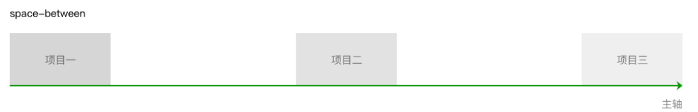
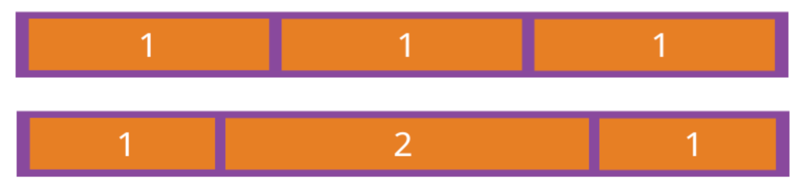

## 1. Flex 布局是什么？

Flex 是 Flexible Box 的缩写，意为"弹性布局"，用来为盒状模型提供最大的灵活性。

任何一个容器都可以指定为 Flex 布局。

```css
.box{
  display: flex;
}
```

> 设为 Flex 布局以后，子元素的`float`、`clear`和`vertical-align`属性将失效。

## 2. 基本概念

采用 Flex 布局的元素，称为 Flex 容器（flex container），简称"容器"。它的所有子元素自动成为容器成员，称为 Flex 项目（flex item），简称"项目"。


容器默认存在两根轴：水平的主轴（main axis）和垂直的交叉轴（cross axis）。主轴的开始位置（与边框的交叉点）叫做`main start`，结束位置叫做`main end`；交叉轴的开始位置叫做`cross start`，结束位置叫做`cross end`。

项目默认沿主轴排列。单个项目占据的主轴空间叫做`main size`，占据的交叉轴空间叫做`cross size`。

Flex布局相关属性正好分为两拨，一拨作用在flex容器上，还有一拨作用在flex子项上。无论作用在flex容器上，还是作用在flex子项，都是控制的flex子项的呈现，只是前者控制的是整体，后者控制的是个体。

## 3. 作用在flex容器上的属性

以下6个属性设置在容器上。

- flex-direction
- flex-wrap
- flex-flow
- justify-content
- align-items
- align-content

### 3.1 flex-direction

`flex-direction`属性决定主轴的方向（即项目的排列方向）。

```css
.box {
  flex-direction: row | row-reverse | column | column-reverse;
}
```

它可能有4个值:

1. `row`（默认值）：主轴为水平方向，起点在左端。


2. `row-reverse`：主轴为水平方向，起点在右端。


3. `column`：主轴为垂直方向，起点在上沿。


4. `column-reverse`：主轴为垂直方向，起点在下沿。


### 3.2 flex-wrap

默认情况下，项目都排在一条线（又称"轴线"）上。`flex-wrap`用来控制子项整体单行显示还是换行显示。

```css
.box{
  flex-wrap: nowrap | wrap | wrap-reverse;
}
```

它可能取三个值。

（1）`nowrap`（默认）：不换行。


> 很容易出现宽度溢出的场景

具体表现如下:

- flex子项最小内容宽度`min-content`之和大于flex容器宽度，则内容溢出，表现和`white-space:nowrap`类似。
- 如果flex子项最小内容宽度`min-content`之和小于flex容器宽度,则内容不溢出。

（2）`wrap`：换行，第一行在上方。


（3）`wrap-reverse`：换行，第一行在下方。


### 3.3 flex-flow

`flex-flow`属性是`flex-direction`属性和`flex-wrap`属性的简写形式，默认值为`row nowrap`。

```css
.box {
  flex-flow: <flex-direction> || <flex-wrap>;
}
```

### 3.4 justify-content

`justify-content`属性决定了水平方向子项的对齐和分布方式。

```css
.box {
  justify-content: flex-start | center | flex-end | space-between | space-around | space-evenly;
}
```

> 注意：它可能取6个值，具体对齐方式与轴的方向有关。下面假设主轴为从左到右。

（1）`flex-start`（默认值）：项目对齐主轴起点，项目间不留空隙。


(2)`center`：项目在主轴上居中排列，项目间不留空隙。主轴上第一个项目离主轴起点距离等于最后一个项目离主轴终点距离。


(3)`flex-end`：项目对齐主轴终点，项目间不留空隙。


(4)`space-between`：项目间间距相等，第一个项目离主轴起点和最后一个项目离主轴终点距离为0。



(5)`space-around`：与space-between相似。不同点为，第一个项目离主轴起点和最后一个项目离主轴终点距离为中间项目间间距的一半。


(6)`space-evenly`：项目间间距、第一个项目离主轴起点和最后一个项目离主轴终点距离等于项目间间距。


### 3.5 align-items

`align-items`中的`items`指的就是flex子项们，因此`align-items`指的就是flex子项们相对于flex容器在垂直方向上的对齐方式，大家是一起顶部对齐呢，底部对齐呢，还是拉伸对齐呢，类似这样。

```css
.container{
  align-items:stretch（默认值） | flex-start | center | flex-end | baseline

}
```

> 注意：它可能取5个值。具体的对齐方式与交叉轴的方向有关，下面假设交叉轴从上到下。

- stretch（默认值）：如果项目未设置高度或设为auto，项目拉伸至填满行高。如果flex子项设置了高度，则按照设置的高度值渲染，而非拉伸。
- flex-start：项目顶部与行起点对齐。
- center：项目在行中居中对齐。
- flex-end：项目底部与行终点对齐。
- baseline：项目的第一行文字的基线对齐。


### 3.6 align-content

`align-content`可以看成和`justify-content`是相似且对立的属性，`justify-content`指明水平方向flex子项的对齐和分布方式，而`align-content`则是指明垂直方向每一行flex元素的对齐和分布方式。如果所有flex子项只有一行，则`align-content`属性是没有任何效果的。

```css
.container{
  align-content: stretch（默认值） | flex-start | center | flex-end | space-between |space-around | space-evenly

}
```

- `stretch`（默认值）：当未设置项目尺寸，将各行中的项目拉伸至填满交叉轴。当设置了项目尺寸，项目尺寸不变，项目行拉伸至填满交叉轴。

- `flex-start`：首行在交叉轴起点开始排列，行间不留间距。

- `center`：行在交叉轴中点排列，行间不留间距，首行离交叉轴起点和尾行离交叉轴终点距离相等。

- `flex-end`：尾行在交叉轴终点开始排列，行间不留间距。
- `space-between`：行与行间距相等，首行离交叉轴起点和尾行离交叉轴终点距离为0。
- `space-around`：行与行间距相等，首行离交叉轴起点和尾行离交叉轴终点距离为行与行间间距的一半。

- `space-evenly`：行间间距、以及首行离交叉轴起点和尾行离交叉轴终点距离相等。


## 4. 作用在flex子项上的属性

以下6个属性设置在子项上。

- `order`
- `flex-grow`
- `flex-shrink`
- `flex-basis`
- `flex`
- `align-self`

### 4.1 order 

我们可以通过设置`order`改变某一个flex子项的排序位置。

设置项目沿主轴方向上的排列顺序，数值越小，排列越靠前。属性值为整数。默认为0。

```css
.item{
  order: 0（默认值） | <integer>
}
```

所有flex子项的默认`order`属性值是0，因此，如果我们想要某一个flex子项在最前面显示，可以设置比0小的整数，如`-1`就可以了。


### 4.2 flex-grow 

定义项目的放大比例，默认为`0`，即如果存在剩余空间，也不放大。

当项目在主轴方向上还有剩余空间时，通过设置项目扩张因子进行剩余空间的分配。属性值为项目的扩张因子，属性值取非负数。

```css
.item{
  flex-grow: 0（默认值） | <number>
}
```

具体规则如下：

1. 如果只有一个flex子项设置了`flex-grow`属性值：

- 如果`flex-grow`值小于1，则扩展的空间就总剩余空间和这个比例的计算值。
- 如果`flex-grow`值大于1，则独享所有剩余空间。

2. 如果有多个flex设置了`flex-grow`属性值：

- 如果`flex-grow`值总和小于1，则每个子项扩展的空间就总剩余空间和当前元素设置的`flex-grow`比例的计算值。
- 如果`flex-grow`值总和大于1，则所有剩余空间被利用，分配比例就是`flex-grow`属性值的比例。例如所有的flex子项都设置`flex-grow:1`，则表示剩余空白间隙大家等分，如果设置的`flex-grow`比例是1:2:1，则中间的flex子项占据一半的空白间隙，剩下的前后两个元素等分。

示例：

一个宽度为400px的容器，里面的三个项目width分别为80px，120px，140px。分别对这项目1和项目2设置flex-grow值为3和1。

```css
.container{
  display: flex;
  width: 400px; // 容器宽度为400px
}
.item1{
  width: 80px;
  flex-grow: 3;
}
.item2{
  width: 120px;
  flex-grow: 1;
}
.item3{
  /* 项目3未设置flex-grow，默认flex-grow值为0*/
  width: 140px;
}
```

在这个例子中，容器的剩余空间为 400 - (80 + 120 + 140) = 60px。剩余空间按 60 / (3 + 1 + 0) = 15px进行分配：

item1的最终宽度为：80+ (15 * 3) = 125px

item2的最终宽度为：120 + (15 * 1) = 135px

item3的最终宽度为：140 + (15 * 0) =140px


需要注意一点，当项目的扩张因子相加小于1时，剩余空间按除以1进行分配。在上面例子的基础上，我们改变各个项目的flex-grow。

```css
.container{
  display: flex;
  width: 400px; // 容器宽度为400px
}
.item1{
  width: 50px;
  flex-grow: 0.1;
}
.item2{
  width: 80px;
  flex-grow: 0.3;
}
.item3{
  width: 110px;
  flex-grow: 0.2;
}
```

在这个例子中，容器的剩余空间为 400 - (50 + 80 + 110) = 160px。由于项目的flex-grow相加0.1 + 0.3 + 0.2 = 0.6小于1，剩余空间按 160 / 1 = 160px划分。例子中的项目宽度分别为：

item1的最终宽度为：50 + (160 * 0.1) = 66px

item2的最终宽度为：80 + (160 * 0.3) = 128px

item3的最终宽度为：110 + (160 * 0.2) = 142px

如果所有项目的`flex-grow`属性都为1，则它们将等分剩余空间（如果有的话）。如果一个项目的`flex-grow`属性为2，其他项目都为1，则前者占据的剩余空间将比其他项多一倍。



### 4.3 flex-shrink

定义了项目的缩小比例，默认为1，即如果空间不足，该项目将缩小。

当项目在主轴方向上溢出时，通过设置项目收缩因子来压缩项目适应容器。属性值为项目的收缩因子，属性值取非负数。

```css
.item {
  flex-shrink: <number>; /* 默认值：1 */
}
```

已知flex子项不换行，且容器空间不足，不足的空间就是“完全收缩的尺寸”：

1. 如果只有一个flex子项设置了flex-shrink：

- `flex-shrink`值小于1，则收缩的尺寸不完全，会有一部分内容溢出flex容器。
- `flex-shrink`值大于等于1，则收缩完全，正好填满flex容器。

2. 如果多个flex子项设置了flex-shrink：

- `flex-shrink`值的总和小于1，则收缩的尺寸不完全，每个元素收缩尺寸占“完全收缩的尺寸”的比例就是设置的`flex-shrink`的值。
- `flex-shrink`值的总和大于1，则收缩完全，每个元素收缩尺寸的比例和`flex-shrink`值的比例一样。下面案例演示的就是此场景。

示例：

一个宽度为400px的容器，里面的三个项目width分别为120px，150px，180px。分别对这项目1和项目2设置`flex-shrink`值为2和3。

```css
.container{
  display: flex;
  width: 400px; /* 容器宽度为400px*/
}
.item1{
  width: 120px;
  flex-shrink: 2;
}
.item2{
  width: 150px;
  flex-shrink: 3;
}
.item3{/* 项目3未设置flex-shrink，默认flex-shrink值为1*/
  width: 180px;
}
```

在这个例子中，项目溢出 400 - (120 + 150 + 180) = -50px。计算压缩量时总权重为各个项目的宽度乘以`flex-shrink`的总和，这个例子压缩总权重为120 * 2 + 150 * 3+ 180 * 1 = 870。各个项目压缩空间大小为总溢出空间乘以项目宽度乘以`flex-shrink`除以总权重：

item1的最终宽度为：120 - 50 * 120 * 2 / 870 ≈ 106px

item2的最终宽度为：150 - 50 * 150 * 3 / 870 ≈ 124px

item3的最终宽度为：180 - 50 * 180 * 1 / 870 ≈ 169px

其中计算时候值如果为小数，则向下取整。


需要注意一点，当项目的压缩因子相加小于1时，参与计算的溢出空间不等于完整的溢出空间。在上面例子的基础上，我们改变各个项目的`flex-shrink`。

```css
.container{
  display: flex;
  width: 400px; /* 容器宽度为400px*/
}
.item1{
  width: 120px;
  flex-shrink: 0.1;
}
.item2{
  width: 150px;
  flex-shrink: 0.2;
}
.item3{
  width: 180px;
  flex-shrink: 0.3;
}
```

总权重为：120 * 0.1 + 150 * 0.2 + 180 * 0.3 = 96。参与计算的溢出空间不再是50px，而是50 * (0.1 + 0.2 + 0.3) / 1 =30：

item1的最终宽度为：120 - 30 * 120 * 0.1 / 96 ≈ 116px

item2的最终宽度为：150 - 30 * 150 * 0.2 / 96 ≈ 140px

item3的最终宽度为：180 - 30 * 180 * 0.3 / 96 ≈ 163px

> 注：如果所有项目的`flex-shrink`属性都为1，当空间不足时，都将等比例缩小。如果一个项目的`flex-shrink`属性为0，其他项目都为1，则空间不足时，前者不缩小。

### 4.4 flex-basis

`flex-basis`属性定义了在分配多余空间之前，项目占据的主轴空间（main size）。浏览器根据这个属性，计算主轴是否有多余空间。它的默认值为`auto`，即项目的本来大小。

```css
.item {
  flex-basis: <length> | auto; /* default auto */
}
```

它可以设为跟`width`或`height`属性一样的值（比如350px），则项目将占据固定空间。

当容器设置flex-direction为row或row-reverse时，flex-basis和width同时存在，flex-basis优先级高于width，也就是此时flex-basis代替项目的width属性。

当容器设置flex-direction为column或column-reverse时，flex-basis和height同时存在，flex-basis优先级高于height，也就是此时flex-basis代替项目的height属性。

需要注意的是，当flex-basis和width（或height），其中一个属性值为auto时，非auto的优先级更高。


### 4.5 flex

`flex`属性是`flex-grow`, `flex-shrink` 和 `flex-basis`的简写，默认值为`0 1 auto`。后两个属性可选。

```css
.item {
  flex: none | [ <'flex-grow'> <'flex-shrink'>? || <'flex-basis'> ]
}
```

该属性有两个快捷值：`auto` (`1 1 auto`) 和 none (`0 0 auto`)。

建议优先使用这个属性，而不是单独写三个分离的属性，因为浏览器会推算相关值。

### 4.6 align-self

`align-self`指控制单独某一个flex子项的垂直对齐方式，写在flex容器上的这个`align-items`属性，后面是items，有个s，表示子项们，是全体；这里是self，单独一个个体。其他区别不大，语法几乎一样：

```css
.item{
  align-self: auto（默认值） | flex-start | center | flex-end | baseline |stretch
}
```

唯一区别就是`align-self`多了个`auto`（默认值），表示继承自flex容器的`align-items`属性值。其他属性值含义一模一样。


> 注：该属性可能取6个值，除了auto，其他都与align-items属性完全一致。