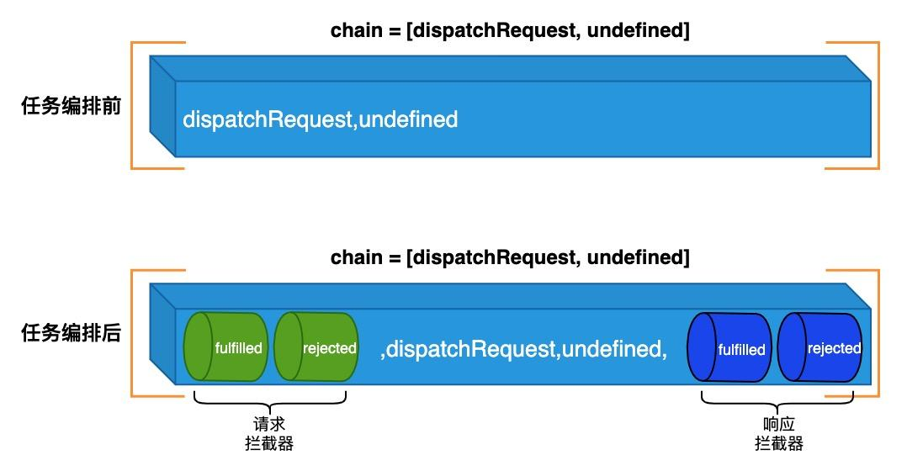
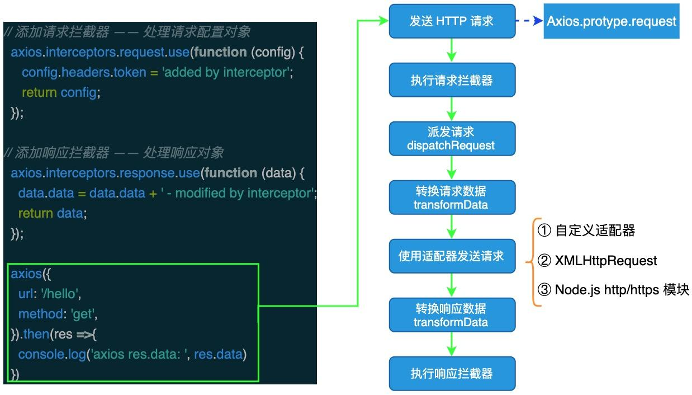
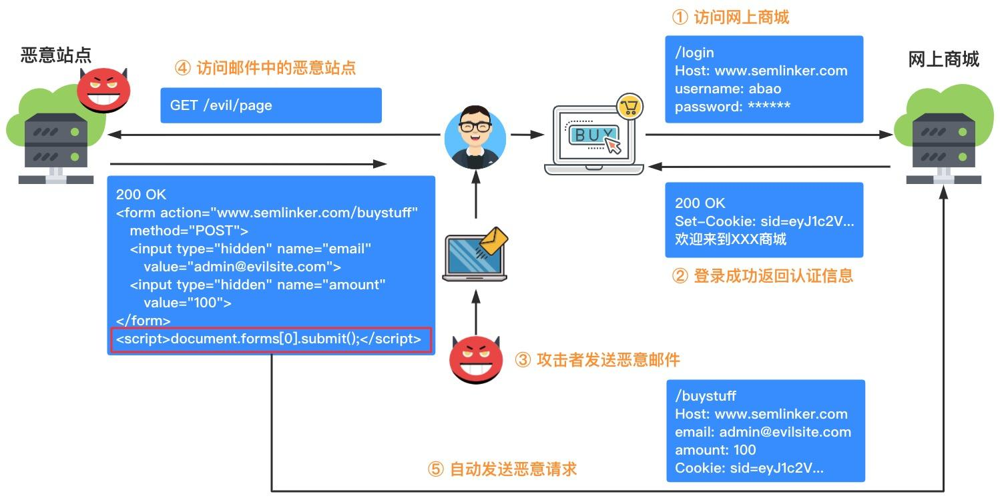

[Axios](https://github.com/axios/axios) 是一个基于 Promise 的 HTTP 客户端，同时支持浏览器和 Node.js 环境。它是一个优秀的 HTTP 客户端，被广泛地应用在大量的 Web 项目中。

# 一、Axios 简介

[Axios](https://github.com/axios/axios) 是一个基于 Promise 的 HTTP 客户端，拥有以下特性：

- 支持 Promise API；
- 能够拦截请求和响应；
- 能够转换请求和响应数据；
- 客户端支持防御 [CSRF](https://en.wikipedia.org/wiki/Cross-site_request_forgery) 攻击；
- 同时支持浏览器和 Node.js 环境；
- 能够取消请求及自动转换 JSON 数据。

在浏览器端 Axios 支持大多数主流的浏览器，比如 Chrome、Firefox、Safari 和 IE 11。此外，Axios 还拥有自己的生态：


# 二、HTTP 拦截器的设计与实现

## 2.1 拦截器简介

对于大多数 SPA 应用程序来说， 通常会使用 token 进行用户的身份认证。这就要求在认证通过后，我们需要在每个请求上都携带认证信息。针对这个需求，为了避免为每个请求单独处理，我们可以通过封装统一的 `request` 函数来为每个请求统一添加 token 信息。

但后期如果需要为某些 GET 请求设置缓存时间或者控制某些请求的调用频率的话，我们就需要不断修改 `request` 函数来扩展对应的功能。此时，如果在考虑对响应进行统一处理的话，我们的 `request` 函数将变得越来越庞大，也越来越难维护。那么对于这个问题，该如何解决呢？Axios 为我们提供了解决方案 —— 拦截器。

[Axios](https://github.com/axios/axios) 是一个基于 Promise 的 HTTP 客户端，而 HTTP 协议是基于请求和响应：


所以 Axios 提供了请求拦截器和响应拦截器来分别处理请求和响应，它们的作用如下：

- 请求拦截器：该类拦截器的作用是在请求发送前统一执行某些操作，比如在请求头中添加 token 字段。
- 响应拦截器：该类拦截器的作用是在接收到服务器响应后统一执行某些操作，比如发现响应状态码为 401 时，自动跳转到登录页。

在 Axios 中设置拦截器很简单，通过 `axios.interceptors.request` 和 `axios.interceptors.response` 对象提供的 `use` 方法，就可以分别设置请求拦截器和响应拦截器：

```js
// 添加请求拦截器
axios.interceptors.request.use(function (config) {
  config.headers.token = 'added by interceptor';
  return config;
});

// 添加响应拦截器
axios.interceptors.response.use(function (data) {
  data.data = data.data + ' - modified by interceptor';
  return data;
});
```

那么拦截器是如何工作的呢？在看具体的代码之前，我们先来分析一下它的设计思路。Axios 的作用是用于发送 HTTP 请求，而请求拦截器和响应拦截器的本质都是一个实现特定功能的函数。

我们可以按照功能把发送 HTTP 请求拆解成不同类型的子任务，比如有用于处理请求配置对象的子任务，用于发送 HTTP 请求的子任务和用于处理响应对象的子任务。当我们按照指定的顺序来执行这些子任务时，就可以完成一次完整的 HTTP 请求。

了解完这些，接下来我们将从 **任务注册、任务编排和任务调度** 三个方面来分析 Axios 拦截器的实现。

## 2.2 任务注册

通过前面拦截器的使用示例，我们已经知道如何注册请求拦截器和响应拦截器，其中请求拦截器用于处理请求配置对象的子任务，而响应拦截器用于处理响应对象的子任务。要搞清楚任务是如何注册的，就需要了解 `axios` 和 `axios.interceptors` 对象。

```js
// lib/axios.js
function createInstance(defaultConfig) {
  var context = new Axios(defaultConfig);
  var instance = bind(Axios.prototype.request, context);

  // Copy axios.prototype to instance
  utils.extend(instance, Axios.prototype, context);
  // Copy context to instance
  utils.extend(instance, context);
  return instance;
}

// Create the default instance to be exported
var axios = createInstance(defaults);
```

在 Axios 的源码中，我们找到了 `axios` 对象的定义，很明显默认的 `axios` 实例是通过 `createInstance` 方法创建的，该方法最终返回的是 `Axios.prototype.request` 函数对象。同时，我们发现了 `Axios` 的构造函数：

```js
// lib/core/Axios.js
function Axios(instanceConfig) {
  this.defaults = instanceConfig;
  this.interceptors = {
    request: new InterceptorManager(),
    response: new InterceptorManager()
  };
}
```

在构造函数中，我们找到了 `axios.interceptors` 对象的定义，也知道了 `interceptors.request` 和 `interceptors.response` 对象都是 `InterceptorManager` 类的实例。因此接下来，进一步分析 `InterceptorManager` 构造函数及相关的 `use` 方法就可以知道任务是如何注册的：

```js
// lib/core/InterceptorManager.js
function InterceptorManager() {
  this.handlers = [];
}

InterceptorManager.prototype.use = function use(fulfilled, rejected) {
  this.handlers.push({
    fulfilled: fulfilled,
    rejected: rejected
  });
  // 返回当前的索引，用于移除已注册的拦截器
  return this.handlers.length - 1;
};
```

通过观察 `use` 方法，我们可知注册的拦截器都会被保存到 `InterceptorManager` 对象的 `handlers` 属性中。下面我们用一张图来总结一下 `Axios` 对象与 `InterceptorManager` 对象的内部结构与关系：


## 2.3 任务编排

现在我们已经知道如何注册拦截器任务，但仅仅注册任务是不够，我们还需要对已注册的任务进行编排，这样才能确保任务的执行顺序。这里我们把完成一次完整的 HTTP 请求分为处理请求配置对象、发起 HTTP 请求和处理响应对象 3 个阶段。

接下来我们来看一下 Axios 如何发请求的：

```js
axios({
  url: '/hello',
  method: 'get',
}).then(res =>{
  console.log('axios res: ', res)
  console.log('axios res.data: ', res.data)
})
```

通过前面的分析，我们已经知道 `axios` 对象对应的是 `Axios.prototype.request` 函数对象，该函数的具体实现如下：

```js
// lib/core/Axios.js
Axios.prototype.request = function request(config) {
  config = mergeConfig(this.defaults, config);

  // 省略部分代码
  var chain = [dispatchRequest, undefined];
  var promise = Promise.resolve(config);

  // 任务编排
  this.interceptors.request.forEach(function unshiftRequestInterceptors(interceptor) {
    chain.unshift(interceptor.fulfilled, interceptor.rejected);
  });

  this.interceptors.response.forEach(function pushResponseInterceptors(interceptor) {
    chain.push(interceptor.fulfilled, interceptor.rejected);
  });

  // 任务调度
  while (chain.length) {
    promise = promise.then(chain.shift(), chain.shift());
  }

  return promise;
};
```

任务编排的代码比较简单，我们来看一下任务编排前和任务编排后的对比图：



## 2.4 任务调度

任务编排完成后，要发起 HTTP 请求，我们还需要按编排后的顺序执行任务调度。在 Axios 中具体的调度方式很简单，具体如下所示：

```javascript
 // lib/core/Axios.js
Axios.prototype.request = function request(config) {
  // 省略部分代码
  var promise = Promise.resolve(config);
  while (chain.length) {
    promise = promise.then(chain.shift(), chain.shift());
  }
}
```

因为 chain 是数组，所以通过 while 语句我们就可以不断地取出设置的任务，然后组装成 Promise 调用链从而实现任务调度，对应的处理流程如下图所示：


下面我们来回顾一下 Axios 拦截器完整的使用流程：

```javascript
// 添加请求拦截器 —— 处理请求配置对象
axios.interceptors.request.use(function (config) {
  config.headers.token = 'added by interceptor';
  return config;
});

// 添加响应拦截器 —— 处理响应对象
axios.interceptors.response.use(function (data) {
  data.data = data.data + ' - modified by interceptor';
  return data;
});

axios({
  url: '/hello',
  method: 'get',
}).then(res =>{
  console.log('axios res.data: ', res.data)
})
```

介绍完 Axios 的拦截器，我们来总结一下它的优点。Axios 通过提供拦截器机制，让开发者可以很容易在请求的生命周期中自定义不同的处理逻辑。此外，也可以通过拦截器机制来灵活地扩展 Axios 的功能，比如 Axios 生态中列举的 [axios-response-logger](https://github.com/srph/axios-response-logger) 和 [axios-debug-log](https://github.com/Gerhut/axios-debug-log) 这两个库。

参考 Axios 拦截器的设计模型，我们就可以抽出以下通用的任务处理模型：


# 三、HTTP 适配器的设计与实现

## 3.1 默认 HTTP 适配器

Axios 同时支持浏览器和 Node.js 环境，对于浏览器环境来说，我们可以通过 `XMLHttpRequest` 或 `fetch` API 来发送 HTTP 请求，而对于 Node.js 环境来说，我们可以通过 Node.js 内置的 `http` 或 `https` 模块来发送 HTTP 请求。

为了支持不同的环境，Axios 引入了适配器。在 HTTP 拦截器设计部分，我们看到了一个 `dispatchRequest` 方法，该方法用于发送 HTTP 请求，它的具体实现如下所示：

```javascript
// lib/core/dispatchRequest.js
module.exports = function dispatchRequest(config) {
  // 省略部分代码
  var adapter = config.adapter || defaults.adapter;
  
  return adapter(config).then(function onAdapterResolution(response) {
    // 省略部分代码
    return response;
  }, function onAdapterRejection(reason) {
    // 省略部分代码
    return Promise.reject(reason);
  });
};
```

通过查看以上的 `dispatchRequest` 方法，我们可知 Axios 支持自定义适配器，同时也提供了默认的适配器。对于大多数场景，我们并不需要自定义适配器，而是直接使用默认的适配器。因此，默认的适配器就会包含浏览器和 Node.js 环境的适配代码，其具体的适配逻辑如下所示：

```javascript
// lib/defaults.js
var defaults = {
  adapter: getDefaultAdapter(),
  xsrfCookieName: 'XSRF-TOKEN',
  xsrfHeaderName: 'X-XSRF-TOKEN',
  //...
}

function getDefaultAdapter() {
  var adapter;
  if (typeof XMLHttpRequest !== 'undefined') {
    // For browsers use XHR adapter
    adapter = require('./adapters/xhr');
  } else if (typeof process !== 'undefined' && 
    Object.prototype.toString.call(process) === '[object process]') {
    // For node use HTTP adapter
    adapter = require('./adapters/http');
  }
  return adapter;
}
```

在 `getDefaultAdapter` 方法中，首先通过平台中特定的对象来区分不同的平台，然后再导入不同的适配器，具体的代码比较简单，这里就不展开介绍。

## 3.2 自定义适配器

其实除了默认的适配器外，我们还可以自定义适配器。那么如何自定义适配器呢？这里我们可以参考 Axios 提供的示例：

```javascript
var settle = require('./../core/settle');
module.exports = function myAdapter(config) {
  // 当前时机点：
  //  - config配置对象已经与默认的请求配置合并
  //  - 请求转换器已经运行
  //  - 请求拦截器已经运行
  
  // 使用提供的config配置对象发起请求
  // 根据响应对象处理Promise的状态
  return new Promise(function(resolve, reject) {
    var response = {
      data: responseData,
      status: request.status,
      statusText: request.statusText,
      headers: responseHeaders,
      config: config,
      request: request
    };

    settle(resolve, reject, response);

    // 此后:
    //  - 响应转换器将会运行
    //  - 响应拦截器将会运行
  });
}
```

在以上示例中，我们主要关注转换器、拦截器的运行时机点和适配器的基本要求。比如当调用自定义适配器之后，需要返回 Promise 对象。这是因为 Axios 内部是通过 Promise 链式调用来完成请求调度，不清楚的小伙伴可以重新阅读 “拦截器的设计与实现” 部分的内容。

现在我们已经知道如何自定义适配器了，那么自定义适配器有什么用呢？在 Axios 生态中，阿宝哥发现了 [axios-mock-adapter](https://github.com/ctimmerm/axios-mock-adapter) 这个库，该库通过自定义适配器，让开发者可以轻松地模拟请求。对应的使用示例如下所示：

```javascript
var axios = require("axios");
var MockAdapter = require("axios-mock-adapter");

// 在默认的Axios实例上设置mock适配器
var mock = new MockAdapter(axios);

// 模拟 GET /users 请求
mock.onGet("/users").reply(200, {
  users: [{ id: 1, name: "John Smith" }],
});

axios.get("/users").then(function (response) {
  console.log(response.data);
});
```

对 MockAdapter 感兴趣的小伙伴，可以自行了解一下 [axios-mock-adapter](https://github.com/ctimmerm/axios-mock-adapter) 这个库。到这里我们已经介绍了 Axios 的拦截器与适配器，下面阿宝哥用一张图来总结一下 Axios 使用请求拦截器和响应拦截器后，请求的处理流程：



# 四、CSRF 防御

## 4.1 CSRF 简介

**跨站请求伪造**（Cross-site request forgery），通常缩写为 **CSRF** 或者 **XSRF**， 是一种挟制用户在当前已登录的 Web 应用程序上执行非本意的操作的攻击方法。

跨站请求攻击，简单地说，是攻击者通过一些技术手段欺骗用户的浏览器去访问一个自己曾经认证过的网站并运行一些操作（如发邮件，发消息，甚至财产操作如转账和购买商品）。由于浏览器曾经认证过，所以被访问的网站会认为是真正的用户操作而去运行。

为了让小伙伴更好地理解上述的内容，阿宝哥画了一张跨站请求攻击示例图：



在上图中攻击者利用了 Web 中用户身份验证的一个漏洞：**简单的身份验证只能保证请求发自某个用户的浏览器，却不能保证请求本身是用户自愿发出的**。既然存在以上的漏洞，那么我们应该怎么进行防御呢？接下来我们来介绍一些常见的 CSRF 防御措施。

## 4.2 CSRF 防御措施

### 4.2.1 检查 Referer 字段

HTTP 头中有一个 [Referer](https://developer.mozilla.org/zh-CN/docs/Web/HTTP/Headers/Referer) 字段，这个字段用以标明请求来源于哪个地址。**在处理敏感数据请求时，通常来说，Referer 字段应和请求的地址位于同一域名下**。

以示例中商城操作为例，Referer 字段地址通常应该是商城所在的网页地址，应该也位于 [www.semlinker.com](http://www.semlinker.com) 之下。而如果是 CSRF 攻击传来的请求，Referer 字段会是包含恶意网址的地址，不会位于 [www.semlinker.com](http://www.semlinker.com) 之下，这时候服务器就能识别出恶意的访问。

这种办法简单易行，仅需要在关键访问处增加一步校验。但这种办法也有其局限性，因其完全依赖浏览器发送正确的 Referer 字段。虽然 HTTP 协议对此字段的内容有明确的规定，但并无法保证来访的浏览器的具体实现，亦无法保证浏览器没有安全漏洞影响到此字段。并且也存在攻击者攻击某些浏览器，篡改其 Referer 字段的可能。

### 4.2.2 同步表单 CSRF 校验

CSRF 攻击之所以能够成功，是因为服务器无法区分正常请求和攻击请求。针对这个问题我们可以要求所有的用户请求都携带一个 CSRF 攻击者无法获取到的 token。对于 CSRF 示例图中的表单攻击，我们可以使用 **同步表单 CSRF 校验** 的防御措施。

**同步表单 CSRF 校验** 就是在返回页面时将 token 渲染到页面上，在 form 表单提交的时候通过隐藏域或者作为查询参数把 CSRF token 提交到服务器。比如，在同步渲染页面时，在表单请求中增加一个 `_csrf` 的查询参数，这样当用户在提交这个表单的时候就会将 CSRF token 提交上来：

```html
<form method="POST" action="/upload?_csrf={{由服务端生成}}" enctype="multipart/form-data">
  用户名: <input name="name" />
  选择头像: <input name="file" type="file" />
  <button type="submit">提交</button>
</form>
```

### 4.2.3 双重 Cookie 防御

**双重 Cookie 防御** 就是将 token 设置在 Cookie 中，在提交（POST、PUT、PATCH、DELETE）等请求时提交 Cookie，并通过请求头或请求体带上 Cookie 中已设置的 token，服务端接收到请求后，再进行对比校验。

下面我们以 jQuery 为例，来看一下如何设置 CSRF token：

```javascript
let csrfToken = Cookies.get('csrfToken');

function csrfSafeMethod(method) {
  // 以下HTTP方法不需要进行CSRF防护
  return (/^(GET|HEAD|OPTIONS|TRACE)$/.test(method));
}

$.ajaxSetup({
  beforeSend: function(xhr, settings) {
    if (!csrfSafeMethod(settings.type) && !this.crossDomain) {
      xhr.setRequestHeader('x-csrf-token', csrfToken);
    }
  },
});
```

介绍完 CSRF 攻击的方式和防御手段，最后我们来看一下 Axios 是如何防御 CSRF 攻击的。

## 4.3 Axios CSRF 防御

Axios 提供了 `xsrfCookieName` 和 `xsrfHeaderName` 两个属性来分别设置 CSRF 的 Cookie 名称和 HTTP 请求头的名称，它们的默认值如下所示：

```javascript
// lib/defaults.js
var defaults = {
  adapter: getDefaultAdapter(),

  // 省略部分代码
  xsrfCookieName: 'XSRF-TOKEN',
  xsrfHeaderName: 'X-XSRF-TOKEN',
};
```

前面我们已经知道在不同的平台中，Axios 使用不同的适配器来发送 HTTP 请求，这里我们以浏览器平台为例，来看一下 Axios 如何防御 CSRF 攻击：

```javascript
// lib/adapters/xhr.js
module.exports = function xhrAdapter(config) {
  return new Promise(function dispatchXhrRequest(resolve, reject) {
    var requestHeaders = config.headers;
    
    var request = new XMLHttpRequest();
    // 省略部分代码
    
    // 添加xsrf头部
    if (utils.isStandardBrowserEnv()) {
      var xsrfValue = (config.withCredentials || isURLSameOrigin(fullPath)) && config.xsrfCookieName ?
        cookies.read(config.xsrfCookieName) :
        undefined;

      if (xsrfValue) {
        requestHeaders[config.xsrfHeaderName] = xsrfValue;
      }
    }

    request.send(requestData);
  });
};
```

看完以上的代码，相信小伙伴们就已经知道答案了，原来 Axios 内部是使用 **双重 Cookie 防御** 的方案来防御 CSRF 攻击。好的，到这里本文的主要内容都已经介绍完了，其实 Axios 项目还有一些值得我们借鉴的地方，比如 CancelToken 的设计、异常处理机制等，感兴趣的小伙伴可以自行学习一下。