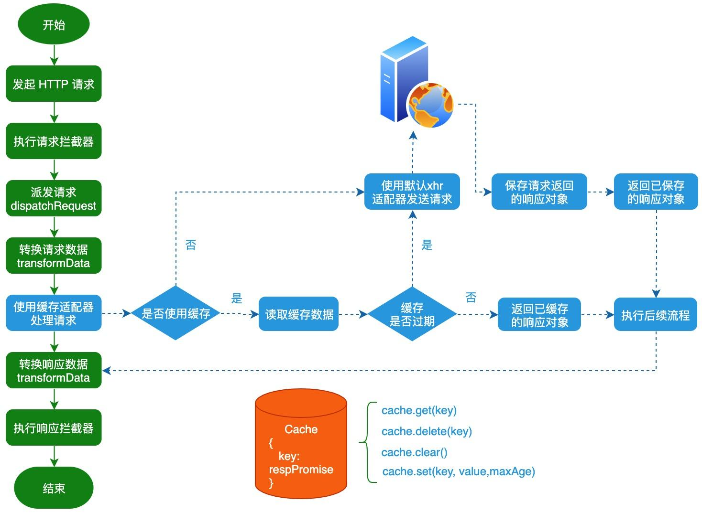
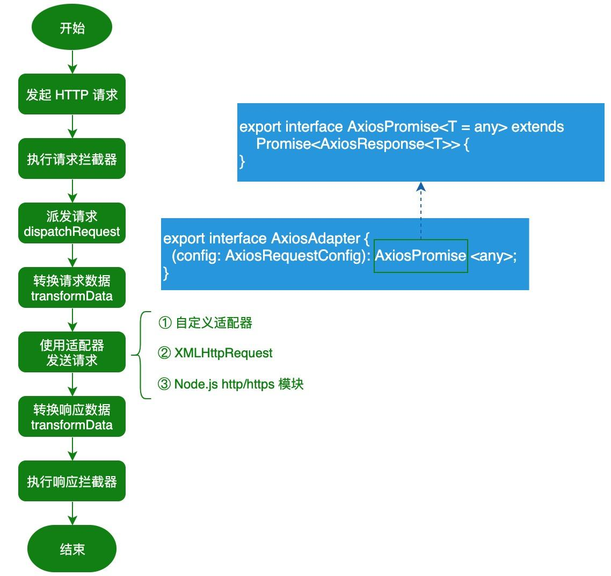
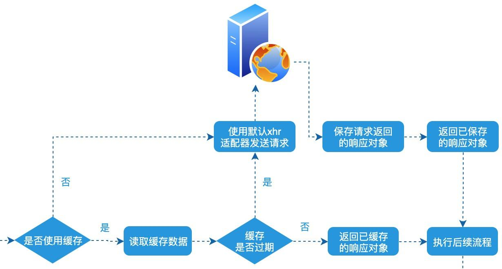

Axios 中如何通过 **增强默认适配器** 来缓存请求数据。那么为什么要缓存请求数据呢？这是因为在缓存未失效时，我们可以直接使用已缓存的数据，而不需发起请求从服务端获取数据，这样不仅可以减少 HTTP 请求而且还能减少等待时间从而提高用户体验。

因为本文将使用 [Axios](https://github.com/axios/axios) 提供的默认适配器来实现缓存请求数据的功能，我们先来看一下整体的流程图：



# 一、如何设计缓存

在计算中，缓存是一个高速数据存储层，其中存储了数据子集，且通常是 **短暂性** 存储，这样日后再次请求该数据时，速度要比访问数据的主存储位置快。通过缓存，你可以高效地重用之前检索或计算的数据。了解完缓存的作用之后，我们来设计缓存的 API：

- get(key)：从缓存中获取指定 `key` 对应的值；
- delete(key)：从缓存中删除指定 `key` 对应的值；
- clear()：清空已缓存的数据；
- set(key, value, maxAge)：保存键值对，同时支持设置缓存的最大时间，即 `maxAge` 单位为毫秒。

基于上述的缓存 API，我们可以实现一个简单的缓存功能，具体代码如下所示：

```javascript
const MemoryCache = {
  data: {},
  set(key, value, maxAge) { // 保存数据
    this.data[key] = {
      maxAge: maxAge || 0,
      value,
      now: Date.now(),
     };
  },
  get(key) { // 从缓存中获取指定 key 对应的值。
    const cachedItem = this.data[key];
    if (!cachedItem) return null;
    const isExpired = Date.now() - cachedItem.now > cachedItem.maxAge;
    isExpired && this.delete(key);
    return isExpired ? null : cachedItem.value;
  },
  delete(key) { // 从缓存中删除指定 key 对应的值。
    return delete this.data[key];
  },
  clear() { // 清空已缓存的数据。
    this.data = {};
  },
};
```

其实除了自定义缓存对象之外，你也可以使用成熟的第三方库，比如 [lru-cache](https://www.npmjs.com/package/lru-cache)。

> LRU 缓存淘汰算法就是一种常用策略。LRU 的全称是 Least Recently Used，也就是说我们认为最近使用过的数据应该是是「有用的」，很久都没用过的数据应该是无用的，内存满了就优先删那些很久没用过的数据。

# 二、如何增强默认适配器

Axios 引入了适配器，使得它可以同时支持浏览器和 Node.js 环境。对于浏览器环境来说，它通过封装 `XMLHttpRequest` API 来发送 HTTP 请求，而对于 Node.js 环境来说，它通过封装 Node.js 内置的 `http` 和 `https` 模块来发送 HTTP 请求。

在介绍如何增强默认适配器之前，我们先来回顾一下 Axios 完整请求的流程：



了解完 Axios 完整请求的流程之后，我们再来看一下 Axios 内置的 `xhrAdapter` 适配器，它被定义在 `lib/adapters/xhr.js` 文件中：

```js
// lib/adapters/xhr.js
module.exports = function xhrAdapter(config) {
  return new Promise(function dispatchXhrRequest(resolve, reject) {
    var requestData = config.data;
    var requestHeaders = config.headers;

    var request = new XMLHttpRequest();
    // 省略大部分代码
    var fullPath = buildFullPath(config.baseURL, config.url);
    request.open(config.method.toUpperCase(), buildURL(fullPath, config.params, config.paramsSerializer), true);
    // Set the request timeout in MS
    request.timeout = config.timeout;

    // Listen for ready state
    request.onreadystatechange = function handleLoad() { ... }

    // Send the request
    request.send(requestData);
  });
};
```

很明显 `xhrAdapter` 适配器是一个函数对象，它接收一个 `config` 参数并返回一个 `Promise` 对象。而在 `xhrAdapter` 适配器内部，最终会使用 XMLHttpRequest API 来发送 HTTP 请求。为了实现缓存请求数据的功能，我们就可以考虑通过高阶函数来增强 `xhrAdapter` 适配器的功能。

## 2.1 定义辅助函数

### 2.1.1 定义 generateReqKey 函数

在增强 `xhrAdapter` 适配器之前，我们先来定义一个 `generateReqKey` 函数，该函数用于根据当前请求的信息，生成请求 Key；

```javascript
function generateReqKey(config) {
  const { method, url, params, data } = config;
  return [method, url, Qs.stringify(params), Qs.stringify(data)].join("&");
}
```

通过 `generateReqKey` 函数生成的请求 key，将作为缓存项的 key，而对应的 value 就是默认 `xhrAdapter` 适配器返回的 Promise 对象。

### 2.1.2 定义 isCacheLike 函数

`isCacheLike` 函数用于判断传入的 cache 参数是否实现了前面定义的 Cache API，利用该函数，我们允许用户为每个请求自定义 Cache 对象。

```javascript
function isCacheLike(cache) {
	return !!(cache.set && cache.get && cache.delete && cache.clear  
		&& typeof cache.get === 'function' && typeof cache.set === 'function' 
    && typeof cache.delete === 'function' && typeof cache.clear === 'function'
  );
}
```

## 2.2 定义 cacheAdapterEnhancer 函数

为了让用户能够更灵活地控制数据缓存的功能，我们定义了一个 `cacheAdapterEnhancer` 函数，该函数支持两个参数：

- adapter：预增强的 Axios 适配器对象；
- options：缓存配置对象，该对象支持 4 个属性，分别用于配置不同的功能：
  - maxAge：全局设置缓存的最大时间；
  - enabledByDefault：是否启用缓存，默认为 true；
  - cacheFlag：缓存标志，用于配置请求 config 对象上的缓存属性；
  - defaultCache：用于设置使用的缓存对象。

了解完 `cacheAdapterEnhancer` 函数的参数之后，我们来看一下该函数的具体实现：

```javascript
function cacheAdapterEnhancer(adapter, options) {
  const { maxAge, enabledByDefault = true,
    cacheFlag = "cache", defaultCache = MemoryCache,
  } = options;
  
  return (config) => {
    const { url, method, params, forceUpdate } = config;
    let useCache = config[cacheFlag] !== undefined && config[cacheFlag] !== null
        ? config[cacheFlag]
        : enabledByDefault;
      if (method === "get" && useCache) {
        const cache = isCacheLike(useCache) ? useCache : defaultCache;
        let requestKey = generateReqKey(config);  // 生成请求Key
        let responsePromise = cache.get(requestKey); // 从缓存中获取请求key对应的响应对象
        if (!responsePromise || forceUpdate) { // 缓存未命中/失效或强制更新时，则重新请求数据
           responsePromise = (async () => {
             try {
               return await adapter(config);  // 使用默认的xhrAdapter发送请求
             } catch (reason) {
                 cache.delete(requestKey);
                 throw reason;
                }
           })();
           cache.set(requestKey, responsePromise, maxAge);  // 保存请求返回的响应对象
           return responsePromise; // 返回已保存的响应对象
       }
       return responsePromise;
     }
     return adapter(config); // 使用默认的xhrAdapter发送请求
   };
}
```

以上的代码并不会复杂，核心的处理逻辑如下图所示：



## 2.3 使用 cacheAdapterEnhancer 函数

### 2.3.1 创建 Axios 对象并配置 adapter 选项

```javascript
const http = axios.create({
  baseURL: "https://jsonplaceholder.typicode.com",
  adapter: cacheAdapterEnhancer(axios.defaults.adapter, {
    enabledByDefault: false, // 默认禁用缓存
    maxAge: 5000, // 缓存时间为5s
  }),
});
```

### 2.3.2 使用 http 对象发送请求

```javascript
// 使用缓存
async function requestWithCache() {
  const response = await http.get("/todos/1", { cache: true });
  console.dir(response);
}

// 不使用缓存
async function requestWithoutCache() {
  const response = await http.get("/todos/1", { cache: false });
  console.dir(response);
}
```

其实 cache 属性除了支持布尔值之外，我们可以配置实现 Cache API 的缓存对象，具体的使用示例如下所示：

```javascript
const customCache = { get() {/*...*/}, set() {/*...*/}, delete() {/*...*/}, clear() {/*...*/}};
      
async function requestForceUpdate() {
  const response = await http.get("/todos/1", {
    cache: customCache,
    forceUpdate: true,
  });
  console.dir(response);
}
```

好了，如何通过增强 `xhrAdapter` 适配器来实现 Axios 缓存请求数据的功能已经介绍完了。由于完整的示例代码内容比较多，阿宝哥就不放具体的代码了。感兴趣的小伙伴，可以访问以下地址浏览示例代码。