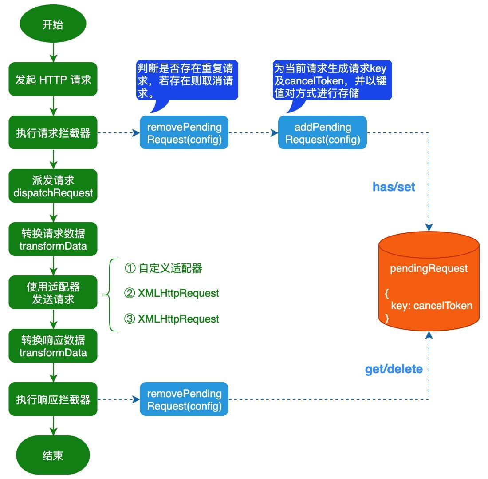
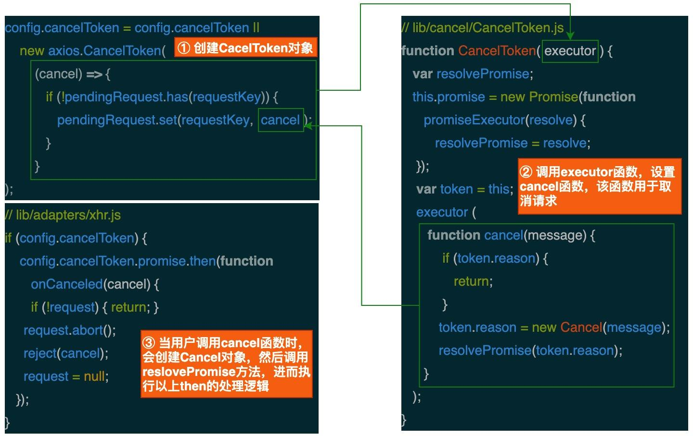

在 Web 项目开发过程中，我们经常会遇到重复请求的场景，如果系统不对重复的请求进行处理，则可能会导致系统出现各种问题。比如重复的 `post` 请求可能会导致服务端产生两笔记录。那么重复请求是如何产生的呢？这里我们举 2 个常见的场景：

- 假设页面中有一个按钮，用户点击按钮后会发起一个 AJAX 请求。如果未对该按钮进行控制，当用户快速点击按钮时，则会发出重复请求。

- 假设在考试结果查询页面中，用户可以根据 **“已通过”、“未通过” 和 “全部”** 3 种查询条件来查询考试结果。如果请求的响应比较慢，当用户在不同的查询条件之前快速切换时，就会产生重复请求。

# 一、如何取消请求

Axios是一个基于 Promise 的 HTTP 客户端，同时支持浏览器和 Node.js 环境。它是一个优秀的 HTTP 客户端，被广泛地应用在大量的 Web 项目中。对于浏览器环境来说，Axios 底层是利用 `XMLHttpRequest` 对象来发起 HTTP 请求。如果要取消请求的话，我们可以通过调用 `XMLHttpRequest` 对象上的 `abort` 方法来取消请求：

```js
let xhr = new XMLHttpRequest();
xhr.open("GET", "https://developer.mozilla.org/", true);
xhr.send();
setTimeout(() => xhr.abort(), 300);
```

而对于 Axios 来说，我们可以通过 Axios 内部提供的 `CancelToken` 来取消请求：

```js
// 用CancelToken.source工厂方法创建 cancel token
const CancelToken = axios.CancelToken;
const source = CancelToken.source();

axios.get('/user/12345', {
  cancelToken: source.token
}).catch(function(thrown) {
  if (axios.isCancel(thrown)) {
    console.log('Request canceled', thrown.message);
  } else {
     // 处理错误
  }
});

axios.post('/user/12345', {
  name: 'semlinker'
}, {
  cancelToken: source.token
})

source.cancel('Operation canceled by the user.'); // 取消请求，参数是可选的
```

此外，你也可以通过调用 `CancelToken` 的构造函数来创建 `CancelToken`，具体如下所示：

```js
// 通过传递一个 executor 函数到 CancelToken 的构造函数来创建 cancel token
const CancelToken = axios.CancelToken;
let cancel;

axios.get('/user/12345', {
  cancelToken: new CancelToken(function executor(c) {
    // executor 函数接收一个 cancel 函数作为参数
    cancel = c;
  })
});

cancel(); // 取消请求
```

# 二、如何判断重复请求

**当请求方式、请求 URL 地址和请求参数都一样时，我们就可以认为请求是一样的**。因此在每次发起请求时，我们就可以根据当前请求的请求方式、请求 URL 地址和请求参数来生成一个唯一的 key，同时为每个请求创建一个专属的 CancelToken，然后把 key 和 cancel 函数以键值对的形式保存到 Map 对象中，使用 Map 的好处是可以快速的判断是否有重复的请求：

```js
import qs from 'qs'

const pendingRequest = new Map();
// GET -> params；POST -> data
const requestKey = [method, url, qs.stringify(params), qs.stringify(data)].join('&'); 
const cancelToken = new CancelToken(function executor(cancel) {
  if(!pendingRequest.has(requestKey)){
    // 设置cancelToken
    pendingRequest.set(requestKey, cancel);
  }
})
```

当出现重复请求的时候，我们就可以使用 cancel 函数来取消前面已经发出的请求，在取消请求之后，我们还需要把取消的请求从 `pendingRequest` 中移除。现在我们已经知道如何取消请求和如何判断重复请求，下面我们来介绍如何取消重复请求。

# 三、如何取消重复请求

因为我们需要对所有的请求都进行处理，所以我们可以考虑使用 Axios 的拦截器机制来实现取消重复请求的功能。Axios 为开发者提供了请求拦截器和响应拦截器，它们的作用如下：

- 请求拦截器：该类拦截器的作用是在请求发送前统一执行某些操作，比如在请求头中添加 token 字段。
- 响应拦截器：该类拦截器的作用是在接收到服务器响应后统一执行某些操作，比如发现响应状态码为 401 时，自动跳转到登录页。

## 3.1 定义辅助函数

在配置请求拦截器和响应拦截器前，先来定义 3 个辅助函数：

- `generateReqKey`：用于根据当前请求的信息，生成请求 Key；

```js
function generateReqKey(config) {
  // 请求方式、请求地址、请求参数生成的字符串来作为是否重复请求的依据
  const { method, url, params, data } = config;
  const requestKey =  [ method, url, Qs.stringify(params), Qs.stringify(data)].join('&');
  return requestKey
}
```

- `addPendingRequest`：用于把当前请求信息添加到pendingRequest对象中；

```js
const pendingRequest = new Map();
function addPendingRequest(config) {
  const requestKey = generateReqKey(config);
  config.cancelToken = config.cancelToken || new axios.CancelToken((cancel) => {
    if (!pendingRequest.has(requestKey)) {
       pendingRequest.set(requestKey, cancel);
    }
  });
}
```

- `removePendingRequest`：检查是否存在重复请求，若存在则取消已发的请求。

```js
function removePendingRequest(config) {
  const requestKey = generateReqKey(config);
  if (pendingRequest.has(requestKey)) {
     const cancelToken = pendingRequest.get(requestKey);
    // 取消之前发送的请求
     cancelToken(requestKey);
    // 请求对象中删除requestKey
     pendingRequest.delete(requestKey);
  }
}
```

创建好 `generateReqKey`、`addPendingRequest` 和 `removePendingRequest` 函数之后，我们就可以设置请求拦截器和响应拦截器了。

## 3.2 设置请求拦截器

```js
axios.interceptors.request.use(
  function (config) {
    removePendingRequest(config); // 检查是否存在重复请求，若存在则取消已发的请求
    addPendingRequest(config); // 把当前请求信息添加到pendingRequest对象中
    return config;
  },
  (error) => {
     return Promise.reject(error);
  }
);
```

## 3.3 设置响应拦截器

```js
axios.interceptors.response.use(
  (response) => {
     removePendingRequest(response.config); // 从pendingRequest对象中移除请求
     return response;
   },
   (error) => {
      removePendingRequest(error.config || {}); // 从pendingRequest对象中移除请求
      if (axios.isCancel(error)) {
        console.log("已取消的重复请求：" + error.message);
      } else {
        // 添加异常处理
      }
      return Promise.reject(error);
   }
);
```

当出现重复请求时，之前已发送且未完成的请求会被取消掉。下面我们用一张流程图来总结一下取消重复请求的处理流程：



# 四、CancelToken 的工作原理

在前面的示例中，我们是通过调用 `CancelToken` 构造函数来创建 `CancelToken` 对象：

```js
new axios.CancelToken((cancel) => {
  if (!pendingRequest.has(requestKey)) {
    pendingRequest.set(requestKey, cancel);
  }
})
```

所以接下来，我们来分析 `CancelToken` 构造函数，该函数被定义在 `lib/cancel/CancelToken.js` 文件中：

```js
// lib/cancel/CancelToken.js
function CancelToken(executor) {
  if (typeof executor !== 'function') {
    throw new TypeError('executor must be a function.');
  }

  var resolvePromise;
  this.promise = new Promise(function promiseExecutor(resolve) {
    resolvePromise = resolve;
  });

  var token = this;
  executor(function cancel(message) { // 设置cancel对象
    if (token.reason) {
      return; // Cancellation has already been requested
    }
    token.reason = new Cancel(message);
    resolvePromise(token.reason);
  });
}
```

由以上代码可知，`cancel` 对象是一个函数，当我们调用该函数后，会创建 `Cancel` 对象并调用 `resolvePromise` 方法。该方法执行后，`CancelToken` 对象上 `promise` 属性所指向的 `promise` 对象的状态将变为 `resolved`。那么这样做的目的是什么呢？这里我们从 `lib/adapters/xhr.js` 文件中找到了答案：

```js
// lib/adapters/xhr.js 
if (config.cancelToken) {
  config.cancelToken.promise.then(function onCanceled(cancel) {
    if (!request) { return; }
    request.abort(); // 取消请求
    reject(cancel);
    request = null;
  });
}
```

看完上述的内容，可能有的小伙伴还不是很能理解 `CancelToken` 的工作原理，所以阿宝哥又画了一张图来帮助大家理解 `CancelToken` 的工作原理：



> **需要注意的是已取消的请求可能已经达到服务端，针对这种情形，服务端的对应接口需要进行幂等控制**。

其他代码：

```js
import axios from 'axios'
import baseURL from './config'
import qs from 'qs'

const pendingRequest = new Map(); // 请求对象
const CancelToken = axios.CancelToken;

axios.defaults.timeout = 30000
axios.defaults.baseURL = baseURL.target

// 添加请求拦截器
axios.interceptors.request.use(function(config) {
  // 在发送请求之前做些什么
  config.headers = {
      'content-type': 'application/json',
      'token': getToken()
  }
  // 获取请求key
  let requestKey = getReqKey(config);

  // 判断是否是重复请求
  if (pendingRequest.has(requestKey)) { // 是重复请求
    removeReqKey(requestKey); // 取消
  }else{
    // 设置cancelToken
    config.cancelToken = new CancelToken(function executor(cancel) {
      pendingRequest.set(requestKey, cancel); // 设置
    })
  }

  return config;
}, function (error) {
  // 请求错误
  return Promise.reject(error);
});

// 添加响应拦截器
axios.interceptors.response.use(function (response) {
  // 请求对象中删除requestKey
  let requestKey = getReqKey(response.config);
  removeReqKey(requestKey);

  // 对返回数据做点啥 比如状态进行拦截
  if (response.data.status !== 200) {
      Toast({
        message: response.data.message,
        type: 'warning',
        duration: 1000
      })
      return
    }
    
  // 没问题 返回服务器数据
  return response.data;
}, function (error) {
  let requestKey = getReqKey(error.config);
  removeReqKey(requestKey);
  
  // 响应错误
  return Promise.reject(error);
});

// 获取请求key
function getReqKey(config) {
  // 请求方式、请求地址、请求参数生成的字符串来作为是否重复请求的依据
  const { method, url, params, data } = config; // 解构出来这些参数
  // GET ---> params  POST ---> data
  const requestKey =  [ method, url, qs.stringify(params), qs.stringify(data)].join('&');
  return requestKey;
}

// 取消重复请求
function removeReqKey(key) {
  const cancelToken = pendingRequest.get(key);
  cancelToken(key); // 取消之前发送的请求
  pendingRequest.delete(key); // 请求对象中删除requestKey
}
```

