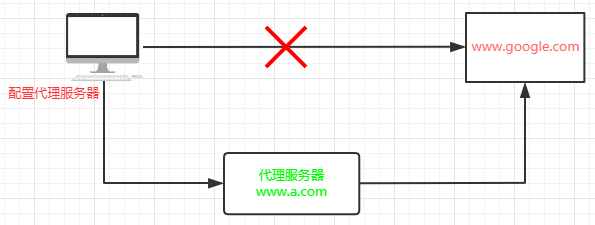
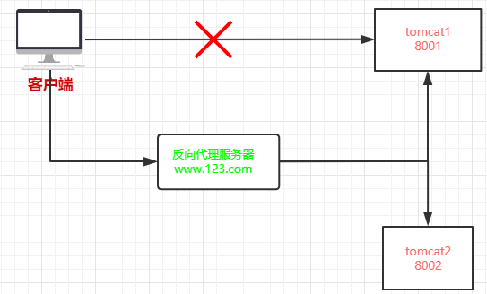
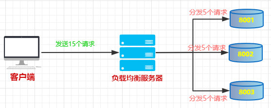
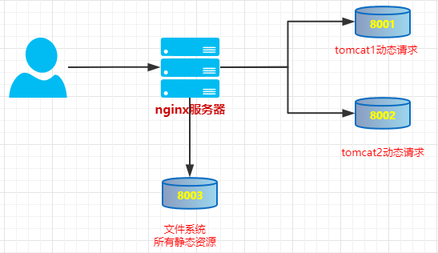
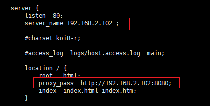
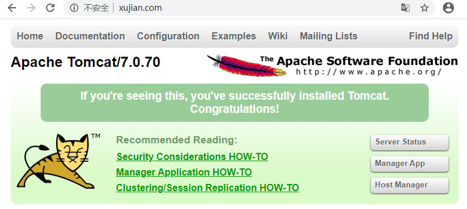
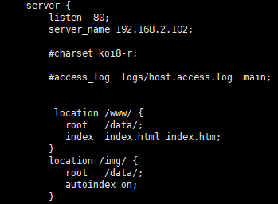
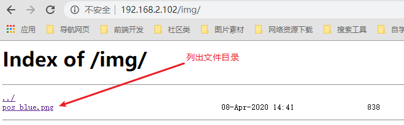
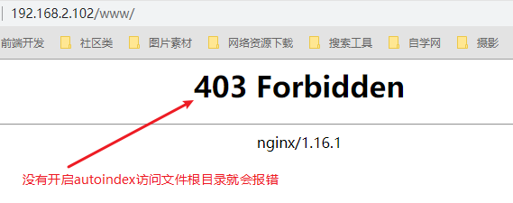

# 1.nginx简介

Nginx是高性能的HTTP和反向代理的服务器，特点是占有内存少，处理高并发能力十分强大， 能经受高负载的考验。

Nginx可以作为静态页面的web服务器，同时还支持CGI协议的动态语言，比如perl,php等。但是不支持java。Java程序只能通过与tomcat配合完成。

Nginx专为性能优化而开发，性能是其最重要的考量，实现上非常注重效率。  

## 1.1正向代理

如果把局域网外的Internet想象成一个巨大的资源库，则局域网中的客户端要访问Internet，则需要通过代理服务器来访问，这种代理服务就称为正向代理。  

需要在客户端配置代理服务器进行指定网站访问：



## 1.2反向代理

反向代理，其实客户端对代理是无感知的，因为客户端不需要任何配置就可以访问，我们只需要将请求发送到反向代理服务器，由反向代理服务器去选择目标服务

器获取数据后，再返回给客户端，此时反向代理服务器和目标服务器对外就是一个服务器，暴露的是代理服务器地址，隐藏了真实服务器IP地址。  



## 1.3负载均衡

增加服务器的数量，然后将请求分发到各个服务器上，将原先请求集中到单个服务器上的情况改为将请求分发到多个服务器上，将负载分发到不同的服务器，也就

是我们所说的负载均衡。



## 1.4动静分离

为了加快网站的解析速度，可以把动态页面和静态页面由不同的服务器来解析，加快解析速度。降低原来单个服务器的压力。  



# 2.nginx安装

## 2.1Linux

### 2.1.1下载

下载nginx安装包：

```html
http://nginx.org/
```

下载nginx相关依赖：

```bash
# pcre-8.37.tar.gz

#下面三个使用yum安装
# openssl-1.0.1t.tar.gz

# zlib-1.2.8.tar.gz

# nginx-1.11.1.tar.gz
```

### 2.1.2安装

#### 1.安装依赖:

> window系统下载依赖后传输linux进行安装

```bash
# pcre-8.37.tar.gz
# 1. 使用xftp传输工具，将下载好的文件传输到Linux下的 /usr/src 文件夹下

# 2.解压压缩文件
$ tar -xvf pcre-8.37.tar.gz

# 3.编译： 进入解压后的目录下，执行 ./configure
$ cd pcre-8.37
$ ./configure

# 4.将文件编译并安装
$ cd pcre-8.37
$ make && make install

# 5.查看安装的版本号
$ pcre-config --version
```

> 使用yum命名安装其他依赖

```bash
$ yum -y install make zlib zlib-devel gcc-c++ libtool openssl openssl-devel
```

#### 2.安装nginx

window系统下载依赖后传输linux进行安装

```bash
# 1. 使用xftp传输工具，将下载好的文件传输到Linux下的 /usr/src 文件夹下

# 2.解压压缩文件
$ tar -xvf nginx-1.12.2.tar.gz

# 3.编译： 进入解压后的目录下，执行 ./configure
$ cd nginx-1.12.2
$ ./configure

# 4.将文件编译并安装
$ cd nginx-1.12.2
$ make && make install

# 5.查看安装的版本号
$ nginx-config --version
```

启动服务

```bash
# 安装成功之后，在usr多出来一个文件夹local/nginx，在nginx有bin 有启动脚本
# 在 /usr/local/nginx/sbin/nginx 下输入:
$ ./nginx

#查看启动的进程
$ ps -ef|grep nginx
```

#### 3.windows 系统中访问 linux 中 nginx

在 windows 系统中访问 linux 中 nginx，默认不能访问的，因为防火墙问题 。

解决办法：

（1）关闭防火墙 

（2）开放访问的端口号， 80 端口

```bash
#查看开放的端口号 
$ firewall-cmd --list-all

#设置开放的端口号 
$ firewall-cmd --add-service=http –permanent 

$ firewall-cmd --add-port=80/tcp --permanent

#重启防火墙 
$ service firewalld restart
```

## 2.2window

### 2.2.1下载

这次我们下载1.15.2版本：http://nginx.org/download/nginx-1.22.2.zip

```
http://nginx.org/en/download.html
```

下载后，将nginx-1.22.2.zip解压到 `C:\web\Nginx`

> 请注意，Nginx目录所在的路径中不要有中文字符，也不建议有空格。

### 2.2.2启动Nginx

使用CMD命令[start](https://baike.baidu.com/item/START/2816393)命令启动nginx

```bash
# C:\web\Nginx
start nginx
```

如果开启了Windows防火墙，记得允许访问网络。

### 2.2.3访问测试

启动成功后，浏览器访问 localhost，即可看到Nginx欢迎页


# 3.nginx的常用命令和配置文件

使用nginx操作命令前提条件：必须进入nginx的目录。

```bash
$ cd /usr/local/nginx/sbin
```

## 3.1常用命令

```bash
# 1、查看 nginx 版本号
$ ./nginx -v

# 2、启动 nginx
$ ./nginx

# 3、停止 nginx
$ ./nginx -s stop

# 4、重新加载 nginx
$ ./nginx -s reload

# 5.killall 方法杀死进程
$ killall nginx

# 6.从容停止服务
$ nginx -s quit
```

## 3.2配置文件

配置文件位置：`/usr/local/nginx/conf/nginx.conf`

```bash
$ cd /usr/local/nginx/conf
$ vi nginx.conf
```

文件详细注释：

```bash
#运行用户，默认即是nginx，可以不进行设置
user  nginx;
#Nginx进程，一般设置为和CPU核数一样
worker_processes  1;   
#错误日志存放目录
error_log  /var/log/nginx/error.log warn;
#进程pid存放位置
pid        /var/run/nginx.pid;

events {
    worker_connections  1024; # 单个后台进程的最大并发数
}


http {
    include       /etc/nginx/mime.types;   #文件扩展名与类型映射表
    default_type  application/octet-stream;  #默认文件类型
    #设置日志模式
    log_format  main  '$remote_addr - $remote_user [$time_local] "$request" '
                      '$status $body_bytes_sent "$http_referer" '
                      '"$http_user_agent" "$http_x_forwarded_for"';
    access_log  /var/log/nginx/access.log  main;   #nginx访问日志存放位置
    sendfile        on;   #开启高效传输模式
    #tcp_nopush     on;    #减少网络报文段的数量
    keepalive_timeout  65;  #保持连接的时间，也叫超时时间
    #gzip  on;  #开启gzip压缩
    include /etc/nginx/conf.d/*.conf; #包含的子配置项位置和文件
    server {
    	listen       80;   #监听80端口
    	server_name  localhost;  #监听的域名
    	location / {
        	root   /usr/share/nginx/html;     #服务默认启动目录
        	index  index.html index.htm;    #默认访问文件
    	}
    	error_page   500 502 503 504  /50x.html;   #错误状态码的显示页面，配置后需要重启
    	location = /50x.html {
    	    root   /usr/share/nginx/html;
    	}
	}
}
```

将 nginx.conf 配置文件分为三部分：  

### 3.2.1全局块  

从配置文件开始到 events 块之间的内容，主要会设置一些影响 nginx 服务器整体运行的配置指令，主要包括配
置运行 Nginx 服务器的用户（组）、允许生成的 worker process 数， 进程 PID 存放路径、日志存放路径和类型以
及配置文件的引入等。  

示例：

```bash
$ worker processea 1;
```

这是 Nginx 服务器并发处理服务的关键配置， worker_processes 值越大，可以支持的并发处理量也越多，但是
会受到硬件、软件等设备的制约  

### 3.2.2events 块

比如上面的配置：  

```bash
eventa{
worker_connections 1024;
}
```

events 块涉及的指令主要影响 Nginx 服务器与用户的网络连接，常用的设置包括是否开启对多 work process下的网络连接进行序列化，是否允许同时接收多个网络连接，选取哪种事件驱动模型来处理连接请求，每个 word process 可以同时支持的最大连接数等。
上述例子就表示每个 work process 支持的最大连接数为 1024.

这部分的配置对 Nginx 的性能影响较大，在实际中应该灵活配置。  

### 3.2.3 http 块

这算是 Nginx 服务器配置中最频繁的部分，代理、缓存和日志定义等绝大多数功能和第三方模块的配置都在这里  

需要注意的是： http 块也可以包括 http 全局块、 server 块。  

> http 全局块  

http 全局块配置的指令包括文件引入、 MIME-TYPE 定义、日志自定义、连接超时时间、单链接请求数上限等  

> server 块  

这块和虚拟主机有密切关系，虚拟主机从用户角度看，和一台独立的硬件主机是完全一样的，该技术的产生是为了
节省互联网服务器硬件成本。

每个 http 块可以包括多个 server 块，而每个 server 块就相当于一个虚拟主机。

而每个 server 块也分为全局 server 块，以及可以同时包含多个 locaton 块。  

1. 全局 server 块  

最常见的配置是本虚拟机主机的监听配置和本虚拟主机的名称或 IP 配置  

2. location 块  

一个 server 块可以配置多个 location 块。  

这块的主要作用是基于 Nginx 服务器接收到的请求字符串（例如 server_name/uri-string），对虚拟主机名称（也可以是 IP 别名）之外的字符串（例如 前面的 /uri-string）进行匹配，对特定的请求进行处理。地址定向、数据缓存和应答控制等功能，还有许多第三方模块的配置也在这里进行

## 3.3配置验证

### 3.3.1Linux验证


### 3.3.2window上验证

修改`C:\Windows\System32\drivers\etc\hosts`文件将测试[域名](https://dnspod.cloud.tencent.com/)指向本机IP

```javascript
127.0.0.1 blog.test.ken.io
127.0.0.1 ss.test.ken.io
```

重载Nginx配置

```javascript
c: && cd c:\tools\nginx
nginx -s reload
```

然后浏览器访问域名即可验证

## 

# 4.nginx配置实例

### 4.1反向代理

#### 4.1.1实例1

需求：打开浏览器，在浏览器地址栏输入地址 www.123.com，跳转到 liunx 系统 tomcat 主页面中

>  实现步骤：

1. 在 liunx 系统安装 tomcat， 使用默认端口 8080

```bash
# 将apache-tomcat-7.0.70.tar.gz 放到linux 的 /usr/src 目录下
$ cd /usr/src

# 2.解压文件
$ cd /usr/src
$ tar -xvf apache-tomcat-7.0.70.tar.gz
# 3. 启动tomcat
$ cd apache-tomcat-7.0.70
$ cd bin
$ ./startup.sh

# 3.对外开放访问的端口
$ firewall-cmd --add-port=8080/tcp --permanent
$ service firewalld restart
# 查看已经开放的端口号
$ firewall-cmd --list-all
#4. 在 windows 系统中通过浏览器访问 tomcat 服务器
192.168.2.102:8080
```

2. 访问过程分析


3. 具体配置

第一步 在 windows 系统的 host 文件进行域名和 ip 对应关系的配置

```bash
# 第一个为ip地址，第二个为域名。域名与地址之间有空格
$ 192.168.2.102 www.xujian.com 
```

第二步 在 nginx 进行请求转发的配置（反向代理配置）

`server_name`:配置的IP地址，也就是通过域名映射的地址

`proxy_pass`:代理转发的==真实服务器地址==



4.最终测试

浏览器输入：www.xujian.com 



#### 4.1.2实例2

实现效果：

使用 nginx 反向代理，根据访问的路径跳转到不同端口的服务中

```bash
# nginx 监听端口为 9001

# 访问 http://192.168.17.129:9001/edu/ 直接跳转到 127.0.0.1:8080 

# 访问 http:// 192.168.17.129:9001/vod/ 直接跳转到 127.0.0.1:8081
```

实现步骤：

1. 准备两个 tomcat 服务器，一个 8080 端口，一个 8081 端口

```bash
# 在 /usr/src 下面新建两个目录分别存放8080和8081的服务器
$ cd /usr/src
$ mkdir tomcat8080
$ mkdir tomcat8081

# 分别在两个文件夹下安装tomcat服务器
#安装8080，tomcat默认开启端口为8080，因此不需要修改配置文件
$ cd /usr/src/tomcat8080
$ tar -xvf apache-tomcat-7.0.70.tar.gz
$ cd apache-tomcat-7.0.70
$ cd bin
$ ./startup.sh
# 安装8081，并修改端口为8081
$ cd /usr/src/tomcat8081
$ tar -xvf apache-tomcat-7.0.70.tar.gz
$ cd apache-tomcat-7.0.70
$ cd conf
$ vi server.xml
#在这个文件中修改端口为8081
$ cd ..
$ cd bin
$ ./startup.sh
```

2. 访问测试

默认是不能访问的，因为没有开启8081端口。

```bash
# 对外开放访问的端口
$ firewall-cmd --add-port=8081/tcp --permanent
# 重启服务
$ service firewalld restart

#浏览器输入地址加端口号访问,出现汤姆猫就代表成功了
192.168.2.102:8080
192.168.2.102:8081
```

3. 新建测试页面

```bash
#8080端口测试页面,在edu下放个测试页面
$ cd /usr/src/tomcat8080/apache-tomcat-7.0.70/webapps/edu

#8081端口测试页面，在vod下放个测试页面
$ cd /usr/src/tomcat8081/apache-tomcat-7.0.70/webapps/vod
```

浏览器输入地址测试

```bash
http://192.168.2.102:8080/edu/8080.html
http://192.168.2.102:8081/vod/8081.html
```

4. 修改 nginx 的配置文件  

注：修改配置后需要重启nginx

```bash
# 在 http 块中添加新的 server{}块
server{
				listen 9001; # 监听的端口号
				server_name 192.168.2.102;# 监听的ip地址 
				location ~ /edu/ {#当访问的地址中有edu时调转
									proxy_pass http://192.168.2.102:8080;# 转发到的真实服务器地址
			}
			location ~ /vod/ {#当访问的地址中有vod时调转
									proxy_pass http://192.168.2.102:8081;# 转发到的真实服务器地址
			}
}
```

重启nginx

```bash
# 必须先关闭nginx，再重启
$ ./nginx -s stop
$ ./nginx
```


> location 指令说明  :

该指令用于匹配 URL。 

语法如下：  

```bash
location [= | ~ | ~* | ^~] url {

}
```

- `=` ：用于不含正则表达式的 uri 前，要求请求字符串与 uri 严格匹配，如果匹配
  成功，就停止继续向下搜索并立即处理该请求。  
- `~`：用于表示 uri 包含正则表达式，并且区分大小写  
- `~*`：用于表示 uri 包含正则表达式，并且不区分大小写。 
- `^~` ：用于不含正则表达式的 uri 前，要求 Nginx 服务器找到标识 uri 和请求字符串匹配度最高的 location 后，立即使用此 location 处理请求，而不再使用 location块中的正则 uri 和请求字符串做匹配。  

==注意==：如果 uri 包含正则表达式，则必须要有 ~ 或者 ~* 标识。  

5. 开放对外访问的端口号 9001 8080 8081

```bash
# 对外开放访问的端口
$ firewall-cmd --add-port=9001/tcp --permanent
# 重启服务
$ service firewalld restart
```

6. 测试

浏览器访问

```js
192.168.2.102:9001/edu/8080.html
192.168.2.102:9001/vod/8081.html
```

### 4.2负载均衡

#### 4.2.1实现效果

 （1）浏览器地址栏输入地址 http://192.168.17.129/edu/a.html，负载均衡效果，平均分到 8080 和 8081 端口中

#### 4.2.2实现步骤

1. 准备两台 tomcat 服务器，一台 8080，一台 8081 
2. 在两台 tomcat 里面 webapps 目录中，创建名称都是 edu 文件夹，在 edu 文件夹中创建页面 8080.html，用于测试
3. 在 nginx 的配置文件中进行负载均衡的配置

```bash
http{
.....
		upstream myserver {
					server 192.168.2.102:8080 weight=4;
					server 192.168.2.102:8081 weight=1;
		}
		server{
			listen 80;
			server_name 192.168.2.102;
			location / {
					proxy_pass http://myserver;
			}
		}
}
```

注意：需要重启服务器

```bash
# 必须先关闭nginx，再重启
$ ./nginx -s stop
$ ./nginx
```

4. nginx 分配服务器策略

- 第一种 :==轮询（默认）== 

每个请求按时间顺序逐一分配到不同的后端服务器，如果后端服务器 down 掉，能自动剔除。 

```bash
upstream myserver {
					server 192.168.2.102:8080;
					server 192.168.2.102:8081;
		}
```

- 第二种:==weight==

 weight 代表权重默认为 1,权重越高被分配的客户端越多 

指定轮询几率， weight 和访问比率成正比，用于后端服务器性能不均的情况。 例如：  

```bash
upstream server_pool{
					server 192.168.2.102:8080 weight=5;
					server 192.168.2.102:8081 weight=10;
}
```

- 第三种 ==ip_hash== 

每个请求按访问 ip 的 hash 结果分配，这样每个访客固定访问一个后端服务器，可以解决 session 的问题。 例如：  

```bash
upstream server_pool{
					ip_hash;
					server 192.168.2.102:8080;
					server 192.168.2.102:8081;
}
# 客户端第一次访问的是8080服务器，后面这个客户端永远就是访问的8080服务器
# 指定用户访问一台服务器
```

- 第四种 ==fair（第三方）==

 按后端服务器的响应时间来分配请求，响应时间短的优先分配。

```bash
upstream server_pool{
					server 192.168.2.102:8080;
					server 192.168.2.102:8081;
					fair;
}
```

### 4.3动静分离

#### 4.3.1什么是动静分离

Nginx动静分离简单来说就是把动态跟静态请求分开，不能理解成只是单纯的把动态页面和静态页面物理分离。严格意义上说应该是动态请求跟静态请求分开，可以理解成使用Nginx处理静态页面，Tomcat处理动态页面。动静分离从目前实现角度来讲大致分为两种，一种是纯粹把静态文件独立成单独的域名，放在独立的服务器上，也是目前主流推崇的方案；另外一种方法就是动态跟静态文件混合在一起发布，通过nginx来分开。

通过 location 指定不同的后缀名实现不同的请求转发。通过 expires 参数设置，可以使浏 览器缓存过期时间，减少与服务器之前的请求和流量。具体 Expires 定义：是给一个资源 设定一个过期时间，也就是说无需去服务端验证，直接通过浏览器自身确认是否过期即可， 所以不会产生额外的流量。此种方法非常适合不经常变动的资源。（如果经常更新的文件，不建议使用 Expires 来缓存），我这里设置 3d，表示在这 3 天之内访问这个 URL，发送一 个请求，比对服务器该文件最后更新时间没有变化，则不会从服务器抓取，返回状态码 304， 如果有修改，则直接从服务器重新下载，返回状态码 200。

#### 4.3.2实现步骤

1. 在 liunx 系统中准备静态资源，用于进行访问测试

```bash
# 在根目录下新建data文件夹，data文件夹下新建img存放图片资源，www存放网页资源
```


2. 进行 nginx 配置  

找到 nginx 安装目录，打开/conf/nginx.conf 配置文件

```bash
# 打开nginx配置文件
$ cd /usr/local/nginx/conf
$ vi nginx.conf
# 配置信息
 server {
 				#监听端口号
        listen  80;
        # 配置服务器地址
        server_name 192.168.2.102;
        #配置网页资源文件夹
         location /www/ {
           root   /data/;
           index  index.html index.htm;
        } 
        #配置图片资源文件夹
        location /img/ {
           root   /data/;
           autoindex on;#表示列出文件信息
        }
   }
```

 

3. 测试

最后检查 Nginx 配置是否正确即可，然后测试动静分离是否成功，之需要删除后端 tomcat
服务器上的某个静态文件，查看是否能访问，如果可以访问说明静态资源 nginx 直接返回
了，不走后端 tomcat 服务器  

效果：

> 访问图片资源

输入图片所在==根目录==地址：`192.168.2.102/img/`

因为配置了` autoindex on`,所有可以访问文件根目录



输入图片==详细==地址：`192.168.2.102/img/pos_blue.png`


> 访问网页资源：

输入网页所在==根目录==地址：`192.168.2.102/www/`

因为==没有配置==` autoindex on`,所有访问文件根目录会报错



输入网页==详细==地址：`192.168.2.102/www/8080.html`。能够正常访问


### 4.4访问控制

有时候我们的服务器只允许特定主机访问，比如内部OA系统，或者应用的管理后台系统，更或者是某些应用接口，这时候我们就需要控制一些IP访问，我们可以直接在`location`里进行配置。

```bash
location / {
        deny   123.9.51.42;#deny是禁止访问
        allow  45.76.202.231;#allow是允许访问
    }
# 配置完成后，重启一下服务器
```


# 5.nginx的高可用集群

1、什么是 nginx 高可用

（1）需要两台 nginx 服务器 

（2）需要 keepalived 

（3）需要虚拟 ip

2、配置高可用的准备工作 

（1）需要两台服务器 192.168.17.129 和 192.168.17.131 

（2）在两台服务器安装 nginx 

（3）在两台服务器安装 keepalived

 3、在两台服务器安装 keepalived 

（1） 使用 yum 命令进行安装 

yum install keepalived –y

（2）安装之后，在 etc 里面生成目录 keepalived，有文件 keepalived.conf

4、完成高可用配置（主从配置）

（1）修改/etc/keepalived/keepalivec.conf 配置文件

```bash
global_defs {
notification_email {
acassen@firewall.loc
failover@firewall.loc
sysadmin@firewall.loc
}
notification_email_from Alexandre.Cassen@firewall.loc
smtp_server 192.168.17.129
smtp_connect_timeout 30
router_id LVS_DEVEL
}
vrrp_script chk_http_port {
script "/usr/local/src/nginx_check.sh"
interval 2 #（检测脚本执行的间隔）
weight 2
}
vrrp_instance VI_1 {
state BACKUP # 备份服务器上将 MASTER 改为 BACKUP
interface ens33 //网卡
virtual_router_id 51 # 主、备机的 virtual_router_id 必须相同
priority 90 # 主、备机取不同的优先级，主机值较大，备份机值较小
advert_int 1
authentication {
auth_type PASS
auth_pass 1111
}
virtual_ipaddress {
192.168.17.50 // VRRP H 虚拟地址
}
}
```

（2）在/usr/local/src 添加检测脚本

```bash
#!/bin/bash
A=`ps -C nginx – no-header |wc -l`
if [ $A -eq 0 ];then
/usr/local/nginx/sbin/nginx
sleep 2
if [ `ps -C nginx --no-header |wc -l` -eq 0 ];then
killall keepalived
fi
fi
```

（3）把两台服务器上 nginx 和 keepalived 启动 

启动 nginx： ./nginx 

启动 keepalived： systemctl start keepalived.service

5、最终测试

（1）在浏览器地址栏输入 虚拟 ip 地址 192.168.17.50

（2）把主服务器（192.168.17.129） nginx 和 keepalived 停止，再输入 192.168.17.50

## Nginx 的原理  

1、 mater 和 worker

2、 worker 如何进行工作的

3、一个 master 和多个 woker 有好处 

（1）可以使用 nginx –s reload 热部署，利用 nginx 进行热部署操作 （2）每个 woker 是独立的进程，如果有其中的一个 woker 出现问题，其他 woker 独立的， 继续进行争抢，实现请求过程，不会造成服务中断 

4、设置多少个 woker 合适

worker 数和服务器的 cpu 数相等是最为适宜的

5、连接数 worker_connection 

第一个：发送请求，占用了 woker 的几个连接数？ 

答案： 2 或者 4 个 

第二个： nginx 有一个 master，有四个 woker，每个 woker 支持最大的连接数 1024，支持的 最大并发数是多少？ 

- 普通的静态访问最大并发数是： worker_connections * worker_processes /2， 
-  而如果是 HTTP 作 为反向代理来说，最大并发数量应该是 worker_connections * worker_processes/4。