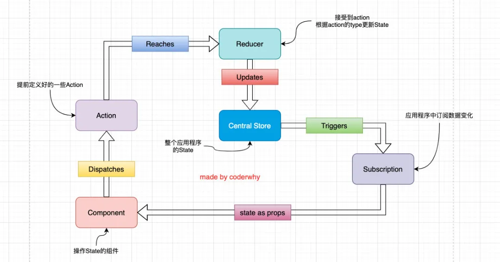

# 1.JavaScript纯函数

函数式编程中有一个概念叫纯函数，JavaScript符合函数式编程的范式，所以也有纯函数的概念。

在程序设计中，若一个函数符合以下条件，那么这个函数被称为纯函数：

1. 此函数在相同的输入值时，需产生相同的输出。函数的输出和输入值以外的其他隐藏信息或状态无关，也和由I/O设备产生的外部输出无关。

2. 该函数不能有语义上可观察的函数副作用，诸如“触发事件”，使输出设备输出，或更改输出值以外物件的内容等。

当然上面的定义会过于的晦涩，所以我简单总结一下：

1. **确定的输入，一定会产生确定的输出**；

2. **函数在执行过程中，不能产生副作用**；

那么我们来看几个函数是否是纯函数：

案例一：

- 很明显，下面的函数是一个纯函数；
- 它的输出是依赖我们的输入内容，并且中间没有产生任何副作用；

```js
function sum(num1, num2) {
  return num1 + num2;
}
```

案例二：

- add函数不是一个纯函数；
- 函数依赖一个外部的变量，变量发生改变时，会影响：确定的输入，产生确定的输出；
- 能否改进成纯函数呢？`const foo = 5;` 即可

```js
let foo = 5;

function add(num) {
  return foo + num;
}

console.log(add(5));
foo = 10;
console.log(add(5));
```

案例三：

- printInfo不是一个纯函数；
- 虽然无论输入什么，最终输出都是undefined，但是它产生了副作用，修改了传入的对象；

```js
function printInfo(info) {
  console.log(info.name, info.age);
  info.name = "哈哈哈";
}
```

当然纯函数还有很多的变种，但是我们只需要理解它的核心就可以了。

为什么纯函数在函数式编程中非常重要呢？

- 因为你可以`安心的写`和`安心的用`；
- 你在写的时候保证了函数的纯度，只是实现自己的业务逻辑即可，不需要关心传入的内容或者依赖其他的外部变量；
- 你在用的时候，你确定你的输入内容不会被任意篡改，并且自己确定的输入，一定会有确定的输出；

React中就要求我们无论是函数还是class声明一个组件，这个组件都必须像纯函数一样，保护它们的props不被修改：

# 2.为什么需要redux？

JavaScript开发的应用程序，已经变得越来越复杂了：

- JavaScript需要管理的状态越来越多，越来越复杂；
- 这些状态包括服务器返回的数据、缓存数据、用户操作产生的数据等等，也包括一些UI的状态，比如某些元素是否被选中，是否显示加载动效，当前分页；

管理不断变化的state是非常困难的：

- 状态之间相互会存在依赖，一个状态的变化会引起另一个状态的变化，View页面也有可能会引起状态的变化；
- 当应用程序复杂时，state在什么时候，因为什么原因而发生了变化，发生了怎么样的变化，会变得非常难以控制和追踪；

React是在视图层帮助我们解决了DOM的渲染过程，但是State依然是留给我们自己来管理：

- 无论是组件定义自己的state，还是组件之间的通信通过props进行传递；也包括通过Context进行数据之间的共享；
- React主要负责帮助我们管理视图，state如何维护最终还是我们自己来决定；

Redux就是一个帮助我们管理State的容器：**Redux是JavaScript的状态容器，提供了可预测的状态管理**；

Redux除了和React一起使用之外，它也可以和其他界面库一起来使用（比如Vue），并且它非常小（包括依赖在内，只有2kb）。

# 3.redux的核心理念

Redux的核心理念非常简单。比如我们有一个朋友列表需要管理：

- 如果我们没有定义统一的规范来操作这段数据，那么整个数据的变化就是无法跟踪的；
- 比如页面的某处通过`products.push`的方式增加了一条数据；
- 比如另一个页面通过`products[0].age = 25`修改了一条数据；
- 整个应用程序错综复杂，当出现bug时，很难跟踪到底哪里发生的变化；

```jsx
const initialState = {
  friends: [
    { name: "why", age: 18 },
    { name: "kobe", age: 40 },
    { name: "lilei", age: 30 },
  ]
};
```

Redux要求我们通过action来更新数据：

- 所有数据的变化，必须通过派发（dispatch）action来更新；
- action是一个普通的JavaScript对象，用来描述这次更新的type和content；

比如下面就是几个更新friends的action：

- 强制使用action的好处是可以清晰的知道数据到底发生了什么样的变化，所有的数据变化都是可跟追、可预测的；
- 当然，目前我们的action是固定的对象，真实应用中，我们会通过函数来定义，返回一个action；

```jsx
const action1 = { type: "ADD_FRIEND", info: { name: "lucy", age: 20 } }
const action2 = { type: "INC_AGE", index: 0 }
const action3 = { type: "CHANGE_NAME", playload: { index: 0, newName: "coderwhy" } }
```

但是如何将state和action联系在一起呢？答案就是reducer

- reducer是一个纯函数；
- reducer做的事情就是将传入的state和action结合起来生成一个新的state；

```jsx
/*
* state为原来的state，一定不要修改原来的state，因为是纯函数
* action
*/
function reducer(state = initialState, action) {
  switch (action.type) {
    case "ADD_FRIEND":
      return { ...state, friends: [...state.friends, action.info] }
    case "INC_AGE":
      return {
        ...state, friends: state.friends.map((item, index) => {
          if (index === action.index) {
            return { ...item, age: item.age + 1 }
          }
          return item;
        })
      }
    case "CHANGE_NAME":
      return {
        ...state, friends: state.friends.map((item, index) => {
          if (index === action.index) {
            return { ...item, name: action.newName }
          }
          return item;
        })
      }
    default:
      return state;
  }
}
```

# 4.redux的三大原则

1. **单一数据源**

整个应用程序的state被存储在一颗object tree中，并且这个object tree只存储在一个 store 中：

- Redux并没有强制让我们不能创建多个Store，但是那样做并不利于数据的维护；
- 单一的数据源可以让整个应用程序的state变得方便维护、追踪、修改；

2. **State是只读的**

唯一修改State的方法一定是触发action，不要试图在其他地方通过任何的方式来修改State：

- 这样就确保了View或网络请求都不能直接修改state，它们只能通过action来描述自己想要如何修改state；
- 这样可以保证所有的修改都被集中化处理，并且按照严格的顺序来执行，所以不需要担心race condition（竟态）的问题；

3. **使用纯函数来执行修改**

通过reducer将 `旧state`和 `actions`联系在一起，并且返回一个新的State：

- 随着应用程序的复杂度增加，我们可以将reducer拆分成多个小的reducers，分别操作不同state tree的一部分；
- 但是所有的reducer都应该是纯函数，不能产生任何的副作用；

# 5.redux的基本使用

安装redux:

```bash
npm install redux --save
# 或
yarn add redux
```

## 5.1搭建项目结构

1.创建一个新的项目文件夹：learn-redux

```bash
# 执行初始化操作
yarn init -y

# 安装redux
yarn add redux
```

2.创建src目录，并且创建index.js文件

- 暂时没有任何内容

3.修改package.json可以执行index.js

```bash
"scripts": {
  "start": "node src/index.js"
}
```

## 5.2编写代码

1.创建一个对象，作为我们要保存的状态：

```jsx
const redux = require('redux');

const initialState = {
  counter: 0
}
```

2.创建Store来存储这个state

- 创建store时必须创建reducer；
- 我们可以通过 `store.getState` 来获取当前的state

```jsx
// 创建reducer
const reducer = (state = initialState, action) => {
  return state;
}

// 根据reducer创建store
const store = redux.createStore(reducer);
// 获取当前的state
console.log(store.getState());
```

3.通过action来修改state

- 通过dispatch来派发action；
- 通常action中都会有type属性，也可以携带其他的数据；

```jsx
store.dispatch({
  type: "INCREMENT"
})

store.dispatch({
  type: "DECREMENT"
})

store.dispatch({
  type: "ADD_NUMBER",
  number: 5
})
```

4.修改reducer中的处理代码

- 这里一定要记住，reducer是一个纯函数，不需要直接修改state；
- 后面我会讲到直接修改state带来的问题；

```jsx
const reducer = (state = initialState, action) => {
  switch (action.type) {
    case "INCREMENT":
      return {...state, counter: state.counter + 1};
    case "DECREMENT":
      return {...state, counter: state.counter - 1};
    case "ADD_NUMBER":
      return {...state, counter: state.counter + action.number}
    default: 
      return state;
  }
}
```

5.可以在派发action之前，监听store的变化：

```jsx
store.subscribe(() => {
  console.log(store.getState());
})
```

完成的案例代码如下：

```jsx
const redux = require('redux');

const initialState = {
  counter: 0
}

// 创建reducer
const reducer = (state = initialState, action) => {
  switch (action.type) {
    case "INCREMENT":
      return {...state, counter: state.counter + 1};
    case "DECREMENT":
      return {...state, counter: state.counter - 1};
    case "ADD_NUMBER":
      return {...state, counter: state.counter + action.number}
    default: 
      return state;
  }
}

// 根据reducer创建store
const store = redux.createStore(reducer);

// 订阅store的修改：只要store数据改变，就会监听到
store.subscribe(() => {
  console.log(store.getState().counter);
})

// 修改store中的state
store.dispatch({
  type: "INCREMENT"
})
// console.log(store.getState());

store.dispatch({
  type: "DECREMENT"
})
// console.log(store.getState());

store.dispatch({
  type: "ADD_NUMBER",
  number: 5
})
// console.log(store.getState());
```

# 6.redux结构划分

如果我们将所有的逻辑代码写到一起，那么当redux变得复杂时代码就难以维护。

接下来，我会对代码进行拆分，将store、reducer、action、constants拆分成一个个文件。

**注意：node中对ES6模块化的支持**

目前我使用的node版本是v12.16.1，从node v13.2.0开始，node才对ES6模块化提供了支持：

- node v13.2.0之前，需要进行如下操作：

  - 在package.json中添加属性：`"type": "module"`；

  - 在执行命令中添加如下选项：`node --experimental-modules src/index.js`;

- node v13.2.0之后，只需要进行如下操作：

  - 在package.json中添加属性：`"type": "module"`；


注意：导入文件时，需要跟上.js后缀名；

创建store/index.js文件：

```jsx
import redux from 'redux';
import reducer from './reducer.js';

const store = redux.createStore(reducer);

export default store;
```

创建store/reducer.js文件：

```jsx
import { ADD_NUMBER , SUB_NUMBER } from './constants.js';
const initialState = {
  counter: 0
}

function reducer(state = initialState, action) {
  switch(action.type) {
    case ADD_NUMBER:
      return {...state, counter: state.counter + action.num};
    case SUB_NUMBER:
      return {...state, counter: state.counter - action.num};
    default:
      return state;
  } 
}

export default reducer;
```

创建store/actionCreators.js文件：

```jsx
import { ADD_NUMBER, SUB_NUMBER } from './constants.js'

//一般使用箭头函数
const addAction = (count) => ({
  type: ADD_NUMBER,
  num: count
});

const subAction = (count) => ({
  type: SUB_NUMBER,
  num: count
})

export { addAction, subAction }
```

创建store/constants.js文件：

```jsx
const ADD_NUMBER = "ADD_NUMBER";
const SUB_NUMBER = "SUB_NUMER";

export {
  ADD_NUMBER,
  SUB_NUMBER
} 
```

使用：

index.js

```jsx
import store from './store/index.js';

// 导入action
import {
  addAction,
  subAction,
  incAction,
  decAction
} from './store/actionCreators.js';

//订阅store
store.subscribe(() => {
  console.log(store.getState());
})
//派发action
store.dispatch(addAction(10));
store.dispatch(addAction(15));
store.dispatch(subAction(8));
store.dispatch(subAction(5));
store.dispatch(incAction());
store.dispatch(decAction());
```

# 7.Redux流程图

我们已经知道了redux的基本使用过程，那么我们就更加清晰来认识一下redux在实际开发中的流程：

1. 全局通常只有一个Store，存储我们的State；

2. Component中在某些情况会派发Action（这些Action是我们提前定义好的）；

3. Reducer会接收到这些Action，并且在Reducer中会返回一个新的State，作为Store的State；

4. State发生更新之后会触发通知，告知订阅者数据发生了改变；

5. 订阅者拿到最新的数据（在props中），更新到jsx中，界面发生改变；



# 8.react中使用redux

## 8.1全局定义

constants常量文件:

```js
// constants.js
export const ADD_NUMBER = "ADD_NUMBER";
export const SUB_NUMBER = "SUB_NUMBER";
export const INCREMENT = "INCREMENT";
export const DECREMENT = "DECREMENT";

export const FETCH_HOME_MULTIDATA = "FETCH_HOME_MULTIDATA";
export const CHANGE_BANNERS = "CHANGE_BANNERS";
export const CHANGE_RECOMMEND = "CHANGE_RECOMMEND";                       
```

## 8.2手动和redux联系

### 8.2.1目录结构

```
src                                 
├─ pages                            
│  ├─ about.js  # 关于页面组件                                                       
│  └─ home.js   # 首页组件       
├─ store                            
│  ├─ actionCreators.js   # 定义的action          
│  ├─ constants.js 		  # 常量                 
│  ├─ index.js  		  # store入口文件                    
│  └─ reducer.js  		  # 定义reducer                                                        
├─ App.js                           
└─ index.js                         
```

### 8.2.2创建store入口文件

```jsx
/* store/index.js */
// 导出创建store的函数
import { createStore } from 'redux';
// 导入reducer
import reducer from './reducer.js';
// 创建store
const store = createStore(reducer);
// 导出store
export default store;
```

### 8.2.3创建reducer

```jsx
// store/reducer.js
import { ADD_NUMBER, SUB_NUMBER } from './constants.js';

const defaultState = {
  counter: 0
}

function reducer(state = defaultState, action) {
  switch (action.type) {
    case ADD_NUMBER:
      return { ...state, counter: state.counter + action.num };
    case SUB_NUMBER:
      return { ...state, counter: state.counter - action.num };
    default:
      return state;
  }
}

export default reducer;
```

### 8.2.4创建action

```jsx
// store/actionCreators.js
import { ADD_NUMBER, SUB_NUMBER } from './constants.js';
// 定义增加action
export const addAction = num => ({
  type: ADD_NUMBER,
  num
});

// 定义减法的action
export const subAction = num => ({
  type: SUB_NUMBER,
  num
});
```

### 8.2.5组件中使用redux

在`about`组件使用：

```jsx
// pages/about.js
import React, { PureComponent } from 'react';

// 导入store
import store from '../store';
// 按需导入action
import { subAction } from "../store/actionCreators";

export default class About extends PureComponent {
  constructor(props) {
    super(props);

    this.state = {
        // 获取store中的数据
      counter: store.getState().counter
    }
  }

  componentDidMount() {
      // 监听store
    this.unsubscribue = store.subscribe(() => {
      this.setState({
        counter: store.getState().counter
      })
    })
  }

  componentWillUnmount() {
      // 取消监听
    this.unsubscribue();
  }

  render() {
    return (
      <div>
        <hr/>
        <h1>About</h1>
        <h2>当前计数: {this.state.counter}</h2>
        <button onClick={e => this.decrement()}>-1</button>
        <button onClick={e => this.subNumber(5)}>-5</button>
      </div>
    )
  }

  decrement() {
      //触发subAction
    store.dispatch(subAction(1));
  }

  subNumber(num) {
      //触发subAction
    store.dispatch(subAction(num));
  }
}
```

在`home`组件使用：

```jsx
// pages/home.js
import React, { PureComponent } from 'react';

import store from '../store';

import { addAction } from '../store/actionCreators'

export default class Home extends PureComponent {
  constructor(props) {
    super(props);

    this.state = {
        // 获取store中的数据
      counter: store.getState().counter
    }
  }

  componentDidMount() {
      //监听store
    this.unsubscribue = store.subscribe(() => {
      this.setState({
        counter: store.getState().counter
      })
    })
  }

  componentWillUnmount() {
      //取消监听
    this.unsubscribue();
  }

  render() {
    return (
      <div>
        <h1>Home</h1>
        <h2>当前计数: {this.state.counter}</h2>
        <button onClick={e => this.increment()}>+1</button>
        <button onClick={e => this.addNumber(5)}>+5</button>
      </div>
    )
  }

  increment() {
      //触发subAction
    store.dispatch(addAction(1));
  }

  addNumber(num) {
      //触发subAction
    store.dispatch(addAction(num));
  }
}
```

## 8.3自定义的connect

上面的代码是否可以实现`react组件`和`redux`结合起来呢？

- 当然是可以的，但是我们会发现每个使用的地方其实会有一些重复的代码：
- 比如监听store数据改变的代码，都需要在`componentDidMount`中完成；
- 比如派发事件，我们都需要去先拿到`store`，在调用其`dispatch`等；

能否将这些公共的内容提取出来呢？

我们来定义一个connect函数：

- 这个connect函数本身接受两个参数：

  - 参数一：里面存放 `component` 希望使用到的 `State` 属性；

  - 参数二：里面存放 `component` 希望使用到的 `dispatch`动作；

- 这个connect函数有一个返回值，是一个高阶组件：

  - 在`constructor`中的state中保存一下我们需要获取的状态；

  - 在`componentDidMount`中订阅store中数据的变化，并且执行 `setState`操作；
  - 在`componentWillUnmount`中需要取消订阅；
  - 在`render`函数中返回传入的`WrappedComponent`，并且将所有的状态映射到其`props`中；
  - 这个高阶组件接受一个组件作为参数，返回一个class组件；
  - 在这个class组件中，我们进行如下操作：


### 8.3.1目录结构

```
src                                 
├─ pages                            
│  ├─ about.js                             
│  └─ home.js         
├─ store                            
│  ├─ actionCreators.js             
│  ├─ constants.js                  
│  ├─ index.js                                       
│  └─ reducer.js                       
├─ utils                                               
│  └─ connect.js                    
├─ App.js                           
└─ index.js 
```

### 8.3.2封装高阶组件

```jsx
// utils/connect.js
import React, { PureComponent } from "react";
// 导入创建的store
import store from '../store';

/**
 * @description: 将redux与组件进行连接
 * @param {function} mapStateToProps 传入的函数返回state对象
 * @param {function} mapDispachToProp 传入的函数返回action对象
 * @return {*}
 */
export function connect(mapStateToProps, mapDispachToProp) {
  // 返回高阶组件
  return function enhanceHOC(WrappedComponent) {
   // 返回类组件
   return class extends PureComponent {
      constructor(props) {
        super(props);

        this.state = {
          storeState: mapStateToProps(store.getState())
        }
      }

      componentDidMount() {
        this.unsubscribe = store.subscribe(() => {
          this.setState({
            storeState: mapStateToProps(store.getState())
          })
        })
      }

      componentWillUnmount() {
        this.unsubscribe();
      }

      render() {
        return <WrappedComponent {...this.props}
          {...mapStateToProps(store.getState())}
          {...mapDispachToProp(store.dispatch)} />
      }
    }
  }
}
```

### 8.3.3使用高阶组件

在home和about文件中，我们按照自己需要的state、dispatch来进行映射：

比如home.js中进行如下修改：

- `mapStateToProps`：用于将state映射到一个对象中，对象中包含我们需要的属性；

- `mapDispatchToProps`：用于将dispatch映射到对象中，对象中包含在组件中可能操作的函数；
  - 当调用该函数时，本质上其实是调用dispatch(对应的Action)；


修改home组件：

```jsx
// pages/home.js
import React, { PureComponent } from 'react';
// 导入高阶函数
import { connect } from '../utils/connect';
// 导入action
import { incAction, addAction } from '../store/actionCreators'

// 定义类组件
class Home extends PureComponent {
  render() {
    return (
      <div>
        <h1>Home</h1>
        <h2>当前计数: {this.props.counter}</h2>
        <button onClick={e => this.props.increment()}>+1</button>
        <button onClick={e => this.props.addNumber(5)}>+5</button>
      </div>
    )
  }
}
// 用于将state映射到一个对象中
const mapStateToProps = state => ({
  counter: state.counter
})
// 用于将dispatch映射到对象中
const mapDispatchToProps = dispatch => ({
  increment() {
    dispatch(incAction());
  },
  addNumber(num) {
    dispatch(addAction(num));
  }
})
// 导出高阶函数connect返回的新组件
export default connect(mapStateToProps, mapDispatchToProps)(Home);
```

修改about组件：

```jsx
// pages/about.js
import React from 'react';
import { connect } from '../utils/connect';
import { decAction,subAction } from "../store/actionCreators";

// 定义函数式组件
function About(props) {
  return (
    <div>
      <hr />
      <h1>About</h1>
      <h2>当前计数: {props.counter}</h2>
      <button onClick={e => props.decrement()}>-1</button>
      <button onClick={e => props.subNumber(5)}>-5</button>
    </div>
  )
}

const mapStateToProps = state => {
  return {
    counter: state.counter
  }
};
const mapDispatchToProps = dispatch => {
  return {
    decrement: function() {
      dispatch(decAction());
    },
    subNumber: function(num) {
      dispatch(subAction(num))
    }
  }
};

export default connect(mapStateToProps, mapDispatchToProps)(About);
```

### 8.3.4将connect中的store进行抽离

但是上面的connect函数有一个很大的缺陷：依赖项目创建的store，并导入。

- 如果我们将其封装成一个独立的库，需要依赖用于创建的store，我们应该如何去获取呢？
- 难道让用户来修改我们的源码吗？不太现实；

正确的做法是我们提供一个Provider，Provider来自于我们创建的Context，让用户将store传入到value中即可；

1. 新建context文件

```jsx
// utils/context.js
import React from 'react';
const StoreContext = React.createContext(); 
export { StoreContext }
```

修改connect函数中class组件部分的代码：

- 注意下面我们将class组件的名称明确的定义出来，并且给它的`contextType`进行了赋值；
- 在组件内部用到`store`的地方，统一使用`this.context`代替（注意：constructor中直接使用第二个参数即可）

2. 修改高阶函数connect

```jsx
// utils/connect.js
import React, { PureComponent } from "react";
// 导入创建的context
import { StoreContext } from './context';

/**
 * @description: 将redux与组件进行连接
 * @param {*} mapStateToProps 传入的state
 * @param {*} mapDispachToProp 传入的action
 * @return {*}
 */
export function connect(mapStateToProps, mapDispachToProp) {
  return function enhanceHOC(WrappedComponent) {
    class EnhanceComponent extends PureComponent {
      constructor(props, context) {
        super(props, context);

        this.state = {
          storeState: mapStateToProps(context.getState())
        }
      }

      componentDidMount() {
        this.unsubscribe = this.context.subscribe(() => {
          this.setState({
            storeState: mapStateToProps(this.context.getState())
          })
        })
      }

      componentWillUnmount() {
        this.unsubscribe();
      }

      render() {
        return <WrappedComponent {...this.props}
          {...mapStateToProps(this.context.getState())}
          {...mapDispachToProp(this.context.dispatch)} />
      }
    }

    EnhanceComponent.contextType = StoreContext;

    return EnhanceComponent;
  }
}
```

3. 修改项目入口文件index.js

```jsx
import React from 'react';
import ReactDOM from 'react-dom';
import store from './store';
import { StoreContext } from './utils/context';
import App from './App';

ReactDOM.render(
  <StoreContext.Provider value={store}>
    <App />
  </StoreContext.Provider>,
  document.getElementById('root')
);
```

# 9.react-redux使用

开始之前需要强调一下，redux和react没有直接的关系，你完全可以在React, Angular, Ember, jQuery, or vanilla JavaScript中使用Redux。

尽管这样说，redux依然是和React或者Deku的库结合的更好，因为他们是通过state函数来描述界面的状态，Redux可以发射状态的更新，让他们作出相应。

虽然我们之前已经实现了connect、Provider这些帮助我们完成连接redux、react的辅助工具，但是实际上redux官方帮助我们提供了 `react-redux`的库，可以直接在项目中使用，并且实现的逻辑会更加的严谨和高效。

## 9.1安装react-redux

```
yarn add react-redux
```

## 9.2使用connect函数

将之前使用的connect函数，换成react-redux的connect函数:

```jsx
import React, { PureComponent } from 'react';
// 从react-redux库导入高阶函数connect
import { connect } from "react-redux";

// import connect from '../utils/connect2';
export default connect(mapStateToProps, mapDispatchToProps)(Home);
```

## 9.3使用Provider

将之前自己创建的Context的Provider，换成react-redux的Provider组件；

> **注意**：这里传入的是store属性，而不是value属性。

```jsx
// 从react-redux库导入Provider
import { Provider } from 'react-redux';
// 导入store
import store from './store';

ReactDOM.render(
  <Provider store={store}>
    <App />
  </Provider>,
  document.getElementById('root')
);
```

## 9.4示例

1. 修改项目入口文件index.js

```jsx
import React from 'react';
import ReactDOM from 'react-dom';

import store from './store';

// import { StoreContext } from './utils/context';
import { Provider } from 'react-redux';

import App from './App';

ReactDOM.render(
  <Provider store={store}>
    <App />
  </Provider>,
  document.getElementById('root')
);
```

2. 修改about组件：

```jsx
// pages/about.js
import React from 'react';
// import { connect } from '../utils/connect';
// 从react-redux库导入高阶函数connect
import { connect } from 'react-redux';

import { decAction,subAction } from "../store/actionCreators";

function About(props) {
  console.log("About页面重新渲染了");
  return (
    <div>
      <hr />
      <h1>About</h1>
      {/* <h2>当前计数: {props.counter}</h2> */}
      <button onClick={e => props.decrement()}>-1</button>
      <button onClick={e => props.subNumber(5)}>-5</button>
      <h1>Banner</h1>
      <ul>
        {
          props.banners.map((item, index) => {
            return <li key={item.acm}>{item.title}</li>
          })
        }
      </ul>
      <h1>Recommend</h1>
      <ul>
        {
          props.recommends.map((item, index) => {
            return <li key={item.acm}>{item.title}</li>
          })
        }
      </ul>
    </div>
  )
}

const mapStateToProps = state => {
  return {
    banners: state.banners,
    recommends: state.recommends
  }
};

const mapDispatchToProps = dispatch => {
  return {
    decrement: function () {
      dispatch(decAction());
    },
    subNumber: function (num) {
      dispatch(subAction(num))
    }
  }
};

export default connect(mapStateToProps, mapDispatchToProps)(About);
```

3. 修改home组件

```jsx
// pages/home.js
import React, { PureComponent } from 'react';

// import {connect} from '../utils/connect';
import { connect } from 'react-redux';

import axios from 'axios';

import {
  incAction,
  addAction,
  changeBannersAction,
  changeRecommendAction
} from '../store/actionCreators'

class Home extends PureComponent {
  componentDidMount() {
    axios({
      url: "http://123.207.32.32:8000/home/multidata",
    }).then(res => {
      const data = res.data.data;
      this.props.changeBanners(data.banner.list);
      this.props.changeRecommends(data.recommend.list);
    })
  }

  render() {
    return (
      <div>
        <h1>Home</h1>
        <h2>当前计数: {this.props.counter}</h2>
        <button onClick={e => this.props.increment()}>+1</button>
        <button onClick={e => this.props.addNumber(5)}>+5</button>
      </div>
    )
  }
}

const mapStateToProps = state => ({
  counter: state.counter
})

const mapDispatchToProps = dispatch => ({
  increment() {
    dispatch(incAction());
  },
  addNumber(num) {
    dispatch(addAction(num));
  },
  changeBanners(banners) {
    dispatch(changeBannersAction(banners));
  },
  changeRecommends(recommends) {
    dispatch(changeRecommendAction(recommends));
  }
})

export default connect(mapStateToProps, mapDispatchToProps)(Home);
```

# 10.Redux中间件

## 10.1组件中异步请求

在之前简单的案例中，redux中保存的counter是一个本地定义的数据，我们可以直接通过同步的操作来dispatch action，state就会被立即更新。

但是真实开发中，redux中保存的很多数据可能来自服务器，我们需要进行异步的请求，再将数据保存到redux中。

在之前学习网络请求的时候我们讲过，网络请求可以在class组件的`componentDidMount`中发送，所以我们可以有这样的结构：


我现在完成如下案例操作：

- 在Home组件中请求banners和recommends的数据；
- 在Profile组件中展示banners和recommends的数据；

### 10.1.1redux代码进行如下修改

1. 在reducer.js中添加state初始化数据和reducer函数中处理代码：

```jsx
const initialState = {
  counter: 0,
  banners: [],
  recommends: []
}

function reducer(state = initialState, action) {
  switch (action.type) {
    case ADD_NUMBER:
      return { ...state, counter: state.counter + action.num };
    case SUB_NUMBER:
      return { ...state, counter: state.counter - action.num };
    case CHANGE_BANNER:
      return { ...state, banners: action.banners };
    case CHANGE_RECOMMEND:
      return { ...state, recommends: action.recommends };
    default:
      return state;
  }
}
```

2. constants中增加常量：

```jsx
const CHANGE_BANNER = "CHANGE_BANNER";
const CHANGE_RECOMMEND = "CHANGE_RECOMMEND";
```

3. actionCreators.js中添加actions：

```jsx
const changeBannersAction = (banners) => ({
  type: CHANGE_BANNER,
  banners
}) 

const changeRecommendsAction = (recommends) => ({
  type: CHANGE_RECOMMEND,
  recommends
})
```

### 10.1.2组件中代码修改

1. Home组件：

```jsx
import React, { PureComponent } from 'react';
import { connect } from "react-redux";

import axios from 'axios';

import {
  addAction,
  changeBannersAction,
  changeRecommendsAction
} from '../store/actionCreators';

class Home extends PureComponent {
  componentDidMount() {
    axios.get("http://123.207.32.32:8000/home/multidata").then(res => {
      const data = res.data.data;
      this.props.changeBanners(data.banner.list);
      this.props.changeRecommends(data.recommend.list);
    })
  }

}

const mapStateToProps = state => {
  return {
    counter: state.counter
  }
}

const mapDispatchToProps = dispatch => {
  return {
    addNumber: function(number) {
      dispatch(addAction(number));
    },
    changeBanners(banners) {
      dispatch(changeBannersAction(banners));
    },
    changeRecommends(recommends) {
      dispatch(changeRecommendsAction(recommends));
    }
  }
}

export default connect(mapStateToProps, mapDispatchToProps)(Home);
```

2. Profile组件：

```jsx
import React, { PureComponent } from 'react';
import { connect } from "react-redux";

import {
  subAction
} from '../store/actionCreators';

class Profile extends PureComponent {
  render() {
    return (
      <div>
        Profile
        <div>
          <h2>当前计数: {this.props.counter}</h2>
          <button onClick={e => this.decrement()}>-1</button>
          <button onClick={e => this.subCounter()}>-5</button>
        </div>
        <h1>Banners</h1>
        <ul>
          {
            this.props.banners.map((item, index) => {
              return <li key={item.acm}>{item.title}</li>
            })
          }
        </ul>
        <h1>Recommends</h1>
        <ul>
          {
            this.props.recommends.map((item, index) => {
              return <li key={item.acm}>{item.title}</li>
            })
          }
        </ul>
      </div>
    )
  }

}

const mapStateToProps = state => {
  return {
    counter: state.counter,
    banners: state.banners,
    recommends: state.recommends
  }
}

const mapDispatchToProps = dispatch => {
  return {
    subNumber: function (number) {
      dispatch(subAction(number));
    }
  }
}

export default connect(mapStateToProps, mapDispatchToProps)(Profile);
```

## 10.2redux中异步请求

上面的代码有一个缺陷：

- 我们必须将网络请求的异步代码放到组件的生命周期中来完成；
- 事实上，网络请求到的数据也属于我们状态管理的一部分，更好的一种方式应该是将其也交给redux来管理；


但是在redux中如何可以进行异步的操作呢？

- 答案就是使用**中间件（Middleware）**；
- 学习过Express或Koa框架的童鞋对中间件的概念一定不陌生；
- 在这类框架中，Middleware可以帮助我们在请求和响应之间嵌入一些操作的代码，比如cookie解析、日志记录、文件压缩等操作；

redux也引入了中间件（Middleware）的概念：

- 这个中间件的目的是在`dispatch的action`和`最终达到的reducer`之间，扩展一些自己的代码；
- 比如日志记录、调用异步接口、添加代码调试功能等等；

我们现在要做的事情就是发送异步的网络请求，所以我们可以添加对应的中间件：

- 这里官网推荐的、包括演示的网络请求的中间件是使用 `redux-thunk`；

redux-thunk是如何做到让我们可以发送异步的请求呢？

- 我们知道，默认情况下的dispatch(action)，action需要是一个JavaScript的对象；

- `redux-thunk`可以让dispatch(action函数)，`action可以是一个函数`；

- 该函数会被调用，并且会传给这个函数一个dispatch函数和getState函数；

  - dispatch函数用于我们之后再次派发action；

  - getState函数考虑到我们之后的一些操作需要依赖原来的状态，用于让我们可以获取之前的一些状态；


### 10.2.1安装redux-thunk

```
yarn add redux-thunk
```

### 10.2.2在创建store时传入应用了middleware的enhance函数

- 通过applyMiddleware来结合多个Middleware, 返回一个enhancer；
- 将enhancer作为第二个参数传入到createStore中；

```jsx
// store/index.js
import { createStore, applyMiddleware, compose } from 'redux';
import thunkMiddleware from 'redux-thunk';
// 通过applyMiddleware来结合多个Middleware, 返回一个enhancer
const enhancer = applyMiddleware(thunkMiddleware);
// 将enhancer作为第二个参数传入到createStore中
const store = createStore(reducer, enhancer);
```

### 10.2.3定义返回一个函数的action

注意：这里不是返回一个对象了，而是一个函数；

该函数在dispatch之后会被执行；

```jsx
const getHomeMultidataAction = () => {
  return (dispatch) => {
    axios.get("http://123.207.32.32:8000/home/multidata").then(res => {
      const data = res.data.data;
      dispatch(changeBannersAction(data.banner.list));
      dispatch(changeRecommendsAction(data.recommend.list));
    })
  }
}
```

### 10.2.4修改home.js中的代码：

```jsx
import React, { PureComponent } from 'react';
import { connect } from "react-redux";

import {
  addAction,
  getHomeMultidataAction
} from '../store/actionCreators';

class Home extends PureComponent {
  componentDidMount() {
    this.props.getHomeMultidata();
  }
}

...mapStatetoProps

const mapDispatchToProps = dispatch => {
  return {
    addNumber: function(number) {
      dispatch(addAction(number));
    },
    getHomeMultidata() {
      dispatch(getHomeMultidataAction());
    }
  }
}

export default connect(mapStateToProps, mapDispatchToProps)(Home);
```

## 10.3redux-devtools

我们之前讲过，redux可以方便的让我们对状态进行跟踪和调试，那么如何做到呢？

- redux官网为我们提供了`redux-devtools`的工具；
- 利用这个工具，我们可以知道每次状态是如何被修改的，修改前后的状态变化等等；

安装该工具需要两步：

- 第一步：在对应的浏览器中安装相关的插件（比如Chrome浏览器扩展商店中搜索Redux DevTools即可，其他方法可以参考GitHub）；
- 第二步：在redux中继承devtools

```jsx
import { createStore, applyMiddleware, compose } from 'redux';
import thunkMiddleware from 'redux-thunk';
import reducer from './reducer.js';

// composeEnhancers函数
const composeEnhancers = window.__REDUX_DEVTOOLS_EXTENSION_COMPOSE__({trace: true}) || compose;

// 通过applyMiddleware来结合多个Middleware, 返回一个enhancer
const enhancer = composeEnhancers(applyMiddleware(thunkMiddleware));
// 将enhancer作为第二个参数传入到createStore中
const store = createStore(reducer, enhancer);

export default store;
```

trace打开：

```js
const composeEnhancers = window.__REDUX_DEVTOOLS_EXTENSION_COMPOSE__({trace: true}) || compose;
```


## 10.4redux-saga

### 10.4.1ES6的generator

saga中间件使用了ES6的generator语法，所以我们有必须简单讲解一下：

在JavaScript中编写一个普通的函数，进行调用会立即拿到这个函数的返回结果：

```js
function foo() {
  return "Hello World";
}

foo() // Hello World
```

如果我们将这个函数编写成一个生成器函数：

```js
function *foo() {
  yield "Hello";
  yield "World";
}

const iterator = foo();
console.log(iterator, typeof iterator); // 一个object类型的iterator对象
```

调用iterator的next函数，会销毁一次迭代器，并且返回一个yield的结果：

```js
// 调用一次next()是消耗一次迭代器
iterator.next(); // {value: "Hello", done: false}
iterator.next(); // {value: "World", done: false}
iterator.next(); // {value: undefined, done: true}
```

研究一下foo生成器函数代码的执行顺序：

```js
function *foo() {
  console.log("111111");
  yield "Hello";
  console.log("222222");
  yield "World";
  console.log("333333");
}

// 调用一次next()是消耗一次迭代器
iterator.next(); // {value: "Hello", done: false}
// 打印111111
iterator.next(); // {value: "World", done: false}
// 打印222222
iterator.next(); // {value: undefined, done: true}
// 打印333333
```

generator和promise一起使用：

```js
function *bar() {
  const result = yield new Promise((resolve, reject) => {
    setTimeout(() => {
      resolve("Hello Generator");
      return "Hello";
    }, 2000);
  });
  console.log(result);
}

const bIterator = bar();
bIterator.next().value.then(res => {
  bIterator.next(res);
});
```

### 10.4.2redux-saga的使用

1. 安装redux-saga

```
yarn add redux-saga
```

2. 集成redux-saga中间件

```js
import { createStore, applyMiddleware, compose } from 'redux';
import thunkMiddleware from 'redux-thunk';
import createSagaMiddleware from 'redux-saga';
import reducer from './reducer.js';
import mySaga from './saga';

// 通过createSagaMiddleware函数来创建saga中间件
const sagaMiddleware = createSagaMiddleware();

const composeEnhancers = window.__REDUX_DEVTOOLS_EXTENSION_COMPOSE__({trace: true}) || compose;

// 通过applyMiddleware来结合多个Middleware, 返回一个enhancer
const enhancer = composeEnhancers(applyMiddleware(thunkMiddleware, sagaMiddleware));
// 将enhancer作为第二个参数传入到createStore中
const store = createStore(reducer, enhancer);

// 必须启动saga中间件，并且传入其要监听的generator
sagaMiddleware.run(mySaga);

export default store;
```

3. saga.js文件的编写

- takeEvery：可以传入多个监听的actionType，每一个都可以被执行（对应有一个takeLastest，会取消前面的）
- put：在saga中派发action不再是通过dispatch，而是通过put；
- all：可以在yield的时候put多个action；

```js
import { takeEvery, put, all } from 'redux-saga/effects';
import axios from 'axios';

import {
  FETCH_HOME_MULTIDATA
} from "./constants";
import {
  changeBannersAction,
  changeRecommendsAction,
} from './actionCreators';

function* fetchHomeMultidata(action) {
  const res = yield axios.get("http://123.207.32.32:8000/home/multidata");
  console.log(res);
  const data = res.data.data;
  yield all([
    put(changeBannersAction(data.banner.list)),
    put(changeRecommendsAction(data.recommend.list))
  ])
}

function* mySaga() {
  // takeEvery函数中传入监听action的type
  yield takeEvery(FETCH_HOME_MULTIDATA, fetchHomeMultidata)
  // takeLatest takeEvery区别:
  // takeLatest: 依次只能监听一个对应的action
  // takeEvery: 每一个都会被执行
  // takeLatest(ADD_NUMBER, fetchHomeMultidata),
  /*监听多个*/
  yield all([
    takeEvery(FETCH_HOME_MULTIDATA, fetchHomeMultidata),
    // takeLatest(ADD_NUMBER, fetchHomeMultidata),
  ]);
}

export default mySaga;
```

4. redux-saga的使用

```jsx
import React, { PureComponent } from 'react';

// import {connect} from '../utils/connect';
import { connect } from 'react-redux';


import {
  incAction,
  addAction
} from '../store/counter/actionCreators';
import {
  fetchHomeMultidataAction
} from '../store/home/actionCreators';

class Home extends PureComponent {
  componentDidMount() {
    this.props.getHomeMultidata();
  }

  render() {
    return (
      <div>
        <h1>Home</h1>
        <h2>当前计数: {this.props.counter}</h2>
        <button onClick={e => this.props.increment()}>+1</button>
        <button onClick={e => this.props.addNumber(5)}>+5</button>
      </div>
    )
  }
}

const mapStateToProps = state => ({
  counter: state.counterInfo.counter
})

const mapDispatchToProps = dispatch => ({
  increment() {
    dispatch(incAction());
  },
  addNumber(num) {
    dispatch(addAction(num));
  },
  getHomeMultidata() {
    dispatch(fetchHomeMultidataAction);
  }
})

export default connect(mapStateToProps, mapDispatchToProps)(Home);
```

## 10.5中间件的原理

### 10.5.1打印日志需求

前面我们已经提过，中间件的目的是在redux中插入一些自己的操作：

- 比如我们现在有一个需求，在dispatch之前，打印一下本次的action对象，dispatch完成之后可以打印一下最新的store state；
- 也就是我们需要将对应的代码插入到redux的某部分，让之后所有的dispatch都可以包含这样的操作；

如果没有中间件，我们是否可以实现类似的代码呢？

当然可以，类似下面的方式即可：

```js
console.log("dispatching:", addAction(5));
store.dispatch(addAction(5));
console.log("new state:", store.getState());

console.log("dispatching:", addAction(10));
store.dispatch(subAction(10));
console.log("new state:", store.getState());
```

但是这种方式缺陷非常明显：

- 首先，每一次的dispatch操作，我们都需要在前面加上这样的逻辑代码；
- 其次，存在大量重复的代码，会非常麻烦和臃肿；

是否有一种更优雅的方式来处理这样的相同逻辑呢？

- 我们可以将代码封装到一个独立的函数中：

```js
// 打印日志的函数
function dispatchAndLog(action) {
  console.log("dispatching:", action);
  store.dispatch(action);
  console.log("新的state:", store.getState());
}
// 调用
dispatchAndLog(addAction(10));
```

但是这样的代码有一个非常大的缺陷：

- 调用者（使用者）在使用我的dispatch时，必须使用我另外封装的一个函数dispatchAndLog；
- 显然，对于调用者来说，很难记住这样的API，更加习惯的方式是直接调用dispatch；

我们来进一步对代码进行优化；

### 10.5.2修改dispatch

事实上，我们可以利用一个hack一点的技术：Monkey Patching，利用它可以修改原有的程序逻辑；

我们对代码进行如下的修改：

- 这样就意味着我们已经直接修改了dispatch的调用过程；
- 在调用dispatch的过程中，真正调用的函数其实是dispatchAndLog；

```js
let next = store.dispatch;

function dispatchAndLog(action) {
  console.log("dispatching:", addAction(10));
  next(action);
  console.log("新的state:", store.getState());
}

store.dispatch = dispatchAndLog;
// 调用
store.dispatch(addAction(10))
```

当然，我们可以将它封装到一个模块中，只要调用这个模块中的函数，就可以对store进行这样的处理：

```js
function patchLogging(store) {
  let next = store.dispatch;

  function dispatchAndLog(action) {
    console.log("dispatching:", action);
    next(addAction(5));
    console.log("新的state:", store.getState());
  }

  store.dispatch = dispatchAndLog;
}

// 使用
patchLogging(store)// 必须调用这个函数才能生效

// 调用
store.dispatch(addAction(10))
```

### 10.5.3thunk需求

redux-thunk的作用：

- 我们知道redux中利用一个中间件redux-thunk可以让我们的dispatch不再只是处理对象，并且可以处理函数；

我们来看下面的代码：

- 我们又对dispatch进行转换，这个dispatch会判断传入的

```js
function patchThunk(store) {
  let next = store.dispatch;

  function dispatchAndThunk(action) {
    if (typeof action === "function") {
      action(store.dispatch, store.getState);
    } else {
      next(action);
    }
  }

  store.dispatch = dispatchAndThunk;
}
```

将两个patch应用起来，进行测试：

```js
patchLogging(store);
patchThunk(store);

store.dispatch(addAction(10));

function getData(dispatch) {
  setTimeout(() => {
    dispatch(subAction(10));
  }, 1000)
}

// 传入函数
store.dispatch(getData);
```

### 10.5.4合并中间件

单个调用某个函数来合并中间件并不是特别的方便，我们可以封装一个函数来实现所有的中间件合并：

```js
function applyMiddleware(store, middlewares) {
  middlewares = middlewares.slice();

  middlewares.forEach(middleware => {
    store.dispatch = middleware(store);
  })
}

applyMiddleware(store, [patchLogging, patchThunk]);
```

我们来理解一下上面操作之后，代码的流程：


# 11.Redux中state如何管理

## 11.1reducer代码拆分

我们来看一下目前我们的reducer：

- 当前这个reducer既有处理counter的代码，又有处理home页面的数据；
- 后续counter相关的状态或home相关的状态会进一步变得更加复杂；
- 我们也会继续添加其他的相关状态，比如购物车、分类、歌单等等；

```js
function reducer(state = initialState, action) {
  switch (action.type) {
    case ADD_NUMBER:
      return { ...state, counter: state.counter + action.num };
    case SUB_NUMBER:
      return { ...state, counter: state.counter - action.num };
    case CHANGE_BANNER:
      return { ...state, banners: action.banners };
    case CHANGE_RECOMMEND:
      return { ...state, recommends: action.recommends };
    default:
      return state;
  }
}
```

如果将所有的状态都放到一个reducer中进行管理，随着项目的日趋庞大，必然会造成代码臃肿、难以维护。

**因此，我们可以对reducer进行拆分：**

我们先抽取一个对counter处理的reducer：

```js
// counter相关的状态
const initialCounter = {
  counter: 0
}

function counterReducer(state = initialCounter, action) {
  switch (action.type) {
    case ADD_NUMBER:
      return { ...state, counter: state.counter + action.num };
    case SUB_NUMBER:
      return { ...state, counter: state.counter - action.num };
    default:
      return state;
  }
}
```

再抽取一个对home处理的reducer：

```js
// home相关的状态
const initialHome = {
  banners: [],
  recommends: []
}

function homeReducer(state = initialHome, action) {
  switch (action.type) {
    case CHANGE_BANNER:
      return { ...state, banners: action.banners };
    case CHANGE_RECOMMEND:
      return { ...state, recommends: action.recommends };
    default:
      return state;
  }
}
```

如果将它们合并起来呢？

```js
const initialState = {
}

function reducer(state = initialState, action) {
  return {
    counterInfo: counterReducer(state.counterInfo, action),
    homeInfo: homeReducer(state.homeInfo, action),
  }
}
```

## 11.2reducer文件拆分

目前我们已经将不同的状态处理拆分到不同的reducer中，我们来思考：

- 虽然已经放到不同的函数了，但是这些函数的处理依然是在同一个文件中，代码非常的混乱；
- 另外关于reducer中用到的constant、action等我们也依然是在同一个文件中；

所以，接下来，我们可以对文件结构再次进行拆分：

```
./store
├── counter
│   ├── actioncreators.js
│   ├── constants.js
│   ├── index.js
│   └── reducer.js
├── home
│   ├── actioncreators.js
│   ├── constants.js
│   ├── index.js
│   └── reducer.js
├── index.js
├── reducer.js
└── saga.js
```

### 11.2.1counter相关store

1. constants.js

```js
export const ADD_NUMBER = "ADD_NUMBER";
export const SUB_NUMBER = "SUB_NUMBER";
export const INCREMENT = "INCREMENT";
export const DECREMENT = "DECREMENT";
```

2. reducer.js

```js
import {
  ADD_NUMBER,
  SUB_NUMBER,
  INCREMENT,
  DECREMENT
} from './constants.js';

// 拆分counterReducer
const initialCounterState = {
  counter: 0
}
function counterReducer(state = initialCounterState, action) {
  switch (action.type) {
    case ADD_NUMBER:
      return { ...state, counter: state.counter + action.num };
    case SUB_NUMBER:
      return { ...state, counter: state.counter - action.num };
    case INCREMENT:
      return { ...state, counter: state.counter + 1 };
    case DECREMENT:
      return { ...state, counter: state.counter - 1 };
    default:
      return state;
  }
}

export default counterReducer;
```

3. actioncreators.js

```js
import {
  ADD_NUMBER,
  SUB_NUMBER,
  INCREMENT,
  DECREMENT,
} from './constants.js';

export const addAction = num => ({
  type: ADD_NUMBER,
  num
});

export const subAction = num => ({
  type: SUB_NUMBER,
  num
});

export const incAction = () => ({
  type: INCREMENT
});

export const decAction = () => ({
  type: DECREMENT
});
```

4. index.js

```js
import reducer from './reducer';
export { reducer }
```

### 11.2.2home相关store

1. constants.js

```js
export const FETCH_HOME_MULTIDATA = "FETCH_HOME_MULTIDATA";
export const CHANGE_BANNERS = "CHANGE_BANNERS";
export const CHANGE_RECOMMEND = "CHANGE_RECOMMEND";
```

2. reducer.js

```js
import {
  CHANGE_BANNERS,
  CHANGE_RECOMMEND
} from './constants.js';

// 拆分homeReducer
const initialHomeState = {
  banners: [],
  recommends: []
}
function homeReducer(state = initialHomeState, action) {
  switch (action.type) {
    case CHANGE_BANNERS:
      return { ...state, banners: action.banners };
    case CHANGE_RECOMMEND:
      return { ...state, recommends: action.recommends };
    default:
      return state;
  }
}

export default homeReducer;
```

3. actioncreators.js

```js
import axios from 'axios';

import {
  CHANGE_BANNERS,
  CHANGE_RECOMMEND,
  FETCH_HOME_MULTIDATA
} from './constants.js';


// 轮播图和推荐的action
export const changeBannersAction = (banners) => ({
  type: CHANGE_BANNERS,
  banners
});

export const changeRecommendAction = (recommends) => ({
  type: CHANGE_RECOMMEND,
  recommends
});


// redux-thunk中定义的action函数
export const getHomeMultidataAction = (dispatch, getState) => {
  axios({
    url: "http://123.207.32.32:8000/home/multidata",
  }).then(res => {
    const data = res.data.data;
    dispatch(changeBannersAction(data.banner.list));
    dispatch(changeRecommendAction(data.recommend.list));
  })
}


// redux-saga拦截的action
export const fetchHomeMultidataAction = {
  type: FETCH_HOME_MULTIDATA
}
```

4. Index.js

```js
import reducer from './reducer';
export { reducer }
```

### 11.2.3store入口文件拆分

1. reducer

```js
import { reducer as counterReducer } from './counter';
import { reducer as homeReducer } from './home';

import { combineReducers } from 'redux';

// function reducer(state = {}, action) {
//   return {
//     counterInfo: counterReducer(state.counterInfo, action),
//     homeInfo: homeReducer(state.homeInfo, action)
//   }
// }

//reducer应该是一个什么类型? function
const reducer = combineReducers({
  counterInfo: counterReducer,
  homeInfo: homeReducer
});

export default reducer;
```

2. Saga.js

```js
import { takeEvery, put, all } from 'redux-saga/effects';
import axios from 'axios';
import {
  FETCH_HOME_MULTIDATA
} from './home/constants';
import {
  changeBannersAction,
  changeRecommendAction
} from './home/actionCreators';

function* fetchHomeMultidata(action) {
  const res = yield axios.get("http://123.207.32.32:8000/home/multidata");
  const banners = res.data.data.banner.list;
  const recommends = res.data.data.recommend.list;
  // yield put(changeBannersAction(banners));
  // yield put(changeRecommendAction(recommends));
  yield all([
    yield put(changeBannersAction(banners)),
    yield put(changeRecommendAction(recommends))
  ])
}

function* mySaga() {
  // takeLatest takeEvery区别:
  // takeLatest: 依次只能监听一个对应的action
  // takeEvery: 每一个都会被执行
  yield all([
    takeEvery(FETCH_HOME_MULTIDATA, fetchHomeMultidata),
    // takeLatest(ADD_NUMBER, fetchHomeMultidata),
  ]);
}

export default mySaga;
```

3. Index.js

```js
import { createStore, applyMiddleware, compose } from 'redux';
import thunkMiddleware from 'redux-thunk';
import createSagaMiddleware from 'redux-saga';

import saga from './saga';
import reducer from './reducer.js';

// composeEnhancers函数
const composeEnhancers = window.__REDUX_DEVTOOLS_EXTENSION_COMPOSE__({trace: true}) || compose;

// 应用一些中间件
// 1.引入thunkMiddleware中间件(上面)
// 2.创建sagaMiddleware中间件
const sagaMiddleware = createSagaMiddleware();

const storeEnhancer = applyMiddleware(thunkMiddleware, sagaMiddleware);
const store = createStore(reducer, composeEnhancers(storeEnhancer));

sagaMiddleware.run(saga);

export default store;
```

### 11.2.4redux使用

```jsx
import React, { PureComponent } from 'react';

// import {connect} from '../utils/connect';
import { connect } from 'react-redux';


import {
  incAction,
  addAction
} from '../store/counter/actionCreators';
import {
  fetchHomeMultidataAction
} from '../store/home/actionCreators';

class Home extends PureComponent {
  componentDidMount() {
    this.props.getHomeMultidata();
  }

  render() {
    return (
      <div>
        <h1>Home</h1>
        <h2>当前计数: {this.props.counter}</h2>
        <button onClick={e => this.props.increment()}>+1</button>
        <button onClick={e => this.props.addNumber(5)}>+5</button>
      </div>
    )
  }
}

const mapStateToProps = state => ({
  counter: state.counterInfo.counter
})

const mapDispatchToProps = dispatch => ({
  increment() {
    dispatch(incAction());
  },
  addNumber(num) {
    dispatch(addAction(num));
  },
  getHomeMultidata() {
    dispatch(fetchHomeMultidataAction);
  }
})

export default connect(mapStateToProps, mapDispatchToProps)(Home);
```

## 11.3combineReducers

目前我们合并的方式是通过每次调用reducer函数自己来返回一个新的对象：

```js
import { reducer as counterReducer } from './counter';
import { reducer as homeReducer } from './home';

const initialState = {
}

function reducer(state = initialState, action) {
  return {
    counterInfo: counterReducer(state.counterInfo, action),
    homeInfo: homeReducer(state.homeInfo, action),
  }
}
```

事实上，redux给我们提供了一个combineReducers函数可以方便的让我们对多个reducer进行合并：

```js
import { combineReducers } from 'redux';

import { reducer as counterReducer } from './counter';
import { reducer as homeReducer } from './home';

const reducer = combineReducers({
  counterInfo: counterReducer,
  homeInfo: homeReducer
})

export default reducer;
```

那么combineReducers是如何实现的呢？

- 事实上，它也是将我们传入的reducers合并到一个对象中，最终返回一个combination的函数（相当于我们之前的reducer函数了）；
- 在执行combination函数的过程中，它会通过判断前后返回的数据是否相同来决定返回之前的state还是新的state；
- 新的state会触发订阅者发生对应的刷新，而旧的state可以有效的组织订阅者发生刷新；

```js
export default function combineReducers(reducers) {
  const reducerKeys = Object.keys(reducers)
  const finalReducers = {}
  for (let i = 0; i < reducerKeys.length; i++) {
    const key = reducerKeys[i]

    if (process.env.NODE_ENV !== 'production') {
      if (typeof reducers[key] === 'undefined') {
        warning(`No reducer provided for key "${key}"`)
      }
    }

    if (typeof reducers[key] === 'function') {
      finalReducers[key] = reducers[key]
    }
  }
  const finalReducerKeys = Object.keys(finalReducers)

  // This is used to make sure we don't warn about the same
  // keys multiple times.
  let unexpectedKeyCache
  if (process.env.NODE_ENV !== 'production') {
    unexpectedKeyCache = {}
  }

  let shapeAssertionError
  try {
    assertReducerShape(finalReducers)
  } catch (e) {
    shapeAssertionError = e
  }

  return function combination(state = {}, action) {
    if (shapeAssertionError) {
      throw shapeAssertionError
    }

    if (process.env.NODE_ENV !== 'production') {
      const warningMessage = getUnexpectedStateShapeWarningMessage(
        state,
        finalReducers,
        action,
        unexpectedKeyCache
      )
      if (warningMessage) {
        warning(warningMessage)
      }
    }

    let hasChanged = false
    const nextState = {}
    for (let i = 0; i < finalReducerKeys.length; i++) {
      const key = finalReducerKeys[i]
      const reducer = finalReducers[key]
      const previousStateForKey = state[key]
      const nextStateForKey = reducer(previousStateForKey, action)
      if (typeof nextStateForKey === 'undefined') {
        const errorMessage = getUndefinedStateErrorMessage(key, action)
        throw new Error(errorMessage)
      }
      nextState[key] = nextStateForKey
      hasChanged = hasChanged || nextStateForKey !== previousStateForKey
    }
    hasChanged =
      hasChanged || finalReducerKeys.length !== Object.keys(state).length
    return hasChanged ? nextState : state
  }
}
```

## 11.4ImmutableJS

### 11.4.1数据可变性的问题

在React开发中，我们总是会强调数据的不可变性：

- 无论是类组件中的state，还是redux中管理的state；
- 事实上在整个JavaScript编码过程中，数据的不可变性都是非常重要的；

数据的可变性引发的问题：

- 我们明明没有修改obj，只是修改了obj2，但是最终obj也被我们修改掉了；
- 原因非常简单，对象是引用类型，它们指向同一块内存空间，两个引用都可以任意修改；

```js
const obj = {
  name: "why",
  age: 18
}

console.log(obj); // {name: "why", age: 18}
const obj2 = obj;
obj2.name = "kobe";
console.log(obj); // {name: "kobe", age: 18}
```

有没有办法解决上面的问题呢？

- 进行对象的拷贝即可：Object.assign或扩展运算符

```js
console.log(obj); // {name: "why", age: 18}
const obj2 = {...obj};
obj2.name = "kobe";
console.log(obj); // {name: "kobe", age: 18}
```

这种对象的浅拷贝有没有问题呢？

- 从代码的角度来说，没有问题，也解决了我们实际开发中一些潜在风险；
- 从性能的角度来说，有问题，如果对象过于庞大，这种拷贝的方式会带来性能问题以及内存浪费；

### 11.4.2认识ImmutableJS

为了解决上面的问题，出现了Immutable对象的概念：

- Immutable对象的特点是只要修改了对象，就会返回一个新的对象，旧的对象不会发生改变；

但是这样的方式就不会浪费内存了吗？

- 为了节约内存，又出现了一个新的算法：Persistent Data Structure（持久化数据结构或一致性数据结构）；

当然，我们一听到持久化第一反应应该是数据被保存到本地或者数据库，但是这里并不是这个含义：

- 用一种数据结构来保存数据；
- 当数据被修改时，会返回一个对象，但是新的对象会尽可能的利用之前的数据结构而不会对内存造成浪费；

如何做到这一点呢？结构共享：


### 11.4.3ImutableJS常见API

我们来学习一下ImmutableJS常用的API：

- 注意：我这里只是演示了一些API，更多的方式可以参考官网；

```js
const imjs = Immutable;

// 1.定义JavaScript的Array和转换成immutable的List
const friends = [
  { name: "why", age: 18 },
  { name: "kobe", age: 30 }
]

// 不会进行深层转换
const imArray1 = imjs.List(friends);
// 会进行深层转换
const imArray2 = imjs.fromJS(friends);
// console.log(imArray1);
// console.log(imArray2);

// 1.定义JavaScript的Object和转换成immutable的Map
const info = {
  name: "coderwhy",
  age: 18,
  friend: {
    name: "kobe",
    age: 30
  }
}

const imObj1 = imjs.Map(info);
const imObj2 = imjs.fromJS(info);
// console.log(imObj1);
// console.log(imObj2);

// 3.对immutable操作
// 3.1.添加数据
// 产生一个新的immutable对象
console.log(imArray1.push("aaaa"));
console.log(imArray1.set(2, "aaaa"));
// 原来的是不变的
console.log(imArray1);

// 3.2.修改数据
console.log(imArray1.set(1, "aaaa"));
console.log(imArray2.set(2, imjs.fromJS("bbbb")));

// 3.3.删除数据
console.log(imArray1.delete(0).get(0)); // {name: "kobe", age: 30}

// 3.4.查询数据
console.log(imArray1.get(1));
console.log(imArray2.get(1));
console.log(imArray1.get(1).name);
console.log(imArray2.getIn([1, "name"]));

// 4.转换成JavaScript对象
const array = imArray1.toJS();
const obj = imObj1.toJS();
console.log(array);
console.log(obj);
```

## 11.5Redux FAQ

### 是否将所有的状态应用到redux

我们学习了Redux用来管理我们的应用状态，并且非常好用（当然，你学会前提下，没有学会，好好回顾一下）。

目前我们已经主要学习了三种状态管理方式：

- 方式一：组件中自己的state管理；
- 方式二：Context数据的共享状态；
- 方式三：Redux管理应用状态；

在开发中如何选择呢？

- 首先，这个没有一个标准的答案；
- 某些用户，选择将所有的状态放到redux中进行管理，因为这样方便追踪和共享；
- 有些用户，选择将某些组件自己的状态放到组件内部进行管理；
- 有些用户，将类似于主题、用户信息等数据放到Context中进行共享和管理；
- 做一个开发者，到底选择怎样的状态管理方式，是你的工作之一，可以一个最好的平衡方式（Find a balance that works for you, and go with it.）；

目前项目中我采用的state管理方案：

- UI相关的组件内部可以维护的状态，在组件内部自己来维护；
- 只要是需要共享的状态，都交给redux来管理和维护；
- 从服务器请求的数据（包括请求的操作），交给redux来维护；

