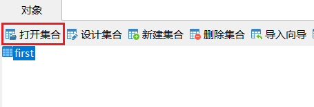
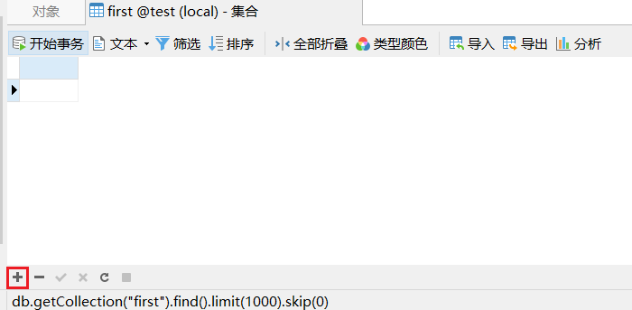
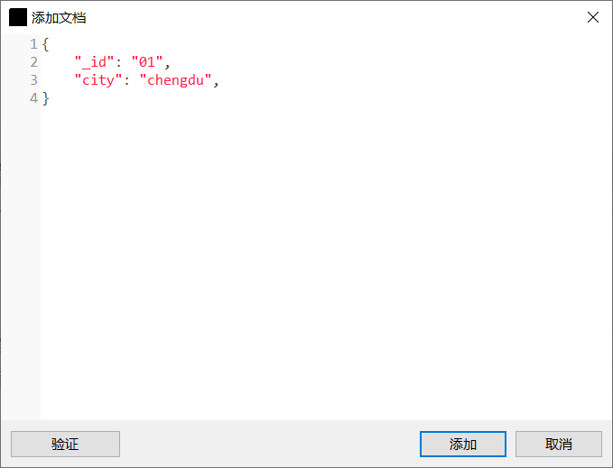
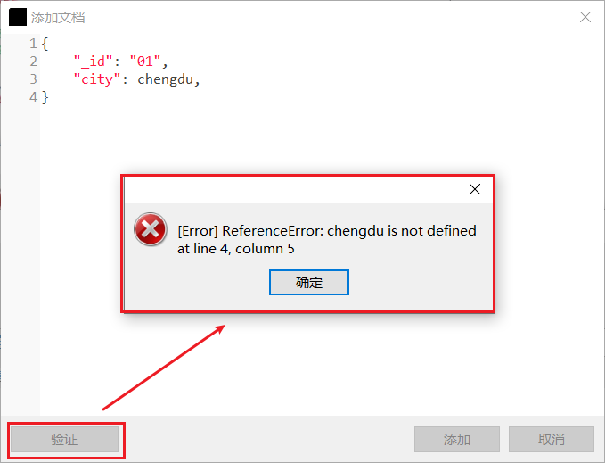
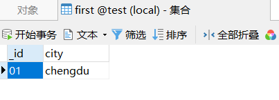

1. 第一步是打开我们希望添加文档的集合。在“对象”窗格中选择“first”对象，然后点击“对象”工具栏上的“打开集合”按钮：

2. 你将在选项卡底部找到“文档”操作。点击加号（+）以添加文档：

3. 在“添加文档”对话框中，输入以下字段，这些字段与上面的文档示例类似：

4. 在保存之前验证文档是个好主意。你可以通过“验证”按钮执行此操作。以上数据应该会产生成功信息。 如果遇到错误时，将显示错误信息，其中包含文档中的第一个错误。该错误还将显示行号和列号，以便轻松识别文档中的错误：

5. 点击“添加”按钮以关闭对话框并保存新文档。你现在应该可以在集合选项卡中看到已添加的文档：

你可以按照上述相同的过程添加更多文档