# 一.webpack基本使用

在开始使用webpack之前，请确保安装了 Node.js 的最新版本。推荐使用 Node.js 最新的长期支持版本(LTS - Long Term Support)。

查看node和npm版本:

```bash
# 查看node版本
$ node -v
# 查看npm版本
$ npm -v
```

## 1.1  webpack安装

如果使用 `webpack 4+ `版本，需要安装 `webpack-cli`。

> **注：一般安装webpack-cli时，webpack也会一并安装,但是建议一起安装，避免不必要的错误。**

### 1.1.1  全局安装webpack

```bash
# 初始化项目（初始化 npm）创建node的包文件管理
$ npm init -y
# 全局安装webpack
$ npm install webpack webpack-cli -g
# 查看安装webpack的版本号
$ webpack -v

# 如果输出正确的版本号，则表明安装成功

# 使用默认配置打包文件
$ webpack index.js(入口文件)
```

> **注：**由于每个项目所依赖的webpack版本不同，配置也不同。**因此不能全局安装webpack**。否则会造成打包错误。

### 1.1.2  卸载webpack

卸载全局安装的webpack:

```bash
$ npm uninstall webpack webpack-cli -g
```

### 1.1.3  本地安装

在项目中单独安装。

优点：存在多个项目不同webpack版本时，这样更容易分别升级项目。

```shell
# 进入项目根目录
$ cd 项目名
# 初始化项目
$ npm init -y

# 局部安装（安装最新版本的webpack）
$ npm install webpack webpack-cli -D
# 或者
$ npm install webpack webpack-cli --save-dev
# 局部安装（安装指定版本的webpack）
$ npm install webpack@4.16.5 webpack-cli -D

# 查看版本号
$ npx webpack -v

# 使用默认配置打包文件
$ npx webpack index.js(入口文件)
```

**注意：**此时使用`webpack -v`查看版本号时，无法查看。因为执行webpack命令时，nodejs会尝试去**全局环境**查找webpack，而我们是在项目中安装的webpack，因此会查找失败。此时只能使用`npx webpack -v`查看版本号。

通常，webpack 通过运行一个或多个 `npm scripts`，会在本地 node_modules 目录中查找安装的 webpack：

```json
"scripts": {
     // --config后面是指定的webpack配置文件名字，因此这两个顺序不能变
    "build": "webpack --config webpack.config.js"
}
```

> **注：**
>
> 1. 在安装一个要打包到**生产环境**的安装包时，你应该使用 `npm install --save`，
> 2. 如果你在安装一个用于**开发环境**的安装包（例如，linter, 测试库等），你应该使用 `npm install --save-dev`

### 1.1.4  修改package.json文件

我们还需要调整 package.json 文件，以便确保我们**安装包是私有的(private)**，并且移除 `main` 入口。这可以防止意外发布你的代码。

```json
{
    "name": "webpack-demo",
    "version": "1.0.0",
    "description": "",
+   "private": true,//增加为私有的
-   //"main": "index.js",//这一行删除
    "scripts": {
      "test": "echo \"Error: no test specified\" && exit 1"
    },
    "keywords": [],
    "author": "",//作者
    "license": "ISC",//开源
    "devDependencies": {//开发依赖
      "webpack": "^4.0.1",
      "webpack-cli": "^2.0.9"
    },
    "dependencies": {//生产依赖
    }
  }
```

## 1.2.webpack配置文件

使用 `npx webpack index.js`时将使用**webpack的默认配置**进行打包`index.js`文件。而默认配置往往不能满足我们的项目需求，因此需要进行webpack的自定义配置。

### 1.2.1webpack基本配置

在项目根目录下新建`webpack.config.js`用于编写webpack的配置：

```js
// webpack.config.js
const path =require('path')

module.exports = {
  // 打包模式
  mode:'development',//打包模式，默认的打包模式是production
  // 打包入口文件
  entry:'./src/index.js',
  // 打包出口文件
  output:{
    // 打包后的文件名字
    filename:'bundle.js',
    // 打包后的文件存放位置（必须是绝对路径）
    path:path.resolve(__dirname,'dist')// __dirname代表当前文件夹下
  }
}
```

> **注意：**
>
> 1. 有这个配置文件时只需执行`npx webpack`即可进行打包。因为此时会默认去找webpack.config.js文件。也就是执行npx webpack打包命令，webpack的默认配置文件就必须是`webpack.config.js`。否则就会打包错误。
> 2. 如果自己编写的webpack配置文件名字不是`webpack.config.js`，此时执行`npx webpack`，控制台就会报错：说找不到默认的配置文件。例如：我们webpack配置文件叫`webpackconfig.js`,此时要打包成功，需要执行`npx webpack --config webpackconfig.js `才能打包成功。表示webpack此时以webpackconfig.js为配置文件进行打包。

### 1.2.2配置打包命令

在package.json文件的`scripts`脚本下添加打包命令。避免每次在控制台运行`npx webpack`命令。

```js
// package.json
{
  "scripts":{
    // 打包命令
    "build":"webpack"
  }
}
```

- 可以使用 `npm run build` 命令，来替代我们之前使用的 `npx` 命令。

- 通过向`npm run build` 命令和你的参数之间添加两个中横线，可以将自定义参数传递给 webpack，例如：`npm run build -- --colors`。

## 1.3webpack-cli作用

如果没有安装`webpack-cli`这个文件，就无法在命令行下执行全局安装的`webpack`命令和局部安装的`npx webpack`命令

作用：使我们能在命令行使用`webpack`相关命令。

## 1.4打包输出信息

```js
Hash: 746dba14f98f4132d613   // 本次打包唯一的hash值
Version: webpack 4.44.1		// 本次打包使用的webpack版本
Time: 47ms	// 打包耗时
/*


* Asset：打包输出的文件名字
* Size：打包后文件大小
* Chunks：打包文件对应的id值
* Chunk Names：打包文件对应的文件。此时这里是main，是因为我们入口文件entry:{main:'./src/main.js'}中对应的main
*/
Built at: 2020-08-12 10:03:52 ├F10: PM┤//打包时间
    Asset      Size  Chunks             Chunk Names
bundle.js  3.79 KiB    main  [emitted]  main

Entrypoint main = bundle.js	// 入口文件
[./src/main.js] 20 bytes {main} [built]// 需要打包的文件列表
```

## 1.5项目目录结构

```markdown
webpack-vue-template
├─ .gitignore
├─ package-lock.json
├─ package.json
├─ src
│  └─ main.js
└─ webpack.config.js
```

# 二.entry

指示 webpack 应该使用哪个模块，来作为构建其内部依赖图的开始。进入入口起点后，webpack 会找出有哪些模块和库是入口起点（直接和间接）依赖的。

可以通过在 webpack 配置中配置 `entry` 属性，来指定一个入口起点（或多个入口起点）。

`entry` 配置的最简单例子：

```js
// webpack.config.js
module.exports = {
  entry: './src/index.js'
};
```

> **注意：**
>
> - webpack默认会以 `./src/index.js`为打包的入口文件。即如果不指定entry，则webpack打包时默认会在项目的src下查找`index.js`文件，如果有这个文件则打包成功，如果没有此文件，则报找不到入口错误。

## 2.1字符串语法

属性值为**字符串**形式。

```js
// webpack.config.js
module.exports={
   entry: './src/index.js'
}
```

`entry` 属性的单个入口语法，是下面的简写：

```js
//webpack.config.js
module.exports={
   entry: {
    main: './src/index.js'
  }
}
```

打包输出信息：

```bash
Hash: 12a7fbc8a81fc16aecea
Version: webpack 4.44.1
Time: 372ms
  Asset     Size  Chunks             Chunk Names
main.js  554 KiB    main  [emitted]  main
Entrypoint main = main.js
[./node_modules/webpack/buildin/global.js] (webpack)/buildin/global.js 472 bytes {main} [built]
[./node_modules/webpack/buildin/module.js] (webpack)/buildin/module.js 497 bytes {main} [built]
[./src/main.js] 214 bytes {main} [built]
```

此时`dist`目录下生成了1个文件：


## 2.2数组语法

属性值为数组形式。

```js
//webpack.config.js
module.exports = {
   entry: ['./src/main.js','lodash']
}
```

`entry` 属性的数组语法，是下面的简写：

```js
//webpack.config.js
module.exports={
   entry: {
     main: ['./src/main.js','lodash']
   }
}
```

向 `entry` 属性传入**文件路径数组**将创建**多个主入口**。在你想要多个依赖文件一起注入，并且将它们的依赖输出到一个`chunk`时，传入数组的方式就很有用。

打包输出信息：

```js
Hash: 14ab9c7be43f7b5a467d
Version: webpack 4.44.1
Time: 358ms
Built at: 2020-08-13 11:29:25
  Asset     Size  Chunks             Chunk Names
main.js  555 KiB    main  [emitted]  main
Entrypoint main = main.js
[0] multi ./src/main.js ./src/index.js 40 bytes {main} [built]
[./node_modules/webpack/buildin/global.js] (webpack)/buildin/global.js 472 bytes {main} [built]
[./node_modules/webpack/buildin/module.js] (webpack)/buildin/module.js 497 bytes {main} [built]
[./src/index.js] 21 bytes {main} [built]
[./src/main.js] 214 bytes {main} [built]
```

此时输出文件只有一个`main.js`。表示将数组中引入的两个文件一起打包到了`main.js`。

此时`dist`目录下生成了1个文件：


## 2.3对象语法

属性值为**对象**形式。这个是**最完整的entry配置**，其他形式只是它的简化形式而已。

```js
//webpack.config.js
module.exports = {
	entry: {
    	main: './src/index.js',//值类型可以为字符串或者数组
    	login: './src/login.js'
  	},
  output:{
    // [name]占位符，根据entry的属性名决定
  	filename:'[name].js',
  	path:path.resolve(__dirname,'dist')
	}
}
```

> **注意：**
>
> - 如果存在多个入口文件的情况下，则必须自定义配置`output`配置项，并且output的`filename`要使用`[name]`占位符，根据入口的`key`作为输出文件的名字动态输出。如果不配置`output`配置项，打包时，控制台会报错，并且只会打包出一个文件。

打包输出信息：

```js
Hash: e8f77d56163515053f38
Version: webpack 4.44.1
Time: 363ms
Built at: 2020-08-13 11:22:16	
   Asset      Size  Chunks             Chunk Names
index.js  3.79 KiB   index  [emitted]  index
 main.js   554 KiB    main  [emitted]  main
Entrypoint main = main.js
Entrypoint index = index.js
[./node_modules/webpack/buildin/global.js] (webpack)/buildin/global.js 472 bytes {main} [built]
[./node_modules/webpack/buildin/module.js] (webpack)/buildin/module.js 497 bytes {main} [built]
[./src/index.js] 21 bytes {index} [built]
[./src/main.js] 214 bytes {main} [built]
```

从输出信息的`Asset`字段，可以看出输出了两个文件，分别是：`index.js`,`main.js`

此时`dist`目录下生成了两个文件：

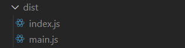

## 2.4单页应用程序

```js
//webpack.config.js
const config = {
  	// 打包入口配置
	entry:'./src/index.js',
	// 打包出口配置
	output:{
    //配置打包输出的名字为 bundle.js
  	filename:'bundle.js',
  	path:path.resolve(__dirname,'dist')
	}
}

module.exports = config;
```

此时打包输出的js文件只有一个`bundle.js`。

## 2.5多页面应用程序

配置了几个入口，打包就输出多少个js文件。此时必须将`output`配置项的`filename`字段配置使用占位符`[name].js`

```js
//webpack.config.js
const config={
  entry:{
    main:'./src/index.js',//打包到main.js
    index:'./src/index.js'//打包到index.js
	},
	output:{
  	 // [name]在这个地方为占位符，打包时会替换为入口配置的键名
 	 filename:'[name].js',
 	 path:path.resolve(__dirname,'dist')
	}
}
module.exports = config;
```

此时打包输出的js文件为两个，分别是`main.js`,`index.js`。这两个js文件名为打包入口`entry`中配置的`key`属性。

# 三. output

**output** 属性告诉 webpack 在哪里输出它所创建的 `bundles`，以及如何命名这些文件。

基本上，整个应用程序结构，都会被编译到你指定的输出路径的文件夹中。

> **注意：**
>
> 1. 即使可以存在多个`入口`起点，但只能指定一个`输出`配置。
> 2. 如果没有配置`output`，此时输出会使用output默认配置。也就是输出到`根目录`的`./dist`文件下。

## 3.1单个入口

在 webpack 中配置 `output` 属性的最低要求是：将它的值设置为一个对象，包括以下两个`必填属性`：

- `filename`： 用于输出文件的文件名和目录。
- `path`：输出文件目录（将来所有资源输出的公共目录）。

对于**单个入口**起点，`filename` 会是一个静态名称。

```js
//webpack.config.js
const path=require('path')
module.exports={
  	entry:'./src/index.js',
   // 此配置将一个单独的 bundle.js 文件输出到当前目录下的dist目录中。
   output: {
     // 此时输出打包的js文件路径为：dist/js/bundle.js
    filename: 'js/bundle.js',
    path:path.resolve(__dirname,'dist')
  }
}
```

此配置将一个单独的 `bundle.js` 文件输出到 `/dist` 目录中。

```js
Hash: b1e0de12e8a811a4a2cf
Version: webpack 4.44.1
Time: 55ms
Built at: 2020-08-15 5:01:58 ├F10: PM┤
    Asset      Size  Chunks             Chunk Names
bundle.js  5.67 KiB    main  [emitted]  main
Entrypoint main = bundle.js
```

## 3.2多个入口

如果配置创建了多个单独的 `chunk`（例如，使用多个入口起点或使用像 `CommonsChunkPlugin `这样的插件），则应该使用**占位符**来确保每个文件具有唯一的名称。

```js
module.exports={
	entry: {
   	 	index: './src/index.js',
   	 	main: './src/main.js'
 	 },
    output: {
		// 使用占位符 [name]来确保每一个输出文件有唯一名称
		filename: '[name].js',
		path: __dirname + '/dist'
  	}
}

// 写入到硬盘：./dist/index.js, ./dist/main.js
```

如果此时`filename`为固定名称`bundle.js`，则打包时会报错:

```bash
ERROR in chunk main [entry]
bundle.js
Conflict: Multiple chunks emit assets to the same filename bundle.js (chunks index and main)
```

即多个文件资源有相同的文件名称。此时需要使用`占位符` 来确保每一个输出的文件都有唯一的名称。

## 3.3`filename`配置项

**（1）使用入口key作为输出文件名：**

```js
filename: "[name].bundle.js"
```

打包后输出:

```bash
Hash: e8f77d56163515053f38
Version: webpack 4.44.1
Time: 375ms
Built at: 2020-08-13 13:53:48
          Asset      Size  Chunks             Chunk Names
 index.bundle.js  3.79 KiB   index  [emitted]  index
 main.bundle.js   554 KiB    main  [emitted]  main
Entrypoint main = main.bundle.js
Entrypoint index = index.bundle.js
```

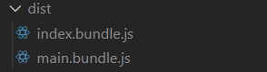

**（2）使用内部 `chunk id`:**

```js
filename: "[id].bundle.js"
```

**（3）使用每次构建过程中，唯一的 `hash `生成:**

默认hash值长度为20。

```js
filename: "[name].[hash].bundle.js"

// 指定hash值长度:此时生成的hash值只有6位
filename: "[name].[hash:6].bundle.js"
```

输出信息：

```bash
Hash: e8f77d56163515053f38
Version: webpack 4.44.1
Time: 666ms
Built at: 2020-08-13 13:59:54
                               Asset      Size  Chunks                         Chunk Names
 index.e8f77d56163515053f38.bundle.js  3.79 KiB   index  [emitted] [immutable]  index
 main.e8f77d56163515053f38.bundle.js   554 KiB    main  [emitted] [immutable]  main
Entrypoint main = main.e8f77d56163515053f38.bundle.js
Entrypoint index = index.e8f77d56163515053f38.bundle.js
```

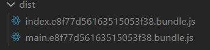

**（4）使用基于每个 `chunk` 内容的 `hash`：**

```js
filename: "[chunkhash].bundle.js"
filename: "[chunkhash:6].bundle.js"
```

输出信息：

```bash
Hash: e8f77d56163515053f38
Version: webpack 4.44.1
Time: 382ms
Built at: 2020-08-13 13:57:05
                         Asset      Size  Chunks                         Chunk Names
 089a5654d56f6f28f211.bundle.js  3.79 KiB   index  [emitted] [immutable]  index
 795b0c772923ff2f92de.bundle.js   554 KiB    main  [emitted] [immutable]  main
Entrypoint main = 795b0c772923ff2f92de.bundle.js
Entrypoint index = 089a5654d56f6f28f211.bundle.js
[./node_modules/webpack/buildin/global.js] (webpack)/buildin/global.js 472 bytes {main} [built]
[./node_modules/webpack/buildin/module.js] (webpack)/buildin/module.js 497 bytes {main} [built]
[./src/index.js] 21 bytes {index} [built]
[./src/main.js] 214 bytes {main} [built]
```

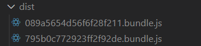

## 3.4打包输出时自动在html文件的script中添加`cdn`地址

项目开发完成后，有时需要将静态资源（比如js文件，图片等）放到静态资源服务器上，而`html`文件放在其他服务器上的，此时，`html`文件中引入的js文件则会找不到相应的js文件，当然手工加入cdn服务器地址也可以，但是当多个html文件需要引入多个js文件时，则会加大工作量，还容易出错。

此时只需要在output配置项中添加`publicPath`字段，**值为cdn地址**，即可在html文件中自动添加cdn地址。

```js
//webpack.config.js
const config = {
		entry:{
			main:'./src/index.js',
			index:'./src/index.js'
        },
		output:{
			// 为html文件引入js文件自动添加cdn地址或者公共路径，注意publicPath为驼峰命名
			publicPath:'http://cdn.com.cn'
			filename:'[name].js',
			path:path.resolve(__dirname,'dist')
	}
}
module.exports = config;
```

输出的html文件：

```html
<!DOCTYPE html>
<html lang="en">
  <head>
    <meta charset="UTF-8" />
    <meta name="viewport" content="width=device-width, initial-scale=1.0" />
    <title>模版文件</title>
  </head>
  <body>
    <!--引入的js文件都自动添加了cdn地址-->
    <script src="http://cdn.com.cn/main.a08e89.bundle.js"></script>
    <script src="http://cdn.com.cn/index.a08e89.bundle.js"></script>
  </body>
</html>
```

> **注意：**在编译时不知道最终输出文件的 `publicPath` 的情况下，`publicPath` 可以留空，并且在入口起点文件运行时动态设置。 

## 3.5chunkFilename

如果是通过代码分割，进行间接引入代码的方式，打包输出的名字就是`chunkFilename`配置的内容。

```js
output:{
  	filename:'[name].js',
    chunkFilename:'[name].chunk.js'
 	path:path.resolve(__dirname,'dist')
}
```

# 四.loader

webpack默认只能打包以`.js`结尾的文件，如果需要打包图片，css等文件时，就需要使用loader告诉webpack怎么去打包。

`loader`让 webpack 能够去处理那些非 JavaScript 文件（webpack 自身只理解 JavaScript）。loader 可以将所有类型的

文件转换为 webpack 能够处理的有效模块，然后你就可以利用 webpack 的打包能力，对它们进行处理。

> **注意:**webpack 不会更改代码中除 `import` 和 `export` 语句以外的部分。如果你在使用其它 ES2015 特性，请确保你在 webpack 的 loader 系统中使用了一个像是 Babel的转译器。

## 4.1loader基本配置

在 webpack 的配置中 **loader** 有两个必填项：

1. `test` 属性：用于标识出应该被对应的 loader 进行转换的某个或某些文件。
2. `use` 属性：表示进行转换时，应该使用哪个 loader。

```js
//webpack.config.js
const config = {
  module: {
    rules: [
      { test: /\.txt$/, use: 'raw-loader' }
    ]
  }
};

module.exports = config;
```

以上配置中，对一个单独的 module 对象定义了 `rules` 属性，里面包含两个必须属性：`test` 和 `use`。这告诉 webpack 编译器(compiler) 如下信息：

“嘿，webpack 编译器，当你碰到「在 `require()`/`import` 语句中被解析为 '.txt' 的路径」时，在你对它打包之前，先**使用** `raw-loader` 转换一下。”

- test值类型

正则表达式，不能写成字符串。

- use值类型

字符串类型，数组类型，对象类型。

-  loader执行顺序

从右到左，从下到上执行。

## 4.2file-loader

将文件打包到输出文件夹，并返回（相对）URL。

底层原理：遇到jpg、png、txt等静态文件时，先将此文件移到输出根目录下，再将此文件的地址返回给变量。

**1.安装：**

```bash
npm install --save-dev file-loader
```

**2.基础配置：**

```js
 module:{
    rules:[
      {
       test:/\(.jpg|png|gif)$/,
       use:'file-loader'
      }
    ]
}
```

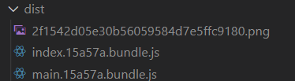

**3.图片重命名：**

默认情况下，生成的文件的文件名就是文件内容的 MD5 哈希值并会保留所引用资源的原始扩展名。

例如图片名字为：`logo.jpg`,则打包后的图片名字为：`20位hash值.jpg`

```js
 module:{
    rules:[
      {
       test:/\.(jpg|png|gif)$/,
       use:{
         loader:'file-loader',
         //配置项
         options:{
           //placeholder 占位符
           /*
           	配置打包后文件的名字如何命名：
           		[name]：表示原始名字，
           		[hash]：表示名字后面加上hash值(20位)，使用 [hash:n] 的形式指定输出的hash值位数。
           		[ext]：表示原始文件的后缀名
           */
           name:'[name]_[hash:6].[ext]'
         }
       }
      }
    ]
  },
```

此时图片存放位置为文件打包输出的根目录下，并且名字为`原始名字_hash值.png`.

例如图片名字为：`logo.png`，则打包后图片名字为：`logo_hash值.png`

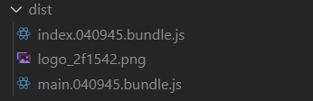

**4.配置打包后文件的存放位置：**

```js
{
         loader:'file-loader',
         options:{
           // 配置打包后文件的名字
           name:'[name]_[hash].[ext]',
           // 配置打包后存放位置
           // 表示打包后的图片文件存放在images/文件夹下。
           //注意：此时images文件夹在打包输出的根目录下。也就是以output配置的path为根路径。
           outputPath:'images/'
         }
       }
```

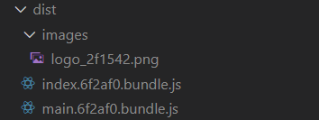

**5.使用`file-loader`打包字体文件:**

```js
{
       test:/\.(eot|ttf|svg)$/,
       use:{
         loader:'file-loader',
         options:{
           name:'[name].[ext]',
           outputPath:'fonts/'
         }
       }
}
```

## 4.3url-loader

与`file-loader`类似，只是多了`limit`配置项。但是打包图片时会将图片转换成base64的。并且图片文件会打包到输出的js文件中。

1. 安装

`url-loader`依赖于`file-loader`，因此需要一起进行安装。

```bash
npm install --save-dev url-loader file-loader
```

2. 配置

```js
{
         loader:'url-loader',
         options:{
           // 配置打包后文件的名字
           name:'[name]_[hash].[ext]',
           // 配置打包后存放位置
           // 表示打包后的文件存放在images/文件夹下
           outputPath:'images/',
           // 当图片大于8kb时就存放在images/文件夹下（相当于file-loader），小于时就存放在打包后的js文件中
           //此时还是需要安装file-loader
           limit:8*1024
         }
       }
```

优点：打包到js文件中，减少了http请求。但是图片过大会导致js文件很大，加载js文件很耗时。

推荐：如果图片过大，建议使用`file-loader`,加载js文件就会很快。如果图片很小，建议使用`url-loader`,减少http请求。

> **注意：**url-loader只能处理背景引入的图片，不能处理html标签(img标签)中引入的图片。**处理html中的图片需要使用html-loader**

## 4.4html-loader

用于处理html中引入的图片。

```js
rules:[
  {
    test:/\.(jpg|png|gif)$/,
    loader:'url-loader',
    options:{
      limit:8*1024,
      //因为url-loader默认使用es6模块化解析，而html-loader引入图片是commonjs
      //解析时会出现：[object module]
      //解决办法：关闭url-loader的es6模块化，使用commonjs解析
      esModule:false,
      // 给图片重命名
      name:'[hash:10].[ext]'
    }
  },
  {
    test:/\.html$/,
    //处理html文件的img图片（负责引入img，从而能被url-loader进行处理）
    loader:'html-loader'
  }
]
```

## 4.5style-loader

建议将 `style-loader` 与 `css-loader` 结合使用

1. 安装

```bash
npm install style-loader css-loader -D
```

2. 配置

```js
 {
        test: /\.css$/,
        use: [ 
          // 创建style标签，将样式放入
          'style-loader', 
          // 将css文件整合到js文件中
          'css-loader' 
        ]
      }
```

原理：`css-loader`负责将css文件之间的依赖关系合并。`style-loader`将合并后的css文件挂载到html文件的head中(以内部样式表形式)。

## 4.6postcss-loader

使用`postcss-loader`实现自动给样式添加厂商前缀。

1. 安装

```bash
npm i -D postcss-loader
```

2. 配置postcss

根目录下新建`postcss.config.js`文件。

安装`npm i -D autoprefixer`插件。

```js
//postcss.config.js
module.exports = {
  plugins: [
    require('autoprefixer')
  ]
}
```

3. 使用

同时需要在需要添加前缀的类型文件中使用`postcss-loader`。打包时遇到`postcss-loader`，就会去找`postcss.config.js`配置文件，并使用配置文件中的插件。

```js
{
      test: /\.scss$/,
      use: [
        'style-loader',
        'css-loader',
        'sass-loader',
        'postcss-loader'
        ]
}
```

## 4.7css-loader

js文件中引入scss文件:

- 当在js文件中使用`import 'index.scss'`引入样式文件时，依次执行postcss-loader，sass-loader，css-loader，style-loader。

在scss文件中引入scss文件:

- 当在scss文件中使用`@import './index.scss'`引入其他scss文件时，打包时有可能就不会使用postcss-loader，sass-loader。如果也让打包时使用这两个loader，则需要在`css-loader`中进行配置。

```js
 {
        test: /\.scss$/,
        use: [ 
          'style-loader', 
          {
          	loader:'css-loader',
          	options:{
              //使用import语法引入的scss文件也需要走下面两个loader
            importLoaders:2
          	}
       	 	}
          'sass-loader',
          'postcss-loader'
        ]
}
```

- cssloader模块化打包

当在入口js文件中使用`import './index.css'`这种全局方式引入css文件时。此样式会作用于所有文件。这会导致一些未知的错误。

配置：

```js
 {
        test: /\.scss$/,
        use: [ 
          'style-loader', 
          {
          	loader:'css-loader',
          	options:{
              //使用import语法引入的scss文件也需要走下面两个loader
            	importLoaders:2,
              //开启模块化打包
            	modules:true
          	}
       	 	}
          'sass-loader',
          'postcss-loader'
        ]
}
```

样式引入方式：

```js
//index.js
import style from './index.scss'

//使用
style.类名 添加到需要使用的上面
```

## 4.8less-loader

加载和转译 LESS 文件

1. 安装

```bash
npm install --save-dev less-loader less
```

2. 基础配置

```js
module.exports = {
    ...
    module: {
        rules: [{
            test: /\.less$/,
            use: [{
                loader: "style-loader" 
            }, {
                loader: "css-loader"
            }, {
                loader: "less-loader" 
            }]
        }]
    }
};
```

## 4.9打包scss文件

安装：

```bash
npm install sass-loader node-sass  --save-dev
```

配置：

```js
{
      test: /\.scss$/,
      use: [{
          loader: "style-loader" // 将 JS 字符串生成为 style 节点
      }, {
          loader: "css-loader", // 将 CSS 转化成 CommonJS 模块
        	options:{
            //在scss文件中使用@import语法引入其他scss文件时，也要走下面两个loader。如果不配置，将不会走sass-loader，postcss-loader
            importLoaders:2
          }
      }, {
          loader: "sass-loader" // 将 Sass 编译成 CSS
      },
      'postcss-loader'
}
```

例如：

在`src/assets/css`下新建`index.scss`和`main.scss`文件

```scss
/*index.scss*/
body{
  width:100px;
  height:100px
}
```

在`main.scss`中引入编写的`index.scss`文件

```scss
/*main.scss*/
@import './index.scss';
body{
  color:red;
  font-size:14px;
}
```

此时进行打包，如果没有在`css-loader`中配置`importLoaders`项，则打包`main.scss`时，其中引入的`index.scss`就不会走`sass-loader`和`postcss-loader`。

## 4.10单个loader的写法

```js
module:{
  rules:[
    test:/\.(jpg|png|gif)$/,
    loader:'url-loader',
    options:{
    	limit:8*1024
    }
    
  ]
}
```

# 五.plugins

loader 被用于转换某些类型的模块，而插件(`plugins`)则可以用于执行范围更广的任务。插件的范围包括，从打包优化和压缩，一直到重新定义环境中的变量。

想要使用一个插件，你只需要 `require()` 它，然后把它添加到 `plugins` 数组中。多数插件可以通过选项(`option`)自定义。你也可以在一个配置文件中因为不同目的而多次使用同一个插件，这时需要通过使用 `new` 操作符来多次创建它的实例。

```js
//webpack.config.js
//1.导入插件
const HtmlWebpackPlugin = require('html-webpack-plugin'); 

const config = {
  //2.在plugins配置项中实例化插件
  plugins: [
    new HtmlWebpackPlugin()
  ]
};

module.exports = config;
```

## 5.1html-webpack-plugin

`html-webpack-plugin`会在打包结束后，自动生成一个html文件，并默认把打包生成的所有js文件自动引入到这个html文件中。

1. 安装：

```bash
npm install --save-dev html-webpack-plugin
```

2. 基本配置

```js
//webpack.config.js
//1. 导入插件
const HtmlWebpackPlugin = require('html-webpack-plugin');
const path = require('path');
//2.实例化插件
const htmlWebpackPlugin=new HtmlWebpackPlugin()

const config = {
  entry: {
    main:'./src/main.js',
    index:'./src/index.js'
  },
  output: {
    path: path.resolve(__dirname, './dist'),
    filename: '[name]_[hash:6].[ext]'
  },
  //3.使用插件
  plugins: [htmlWebpackPlugin]
};
module.exports=config
```

如果你有多个 webpack 入口点， 他们都会在生成的HTML文件中的 `script` 标签内。

此时打包输出的`dist`文件夹下自动生成了`index.html`文件。并且`index.html`文件中自动引入了打包输出的两个js文件。

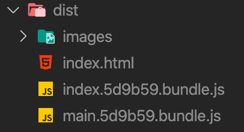

```html
<!DOCTYPE html>
<html>
  <head>
    <meta charset="utf-8" />
    <title>Webpack App</title>
    <meta name="viewport" content="width=device-width, initial-scale=1" />
  </head>
  <body>
    <script src="main.5d9b59.bundle.js"></script>
    <script src="index.5d9b59.bundle.js"></script>
  </body>
</html>
```

> **注：**如果你有任何CSS assets 在webpack的输出中（例如， 利用`ExtractTextPlugin`提取CSS）， 那么这些将被包含在HTML head中的`<link>`标签内。

### 5.1.1配置html模版

默认情况下，`html-webpack-plugin`生成的`index.html`文件不含任何html标签。有时我们需要在`body`标签中添加一个根标签，此时就需要我们自定义`index.html`(模版文件)。

- 在项目根目录下的`public`文件夹下新建`index.html`模版文件

```html
<!DOCTYPE html>
<html lang="en">
  <head>
    <meta charset="UTF-8" />
    <meta name="viewport" content="width=device-width, initial-scale=1.0" />
    <title>我是自定义的模版文件</title>
  </head>
  <body>
    <!-- 添加根标签 -->
    <div id="app"></div>
  </body>
</html>

```

- 在插件中添加`template`字段指向新建的模版文件

```js
//webpack.config.js
//1. 导入插件
const HtmlWebpackPlugin = require('html-webpack-plugin');
const path = require('path');
//2.实例化插件
const htmlWebpackPlugin=new HtmlWebpackPlugin({
   //指向我们新建的模板文件路径
   template:'./public/index.html'
})

const config = {
  entry: 'index.js',
  output: {
    path: path.resolve(__dirname, './dist'),
    filename: 'index_bundle.js'
  },
  //3.使用插件
  plugins: [htmlWebpackPlugin]
};
module.exports=config
```

此时打包输出的html文件中就多了添加的根标签，并且也引入了js文件：

```html
<!DOCTYPE html>
<html lang="en">
  <head>
    <meta charset="UTF-8" />
    <meta name="viewport" content="width=device-width, initial-scale=1.0" />
    <title>我是自定义的模版文件</title>
  </head>
  <body>
    <!-- 添加根标签 -->
    <div id="app"></div>
    <script src="main.c9bbdc.bundle.js"></script>
    <script src="index.c9bbdc.bundle.js"></script>
  </body>
</html>
```

### 5.1.2配置html文件的title

在index.html 文件中的`title`标签内部可以使用 `<%= htmlWebpackPlugin.options.title %>` 设置网页标题。

a.在插件实例化时添加title字段

```js
//webpack.config.js
const htmlWebpackPlugin=new HtmlWebpackPlugin({
   //指向我们新建的模板文件路径
   template:'./public/index.html',
  //配置html文件的title值
  title:'我是html标题'
})
```

b.在html模版文件中动态获取title

```html
<!DOCTYPE html>
<html lang="en">
  <head>
    <meta charset="UTF-8" />
    <meta name="viewport" content="width=device-width, initial-scale=1.0" />
    <title><%= htmlWebpackPlugin.options.title %></title>
  </head>
  <body>
    <!-- 添加根标签 -->
    <div id="app"></div>
  </body>
</html>
```

打包输出的html文件：

```html
<!DOCTYPE html>
<html lang="en">
  <head>
    <meta charset="UTF-8" />
    <meta name="viewport" content="width=device-width, initial-scale=1.0" />
    <title>我是html标题</title>
  </head>
  <body>
    <!-- 添加根标签 -->
    <div id="app"></div>
    <script src="main.655cbc.bundle.js"></script>
    <script src="index.655cbc.bundle.js"></script>
  </body>
</html>
```

此时title中的文字就是`HtmlWebpackPlugin`中配置的title字段值。

### 5.1.3配置打包输出文件存放路径和文件名

默认情况下，插件生成的html文件名为`index.html`，存放在`ouput.path`的根目录下。

通过配置`filename`字段，来修改输出的html文件名和存放路径。

```js
//webpack.config.js
const htmlWebpackPlugin = new HtmlWebpackPlugin({
  title: "我是html标题",
  template: "./public/index.html",
  // 配置输出文件名和存放路径
  filename: "./html/login.html",
});
```

此时存放在`ouput.path`目录下的html文件夹中，名字为`login.html`

注：**生成文件的根路径为`ouput.path`的目录**，也就是在filename配置的路径都是在 `output.path` 目录下生成文件和文件夹。

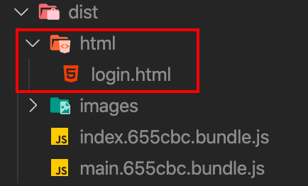

补充：

1、filename配置的html文件目录是相对于`webpackConfig.output.path`路径而言的，不是相对于当前项目目录结构的。
2、指定生成的html文件内容中的`link`和`script`路径是相对于生成目录下的，写路径的时候请写生成目录下的相对路径。

### 5.1.4配置允许插入到模板中的一些chunk

允许插入到模板中的一些`chunk`，不配置此项默认会将`entry`中所有的`chunk`注入到模板中。在配置多个页面时，每个页面注入的`chunk`应该是不相同的，需要通过该配置为不同页面注入不同的`chunk`；

值为数组类型，数组中为打包生成的chunk名字（打包时控制台输出的chunk字段值）。

```bash
Hash: 655cbc267cbe5a63904c
Version: webpack 4.44.1
Time: 709ms
Built at: 2020-08-15 11:09:12 ├F10: PM┤
                 Asset       Size  Chunks                         Chunk Names
images/logo_2f1542.png    108 KiB          [emitted]              
index.655cbc.bundle.js     18 KiB   index  [emitted] [immutable]  index
            login.html  324 bytes          [emitted]              
 main.655cbc.bundle.js    554 KiB    main  [emitted] [immutable]  main
Entrypoint main = main.655cbc.bundle.js
Entrypoint index = index.655cbc.bundle.js
```

```js
//webpack.config.js
const htmlWebpackPlugin = new HtmlWebpackPlugin({
  title: "我是html标题",
  template: "./public/index.html",
  filename: "login.html",
  //只将打包生成Chunk Names为index的添加到该html模版中
  chunks: ["index"],
});
```

打包生成的html：

```html
<!DOCTYPE html>
<html lang="en">
  <head>
    <meta charset="UTF-8" />
    <meta name="viewport" content="width=device-width, initial-scale=1.0" />
    <title>我是html标题</title>
  </head>
  <body>
    <!-- 添加根标签 -->
    <div id="app"></div>
  <script src="index.655cbc.bundle.js"></script></body>
</html>
```

此时只在body中引入了chunks为index的js文件。

### 5.1.5配置多页面打包

`html-webpack-plugin`的一个实例生成一个html文件，如果单页应用中需要多个页面入口（多个template值），或者多页应用时配置多个html时，那么就需要实例化该插件多次；

即有几个页面就需要在webpack的plugins数组中配置几个该插件实例：

```js
const loginhtmlWebpackPlugin = new HtmlWebpackPlugin({
  title: "我是登录页面",
  template: "./public/index.html",
  filename: "login.html",
  //登录页面需要的js文件
  chunks: ["index"],
});
const indexhtmlWebpackPlugin = new HtmlWebpackPlugin({
  title: "我是首页",
  template: "./public/index.html",
  filename: "index.html",
  //首页需要的js文件
  chunks: ["main"],
});
module.exports = {
  // 打包模式
  mode: "development",
  // 打包入口
  entry: {
    main: "./src/main.js",
    index: "./src/index.js",
  },
  //插件配置
  plugins: [loginhtmlWebpackPlugin, indexhtmlWebpackPlugin],
  // 打包出口文件
  output: {
    filename: "[name].[hash:6].bundle.js",
    path: path.resolve(__dirname, "./dist"),
  },
};
```

如上例应用中配置了1个入口页面：`index.html`。

此时在`dist`目录下会生成两个html文件，分别是`index.html`和`login.html`

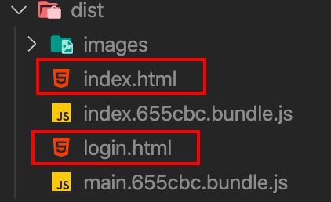

打包生成的`index.html`：

```html
<!DOCTYPE html>
<html lang="en">
  <head>
    <meta charset="UTF-8" />
    <meta name="viewport" content="width=device-width, initial-scale=1.0" />
    <title>我是首页</title>
  </head>
  <body>
    <!-- 添加根标签 -->
    <div id="app"></div>
  <script src="main.655cbc.bundle.js"></script></body>
</html>
```

打包生成的`login.html`：

```html
<!DOCTYPE html>
<html lang="en">
  <head>
    <meta charset="UTF-8" />
    <meta name="viewport" content="width=device-width, initial-scale=1.0" />
    <title>我是登录页面</title>
  </head>
  <body>
    <!-- 添加根标签 -->
    <div id="app"></div>
  <script src="index.655cbc.bundle.js"></script></body>
</html>
```

### 5.1.6其他配置项

> 1. `inject`

向`template`或者`templateContent`中注入所有静态资源，不同的配置值注入的位置不相同。

- `true`或者`body`：所有JavaScript资源插入到body元素的底部。
- `head`: 所有JavaScript资源插入到head元素中。
- `false`： 所有静态资源css和JavaScript都不会注入到模板文件中。

> 2. **`favicon`**

添加特定favicon路径到输出的html文档中，这个同`title`配置项，需要在模板中动态获取其路径值

> 3. `hash`

值为：true|false。是否为所有注入的静态资源添加webpack每次编译产生的唯一hash值。

值为true时，在引入的静态资源后面动态生成hash值（❓后面的值）

```html
<!DOCTYPE html>
<html lang="en">
  <head>
    <meta charset="UTF-8" />
    <meta name="viewport" content="width=device-width, initial-scale=1.0" />
    <title>我是html标题</title>
  </head>
  <body>
    <!-- 添加根标签 -->
    <div id="app"></div>
    <script src="main.655cbc.bundle.js?655cbc267cbe5a63904c"></script>
    <script src="index.655cbc.bundle.js?655cbc267cbe5a63904c"></script>
  </body>
</html>
```

> 4. `excludeChunks`

这个与`chunks`配置项正好相反，用来配置不允许注入的chunk。

值类型：数组类型。

值为打包生成的`chunk`名称。

```js
const loginhtmlWebpackPlugin = new HtmlWebpackPlugin({
  title: "我是登录页面",
  template: "./public/index.html",
  filename: "login.html",
  //除了chunk为main的不注入到login.html，其他chunk都会注入到login.html
  excludeChunks: ["main"],
});
```

> 5. `chunksSortMode`

none | auto| function，默认auto； 允许指定的chunk在插入到html文档前进行排序。
**function**值可以指定具体排序规则；**auto**基于chunk的id进行排序； **none**就是不排序

> 6. `showErrors`

true|false，默认true；是否将错误信息输出到html页面中。这个很有用，在生成html文件的过程中有错误信息，输出到页面就能看到错误相关信息便于调试。

### 5.1.7压缩html配置

```js
plugins: [
    new HtmlWebpackPlugin({
      template: './src/index.html',
      // 压缩html代码
      minify: {
        // 移除空格
        collapseWhitespace: true,
        // 移除注释
        removeComments: true
      }
    })
  ],
```

## 5.2clean-webpack-plugin

执行打包前先删除上一次打包生成的文件，然后再执行本次打包操作。这样会避免打包后的文件每次都是最新的，并且不会有其他多余的文件（比如修改打包输出文件名时，打包后的文件就会存在上次打包后的文件和修改后打包出的文件，导致分不清哪一次是最新的）。

1. 安装:

```bash
npm install clean-webpack-plugin -D
```

2. 配置：

```js
//webpack.config.js

const HtmlWebpackPlugin = require('html-webpack-plugin');
//1. 导入插件
//旧版本导入插件方式
//const CleanWebpackPlugin = require('clean-webpack-plugin');
//新版本导入插件方式
const { CleanWebpackPlugin } = require('clean-webpack-plugin');
const path = require('path');

const webpackConfig = {
  entry: 'index.js',
  output: {
    path: path.resolve(__dirname, './dist'),
    filename: 'index_bundle.js'
  },
  //实列化插件
  plugins: [
    //打包之后运行
    //这个插件默认生成的html文件不含任何html标签，因此需要添加相应的配置项
    new HtmlWebpackPlugin({
      //指定打包的模板文件路径
      template:'src/index.html'
    }),
    //2. 使用插件
    //打包之前先被运行
    //打包之前先删除dist目录下的所有文件
    //旧版本实例化
    //new CleanWebpackPlugin(['dist'])
    //新版本实例化
    new CleanWebpackPlugin()
  ]
};
module.exports =webpackConfig
```

**注意：**默认要删除的是output.path

## 5.3extract-text-webpack-plugin

它会将所有的入口 `chunk`(entry chunks)中引用的 `*.css`，移动到独立分离的 CSS 文件。因此，你的样式将不再内嵌到 JS bundle 中，而是会放到一个单独的 CSS 文件（即 `styles.css`）当中。 如果你的样式文件大小较大，这会做更快提前加载，因为 CSS bundle 会跟 JS bundle 并行加载。

1. 安装

```bash
npm install extract-text-webpack-plugin --save-dev
```

注意：extract-text-webpack-plugin默认安装的版本是3.0.2，还不支持webpack的4.x版本。需要安装最新的4.0版本。

```bash
npm install --save-dev extract-text-webpack-plugin@next
```

2. 配置

```js
const ExtractTextPlugin = require("extract-text-webpack-plugin");

const extractSass = new ExtractTextPlugin({
    filename: "[name].[contenthash].css",
    disable: process.env.NODE_ENV === "development"
});

module.exports = {
    ...
    module: {
        rules: [{
            test: /\.scss$/,
            use: extractSass.extract({
                use: [{
                    loader: "css-loader"
                }, {
                    loader: "sass-loader"
                }],
                // 在开发环境使用 style-loader
                fallback: "style-loader"
            })
        }]
    },
    plugins: [
        extractSass
    ]
};
```

优缺点：

| 优点                                                         | 缺点                              |
| ------------------------------------------------------------ | --------------------------------- |
| 更少 style 标签 (旧版本的 IE 浏览器有限制)                   | 额外的 HTTP 请求                  |
| CSS SourceMap (使用 `devtool: "source-map"` 和 `extract-text-webpack-plugin?sourceMap` 配置) | 更长的编译时间                    |
| CSS 请求并行                                                 | 没有运行时(runtime)的公共路径修改 |
| CSS 单独缓存                                                 | 没有热替换                        |
| 更快的浏览器运行时(runtime) (更少代码和 DOM 操作)            |                                   |

## 5.4copy-webpack-plugin

用于静态资源拷贝。有些时候，我们需要使用已有的JS文件、CSS文件（本地文件），但是不需要 `webpack` 编译。例如，我们在 `public/index.html` 中引入了 `public` 目录下的 `js` 或 `css` 文件。这个时候，如果直接打包，那么在构建出来之后，肯定是找不到对应的 `js` / `css` 了。

`public` 目录结构：

```
├── public
│   ├── config.js
│   ├── index.html
│   ├── js
│   │   ├── base.js
│   │   └── other.js
│   └── login.html
```

现在，我们在 `index.html` 中引入了 `./js/base.js`。

```js
<!-- index.html -->
<script src="./js/base.js"></script>
```

这时候，我们 `npm run dev`，会发现有找不到该资源文件的报错信息。

对于这个问题，我们可以手动将其拷贝至构建目录，然后在配置 `CleanWebpackPlugin` 时，注意不要清空对应的文件或文件夹即可，但是如若这个静态文件时不时的还会修改下，那么依赖于手动拷贝，是很容易出问题的。

首先安装一下依赖：

```js
npm install copy-webpack-plugin -D
```

修改配置(当前，需要做的是将 `public/js` 目录拷贝至 `dist/js` 目录)：

```js
//webpack.config.js
const CopyWebpackPlugin = require('copy-webpack-plugin');
module.exports = {
    //...
    plugins: [
        new CopyWebpackPlugin([
            {
                from: 'public/js/*.js',
                to: path.resolve(__dirname, 'dist', 'js'),
                flatten: true,
            },
            //还可以继续配置其它要拷贝的文件
        ])
    ]
}
```

此时，重新执行 `npm run dev`，报错信息已经消失。

这里说一下 `flatten` 这个参数，设置为 `true`，那么它只会拷贝文件，而不会把文件夹路径都拷贝上，大家可以不设置 `flatten` 时，看下构建结果。

另外，如果我们要拷贝一个目录下的很多文件，但是想过滤掉某个或某些文件，那么 `CopyWebpackPlugin` 还为我们提供了 `ignore` 参数。

```js
//webpack.config.js
const CopyWebpackPlugin = require('copy-webpack-plugin');
module.exports = {
    //...
    plugins: [
        new CopyWebpackPlugin([
            {
                from: 'public/js/*.js',
                to: path.resolve(__dirname, 'dist', 'js'),
                flatten: true,
            }
        ], {
            ignore: ['other.js']
        })
    ]
}
```

例如，这里我们忽略掉 `js` 目录下的 `other.js` 文件，使用 `npm run build` 构建，可以看到 `dist/js` 下不会出现 `other.js` 文件。 `CopyWebpackPlugin` 还提供了很多其它的参数，如果当前的配置不能满足你，可以查阅文档进一步修改配置。


# 六.sourceMap

当 webpack 打包源代码时，可能会很难追踪到错误和警告在源代码中的原始位置。例如，如果将三个源文件（`a.js`, `b.js` 和 `c.js`）打包到一个 bundle（`bundle.js`）中，而其中一个源文件包含一个错误，那么堆栈跟踪就会简单地指向到 `bundle.js`。这并通常没有太多帮助，因为你可能需要准确地知道错误来自于哪个源文件。

作用：当我们打包的代码出错的时候，如果不用`sourceMap`，我们只能知道打包出来的代码第几行出错了，但是我们并不知道对应的源代码哪里出错了，所以我们需要使用`sourceMap`帮我们做一个源代码和目标生成之间的一个映射。就能知道源代码的第几行出错了。

例如：

控制台报错信息图：

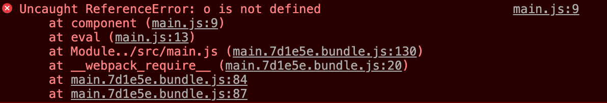

点右上角`main.js:9`:

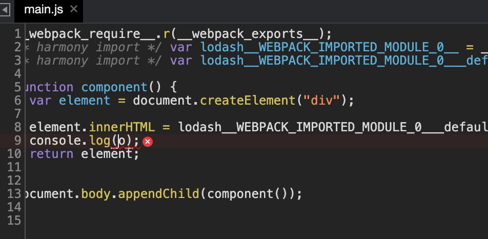

由上图可以看出，自动跳转到打包后的错误信息处，而不能直接跳转到源代码错误处。

## 6.1基础配置

```js
module.exports={
  entry: {
    main: "./src/main.js",
  },
  //1. 配置sourcemap
  devtool:'source-map'
}
```

此时打包后生成一个`main.js`文件，并且还会有一个`main.js.map`文件,这个文件是源代码与打包的main.js之间的映射关系。

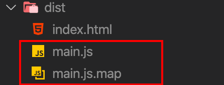

此时点开控制台错误信息就会显示源代码的第几行出错了，而不是打包后的文件第几行出错。

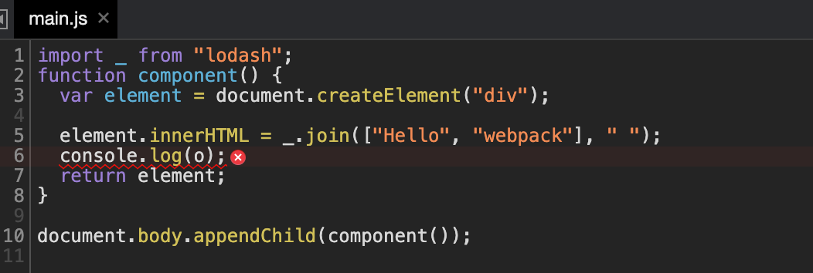

## 6.2inline-source-map

```js
module.exports={
  //打包模式
  mode:'development',
  //配置sourcemap
  devtool:'inline-source-map'
}
```

此时打包后的文件只有一个`main.js`,而之前的`main.js.map`映射文件没有了。这个文件此时被打包到了`main.js`的最后一行。

## 6.3cheap-inline-source-map

当代码量很大时，如果我们的代码出了错误，而我们devtool前面又没有加cheap，那么这个sourcemap会告诉我们代码第几行第几个字符出错了，会精确到第几行的第几列出了问题。这样的提示比较耗费性能。

我们代码出错了，我们只希望sourcemap告诉我们第几行出错了就可以了。

**添加cheap意思就是只需告诉我们行，不需要告诉我们第几列。**

```js
module.exports={
  //打包模式
  mode:'development',
  //配置sourcemap
  devtool:'cheap-inline-source-map'
}
```

## 6.4cheap-module-source-map

这个module意思是不仅管我们业务代码的出错，还会管其他loader或者第三方插件的错误

## 6.5eval

打包速度最快的方式。并且一样有提示。但是针对复杂代码不建议使用这种，因为提示不全面。

## 6.6最佳实践

开发环境：

```js
module.exports={
  //打包模式
  mode:'development',
  //配置sourcemap
  //这种在开发模式下提示的错误比较全面，同时打包速度也是比较快的
  devtool:'cheap-module-eval-source-map'
}
```

生产环境:

```js
module.exports={
  //打包模式
  mode:'production',
  //配置sourcemap
  //出错时，代码提示会更好些
  devtool:'cheap-module-source-map'
}
```

# 七.WebpackDevServer

修改源代码并保存后自动执行打包命令进行打包输出文件。

## 7.1使用观察模式

可以指示 webpack "watch" 依赖图中的所有文件以进行更改。如果其中一个文件被更新，代码将被重新编译，所以你不必手动运行整个构建。

在`package.json`中的scripts下进行配置。

```js
//package.json
{
  "script":{
    "watch":"webpack --watch"
  }
}
```

加了`--watch`参数时，就会监听打包的源代码，只要源代码发生变化，就会自动执行打包。

现在，你可以在命令行中运行 `npm run watch`，就会看到 webpack 编译代码，然而却不会退出命令行。这是因为 script 脚本还在观察文件。

**缺点：**为了看到修改后的实际效果，你需要刷新浏览器

## 7.2使用webpackdevserver

`webpack-dev-server` 为你提供了一个简单的 web 服务器，并且能够实时重新加载(live reloading)。

- 安装

```bash
npm install webpack-dev-server -D
```

### 7.2.1基本配置

在对象中添加devServer属性，并配置服务器可访问的文件夹路径即可。

```js
//webpack.config.js
const path = require("path");
const HtmlWebpackPlugin = require("html-webpack-plugin");
const { CleanWebpackPlugin } = require("clean-webpack-plugin");
const indexhtmlWebpackPlugin = new HtmlWebpackPlugin({
  title: "我是首页",
  template: "./public/index.html",
});
module.exports={
  mode: "development",
  devtool: "cheap-module-eval-source-map",
  //1.配置开发服务器(dev server)，在哪里查找文件
  devServer: {
    //可以使用相对路径，也可以使用绝对路径path.join(__dirname, "dist")
    contentBase: "./dist",
  },
  entry: {
    main: "./src/main.js",
  },
  plugins: [indexhtmlWebpackPlugin, new CleanWebpackPlugin()],
  output: {
      filename: '[name].bundle.js',
      path: path.resolve(__dirname, 'dist')
    }
}
```

以上配置告知 `webpack-dev-server`，在 `localhost:8080` 下建立服务，将 `dist` 目录下的文件，作为可访问文件。

添加一个 script 脚本，可以直接运行开发服务器(dev server)：

```js
//package.json
{
  "script":{
    "watch":"webpack --watch",
    "start":"webpack-dev-server --open"
  }
}

```

现在，我们可以在命令行中运行 `npm run start`，就会看到浏览器自动加载页面。如果现在修改和保存任意源文件，web 服务器就会自动重新加载编译后的代码。

### 7.2.2跨域配置

如果你有单独的后端开发服务器 API，并且希望在同域名下发送 API 请求 ，那么代理某些 URL 会很有用。

在 `localhost:3000` 上有后端服务的话，你可以这样启用代理：

```js
devServer: {
    //可以使用相对路径，也可以使用绝对路径path.join(__dirname, "dist")
    contentBase: "./dist",
    proxy: {
      "/api": "http://localhost:3000"
 }
},
```

请求到 `/api/users` 现在会被代理到请求 `http://localhost:3000/api/users`。

如果你不想始终传递 `/api` ，则需要重写路径：

```js
proxy: {
  "/api": {
    target: "http://localhost:3000",
    pathRewrite: {"^/api" : ""}
  }
}
```

默认情况下，不接受运行在 HTTPS 上，且使用了无效证书的后端服务器。如果你想要接受，修改配置如下：

```js
proxy: {
  "/api": {
    target: "https://other-server.example.com",
    secure: false
  }
}
```

有时你不想代理所有的请求。可以基于一个函数的返回值绕过代理。

在函数中你可以访问请求体、响应体和代理选项。必须返回 `false` 或路径，来跳过代理请求。

例如：对于浏览器请求，你想要提供一个 HTML 页面，但是对于 API 请求则保持代理。你可以这样做：

```js
proxy: {
  "/api": {
    target: "http://localhost:3000",
    bypass: function(req, res, proxyOptions) {
      if (req.headers.accept.indexOf("html") !== -1) {
        console.log("Skipping proxy for browser request.");
        return "/index.html";
      }
    }
  }
}
```

### 7.2.3其他参数配置

- open

值为`boolean`类型。当为`true`时，打包完成后会自动打开浏览器。

```js
open: true
```

- port

配置端口号:

```js
port: 8080
```

- host

指定使用一个 host。默认是 `localhost`。如果你希望服务器外部可访问，指定如下：

```js
host: "0.0.0.0"
```

## 7.3使用 webpack-dev-middleware

`webpack-dev-middleware` 是一个容器(wrapper)，它可以把 webpack 处理后的文件传递给一个服务器(server)。 `webpack-dev-server` 在内部使用了它，同时，它也可以作为一个单独的包来使用，以便进行更多自定义设置来实现更多的需求。

- 安装

安装 `express` 和 `webpack-dev-middleware`：

```bash
npm install --save-dev express webpack-dev-middleware
```

- 配置

1.配置**webpack.config.js**

只需在`output`中添加`publicpath:'/`配置

```js
//webpack.config.js
output: {
      filename: '[name].bundle.js',
      path: path.resolve(__dirname, 'dist'),
      publicPath: '/'
    }
```

`publicPath` 也会在服务器脚本用到，以确保文件资源能够在 `http://localhost:3000` 下正确访问

2.根目录下新建`server.js`

用于编写服务器代码

```js
//server.js
const express = require('express');
const webpack = require('webpack');
const webpackDevMiddleware = require('webpack-dev-middleware');

const app = express();
//引入当前目录下的配置文件
const config = require('./webpack.config.js');
//编译器
const compiler = webpack(config);

app.use(webpackDevMiddleware(compiler, {
  publicPath: config.output.publicPath
}));

// Serve the files on port 3000.
app.listen(3000, function () {
  console.log('监听3000端口');
});
```

3.添加脚本

```bash
# package.json
 "scripts": {
      "test": "echo \"Error: no test specified\" && exit 1",
      "watch": "webpack --watch",
      "start": "webpack-dev-server --open",
      //服务启动脚本
      "server": "node server.js",
      "build": "webpack"
    },
```

终端执行 `npm run server`

打开浏览器，跳转到 `http://localhost:3000`，你应该看到你的webpack 应用程序已经运行！

# 八.模块热替换

模块热替换(Hot Module Replacement 或 HMR)是 webpack 提供的最有用的功能之一。它允许在运行时更新各种模块，而无需进行完全刷新。

> 注：HMR 不适用于生产环境，这意味着它应当只在开发环境使用。

- 启用 HMR

启用此功能实际上相当简单。而我们要做的，就是更新 `webpack-dev-server` 的配置，和使用 webpack 内置的 HMR 插件。

```js
const path = require('path');
const HtmlWebpackPlugin = require('html-webpack-plugin');
const {CleanWebpackPlugin} = require('clean-webpack-plugin');
const webpack = require('webpack');

module.exports = {
    entry: {
     index: './src/index.js'
    },
    devtool: 'inline-source-map',
    devServer: {
      contentBase: './dist',
      //1.启用 webpack 的模块热替换特性：
      hot: true,
      hotOnly: true
    },
    plugins: [
      new CleanWebpackPlugin(),
      new HtmlWebpackPlugin({}),
      //2.使用webpack内置插件HMR
      new webpack.NamedModulesPlugin(),
      new webpack.HotModuleReplacementPlugin()
    ],
    output: {
      filename: '[name].bundle.js',
      path: path.resolve(__dirname, 'dist')
    }
  };
```

**注意**：我们还添加了 `NamedModulesPlugin`，以便更容易查看要修补(patch)的依赖。

项目结构：

```js
webpack-vue-template
├─ .gitignore
├─ package-lock.json
├─ package.json
├─ src
│  └─ index.js
│	 └─ number.js
│	 └─ counter.js
│  └─ global.css
└─ webpack.config.js
```

```js
//number.js
export default function number() {
    let div = document.createElement('div');
    div.setAttribute('id','number');
  	div.innerHTML=2000;
  	document.body.appendChild(div);
  }
```

```js
//counter.js
export default function counter() {
  let div = document.createElement("div");
  div.setAttribute("id", "counter");
  div.innerHTML = 10;
  div.onclick = function () {
    div.innerHTML = parseInt(div.innerHTML, 10) + 10;
  };
  document.body.appendChild(div);
}
```

现在，我们来修改 `index.js` 文件，以便当 `number.js`或者`counter.js` 内部发生变更时可以告诉 webpack 接受更新的模块。

```js
//index.js
import number from './number.js';
import counter from './counter.js';

//执行模块代码
number()
counter()
//如果开启了module.hot才会执行后面的逻辑
if (module.hot) {
  //表示：number.js这个文件发生了变化，那么就会执行后面的回调函数
    module.hot.accept('./number.js', function() {
      //如果number发生了变化，那么先清除页面上已经渲染的元素，再执行函数重新渲染
      document.body.removeChild(document.getElementById("number"));
      //重新执行main
      number();
    })
  }
```

在页面上counter的值加到30：

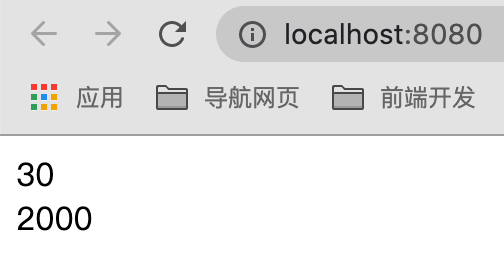

然后修改 `number.js` 中的值

```js
export default function number() {
    let div = document.createElement('div');
    div.setAttribute('id','number');
  //将值2000修改为3000
  	div.innerHTML=3000;
  	document.body.appendChild(div);
  }
```

此时页面显示：

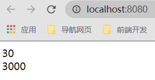

可以看出，只有变化的文件才重新加载了，而没修改的文件不会重新加载。

# 九.使用Babel处理ES6语法

用于兼容其他低版本浏览器不支持相关语法与新特性。

## 9.1webpack中使用babel

- 安装：

```shell
npm install --save-dev babel-loader @babel/core
```

- 使用：

```js
//webpack.config.js
module.exports={
  module:{
    rules:[
       { 
         test: /\.js$/, 
         exclude: /node_modules/, //第三方模块不使用loader转换
         loader: "babel-loader" 
       }
    ]
  }
}
```

说明：当我们使用`babel-loader`处理js文件的时候，实际上`babel-loader`只是webpack和Babel做通信的桥梁，使用之后，他们就会做打通。实际上`babel-loader`不会将js文件里的es6语法转换为es5语法。

## 9.2安装转换es6的模块:

```shell
npm install @babel/preset-env --save-dev
```

配置：

增加options字段。

```js
//webpack.config.js
module.exports={
  module:{
    rules:[
       { 
         test: /\.js$/, 
         exclude: /node_modules/, //第三方模块不使用loader转换
         loader: "babel-loader" ,
         options:{
           presets: ["@babel/preset-env"]
         }
       }
    ]
  }
}
```

此时就会将es6的模块转换为es5的语法了。这个插件只是翻译了一部分，很多语法在低版本浏览器还是没法支持的。需要使用`polyfill`做语法或变量的补充。

## 9.3使用polyfill

全部js兼容性处理。

- 安装`polyfill`:

```shell
npm install --save @babel/polyfill
```

- 使用：

所有代码前引入这个插件即可。也就是放在入口文件`main.js`中。

```js
//main.js
import "@babel/polyfill";
//或者
require("@babel/polyfill");
//如果配置了useBuiltIns，则不需要引入上面的
```

> **注意：**这个插件会将所有语法都打包，导致打包后的文件过大。但是我们只使用promise，map方法。因此只需要将这两个高级语法实现下就可以了

- 配置：实现按需加载

```js
//webpack.config.js
module.exports={
  module:{
    rules:[
       { 
         test: /\.js$/, 
         exclude: /node_modules/, //第三方模块不使用loader转换
         loader: "babel-loader" ,
         options:{
           presets: [["@babel/preset-env",{
             // 按需加载
             useBuiltIns:'usage',
             // 指定core-js版本实现按需加载
                corejs: {
                  version: 3
                },
           }]]
         }
       }
    ]
  }
}
```

说明：只实现业务代码中使用了的高级语法。其他没使用的高级语法就不会打包进去。

## 9.4指定兼容浏览器版本进行语法代码打包

```js
//webpack.config.js
module.exports={
  module:{
    rules:[
       { 
         test: /\.js$/, 
         exclude: /node_modules/, //第三方模块不使用loader转换
         loader: "babel-loader" ,
         options:{
           presets: [["@babel/preset-env",{
             "targets": {
         			 	 "edge": "17",
         				 "firefox": "60",
         				 "chrome": "67",
         				 "safari": "11.1",
        			},
             useBuiltIns:'usage',
             // 指定core-js版本
                corejs: {
                  version: 3
                },
           }]]
         }
       }
    ]
  }
}
```

说明：如果`targets`指定的浏览器中已经对es6已经支持的很好了，就没必要再将代码进行翻译转换了。这些都是自动操作。

## 9.5使用transform-runtime

如果写的是业务代码时，只需要`babel/polyfill`的配置就可以了。但是如果写的是库项目代码的时候，需要使用`babel/plugin-transform-runtime`。`polyfill`会污染全局环境。但是`babel/plugin-transform-runtime`会以闭包的形式注入，不存在污染全局环境。

- 安装:

```shell
npm install --save-dev @babel/plugin-transform-runtime
npm install --save @babel/runtime
```

- 配置：

```js
//webpack.config.js
module.exports={
  module:{
    rules:[
       { 
         test: /\.js$/, 
         exclude: /node_modules/, //第三方模块不使用loader转换
         loader: "babel-loader" ,
         options:{
          	"plugins": [["@babel/plugin-transform-runtime",{
              	"corejs": 2,//这里如果改为2时，需要安装插件npm install --save @babel/runtime-corejs2
        				"helpers": true,
        				"regenerator": true,
        				"useESModules": false,
            }]]
         }
       }
    ]
  }
}
```

- 安装包`runtime-corejs2`

```shell
npm install --save @babel/runtime-corejs2
```

此时打包就不会出现问题。

## 9.6抽离配置

新建`.babelrc`文件，将`webpack.config.js`中`babel-loader`的options配置项抽离处理单独配置。写了这个文件就会生效，无需引入。

```js
//.babelrc打包库代码配置
{
   "plugins": [["@babel/plugin-transform-runtime",{
       "corejs": 2,//这里如果改为2时，需要安装插件npm install --save @babel/runtime-corejs2
        "helpers": true,
        "regenerator": true,
        	"useESModules": false,
            }]]
}
```

```js
//.babelrc打包业务代码配置
{
  presets: [["@babel/preset-env",{
             "targets": {
         			 	 "edge": "17",
         				 "firefox": "60",
         				 "chrome": "67",
         				 "safari": "11.1",
        			},
             useBuiltIns:'usage'
           }]]
}
```

注意：`.babelrc`中的配置是从下往上，从左到右的执行顺序。

删除`webpack.config.js`中`babel-loader`下的options配置

```js
//webpack.config.js
module.exports={
  module:{
    rules:[
       { 
         test: /\.js$/, 
         exclude: /node_modules/, //第三方模块不使用loader转换
         loader: "babel-loader" ,
       }
    ]
  }
}
```

# 十.配置React代码的打包

- 安装

```bash
npm install --save-dev @babel/preset-react
```

- 配置

```js
//.babelrc打包业务代码配置
//执行顺序是从下往上，从右往左
//先转换react代码，再转换成es5代码
{
  presets: [
    ["@babel/preset-env",{
             "targets": {
         			 	 "edge": "17",
         				 "firefox": "60",
         				 "chrome": "67",
         				 "safari": "11.1",
        			},
             useBuiltIns:'usage'
           }
    ],
    //配置react
    "@babel/preset-react"
  ]
}
```

# 十一.所有代码配置

配置1:

```js
//webpack.config.js
const path = require("path");
const HtmlWebpackPlugin = require("html-webpack-plugin");
const { CleanWebpackPlugin } = require("clean-webpack-plugin");
const webpack = require("webpack");
module.exports = {
  mode: "development",
  devtool: "cheap-module-eval-source-map",
  entry: {
    main: "./src/main.js",
  },
  devServer: {
    contentBase: "./dist",
    open: true,
    port: 8080,
    hot: true,
    hotOnly: true,
  },

  module: {
    rules: [
      {
        test: /\.js$/,
        exclude: /node_modules/,
        loader: "babel-loader",
      },
      // 打包图片文件
      {
        test: /\.(jpg|png|gig)$/,
        use: [
          {
            loader: "url-loader",
            options: {
              name: "[name]_[hash:6].[ext]",
              outputPath: "images/",
              limit: 10240,
            },
          },
        ],
      },
      // 打包css文件
      { test: /\.css$/, use: ["style-loader", "css-loader", "postcss-loader"] },
      //   打包scss文件
      {
        test: /\.scss$/,
        use: [
          "style-loader",
          {
            loader: "css-loader",
            options: {
              importLoaders: 2,
            },
          },
          "sass-loader",
          "postcss-loader",
        ],
      },
      // 打包less文件
      {
        test: /\.less$/,
        use: ["style-loader", "css-loader", "less-loader", "postcss-loader"],
      },
      // 打包字体文件
      { test: /\.(eot|ttf|svg)$/, use: "file-loader" },
    ],
  },
  plugins: [
    new HtmlWebpackPlugin({
      template: "./public/index.html",
    }),
    new CleanWebpackPlugin(),
    new webpack.HotModuleReplacementPlugin(),
  ],
  output: {
    filename: "[name]_[hash:6].js",
    path: path.resolve(__dirname, "./dist"),
  },
};
```

配置2:

```js
const { resolve } = require('path');
const MiniCssExtractPlugin = require('mini-css-extract-plugin');
const OptimizeCssAssetsWebpackPlugin = require('optimize-css-assets-webpack-plugin');
const HtmlWebpackPlugin = require('html-webpack-plugin');

// 定义nodejs环境变量：决定使用browserslist的哪个环境
process.env.NODE_ENV = 'production';

// 复用loader
const commonCssLoader = [
  MiniCssExtractPlugin.loader,
  'css-loader',
  {
    // 还需要在package.json中定义browserslist
    loader: 'postcss-loader',
    options: {
      ident: 'postcss',
      plugins: () => [require('postcss-preset-env')()]
    }
  }
];

module.exports = {
  entry: './src/js/index.js',
  output: {
    filename: 'js/built.js',
    path: resolve(__dirname, 'build')
  },
  module: {
    rules: [
      {
        test: /\.css$/,
        use: [...commonCssLoader]
      },
      {
        test: /\.less$/,
        use: [...commonCssLoader, 'less-loader']
      },
      /*
        正常来讲，一个文件只能被一个loader处理。
        当一个文件要被多个loader处理，那么一定要指定loader执行的先后顺序：
          先执行eslint 在执行babel
      */
      {
        // 在package.json中eslintConfig --> airbnb
        test: /\.js$/,
        exclude: /node_modules/,
        // 优先执行
        enforce: 'pre',
        loader: 'eslint-loader',
        options: {
          fix: true
        }
      },
      {
        test: /\.js$/,
        exclude: /node_modules/,
        loader: 'babel-loader',
        options: {
          presets: [
            [
              '@babel/preset-env',
              {
                useBuiltIns: 'usage',
                corejs: {version: 3},
                targets: {
                  chrome: '60',
                  firefox: '50'
                }
              }
            ]
          ]
        }
      },
      {
        test: /\.(jpg|png|gif)/,
        loader: 'url-loader',
        options: {
          limit: 8 * 1024,
          name: '[hash:10].[ext]',
          outputPath: 'imgs',
          esModule: false
        }
      },
      {
        test: /\.html$/,
        loader: 'html-loader'
      },
      {
        exclude: /\.(js|css|less|html|jpg|png|gif)/,
        loader: 'file-loader',
        options: {
          outputPath: 'media'
        }
      }
    ]
  },
  plugins: [
    new MiniCssExtractPlugin({
      filename: 'css/built.css'
    }),
    new OptimizeCssAssetsWebpackPlugin(),
    new HtmlWebpackPlugin({
      template: './src/index.html',
      minify: {
        collapseWhitespace: true,
        removeComments: true
      }
    })
  ],
  mode: 'production'
};
```


# 十二.webpack优化配置

开发环境性能优化：

- 优化打包速度：HMR
- 优化代码调试：sourceMap

生产环境性能优化：

- 优化打包速度
- 优化代码运行的性能

## 3.1HMR

HMR: hot module replacement 热模块替换 / 模块热替换

作用：一个模块发生变化，只会重新打包这一个模块（而不是打包所有模块）。极大提升构建速度。

对于样式文件：在开发环境中需要使用`style-loader`，因为内部实现了HMR功能。

```js
{
        // 处理less资源
        test: /\.less$/,
        use: ['style-loader', 'css-loader', 'less-loader']
      },
      {
        // 处理css资源
        test: /\.css$/,
        use: ['style-loader', 'css-loader']
      },
```

对于js文件默认不能使用HMR功能，需要修改js代码，添加支持HMR功能的代码。

> 注意：HMR功能对js的处理，只能处理非入口js文件的其他文件。因为入口文件变化，又会重新加载其他文件

html文件: 默认不能使用HMR功能.同时会导致问题：html文件不能热更新了~ （不用做HMR功能）

解决：修改entry入口，将html文件引入

```js
entry: ['./src/js/index.js', './src/index.html'],
```

## 3.2sourceMap


## 3.3oneof


## 3.4缓存

babel缓存：cacheDirectory: true

```js
{
            test: /\.js$/,
            exclude: /node_modules/,
            loader: 'babel-loader',
            options: {
              presets: [
                [
                  '@babel/preset-env',
                  {
                    useBuiltIns: 'usage',
                    corejs: { version: 3 },
                    targets: {
                      chrome: '60',
                      firefox: '50'
                    }
                  }
                ]
              ],
              // 开启babel缓存
              // 第二次构建时，会读取之前的缓存
              cacheDirectory: true
            }
          }
```

文件资源缓存:

- `hash`: 每次wepack构建时会生成一个唯一的hash值。

问题: 因为js和css同时使用一个hash值。

如果重新打包，会导致所有缓存失效。（可能我却只改动一个文件）

- `chunkhash`：根据chunk生成的hash值。如果打包来源于同一个chunk，那么hash值就一样

问题: js和css的hash值还是一样的

因为css是在js中被引入的，所以同属于一个chunk

- `contenthash`: 根据文件的内容生成hash值。不同文件hash值一定不一样。

让代码上线运行缓存更好使用

## 3.5Tree Shaking

把一个模块中无用的代码都不打包到最后的文件下。比如`main.js`导出两个方法`add`和`minus`,但是在`index.js`中只引入add方法，此时`minus`方法没使用，但是打包时会默认打包所有。此时就需要借助`tree shaking`来打包。

通过 `package.json` 的 `"sideEffects"` 属性作为标记，向 compiler 提供提示，表明项目中的哪些文件是 "pure(纯的 ES2015 模块)"，由此可以安全地**删除文件中未使用**的部分。

> 注意：只支持ES Module的引入。`import`的引入形式（静态引入）。`require`的形式不支持（动态引入）

### 3.1.1未开启tree shaking

在开发环境下(`mode: "development"`)时，默认没有开启`tree shaking`。

例如：

在`src`目录下新建`index.js`,此文件导出两个函数：

目录结构：

```js
webpack-vue-template
├─ .babelrc
├─ build
│  ├─ webpack.common.js
│  ├─ webpack.dev.js
│  └─ webpack.prod.js
├─ package-lock.json
├─ package.json
├─ postcss.config.js
├─ public
│  └─ index.html
└─ src
   ├─ index.js
   └─ main.js
```

```js
//	src/index.js
export function sub() {
  console.log("我没被导出");
}

export function add() {
  console.log("我被导出");
}
```

接着，更新入口脚本，使用其中一个新方法:

```js
//	src/main.js
import { add } from "./index";
add();
```

注意，我们**并未从 `src/index.js` 模块中 `import` 导入 `sub` 方法**。这个功能是所谓的“未引用代码(dead code)”，也就是说，应该删除掉未被引用的 `export`。现在让我们运行我们的npm 脚本 `npm run build`，并检查输出的 bundle：

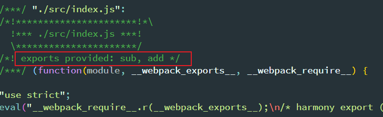

> 注意：上面的 `exports provided` 注释。如果你看下面的代码，你会注意到 `sub` 没有被导入，但是，它仍然被包含在 bundle 中。

### 3.1.2开发环境开启tree shaking

向 webpack 的 compiler 提供提示哪些代码是“纯粹部分”。

这种方式是通过 package.json 的 `"sideEffects"` 属性来实现的。

```json
{
  "name": "your-project",
  "sideEffects": false
}
```

如同上面提到的，如果所有代码都不包含副作用，我们就可以简单地将该属性标记为 `false`，来告知 webpack，它可以安全地删除未用到的 export 导出。

> 「副作用」的定义是，在导入时会执行特殊行为的代码，而不是仅仅暴露一个 export 或多个 export。举例说明，例如 polyfill，它影响全局作用域，并且通常不提供 export。

如果你的代码确实有一些副作用，那么可以改为提供一个数组：

```json
{
  "name": "your-project",
  "sideEffects": [//注：如果某个模块不需要tree shaking ，则将不需要的模块加入sideEffects数组中
    "./src/index.js"
  ]
}
```

数组方式支持相关文件的相对路径、绝对路径和 glob 模式。

> 注意：任何导入的文件都会受到 tree shaking 的影响。这意味着，如果在项目中使用类似 `css-loader` 并导入 CSS 文件，则需要将其添加到 side effect 列表中，以免在生产模式中无意中将它删除：

```json
{
  "name": "your-project",
  "sideEffects": [
    "./src/index.js",
    "*.css"//表示遇到任何css文件，也不要使用tree shaking
  ]
}

```

tree shaking会去查看每个文件是否有导出，如果没有导出就不打包，有导出才去打包。但是我们写的css文件没有导出，

因此需要将所有css文件添加到`sideEffects`数组中进行排除。

> 注：在开发环境下，还必须在`webpack`中配置`optimization`：

```js
//webpack.dev.js
module.exports={
  mode:'development',
  optimization:{//注意是在开发环境
 	 		usedExports:true
  	}
}
```

现在让我们运行我们的npm 脚本 `npm run build`，并检查输出的 bundle：

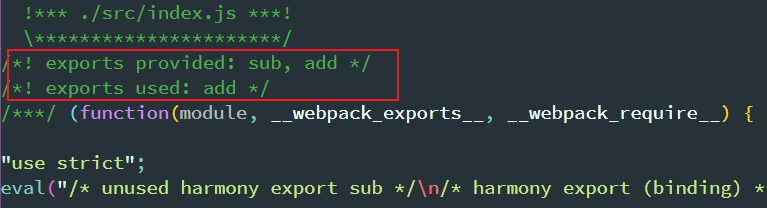

注意看上面的`exports used:`注释。只导出了使用的add方法，而sub方法没有被打包。

>  注意：此时打包后的文件会存在未使用的代码，只是在未使用的代码前面注释未使用。这样主要方便在开发环境下进行调试。

### 3.1.2生产环境开启tree shaking

在生产环境下同样需要在`package.json`中添加`sideEffects`属性：

```json
//package.json
{
  "sideEffects":[
    "*.css"//表示遇到任何css文件，也不要使用tree shaking
  ]
}
```

修改生产环境的`webpack`配置：

```js
//webpack.prod.js
module.exports={
  mode:'production',
    //生产环境就不需要以下配置
  	//optimization:{//注意是在开发环境
 	 		//usedExports:true
  	//}
}
```

> 注：生产环境下(`mode:'production'`)，就不在需要配置`optimization`属性。因为默认开启了。

此时打包后的文件中就不会存在未使用的代码。

## 3.2打包模式区分

开发环境(`development`)和生产环境(`production`)的构建目标差异很大。在开发环境中，我们需要具有强大的、具有实

时重新加载(live reloading)或热模块替换(hot module replacement)能力的 `source map` 和 `localhost server`。而在

生产环境中，我们的目标则转向于关注更小的 bundle，更轻量的 source map，以及更优化的资源，以改善加载时间。由于

要遵循逻辑分离，我们通常建议为每个环境编写**彼此独立的 webpack 配置**。

开发环境和生产环境打包的配置是不同的，因此我们将开发环境与生产环境的配置区分开。而不用每次手动去改。

我们还是会遵循不重复原则(Don't repeat yourself - DRY)，保留一个“通用”配置。为了将这些配置合并在一起，我们将使用一个名为 `webpack-merge`的工具。通过“通用”配置，我们不必在环境特定(environment-specific)的配置中重复代码。

安装 `webpack-merge` ：

```shell
npm install --save-dev webpack-merge
```

### 3.2.1开发环境配置

在项目根目录下新建`webpack.dev.js`:

```js
const path = require("path");
const HtmlWebpackPlugin = require("html-webpack-plugin");
const { CleanWebpackPlugin } = require("clean-webpack-plugin");
const webpack = require("webpack");
module.exports = {
  mode: "development",
  devtool: "cheap-module-eval-source-map",
  entry: {
    main: "./src/main.js",
  },
  devServer: {
    contentBase: "./dist",
    open: true,
    port: 8080,
    hot: true,
  },

  module: {
    rules: [
      {
        test: /\.js$/,
        exclude: /node_modules/,
        loader: "babel-loader",
      },
      // 打包图片文件
      {
        test: /\.(jpg|png|gig)$/,
        use: [
          {
            loader: "url-loader",
            options: {
              name: "[name]_[hash:6].[ext]",
              outputPath: "images/",
              limit: 10240,
            },
          },
        ],
      },
      // 打包css文件
      { test: /\.css$/, use: ["style-loader", "css-loader", "postcss-loader"] },
      //   打包scss文件
      {
        test: /\.scss$/,
        use: [
          "style-loader",
          {
            loader: "css-loader",
            options: {
              importLoaders: 2,
            },
          },
          "sass-loader",
          "postcss-loader",
        ],
      },
      // 打包less文件
      {
        test: /\.less$/,
        use: ["style-loader", "css-loader", "less-loader", "postcss-loader"],
      },
      // 打包字体文件
      { test: /\.(eot|ttf|svg)$/, use: "file-loader" },
    ],
  },
  plugins: [
    new HtmlWebpackPlugin({
      template: "./public/index.html",
    }),
    new CleanWebpackPlugin(),
    new webpack.HotModuleReplacementPlugin(),
  ],
  output: {
    filename: "[name]_[hash:6].js",
    path: path.resolve(__dirname, "./dist"),
  },
};

```

修改`package.json`脚本命令：

```json
{
  "scripts": {
    //新增开发环境启动脚本，使用--config指定使用的webpack配置文件
    "dev": "webpack-dev-server --config webpack.dev.js"
  },
}
```

此时使用`npm run dev`即可进行项目开发。

### 3.2.2生产环境配置

在项目根目录下新建`webpack.prod.js`:

```js
const path = require("path");
const HtmlWebpackPlugin = require("html-webpack-plugin");
const { CleanWebpackPlugin } = require("clean-webpack-plugin");
const webpack = require("webpack");
module.exports = {
  mode: "development",
  devtool: "cheap-module-source-map",
  entry: {
    main: "./src/main.js",
  },
  module: {
    rules: [
      {
        test: /\.js$/,
        exclude: /node_modules/,
        loader: "babel-loader",
      },
      // 打包图片文件
      {
        test: /\.(jpg|png|gig)$/,
        use: [
          {
            loader: "url-loader",
            options: {
              name: "[name]_[hash:6].[ext]",
              outputPath: "images/",
              limit: 10240,
            },
          },
        ],
      },
      // 打包css文件
      { test: /\.css$/, use: ["style-loader", "css-loader", "postcss-loader"] },
      //   打包scss文件
      {
        test: /\.scss$/,
        use: [
          "style-loader",
          {
            loader: "css-loader",
            options: {
              importLoaders: 2,
            },
          },
          "sass-loader",
          "postcss-loader",
        ],
      },
      // 打包less文件
      {
        test: /\.less$/,
        use: ["style-loader", "css-loader", "less-loader", "postcss-loader"],
      },
      // 打包字体文件
      { test: /\.(eot|ttf|svg)$/, use: "file-loader" },
    ],
  },
  plugins: [
    new HtmlWebpackPlugin({
      template: "./public/index.html",
    }),
    new CleanWebpackPlugin(),
  ],
  output: {
    filename: "[name]_[hash:6].js",
    path: path.resolve(__dirname, "./dist"),
  },
};
```

修改`package.json`脚本命令：

```json
{
  "scripts": {
    //新增生产环境启动脚本，使用--config指定使用的webpack配置文件
    "build": "webpack --config webpack.prod.js",
  },
}
```

此时使用`npm run build`即可进行项目打包。

### 3.2.3抽离公共代码

上面配置的`webpack.dev.js`和`webpack.prod.js`配置文件中存在大量重复的代码。因此需要将公共代码进行抽离

- 抽离公共代码

在项目根目录下新建`webpack.common.js`，用于存放公共代码。

```js
const path = require("path");
const HtmlWebpackPlugin = require("html-webpack-plugin");
const { CleanWebpackPlugin } = require("clean-webpack-plugin");
module.exports = {
  entry: {
    main: "./src/main.js",
  },
  module: {
    rules: [
      {
        test: /\.js$/,
        exclude: /node_modules/,
        loader: "babel-loader",
      },
      // 打包图片文件
      {
        test: /\.(jpg|png|gig)$/,
        use: [
          {
            loader: "url-loader",
            options: {
              name: "[name]_[hash:6].[ext]",
              outputPath: "images/",
              limit: 10240,
            },
          },
        ],
      },
      // 打包css文件
      { test: /\.css$/, use: ["style-loader", "css-loader", "postcss-loader"] },
      //   打包scss文件
      {
        test: /\.scss$/,
        use: [
          "style-loader",
          {
            loader: "css-loader",
            options: {
              importLoaders: 2,
            },
          },
          "sass-loader",
          "postcss-loader",
        ],
      },
      // 打包less文件
      {
        test: /\.less$/,
        use: ["style-loader", "css-loader", "less-loader", "postcss-loader"],
      },
      // 打包字体文件
      { test: /\.(eot|ttf|svg)$/, use: "file-loader" },
    ],
  },
  plugins: [
    new HtmlWebpackPlugin({
      template: "./public/index.html",
    }),
    new CleanWebpackPlugin(),
  ],
  output: {
    filename: "[name]_[hash:6].js",
    path: path.resolve(__dirname, "./dist"),
  },
};
```

### 3.2.4对开发环境进行改造

删除公共代码已经有的配置：

```js
//webpack.dev.js
const webpack = require("webpack");
module.exports = {
  mode: "development",
  devtool: "cheap-module-eval-source-map",
  devServer: {
    contentBase: "./dist",
    open: true,
    port: 8080,
    hot: true,
  },
  plugins: [new webpack.HotModuleReplacementPlugin()],
  optimization: {
    usedExports: true,
  },
};

```

此时需要将开发环境代码与公共代码进行合并，才能正确运行。

安装`webpack-merge`插件进行代码合并：

```bash
npm install webpack-merge -D
```

使用插件进行合并代码：

```js
//webpack.dev.js
//导入merge函数
const { merge } = require("webpack-merge");
//导入公共代码
const commonConfig = require("./webpack.common.js");
const webpack = require("webpack");
const devConfig = {
  mode: "development",
  devtool: "cheap-module-eval-source-map",
  devServer: {
    contentBase: "./dist",
    open: true,
    port: 8080,
    hot: true,
  },
  plugins: [new webpack.HotModuleReplacementPlugin()],
  optimization: {
    usedExports: true,
  },
};
//将合并后的代码进行导出
module.exports = merge(commonConfig, devConfig);
```

### 3.2.5对生产环境进行改造

删除公共代码已经有的配置：

```js
module.exports = {
  mode: "production",
  devtool: "cheap-module-source-map",
};
```

此时需要将生产环境代码与公共代码进行合并，才能正确运行。

使用`webpack-merge`插件进行合并代码：

```js
const { merge } = require("webpack-merge");
const commonConfig = require("./webpack.common.js");
const prodConfig = {
  mode: "production",
  devtool: "cheap-module-eval-source-map",
};

module.exports = merge(commonConfig, prodConfig);
```

此时开发环境和生产环境都已经配置完成了，但是项目根目录下有三个webpack配置文件，不方便进行管理维护。因此需要将webpack配置文件存放在统一文件夹（build）进行管理。

在项目根目录新建`build`文件夹，然后将webpack配置文件移入此文件夹。

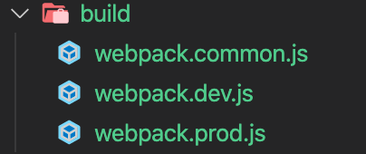

此时需要修改webpack公共代码:

```js
output: {
    filename: "[name]_[hash:6].js",
      //修改输出为上一级目录（根目录下）
    path: path.resolve(__dirname, "../dist"),
  },
```

> 注：`entry`入口路径和`HtmlWebpackPlugin.template`路径不需要修改，默认就是根路径下。

还需要修改打包的命令：

```json
{
  "scripts": {
    //修改webpack配置文件的路径
    "build": "webpack --config ./build/webpack.prod.js",
    "dev": "webpack-dev-server --config ./build/webpack.dev.js"
  },
}
```

## 3.3代码分离

此特性能够把代码分离到不同的 bundle 中，然后可以按需加载或并行加载这些文件。代码分离可以用于获取更小的 

bundle，以及控制资源加载优先级，如果使用合理，会极大影响加载时间。

有三种常用的代码分离方法：

- 入口起点：使用 `entry` 配置手动地分离代码。
- 防止重复：使用 `CommonsChunkPlugin`去重和分离 chunk。
- 动态导入：通过模块的内联函数调用来分离代码。

### 3.3.1入口起点

在`src`目录下新建`main.js`:

项目结构：

```js
webpack-vue-template
├─ .babelrc
├─ build
│  ├─ webpack.common.js
│  ├─ webpack.dev.js
│  └─ webpack.prod.js
├─ package-lock.json
├─ package.json
├─ postcss.config.js
├─ public
│  └─ index.html
└─ src
   └─ main.js
```

```js
//main.js
import _ from "lodash";
console.log(_.join(["a", "b", "c"], "---"));
```

打包项目输出信息：

```js
Hash: 45186d04c12fa395bde1
Version: webpack 4.44.1
Time: 593ms
Built at: 2020-08-17 9:44:09 ├F10: PM┤
         Asset       Size  Chunks                         Chunk Names
    index.html  298 bytes          [emitted]              
main_45186d.js   1.39 MiB    main  [emitted] [immutable]  main
Entrypoint main = main_45186d.js
```

由输出信息可知：打包的`main.js`大小为1.39mb。

也就是首次访问页面时，浏览器需要加载1.39mb的`main.js`文件。当页面业务逻辑发生变化时，又要加载1.39mb的内容。

因此可以采用将第三方库与业务逻辑分离的方式进行打包。

在`src`下再新建`lodash.js`文件：用于打包第三方库的入口。

```js
//lodash.js
import _ from "lodash";
//挂载到全局
window._ = _;
```

删除`main.js`中引入的`lodash`：

```js
//main.js
console.log(_.join(["a", "b", "c"], "---"));
```

增加webpack的入口：

```js
//webpack.common.js
entry: {
  	//这里必须将lodash第三方打包文件放第一个位置，因为html中引入打包后的js文件顺序默认是以entry入口顺序为准的。否则代码不能正常运行。
    lodash: "./src/lodash.js",
    main: "./src/main.js",
  }
```

打包输出信息：

```js
Hash: 2002c8d3868fdf14200a
Version: webpack 4.44.1
Time: 596ms
Built at: 2020-08-17 9:54:58 ├F10: PM┤
           Asset       Size  Chunks                         Chunk Names
      index.html  338 bytes          [emitted]              
lodash_2002c8.js   1.39 MiB  lodash  [emitted] [immutable]  lodash
  main_2002c8.js   31.5 KiB    main  [emitted] [immutable]  main
Entrypoint lodash = lodash_2002c8.js
Entrypoint main = main_2002c8.js
```

此时`main.js`被拆分成`lodash.js`和`main.js`,`lodash.js`为1.39mb，而`main.js`为31kb。

当页面业务逻辑发生变化时，只需要加载31kb的`main.js`即可。而`lodash.js`代码没发生变化，利用浏览器的缓存机制，就可以不需要重新再加载，从而减少了加载业务代码的时间。

存在问题：

- 如果入口 chunks 之间包含重复的模块，那些重复模块都会被引入到各个 bundle 中。
- 这种方法不够灵活，并且不能将核心应用程序逻辑进行动态拆分代码。

我们通过使用 `SplitChunksPlugin` 来移除重复的模块。

### 3.3.2防止重复

`SplitChunksPlugin`插件可以将公共的依赖模块提取到已有的入口 chunk 中，或者提取到一个新生成的 chunk。

同步加载的方式。

项目结构：

```js
webpack-vue-template
├─ .babelrc
├─ build
│  ├─ webpack.common.js
│  ├─ webpack.dev.js
│  └─ webpack.prod.js
├─ package-lock.json
├─ package.json
├─ postcss.config.js
├─ public
│  └─ index.html
└─ src
   └─ main.js
```

```js
//main.js
import _ from "lodash";
console.log(_.join(["a", "b", "c"], "---"));
```

修改webpack配置：

```js
//webpack.common.js
module.exports = {
  entry: {
    main: "./src/main.js",
  },
  //使用SplitChunksPlugin插件
  //1. 可以将node_modules中代码单独打包一个chunk最终输出
  //2. 自动分析多入口chunk中，有没有公共的文件。如果有会打包成单独一个chunk
  optimization: {
    splitChunks: {
      chunks: "all",
    },
  },
  output: {
    filename: "[name]_[hash:6].js",
    path: path.resolve(__dirname, "../dist"),
  },
};
```

对项目进行打包，输出以下信息：

```js
Hash: 5a522793c6f286ca585f
Version: webpack 4.44.1
Time: 609ms
Built at: 2020-08-17 10:05:57 ├F10: PM┤
                 Asset       Size        Chunks                         Chunk Names
            index.html  344 bytes                [emitted]              
        main_5a5227.js   34.6 KiB          main  [emitted] [immutable]  main
vendors~main_5a5227.js   1.36 MiB  vendors~main  [emitted] [immutable]  vendors~main
Entrypoint main = vendors~main_5a5227.js main_5a5227.js
```

一个入口，却输出了两个js文件。其中`main.js`是打包的我们业务代码，而`vendors.js`则是打包的`lodash`。这两个文件也会被引入到html文件中，并且`vendors.js`会被优先引入：

```html
<!DOCTYPE html>
<html lang="en">
  <head>
    <meta charset="UTF-8" />
    <meta name="viewport" content="width=device-width, initial-scale=1.0" />
    <title>Webpack App</title>
  </head>
  <body>
    <!-- 添加根标签 -->
    <div id="app"></div>
    <script src="vendors~main_5a5227.js"></script>
    <script src="main_5a5227.js"></script>
  </body>
</html>
```

### 3.3.3动态导入

在入口文件中动态引入其他js文件。

也叫异步加载，无需做任何配置，会自动进行代码分割，单独生成一个文件`0.js`。

> 注：也需要使用`SplitChunksPlugin`配置项。

```js
function getComponent() {
  //异步加载lodash
  return import( "lodash").then(({ default: _ }) => {
      const element = document.createElement("div");
      element.innerHTML = _.join(["Hello", "webpack"], " ");
      return element;
    })
}

getComponent().then((component) => {
    document.body.appendChild(component);
});
```

修改打包第三方包生成的名字：

```js
function getComponent() {
  //使用特殊语法修改打包生成的名字为：lodash
  return import(/* webpackChunkName: "lodash" */ "lodash").then(
    ({ default: _ }) => {
      const element = document.createElement("div");
      element.innerHTML = _.join(["Hello", "webpack"], " ");
      return element;
    }
  );
}

getComponent().then((component) => {
  document.body.appendChild(component);
});
```

此时打包生成的名字为`vendors~lodash.js`

示例：

```js
import(/* webpackChunkName: 'test' */'./test')
  .then(({ mul, count }) => {
    // 文件加载成功~
    console.log(mul(2, 5));
  })
  .catch(() => {
    console.log('文件加载失败~');
  });
```

### 3.3.4SplitChunksPlugin配置参数详解

以下是插件的默认配置。如果配置`optimization: {splitChunks: {}}`就是使用的如下默认配置。

```js
module.exports = {
  //...
  optimization: {
    splitChunks: {
      chunks: 'async',//async表示异步引入方式才进行代码分割。all则表示同步和异步都会进行代码分割。initial表示同步代码进行分割
      minSize: 30000,//表示小于30kb就不做代码分割，只有大于30kb才做代码分割。
      minRemainingSize: 0,
      maxSize: 0,//表示如果打包引入的包大于这个值，就会将引入的包二次拆分。不建议配置此项。
      minChunks: 1,//表示将一个模块用了多少次才进行代码分割。这里表示使用了1次就进行代码分割。
      maxAsyncRequests: 30,//表示同时加载的模块数。如果打包的模块超过了这个数就不会再进行代码分割。
      maxInitialRequests: 30,//表示入口文件最多只能进行代码分割的数量，超过就不会做代码分割。
      automaticNameDelimiter: '~',//做文件名连接的时候要用这个符号，比如vendors~lodash.js 
      enforceSizeThreshold: 50000,
      cacheGroups: {//叫缓存组。比如引入jquery和lodash，如果没有此项，就会分别打包出jquery.js和lodash.js。如果想打包成一个文件，就需要此配置项。遇到jquery先缓存，再此分析遇到lodash又缓存，当所有模块分析完毕后，符合defaultVendors组的打包到一起（vendors.js），符合default的打包到一起（common.js）。
        
        //代表打包同步代码的时候会执行这个，与chunks配合使用。决定代码分割出来放在哪个文件里面去。
        defaultVendors: {//组名称
          test: /[\\/]node_modules[\\/]/,//查看是否在node_modules
          priority: -10,//值越大，优先级越高。比如jquery即符合这个组，又符合下面个组（没验证规则），所有jquery会被打包到优先级高的组。
          filename:'vendors.js',//如果test验证通过就会打包到此js文件中，
        },
        default: {//组名称
          //如果不符合上面组验证规则，则执行这个打包操作
          minChunks: 2,
          priority: -20,
          reuseExistingChunk: true,//如果一个模块被打包了，当再次遇到其他模块引入此文件时，就不会进行重新打包（忽略此模块），而是复用之前打包的代码。
          filename:'common.js',//没在node_modules就打包到common.js
        }
      }
    }
  }
};
```

## 3.4懒加载

懒加载或者按需加载，是一种很好的优化网页或应用的方式。这种方式实际上是先把你的代码在一些逻辑断点处分离开，然后在一些代码块中完成某些操作后，立即引用或即将引用另外一些新的代码块。这样加快了应用的初始加载速度，减轻了它的总体体积，因为某些代码块可能永远不会被加载。

实际上是使用`import`动态加载语法：

```js
//main.js
function getComponent() {
  //使用这种import语法实现懒加载
  return import(/* webpackChunkName: "lodash" */ "lodash").then(
    ({ default: _ }) => {
      const element = document.createElement("div");
      element.innerHTML = _.join(["Hello", "webpack"], " ");
      return element;
    }
  );
}

document.addEventListener("click", () => {
  getComponent().then((component) => {
    document.body.appendChild(component);
  });
});
```

>  注：上面使用了promise，记得使用babel转换才能使用到低版本浏览器

将上面代码改造成异步执行方式：

```JS
//main.js
function getComponent() {
  //使用这种import语法实现懒加载
  const { default: _ }=await import(/* webpackChunkName: "lodash" */ "lodash")
      const element = document.createElement("div");
      element.innerHTML = _.join(["Hello", "webpack"], " ");
      return element;
}

document.addEventListener("click", () => {
  getComponent().then((component) => {
    document.body.appendChild(component);
  });
});
```

此时打包生成的文件：

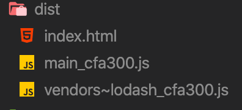

此时打开浏览器的network:

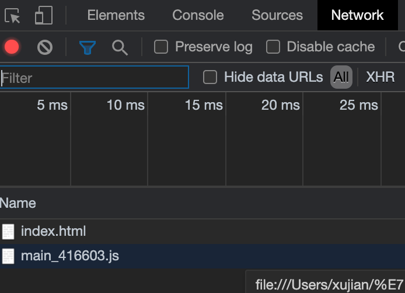

只加载了两个文件。当我们点击页面时：

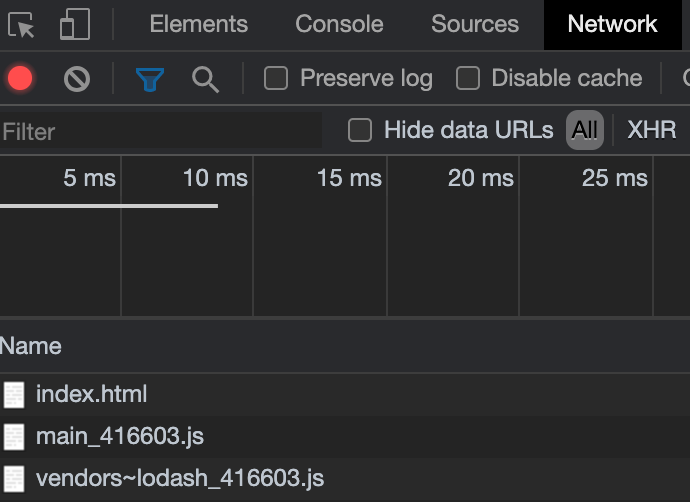

当我们执行某个模块时，才加载某个文件。从而减少了首屏渲染的时间。

示例：

```js
document.getElementById('btn').onclick = function() {
  // 懒加载~：当文件需要使用时才加载~,文件大会存在加载时间过长
  // 预加载 prefetch：会在使用之前，提前加载js文件，兼容性不是很好 
  // 正常加载可以认为是并行加载（同一时间加载多个文件）  
  // 预加载 prefetch：等其他资源加载完毕，浏览器空闲了，再偷偷加载资源
  import(/* webpackChunkName: 'test', webpackPrefetch: true */'./test').then(({ mul }) => {
    console.log(mul(4, 5));
  });
};

```

## 3.5css处理

### 3.5.1提取css成单独的文件

`mini-css-extract-plugin`插件将CSS提取到单独的文件中。它为每个包含CSS的JS文件创建一个CSS文件。它支持CSS和SourceMap的按需加载。

与`extract-text-webpack-plugin`相比：

- 异步加载
- 没有重复的编译（性能）
- 更容易使用
- 特定于CSS

安装：

作用：提取js文件中的css成单独的文件。并通过link标签引入到html页面中。

```bash
npm install --save-dev mini-css-extract-plugin
```

建议`mini-css-extract-plugin`与`css-loader`使用。

在`src`下新建`style.css`：

```css
body{
  background:red;
}
```

项目结构：

```js
webpack-vue-template
├─ .babelrc
├─ build
│  ├─ webpack.common.js
│  ├─ webpack.dev.js
│  └─ webpack.prod.js
├─ package-lock.json
├─ package.json
├─ postcss.config.js
├─ public
│  └─ index.html
└─ src
   ├─ main.js
   └─ style.css
```

在`main.js`中引入css文件：

```js
import './style.css'
```

在webpack中配置插件：

抽离公共代码`module.rules`数组中less、scss、css相关loader配置。

```js
//webpack.common.js
const path = require("path");
const HtmlWebpackPlugin = require("html-webpack-plugin");
const { CleanWebpackPlugin } = require("clean-webpack-plugin");
module.exports = {
  entry: {
    main: "./src/main.js",
  },
  module: {
    rules: [
      {
        test: /\.js$/,
        exclude: /node_modules/,
        loader: "babel-loader",
      },
      // 打包图片文件
      {
        test: /\.(jpg|png|gig)$/,
        use: [
          {
            loader: "url-loader",
            options: {
              name: "[name]_[hash:6].[ext]",
              outputPath: "images/",
              limit: 10240,
            },
          },
        ],
      },

      // 打包字体文件
      { test: /\.(eot|ttf|svg)$/, use: "file-loader" },
    ],
  },
  plugins: [
    new HtmlWebpackPlugin({
      template: "./public/index.html",
    }),
    new CleanWebpackPlugin(),
  ],
  optimization: {
    usedExports: true,
    splitChunks: {
      chunks: "all",
    },
  },
  output: {
    filename: "[name]_[hash:6].js",
    path: path.resolve(__dirname, "../dist"),
  },
};

```

配置生产环境：

将抽离的相关loader放在生产环境下的`module.rules`数组中，同时使用css代码分割插件。

```js
//webpack.prod.js
const { merge } = require("webpack-merge");
const commonConfig = require("./webpack.common.js");
//1.引入css分割插件
const MiniCssExtractPlugin = require("mini-css-extract-plugin");
const prodConfig = {
  mode: "production",
  devtool: "cheap-module-eval-source-map",
  module: {
    rules: [
      // 打包css文件
      {
        test: /\.css$/,
        //3.使用css分割插件:将style-loader替换为MiniCssExtractPlugin.loader
        use: [MiniCssExtractPlugin.loader, "css-loader", "postcss-loader"],
      },
      //   打包scss文件
      {
        test: /\.scss$/,
        use: [
          MiniCssExtractPlugin.loader,
          {
            loader: "css-loader",
            options: {
              importLoaders: 2,
            },
          },
          "sass-loader",
          "postcss-loader",
        ],
      },
      // 打包less文件
      {
        test: /\.less$/,
        use: [
          MiniCssExtractPlugin.loader,
          "css-loader",
          "less-loader",
          "postcss-loader",
        ],
      },
    ],
  },
  //2.实例化css分割插件
  plugins: [new MiniCssExtractPlugin()],
};

module.exports = merge(commonConfig, prodConfig);
```

配置开发环境：

将抽离的相关loader放在开发环境下的`module.rules`数组中。

```js
//webpack.dev.js
const { merge } = require("webpack-merge");
const commonConfig = require("./webpack.common.js");
const webpack = require("webpack");
const devConfig = {
  mode: "development",
  devtool: "cheap-module-eval-source-map",
  devServer: {
    contentBase: "./dist",
    open: true,
    port: 8080,
    hot: true,
  },
  module: {
    rules: [
      // 打包css文件
      { test: /\.css$/, use: ["style-loader", "css-loader", "postcss-loader"] },
      //   打包scss文件
      {
        test: /\.scss$/,
        use: [
          "style-loader",
          {
            loader: "css-loader",
            options: {
              importLoaders: 2,
            },
          },
          "sass-loader",
          "postcss-loader",
        ],
      },
      // 打包less文件
      {
        test: /\.less$/,
        use: ["style-loader", "css-loader", "less-loader", "postcss-loader"],
      },
    ],
  },
  plugins: [new webpack.HotModuleReplacementPlugin()],
};

module.exports = merge(commonConfig, devConfig);
```

> 注意：修改`package.json`文件：如果配置sideEffects排除css，sideEffects就会检测到css未使用，从而不会打包，从而就不会进行代码分割。因为在生产环境下默认开启了`tree shaking`。

```json
{
  "name": "webpack-vue-template",
  "version": "1.0.0",
  //排除css文件
  "sideEffects": [
    "*.css"
  ],
}
```

此时打包输出的文件：

```js
Hash: 1a7499e07388b69dd61d
Version: webpack 4.44.1
Time: 993ms
Built at: 2020-08-18 12:15:59 ├F10: AM┤
             Asset        Size  Chunks                         Chunk Names
        index.html   278 bytes          [emitted]              
          main.css    71 bytes       0  [emitted]              main
      main.css.map   188 bytes       0  [emitted] [dev]        main
    main_1a7499.js  1010 bytes       0  [emitted] [immutable]  main
main_1a7499.js.map    4.59 KiB       0  [emitted] [dev]        main
Entrypoint main = main.css main_1a7499.js main.css.map main_1a7499.js.map
```

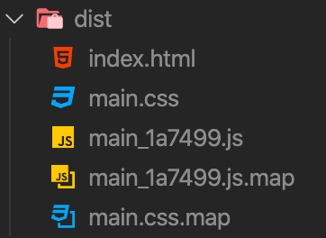

同时也会自动引入到html文件中：

```html
<!DOCTYPE html>
<html lang="en">
  <head>
    <meta charset="UTF-8" />
    <meta name="viewport" content="width=device-width,initial-scale=1" />
    <title>Webpack App</title>
    <link href="main.css" rel="stylesheet" />
  </head>
  <body>
    <div id="app"></div>
    <script src="main_1a7499.js"></script>
  </body>
</html>
```

> 参数扩展

```js
plugins: [
    new MiniCssExtractPlugin({
      filename: '[name].css',//如果直接被页面使用,使用这个名称
      chunkFilename: '[name].chunk.css',//如果间接被页面使用就走这个名称。比如通过事件调用
    }),
  ],
```

### 3.5.2css兼容性处理

`postcss-preset-env`插件作用：

帮postcss找到package.json中browserslist里面的配置，通过配置加载指定的css兼容性样式

安装：

```bash
npm install postcss-loader postcss-preset-env --save-dev
```

配置：

```js
//webpack.config.js

// 设置nodejs环境变量,此时才会启用browserslist中的开发环境配置
process.env.NODE_ENV = 'development';
module.exports = {
module:{
  rules:[
    {
      test:/\.css$/,
      use:[
        MiniCssExtractPlugin.loader,
        'css-loader',
        {
          loader: 'postcss-loader',
            options: {
              ident: 'postcss',
              plugins: () => [
                // postcss的插件
                require('postcss-preset-env')()
              ]
            }
        }
      ]
    }
  ]
}
}
```

`package.json`配置browserslist：

```json
{
  "browserslist": {
    //开发环境配置：需要设置环境变量才能启用开发环境配置
    "development": [
      "last 1 chrome version",
      "last 1 firefox version",
      "last 1 safari version"
    ],
    //生产环境配置：默认查看此环境配置，与webpack中mode配置的环境没关系的
    "production": [
      ">0.2%",
      "not dead",
      "not op_mini all"
    ]
  },
}
```

注意：browserslist的详细配置可以去github查看

### 3.5.3css代码压缩

对抽离的css进行压缩合并。使用插件`optimize-css-assets-webpack-plugin`

安装插件：

```bash
npm install optimize-css-assets-webpack-plugin --save-dev
```

使用插件：

```js
//webpack.prod.js
const { merge } = require("webpack-merge");
const commonConfig = require("./webpack.common.js");
const MiniCssExtractPlugin = require("mini-css-extract-plugin");
//1.导入插件
const OptimizeCSSAssetsPlugin = require("optimize-css-assets-webpack-plugin");
const prodConfig = {
  mode: "production",
  devtool: "source-map",
  module: {
    rules: [
      // 打包css文件
      {
        test: /\.css$/,
        use: [MiniCssExtractPlugin.loader, "css-loader", "postcss-loader"],
      },
      //   打包scss文件
      {
        test: /\.scss$/,
        use: [
          MiniCssExtractPlugin.loader,
          {
            loader: "css-loader",
            options: {
              importLoaders: 2,
            },
          },
          "sass-loader",
          "postcss-loader",
        ],
      },
      // 打包less文件
      {
        test: /\.less$/,
        use: [
          MiniCssExtractPlugin.loader,
          "css-loader",
          "less-loader",
          "postcss-loader",
        ],
      },
    ],
  },
  //2.使用插件
  optimization: {
    minimizer: [new OptimizeCSSAssetsPlugin({})],
  },
  plugins: [new MiniCssExtractPlugin()],
};

module.exports = merge(commonConfig, prodConfig);
```

此时打包出的css代码就进过压缩的。

### 3.5.4多个入口css文件打包到一个css文件

### 3.5.5多个入口css文件分别打包到各自css文件中


## 3.5webpack与浏览器缓存

可以通过命中缓存，以降低网络流量，使网站加载速度更快，然而，如果我们在部署新版本时不更改资源的文件名，浏览器可能会认为它没有被更新，就会使用它的缓存版本。由于缓存的存在，当你需要获取新的代码时，就会显得很棘手。

### 3.5.1输出文件的文件名

通过使用 `output.filename` 进行文件名替换，可以确保浏览器获取到修改后的文件。`[hash]` 替换可以用于在文件名中包含一个构建相关(build-specific)的 hash，但是更好的方式是使用 `[chunkhash]` 替换，在文件名中包含一个 chunk 相关(chunk-specific)的哈希。

```js
//webpack.prod.js
{
  output:{
    //这里使用contenthash
    filename:'[name].[contenthash].js',
    chunkFilename:'[name].[contenthash].js'  
  }
}
```

只有文件内容发生变化时，打包后`contenthash`才会变化。

### 3.5.2提取模板

正如我们在代码拆分中学到的那样，`SplitChunksPlugin`可以用于将模块拆分为单独的包。webpack提供了一种优化功能，可以使用该`optimization.runtimeChunk`选项将运行时代码分成单独的块。对其进行设置`single`为所有块创建单个运行时捆绑包：

```js
//webpack.common.js
 const path = require("path");
const HtmlWebpackPlugin = require("html-webpack-plugin");
const { CleanWebpackPlugin } = require("clean-webpack-plugin");
module.exports = {
  entry: {
    main: "./src/main.js",
  },
  module: {
    rules: [
      {
        test: /\.js$/,
        exclude: /node_modules/,
        loader: "babel-loader",
      },
      // 打包图片文件
      {
        test: /\.(jpg|png|gig)$/,
        use: [
          {
            loader: "url-loader",
            options: {
              name: "[name]_[hash:6].[ext]",
              outputPath: "images/",
              limit: 10240,
            },
          },
        ],
      },

      // 打包字体文件
      { test: /\.(eot|ttf|svg)$/, use: "file-loader" },
    ],
  },
  plugins: [
    new HtmlWebpackPlugin({
      template: "./public/index.html",
    }),
    new CleanWebpackPlugin(),
  ],
  optimization: {
    usedExports: true,
    splitChunks: {
      chunks: "all",
    },
    //配置runtime
    runtimeChunk: "single",
  },
  output: {
    filename: "[name]_[contenthash].js",
    path: path.resolve(__dirname, "../dist"),
  },
};

```

将第三方库(library)（例如 `lodash` 或 `react`）提取到单独的 `vendor` chunk 文件中，是比较推荐的做法，这是因为，它们很少像本地的源代码那样频繁修改。因此通过实现以上步骤，利用客户端的长效缓存机制，可以通过命中缓存来消除请求，并减少向服务器获取资源，同时还能保证客户端代码和服务器端代码版本一致。这可以通过使用新的 `entry(入口)` 起点，以及再额外配置一个 `CommonsChunkPlugin` 实例的组合方式来实现：

```js
 var path = require('path');
  const webpack = require('webpack');
  const CleanWebpackPlugin = require('clean-webpack-plugin');
  const HtmlWebpackPlugin = require('html-webpack-plugin');

  module.exports = {
    //1.配置入口文件
    entry: {
      main: './src/index.js',
      vendor: [
        'lodash'
      ]
    },
    plugins: [
      new CleanWebpackPlugin(['dist']),
      new HtmlWebpackPlugin({
        title: 'Caching'
      }),
      //2. 配置vendor
      new webpack.optimize.CommonsChunkPlugin({
        name: 'vendor'
      }),
      new webpack.optimize.CommonsChunkPlugin({
        name: 'manifest'
      })
    ],
    output: {
      filename: '[name].[chunkhash].js',
      path: path.resolve(__dirname, 'dist')
    }
  };
```

> *注意，引入顺序在这里很重要。*`CommonsChunkPlugin` *的* `'vendor'` *实例，必须在* `'manifest'` *实例之前引入。*

### 3.5.3模块标识符


## 3.6shimming

`webpack` 编译器(compiler)能够识别遵循 ES2015 模块语法、CommonJS 或 AMD 规范编写的模块。然而，一些第三方的库(library)可能会引用一些全局依赖（例如 `jQuery` 中的 `$`）。这些库也可能创建一些需要被导出的全局变量。这些“不符合规范的模块”就是 `shimming`发挥作用的地方。

`shimming` 另外一个使用场景就是，当你希望 `polyfill`浏览器功能以支持更多用户时。在这种情况下，你可能只想要将这些 `polyfill`提供给到需要修补(patch)的浏览器（也就是实现按需加载）。

### 3.6.1模块是封闭环境

在一个模块中不能使用另一个模块中的变量。

项目结构:

```js
webpack-vue-template
├─ .babelrc
├─ build
│  ├─ webpack.common.js
│  ├─ webpack.dev.js
│  └─ webpack.prod.js
├─ package-lock.json
├─ package.json
├─ postcss.config.js
├─ public
│  └─ index.html
└─ src
   ├─ index.js
   └─ main.js
```

```js
//index.js
export function changeColor() {
  $("body").css("background", "red");
}
```

在`main.js`中导入：

```js
import $ from "jquery";
import _ from "lodash";
import { changeColor } from "./index";
changeColor();
```

打包代码，并打开html查看页面：

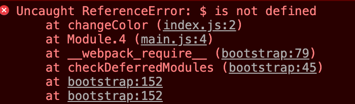

报错原因：

在webpack中是基于模块打包的，模块中的变量只能在当前模块中使用，而不能在其他模块使用。

修改`index.js`:

```js
//index.js
//导入jquery
import $ from "jquery";
export function changeColor() {
  $("body").css("background", "red");
}
```

此时重新进行打包，并打开浏览器：

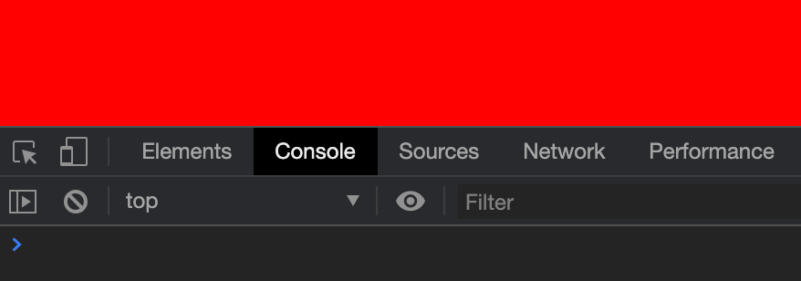

控制台没报错，并且样式正常显示。

因此，模块是一个封闭的环境，只能使用自己模块的变量。这样保证了模块与模块之间没有任何的耦合，同时模块出了错误也方便查找。

### 3.6.2shimming 全局变量

使用 `ProvidePlugin` 后，能够在通过 webpack 编译的每个模块中，通过访问一个变量来获取到 package 包。如果 webpack 知道这个变量在某个模块中被使用了，那么 webpack 将在最终 bundle 中引入我们给定的 package。

修改webpack配置

```js
//webpack.common.js
//1.导入webpack
const webpack = require("webpack");
module.exports = {
  /....
  plugins: [
    new HtmlWebpackPlugin({
      template: "./public/index.html",
    }),
    new CleanWebpackPlugin(),
    new webpack.ProvidePlugin({
      //表示：如果在一个模块中发现使用了$,webpack就会在该模块中自动引入jquery这个模块，然后模块名字叫$。
      //实际上在底层完成了import $ from "jquery";这部操作，而不用自己写
      $: "jquery",
    }),
  ],
}
```

本质上，我们所做的，就是告诉 webpack……

> 如果你遇到了至少一处用到 `lodash` 变量的模块实例，那请你将 `lodash` package 包引入进来，并将其提供给需要用到它的模块。

此时我们修改`index.js`:

```js
//index.js
export function changeColor() {
  $("body").css("background", "red");
}
```

重新打包，并打开浏览器：

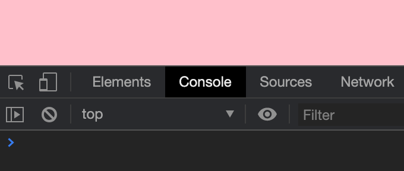

此时没有任何报错，并能正常显示。

我们还可以使用 `ProvidePlugin` 暴露某个模块中单个导出值，只需通过一个“数组路径”进行配置（例如 `[module, child, ...children?]`）。所以，让我们做如下设想，无论 `join` 方法在何处调用，我们都只会得到的是 `lodash` 中提供的 `join` 方法。

```js
//webpack.common.js
//1.导入webpack
const webpack = require("webpack");
module.exports = {
  /....
  plugins: [
    new HtmlWebpackPlugin({
      template: "./public/index.html",
    }),
    new CleanWebpackPlugin(),
    new webpack.ProvidePlugin({
      $: "jquery",
      //发现在模块中使用了join方法，就会自动将lodash中的join方法引入
      join: ['lodash', 'join'],
      //遇到模块中使用了_,就会自动导入lodash
      -:'lodash'
    }),
  ],
}
```

### 3.6.3模块中的this

模块中的`this`默认指向模块自身，而不是指向`window`。

我们可以使用`imports-loader`让模块中的`this`指向`window`:

安装

```bash
npm install imports-loader --save-dev
```

配置webpack：

```js
//webpack.common.js
module.exports = {
  module: {
    rules: [
      {
        test: /\.js$/,
        exclude: /node_modules/,
        use: [
          {
            loader: "babel-loader",
          },
          {
            //使用imports-loader
            loader: "imports-loader?this=>window",
          },
        ],
      },
      ]
  }
}
```

表示：遇到js文件时，先使用`imports-loader`将模块中this指向window，然后在使用`babel-loader`做编译。

## 3.7环境变量

使用环境变量进行打包。

webpack配置文件结构：

```js
build
   ├─ webpack.common.js
   ├─ webpack.dev.js
   └─ webpack.prod.js
```

修改`webpack.dev.js`:

```js
//webpack.dev.js
const webpack = require("webpack");
const devConfig = {
  mode: "development",
  devtool: "cheap-module-eval-source-map",
  devServer: {
    contentBase: "./dist",
    open: true,
    port: 8080,
    hot: true,
  },
  module: {
    rules: [
      // 打包css文件
      { test: /\.css$/, use: ["style-loader", "css-loader", "postcss-loader"] },
      //   打包scss文件
      {
        test: /\.scss$/,
        use: [
          "style-loader",
          {
            loader: "css-loader",
            options: {
              importLoaders: 2,
            },
          },
          "sass-loader",
          "postcss-loader",
        ],
      },
      // 打包less文件
      {
        test: /\.less$/,
        use: ["style-loader", "css-loader", "less-loader", "postcss-loader"],
      },
    ],
  },
  plugins: [new webpack.HotModuleReplacementPlugin()],
};

module.exports = devConfig;
```

修改`webpack.prod.js`:

```js
//webpack.prod.js
const MiniCssExtractPlugin = require("mini-css-extract-plugin");
const OptimizeCSSAssetsPlugin = require("optimize-css-assets-webpack-plugin");
const prodConfig = {
  mode: "production",
  devtool: "source-map",
  module: {
    rules: [
      // 打包css文件
      {
        test: /\.css$/,
        use: [MiniCssExtractPlugin.loader, "css-loader", "postcss-loader"],
      },
      //   打包scss文件
      {
        test: /\.scss$/,
        use: [
          MiniCssExtractPlugin.loader,
          {
            loader: "css-loader",
            options: {
              importLoaders: 2,
            },
          },
          "sass-loader",
          "postcss-loader",
        ],
      },
      // 打包less文件
      {
        test: /\.less$/,
        use: [
          MiniCssExtractPlugin.loader,
          "css-loader",
          "less-loader",
          "postcss-loader",
        ],
      },
    ],
  },
  optimization: {
    minimizer: [new OptimizeCSSAssetsPlugin({})],
  },
  plugins: [new MiniCssExtractPlugin()],
};

module.exports = prodConfig;
```

修改`webpack.common.js`:

```js
//webpack.common.js
const path = require("path");
const HtmlWebpackPlugin = require("html-webpack-plugin");
const { CleanWebpackPlugin } = require("clean-webpack-plugin");
const webpack = require("webpack");
const { merge } = require("webpack-merge");
const devConfig = require("./webpack.dev");
const prodConfig = require("./webpack.prod");
const commonConfig = {
  entry: {
    main: "./src/main.js",
  },
  module: {
    rules: [
      {
        test: /\.js$/,
        exclude: /node_modules/,
        use: [
          {
            loader: "babel-loader",
          },

          // {
          //   // loader: "imports-loader?this=>window",
          // },
        ],
      },
      // 打包图片文件
      {
        test: /\.(jpg|png|gig)$/,
        use: [
          {
            loader: "url-loader",
            options: {
              name: "[name]_[hash:6].[ext]",
              outputPath: "images/",
              limit: 10240,
            },
          },
        ],
      },

      // 打包字体文件
      { test: /\.(eot|ttf|svg)$/, use: "file-loader" },
    ],
  },
  plugins: [
    new HtmlWebpackPlugin({
      template: "./public/index.html",
    }),
    new CleanWebpackPlugin(),
    new webpack.ProvidePlugin({
      $: "jquery",
    }),
  ],
  optimization: {
    usedExports: true,
    splitChunks: {
      chunks: "all",
    },
    runtimeChunk: "single",
  },
  output: {
    filename: "[name]_[contenthash:6].js",
    path: path.resolve(__dirname, "../dist"),
  },
};

module.exports = (env) => {
  if (env && env.production) {
    return merge(commonConfig, prodConfig);
  } else {
    return merge(commonConfig, devConfig);
  }
};
```

修改`package.json`:使用webpack传递环境变量

```json
//package.json
{
  "scripts": {
    "test": "webpack --config ./build/webpack.common.js",
    //通过全局变量env向webpack的配置文件里传递一个属性production，它的值默认就是true
    //"build": "webpack --config --env.production ./build/webpack.common.js",
    "build": "webpack --env.production --config  ./build/webpack.common.js",
    "dev": "webpack-dev-server --config ./build/webpack.common.js"
  },
}
```

注：不能将`--env.production`写在`—config`后面。因为`--config`后面指定的是webpack的配置文件

此时执行打包命令就能正常打包：

```js
Hash: 3cad34bf14d04017f2bf
Version: webpack 4.44.1
Time: 437ms
             Asset       Size  Chunks                         Chunk Names
        index.html  239 bytes          [emitted]              
    main_8fa4ef.js   3.64 KiB       0  [emitted] [immutable]  main
main_8fa4ef.js.map   3.64 KiB       0  [emitted] [dev]        main
Entrypoint main = main_8fa4ef.js main_8fa4ef.js.map
```

## 3.8js处理

### 3.8.1js语法检查

只检查自己写的源代码，第三方的库是不用检查的

安装相关loader和插件

```bash
npm install eslint-loader  eslint --save-dev
npm install eslint-config-airbnb-base  eslint-plugin-import  --save-dev
```

配置：

```js
const { resolve } = require('path');
const HtmlWebpackPlugin = require('html-webpack-plugin');

module.exports = {
  entry: './src/js/index.js',
  output: {
    filename: 'js/built.js',
    path: resolve(__dirname, 'build')
  },
  module: {
    rules: [
      /*
        语法检查： eslint-loader  eslint
          注意：只检查自己写的源代码，第三方的库是不用检查的
          设置检查规则：
            package.json中eslintConfig中设置~
              "eslintConfig": {
                "extends": "airbnb-base"
              }
            airbnb --> eslint-config-airbnb-base  eslint-plugin-import eslint
      */
      {
        test: /\.js$/,
        exclude: /node_modules/,
        loader: 'eslint-loader',
        options: {
          // 自动修复eslint的错误
          fix: true
        }
      }
    ]
  },
  plugins: [
    new HtmlWebpackPlugin({
      template: './src/index.html'
    })
  ],
  mode: 'development'
};

```

Package.json配置

```json
{
   "eslintConfig": {
    "extends": "airbnb-base",
    "env": {
      "browser": true
    }
  },
}
```

## 多进程打包


安装loader：

```bash
npm install thread-loader --save-dev
```

一般给babel-loader使用

配置：

```js
/*
            正常来讲，一个文件只能被一个loader处理。
            当一个文件要被多个loader处理，那么一定要指定loader执行的先后顺序：
              先执行eslint 在执行babel
          */
          {
            test: /\.js$/,
            exclude: /node_modules/,
            use: [
              /* 
                开启多进程打包。 
                进程启动大概为600ms，进程通信也有开销。
                只有工作消耗时间比较长，才需要多进程打包
              */
              {
                loader: 'thread-loader',
                options: {
                  workers: 2 // 进程2个
                }
              },
              {
                loader: 'babel-loader',
                options: {
                  presets: [
                    [
                      '@babel/preset-env',
                      {
                        useBuiltIns: 'usage',
                        corejs: { version: 3 },
                        targets: {
                          chrome: '60',
                          firefox: '50'
                        }
                      }
                    ]
                  ],
                  // 开启babel缓存
                  // 第二次构建时，会读取之前的缓存
                  cacheDirectory: true
                }
              }
            ]
          },
```

## externals

```js
const { resolve } = require('path');
const HtmlWebpackPlugin = require('html-webpack-plugin');

module.exports = {
  entry: './src/js/index.js',
  output: {
    filename: 'js/built.js',
    path: resolve(__dirname, 'build')
  },
  plugins: [
    new HtmlWebpackPlugin({
      template: './src/index.html'
    })
  ],
  mode: 'production',
  externals: {
    // 拒绝jQuery被打包进来,此时html文件需要手动引入jQuery的cdn地址
    jquery: 'jQuery'
  }
};

```


# 十三.实战配置

## 4.1library的打包

### 4.1.1编写自己的库并打包

对编写的库代码或者工具函数进行打包。

文件结构

```js
-src
	--index.js//统一出口文件
	--math.js//按需导出数学库函数
	--string.js//按需导出字符串函数
-webpack.config.js
```


```js
//math.js
export function add(a, b) {
  return a + b;
}
export function minus(a, b) {
  return a - b;
}
export function multiply(a, b) {
  return a * b;
}
export function division(a, b) {
  return a / b;
}
```


```js
//string.js
export function join(a, b) {
  return a + "" + b;
}
```


```js
//index.js
import * as math from "./math";
import * as string from "./string";
export default { math, string };
```


```js
//webpack.config.js
const path = require('path');

  module.exports = {
    mode:'production',
    //1.配置入口文件
    entry: {
      main: './src/index.js',
    },
    output: {
      filename: 'library.js',
      path: path.resolve(__dirname, 'dist'),
      library:'library',//使用script方式引入的配置
      libraryTarget:'umd'//使用import，require方式导入项目使用时的配置
    }
  };
```

### 4.1.2打包库中使用 lodash

我们在自己编写的库中使用lodash第三方库的一些方法。但是用户使用我们编写的库，同时又再次去使用lodash库，因为我们库已经打包了lodash，但是用户又去引入lodash，就会导致再次打包一次lodash。

我们库打包了lodash的输出信息：

```js
Hash: 077a2a49f69dca8cc6df
Version: webpack 4.44.1
Time: 1467ms
Built at: 2020-08-19 12:04:35 ├F10: AM┤
     Asset      Size  Chunks             Chunk Names
library.js  72.8 KiB       0  [emitted]  main
Entrypoint main = library.js
```

打包出的library有72kb。

不打包lodash，修改webpack配置：

```js
const path = require("path");
module.exports = {
  mode: "production",
  entry: "./src/index.js",
  output: {
    filename: "library.js",
    path: path.resolve(__dirname, "dist"),
    //任何形式引入这个库都可以，require import
    libraryTarget: "umd",
    //配置此项可以使用script标签引入，并且会在全局中增加一个library变量
    library: "library",
  },
  //表示：在打包的过程中遇到lodash这个库就忽略，同时用户引入lodash时必须使用lodash变量接收
  externals: ['lodash']
};
```

打包输出信息：

```js
Hash: 25f9a6ed37eef46ecba8
Version: webpack 4.44.1
Time: 208ms
Built at: 2020-08-19 12:15:14 ├F10: AM┤
     Asset      Size  Chunks             Chunk Names
library.js  1.64 KiB       0  [emitted]  main
Entrypoint main = library.js
```

打包出的library有1kb。

用户使用方式：

```js
//使用lodash变量接收
import lodash from "lodash";
import library from 'library'
```

> 注意：必须在引入library库之前引入lodash，因为我们的库代码中没有打包lodash。

### 4.1.3发布到npm

修改package.json

```json
{
  "name": "library",
  "version": "1.0.0",
  "description": "",
  //修改入口为我们打包生成的文件
  "main": "./dist/library.js",
  "scripts": {
    "test": "echo \"Error: no test specified\" && exit 1",
    "build": "webpack"
  },
  "keywords": [],
  "author": "",
  "license": "ISC",
  "dependencies": {
    "lodash": "^4.17.20",
    "webpack": "^4.44.1",
    "webpack-cli": "^3.3.12"
  }
}
```


## 4.2PWA的打包配置

pwa技术：如果你访问一个网站，第一次访问成功了，突然服务器挂了，第二次重新访问这个网站的时候，他可以在本地有一份缓存，可以直接使用这份缓存，把之前访问的页面展示出来。这样即使服务器异常关闭了，在本地还是能够看到之前的那个页面。

模拟后端服务器

安装http-server

```shell
npm install http-server --save-dev
```

Package.json配置

```json
{
  "script":{
    //表示在dist目录下开启一个http-server服务器
    "start":"http-server dist"
  }
}
```

执行：`npm run start`

```js
> webpack-vue-template@1.0.0 start /Users/xujian/笔记/webpack-vue-template
> http-server dist

Starting up http-server, serving dist
Available on:
  http://127.0.0.1:8080
  http://192.168.3.2:8080
Hit CTRL-C to stop the server
```

可以通过以上两个网址访问。

但是如果关闭http-server，就不能访问页面了。


安装插件:实现pwa技术

```shell
npm install workbox-webpack-plugin --save-dev
```

只有要上线的版本才做pwa处理。

修改`webpack.prod.js`:

```js
//webpack.prod.js
const MiniCssExtractPlugin = require("mini-css-extract-plugin");
const OptimizeCSSAssetsPlugin = require("optimize-css-assets-webpack-plugin");
//1.导入workbox-webpack-plugin插件的GenerateSW函数
const { GenerateSW } = require("workbox-webpack-plugin");
const prodConfig = {
  mode: "production",
  devtool: "cheap-module-eval-source-map",
  optimization: {
    minimizer: [new OptimizeCSSAssetsPlugin({})],
  },
  //....省略loader配置
  //
  plugins: [
    new MiniCssExtractPlugin({
      filename: "[name].css",
      chunkFilename: "[name].chunk.css",
    }),
    //2.实例化
    //配置pwa
    new GenerateSW({
       /*
        1. 帮助serviceworker快速启动
        2. 删除旧的 serviceworker

        生成一个 serviceworker 配置文件~
      */
      clientsClaim: true,
      skipWaiting: true,
    }),
  ],
};

module.exports = prodConfig;
```

此时打包：

```js
Hash: 50a087198b2c33c5ae8d
Version: webpack 4.44.1
Time: 1499ms
                  Asset       Size  Chunks                         Chunk Names
             index.html  326 bytes          [emitted]              
         main_e0a185.js   2.75 KiB       0  [emitted] [immutable]  main
      runtime_b15356.js   6.11 KiB       1  [emitted] [immutable]  runtime
      service-worker.js   1.16 KiB          [emitted]              
  service-worker.js.map   1.78 KiB          [emitted]              
 vendors~main_37f034.js    216 KiB       2  [emitted] [immutable]  vendors~main
    workbox-468c4d03.js   7.74 KiB          [emitted]              
workbox-468c4d03.js.map   71.4 KiB          [emitted]              
Entrypoint main = runtime_b15356.js vendors~main_37f034.js main_e0a185.js
```

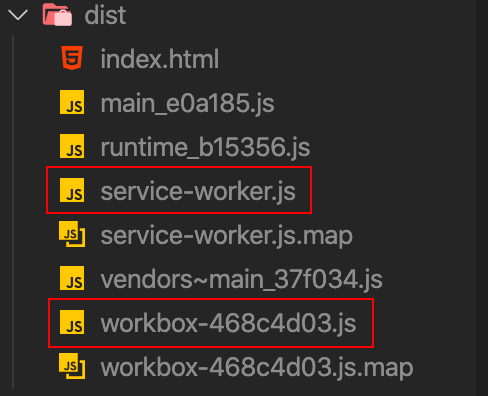


图中标注的两个文件就可以使这个项目实现pwa。

在业务代码中应用：用于处理兼容性问题

```js
//main.js
//如果浏览器支持serviceWorker，就进行注册。
if ("serviceWorker" in navigator) {
  window.addEventListener("load", () => {
    navigator.serviceWorker
      .register("/service-worker.js")
      .then((registration) => {
        console.log("注册成功");
      })
      .catch((err) => {
        console.log('注册失败');
      });
  });
}
```

重新打包并启动服务器（`npm run start`），能够正常访问。然后关闭服务器，也能正常访问。

## 4.3TypeScript的打包配置

项目结构：

```

```

`index.tsx`:

```tsx
class Greeter {
  greeting: string;
  constructor(message: string) {
    this.greeting = message;
  }
  greet() {
    return "Hello, " + this.greeting;
  }
}

let greeter = new Greeter("world");

let button = document.createElement("button");
button.textContent = "Say Hello";
button.onclick = function () {
  alert(greeter.greet());
};

document.body.appendChild(button);
```

webpack配置：

```js
//webpack.config.js
const path = require("path");
module.exports = {
  mode: "production",
  entry: "./src/index.tsx",
  module: {
    rules: [{ test: /\.tsx$/, use: "ts-loader", exclude: /node_modules/ }],
  },
  output: {
    filename: "[name].[contenthash:6].js",
    path: path.resolve(__dirname, "dist"),
  },
};
```

此时还不能打包成功，必须配置typescript的配置文件。

在根目录新建`tsconfig.json`

```json
{
  "compilerOptions": {
    "outDir": "./dist",
    "target": "ES5",
    "allowJs": true,
    "module": "es6"
  }
}
```

## 4.4使用webpackdevserver实现请求转发

发送请求：

```js
//配置请求转发时不需要全局配置axios的根路径
axios.get('/api/header.json').then((res)=>{
  console.log(res)
})
```

请求转发配置：

```js
//webpack.config.js
module.exports={
  devserver:{
    proxy:{
      //当访问以/api开头的路径时，就会在target配置的路径下去访问（http://192.168.3.208/api）。
      '/api':{
        target:'http://192.168.3.208',//转发的地址
        //如果是访问https的地址，需要配置此项
        secure:false,
        pathRewrite:{
          //如果不需要转发时，注释这条语句即可
          'header.json':'demo.json'//当访问header.json文件时，转发去访问demo.json文件
        }
      }
    }
  }
}
```

其他参数：

```js
devServer: {
  //如果
    index: '', 
    host: '...',
    contentBase: '...',
    proxy: {
      context: () => true,
      target: 'http://localhost:1234'
    }
  }
```

解决单页面应用路由问题：

当使用 HTML5 History API 时，任意的 `404` 响应都可能需要被替代为 `index.html`。通过传入以下启用：

```js
module.exports = {
  //...
  devServer: {
    //
    historyApiFallback: true
  }
};
```


## 4.5eslint在webpack中的配置

项目中安装：

```shell
npm install eslint --save-dev
```

新建eslint配置文件：

```shell
npx eslint --init

#执行上面命令后，就会出现配置项
#1.怎么配置eslint
use a popular style guide
#2.使用哪种规范
Airbnd
#3.是否项目中使用react
n
#4.配置文件是一种什么形式
javascript
#5.是否安装依赖
y
```

此时安装完成依赖，项目中就会多一个`.eslintrc.js`文件。

```js
//.eslintrc.js
module.exports={
  "extends":"airbnd",
  "parser":"babel-eslint",
  "rules":{
    "规则名字":0//0代表不遵守这个规则
  },
  globals:{
    //document设置为false表示后来不能够被覆盖
    document:false
  }
}
```

注意：此时使用vscode编辑器安装一个eslint的插件进行检测。

这样借用编辑器插件来校验代码规范在团队中会存在问题。比如有些成员没有使用vscode，而是使用其他编辑器，并且没有类似的插件，那么代码就不会进行校验，从而这个成员就不会按照eslint规范进行编写代码。因此需要讲eslint在webpack中进行配置，保证每个成员都遵循此规范，而不受编辑器的约束。

安装eslint-loader：

```shell
npm install eslint-loader --save-dev
```

使用：

```js
//webpack.config.js
module.exports={
  devServer:{
    //当进行eslint有错误时，会在浏览器打开的页面上弹层显示哪些规范错误。如果不配置这个属性，则错误只能在控制台显示。
    overlay:true
  },
  module:{
    rules:[
      {
        test:/\.js$/,
        exclude:/node_modules/,
        use:['babel-loader','eslint-loader']//执行顺序：从右到左  
      }
    ]
  }
}
```

> 注意：此时不需要编辑器再安装eslint相关插件。但是会降低打包的速度。可以使用git钩子，在提交到仓库之前进行eslint检测，检测通过才让提交仓库。


## 4.5webpack性能优化

> 1. 使用最新的`Node`,`Npm`等工具

升级版本会提升打包的速度。

> 2.在尽可能少的模块上应用Loader

减少loader 的使用。

比如打包js文件时，推荐使用excluded排除不需要进行打包的模块。使用include配置包含的文件。

> 3. plugin尽可能精简并确保可靠

比如在开发阶段不需要对抽离css代码进行压缩，只需要线上时压缩。使用官方推荐的插件，因为性能比较高。

> 4. resolve参数合理配置

使用import引入逻辑文件时省略后缀的配置：

```js
//webpack.config.js
module.exports={
  resolve:{
    //表示：当我们引入其他模块的时候，会先查找以.vue结尾的，如果不存在，则查找.js文件，这样直到查到为止。如果最后没找到，就报错。
    extensions:['.vue','.js','.jsx']//从前往后执行
  }
}
```

使用：

```js
//index.js
//此时可以省略后缀名
import index from './index'
//此时会先去文件找当前文件夹下是否有index.vue文件，没有就继续查找是否有index.js文件，如果没有就查找index.jsx文件。如果所有的都没找到，则报错。
```

注：`.jpg`和`.css`等非逻辑文件，不建议配置此项。因为会对打包性能造成一定影响。

修改默认引入的index.js配置：

```js
//webpack.config.js
module.exports={
  resolve:{
    extensions:['.vue','.js','.jsx'],//从前往后执行
    mainFiles:['index','child']//不建议配置此项
  }
}
```

使用：

```js
//如果不配置上面的mainFiles，则默认会去找child文件夹下的index
import child from './child/'
//当配置了上面的，则依次会去找child文件夹下的index.vue,index.js.index.jsx,child.vue,child.js.child.jsx
```

注：也会对性能造成影响。因为会去调用node去查找文件。

配置路径别名：

```js
//webpack.config.js
module.exports={
  resolve:{
    //配置别名
    alias:{
      //当看到@时，就会去../src下面查找
      @:path.resolve(__dirname,'../src')
    }
  }
}
```

使用：

```js
//此时表示引入../src/view/home
import home from '@/view/home'
```

> 5. 使用DllPlugin提高打包速度

在项目中使用的第三方模块（比如`vue`,`react`,`lodash`等），实际上是不会变的。因此我们只需要在第一次打包时对依赖的第三方模块进行分析并打包成库文件，最后借助插件添加到生成的html文件中。

原理：减少第三方模块的打包次数（打包一次），从而减少每次打包的速度。

1. 第三方模块打包一次

- 对第三方模块打包配置

```js
//webpack.dll.js
const path =require('path')

module.exports={
  mode:;'production',
  entry:{
  	vendors:['react','react-dom','lodash']//这里配置需要打包的第三方模块名字（只需要打包一次的第三方模块）
	},
  output:{
    filename:'[name].dll.js',//打包后的名字为vendors.dll.js
    path:path.resolve(__dirname,'../dll'),//打包后的文件存放路径
    library:'[name]'//将打包好的文件通过全局变量暴露出来，这个全局变量叫[name],也就是vendors
  }
}
```

配置package.json:对第三方模块进行打包

```json
{
  "script":{
    "build:dll":"webpack --config ./build/webpack.dll.js"
  }
}
```

- 使用插件将打包的第三方模块添加到新生成的html中（只有引入才能使用打包暴露的全局变量）。

安装插件:

往新生成的html文件中添加静态资源。

```shell
npm install add-asset-html-webpack-plugin --save
```

使用：

```js
//webpack.common.js
const AddAssetHtmlWebpackPlugin =require('add-asset-html-webpack-plugin')

module.exports={
  plugins:[
    new HtmlWebpackPlugin({
      template:'src/index.html'
    }),
    new AddAssetHtmlWebpackPlugin({
      filepath:path.resolve(__dirname,'../dll/vendors.dll.js')//需要添加的文件路径
    })
  ]
}
```

此时在控制台输入`vendors`,控制台就会打印出内容。并且html源代码中也引入了第三方模块。

但是这个打包生成的第三方模块，在webpack打包的过程中并没有使用它。目前还只是在html文件中引入了。

2. 我们引入第三方模块的时候，要去使用dll文件引入。

```js
//webpack.dll.js
const path =require('path')
const webpack =require('webpack')

module.exports={
  mode:;'production',
  entry:{
  	vendors:['react','react-dom','lodash']//这里配置需要打包的第三方库名字
	},
  output:{
    filename:'[name].dll.js',
    path:path.resolve(__dirname,'../dll'),
    library:'[name]'//以库文件的形式进行打包。向全局暴露。
  },
  plugins:[
      //使用DllPlugin插件对暴露的模块代码做一个分析生成一个manifest.json的映射文件
      new webpack.DllPlugin({
        name:'[name]',//分析的文件名字，必须和library的名字一样。
        path:path.resolve(__dirname,'../dll/[name].manifest.json'),//分析结果的存放位置
      })
    ]
}
```

此时执行打包命令（`npm run build:dll`），在dll文件夹下就会生成一个映射文件。此时还需要在打包的`webpack.common.js`配置中进行配置：

```js
//webpack.common.js
const AddAssetHtmlWebpackPlugin =require('add-asset-html-webpack-plugin')

module.exports={
  plugins:[
    new AddAssetHtmlWebpackPlugin({
      filepath:path.resolve(__dirname,'../dll/vendors.dll.js')
    }),
    //使用插件。
    //当进行打包时，发现引入了第三方模块，此时这个插件就会在vendors.manifest.json去找第三方模块的映射关系，如果能找到映射关系，他就知道这个第三方模块没必要再进行打包，直接从vendors.dll.js中拿过来用就可以了（会在全局变量里去拿）。如果发现引入的第三方模块，没在这个映射关系里面，就会在node_modules中去拿这个模块进行打包。
    new webpack.DllReferrencePlugin({
      manifest:path.resolve(__dirname,'../dll/vendors.manifest.json')
    })
  ]
}
```

此时就可以正常使用了。并且打包时间缩短了很多。

> 扩展：对第三方模块进行拆分再分别引入

配置`webpack.dll.js`

```js
//webpack.dll.js
const path =require('path')
const webpack =require('webpack')

module.exports={
  mode:;'production',
  entry:{
  	vendors:['lodash'],//对第三方模块进行拆分打包
      react:['react','react-dom']
	},
  output:{
    filename:'[name].dll.js',
    path:path.resolve(__dirname,'../dll'),
    library:'[name]'//以库文件的形式进行打包。向全局暴露。
  },
  plugins:[
      //使用DllPlugin插件对暴露的模块代码做一个分析生成一个manifest.json的映射文件
      new webpack.DllPlugin({
        name:'[name]',//分析的文件名字，必须和library的名字一样。
        path:path.resolve(__dirname,'../dll/[name].manifest.json'),//分析结果的存放位置
      })
    ]
}
```

此时执行打包命令会生成：`react.dll.js`,`react.manifest.json`和`vendors.dll.js`和`vendors.manifest.json`

此时还需要配置`webpack.common.js`文件

```js
//webpack.common.js
const AddAssetHtmlWebpackPlugin =require('add-asset-html-webpack-plugin')

module.exports={
  plugins:[
    new AddAssetHtmlWebpackPlugin({
      filepath:path.resolve(__dirname,'../dll/vendors.dll.js')
    }),
    //配置react.dll.js
 		new AddAssetHtmlWebpackPlugin({
      filepath:path.resolve(__dirname,'../dll/react.dll.js')
    }),
    new webpack.DllReferrencePlugin({
      manifest:path.resolve(__dirname,'../dll/vendors.manifest.json')
    }),
    //配置react.manifest.json
    new webpack.DllReferrencePlugin({
      manifest:path.resolve(__dirname,'../dll/react.manifest.json')
    })
  ]
}
```

此时重新启动项目，可以正常运行。

但是在大型的项目中，拆分的模块很多，打包生成的第三方模块对应的dll文件很多。此时就要一个一个在`webpack.common.js`中添加很多重复的代码。

解决办法：使用node分析dll目录下有几个dll文件，然后动态的往plugins添加`AddAssetHtmlWebpackPlugin`和`DllReferrencePlugin`

```js
//webpack.common.js
const AddAssetHtmlWebpackPlugin =require('add-asset-html-webpack-plugin')
//2.
const fs=require('fs')

//1.抽离基础的插件
const plugins=[
  new HtmlWebpackPlugin({
			template: 'src/index.html'
		}), 
	new CleanWebpackPlugin(['dist'], {//这个插件的默认的根路径就是代表的当前目录
			root: path.resolve(__dirname, '../')//配置根路径位置。表示清除上一层的dist目录
		})
]

const files=fs.readdirSync(path.resolve(__dirname, '../dll'))
files.forEach(file=>{
  if(/.*\.dll.js/.test(file)){
    plugins.push(
      new AddAssetHtmlWebpackPlugin({
      filepath:path.resolve(__dirname,'../dll',file)
    }))
  }
  if(/.*\.manifest.json/.test(file)){
    plugins.push(
    new webpack.DllReferrencePlugin({
      manifest:path.resolve(__dirname,'../dll',file)
    }))
  }
})

module.exports={
  plugins
}
```

此时在webpack.dll.js配置中拆分模块并且打包后，webpack.common.js就会自动的去分析并向全局暴露。

> 6. 控制包文件的大小

使用treeshiking

> 7. thread-loader,parallel-webpack,happypack多进程打包


> 8. 合理使用sourcemap

越详细越慢。

> 9. 结合stats分析打包结果

> 10. 开发环境内存编译

> 11. 开发环境无用插件剔除

比如开发时不需要设置mode为production

## 4.6多页面打包配置

使用场景：在使用jquery，zepto开发的项目时，就需要对多个页面进行打包（多个html页面引入不同的js文件。）。

原理：在HtmlWebpackPlugin中配置了多个html。

文件夹结构：

```js

```

### 4.6.1基本配置

基本配置文件：

```js
//webpack.common.js
const plugins=[
  //2.生成多个html文件
  new HtmlWebpackPlugin({
    //模版
    template:'src/index.html',
    filename:'index.html',//生成的html文件名称
    chunks:['runtime','vendors','main']//表示这个html文件引入的js文件有哪些
  }),
  new HtmlWebpackPlugin({
    //模版
    template:'src/index.html',
    filename:'list.html',//生成的html文件名称
    chunks:['runtime','vendors','list']//表示这个html文件引入的js文件有哪些
  })
]


module.exports={
  //1.配置多个入口文件
  //一个页面引入main.js,另一个页面引入list.js
  entry:{
    main:'./src/index.js',
    list:'./src/list.js'
  },
  plugins
}
```

此时即可实现多页面应用的打包。

如果还需要增加页面，只需要在入口添加js文件，然后在配置一个HtmlWebpackPlugin即可。

缺点：每增加一个页面，就要增加入口文件，同时还需要重复的配置HtmlWebpackPlugin。

### 4.6.2根据入口动态生成html文件

动态生成html页面配置：

```js
//webpack.common.js
const path = require('path');
const fs = require('fs');
const HtmlWebpackPlugin = require('html-webpack-plugin');
const CleanWebpackPlugin = require('clean-webpack-plugin');
const AddAssetHtmlWebpackPlugin = require('add-asset-html-webpack-plugin');
const webpack = require('webpack');

//生成plugin的函数
const makePlugins = (configs) => {
  //1。初始化plugins数组
	const plugins = [
		new CleanWebpackPlugin(['dist'], {
			root: path.resolve(__dirname, '../')
		})
	];
  //2.根据入口文件动态生成html文件，并添加到plugins数组中
	Object.keys(configs.entry).forEach(item => {
		plugins.push(
			new HtmlWebpackPlugin({
				template: 'src/index.html',
				filename: `${item}.html`,
				chunks: ['runtime', 'vendors', item]
			})
		)
	});
  //3.
	const files = fs.readdirSync(path.resolve(__dirname, '../dll'));
	files.forEach(file => {
		if(/.*\.dll.js/.test(file)) {
			plugins.push(new AddAssetHtmlWebpackPlugin({
				filepath: path.resolve(__dirname, '../dll', file)
			}))
		}
		if(/.*\.manifest.json/.test(file)) {
			plugins.push(new webpack.DllReferencePlugin({
				manifest: path.resolve(__dirname, '../dll', file)
			}))
		}
	});
  //4.将plugins数组返回
	return plugins;
}

//配置信息
const configs = {
	entry: {
		index: './src/index.js',
		list: './src/list.js',
		detail: './src/detail.js',
	},
	resolve: {
		extensions: ['.js', '.jsx'],
	},
	module: {
		rules: [{ 
			test: /\.jsx?$/, 
			include: path.resolve(__dirname, '../src'),
			use: [{
				loader: 'babel-loader'
			}]
		}, {
			test: /\.(jpg|png|gif)$/,
			use: {
				loader: 'url-loader',
				options: {
					name: '[name]_[hash].[ext]',
					outputPath: 'images/',
					limit: 10240
				}
			} 
		}, {
			test: /\.(eot|ttf|svg)$/,
			use: {
				loader: 'file-loader'
			} 
		}]
	},
	optimization: {
		runtimeChunk: {
			name: 'runtime'
		},
		usedExports: true,
		splitChunks: {
      chunks: 'all',
      cacheGroups: {
      	vendors: {
      		test: /[\\/]node_modules[\\/]/,
      		priority: -10,
      		name: 'vendors',
      	}
      }
    }
	},
	performance: false,
	output: {
		path: path.resolve(__dirname, '../dist')
	}
}
//调用函数并赋值给配置对象的plugins
configs.plugins = makePlugins(configs);
//将配置导出
module.exports = configs
```

此时如果再增加新页面，只需要在入口文件中添加新页面名称。

# 十四.底层原理

## 5.1编写loader

loader实际上就是一个函数。但是不能写成箭头函数，必须写成声明式函数。因为如果写成箭头函数，this指向就会存在问题，就不能使用this调用本该属于loader的方法。

### 5.1.1实现最简单的loader

1. 初始化项目

```shell
npm init -y
```

2. 安装webpack，webpack-cli

```shell
npm i webpack webpack-cli -D
```

3. 配置webpack

```js
//webpack.config.js
const path = require('path')
module.exports={
  mode:'development',
  entry:{
    index:'./src/index.js'
  },
  output:{
    path:path.resolve(__dirname,'dist'),
    filename:'[name].js'
  }
}
```

4. 编写loader

loader其实就是一个函数（方法）。用于实现某种功能。

在根目录下新建loaders文件夹，再新建一个replaceLoaders.js文件

```js
//replaceLoaders.js
//这里不能使用箭头函数，因为使用this时会出现指向问题。
module.exports=function(source){
  return source.replace('dell','dellDee')
}
```

5. 在本项目使用loader

```js
//webpack.config.js
const path = require('path')
module.exports={
  mode:'development',
  entry:{
    index:'./src/index.js'
  },
  module:{
    rules:[
      //使用编写的loader
      {
        test:/\.js/,
        //在本项目编写的loader，则需要使用绝对路径
        use:[path.resolve(__dirname,'./loaders/replaceLoaders.js')]
      }
    ]
  },
  output:{
    path:path.resolve(__dirname,'dist'),
    filename:'[name].js'
  }
}
```

6. 执行打包

配置package.json

```json
{
  "scripts": {
    "build": "webpack"
  }
}
```

执行打包命令

```shell
npm run build
```

此时就使用编写的loader打包成功了。

### 5.1.2loader中传递参数

1. 编写loader

```js
//replaceLoaders.js
//这里不能使用箭头函数，因为使用this时会出现指向问题
module.exports=function(source){
  //通过this.query可以获取到传递的参数
  return source.replace('dell',this.query.name)//此时将dell替换为this.query.name的值
}
```

2. 配置时传递参数

```js
//webpack.config.js
const path = require('path')
module.exports={
  mode:'development',
  entry:{
    index:'./src/index.js'
  },
  module:{
    rules:[
      {
        test:/\.js/,
        use:[{//由字符串修改为对象配置loader
          loader:path.resolve(__dirname,'./loaders/replaceLoaders.js'),
          //通过options传递参数
          options:{
            name:'lee'
          }
        }]
      }
    ]
  },
  output:{
    path:path.resolve(__dirname,'dist'),
    filename:'[name].js'
  }
}
```

### 5.1.3使用`loader-utils`分析传递的参数

安装:

```shell
npm i loader-utils -D
```

使用：

```js
//replaceLoaders.js
const loaderUtils = require('loader-utils')
module.exports=function(source){
  //使用loaderUtils分析传递过来的参数(this.query),然后把内容放在options里保存
  const options = loaderUtils.getOptions(this)
  return source.replace('dell',options.name)//此时将dell替换为options.name的值
}
```

### 5.1.4使用多个loader

只需要在rules中配置多个loader。


### 5.1.5简化loader使用

之前使用自行编写的loader都是使用的相对位置。这样每次编写很长的路径，就很麻烦。这次改为直接写loader名字即可。

配置：

```js
//webpack.config.js
const path = require('path')
module.exports={
  mode:'development',
  entry:{
    index:'./src/index.js'
  },
  resolveLoader:{
    //1.当使用loader时，先去ode_modules去查找，如果没有。则会紧接着去./loaders/下查找
    modules:['node_modules','./loaders/']
  },
  module:{
    rules:[
      {
        test:/\.js/,
        use:[{//由字符串修改为对象配置loader
          //2.当配置了resolveLoaders时，这里只需要写loader的名字即可
          loader:'replaceLoaders',
        }]
      }
    ]
  },
  output:{
    path:path.resolve(__dirname,'dist'),
    filename:'[name].js'
  }
}
```

## 5.2编写plugin

loader是帮助我们去处理引入的模块。在我们打包时，在某些时刻上需要做某些事情，就需要使用plugin。

plugin是一个类。


## 5.3Bundler源码编写

# 十五resolve配置

这些选项能设置模块如何被解析。webpack 提供合理的默认值，但是还是可能会修改一些解析的细节。

`resolve` 配置 `webpack` 如何寻找模块所对应的文件。`webpack` 内置 `JavaScript` 模块化语法解析功能，默认会采

用模块化标准里约定好的规则去寻找，但你可以根据自己的需要修改默认的规则。

## 15.1modules

`resolve.modules` 配置 `webpack` 去哪些目录下寻找第三方模块，默认情况下，只会去 `node_modules` 下寻找，如果

你我们项目中某个文件夹下的模块经常被导入，不希望写很长的路径，那么就可以通过配置 `resolve.modules` 来简化。

```js
//webpack.config.js
module.exports = {
    //....
    resolve: {
        modules: ['./src/components', 'node_modules'] //从左到右依次查找
    }
}
```

这样配置之后，我们 `import Dialog from 'dialog'`，会去寻找 `./src/components/dialog`，不再需要使用相对路

径导入。如果在 `./src/components` 下找不到的话，就会到 `node_modules` 下寻找。

## 15.2alias

`resolve.alias` 配置项通过别名把原导入路径映射成一个新的导入路径，例如：

```js
//webpack.config.js
module.exports = {
    //....
    resolve: {
        alias: {
            'react-native': '@my/react-native-web' //这个包名是我随便写的哈
        }
    }
}
```

例如，我们有一个依赖 `@my/react-native-web` 可以实现 `react-native` 转 `web`。我们代码一般下面这样:

```js
import { View, ListView, StyleSheet, Animated } from 'react-native';
```

配置了别名之后，在转 web 时，会从 `@my/react-native-web` 寻找对应的依赖。

当然啦，如果某个依赖的名字太长了，你也可以给它配置一个短一点的别名，这样用起来比较爽，尤其是带有 `scope` 的包。

## 15.3extensions

适配多端的项目中，可能会出现 `.web.js`, `.wx.js`，例如在转web的项目中，我们希望首先找 `.web.js`，如果没有，

再找 `.js`。我们可以这样配置:

```js
//webpack.config.js
module.exports = {
    //....
    resolve: {
        extensions: ['web.js', '.js'] // 当然，你还可以配置 .json, .css
    }
}
```

首先寻找 `../dialog.web.js` ，如果不存在的话，再寻找 `../dialog.js`。这在适配多端的代码中非常有用，否则，你

就需要根据不同的平台去引入文件(以牺牲了速度为代价)。

```js
import dialog from '../dialog';
```

当然，配置 `extensions`，我们就可以缺省文件后缀，在导入语句没带文件后缀时，会自动带上`extensions` 中配置的

后缀后，去尝试访问文件是否存在，因此要将高频的后缀放在前面，并且数组不要太长，减少尝试次数。如果没有配置 

`extensions`，默认只会找对对应的js文件。


