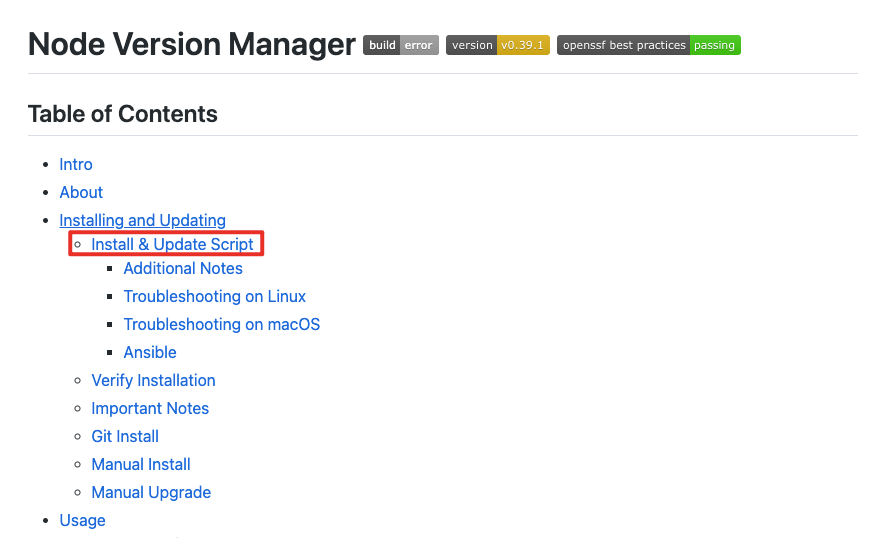
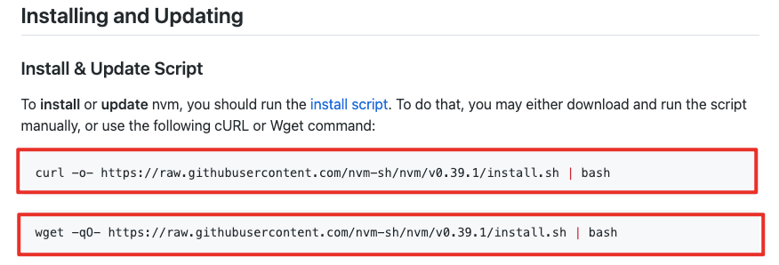
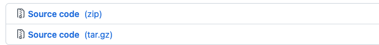
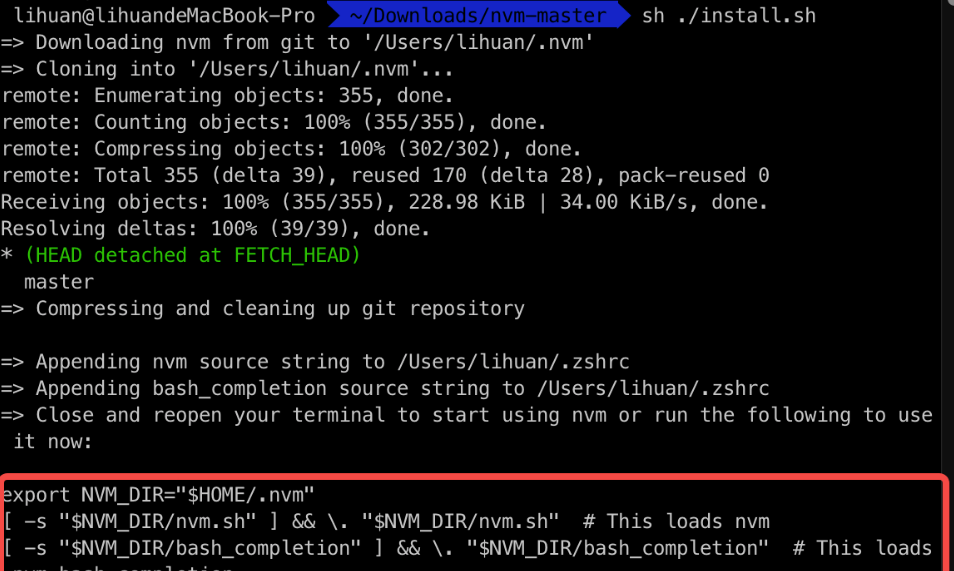

# 1.Windows环境下

## 1.1nvm安装教程

### 1.1.1安装

```
https://github.com/coreybutler/nvm-windows
```

**下载安装版**


> 注意：默认安装时不会安装npm包。需要相关配置

1. 命令行运行：`nvm root` 显示出nvm的安装目录
2. 打开nvm文件夹下的settings.txt文件，在最后添加以下代码：

```
node_mirror: https://npm.taobao.org/mirrors/node/
npm_mirror: https://npm.taobao.org/mirrors/npm/
```

将下载镜像源指向淘宝（这步也很重要，否则在安装node的时候会出现卡死，npm安装不成功的情况）

3. 打开cmd，nvm install v版本号
4. 打开nvm文件中对应版本号的node_modules文件夹，可以看到npm文件，则说明npm安装成功

### 1.1.2使用

安装最新稳定版 `node`，当前是 `node v12.9.1 (npm v7.9.0)`

```bash
$ nvm install stable
```

安装指定版本，可模糊安装，如：安装 `v4.4.0`，既可 `$ nvm install v4.4.0`，又可 `$ nvm install 4.4`

```bash
$ nvm install <version>
```

删除已安装的指定版本，语法与 `install` 用法一致

```bash
$ nvm uninstall <version>
```

切换使用指定的版本 `node`

```bash
// 临时版本 - 只在当前窗口生效指定版本
$ nvm use <version>

// 永久版本 - 所有窗口生效指定版本
$ nvm alias default <version>
```

`注意`：在任意一个命令行窗口进行切换之后，其他的窗口或其他命令行工具窗口 `需要关掉工具，重启才能生效`。（例如 `VSCode` 内或外部命令切换之后，需要重启 `VSCode`，才能正常生效，否则或处于 `临时生效状态`，也就是在 `VSCode` 中重新打开一个命令行查看版本还会是旧版本，所以必须要重启。）

这里的 `重启` 不是简单的关掉窗口重启，没有退出后台进程，而是完全退出杀死工具进程，重新启动。

列出所有安装的版本

```bash
$ nvm ls
```

列出所有远程服务器的版本（官方 `node version list`）

```bash
$ nvm ls-remote
```

显示当前的版本

```bash
$ nvm current
```

给不同的版本号添加别名

```bash
$ nvm alias <name> <version>
```

删除已定义的别名

```bash
$ nvm unalias <name>
```

在当前版本 `node` 环境下，重新全局安装指定版本号的 `npm` 包

```bash
$ nvm reinstall-packages <version>
```

查看更多命令可在终端输入

```bash
$ nvm
```

# 2.MAC环境下

## 2.1n的安装教程

### 2.1.1安装

```bash
 npm install -g n
```


### 2.1.2使用

安装最新稳定版

```bash
$ sudo n stable
```

安装最新版本

```bash
$ sudo n latest
```

安装某个具体node版本

```bash
$ sudo n 14.16.1
```

删除某个具体的node版本

```bash
$ sudo n rm 14.16.1
```

查看本机已安装的node版本

```bash
$ n ls
```

切换 node 版本:通过上下键，选择要使用的 node 版本 ,回车安装

```bash
$  sudo n
```

卸载 n

```bash
$ sudo npm uninstall n -g
```

## 2.2nvm

### 2.2.1卸载node

若电脑安装了node，最好把node先卸载，检查是否安装node

```shell
$ node -v
```

有版本号返回，说明已经安装，依次执行以下命令卸载node:

```bash
sudo npm uninstall npm -g
sudo rm -rf /usr/local/lib/node /usr/local/lib/node_modules /var/db/receipts/org.nodejs.*
sudo rm -rf /usr/local/include/node /Users/$USER/.npm
sudo rm /usr/local/bin/node
sudo rm /usr/local/share/man/man1/node.1
sudo rm /usr/local/lib/dtrace/node.d
```

验证是否卸载完成:

```bash
npm -v
node -v
```

### 2.2.2安装nvm

nvm下载地址:https://github.com/nvm-sh/nvm

点击install:




安装：



安装方式一：命令安装（二选一）刚开始选择的命令安装，由于网不好，搭了梯子也很慢，所以手动安装了。

```bash
curl -o- https://raw.githubusercontent.com/nvm-sh/nvm/v0.38.0/install.sh | bash
```

或

```bash
wget -qO- https://raw.githubusercontent.com/nvm-sh/nvm/v0.38.0/install.sh | bash
```

第二种需要安装wget

安装wget：

1. 安装homebrew

```bash
ruby -e "$(curl -fsSL https://raw.githubusercontent.com/Homebrew/install/master/install)"
```

2. 安装wget

```bash
brew install wget
```

方式二：手动安装

下载安装包：



解压文件找到 `install.sh`

该目录下执行:

```bash
sh ./install.sh
```



安装完成之后，如果出现下面红框内容，表示缺少环境配置，将红框中的内容复制，并放到命令行中运行


查看是否安装成功

```bash
nvm --version
```

显示版本号，证明安装成功。

### 2.2.3使用nvm

1. 安装最新稳定版 node

```bash
$ nvm install stable
```

2. 安装指定版本，可模糊安装，如：安装 v17.4.0，既可 `$ nvm install v17.4.0`，又可 `$ nvm install 17.4`

```bash
$ nvm install <version>
```

3. 切换使用指定的版本 node

```bash
$ nvm use <version>
```

4. 列出所有版本

```bash
$ nvm ls
```

5. 显示当前版本

```bash
$ nvm current
```

6. 给不同的版本号添加别名

```bash
$ nvm alias <name> <version>
```

7. 删除已定义的别名

```bash
$ nvm unalias <name>
```

8. 删除已安装的指定版本

```bash
$ nvm uninstall <version>
```

9. 在当前版本 node 环境下，重新全局安装指定版本号的 npm 包

```bash
$ nvm reinstall-packages <version>
```

### 2.2.4解决nvm切换node版本后，重新打开终端失效

`nvm use` 之后重新打开终端还是显示修改之前的版本。
要指定一下默认版本是你要的版本：

```shell
$ nvm alias default 16.13.0
```


## 2.3卸载 node

首先，命令行执行：

```bash
$ sudo rm -rf /usr/local/{bin/{node,npm},lib/node_modules/npm,lib/node,share/man/*/node.*}
```

查看 node 安装目录：

```bash
which node
/usr/local/bin/node
```

依次执行下面的命令，删除 node 安装目录下的相关配置文件：

```bash
sudo npm uninstall npm -g
sudo rm -rf /usr/local/lib/node /usr/local/lib/node_modules /var/db/receipts/org.nodejs.*
sudo rm -rf /usr/local/include/node /Users/$USER/.npm
sudo rm /usr/local/bin/node
sudo rm /usr/local/share/man/man1/node.1
sudo rm /usr/local/lib/dtrace/node.d
```

最后验证一下是否完全删除掉：

```bahs
dd@lff ~ % node 
bash: node: command not found
dd@lff ~ % npm
bash: /usr/local/bin/npm: No such file or directory
```

至此，node 已经完全卸载掉了。