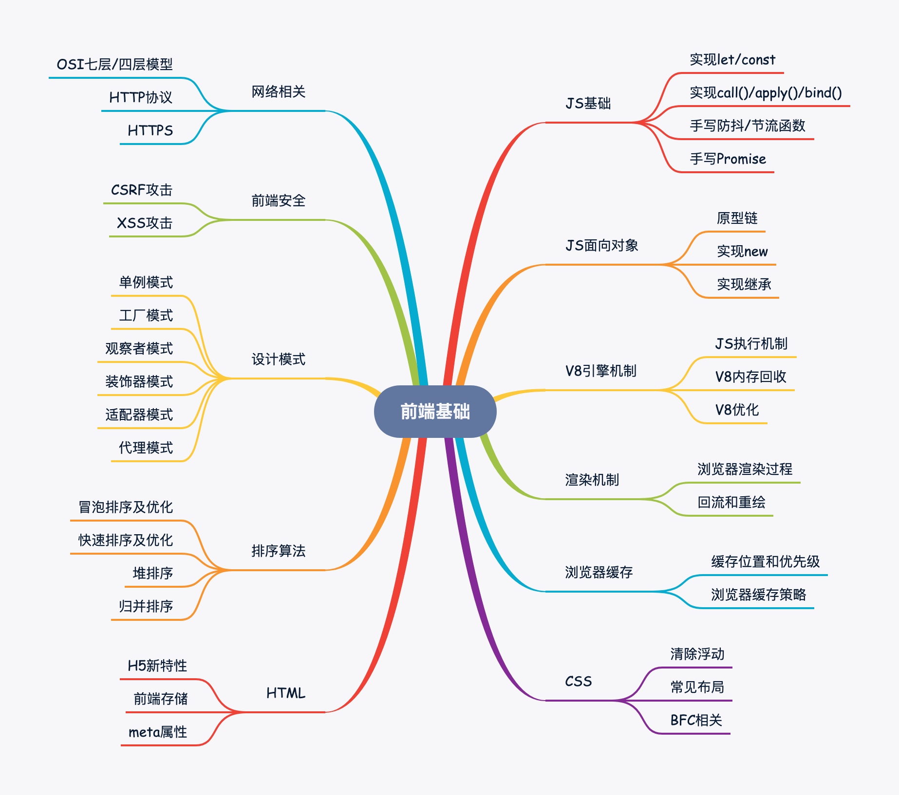

# V8引擎机制

## 1. V8如何执行一段JS代码

- **预解析**：检查语法错误但不生成AST

- **生成AST**：经过词法/语法分析，生成抽象语法树

- **生成字节码**：基线编译器(Ignition)将AST转换成字节码

- **生成机器码**：优化编译器(Turbofan)将字节码转换成优化过的机器码，此外在逐行执行字节码的过程中，如果一段代码经常被执行，那么V8会将这段代码直接转换成机器码保存起来，下一次执行就不必经过字节码，优化了执行速度

## 2. 介绍一下引用计数和标记清除

**引用计数**：给一个变量赋值引用类型，则该对象的引用次数+1，如果这个变量变成了其他值，那么该对象的引用次数-1，垃圾回收器会回收引用次数为0的对象。但是当对象循环引用时，会导致引用次数永远无法归零，造成内存无法释放。

**标记清除**：垃圾收集器先给内存中所有对象加上标记，然后从根节点开始遍历，去掉被引用的对象和运行环境中对象的标记，剩下的被标记的对象就是无法访问的等待回收的对象。

## 3. V8如何进行垃圾回收

JS引擎中对变量的存储主要有两种位置，栈内存和堆内存，栈内存存储基本类型数据以及引用类型数据的内存地址，堆内存储存引用类型的数据


栈内存的回收：栈内存调用栈上下文切换后就被回收，比较简单

堆内存的回收：V8的堆内存分为新生代内存和老生代内存，新生代内存是临时分配的内存，存在时间短，老生代内存存在时间长

新生代内存回收机制：

- 新生代内存容量小，64位系统下仅有32M。新生代内存分为**From、To**两部分，进行垃圾回收时，先扫描From，将非存活对象回收，将存活对象顺序复制到To中，之后调换From/To，等待下一次回收

老生代内存回收机制

- **晋升**：如果新生代的变量经过多次回收依然存在，那么就会被放入老生代内存中
- **标记清除**：老生代内存会先遍历所有对象并打上标记，然后对正在使用或被强引用的对象取消标记，回收被标记的对象
- **整理内存碎片**：把对象挪到内存的一端

## 4. JS相较于C++等语言为什么慢，V8做了哪些优化

JS的问题：

- **动态类型**：导致每次存取属性/寻求方法时候，都需要先检查类型；此外动态类型也很难在编译阶段进行优化
- **属性存取**：C++/Java等语言中方法、属性是存储在数组中的，仅需数组位移就可以获取，而JS存储在对象中，每次获取都要进行哈希查询

V8的优化：

- **优化JIT(即时编译)**：相较于C++/Java这类编译型语言，JS一边解释一边执行，效率低。V8对这个过程进行了优化：如果一段代码被执行多次，那么V8会把这段代码转化为机器码缓存下来，下次运行时直接使用机器码。
- **隐藏类**：对于C++这类语言来说，仅需几个指令就能通过偏移量获取变量信息，而JS需要进行字符串匹配，效率低，V8借用了类和偏移位置的思想，将对象划分成不同的组，即隐藏类
- **内嵌缓存**：即缓存对象查询的结果。常规查询过程是：获取隐藏类地址 -> 根据属性名查找偏移值 -> 计算该属性地址，内嵌缓存就是对这一过程结果的缓存
- **垃圾回收管理**：上文已介绍


# 浏览器渲染机制

## 1. 浏览器的渲染过程是怎样的


大体流程如下：

1. HTML和CSS经过各自解析，生成DOM树和CSSOM树
2. 合并成为渲染树
3. 根据渲染树进行布局
4. 最后调用GPU进行绘制，显示在屏幕上

## 2. 如何根据浏览器渲染机制加快首屏速度

**优化文件大小**：HTML和CSS的加载和解析都会阻塞渲染树的生成，从而影响首屏展示速度，因此我们可以通过优化文件大小、减少CSS文件层级的方法来加快首屏速度

**避免资源下载阻塞文档解析**：浏览器解析到`<script>`标签时，会阻塞文档解析，直到脚本执行完成，因此我们通常把`<script>`标签放在底部，或者加上`defer、async`来进行异步下载

## 3. 什么是回流(重排)，什么情况下会触发回流

回流：当元素的尺寸或者位置发生了变化，就需要重新计算渲染树。

DOM元素的几何属性(`width/height/padding/margin/border`)发生变化时会触发回流

DOM元素移动或增加会触发回流

读写`offset/scroll/client`等属性时会触发回流

调用`window.getComputedStyle`会触发回流

## 4. 什么是重绘，什么情况下会触发重绘

DOM样式发生了变化，但没有影响DOM的几何属性时，会触发重绘，而不会触发回流。重绘由于DOM位置信息不需要更新，省去了布局过程，因而性能上优于回流

## 5. 什么是GPU加速，如何使用GPU加速，GPU加速的缺点

- **优点**：使用transform、opacity、filters等属性时，会直接在GPU中完成处理，这些属性的变化不会引起回流重绘
- **缺点**：GPU渲染字体会导致字体模糊，过多的GPU处理会导致内存问题

## 6. 如何减少回流

- 使用`class`替代`style`，减少style的使用

- 使用`resize、scroll`时进行防抖和节流处理，这两者会直接导致回流

- 使用`visibility`替换`display: none`，因为前者只会引起重绘，后者会引发回流

- 批量修改元素时，可以先让元素脱离文档流，等修改完毕后，再放入文档流

- 避免触发同步布局事件，我们在获取`offsetWidth`这类属性的值时，可以使用变量将查询结果存起来，避免多次查询，每次对`offset/scroll/client`等属性进行查询时都会触发回流

- 对于复杂动画效果,使用绝对定位让其脱离文档流，复杂的动画效果会频繁地触发回流重绘，我们可以将动画元素设置绝对定位从而脱离文档流避免反复回流重绘。


# 浏览器缓存策略

## 1. 介绍一下浏览器缓存位置和优先级

1. Service Worker
2. Memory Cache（内存缓存）
3. Disk Cache（硬盘缓存）
4. Push Cache（推送缓存）
5. 以上缓存都没命中就会进行网络请求

## 2. 说说不同缓存间的差别

1. Service Worker

和Web Worker类似，是独立的线程，我们可以在这个线程中缓存文件，在主线程需要的时候读取这里的文件，Service Worker使我们可以自由选择缓存哪些文件以及文件的匹配、读取规则，并且缓存是持续性的

2. Memory Cache

即内存缓存，内存缓存不是持续性的，缓存会随着进程释放而释放

3. Disk Cache

即硬盘缓存，相较于内存缓存，硬盘缓存的持续性和容量更优，它会根据HTTP header的字段判断哪些资源需要缓存

4. Push Cache

即推送缓存，是HTTP/2的内容，目前应用较少

## 3. 介绍一下浏览器缓存策略

### 3.1强缓存(不要向服务器询问的缓存)

**设置Expires**

- 即过期时间，例如`「Expires: Thu, 26 Dec 2019 10:30:42 GMT」`表示缓存会在这个时间后失效，这个过期日期是绝对日期，如果修改了本地日期，或者本地日期与服务器日期不一致，那么将导致缓存过期时间错误。

**设置Cache-Control**

- HTTP/1.1新增字段，Cache-Control可以通过`max-age`字段来设置过期时间，例如`「Cache-Control:max-age=3600」`除此之外Cache-Control还能设置`private/no-cache`等多种字段

### 3.2协商缓存(需要向服务器询问缓存是否已经过期)

**Last-Modified**

- 即最后修改时间，浏览器第一次请求资源时，服务器会在响应头上加上`Last-Modified` ，当浏览器再次请求该资源时，浏览器会在请求头中带上`If-Modified-Since` 字段，字段的值就是之前服务器返回的最后修改时间，服务器对比这两个时间，若相同则返回304，否则返回新资源，并更新Last-Modified

**ETag**

- HTTP/1.1新增字段，表示文件唯一标识，只要文件内容改动，ETag就会重新计算。缓存流程和 Last-Modified 一样：服务器发送 ETag 字段 -> 浏览器再次请求时发送 If-None-Match -> 如果ETag值不匹配，说明文件已经改变，返回新资源并更新ETag，若匹配则返回304

> 两者对比

- ETag 比 Last-Modified 更准确：如果我们打开文件但并没有修改，Last-Modified 也会改变，并且 Last-Modified 的单位时间为一秒，如果一秒内修改完了文件，那么还是会命中缓存

- 如果什么缓存策略都没有设置，那么浏览器会取响应头中的 Date 减去 Last-Modified 值的 10% 作为缓存时间


# 网络相关

## 1. 讲讲网络OSI七层模型，TCP/IP和HTTP分别位于哪一层


| 模型       | 概述                                                   | 单位   |
| ---------- | ------------------------------------------------------ | ------ |
| 物理层     | 网络连接介质，如网线、光缆，数据在其中以比特为单位传输 | bit    |
| 数据链路层 | 数据链路层将比特封装成数据帧并传递                     | 帧     |
| 网络层     | 定义IP地址，定义路由功能，建立主机到主机的通信         | 数据包 |
| 传输层     | 负责将数据进行可靠或者不可靠传递，建立端口到端口的通信 | 数据段 |
| 会话层     | 控制应用程序之间会话能力，区分不同的进程               |        |
| 表示层     | 数据格式标识，基本压缩加密功能                         |        |
| 应用层     | 各种应用软件                                           |        |

## 2. 常见HTTP状态码有哪些

> 2xx 开头（请求成功）

`200 OK`：客户端发送给服务器的请求被正常处理并返回

> 3xx 开头（重定向）

`301 Moved Permanently`：永久重定向，请求的网页已永久移动到新位置。 服务器返回此响应时，会自动将请求者转到新位置

`302 Moved Permanently`：临时重定向，请求的网页已临时移动到新位置。服务器目前从不同位置的网页响应请求，但请求者应继续使用原有位置来进行以后的请求

`304 Not Modified`：未修改，自从上次请求后，请求的网页未修改过。服务器返回此响应时，不会返回网页内容>

> 4xx 开头（客户端错误）

`400 Bad Request`：错误请求，服务器不理解请求的语法，常见于客户端传参错误

`401 Unauthorized`：未授权，表示发送的请求需要有通过 HTTP 认证的认证信息，常见于客户端未登录

`403 Forbidden`：禁止，服务器拒绝请求，常见于客户端权限不足

`404 Not Found`：未找到，服务器找不到对应资源

> 5xx 开头（服务端错误）

`500 Inter Server Error`：服务器内部错误，服务器遇到错误，无法完成请求

`501 Not Implemented`：尚未实施，服务器不具备完成请求的功能

`502 Bad Gateway`：作为网关或者代理工作的服务器尝试执行请求时，从上游服务器接收到无效的响应。

`503 service unavailable`：服务不可用，服务器目前无法使用（处于超载或停机维护状态）。通常是暂时状态。

## 3. GET请求和POST请求有何区别

> 标准答案：

- GET请求参数放在URL上，POST请求参数放在请求体里
- GET请求参数长度有限制，POST请求参数长度可以非常大
- POST请求相较于GET请求安全一点点，因为GET请求的参数在URL上，且有历史记录
- GET请求能缓存，POST不能

> 更进一步：

其实HTTP协议并没有要求GET/POST请求参数必须放在URL上或请求体里，也没有规定GET请求的长度，目前对URL的长度限制，是各家浏览器设置的限制。GET和POST的根本区别在于：**GET请求是幂等性的，而POST请求不是**

>  幂等性，指的是对某一资源进行一次或多次请求都具有相同的副作用。例如搜索就是一个幂等的操作，而删除、新增则不是一个幂等操作。

由于GET请求是幂等的，在网络不好的环境中，GET请求可能会重复尝试，造成重复操作数据的风险，因此，GET请求用于无副作用的操作(如搜索)，新增/删除等操作适合用POST

## 4. HTTP的请求报文由哪几部分组成

一个HTTP请求报文由请求行（request line）、请求头（header）、空行和请求数据4个部分组成

## 5. HTTP常见请求/响应头及其含义

> 通用头（请求头和响应头都有的首部）

|       字段        | 作用                                   | 值                                                           |
| :---------------: | :------------------------------------- | ------------------------------------------------------------ |
|   Cache-Control   | 控制缓存                               | public：表示响应可以被任何对象缓存(包括客户端/代理服务器) private(默认值)：响应只能被单个客户缓存,不能被代理服务器缓存 no-cache：缓存要经过服务器验证，在浏览器使用缓存前，会对比ETag，若没变则返回304，使用缓存 no-store：禁止任何缓存 |
|    Connection     | 是否需要持久连接(HTTP 1.1默认持久连接) | keep-alive / close                                           |
| Transfer-Encoding | 报文主体的传输编码格式                 | chunked(分块) / identity(未压缩和修改) / gzip(LZ77压缩) / compress(LZW压缩,弃用) / deflate(zlib结构压缩) |

> 请求头

|        字段         | 作用                                                         | 语法                                                         |
| :-----------------: | :----------------------------------------------------------- | :----------------------------------------------------------- |
|       Accept        | 告知（服务器）客户端可以处理的内容类型                       | text/html、image/*、*/*                                      |
|  If-Modified-Since  | 将`Last-Modified`的值发送给服务器，询问资源是否已经过期(被修改)，过期则返回新资源，否则返回304 | 示例：If-Modified-Since: Wed, 21 Oct 2015 07:28:00 GMT       |
| If-Unmodified-Since | 将`Last-Modified`的值发送给服务器，询问文件是否被修改，若没有则返回200，否则返回412预处理错误，可用于断点续传。通俗点说`If-Unmodified-Since`是文件没有修改时下载，`If-Modified-Since`是文件修改时下载 | 示例：If-Unmodified-Since: Wed, 21 Oct 2015 07:28:00 GMT     |
|    If-None-Match    | 将`ETag`的值发送给服务器，询问资源是否已经过期(被修改)，过期则返回新资源，否则返回304 | 示例：If-None-Match: "bfc13a6472992d82d"                     |
|      If-Match       | 将`ETag`的值发送给服务器，询问文件是否被修改，若没有则返回200，否则返回412预处理错误，可用于断点续传 | 示例：If-Match: "bfc129c88ca92d82d"                          |
|        Range        | 告知服务器返回文件的哪一部分, 用于断点续传                   | 示例：Range: bytes=200-1000, 2000-6576, 19000-               |
|        Host         | 指明了服务器的域名（对于虚拟主机来说），以及（可选的）服务器监听的TCP端口号 | 示例：Host:www.baidu.com                                     |
|     User-Agent      | 告诉HTTP服务器， 客户端使用的操作系统和浏览器的名称和版本    | User-Agent: Mozilla/<version> (<system-information>) <platform> (<platform-details>) <extensions> |

> 响应头

|   字段   | 作用                                                         | 语法                 |
| :------: | :----------------------------------------------------------- | :------------------- |
| Location | 需要将页面重新定向至的地址。一般在响应码为3xx的响应中才会有意义 | Location: <url>      |
|   ETag   | 资源的特定版本的标识符，如果内容没有改变，Web服务器不需要发送完整的响应 | ETag: "<etag_value>" |
|  Server  | 处理请求的源头服务器所用到的软件相关信息                     | Server: <product>    |

> 实体头（针对请求报文和响应报文的实体部分使用首部）

|     字段      | 作用                                                         | 语法                                                         |
| :-----------: | :----------------------------------------------------------- | :----------------------------------------------------------- |
|     Allow     | 资源可支持http请求的方法                                     | Allow: <http-methods>，示例：Allow: GET, POST, HEAD          |
| Last-Modified | 资源最后的修改时间，用作一个验证器来判断接收到的或者存储的资源是否彼此一致，精度不如ETag | 示例：Last-Modified: Wed, 21 Oct 2020 07:28:00 GMT           |
|    Expires    | 响应过期时间                                                 | Expires: <http-date>，示例：Expires: Wed, 21 Oct 2020 07:28:00 GMT |

HTTP首部当然不止这么几个，但为了避免写太多大家记不住(主要是别的我也没去看)，这里只介绍了一些常用的，详细的可以看[MDN的文档](https://developer.mozilla.org/zh-CN/docs/Web/HTTP/Headers)

## 6. HTTP/1.0和HTTP/1.1有什么区别

**长连接：** HTTP/1.1支持长连接和请求的流水线，在一个TCP连接上可以传送多个HTTP请求，避免了因为多次建立TCP连接的时间消耗和延时

**缓存处理：** HTTP/1.1引入`Entity tag，If-Unmodified-Since, If-Match, If-None-Match`等新的请求头来控制缓存，详见浏览器缓存小节

**带宽优化及网络连接的使用：** HTTP1.1则在请求头引入了range头域，支持断点续传功能

**Host头处理：** 在HTTP/1.0中认为每台服务器都有唯一的IP地址，但随着虚拟主机技术的发展，多个主机共享一个IP地址愈发普遍，HTTP1.1的请求消息和响应消息都应支持Host头域，且请求消息中如果没有Host头域会400错误

## 7. 介绍一下HTTP/2.0新特性

**多路复用：** 即多个请求都通过一个TCP连接并发地完成

**服务端推送：** 服务端能够主动把资源推送给客户端

**新的二进制格式：** HTTP/2采用二进制格式传输数据，相比于HTTP/1.1的文本格式，二进制格式具有更好的解析性和拓展性

**header压缩：** HTTP/2压缩消息头，减少了传输数据的大小

## 8. 说说HTTP/2.0多路复用基本原理以及解决的问题

HTTP/2解决的问题，就是HTTP/1.1存在的问题：

- **TCP慢启动：** TCP连接建立后，会经历一个先慢后快的发送过程，就像汽车启动一般，如果我们的网页文件(HTML/JS/CSS/icon)都经过一次慢启动，对性能是不小的损耗。另外慢启动是TCP为了减少网络拥塞的一种策略，我们是没有办法改变的。
- **多条TCP连接竞争带宽：** 如果同时建立多条TCP连接，当带宽不足时就会竞争带宽，影响关键资源的下载。
- **HTTP/1.1队头阻塞：** 尽管HTTP/1.1长链接可以通过一个TCP连接传输多个请求，但同一时刻只能处理一个请求，当前请求未结束前，其他请求只能处于阻塞状态。

为了解决以上几个问题，**HTTP/2一个域名只使用一个TCP⻓连接来传输数据，而且请求直接是并行的、非阻塞的，这就是多路复用**

**实现原理：** HTTP/2引入了一个二进制分帧层，客户端和服务端进行传输时，数据会先经过二进制分帧层处理，转化为一个个带有请求ID的帧，这些帧在传输完成后根据ID组合成对应的数据。

## 9. 说说HTTP/3.0

尽管HTTP/2解决了很多1.1的问题，但HTTP/2仍然存在一些缺陷，这些缺陷并不是来自于HTTP/2协议本身，而是来源于底层的TCP协议，我们知道TCP链接是可靠的连接，如果出现了丢包，那么整个连接都要等待重传，HTTP/1.1可以同时使用6个TCP连接，一个阻塞另外五个还能工作，但HTTP/2只有一个TCP连接，阻塞的问题便被放大了。

由于TCP协议已经被广泛使用，我们很难直接修改TCP协议，基于此，HTTP/3选择了一个折衷的方法——UDP协议，HTTP/2在UDP的基础上实现多路复用、0-RTT、TLS加密、流量控制、丢包重传等功能。

## 10. HTTP和HTTPS有何区别

- HTTPS使用443端口，而HTTP使用80
- HTTPS需要申请证书
- HTTP是超文本传输协议，是明文传输；HTTPS是经过SSL加密的协议，传输更安全
- HTTPS比HTTP慢，因为HTTPS除了TCP握手的三个包，还要加上SSL握手的九个包

## 11. HTTPS是如何进行加密的

我们通过分析几种加密方式，层层递进，理解HTTPS的加密方式以及为什么使用这种加密方式：

> 对称加密

客户端和服务器公用一个密匙用来对消息加解密，这种方式称为对称加密。客户端和服务器约定好一个加密的密匙。客户端在发消息前用该密匙对消息加密，发送给服务器后，服务器再用该密匙进行解密拿到消息。


这种方式一定程度上保证了数据的安全性，但密钥一旦泄露(密钥在传输过程中被截获)，传输内容就会暴露，因此我们要寻找一种安全传递密钥的方法。

> 非对称加密

采用非对称加密时，客户端和服务端均拥有一个公钥和私钥，公钥加密的内容只有对应的私钥能解密。私钥自己留着，公钥发给对方。这样在发送消息前，先用对方的公钥对消息进行加密，收到后再用自己的私钥进行解密。这样攻击者只拿到传输过程中的公钥也无法破解传输的内容


尽管非对称加密解决了由于密钥被获取而导致传输内容泄露的问题，但中间人仍然可以用`篡改公钥`的方式来获取或篡改传输内容，而且非对称加密的性能比对称加密的性能差了不少


> 第三方认证

上面这种方法的弱点在于，客户端不知道公钥是由服务端返回，还是中间人返回的，因此我们再引入一个第三方认证的环节：即第三方使用私钥加密我们`自己的公钥`，浏览器已经内置一些权威第三方认证机构的公钥，浏览器会使用`第三方的公钥`来解开`第三方私钥加密过的我们自己的公钥`，从而获取公钥，如果能成功解密，就说明获取到的`自己的公钥`是正确的

但第三方认证也未能完全解决问题，第三方认证是面向所有人的，中间人也能申请证书，如果中间人使用自己的证书掉包原证书，客户端还是无法确认公钥的真伪


> 数字签名

为了让客户端能够验证公钥的来源，我们给公钥加上一个数字签名，这个数字签名是由企业、网站等各种信息和公钥经过单向hash而来，一旦构成数字签名的信息发生变化，hash值就会改变，这就构成了公钥来源的唯一标识。

具体来说，服务端本地生成一对密钥，然后拿着公钥以及企业、网站等各种信息到CA(第三方认证中心)去申请数字证书，CA会通过一种单向hash算法(比如MD5)，生成一串摘要，这串摘要就是这堆信息的唯一标识，然后CA还会使用自己的私钥对摘要进行加密，连同我们自己服务器的公钥一同发送给我我们。

浏览器拿到数字签名后，会使用**浏览器本地内置**的CA公钥解开数字证书并验证，从而拿到正确的公钥。由于非对称加密性能低下，拿到公钥以后，客户端会随机生成一个对称密钥，使用这个公钥加密并发送给服务端，服务端用自己的私钥解开对称密钥，此后的加密连接就通过这个对称密钥进行对称加密。

综上所述，HTTPS在验证阶段使用非对称加密+第三方认证+数字签名获取正确的公钥，获取到正确的公钥后以对称加密的方式通信


# 前端安全

## 什么是CSRF攻击

CSRF即Cross-site request forgery(跨站请求伪造)，是一种挟制用户在当前已登录的Web应用程序上执行非本意的操作的攻击方法。

假如黑客在自己的站点上放置了其他网站的外链，例如`"www.weibo.com/api`，默认情况下，浏览器会带着`weibo.com`的cookie访问这个网址，如果用户已登录过该网站且网站没有对CSRF攻击进行防御，那么服务器就会认为是用户本人在调用此接口并执行相关操作，致使账号被劫持。

## 如何防御CSRF攻击

- 验证`Token`：浏览器请求服务器时，服务器返回一个token，每个请求都需要同时带上token和cookie才会被认为是合法请求
- 验证`Referer`：通过验证请求头的Referer来验证来源站点，但请求头很容易伪造
- 设置`SameSite`：设置cookie的SameSite，可以让cookie不随跨域请求发出，但浏览器兼容不一

## 什么是XSS攻击

XSS即Cross Site Scripting（跨站脚本），指的是通过利用网页开发时留下的漏洞，注入恶意指令代码到网页，使用户加载并执行攻击者恶意制造的网页程序。常见的例如在评论区植入JS代码，用户进入评论页时代码被执行，造成页面被植入广告、账号信息被窃取

## XSS攻击有哪些类型

**存储型**：即攻击被存储在服务端，常见的是在评论区插入攻击脚本，如果脚本被储存到服务端，那么所有看见对应评论的用户都会受到攻击。

**反射型**：攻击者将脚本混在URL里，服务端接收到URL将恶意代码当做参数取出并拼接在HTML里返回，浏览器解析此HTML后即执行恶意代码

**DOM型**：将攻击脚本写在URL中，诱导用户点击该URL，如果URL被解析，那么攻击脚本就会被运行。和前两者的差别主要在于DOM型攻击不经过服务端

## 如何防御XSS攻击

- **输入检查**：对输入内容中的`<script><iframe>`等标签进行转义或者过滤
- **设置httpOnly**：很多XSS攻击目标都是窃取用户cookie伪造身份认证，设置此属性可防止JS获取cookie
- **开启CSP**，即开启白名单，可阻止白名单以外的资源加载和运行


# HTML相关

## 1. 说说HTML5在标签、属性、存储、API上的新特性

- 标签：新增语义化标签（`aside / figure / section / header / footer / nav`等），增加多媒体标签`video`和`audio`，使得样式和结构更加分离

- 属性：增强表单，主要是增强了`input`的type属性；`meta`增加charset以设置字符集；`script`增加async以异步加载脚本

- 存储：增加`localStorage`、`sessionStorage`和`indexedDB`，引入了`application cache`对web和应用进行缓存

- API：增加`拖放API`、`地理定位`、`SVG绘图`、`canvas绘图`、`Web Worker`、`WebSocket`

## 2. doctype的作用是什么？

声明文档类型，告知浏览器用什么文档标准解析这个文档：

- 怪异模式：浏览器使用自己的模式解析文档，不加doctype时默认为怪异模式
- 标准模式：浏览器以W3C的标准解析文档

## 3. 几种前端储存以及它们之间的区别

- **cookies**： HTML5之前本地储存的主要方式，大小只有4k，HTTP请求头会自动带上cookie，兼容性好
- **localStorage**：HTML5新特性，持久性存储，即使页面关闭也不会被清除，以键值对的方式存储，大小为5M
- **sessionStorage**：HTML5新特性，操作及大小同localStorage，和localStorage的区别在于sessionStorage在选项卡(页面)被关闭时即清除，且不同选项卡之间的sessionStorage不互通
- **IndexedDB**： NoSQL型数据库，类比MongoDB，使用键值对进行储存，异步操作数据库，支持事务，储存空间可以在250MB以上，但是IndexedDB受同源策略限制
- **Web SQL**：是在浏览器上模拟的关系型数据库，开发者可以通过SQL语句来操作Web SQL，是HTML5以外一套独立的规范，兼容性差

## 4. href和src有什么区别


```
href（hyperReference）`即超文本引用：当浏览器遇到href时，会并行的地下载资源，不会阻塞页面解析，例如我们使用`<link>`引入CSS，浏览器会并行地下载CSS而不阻塞页面解析. 因此我们在引入CSS时建议使用`<link>`而不是`@import
<link href="style.css" rel="stylesheet" />
```

`src（resource）`即资源，当浏览器遇到src时，会暂停页面解析，直到该资源下载或执行完毕，这也是script标签之所以放底部的原因

```js
<script src="script.js"></script>
```

## 5. meta有哪些属性，作用是什么

meta标签用于描述网页的`元信息`，如网站作者、描述、关键词，meta通过`name=xxx`和`content=xxx`的形式来定义信息，常用设置如下：

- charset：定义HTML文档的字符集

```html
 <meta charset="UTF-8" >
```

- http-equiv：可用于模拟http请求头，可设置过期时间、缓存、刷新

```html
＜meta http-equiv="expires" content="Wed, 20 Jun 2019 22:33:00 GMT"＞
```

- viewport：视口，用于控制页面宽高及缩放比例

```html
<meta 
    name="viewport" 
    content="width=device-width, initial-scale=1, maximum-scale=1"
>
```

## 6. viewport有哪些参数，作用是什么

- width/height，宽高，默认宽度980px
- initial-scale，初始缩放比例，1~10
- maximum-scale/minimum-scale，允许用户缩放的最大/小比例
- user-scalable，用户是否可以缩放 (yes/no)

## 7. http-equive属性的作用和参数

- expires，指定过期时间

- progma，设置no-cache可以禁止缓存

- refresh，定时刷新

- set-cookie，可以设置cookie

- X-UA-Compatible，使用浏览器版本

- apple-mobile-web-app-status-bar-style，针对WebApp全屏模式，隐藏状态栏/设置状态栏颜色


# CSS相关

## 清除浮动的方法

为什么要清除浮动：清除浮动是为了解决子元素浮动而导致父元素高度塌陷的问题


**1.添加新元素**

```html
<div class="parent">
  <div class="child"></div>
  <!-- 添加一个空元素，利用css提供的clear:both清除浮动 -->
  <div style="clear: both"></div>
</div>  
```

**2.使用伪元素**

```css
/* 对父元素添加伪元素 */
.parent::after{
  content: "";
  display: block;
  height: 0;
  clear:both;
}
```

**3.触发父元素BFC**

```css
/* 触发父元素BFC */
.parent {
  overflow: hidden;
  /* float: left; */
  /* position: absolute; */
  /* display: inline-block */
  /* 以上属性均可触发BFC */
}
```

## 什么是BFC

BFC全称 Block Formatting Context 即`块级格式上下文`，简单的说，BFC是页面上的一个隔离的独立容器，不受外界干扰或干扰外界

## 如何触发BFC

- `float`不为 none
- `overflow`的值不为 visible
- `position` 为 absolute 或 fixed
- `display`的值为 inline-block 或 table-cell 或 table-caption 或 grid

## BFC的渲染规则是什么

- BFC是页面上的一个隔离的独立容器，不受外界干扰或干扰外界
- 计算BFC的高度时，浮动子元素也参与计算（即内部有浮动元素时也不会发生高度塌陷）
- BFC的区域不会与float的元素区域重叠
- BFC内部的元素会在垂直方向上放置
- BFC内部两个相邻元素的margin会发生重叠

## BFC的应用场景

- **清除浮动**：BFC内部的浮动元素会参与高度计算，因此可用于清除浮动，防止高度塌陷
- **避免某元素被浮动元素覆盖**：BFC的区域不会与浮动元素的区域重叠
- **阻止外边距重叠**：属于同一个BFC的两个相邻Box的margin会发生折叠，不同BFC不会发生折叠

