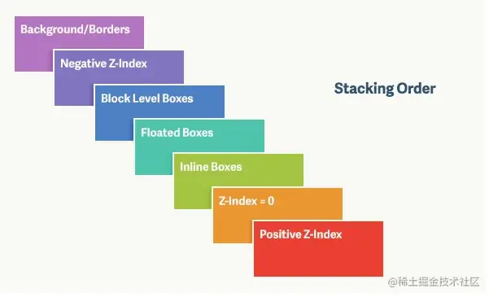
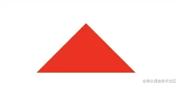
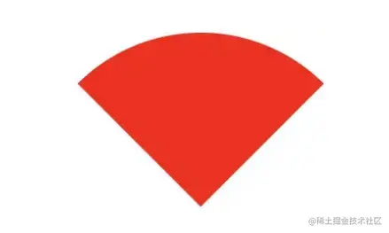

## 1. CSS选择器及其优先级

| **选择器**     | **格式**      | **优先级权重** |
| -------------- | ------------- | -------------- |
| id选择器       | #id           | 100            |
| 类选择器       | #classname    | 10             |
| 属性选择器     | a[ref=“eee”]  | 10             |
| 伪类选择器     | li:last-child | 10             |
| 标签选择器     | div           | 1              |
| 伪元素选择器   | li:after      | 1              |
| 相邻兄弟选择器 | h1+p          | 0              |
| 子选择器       | ul>li         | 0              |
| 后代选择器     | li a          | 0              |
| 通配符选择器   | *             | 0              |

对于选择器的**优先级**：

- 标签选择器、伪元素选择器：1
- 类选择器、伪类选择器、属性选择器：10
- id 选择器：100
- 内联样式：1000

**注意事项：**

- !important声明的样式的优先级最高；
- 如果优先级相同，则最后出现的样式生效；
- 继承得到的样式的优先级最低；
- 通用选择器（*）、子选择器（>）和相邻同胞选择器（+）并不在这四个等级中，所以它们的权值都为 0 ；
- 样式表的来源不同时，优先级顺序为：内联样式 > 内部样式 > 外部样式 > 浏览器用户自定义样式 > 浏览器默认样式。

## 2. CSS中可继承与不可继承属性有哪些

**无继承性的属性：**

**1.display**：规定元素应该生成的框的类型

**2.文本属性**：

- vertical-align：垂直文本对齐
- text-decoration：规定添加到文本的装饰
- text-shadow：文本阴影效果
- white-space：空白符的处理
- unicode-bidi：设置文本的方向

**3.盒子模型的属性**：width、height、margin、border、padding

**4.背景属性**：background、background-color、background-image、background-repeat、background-position、background-attachment

**5.定位属性**：float、clear、position、top、right、bottom、left、min-width、min-height、max-width、max-height、overflow、clip、z-index

**6.生成内容属性**：content、counter-reset、counter-increment

**7.轮廓样式属性**：outline-style、outline-width、outline-color、outline

**8.页面样式属性**：size、page-break-before、page-break-after

**9.声音样式属性**：pause-before、pause-after、pause、cue-before、cue-after、cue、play-during

**可以继承的属性：**

**1.字体系列属性**

- font-family：字体系列
- font-weight：字体的粗细
- font-size：字体的大小
- font-style：字体的风格

**2.文本系列属性**

- text-indent：文本缩进
- text-align：文本水平对齐
- line-height：行高
- word-spacing：单词之间的间距
- letter-spacing：中文或者字母之间的间距
- text-transform：控制文本大小写（就是uppercase、lowercase、capitalize这三个）
- color：文本颜色

**3.元素可见性**

- visibility：控制元素显示隐藏

**4.列表布局属性**

- list-style：列表风格，包括list-style-type、list-style-image等

**5.光标属性**

- cursor：光标显示为何种形态

## 3. display的属性值及其作用

| **属性值**   | **作用**                                                   |
| ------------ | ---------------------------------------------------------- |
| none         | 元素不显示，并且会从文档流中移除。                         |
| block        | 块类型。默认宽度为父元素宽度，可设置宽高，换行显示。       |
| inline       | 行内元素类型。默认宽度为内容宽度，不可设置宽高，同行显示。 |
| inline-block | 默认宽度为内容宽度，可以设置宽高，同行显示。               |
| list-item    | 像块类型元素一样显示，并添加样式列表标记。                 |
| table        | 此元素会作为块级表格来显示。                               |
| inherit      | 规定应该从父元素继承display属性的值。                      |

## 4. display的block、inline和inline-block的区别

（1）**block：** 会独占一行，多个元素会另起一行，可以设置width、height、margin和padding属性；

（2）**inline：** 元素不会独占一行，设置width、height属性无效。但可以设置水平方向的margin和padding属性，不能设置垂直方向的padding和margin；

（3）**inline-block：** 将对象设置为inline对象，但对象的内容作为block对象呈现，之后的内联对象会被排列在同一行内。

## 5. 行内元素和块级元素的区别

**1）行内元素**

- 设置宽高无效；
- 可以设置水平方向的margin和padding属性，不能设置垂直方向的padding和margin；
- 不会自动换行；

**（2）块级元素**

- 可以设置宽高；
- 设置margin和padding都有效；
- 可以自动换行；
- 多个块状，默认排列从上到下。

## 6. 隐藏元素的方法有哪些

**display: none**：渲染树不会包含该渲染对象，因此该元素不会在页面中占据位置，也不会响应绑定的监听事件。

**visibility: hidden**：元素在页面中仍占据空间，但是不会响应绑定的监听事件。

**opacity: 0**：将元素的透明度设置为 0，以此来实现元素的隐藏。元素在页面中仍然占据空间，并且能够响应元素绑定的监听事件。

**position: absolute**：通过使用绝对定位将元素移除可视区域内，以此来实现元素的隐藏。

**z-index: 负值**：来使其他元素遮盖住该元素，以此来实现隐藏。

**clip/clip-path** ：使用元素裁剪的方法来实现元素的隐藏，这种方法下，元素仍在页面中占据位置，但是不会响应绑定的监听事件。

**transform: scale(0,0)** ：将元素缩放为 0，来实现元素的隐藏。这种方法下，元素仍在页面中占据位置，但是不会响应绑定的监听事件。

## 7. link和@import的区别

两者都是外部引用CSS的方式，它们的区别如下：

- link是XHTML标签，除了加载CSS外，还可以定义RSS等其他事务；@import属于CSS范畴，只能加载CSS。
- link引用CSS时，在页面载入时同时加载；@import需要页面网页完全载入以后加载。
- link是XHTML标签，无兼容问题；@import是在CSS2.1提出的，低版本的浏览器不支持。
- link支持使用Javascript控制DOM去改变样式；而@import不支持。

## 8. transition和animation的区别

**transition是过度属性**，强调过度，它的实现需要触发一个事件（比如鼠标移动上去，焦点，点击等）才执行动画。它类似于flash的补间动画，设置一个开始关键帧，一个结束关键帧。

**animation是动画属性**，它的实现不需要触发事件，设定好时间之后可以自己执行，且可以循环一个动画。它也类似于flash的补间动画，但是它可以设置多个关键帧（用@keyframe定义）完成动画。

## 9. **伪元素和伪类的区别和作用？**

- 伪元素：在内容元素的前后插入额外的元素或样式，但是这些元素实际上并不在文档中生成。它们只在外部显示可见，但不会在文档的源代码中找到它们，因此，称为“伪”元素。例如：

```css
p::before {content:"第一章：";}
p::after {content:"Hot!";}
p::first-line {background:red;}
p::first-letter {font-size:30px;}
```

- 伪类：将特殊的效果添加到特定选择器上。它是已有元素上添加类别的，不会产生新的元素。例如：

```css
a:hover {color: #FF00FF}
p:first-child {color: red}
```

**总结：** 伪类是通过在元素选择器上加⼊伪类改变元素状态，⽽伪元素通过对元素的操作进⾏对元素的改变。

## 10. 对盒模型的理解(标准盒模型、IE盒模型)

盒模型都是由四个部分组成的，分别是margin、border、padding和content。

标准盒模型和IE盒模型的区别在于设置width和height时，所对应的范围不同：

- 标准盒模型的width和height属性的范围只包含了content，
- IE盒模型的width和height属性的范围包含了border、padding和content。

可以通过修改元素的box-sizing属性来改变元素的盒模型：

- `box-sizeing: content-box`表示标准盒模型（默认值）
- `box-sizeing: border-box`表示IE盒模型（怪异盒模型）

## 11. 为什么有时候⽤**translate**来改变位置⽽不是定位？

translate 是 transform 属性的⼀个值。改变transform或opacity**不会触发浏览器重排**（reflow）或重绘（repaint），只会触发复合（compositions）。⽽改变**绝对定位会触发重排**，进⽽触发重绘和复合。

transform使浏览器为元素创建⼀个 GPU 图层，但改变绝对定位会使⽤到 CPU。 因此**translate()更⾼效**，可以缩短平滑动画的绘制时间。 ⽽translate改变位置时，元素依然会占据其原始空间，绝对定位就不会发⽣这种情况。

## 12. li 与 li 之间有看不见的空白间隔是什么原因引起的？如何解决？

浏览器会把inline内联元素间的空白字符（空格、换行、Tab等）渲染成一个空格。为了美观，通常是一个`<li>`放在一行，这导致`<li>`换行后产生换行字符，它变成一个空格，占用了一个字符的宽度。

解决办法：**

（1）为`<li>`设置float:left。缺点：有些容器是不能设置浮动，如左右切换的焦点图等。

（2）将所有`<li>`写在同一行。缺点：代码不美观。

（3）将`<ul>`内的字符尺寸直接设为0，即font-size:0。缺点：`<ul>`中的其他字符尺寸也被设为0，需要额外重新设定其他字符尺寸，且在Safari浏览器依然会出现空白间隔。

（4）消除`<ul>`的字符间隔letter-spacing:-8px。缺点：这也设置了`<li>`内的字符间隔，因此需要将`<li>`内的字符间隔设为默认letter-spacing:normal。

## 13. CSS3中有哪些新特性

- 新增各种CSS选择器 （: not(.input)：所有 class 不是“input”的节点）
- 圆角 （border-radius:8px）
- 多列布局 （multi-column layout）
- 阴影和反射 （Shadoweflect）
- 文字特效 （text-shadow）
- 文字渲染 （Text-decoration）
- 线性渐变 （gradient）
- 旋转 （transform）
- 增加了旋转,缩放,定位,倾斜,动画,多背景

## 14. 常见的图片格式及使用场景

**1. BMP**，是无损的、既支持索引色也支持直接色的点阵图。这种图片格式几乎没有对数据进行压缩，所以BMP格式的图片通常是较大的文件。

**2. GIF**，是无损的、采用索引色的点阵图。采用LZW压缩算法进行编码。文件小，是GIF格式的优点，同时，GIF格式还具有支持动画以及透明的优点。但是GIF格式仅支持8bit的索引色，所以GIF格式适用于对色彩要求不高同时需要文件体积较小的场景。

**3. JPG（JPEG）** ，是有损的、采用直接色的点阵图。JPEG的图片的优点是采用了直接色，得益于更丰富的色彩，JPEG非常适合用来存储照片，与GIF相比，JPEG不适合用来存储企业Logo、线框类的图。因为有损压缩会导致图片模糊，而直接色的选用，又会导致图片文件较GIF更大。

**4.PNG-8**，是无损的、使用索引色的点阵图。PNG是一种比较新的图片格式，PNG-8是非常好的GIF格式替代者，在可能的情况下，应该尽可能的使用PNG-8而不是GIF，因为在相同的图片效果下，PNG-8具有更小的文件体积。除此之外，PNG-8还支持透明度的调节，而GIF并不支持。除非需要动画的支持，否则没有理由使用GIF而不是PNG-8。

**5. PNG-24**，是无损的、使用直接色的点阵图。PNG-24的优点在于它压缩了图片的数据，使得同样效果的图片，PNG-24格式的文件大小要比BMP小得多。当然，PNG24的图片还是要比JPEG、GIF、PNG-8大得多。

**6. SVG**，是无损的矢量图。SVG是矢量图意味着SVG图片由直线和曲线以及绘制它们的方法组成。当放大SVG图片时，看到的还是线和曲线，而不会出现像素点。SVG图片在放大时，不会失真，所以它适合用来绘制Logo、Icon等。

**7. WebP**，是谷歌开发的一种新图片格式，WebP是同时支持有损和无损压缩

## 15. 对 CSSSprites (精灵图)的理解

CSSSprites（精灵图），将一个页面涉及到的所有图片都包含到一张大图中去，然后利用CSS的 background-image，background-repeat，background-position属性的组合进行背景定位。

**优点：**

- 利用`CSS Sprites`能很好地减少网页的http请求，从而大大提高了页面的性能，这是`CSS Sprites`最大的优点；
- `CSS Sprites`能减少图片的字节，把3张图片合并成1张图片的字节总是小于这3张图片的字节总和。

**缺点：**

- 在图片合并时，要把多张图片有序的、合理的合并成一张图片，还要留好足够的空间，防止板块内出现不必要的背景。在宽屏及高分辨率下的自适应页面，如果背景不够宽，很容易出现背景断裂；
- `CSSSprites`在开发的时候相对来说有点麻烦，需要借助`photoshop`或其他工具来对每个背景单元测量其准确的位置。
- 维护方面：`CSS Sprites`在维护的时候比较麻烦，页面背景有少许改动时，就要改这张合并的图片，无需改的地方尽量不要动，这样避免改动更多的`CSS`，如果在原来的地方放不下，又只能（最好）往下加图片，这样图片的字节就增加了，还要改动`CSS`。

## 16. 对**line-height 的理解及其赋值方式**

**（1）line-height的概念：**

- line-height 指一行文本的高度，包含了字间距，实际上是下一行基线到上一行基线距离；
- 如果一个标签没有定义 height 属性，那么其最终表现的高度由 line-height 决定；
- 一个容器没有设置高度，那么撑开容器高度的是 line-height，而不是容器内的文本内容；
- 把 line-height 值设置为 height 一样大小的值可以实现单行文字的垂直居中；
- line-height 和 height 都能撑开一个高度；

**（2）line-height 的赋值方式：**

- 带单位：px 是固定值，而 em 会参考父元素 font-size 值计算自身的行高
- 纯数字：会把比例传递给后代。例如，父级行高为 1.5，子元素字体为 18px，则子元素行高为 1.5 * 18 = 27px
- 百分比：将计算后的值传递给后代

## 17. CSS 优化和提高性能的方法有哪些？

**加载性能：**

（1）css压缩：将写好的css进行打包压缩，可以减小文件体积。

（2）css单一样式：当需要下边距和左边距的时候，很多时候会选择使用 margin:top 0 bottom 0；但margin-bottom:bottom;margin-left:left;执行效率会更高。

（3）减少使用@import，建议使用link，因为后者在页面加载时一起加载，前者是等待页面加载完成之后再进行加载。

**选择器性能：**

（1）关键选择器（key selector）。选择器的最后面的部分为关键选择器（即用来匹配目标元素的部分）。CSS选择符是从右到左进行匹配的。当使用后代选择器的时候，浏览器会遍历所有子元素来确定是否是指定的元素等等；

（2）如果规则拥有ID选择器作为其关键选择器，则不要为规则增加标签。过滤掉无关的规则（这样样式系统就不会浪费时间去匹配它们了）。

（3）避免使用通配规则，如*{}计算次数惊人，只对需要用到的元素进行选择。

（4）尽量少的去对标签进行选择，而是用class。

###### 最高不要超过三层

（5）尽量少的去使用后代选择器，降低选择器的权重值。后代选择器的开销是最高的，尽量将选择器的深度降到最低，最高不要超过三层，更多的使用类来关联每一个标签元素。

（6）了解哪些属性是可以通过继承而来的，然后避免对这些属性重复指定规则。

**渲染性能：**

（1）慎重使用高性能属性：浮动、定位。

（2）尽量减少页面重排、重绘。

（3）去除空规则：｛｝。空规则的产生原因一般来说是为了预留样式。去除这些空规则无疑能减少css文档体积。

（4）属性值为0时，不加单位。

（5）属性值为浮动小数0.**，可以省略小数点之前的0。

（6）标准化各种浏览器前缀：带浏览器前缀的在前。标准属性在后。

（7）不使用@import前缀，它会影响css的加载速度。

（8）选择器优化嵌套，尽量避免层级过深。

（9）css雪碧图，同一页面相近部分的小图标，方便使用，减少页面的请求次数，但是同时图片本身会变大，使用时，优劣考虑清楚，再使用。

（10）正确使用display的属性，由于display的作用，某些样式组合会无效，徒增样式体积的同时也影响解析性能。

（11）不滥用web字体。对于中文网站来说WebFonts可能很陌生，国外却很流行。web fonts通常体积庞大，而且一些浏览器在下载web fonts时会阻塞页面渲染损伤性能。

**可维护性、健壮性：**

（1）将具有相同属性的样式抽离出来，整合并通过class在页面中进行使用，提高css的可维护性。

（2）样式与内容分离：将css代码定义到外部css中。

## 18. 后处理器(**postCss**)是什么？

**后处理器，** 如： `postCss`，通常是在完成的样式表中根据`css`规范处理`css`，让其更加有效。目前最常做的是给`css`属性添加浏览器私有前缀，实现跨浏览器兼容性的问题。

## 19. ::before 和 :after 的双冒号和单冒号有什么区别？

（1）冒号(`:`)用于`CSS3`伪类，双冒号(`::`)用于`CSS3`伪元素。

（2）`::before`就是以一个子元素的存在，定义在元素主体内容之前的一个伪元素。并不存在于`dom`之中，只存在在页面之中。

**注意：** `:before`和 `:after` 这两个伪元素，是在`CSS2.1`里新出现的。起初，伪元素的前缀使用的是单冒号语法，但随着`Web`的进化，在`CSS3`的规范里，伪元素的语法被修改成使用双冒号，成为`::before`、`::after`。

## 20. display :inline-block 什么时候会显示间隙？

- 有空格时会有间隙，可以删除空格解决；
- `margin`正值时，可以让`margin`使用负值解决；
- 使用`font-size`时，可通过设置`font-size:0`、`letter-spacing`、`word-spacing`解决；

## 21.怎么实现单行、多行文本溢出隐藏

- 单行文本溢出

```scss
overflow: hidden;            // 溢出隐藏
text-overflow: ellipsis;      // 溢出用省略号显示
white-space: nowrap;         // 规定段落中的文本不进行换行
```

- 多行文本溢出

```scss
overflow: hidden;            // 溢出隐藏
text-overflow: ellipsis;     // 溢出用省略号显示
display:-webkit-box;         // 作为弹性伸缩盒子模型显示。
-webkit-box-orient:vertical; // 设置伸缩盒子的子元素排列方式：从上到下垂直排列
-webkit-line-clamp:3;        // 显示的行数
```

注意：由于上面的三个属性都是 CSS3 的属性，没有浏览器可以兼容，所以要在前面加一个`-webkit-` 来兼容一部分浏览器。

## 22. CSS预处理器(sass、less)是什么？为什么要使用它们？

他们都是 CSS 预处理器，是 CSS 上的一种抽象层。他们是一种特殊的语法/语言编译成 CSS。 例如 Less 是一种动态样式语言，将 CSS 赋予了动态语言的特性，如变量，继承，运算， 函数，LESS 既可以在客户端上运行 (支持 IE 6+, Webkit, Firefox)，也可以在服务端运行 (借助 Node.js)。

**为什么要使用它们？**

- 结构清晰，便于扩展。 可以方便地屏蔽浏览器私有语法差异。封装对浏览器语法差异的重复处理， 减少无意义的机械劳动。
- 可以轻松实现多重继承。 完全兼容 CSS 代码，可以方便地应用到老项目中。LESS 只是在 CSS 语法上做了扩展，所以老的 CSS 代码也可以与 LESS 代码一同编译。

### less 和 sass 区别

1. Sass`(Syntactically Awesome Stylesheets)是一种`动态样式语言`，Sass语法属于缩排语法，比css比多出好些功能(如变量、嵌套、运算,混入(Mixin)、继承、颜色处理，函数等)，更容易阅读。

   Sass与Scss是什么关系?

   Sass的缩排语法，对于写惯css前端的web开发者来说很不直观，也不能将css代码加入到Sass里面，因此sass语法进行了改良，Sass 3就变成了Scss(sassy css)。与原来的语法兼容，只是用{}取代了原来的缩进。

2. `Less`也是一种`动态样式语言`. 对CSS赋予了动态语言的特性，如**变量**，**继承**，**运算**， **函数**. Less 既可以在**客户端**上运行 (支持IE 6+, Webkit, Firefox)，也可在**服务端**运行 (借助 Node.js)。

## 23. 说说对媒体查询的理解？（响应式适配）

**考察点: 响应式适配**, 根据不同的屏幕尺寸, 显示不同的效果 (设置盒子的样式)

媒体查询是自 CSS3 开始加入的一个功能。它可以进行响应式适配展示。

媒体查询由两部分组成：

- 一个可选的媒体类型（如 screen、print 等）
- 零个或多个媒体功能限定表达式（如 max-width: 500px、orientation: landscape 等）

这两部分最终都会被解析为 true 或 false 值，然后整个媒体查询值为 true，则和该媒体查询关联的样式就生效，否则就不生效。

简单来说，使用 @media 查询，**可以针对不同的媒体类型定义不同的样式**。@media **比如说可以针对不同的屏幕尺寸设置不同的样式**，特别是需要设置设计响应式的页面，@media 是非常有用的。当重置浏览器大小的过程中，页面也会根据浏览器的宽度和高度重新渲染页面。

**使用示例：**

```scss
/* 在css样式表的定义中直接使用媒体查询 */ 
.container {
  width: 600px;
  height: 200px;
  background-color: pink;
  margin: 0 auto;
}
@media screen and (max-width: 767px) {
  .container {
    width: 100%;
  }
}
@media screen and (min-width: 768px) and (max-width: 991px) {
  .container {
    width: 750px;
  }
}
@media screen and (min-width: 992px) and (max-width: 1199px) {
  .container {
    width: 980px;
  }
}
@media screen and (min-width: 1200px) {
  .container {
    width: 1170px;
  }
}
@media screen and (width: 1200px) {
  .container {
    background-color: skyblue;
  }
}
```

## 24. 说说对 CSS 工程化的理解

CSS 工程化是为了解决以下问题：

1. **宏观设计**：CSS 代码如何组织、如何拆分、模块结构怎样设计？
2. **编码优化**：怎样写出更好的 CSS？
3. **构建**：如何处理我的 CSS，才能让它的打包结果最优？
4. **可维护性**：代码写完了，如何最小化它后续的变更成本？如何确保任何一个同事都能轻松接手？

以下三个方向都是时下比较流行的、普适性非常好的 CSS 工程化实践：

- 预处理器：Less、 Sass 等；
- 重要的工程化插件： PostCss；
- Webpack loader 等 。

## 25. 如何判断元素是否到达可视区域

以图片显示为例：

- 内容达到显示区域的：`img.offsetTop < window.innerHeight + document.body.scrollTop;`

## 26. z-index属性在什么情况下会失效

通常 z-index 的使用是在有两个重叠的标签，在一定的情况下控制其中一个在另一个的上方或者下方出现。z-index值越大就越是在上层。z-index元素的position属性需要是relative，absolute或是fixed。

z-index属性在下列情况下会失效：

- 父元素position为relative时，子元素的z-index失效。解决：父元素position改为absolute或static；
- 元素没有设置position属性为非static属性。解决：设置该元素的position属性为relative，absolute或是fixed中的一种；
- 元素在设置z-index的同时还设置了float浮动。解决：float去除，改为display：inline-block；

## 27. 说说常见的CSS布局单位

常用的布局单位包括像素（`px`），百分比（`%`），`em`，`rem`，`vw/vh`。

**（1）像素**（`px`）是页面布局的基础，一个像素表示终端（电脑、手机、平板等）屏幕所能显示的最小的区域，像素分为两种类型：CSS像素和物理像素：

- **CSS像素**：为web开发者提供，在CSS中使用的一个抽象单位；
- **物理像素**：只与设备的硬件密度有关，任何设备的物理像素都是固定的。

**（2）百分比**（`%`），当浏览器的宽度或者高度发生变化时，通过百分比单位可以使得浏览器中的组件的宽和高随着浏览器的变化而变化，从而实现响应式的效果。一般认为子元素的百分比相对于直接父元素。

**（3）em和rem**相对于px更具灵活性，它们都是相对长度单位，它们之间的区别：**em相对于父元素，rem相对于根元素。**

**（4）vw/vh**是与视图窗口有关的单位，vw表示相对于视图窗口的宽度，vh表示相对于视图窗口高度，除了vw和vh外，还有vmin和vmax两个相关的单位。

## 28. px、em、rem的区别及使用场景

**三者的区别：**

- px是固定的像素，一旦设置了就无法因为适应页面大小而改变。
- em和rem相对于px更具有灵活性，他们是相对长度单位，其长度不是固定的，更适用于响应式布局。
- em是相对于其父元素来设置字体大小，这样就会存在一个问题，进行任何元素设置，都有可能需要知道他父元素的大小。而rem是相对于根元素，这样就意味着，只需要在根元素确定一个参考值。

**使用场景：**

- 对于只需要适配少部分移动设备，且分辨率对页面影响不大的，使用px即可 。
- 对于需要适配各种移动设备，使用rem，例如需要适配iPhone和iPad等分辨率差别比较挺大的设备。

## 29.常见的布局方法有哪些？他们的优缺点是什么？

页面布局常用的方法有浮动、定位、flex、grid网格布局、栅格系统布局

浮动：

- 优点：兼容性好。
- 缺点：浮动会脱离标准文档流，因此要清除浮动。我们解决好这个问题即可。

绝对定位

- 优点：快捷。
- 缺点：导致子元素也脱离了标准文档流，可实用性差。

flex 布局（CSS3中出现的）

- 优点：解决上面两个方法的不足，flex布局比较完美。移动端基本用 flex布局。

网格布局（grid）

- CSS3中引入的布局，很好用。代码量简化了很多。

栅格系统布局

优点：可以适用于多端设备

## 29. 怎么实现两栏布局

一般两栏布局指的是**左边一栏宽度固定，右边一栏宽度自适应**，两栏布局的具体实现：

- 利用浮动，将左边元素宽度设置为200px，并且设置向左浮动。将右边元素的margin-left设置为200px，宽度设置为auto（默认为auto，撑满整个父元素）。

```css
.outer {
  height: 100px;
}
.left {
  float: left;
  width: 200px;
  background: tomato;
}
.right {
  margin-left: 200px;
  width: auto;
  background: gold;
}
```

- 利用flex布局，将左边元素设置为固定宽度200px，将右边的元素设置为flex:1。

```css
.outer {
  display: flex;
  height: 100px;
}
.left {
  width: 200px;
  background: tomato;
}
.right {
  flex: 1;
  background: gold;
}
```

## 30. 怎么实现三栏布局

三栏布局一般指的是页面中一共有三栏，**左右两栏宽度固定，中间自适应的布局**，三栏布局的具体实现：

- 利用**绝对定位**，左右两栏设置为绝对定位，中间设置对应方向大小的margin的值。

```css
.outer {
  position: relative;
  height: 100px;
}

.left {
  position: absolute;
  width: 100px;
  height: 100px;
  background: tomato;
}

.right {
  position: absolute;
  top: 0;
  right: 0;
  width: 200px;
  height: 100px;
  background: gold;
}

.center {
  margin-left: 100px;
  margin-right: 200px;
  height: 100px;
  background: lightgreen;
}
```

- 利用flex布局，左右两栏设置固定大小，中间一栏设置为flex:1。

```css
.outer {
  display: flex;
  height: 100px;
}

.left {
  width: 100px;
  background: tomato;
}

.right {
  width: 100px;
  background: gold;
}

.center {
  flex: 1;
  background: lightgreen;
}
```

### 如何实现双飞翼（圣杯）布局？

1、利用`定位`实现两侧固定中间自适应

1.1）父盒子设置左右 padding 值

1.2）给左右盒子的 width 设置父盒子的 padding 值,然后分别定位到 padding 处.

1.3）中间盒子自适应

2、利用 `flex 布局`实现两侧固定中间自适应

2.1）父盒子设置 display:flex;

2.2）左右盒子设置固定宽高

2.3）中间盒子设置 flex:1 ;

3、利用 `bfc 块级格式化上下文`, 实现两侧固定中间自适应

3.1）左右固定宽高，进行浮动

3.2）中间 overflow: hidden;

## 31. 如何实现水平垂直居中

- 利用绝对定位，先将元素的左上角通过top:50%和left:50%定位到页面的中心，然后再通过translate来调整元素的中心点到页面的中心。该方法需要**考虑浏览器兼容问题。**

```css
.parent {   
    position: relative;
} 
.child {    
    position: absolute;    
    left: 50%;    top: 50%;    
    transform: translate(-50%,-50%);
}
```

- 利用绝对定位，设置四个方向的值都为0，并将margin设置为auto，由于宽高固定，因此对应方向实现平分，可以实现水平和垂直方向上的居中。该方法适用于**盒子有宽高**的情况：

```css
.parent {
    position: relative;
}
 
.child {
    position: absolute;
    top: 0;
    bottom: 0;
    left: 0;
    right: 0;
    margin: auto;
}
```

- 利用绝对定位，先将元素的左上角通过top:50%和left:50%定位到页面的中心，然后再通过margin负值来调整元素的中心点到页面的中心。该方法适用于**盒子宽高已知**的情况

```css
.parent {
    position: relative;
}
 
.child {
    position: absolute;
    top: 50%;
    left: 50%;
    margin-top: -50px;     /* 自身 height 的一半 */
    margin-left: -50px;    /* 自身 width 的一半 */
}
```

- 使用flex布局，通过align-items:center和justify-content:center设置容器的垂直和水平方向上为居中对齐，然后它的子元素也可以实现垂直和水平的居中。该方法要**考虑兼容的问题**，该方法在移动端用的较多：

```css
.parent {
    display: flex;
    justify-content:center;
    align-items:center;
}
```

## 32. 如何根据设计稿进行移动端适配？

移动端适配主要有两个维度：

- **适配不同像素密度，** 针对不同的像素密度，使用 CSS 媒体查询，选择不同精度的图片，以保证图片不会失真；
- **适配不同屏幕大小，** 由于不同的屏幕有着不同的逻辑像素大小，所以如果直接使用 px 作为开发单位，会使得开发的页面在某一款手机上可以准确显示，但是在另一款手机上就会失真。为了适配不同屏幕的大小，应按照比例来还原设计稿的内容。

为了能让页面的尺寸自适应，可以使用 rem，em，vw，vh 等相对单位。

## 33. 对Flex布局的理解

Flex是FlexibleBox的缩写，意为"弹性布局"，用来为盒状模型提供最大的灵活性。任何一个容器都可以指定为Flex布局。行内元素也可以使用Flex布局。

注意，设为Flex布局以后，**子元素的float、clear和vertical-align属性将失效**。采用Flex布局的元素，称为Flex容器（flex container），简称"容器"。它的所有子元素自动成为容器成员，称为Flex项目（flex item），简称"项目"。容器默认存在两根轴：水平的主轴（main axis）和垂直的交叉轴（cross axis），项目默认沿水平主轴排列。

### 33.2 用flex实现骰子布局

**一点**

```xml
<style>
  .warp {
    display: flex;
    /* 实现 一点 布局 */
    justify-content: center;
    align-items: center;
  }
</style>
```

**二点**

```xml
<body>
  <div class="warp">
    <div class="column"><div class="pip"></div></div>
    <div class="column"><div class="pip"></div></div>
  </div>
</body>

<style>
  .warp {
    display: flex;
    flex-direction: column;
    justify-content: space-between;
  }
  .column {
    display: flex;
  }
  .column:nth-child(2) {
    justify-content: flex-end;
  }
</style>
```

**三点**

```xml
<body>
  <div class="warp">
    <div class="column"><div class="pip"></div></div>
    <div class="column"><div class="pip"></div></div>
    <div class="column"><div class="pip"></div></div>
  </div>
</body>

<style>
  .warp {
    display: flex;
    flex-direction: column;
    justify-content: space-between;
  }
  .column {
    display: flex;
  }
  .column:nth-child(2) {
    justify-content: center;
  }
  .column:nth-child(3) {
    justify-content: flex-end;
  }
</style>
```

**四点**

```css
<body>
  <div class="warp">
    <div class="column">
      <div class="pip"></div>
      <div class="pip"></div>
    </div>
    <div class="column">
      <div class="pip"></div>
      <div class="pip"></div>
    </div>
  </div>
</body>

.warp {
  display: flex;
  flex-direction: column;
  justify-content: space-between;
}
.column {
  display: flex;
  justify-content: space-between;
}

```

**五点**

```css
<body>
  <div class="warp">
    <div class="column">
      <div class="pip"></div>
      <div class="pip"></div>
    </div>
    <div class="column">
      <div class="pip"></div>
    </div>
    <div class="column">
      <div class="pip"></div>
      <div class="pip"></div>
    </div>
  </div>
</body>

.warp {
  display: flex;
  flex-direction: column;
  justify-content: space-between;
}
.column {
  display: flex;
  justify-content: space-between;
}
.column:nth-child(2) {
  justify-content: center;
}

```

**六点**

```ini
<body>
  <div class="warp">
    <div class="column">
      <div class="pip"></div>
      <div class="pip"></div>
    </div>
    <div class="column">
      <div class="pip"></div>
      <div class="pip"></div>
    </div>
    <div class="column">
      <div class="pip"></div>
      <div class="pip"></div>
    </div>
  </div>
</body>

.warp {
  display: flex;
  flex-direction: column;
  justify-content: space-between;
}
.column {
  display: flex;
  justify-content: space-around;
}

```

## 34. 响应式设计的概念及基本原理

响应式网站设计`（Responsive Web design`）是一个网站能够兼容多个终端，而不是为每一个终端做一个特定的版本。

关于原理： 基本原理是通过媒体查询`（@media）`查询检测不同的设备屏幕尺寸做处理。 关于兼容： 页面头部必须有mate声明的`viewport`。

```ini
<meta name="’viewport’" content="”width=device-width," initial-scale="1." maximum-scale="1,user-scalable=no”"/>
复制代码
```

## 35. 浮动

### **浮动的定义**

非IE浏览器下，容器不设高度且子元素浮动时，容器高度不能被内容撑开。 此时，内容会溢出到容器外面而影响布局。这种现象被称为浮动（溢出）。

### **浮动的工作原理：**

- 浮动元素脱离文档流，不占据空间（引起“高度塌陷”现象）
- 浮动元素碰到包含它的边框或者其他浮动元素的边框停留

浮动元素可以左右移动，直到遇到另一个浮动元素或者遇到它外边缘的包含框。浮动框不属于文档流中的普通流，当元素浮动之后，不会影响块级元素的布局，只会影响内联元素布局。此时文档流中的普通流就会表现得该浮动框不存在一样的布局模式。当包含框的高度小于浮动框的时候，此时就会出现“高度塌陷”。

### **浮动元素引起的问题？**

- 父元素的高度无法被撑开，影响与父元素同级的元素
- 与浮动元素同级的非浮动元素会跟随其后
- 若浮动的元素不是第一个元素，则该元素之前的元素也要浮动，否则会影响页面的显示结构

### **清除浮动的方式：**

- 给父级div定义`height`属性
- 最后一个浮动元素之后添加一个空的div标签，并添加`clear:both`样式
- 包含浮动元素的父级标签添加`overflow:hidden`或者`overflow:auto`
- 使用 :after 伪元素。
- 使用clear属性清除浮动

## 36. 说说对BFC的理解

**BFC**: 块格式化上下文（Block Formatting Context，BFC）是Web页面的可视化CSS渲染的一部分，是布局过程中生成块级盒子的区域，也是浮动元素与其他元素的交互限定区域。

通俗来讲：BFC是一个独立的布局环境，可以理解为一个容器，在这个容器中按照一定规则进行物品摆放，并且不会影响其它环境中的物品。如果一个元素符合触发BFC的条件，则BFC中的元素布局不受外部影响。

### **创建BFC的条件**:

- 根元素：body；
- 元素设置浮动：float 除 none 以外的值；
- 元素设置绝对定位：position (absolute、fixed)；
- display 值为：inline-block、table-cell、table-caption、flex等；
- overflow 值为：hidden、auto、scroll；

### **BFC的特点：**

- 垂直方向上，自上而下排列，和文档流的排列方式一致。
- 在BFC中上下相邻的两个容器的margin会重叠
- 计算BFC的高度时，需要计算浮动元素的高度
- BFC区域不会与浮动的容器发生重叠
- BFC是独立的容器，容器内部元素不会影响外部元素
- 每个元素的左margin值和容器的左border相接触

### **BFC的作用：**

- **解决margin的重叠问题**：由于BFC是一个独立的区域，内部的元素和外部的元素互不影响，将两个元素变为两个BFC，就解决了margin重叠的问题。
- **解决高度塌陷的问题**：在对子元素设置浮动后，父元素会发生高度塌陷，也就是父元素的高度变为0。解决这个问题，只需要把父元素变成一个BFC。常用的办法是给父元素设置`overflow:hidden`。
- **创建自适应两栏布局**：可以用来创建自适应两栏布局：左边的宽度固定，右边的宽度自适应。左侧设置`float:left`，右侧设置`overflow: hidden`。这样右边就触发了BFC，BFC的区域不会与浮动元素发生重叠，所以两侧就不会发生重叠，实现了自适应两栏布局。

## 37. 什么是margin重叠问题？如何解决？

**问题描述：** 两个块级元素的上外边距和下外边距可能会合并（折叠）为一个外边距，其大小会取其中外边距值大的那个，这种行为就是外边距折叠。需要注意的是，**浮动的元素和绝对定位**这种脱离文档流的元素的外边距不会折叠。重叠只会出现在**垂直方向**。

**计算原则：** 折叠合并后外边距的计算原则如下：

- 如果两者都是正数，那么就去最大者
- 如果是一正一负，就会正值减去负值的绝对值
- 两个都是负值时，用0减去两个中绝对值大的那个

**解决办法：** 对于折叠的情况，主要有两种：**兄弟之间重叠**和**父子之间重叠**

**（1）兄弟之间重叠**

- 底部元素变为行内盒子：`display: inline-block`
- 底部元素设置浮动：`float`
- 底部元素的position的值为`absolute/fixed`

**（2）父子之间重叠**

- 父元素加入：`overflow: hidden`
- 父元素添加透明边框：`border:1px solid transparent`
- 子元素变为行内盒子：`display: inline-block`
- 子元素加入浮动属性或定位

## 38. 说一说元素的层叠顺序

层叠顺序，英文称作 stacking order，表示元素发生层叠时有着特定的垂直显示顺序。下面是盒模型的层叠规则：



对于上图，由上到下分别是：

（1）背景和边框：建立当前层叠上下文元素的背景和边框。

（2）负的z-index：当前层叠上下文中，z-index属性值为负的元素。

（3）块级盒：文档流内非行内级非定位后代元素。

（4）浮动盒：非定位浮动元素。

（5）行内盒：文档流内行内级非定位后代元素。

（6）z-index:0：层叠级数为0的定位元素。

（7）正z-index：z-index属性值为正的定位元素。

**注意:** 当定位元素z-index:auto，生成盒在当前层叠上下文中的层级为 0，不会建立新的层叠上下文，除非是根元素。

## 39. position 的值有哪些，分别有哪些作用？

**静态定位**：`static` 默认值不脱离文档流，top，right，bottom，left 等属性不生效

**绝对定位**：`absolute` 绝对定位的关键是找对参照物，找到最近的一级带有带定位的父级元素进行位置移动如果找不到，那么相对于浏览器窗口进行定位

> 注：
>
> 设置了 position:absolute;属性后，元素会脱离正常文档流，不在占据空间；
>
> 左右 margin 为 auto 将会失效；
>
> 通过 left、top、bottom、right 来决定元素位置。

**相对定位**：`relative` 参照物：元素偏移前位置

> 注：
>
> 设置了相对定位，左右 margin 为 auto 仍然有效、并且不会脱离文档流。

**固定定位**：`fixed` 参照物：浏览器窗口；

> 注：
>
> 固定定位会脱离文档流；
>
> 当绝对定位和固定定位参照物都是浏览器窗口时的区别： 当出现滚动条时，固定定位的元素不会跟随滚动条滚动，绝对定位会跟随滚动条滚动

## 40. absolute与fixed共同点与不同点

**共同点：**

- 改变行内元素的呈现方式，将display置为inline-block
- 使元素脱离普通文档流，不再占据文档物理空间
- 覆盖非定位文档元素

**不同点：**

- absolute与fixed的根元素不同，absolute的根元素可以设置，fixed根元素是浏览器。
- 在有滚动条的页面中，absolute会跟着父元素进行移动，fixed固定在页面的具体位置。

## 41. **display、float、position的优先级关系**

（1）首先判断display属性是否为none，如果为none，则position和float属性的值不影响元素最后的表现。

（2）然后判断position的值是否为absolute或者fixed，如果是，则float属性失效，并且display的值应该被设置为table或者block，具体转换需要看初始转换值。

（3）如果position的值不为absolute或者fixed，则判断float属性的值是否为none，如果不是，则display的值则按上面的规则转换。注意，如果position的值为relative并且float属性的值存在，则relative相对于浮动后的最终位置定位。

（4）如果float的值为none，则判断元素是否为根元素，如果是根元素则display属性按照上面的规则转换，如果不是，则保持指定的display属性值不变。

总的来说，可以把它看作是一个类似优先级的机制，"position:absolute"和"position:fixed"优先级最高，有它存在的时候，浮动不起作用，'display'的值也需要调整；其次，元素的'float'特性的值不是"none"的时候或者它是根元素的时候，调整'display'的值；最后，非根元素，并且非浮动元素，并且非绝对定位的元素，'display'特性值同设置值。

## 42. 对 sticky 定位的理解

sticky 英文字面意思是粘贴，所以可以把它称之为粘性定位。语法：**position: sticky;** 基于用户的滚动位置来定位。

粘性定位的元素是依赖于用户的滚动，在 **position:relative** 与 **position:fixed** 定位之间切换。它的行为就像 **position:relative;** 而当页面滚动超出目标区域时，它的表现就像 **position:fixed;** ，它会固定在目标位置。

元素定位表现为在跨越特定阈值前为相对定位，之后为固定定位。这个特定阈值指的是 top, right, bottom 或 left 之一，换言之，指定 top, right, bottom 或 left 四个阈值其中之一，才可使粘性定位生效。否则其行为与相对定位相同。

## 43. 怎么实现一个三角形

宽高设为0，给边框设置宽度，然后给一个边框设置颜色，其余边框设置透明

```css
div {
    width: 0;
    height: 0;
    border: 100px solid transparent;
    border-bottom-color: red;
}
```




## 44. 实现一个扇形

用CSS实现扇形的思路和三角形基本一致，就是多了一个圆角的样式，实现一个90°的扇形：

```css
div{
    border: 100px solid transparent;
    width: 0;
    heigt: 0;
    border-radius: 100px;
    border-top-color: red;
}
```




## 45. 怎么画一条0.5px的线

- **采用transform: scale()的方式**，该方法用来定义元素的2D 缩放转换：

```css
transform: scale(0.5,0.5);
复制代码
```

## 46.移动端有哪些常见的问题，都是怎么解决的？

点击事件300MS延迟问题 解决方案：下载fastclick的包

**H5页面窗口自动调整到设备宽度，并禁止用户缩放页面**

```ini
<meta name="viewport" content="width=device-width,initial-scale=1.0,minimum-scale=1.0,maximum-scale=1.0,user-scalable=no"> 
```

**忽略Android平台中对邮箱地址的识别**

```ini
<meta name="format-detection" content="email=no"> 
```

**当网站添加到主屏幕快速启动方式，可隐藏地址栏，仅针对ios的safari**

```xml
<!-- ios7.0版本以后，safari上已看不到效果 -->

<meta name="apple-mobile-web-app-capable" content="yes">
```

## 47. 如何实现CSS 动画

CSS3动画可以不用鼠标触发,自动,反复的执行某些动画.

需要先定义动画然后再调用它.

定义动画的语法是: @keyframes 动画名称{from{}to{}}

调用动画的语法是: 动画名称 duration(动画时长) timing-function(速度曲线) delay(延迟时间) iteration-count(重复次数) direction(动画方向) fill-mode(执行完毕时状态)

其中,动画名称和动画时长必须赋值.

## 48. 如何定义使用 css 变量

定义变量可分多种情况： 1、**定义全局变量**

```css
:root {
  --borderColor: #ccc;
}
使用：
width:var(--borderColor);
```

2、**定义某元素下的变量**

```css
.look{
  --borderColor: #ccc;
}
```

3、**定义媒体查询下的变量**

```css
@media screen and (min-width: 1025px) { 
    :root { 
        --borderColor: #ccc;
　　 }
}
使用：
.has-border-table > tr > td {
  border-right: 1px solid var(--borderColor);
}
```

**less中定义变量**

```less
定义：
@bg-color : #d9d9d9;
使用：
.has-border-table > tr > td {
  border-right: 1px solid var(@bg-color);
}
```

**sass中定义变量**

```css
定义：
$bg-color : #d9d9d9;
使用：
.has-border-table > tr > td {
  border-right: 1px solid var($bg-color);
}
```

## 49.CSS怎么解决浏览器兼容问题

CSS3属性针对不同浏览器内核兼容写法:

-webkit- 针对webkit内核

-moz- 针对火狐内核

-ms- 针对IE内核

-o- 针对opera内核

## 50. 如何理解 z-index？

可以将它看做三维坐标系中的z轴方向上的图层层叠顺序。

元素默认的 z-index 为 0，可通过修改 z-index 来控制设置了postion 值的元素的图层位置。

可以将这种关系想象成一摞书本，通过 z-index 可以改变一本书在这摞书中的上下位置。

z-index的小坑, 如果父辈元素有定位, 且配置了z-index, 优先按照父辈元素的定位的z-index进行比较层级

## 51. margin-top 的百分比相对谁，例如 margin-top: 50% 是什么意思

**margin的百分比是相对于父元素的宽度**

## 52. 说一下 Less 你用过哪些特性（除了变量、嵌套、计算，再找几条）

（1）变量：使用`@`来定义变量，变量名自定义。

```less
// 定义变量
@color: #00f;
// 使用变量
h1 {
    color: @color;
}
```

字符串插值

```less
// 语法
@variable: "xxx";
将变量放入到{}中 
@{variable}
复制代码
// 使用
@url: "/images/";
div {
  width: 200px;
  height: 200px;
  background-image: url("@{url}1.jpg"); // 结果为/images/1.jpg
}
```

媒体查询定义变量的方式

```less
// 由于“~”后面的值是不被编译的，所以可以用作媒体查询的参数。
@mediaQuery: ~"(max-width: 600px)";

@media screen and @mediaQuery {
  div {
    width: 200px;
    height: 200px;
    background-color: #898900;
  }
}
```

（2）嵌套

Less提供了使用嵌套代替层叠或与层叠结合使用的能力。使用Less书写可以模仿HTML的组织结构。

（3）计算

（4）命名空间

定义一个命名空间，可以使用任何的类/ID选择器，作为命名空间，**此时命名空间的性质类似于函数**。

这里定义了一个命名空间（例如：.my()），使其在编译之后的文件中不输出。可以在这个命名空间中书写混合。使用命名空间中的混合，类似于后代选择器（`>` 或 ``）一样选择指定的选择器进行使用。

## 53. 列举 5 个以上的 H5 input 元素 type 属性值？

| 值       | 描述                                                         |
| -------- | ------------------------------------------------------------ |
| text     | 默认。定义单行输入字段，用户可在其中输入文本。默认是 20 个字符 |
| password | 定义密码字段。字段中的字符会被遮蔽                           |
| radio    | 定义单选按钮                                                 |
| checkbox | 定义复选框                                                   |
| submit   | 定义提交按钮。提交按钮向服务器发送数据                       |
| button   | 定义可点击的按钮（大多与 JavaScript 使用来启动脚本）         |
| email    | 定义用于 e-mail 地址的文本字段                               |
| search   | 定义用于搜索的文本字段                                       |
| file     | 定义输入字段和 "浏览..." 按钮，供文件上传                    |
| hidden   | 定义隐藏输入字段                                             |
| image    | 定义图像作为提交按钮                                         |
| url      | 定义用于 URL 的文本字段                                      |
| number   | 定义带有 spinner 控件的数字字段                              |
| color    | 定义拾色器                                                   |
| date     | 定义日期字段（带有 calendar 控件）                           |
| month    | 定义日期字段的月（带有 calendar 控件）                       |
| time     | 定义日期字段的时、分、秒（带有 time 控件）                   |

## 54. rem 适配方法如何计算 HTML 根字号及适配方案？

**通用方案**

1. 使用媒体查询，根据不同设备按比例设置html文字大小，然后页面元素使用rem作为尺寸单位，当html大小改变时，元素也会发生改变，从而达到等比缩放的适配

2. ①页面元素的rem值 = 页面元素值（px） / （屏幕宽度 / 划分的份数） ②屏幕宽度/划分的份数就是 html font-size(根字号) 的大小

   以750的尺寸为例，把屏幕划分为15等份，那么html根字号的大小就是750/15=50px。rem就是元素的px/根子号。100px的宽度就等于100/50=2rem

优：有一定适用性，换算也较为简单

劣：有兼容性的坑，对不同手机适配不是非常精准；需要设置多个媒体查询来适应不同 手机，单某款手机尺寸不在设置范围之内，会导致无法适配

**网易方案**

1. 拿到设计稿除以 100，得到宽度 rem 值
2. 通过给 html 的 style 设置 font-size，把 1 里面得到的宽度 rem 值代入 x document.documentElement.style.fontSize = document.documentElement.clientWidth / x + ‘px’;
3. 设计稿 px/100 即可换算为 rem

优：通过动态根 font-size 来做适配，基本无兼容性问题，适配较为精准，换算简便

劣：无 viewport 缩放，且针对 iPhone 的 Retina 屏没有做适配，导致对一些手机的适配不是很到位

**手淘方案**

1. 拿到设计稿除以 10，得到 font-size 基准值
2. 引入 flexible
3. 不要设置 meta 的 viewport 缩放值
4. 设计稿 px/ font-size 基准值，即可换算为 rem

优：通过动态根 font-size、viewport、dpr 来做适配，无兼容性问题，适配精准。

劣：需要根据设计稿进行基准值换算，在不使用 sublime text 编辑器插件开发时， 单位计算复杂

## 55. Bootstrap 栅格系统的工作原理？

**原理:**

1、行（row）必须包含在 .container (固定宽度)或 .container-fluid (100%宽度)中，以便为其赋予合适的排列（aligment）和内补（padding）

2、通过行（row）在水平方向创建一组列（column）

3、自己内容应当放置于列（column）内，并且只有列可以作为行（row）的直接子元素

4、类似.row 和.col-xs-4 这种预定义的类，可以用来快速创建栅格布局。Bootstrap 源码 中定义的 mixin 也可以用来创建语义化布局

5、通过为列设置 padding 属性，从而创建列与列之间的间隔（gutter）。通过为.row 元 素设置负值 margin 从而抵消为.container 元素设置的 padding，也就间接为行（row） 所包含的列（column）抵消掉了 padding

6、栅格系统的列是通过指定 1 到 12 的值来表示其跨越范围。例如三个等宽的列可以使用 三个.col-xs-4 来创建

7、如果一行（row）中包含了的列（column）大于 12，多余的列所在的元素将作为一个 整体另起一行排列

8、栅格类适用于与屏幕宽度大于或等于分界点大小的设备，并且针对小屏幕覆盖栅格类

## 56.使用 CSS 怎么让 Chrome 支持小于 12px 的文字比如 10px？

针对谷歌浏览器内核，加 webkit 前缀，用 transform:scale()这个属性进行缩放。

```xml
  <style>
    p span {
      font-size: 10px;
      -webkit-transform: scale(0.8);
      display: block;
    }
  </style>
<body>
  <p>
    <span>使用 CSS 怎么让 Chrome 支持小于 12px 的文字</span>
  </p>
</body>
```

## 57. 浏览器是如何解析CSS选择器的？

在生成渲染树的过程中，渲染引擎会根据选择器提供的信息来遍历 DOM 树，找到对应的 DOM 节点后将样式规则附加到上面。

浏览器遵循 “从右往左” 的规则来解析 CSS 选择器！

**从右往左：`span => h3 => .mod-nav`**

1. 先找到所有的 `span` 节点 ，然后基于每⼀个 `span` 再向上查找 `h3`

2. 由 `h3` 再向上查找 `.mod-nav` 的节点

3. 最后触及根元素 `html` 结束该分⽀遍历

   ...

从右向左的匹配规则, 只有第一次会遍历所有元素找节点, 而剩下的就是在看父辈祖辈是否满足选择器的条件, 匹配效率大大提升!

## 58. less和sass里的深度选择器是什么，怎么用？

在项目开发时，对于使用的一些组件库，例如`element-ui`，在有些时候会不符合`ui`的设计图，这时候我们就要修改一下组件的样式。

当 `<style>` 标签有 `scoped` 属性时，它的 `CSS` 只作用于当前组件中的元素。去除后则没有这种效果，不过这种方法可能会导致全局污染，不推荐。这个时候就需要用深度选择器了。

**less**: /deep/ **新版本语法**：:deep(类名)

**sass**：::deep


## 

## 

## 