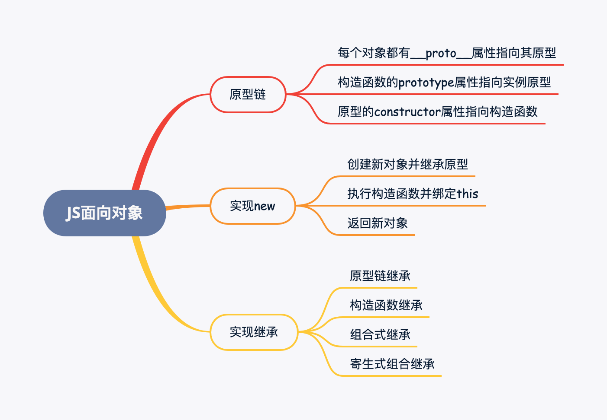
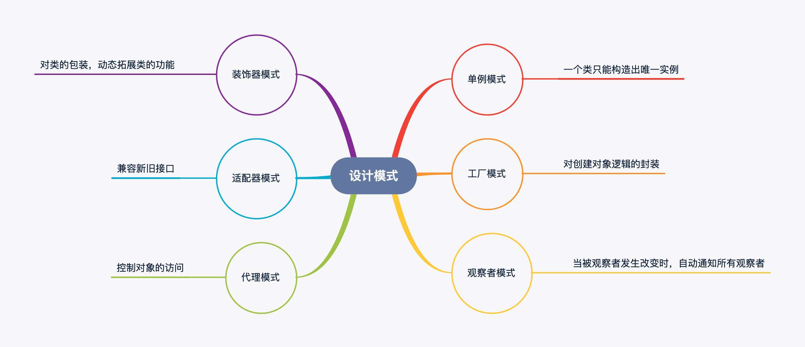
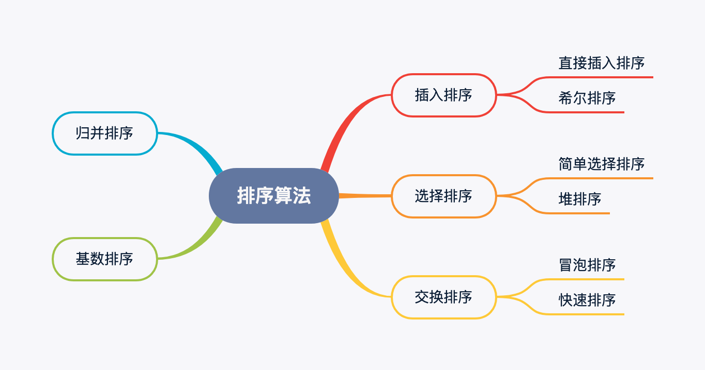
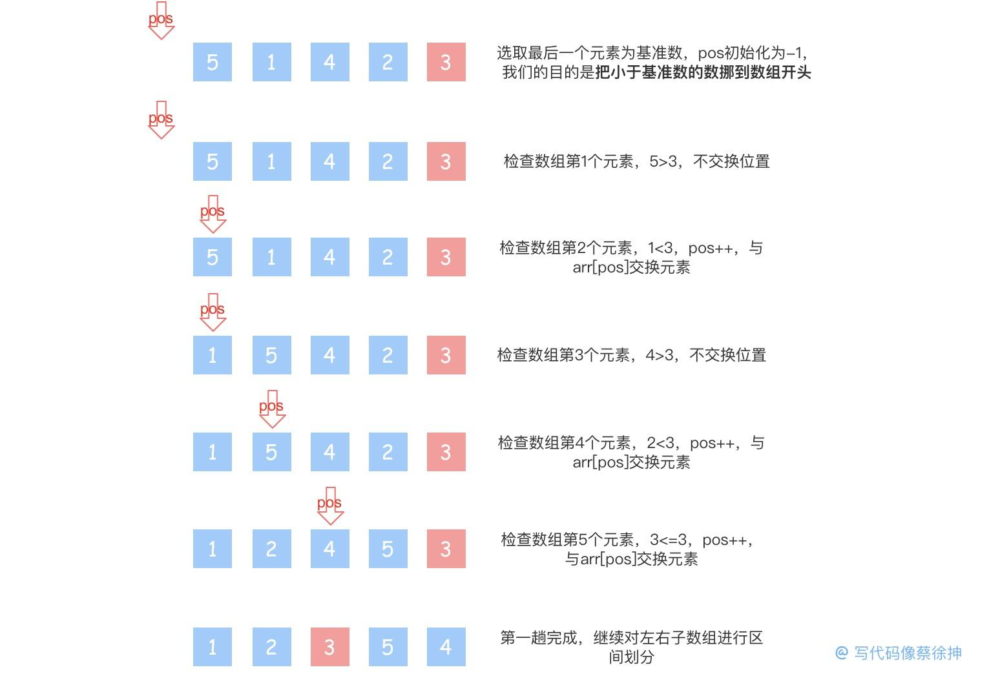
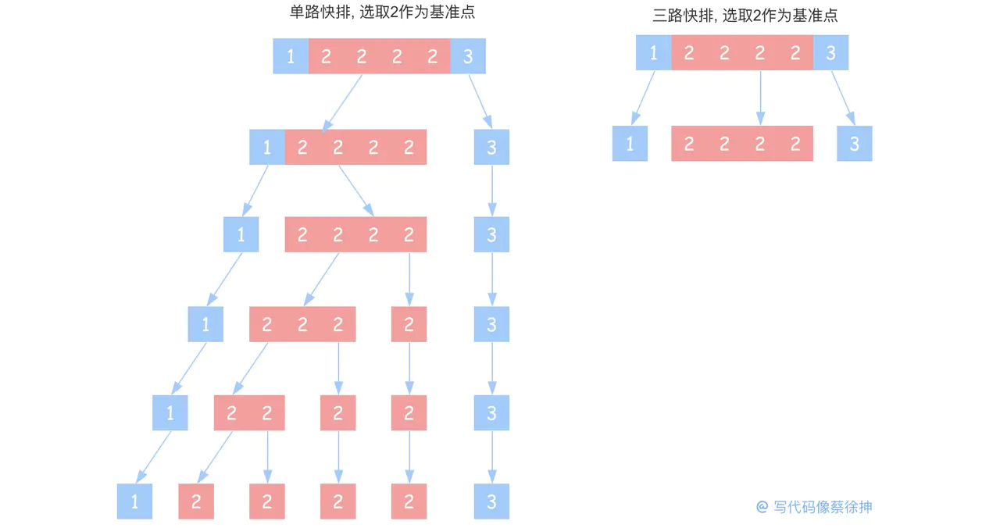
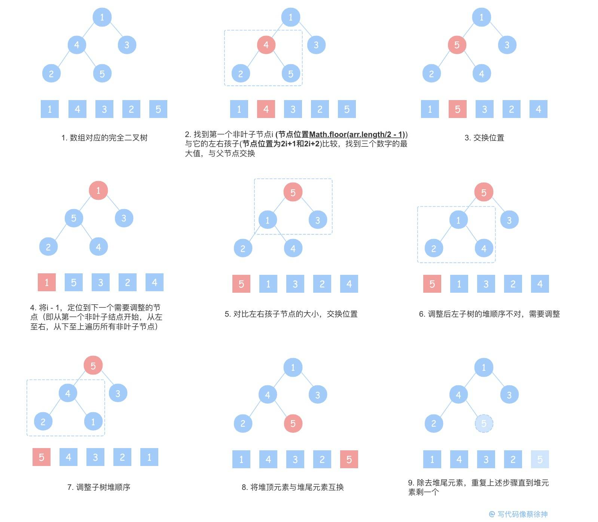

# 一、手写相关API

## 1. 如何在ES5环境下实现let

这个问题实质上是在回答`let`和`var`有什么区别，对于这个问题，我们可以直接查看`babel`转换前后的结果，看一下在循环中通过`let`定义的变量是如何解决变量提升的问题。


babel在`let`定义的变量前加了道下划线，避免在块级作用域外访问到该变量，除了对变量名的转换，我们也可以通过自执行函数来模拟块级作用域。

```js
(function(){
  for(var i = 0; i < 5; i ++){
    console.log(i)  // 0 1 2 3 4
  }
})();

console.log(i)      // Uncaught ReferenceError: i is not defined
```

不过这个问题并没有结束，我们回到`var`和`let/const`的区别上：

1. `var`声明的变量会挂到window上，而`let`和`const`不会。

2. `var`声明的变量存在变量提升，而`let`和`const`不会。

3. `let`和`const`声明形成块作用域，只能在块作用域里访问，不能跨块访问，也不能跨函数访问。

4. 同一作用域下`let`和`const`不能声明同名变量，而`var`可以。

5. 暂时性死区，`let`和`const`声明的变量不能在声明前被使用。

## 2. 如何在ES5环境下实现const

实现const的关键在于`Object.defineProperty()`这个API，这个API用于在一个对象上增加或修改属性。通过配置属性描述符，可以精确地控制属性行为。`Object.defineProperty()` 接收三个参数：

```js
Object.defineProperty(obj, prop, desc)
```

|    参数    |            说明            |
| :--------: | :------------------------: |
|    obj     |   要在其上定义属性的对象   |
|    prop    |  要定义或修改的属性的名称  |
| descriptor | 将被定义或修改的属性描述符 |

|  属性描述符  | 说明                                                         |  默认值   |
| :----------: | :----------------------------------------------------------- | :-------: |
|    value     | 该属性对应的值。可以是任何有效的 JavaScript 值（数值，对象，函数等）。默认为 undefined | undefined |
|     get      | 一个给属性提供 getter 的方法，如果没有 getter 则为 undefined | undefined |
|     set      | 一个给属性提供 setter 的方法，如果没有 setter 则为 undefined。当属性值修改时，触发执行该方法 | undefined |
|   writable   | 当且仅当该属性的writable为true时，value才能被赋值运算符改变。默认为 false |   false   |
|  enumerable  | enumerable定义了对象的属性是否可以在 for...in 循环和 Object.keys() 中被枚举 |   false   |
| Configurable | configurable特性表示对象的属性是否可以被删除，以及除value和writable特性外的其他特性是否可以被修改 |   false   |

对于const不可修改的特性，我们通过设置writable属性来实现

```js
function _const(key, value) {    
    const desc = {        
        value,        
        writable: false    
    }    
    Object.defineProperty(window, key, desc)
}
    
_const('obj', {a: 1})   //定义obj
obj.b = 2               //可以正常给obj的属性赋值
obj = {}                //无法赋值新对象
```

## 3. 手写call()

`call() 方法`使用一个指定的 this 值和单独给出的一个或多个参数来调用一个函数。

```js
function.call(thisArg, arg1, arg2, ...)
```

`call()`的原理比较简单，由于函数的this指向它的直接调用者，我们变更调用者即完成this指向的变更：

```js
// 变更函数调用者示例
function foo() {
    console.log(this.name)
}

// 测试
const obj = {
    name: '变更调用者'
}
obj.foo = foo   // 变更foo的调用者
obj.foo()       // '变更调用者'
```

基于以上原理, 我们两句代码就能实现call()

```js
Function.prototype.myCall = function(thisArg, ...args) {
    thisArg.fn = this              // this指向调用call的对象,即我们要改变this指向的函数
    return thisArg.fn(...args)     // 执行函数并return其执行结果
}
```

但是我们有一些细节需要处理：

```js
Function.prototype.myCall = function(thisArg, ...args) {
    const fn = Symbol('fn')        // 声明一个独有的Symbol属性, 防止fn覆盖已有属性
    thisArg = thisArg || window    // 若没有传入this, 默认绑定window对象
    thisArg[fn] = this              // this指向调用call的对象,即我们要改变this指向的函数
    const result = thisArg[fn](...args)  // 执行当前函数
    delete thisArg[fn]              // 删除我们声明的fn属性
    return result                  // 返回函数执行结果
}

//测试
foo.myCall(obj)     // 输出'写代码像蔡徐抻'
```

## 4. 手写apply()

`apply()` 方法调用一个具有给定this值的函数，以及作为一个数组（或类似数组对象）提供的参数。

```js
func.apply(thisArg, [argsArray])
```

`apply()`和`call()`类似，区别在于call()接收参数列表，而apply()接收一个参数数组，所以我们在call()的实现上简单改一下入参形式即可

```js
Function.prototype.myApply = function(thisArg, args) {
    const fn = Symbol('fn')        // 声明一个独有的Symbol属性, 防止fn覆盖已有属性
    thisArg = thisArg || window    // 若没有传入this, 默认绑定window对象
    thisArg[fn] = this              // this指向调用call的对象,即我们要改变this指向的函数
    const result = thisArg[fn](...args)  // 执行当前函数（此处说明一下：虽然apply()接收的是一个数组，但在调用原函数时，依然要展开参数数组。可以对照原生apply()，原函数接收到展开的参数数组）
    delete thisArg[fn]              // 删除我们声明的fn属性
    return result                  // 返回函数执行结果
}

//测试
foo.myApply(obj, [])     // 输出'写代码像蔡徐抻'
```

## 5. 手写bind()

`bind()` 方法创建一个新的函数，在 bind() 被调用时，这个新函数的 this 被指定为 bind() 的第一个参数，而其余参数将作为新函数的参数，供调用时使用。

```js
function.bind(thisArg, arg1, arg2, ...)
```

从用法上看，似乎给call/apply包一层function就实现了bind()：

```js
Function.prototype.myBind = function(thisArg, ...args) {
    return () => {
        this.apply(thisArg, args)
    }
}
```

但我们忽略了三点：

1. bind()除了this还接收其他参数，bind()返回的函数也接收参数，这两部分的参数都要传给返回的函数
2. new会改变this指向：如果bind绑定后的函数被new了，那么this指向会发生改变，指向当前函数的实例
3. 没有保留原函数在原型链上的属性和方法

```js
// @ts-ignore
Function.prototype.customBind = function (context: any, ...bindArgs: any[]) {
    // context 是 bind 传入的 this
    // bindArgs 是 bind 传入的各个参数

    const self = this // 当前的函数本身

    return function (...args: any[]) {
        // 拼接参数
        const newArgs = bindArgs.concat(args)
        return self.apply(context, newArgs)
    }
}

// // 功能测试
// function fn(this: any, a: any, b: any, c: any) {
//     console.info(this, a, b, c)
// }
// // @ts-ignore
// const fn1 = fn.customBind({x: 100}, 10)
// fn1(20, 30)
```

## 6. 手写一个防抖函数

防抖：即短时间内大量触发同一事件，只会执行一次函数。

> 实现原理：设置一个定时器，约定在xx毫秒后再触发事件处理，每次触发事件都会重新设置计时器，直到xx毫秒内无第二次操作。

防抖常用于搜索框/滚动条的监听事件处理，如果不做防抖，每输入一个字/滚动屏幕，都会触发事件处理，造成性能浪费。

```js
function debounce(func, wait) {
    let timeout = null
    return function() {
        let context = this
        let args = arguments
        if (timeout) clearTimeout(timeout)
        timeout = setTimeout(() => {
            func.apply(context, args)
        }, wait)
    }
}
```

## 7. 手写一个节流函数

防抖是`延迟执行`，而节流是`间隔执行`，函数节流即`每隔一段时间就执行一次`。

> 实现原理：设置一个定时器，约定xx毫秒后执行事件，如果时间到了，那么执行函数并重置定时器。

区别：防抖每次触发事件都重置定时器，而节流在定时器到时间后再清空定时器

```js
function throttle(func, wait) {
    let timeout = null
    return function() {
        let context = this
        let args = arguments
        if (!timeout) {
            timeout = setTimeout(() => {
                timeout = null
                func.apply(context, args)
            }, wait)
        }

    }
}
```

实现方式2：使用两个时间戳`prev旧时间戳`和`now新时间戳`，每次触发事件都判断二者的时间差，如果到达规定时间，执行函数并重置旧时间戳

```js
function throttle(func, wait) {
    var prev = 0;
    return function() {
        let now = Date.now();
        let context = this;
        let args = arguments;
        if (now - prev > wait) {
            func.apply(context, args);
            prev = now;
        }
    }
}
```

## 8. 数组扁平化

对于`[1, [1,2], [1,2,3]]`这样多层嵌套的数组，我们如何将其扁平化为`[1, 1, 2, 1, 2, 3]`这样的一维数组呢：

> 1. ES6的`flat()`

```js
const arr = [1, [1,2], [1,2,3]]
arr.flat(Infinity)  // [1, 1, 2, 1, 2, 3]
```

> 2. 序列化后正则

```js
const arr = [1, [1,2], [1,2,3]]
const str = `[${JSON.stringify(arr).replace(/(\[|\])/g, '')}]`
JSON.parse(str)   // [1, 1, 2, 1, 2, 3]
```

> 3. 递归：对于树状结构的数据，最直接的处理方式就是递归

```js
const arr = [1, [1,2], [1,2,3]]
function flat(arr) {
  let result = []
  for (const item of arr) {
    item instanceof Array ? result = result.concat(flat(item)) : result.push(item)
  }
  return result
}

flat(arr) // [1, 1, 2, 1, 2, 3]
```

> 4. `reduce()`递归

```js
const arr = [1, [1,2], [1,2,3]]
function flat(arr) {
  return arr.reduce((prev, cur) => {
    return prev.concat(cur instanceof Array ? flat(cur) : cur)
  }, [])
}

flat(arr)  // [1, 1, 2, 1, 2, 3]
```

> 5. 迭代+展开运算符

```js
// 每次while都会合并一层的元素，这里第一次合并结果为[1, 1, 2, 1, 2, 3, [4,4,4]]
// 然后arr.some判定数组中是否存在数组，因为存在[4,4,4]，继续进入第二次循环进行合并
let arr = [1, [1,2], [1,2,3,[4,4,4]]]
while (arr.some(Array.isArray)) {
  arr = [].concat(...arr);
}

console.log(arr)  // [1, 1, 2, 1, 2, 3, 4, 4, 4]
```

## 9. 手写一个Promise


## 10.模拟实现new

### 10.1 JS面向对象

在JS中一切皆对象，但JS并不是一种真正的面向对象(OOP)的语言，因为它缺少`类(class)`的概念。虽然ES6引入了`class`和`extends`，使我们能够轻易地实现类和继承。但JS并不存在真实的类，**JS的类是通过构造函数以及原型链机制模拟的**，本小节的就来探究如何在ES5环境下利用函数和原型链实现JS面向对象的特性。

在开始之前，我们先回顾一下原型链的知识，后续`new`和`继承`等实现都是基于原型链机制。很多介绍原型链的资料都能写上洋洋洒洒几千字，但我觉得读者们不需要把原型链想太复杂，容易把自己绕进去，其实在我看来，原型链的核心只需要记住三点：

1. 每个对象都有`__proto__属性`，该属性指向其原型对象，在调用实例的方法和属性时，如果在实例对象上找不到，就会往原型对象上找
2. 构造函数的`prototype属性`也指向实例的原型对象
3. 原型对象的`constructor属性`指向构造函数


### 10.2实现new

首先我们要知道`new`做了什么

1. 创建一个新对象，并继承其构造函数的`prototype`，这一步是为了继承构造函数原型上的属性和方法
2. 执行构造函数，方法内的`this`被指定为该新实例，这一步是为了执行构造函数内的赋值操作
3. 返回新实例（规范规定，如果构造方法返回了一个对象，那么返回该对象，否则返回第一步创建的新对象）

```js
// new是关键字,这里我们用函数来模拟,new Foo(args) <=> myNew(Foo, args)
function myNew(foo, ...args) {
  // 创建新对象,并继承构造方法的prototype属性, 这一步是为了把obj挂原型链上, 相当于obj.__proto__ = Foo.prototype
  let obj = Object.create(foo.prototype)  
  
  // 执行构造方法, 并为其绑定新this, 这一步是为了让构造方法能进行this.name = name之类的操作, args是构造方法的入参, 因为这里用myNew模拟, 所以入参从myNew传入
  let result = foo.apply(obj, args)

  // 如果构造方法已经return了一个对象，那么就返回该对象，否则返回myNew创建的新对象（一般情况下，构造方法不会返回新实例，但使用者可以选择返回新实例来覆盖new创建的对象）
  return Object.prototype.toString.call(result) === '[object Object]' ? result : obj
}

// 测试：
function Foo(name) {
  this.name = name
}
const newObj = myNew(Foo, 'zhangsan')
console.log(newObj)                 // Foo {name: "zhangsan"}
console.log(newObj instanceof Foo)  // true
```

## 11. ES5如何实现继承

说到继承，最容易想到的是ES6的`extends`，当然如果只回答这个肯定不合格，我们要从函数和原型链的角度上实现继承，下面我们一步步地、递进地实现一个合格的继承。

### 2.1. 原型链继承

原型链继承的原理很简单：==直接让子类的原型对象指向父类实例==。当子类实例找不到对应的属性和方法时，就会往它的原型对象，也就是父类实例上找，从而实现对父类的属性和方法的继承

```js
// 父类
function Parent() {
    this.name = '写代码像蔡徐抻'
}
// 父类的原型方法
Parent.prototype.getName = function() {
    return this.name
}
// 子类
function Child() {}

// 让子类的原型对象指向父类实例, 这样一来在Child实例中找不到的属性和方法就会到原型对象(父类实例)上寻找
Child.prototype = new Parent()
Child.prototype.constructor = Child // 根据原型链的规则,顺便绑定一下constructor, 这一步不影响继承, 只是在用到constructor时会需要

// 然后Child实例就能访问到父类及其原型上的name属性和getName()方法
const child = new Child()
child.name          // '写代码像蔡徐抻'
child.getName()     // '写代码像蔡徐抻'
```

原型继承的缺点:

1. 由于所有Child实例原型都指向同一个Parent实例, 因此对某个Child实例的父类引用类型变量修改会影响所有的Child实例
2. 在创建子类实例时无法向父类构造传参, 即没有实现`super()`的功能

```js
// 示例:
function Parent() {
    this.name = ['写代码像蔡徐抻'] 
}
Parent.prototype.getName = function() {
    return this.name
}
function Child() {}

Child.prototype = new Parent()
Child.prototype.constructor = Child 

// 测试
const child1 = new Child()
const child2 = new Child()
child1.name[0] = 'foo'
console.log(child1.name)          // ['foo']
console.log(child2.name)          // ['foo'] (预期是['写代码像蔡徐抻'], 对child1.name的修改引起了所有child实例的变化)
```

### 2.2. 构造函数继承

构造函数继承：==即在子类的构造函数中执行父类的构造函数，并为其绑定子类的`this`==。让父类的构造函数把成员属性和方法都挂到`子类的this`上去，这样既能避免实例之间共享一个原型实例，又能向父类构造方法传参

```js
function Parent(name) {
    this.name = [name]
}
Parent.prototype.getName = function() {
    return this.name
}
function Child() {
    Parent.call(this, 'zhangsan')   // 执行父类构造方法并绑定子类的this, 使得父类中的属性能够赋到子类的this上
}

//测试
const child1 = new Child()
const child2 = new Child()
child1.name[0] = 'foo'
console.log(child1.name)          // ['foo']
console.log(child2.name)          // ['zhangsan']
child2.getName()                  // 报错,找不到getName(), 构造函数继承的方式继承不到父类原型上的属性和方法
```

> 注意：构造函数继承的方式继承不到父类原型上的属性和方法。

### 2.3. 组合式继承

既然原型链继承和构造函数继承各有互补的优缺点, 那么我们为什么不组合起来使用呢, 所以就有了综合二者的组合式继承

```js
function Parent(name) {
    this.name = [name]
}
Parent.prototype.getName = function() {
    return this.name
}
function Child() {
    // 构造函数继承
    Parent.call(this, 'zhangsan') 
}
//原型链继承
Child.prototype = new Parent()
Child.prototype.constructor = Child

//测试
const child1 = new Child()
const child2 = new Child()
child1.name[0] = 'foo'
console.log(child1.name)          // ['foo']
console.log(child2.name)          // ['zhangsan']
child2.getName()                  // ['zhangsan']
```

> 组合式继承的缺点:
>
> 每次创建子类实例都执行了两次构造函数(`Parent.call()`和`new Parent()`)，虽然这并不影响对父类的继承，但子类创建实例时，原型中会存在两份相同的属性和方法，这并不优雅。

### 2.4. 寄生式组合继承

为了解决构造函数被执行两次的问题, 我们将`指向父类实例`改为`指向父类原型`, 减去一次构造函数的执行

```js
function Parent(name) {
    this.name = [name]
}
Parent.prototype.getName = function() {
    return this.name
}
function Child() {
    // 构造函数继承
    Parent.call(this, 'zhangsan') 
}
//原型链继承
// Child.prototype = new Parent()
Child.prototype = Parent.prototype  //将`指向父类实例`改为`指向父类原型`
Child.prototype.constructor = Child

//测试
const child1 = new Child()
const child2 = new Child()
child1.name[0] = 'foo'
console.log(child1.name)          // ['foo']
console.log(child2.name)          // ['zhangsan']
child2.getName()                  // ['zhangsan']
```

但这种方式存在一个问题，由于子类原型和父类原型指向同一个对象，我们对子类原型的操作会影响到父类原型，例如给`Child.prototype`增加一个getName()方法，那么会导致`Parent.prototype`也增加或被覆盖一个getName()方法，为了解决这个问题，我们给`Parent.prototype`做一个浅拷贝

```js
function Parent(name) {
    this.name = [name]
}
Parent.prototype.getName = function() {
    return this.name
}
function Child() {
    // 构造函数继承
    Parent.call(this, 'zhangsan') 
}
//原型链继承
// Child.prototype = new Parent()
Child.prototype = Object.create(Parent.prototype)  //将`指向父类实例`改为`指向父类原型`
Child.prototype.constructor = Child

//测试
const child = new Child()
const parent = new Parent()
child.getName()                  // ['zhangsan']
parent.getName()                 // 报错, 找不到getName()
```

到这里我们就完成了ES5环境下的继承的实现，这种继承方式称为`寄生组合式继承`，是目前最成熟的继承方式，babel对ES6继承的转化也是使用了寄生组合式继承

我们回顾一下实现过程：
 一开始最容易想到的是`原型链继承`，通过把子类实例的原型指向父类实例来继承父类的属性和方法，但原型链继承的缺陷在于`对子类实例继承的引用类型的修改会影响到所有的实例对象`以及`无法向父类的构造方法传参`。
 因此我们引入了`构造函数继承`, 通过在子类构造函数中调用父类构造函数并传入子类this来获取父类的属性和方法，但构造函数继承也存在缺陷，构造函数继承`不能继承到父类原型链上的属性和方法`。
 所以我们综合了两种继承的优点，提出了`组合式继承`，但组合式继承也引入了新的问题，它`每次创建子类实例都执行了两次父类构造方法`，我们通过将`子类原型指向父类实例`改为`子类原型指向父类原型的浅拷贝`来解决这一问题，也就是最终实现 —— `寄生组合式继承`



# 二、设计模式



设计模式有许多种，这里挑出几个常用的：

|  设计模式  |                    描述                    |              例子               |
| :--------: | :----------------------------------------: | :-----------------------------: |
|  单例模式  |          一个类只能构造出唯一实例          |        Redux/Vuex的store        |
|  工厂模式  |            对创建对象逻辑的封装            |       jQuery的$(selector)       |
| 观察者模式 | 当一个对象被修改时，会自动通知它的依赖对象 | Redux的subscribe、Vue的双向绑定 |
| 装饰器模式 |       对类的包装，动态地拓展类的功能       |    React高阶组件、ES7 装饰器    |
| 适配器模式 |          兼容新旧接口，对类的包装          |            封装旧API            |
|  代理模式  |               控制对象的访问               |      事件代理、ES6的Proxy       |

## 1. 介绍一下单一职责原则和开放封闭原则

- **单一职责原则**：一个类只负责一个功能领域中的相应职责，或者可以定义为：就一个类而言，应该只有一个引起它变化的原因。
- **开放封闭原则**：核心的思想是软件实体（类、模块、函数等）是可扩展的、但不可修改的。也就是说,对扩展是开放的,而对修改是封闭的。

## 2. 单例模式

单例模式即一个类只能构造出唯一实例，单例模式的意义在于**共享、唯一**，`Redux/Vuex`中的store、`JQ`的$或者业务场景中的购物车、登录框都是单例模式的应用

```js
class SingletonLogin {
  constructor(name,password){
    this.name = name
    this.password = password
  }
  static getInstance(name,password){
    //判断对象是否已经被创建,若创建则返回旧对象
    if(!this.instance)this.instance = new SingletonLogin(name,password)
    return this.instance
  }
}
 
let obj1 = SingletonLogin.getInstance('CXK','123')
let obj2 = SingletonLogin.getInstance('CXK','321')
 
console.log(obj1===obj2)    // true
console.log(obj1)           // {name:CXK,password:123}
console.log(obj2)           // 输出的依然是{name:CXK,password:123}
```

## 3. 工厂模式

工厂模式即对创建对象逻辑的封装，或者可以简单理解为对`new`的封装，这种封装就像创建对象的工厂，故名工厂模式。工厂模式常见于大型项目，比如JQ的$对象，我们创建选择器对象时之所以没有new selector就是因为$()已经是一个工厂方法，其他例子例如`React.createElement()`、`Vue.component()`都是工厂模式的实现。工厂模式有多种：`简单工厂模式`、`工厂方法模式`、`抽象工厂模式`，这里只以简单工厂模式为例：

```js
class User {
  constructor(name, auth) {
    this.name = name
    this.auth = auth
  }
}

class UserFactory {
  static createUser(name, auth) {
    //工厂内部封装了创建对象的逻辑:
    //权限为admin时,auth=1, 权限为user时, auth为2
    //使用者在外部创建对象时,不需要知道各个权限对应哪个字段, 不需要知道赋权的逻辑，只需要知道创建了一个管理员和用户
    if(auth === 'admin')  new User(name, 1)
    if(auth === 'user')  new User(name, 2)
  }
}

const admin = UserFactory.createUser('cxk', 'admin');
const user = UserFactory.createUser('cxk', 'user');
```

## 4. 观察者模式

观察者模式算是前端最常用的设计模式了，观察者模式概念很简单：观察者监听被观察者的变化，被观察者发生改变时，通知所有的观察者。观察者模式被广泛用于监听事件的实现，

```js
//观察者
class Observer {    
  constructor (fn) {      
    this.update = fn    
  }
}
//被观察者
class Subject {    
    constructor() {        
        this.observers = []          //观察者队列    
    }    
    addObserver(observer) {          
        this.observers.push(observer)//往观察者队列添加观察者    
    }    
    notify() {                       //通知所有观察者,实际上是把观察者的update()都执行了一遍       
        this.observers.forEach(observer => {        
            observer.update()            //依次取出观察者,并执行观察者的update方法        
        })    
    }
}

var subject = new Subject()       //被观察者
const update = () => {console.log('被观察者发出通知')}  //收到广播时要执行的方法
var ob1 = new Observer(update)    //观察者1
var ob2 = new Observer(update)    //观察者2
subject.addObserver(ob1)          //观察者1订阅subject的通知
subject.addObserver(ob2)          //观察者2订阅subject的通知
subject.notify()                  //发出广播,执行所有观察者的update方法
```

发布订阅相较于观察者模式多一个调度中心。

## 5. 装饰器模式

装饰器模式，可以理解为对类的一个包装，动态地拓展类的功能，ES7的`装饰器`语法以及React中的`高阶组件`（HoC）都是这一模式的实现。react-redux的connect()也运用了装饰器模式，这里以ES7的装饰器为例：

```js
function info(target) {
  target.prototype.name = '张三'
  target.prototype.age = 10
}

@info
class Man {}

let man = new Man()
man.name // 张三
```

## 6. 适配器模式

适配器模式，将一个接口转换成客户希望的另一个接口，使接口不兼容的那些类可以一起工作。我们在生活中就常常有使用适配器的场景，例如出境旅游插头插座不匹配，这时我们就需要使用转换插头，也就是适配器来帮我们解决问题。

```js
class Adaptee {
  test() {
      return '旧接口'
  }
}
 
class Target {
  constructor() {
      this.adaptee = new Adaptee()
  }
  test() {
      let info = this.adaptee.test()
      return `适配${info}`
  }
}
 
let target = new Target()
console.log(target.test())
```

## 7. 代理模式

代理模式，为一个对象找一个替代对象，以便对原对象进行访问。即在访问者与目标对象之间加一层代理，通过代理做授权和控制。最常见的例子是经纪人代理明星业务，假设你作为一个投资者，想联系明星打广告，那么你就需要先经过代理经纪人，经纪人对你的资质进行考察，并通知你明星排期，替明星本人过滤不必要的信息。事件代理、`JQuery的$.proxy`、ES6的`proxy`都是这一模式的实现，下面以ES6的proxy为例：

```js
const idol = {
  name: '蔡x抻',
  phone: 10086,
  price: 1000000  //报价
}

const agent = new Proxy(idol, {
  get: function(target) {
    //拦截明星电话的请求,只提供经纪人电话
    return '经纪人电话:10010'
  },
  set: function(target, key, value) {
    if(key === 'price' ) {
      //经纪人过滤资质
      if(value < target.price) throw new Error('报价过低')
      target.price = value
    }
  }
})


agent.phone        //经纪人电话:10010
agent.price = 100  //Uncaught Error: 报价过低
```

# 三、排序算法



## 1. 手写冒泡排序

```js
function bubbleSort(arr){
  for(let i = 0; i < arr.length; i++) {
    for(let j = 0; j < arr.length - i - 1; j++) {
      if(arr[j] > arr[j+1]) {
        let temp = arr[j]
        arr[j] = arr[j+1]
        arr[j+1] = temp
      }
    }
  }
  return arr
}
```

## 2. 如何优化一个冒泡排序

冒泡排序总会执行(N-1)+(N-2)+(N-3)+..+2+1趟，但如果运行到当中某一趟时排序已经完成，或者输入的是一个有序数组，那么后边的比较就都是多余的，为了避免这种情况，我们增加一个flag，判断排序是否在中途就已经完成（也就是判断有无发生元素交换）

```js
function bubbleSort(arr){
  for(let i = 0; i < arr.length; i++) {
  let flag = true
    for(let j = 0; j < arr.length - i - 1; j++) {
      if(arr[j] > arr[j+1]) {
        flag = false
        let temp = arr[j]
        arr[j] = arr[j+1]
        arr[j+1] = temp
      }
    }
    // 这个flag的含义是：如果`某次循环`中没有交换过元素，那么意味着排序已经完成
    if(flag)break;
  }
  return arr
}
```

## 3. 手写快速排序

快排基本步骤：

1. 选取基准元素
2. 比基准元素小的元素放到左边，大的放右边
3. 在左右子数组中重复步骤一二，直到数组只剩下一个元素
4. 向上逐级合并数组

```js
function quickSort(arr) {
    if(arr.length <= 1) return arr          //递归终止条件
    const pivot = arr.length / 2 | 0        //基准点
    const pivotValue = arr.splice(pivot, 1)[0]
    const leftArr = []
    const rightArr = []
    arr.forEach(val => {
        val > pivotValue ? rightArr.push(val) : leftArr.push(val)
    })
    return [ ...quickSort(leftArr), pivotValue, ...quickSort(rightArr)]
}
```

## 4. 如何优化一个快速排序

> 原地排序

上边这个快排只是让读者找找感觉，我们不能这样写快排，如果每次都开两个数组，会消耗很多内存空间，数据量大时可能造成内存溢出，我们要避免开新的内存空间，即原地完成排序

我们可以用元素交换来取代开新数组，在每一次分区的时候直接在原数组上交换元素，**将小于基准数的元素挪到数组开头**，以`[5,1,4,2,3]`为例：



我们定义一个pos指针, 标识等待置换的元素的位置, 然后逐一遍历数组元素, 遇到比基准数小的就和arr[pos]交换位置, 然后pos++


代码实现：

```js
function quickSort(arr, left, right) {          //这个left和right代表分区后“新数组”的区间下标，因为这里没有新开数组，所以需要left/right来确认新数组的位置
    if (left < right) {
        let pos = left - 1                      //pos即“被置换的位置”，第一趟为-1
        for(let i = left; i <= right; i++) {    //循环遍历数组，置换元素
            let pivot = arr[right]              //选取数组最后一位作为基准数，
            if(arr[i] <= pivot) {               //若小于等于基准数，pos++，并置换元素, 这里使用小于等于而不是小于, 其实是为了避免因为重复数据而进入死循环
                pos++
                let temp = arr[pos]
                arr[pos] = arr[i]
                arr[i] = temp
            }
        }
        //一趟排序完成后，pos位置即基准数的位置，以pos的位置分割数组
        quickSort(arr, left, pos - 1)        
        quickSort(arr, pos + 1, right)
    }
    return arr      //数组只包含1或0个元素时(即left>=right)，递归终止
}

//使用
var arr = [5,1,4,2,3]
var start = 0;
var end = arr.length - 1;
quickSort(arr, start, end)
```

>  三路快排

上边这个快排还谈不上优化，应当说是快排的纠正写法，其实有两个问题我们还能优化一下：

1. **有序数组的情况**：如果输入的数组是有序的，而取基准点时也顺序取，就可能导致基准点一侧的子数组一直为空, 使时间复杂度退化到O(n2)
2. **大量重复数据的情况**：例如输入的数据是`[1,2,2,2,2,3]`, 无论基准点取1、2还是3, 都会导致基准点两侧数组大小不平衡, 影响快排效率

对于第一个问题, 我们可以通过在取基准点的时候随机化来解决，对于第二个问题，我们可以使用`三路快排`的方式来优化，比方说对于上面的`[1,2,2,2,2,3]`，我们基准点取2，在分区的时候，将数组元素分为`小于2|等于2|大于2`三个区域，其中等于基准点的部分不再进入下一次排序, 这样就大大提高了快排效率




## 5. 手写归并排序

归并排序和快排的思路类似，都是递归分治，区别在于快排边分区边排序，而归并在分区完成后才会排序


```js
function mergeSort(arr) {
    if(arr.length <= 1) return arr		//数组元素被划分到剩1个时，递归终止
    const midIndex = arr.length/2 | 0
    const leftArr = arr.slice(0, midIndex)
    const rightArr = arr.slice(midIndex, arr.length)
    return merge(mergeSort(leftArr), mergeSort(rightArr))	//先划分，后合并
}

//合并
function merge(leftArr, rightArr) {
    const result = []
    while(leftArr.length && rightArr.length) {
    	leftArr[0] <= rightArr[0] ? result.push(leftArr.shift()) : result.push(rightArr.shift())
    }
    while(leftArr.length) result.push(leftArr.shift())
    while(rightArr.length) result.push(rightArr.shift())
    return result
}
```

## 6. 手写堆排序

堆是一棵特殊的树, 只要满足`这棵树是完全二叉树`和`堆中每一个节点的值都大于或小于其左右孩子节点`这两个条件, 那么就是一个堆, 根据`堆中每一个节点的值都大于或小于其左右孩子节点`, 又分为大根堆和小根堆

堆排序的流程：

1. 初始化大(小)根堆，此时根节点为最大(小)值，将根节点与最后一个节点(数组最后一个元素)交换
2. 除开最后一个节点，重新调整大(小)根堆，使根节点为最大(小)值
3. 重复步骤二，直到堆中元素剩一个，排序完成

以`[1,5,4,2,3]`为例构筑大根堆：



```js
// 堆排序
const heapSort = array => {
        // 我们用数组来储存这个大根堆,数组就是堆本身
	// 初始化大顶堆，从第一个非叶子结点开始
	for (let i = Math.floor(array.length / 2 - 1); i >= 0; i--) {
		heapify(array, i, array.length);
	}
	// 排序，每一次 for 循环找出一个当前最大值，数组长度减一
	for (let i = Math.floor(array.length - 1); i > 0; i--) {
		// 根节点与最后一个节点交换
		swap(array, 0, i);
		// 从根节点开始调整，并且最后一个结点已经为当前最大值，不需要再参与比较，所以第三个参数为 i，即比较到最后一个结点前一个即可
		heapify(array, 0, i);
	}
	return array;
};

// 交换两个节点
const swap = (array, i, j) => {
	let temp = array[i];
	array[i] = array[j];
	array[j] = temp;
};

// 将 i 结点以下的堆整理为大顶堆，注意这一步实现的基础实际上是：
// 假设结点 i 以下的子堆已经是一个大顶堆，heapify 函数实现的
// 功能是实际上是：找到 结点 i 在包括结点 i 的堆中的正确位置。
// 后面将写一个 for 循环，从第一个非叶子结点开始，对每一个非叶子结点
// 都执行 heapify 操作，所以就满足了结点 i 以下的子堆已经是一大顶堆
const heapify = (array, i, length) => {
	let temp = array[i]; // 当前父节点
	// j < length 的目的是对结点 i 以下的结点全部做顺序调整
	for (let j = 2 * i + 1; j < length; j = 2 * j + 1) {
		temp = array[i]; // 将 array[i] 取出，整个过程相当于找到 array[i] 应处于的位置
		if (j + 1 < length && array[j] < array[j + 1]) {
			j++; // 找到两个孩子中较大的一个，再与父节点比较
		}
		if (temp < array[j]) {
			swap(array, i, j); // 如果父节点小于子节点:交换；否则跳出
			i = j; // 交换后，temp 的下标变为 j
		} else {
			break;
		}
	}
}
```

## 7. 归并、快排、堆排有何区别

|   排序   | 时间复杂度(最好情况) | 时间复杂度(最坏情况) |  空间复杂度  | 稳定性 |
| :------: | :------------------: | :------------------: | :----------: | :----: |
| 快速排序 |       O(nlogn)       |        O(n^2)        | O(logn)~O(n) | 不稳定 |
| 归并排序 |       O(nlogn)       |       O(nlogn)       |     O(n)     |  稳定  |
|  堆排序  |       O(nlogn)       |       O(nlogn)       |     O(1)     | 不稳定 |

其实从表格中我们可以看到，就时间复杂度而言，快排并没有很大优势，然而为什么快排会成为最常用的排序手段，这是因为时间复杂度只能说明`随着数据量的增加，算法时间代价增长的趋势`，并不直接代表实际执行时间，实际运行时间还包括了很多常数参数的差别，此外在面对不同类型数据(比如有序数据、大量重复数据)时，表现也不同，综合来说，快排的时间效率是最高的

在实际运用中, 并不只使用一种排序手段, 例如V8的`Array.sort()`就采取了**当 n<=10 时, 采用插入排序, 当 n>10 时，采用三路快排**的排序策略
