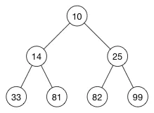

# 1.算法复杂度

## 1.1什么是复杂度

- 程序执行时需要的计算量和内存空间(和代码是否简洁无关)。
- 复杂度是数量级(方便记忆、推广)，不是具体的数字。
- 一般针对一个具体的算法，而非一个完整的系统。

## 1.2时间复杂度


- O(1) 一次就够(数量级)

```js
function fn(obj={}){
    return obj.a+obj.b+obj.c
}
```

- O(n)和传输的数据量一样(数量级)

```js
function fn(arr=[]){
    for(let i=0;i<arr.length;i++){
        console.info(arr[i])
    }
}
```

- O(n^2)数据量的平方(数量级)

```js
function fn(arr=[]){
    for(let i=0; i<arr.length;i++){
       for(let j=0; j<arr.length;j++){
        console.info(arr[j])
    	}
    }
}
```

- O(logn)数据量的对数(数量级)
- O(n*logn)数据量 * 数据量的对数(数量级)

## 1.3空间复杂度

程序执行时需要的内存空间。

算法需要额外定义多少变量？

- `O(1)` 定义了为数不多的变量，和 `n` 无关
- `O(n)` 需要定义和 `n` 级别的变量，如额外复制一个同样的数组
- 其他不常见

前端算法通常不太考虑空间复杂度，或者它比时间复杂度要次要的多。

因为前端环境，通常内存都是足够的，或者内存不够通常也是其他因素（如媒体文件）。

# 2.旋转数组

## 2.1题目

定义一个函数，实现数组的旋转。如输入 `[1, 2, 3, 4, 5, 6, 7]` 和 `key = 3`， 输出 `[5, 6, 7, 1, 2, 3, 4]`。考虑时间复杂度和性能。

## 2.2实现思路

思路1

- 将 `k` 后面的元素，挨个 `pop` 然后 `unshift` 到数组前面

思路2

- 将 `k` 后面的所有元素拿出来作为 `part1`
- 将 `k` 前面的所有元素拿出来作为 `part2`
- 返回 `part1.concat(part2)`

## 2.3代码实现

- 源码和性能测试:array-rotate.ts

```typescript
/**
 * 旋转数组 k 步 - 使用 pop 和 unshift
 * @param arr arr
 * @param k k
 * @returns arr
 */
export function rotate1(arr: number[], k: number): number[] {
    const length = arr.length
    if (!k || length === 0) return arr
    const step = Math.abs(k % length) // abs 取绝对值

    // O(n^2)
    for (let i = 0; i < step; i++) {
        const n = arr.pop()
        if (n != null) {
            arr.unshift(n) // 数组是一个有序结构，unshift 操作非常慢！！！ O(n)
        }
    }
    return arr
}

/**
 * 旋转数组 k 步 - 使用 concat
 * @param arr arr
 * @param k k
 */
 export function rotate2(arr: number[], k: number): number[] {
    const length = arr.length
    if (!k || length === 0) return arr
    const step = Math.abs(k % length) // abs 取绝对值

    // O(1)
    const part1 = arr.slice(-step) // O(1)
    const part2 = arr.slice(0, length - step)
    const part3 = part1.concat(part2)
    return part3
}

// // 功能测试
// const arr = [1, 2, 3, 4, 5, 6, 7]
// const arr1 = rotate2(arr, 3)
// console.info(arr1)

// // 性能测试
// const arr1 = []
// for (let i = 0; i < 10 * 10000; i++) {
//     arr1.push(i)
// }
// console.time('rotate1')
// rotate1(arr1, 9 * 10000)
// console.timeEnd('rotate1') // 885ms O(n^2)

// const arr2 = []
// for (let i = 0; i < 10 * 10000; i++) {
//     arr2.push(i)
// }
// console.time('rotate2')
// rotate2(arr2, 9 * 10000)
// console.timeEnd('rotate2') // 1ms O(1)

```

- 单元测试:

```typescript
// 使用的jest编写
import { rotate1, rotate2 } from './array-rotate'

describe('数组旋转', () => {
    it('正常情况', () => {
        const arr = [1, 2, 3, 4, 5, 6, 7]
        const k = 3

        const res = rotate2(arr, k)
        expect(res).toEqual([5, 6, 7, 1, 2, 3, 4]) // 断言
    })

    it('数组为空', () => {
        const res = rotate2([], 3)
        expect(res).toEqual([]) // 断言
    })

    it('k 是负值', () => {
        const arr = [1, 2, 3, 4, 5, 6, 7]
        const k = -3

        const res = rotate2(arr, k)
        expect(res).toEqual([5, 6, 7, 1, 2, 3, 4]) // 断言
    })

    it('k 是 0',  () => {
        const arr = [1, 2, 3, 4, 5, 6, 7]
        const k = 0

        const res = rotate2(arr, k)
        expect(res).toEqual(arr) // 断言
    })

    it('k 不是数字', () => {
        const arr = [1, 2, 3, 4, 5, 6, 7]
        const k = 'abc'

        // @ts-ignore
        const res = rotate2(arr, k)
        expect(res).toEqual(arr) // 断言
    })
})
```

经过性能测试，知道“思路2”性能更优。看来，思路简单并不一定性能最优。

> 扩展：toEqual是判断对象或者数组的

## 2.4性能对比

时间复杂度

- 思路1 - 看代码时间复杂度是 `O(n)`，**但数组是有序结构 `unshift` 本身就是 `O(n)` 复杂度**，所以实际复杂度是 `O(n^2)`
- 思路2 - `O(1)`。`slice` 和 `concat` 不会修改原数组，而数组是有序结构，复杂度是 `O(1)` 。

空间复杂度

- 思路1 - `O(1)`
- 思路2 - `O(n)`

# 3.括号匹配

## 3.1题目

一个字符串内部可能包含 `{ }` `( )` `[ ]` 三种括号，判断该字符串是否是括号匹配的。如 `(a{b}c)` 就是匹

配的， `{a(b` 和 `{a(b}c)` 就是不匹配的。

## 3.2栈 Stack

该题目的考察目的很明确——栈。

栈：先进后出。基本的API

- push
- pop
- length

和栈相关的数据结构（后面讲）

- 队列，先进先出
- 堆，如常说的“堆栈模型”

## 3.3逻辑结构和物理结构

栈和数组有什么区别？——没有可比性，两者不一个级别。就像：房子和石头有什么区别？

- 栈是一种逻辑结构，一种理论模型，它可以脱离编程语言单独讲。

- 数组是一种物理结构，代码的实现，不同的语言，数组语法是不一样的。

栈可以用数组来表达，也可以用链表来表达，也可以自定义 `class MyStack {...}` 自己实现。只是在 JS 

中，栈一般情况下用数组实现。

## 3.4思路

- 遇到左括号 `{ ( [` 则压栈
- 遇到右括号 `} ) ]` 则判断栈顶，相同的则出栈
- 最后判断栈 length 是否为 0

## 3.5代码实现

```typescript
/**
 * 判断左右括号是否匹配
 * @param left 左括号
 * @param right 右括号
 */
function isMatch(left: string, right: string): boolean {
    if (left === '{' && right === '}') return true
    if (left === '[' && right === ']') return true
    if (left === '(' && right === ')') return true
    return false
}

/**
 * 判断是否括号匹配
 * @param str str
 */
export function matchBracket(str: string): boolean {
    const length = str.length
    if (length === 0) return true

    const stack = []

    const leftSymbols = '{[('
    const rightSymbols = '}])'

    for (let i = 0; i < length; i++) {
        const s = str[i]

        if (leftSymbols.includes(s)) {
            // 左括号，压栈
            stack.push(s)
        } else if (rightSymbols.includes(s)) {
            // 右括号，判断栈顶（是否出栈）
            const top = stack[stack.length - 1]
            if (isMatch(top, s)) {
              // 括号匹配
                stack.pop()
            } else {
              // 括号不匹配
                return false
            }
        }
    }

    return stack.length === 0
}

// // 功能测试
// const str = '{a(b[c]d)e}f'
// console.info(123123, matchBracket(str))
```

- 单元测试

```typescript
import { matchBracket } from './match-bracket'

describe('括号匹配', () => {
    it('正常情况', () => {
        const str = '{a(b[c]d)e}f'
        const res = matchBracket(str)
        expect(res).toBe(true)
    })

    it('不匹配', () => {
        const str = '{a(b[(c]d)e}f'
        const res = matchBracket(str)
        expect(res).toBe(false)
    })

    it('顺序不一致的', () => {
        const str = '{a(b[c]d}e)f'
        const res = matchBracket(str)
        expect(res).toBe(false)
    })

    it('空字符串', () => {
        const res = matchBracket('')
        expect(res).toBe(true)
    })
})
```

> 扩展：基本数据类型时使用toBe

## 3.6性能分析

时间复杂度：O(n)

空间复杂度：O(n)

# 4.用两个栈实现一个队列

## 4.1题目

请用两个栈，来实现队列的功能，实现功能 `add` `delete` `length` 。

## 4.2队列 Queue

栈，先进后出

队列，先进先出，API 包括

- add
- delete
- length

常见的“消息队列”就是队列的一种应用场景

- A 系统向 B 系统持续发送海量的消息
- A 系统先把一条一条消息放在一个 queue
- B 系统再从 queue 中逐条消费（按顺序，先进先出）

## 4.3逻辑结构和物理结构

队列和栈一样，是一种逻辑结构。它可以用数组、链表等实现。思考：用数组实现队列，性能会怎样 —— add 

怎样？delete 怎样？

复杂场景下（如海量数据，内存不够用）需要单独设计。

## 4.4题目分析

- 队列 add
  - 往 stack1 push 元素
- 队列 delete
  - 将 stack1 所有元素 pop 出来，push 到 stack2
  - 将 stack2 执行一次 pop
  - 再将 stack2 所有元素 pop 出来，push 进 stack1


## 4.5代码实现

```typescript
export class MyQueue {
    private stack1: number[] = []
    private stack2: number[] = []

    /**
     * 入队
     * @param n n
     */
    add(n: number) {
        this.stack1.push(n)
    }

    /**
     * 出队
     */
    delete(): number | null {
        let res

        const stack1 = this.stack1
        const stack2 = this.stack2

        // 将 stack1 所有元素移动到 stack2 中
        while(stack1.length) {
            const n = stack1.pop()
            if (n != null) {
                stack2.push(n)
            }
        }

        // stack2 pop
        res = stack2.pop()

        // 将 stack2 所有元素“还给”stack1
        while(stack2.length) {
            const n = stack2.pop()
            if (n != null) {
                stack1.push(n)
            }
        }

        return res || null
    }

    get length(): number {
        return this.stack1.length
    }
}

// // 功能测试
// const q = new MyQueue()
// q.add(100)
// q.add(200)
// q.add(300)
// console.info(q.length)
// console.info(q.delete())
// console.info(q.length)
// console.info(q.delete())
// console.info(q.length)
```

- 单元测试

```typescript
import { MyQueue } from './two-stacks-one-queue'

describe('两个栈，一个队列', () => {
    it('add and length', () => {
        const q = new MyQueue()
        expect(q.length).toBe(0)

        q.add(100)
        q.add(200)
        q.add(300)
        expect(q.length).toBe(3)
    })

    it('delete', () => {
        const q = new MyQueue()
        expect(q.delete()).toBeNull()

        q.add(100)
        q.add(200)
        q.add(300)
        expect(q.delete()).toBe(100)
        expect(q.length).toBe(2)
        expect(q.delete()).toBe(200)
        expect(q.length).toBe(1)
    })
})
```

## 4.6性能分析

时间复杂度：delete是O(n)，add是O(1)

空间复杂度：整体是O(n)

# 5.反转单向链表

## 5.1题目

定义一个函数，输入一个单向链表的头节点，反转该链表，并输出反转之后的头节点

## 5.2链表

链表是一种物理结构（非逻辑结构），是数组的补充。数组需要一段连续的内存空间，而链表不需要。

数据结构

- 单向链表 `{ value, next }`
- 双向链表 `{ value, prev, next }`

两者对比

- 链表：查询慢，新增和删除较快
- 数组：查询快，新增和删除较慢

## 5.3分析

反转链表，画图很好理解。没有捷径，遍历一边，重新设置next指向即可。但实际写代码，却并不简单，很容易造成 nextNode 丢失。

因此，遍历过程中，至少要存储 3 个指针 `prevNode` `curNode` `nextNode`

时间复杂度 `O(n)`


## 5.4代码实现

```typescript
export interface ILinkListNode {
    value: number
    next?: ILinkListNode
}

/**
 * 反转单向链表，并返回反转之后的 head node
 * @param listNode list head node
 */
export function reverseLinkList(listNode: ILinkListNode): ILinkListNode {
    // 定义三个指针
    let prevNode: ILinkListNode | undefined = undefined
    let curNode: ILinkListNode | undefined = undefined
    let nextNode: ILinkListNode | undefined = listNode

    // 以 nextNode 为主，遍历链表
    while(nextNode) {
        // 第一个元素，删掉 next ，防止循环引用
        if (curNode && !prevNode) {
            delete curNode.next
        }

        // 反转指针
        if (curNode && prevNode) {
            curNode.next = prevNode
        }

        // 整体向后移动指针
        prevNode = curNode
        curNode = nextNode
        nextNode = nextNode?.next
    }

    // 最后一个的补充：当 nextNode 空时，此时 curNode 尚未设置 next
    curNode!.next = prevNode

    return curNode!
}

/**
 * 根据数组创建单向链表
 * @param arr number arr
 */
export function createLinkList(arr: number[]): ILinkListNode {
    const length = arr.length
    if (length === 0) throw new Error('arr is empty')

    let curNode: ILinkListNode = {
        value: arr[length - 1]
    }
    if (length === 1) return curNode

    for (let i = length - 2; i >= 0; i--) {
        curNode = {
            value: arr[i],
            next: curNode
        }
    }

    return curNode
}

const arr = [100, 200, 300, 400, 500]
const list = createLinkList(arr)
console.info('list:', list)

const list1 = reverseLinkList(list)
console.info('list1:', list1)
```

- 单元测试

```typescript
import { ILinkListNode, reverseLinkList, createLinkList } from './reverse-link-list'

describe('反转单向链表', () => {
    it('单个元素', () => {
        const node: ILinkListNode = { value: 100 }
        const node1 = reverseLinkList(node)
        expect(node1).toEqual({ value: 100 })
    })
    it('多个元素', () => {
        const node = createLinkList([100, 200, 300])
        const node1 = reverseLinkList(node)
        expect(node1).toEqual({
            value: 300,
            next: {
                value: 200,
                next: {
                    value: 100
                }
            }
        })
    })

})
```

## 5.5连环问

### 5.5.1链表和数组，哪个实现队列更快

- 数组是连续存储，push很快，shift很慢
- 链表是非连续存储，add和delete都很快（但查找很慢）
- 结论：链表实现队列更快

> 链表实现队列:

- 使用单向链表，但要同时记录head和tail。
- 要从tail入队，从head出队，否则出队时tail不好定位。


如果从tail出队，D出队了，但是不清楚谁指向D（单向链表，只有next，没有preve），只能从head一步步往后捋（时间复杂度O（n），这样是不行的。

- length要实时记录，不可遍历链表获取。

## 5.6使用链表实现队列

```typescript
// queue-with-list.ts
interface IListNode {
    value: number
    next: IListNode | null
}

export class MyQueue {
    private head: IListNode | null = null
    private tail: IListNode | null = null
    private len = 0

    /**
     * 入队，在 tail 位置
     * @param n number
     */
    add(n: number) {
        const newNode: IListNode = {
            value: n,
            next: null,
        }

        // 处理 head
        if (this.head == null) {
            this.head = newNode
        }

        // 处理 tail
        const tailNode = this.tail
        if (tailNode) {
            tailNode.next = newNode
        }
        this.tail = newNode

        // 记录长度
        this.len++
    }

    /**
     * 出队，在 head 位置
     */
    delete(): number | null {
        const headNode = this.head
        if (headNode == null) return null
        if (this.len <= 0) return null

        // 取值
        const value = headNode.value

        // 处理 head
        this.head = headNode.next

        // 记录长度
        this.len--

        return value
    }

    get length(): number {
        // length 要单独存储，不能遍历链表来获取（否则时间复杂度太高 O(n)）
        return this.len
    }
}

// // 功能测试
// const q = new MyQueue()
// q.add(100)
// q.add(200)
// q.add(300)
// console.info('length1', q.length)
// console.log(q.delete())
// console.info('length2', q.length)
// console.log(q.delete())
// console.info('length3', q.length)
// console.log(q.delete())
// console.info('length4', q.length)
// console.log(q.delete())
// console.info('length5', q.length)

// // 性能测试
// const q1 = new MyQueue()
// console.time('queue with list')
// for (let i = 0; i < 10 * 10000; i++) {
//     q1.add(i)
// }
// for (let i = 0; i < 10 * 10000; i++) {
//     q1.delete()
// }
// console.timeEnd('queue with list') // 17ms

// const q2 = []
// console.time('queue with array')
// for (let i = 0; i < 10 * 10000; i++) {
//     q2.push(i) // 入队
// }
// for (let i = 0; i < 10 * 10000; i++) {
//     q2.shift() // 出队
// }
// console.timeEnd('queue with array') // 431ms

```

- 单元测试

```typescript
// queue-with-list.test.ts
import { MyQueue } from './queue-with-list'

describe('链表实现队列', () => {
    it('add and length', () => {
        const q = new MyQueue()
        expect(q.length).toBe(0)

        q.add(100)
        q.add(200)
        q.add(300)
        expect(q.length).toBe(3)
    })
    it('delete', () => {
        const q = new MyQueue()
        expect(q.delete()).toBeNull()

        q.add(100)
        q.add(200)
        q.add(300)
        expect(q.delete()).toBe(100)
        expect(q.delete()).toBe(200)
        expect(q.delete()).toBe(300)
        expect(q.delete()).toBeNull()
    })
})
```

- 性能分析

空间复杂度都是O(n)。

add时间复杂度:链表O(1);数组O(1)。

delete时间复杂度：链表O(1);数组O(n)

# 6.二分查找

## 6.1题目

用 Javascript 实现二分查找（针对有序数组），说明它的时间复杂度。

## 6.2分析

二分查找是一种固定的算法，没什么可分析的。

两种实现思路

- 递归 - 代码逻辑更加简洁
- 循环 - 性能更好（就调用一次函数，而递归需要调用很多次函数，创建函数作用域会消耗时间）

时间复杂度 `O(logn)`

> 二分法有一个条件：需要有序数据。
>
> 二分的时间复杂度必定包含 `O(logn)`

## 6.3代码实现

```typescript
// binary-search.ts
/**
 * 二分查找（循环）
 * @param arr arr
 * @param target target
 */
export function binarySearch1(arr: number[], target: number): number {
    const length = arr.length
    if (length === 0) return -1

    let startIndex = 0 // 开始位置
    let endIndex = length - 1 // 结束位置

    while (startIndex <= endIndex) {
        const midIndex = Math.floor((startIndex + endIndex) / 2)
        const midValue = arr[midIndex]
        if (target < midValue) {
            // 目标值较小，则继续在左侧查找
            endIndex = midIndex - 1
        } else if (target > midValue) {
            // 目标值较大，则继续在右侧查找
            startIndex = midIndex + 1
        } else {
            // 相等，返回
            return midIndex
        }
    }

    return -1
}

/**
 * 二分查找（递归）
 * @param arr arr
 * @param target target
 * @param startIndex start index
 * @param endIndex end index
 */
export function binarySearch2(arr: number[], target: number, startIndex?: number, endIndex?: number): number {
    const length = arr.length
    if (length === 0) return -1

    // 开始和结束的范围
    if (startIndex == null) startIndex = 0
    if (endIndex == null) endIndex = length - 1

    // 如果 start 和 end 相遇，则结束
    if (startIndex > endIndex) return -1

    // 中间位置
    const midIndex = Math.floor((startIndex + endIndex) / 2)
    const midValue = arr[midIndex]

    if (target < midValue) {
        // 目标值较小，则继续在左侧查找
        return binarySearch2(arr, target, startIndex, midIndex - 1)
    } else if (target > midValue) {
        // 目标值较大，则继续在右侧查找
        return binarySearch2(arr, target, midIndex + 1, endIndex)
    } else {
        // 相等，返回
        return midIndex
    }
}

// // // 功能测试
// const arr = [10, 20, 30, 40, 50, 60, 70, 80, 90, 100, 110, 120]
// const target = 40
// // console.info(binarySearch2(arr, target))

// // 性能测试
// console.time('binarySearch1')
// for (let i = 0; i < 100 * 10000; i++) {
//     binarySearch1(arr, target)
// }
// console.timeEnd('binarySearch1') // 17ms
// console.time('binarySearch2')
// for (let i = 0; i < 100 * 10000; i++) {
//     binarySearch2(arr, target)
// }
// console.timeEnd('binarySearch2') // 34ms
```

- 单元测试

```typescript
// binary-search.test.ts
import { binarySearch1, binarySearch2 } from './binary-search'

describe('二分查找', () => {
    it('正常情况', () => {
        const arr = [10, 20, 30, 40, 50]
        const target = 40
        const index = binarySearch1(arr, target)
        expect(index).toBe(3)
    })

    it('空数组', () => {
        expect(binarySearch1([], 100)).toBe(-1)
    })

    it('找不到 target', () => {
        const arr = [10, 20, 30, 40, 50]
        const target = 400
        const index = binarySearch1(arr, target)
        expect(index).toBe(-1)
    })
})
```

# 7.两数之和

## 7.1题目

输入一个递增的数字数组，和一个数字 `n` 。求和等于 `n` 的两个数字。例如输入 `[1, 2, 4, 7, 11, 15]` 和 `15` ，返回两个数 `[4, 11]`

## 7.2分析

注意题目的要点

- 递增，从小打大排序
- 只需要两个数字，而不是多个

## 7.3常规思路

嵌套循环，找个一个数，然后再遍历剩余的数，求和，判断。

时间复杂度 `O(n^2)` ，基本不可用。

## 7.4利用递增的特性

数组是递增的

- 随便找两个数
- 如果和大于 n ，则需要向前寻找
- 如果和小于 n ，则需要向后寻找 —— **二分法**

双指针（指针就是索引，如数组的 index）

- i 指向头，j 指向尾， 求 i + j 的和
- 和如果大于 n ，则说明需要减少，则 j 向前移动（递增特性）
- 和如果小于 n ，则说明需要增加，则 i 向后移动（递增特性）

时间复杂度降低到 `O(n)`

## 7.5代码实现

```typescript
// two-numbers-sum.ts
/**
 * 寻找和为 n 的两个数（嵌套循环）
 * @param arr arr
 * @param n n
 */
export function findTowNumbers1(arr: number[], n: number): number[] {
    const res: number[] = []

    const length = arr.length
    if (length === 0) return res

    // O(n^2)
    for (let i = 0; i < length - 1; i++) {
        const n1 = arr[i]
        let flag = false // 是否得到了结果

        for (let j = i + 1; j < length; j++) {
            const n2 = arr[j]

            if (n1 + n2 === n) {
                res.push(n1)
                res.push(n2)
                flag = true
                break
            }
        }

        if (flag) break
    }

    return res
}

/**
 * 查找和为 n 的两个数（双指针）
 * @param arr arr
 * @param n n
 */
export function findTowNumbers2(arr: number[], n: number): number[] {
    const res: number[] = []

    const length = arr.length
    if (length === 0) return res

    let i = 0 // 头
    let j = length - 1 // 尾

    // O(n)
    while (i < j) {
        const n1 = arr[i]
        const n2 = arr[j]
        const sum = n1 + n2

        if (sum > n) {
            // sum 大于 n ，则 j 要向前移动
            j--
        } else if (sum < n) {
            // sum 小于 n ，则 i 要向后移动
            i++
        } else {
            // 相等
            res.push(n1)
            res.push(n2)
            break
        }
    }

    return res
}

// // 功能测试
const arr = [1, 2,1, 2,1, 2,1, 2,1, 2,1, 2,1, 2,1, 2,1, 2,1, 2,1, 2,1, 2,1, 2,1, 2, 4, 7, 11, 15]
// console.info(findTowNumbers2(arr, 15))

console.time('findTowNumbers1')
for (let i = 0; i < 100 * 10000; i++) {
    findTowNumbers1(arr, 15)
}
console.timeEnd('findTowNumbers1') // 730ms

console.time('findTowNumbers2')
for (let i = 0; i < 100 * 10000; i++) {
    findTowNumbers2(arr, 15)
}
console.timeEnd('findTowNumbers2') // 102
```

- 单元测试

```typescript
import { findTowNumbers1, findTowNumbers2 } from './two-numbers-sum'

describe('两数之和', () => {
    it('正常情况', () => {
        const arr = [1, 2, 4, 7, 11, 15]
        const res = findTowNumbers2(arr, 15)
        expect(res).toEqual([4, 11])
    })

    it('空数组', () => {
        const res = findTowNumbers2([], 100)
        expect(res).toEqual([])
    })

    it('找不到结果', () => {
        const arr = [1, 2, 4, 7, 11, 15]
        const n = 100
        const res = findTowNumbers2(arr, n)
        expect(res).toEqual([])
    })
})
```

## 7.6总结

- 有序数据，要善用二分法
- 优化嵌套循环，可以考虑“双指针”

# 8.求二叉搜索树的第 K 小的值

## 8.1题目

一个二叉搜索树，求其中的第 K 小的节点的值。
如下图，第 3 小的节点是 `4`


## 8.2二叉树

树，大家应该都知道，如前端常见的 DOM 树、vdom 结构。

二叉树，顾名思义，就是每个节点最多能有两个子节点。

```typescript
interface ITreeNode {
    value: number // 或其他类型
    left?: ITreeNode
    right?: ITreeNode
}
```

## 8.3二叉树的遍历

- 前序遍历：root -> left -> right
- 中序遍历：left -> root -> right
- 后序遍历：left -> right -> root

## 8.4二叉搜索树 BST

- 左节点（包括其后代） <= 根节点
- 右节点（包括其后代） >= 根节点 

思考：BST 存在的意义是什么？—— 后面解释

## 8.5分析题目

根据 BST 的特点，中序遍历的结果，正好是按照从小到大排序的结果。<br>
所以，中序遍历，求数组的 `arr[k]` 即可。

## 8.6代码实现

```typescript
// binary-search-tree-k-value.ts
```

## 8.7总结

- 二叉搜索树的特点
- 前序、中序、后序遍历

# 9.为何二叉树重要

## 9.1题目

为何二叉树那么重要，而不是三叉树、四叉树呢？

## 9.2分析

树是常见的数据结构，如 DOM 树，是一种多叉树。<br>
其中二叉树是一个特别的存在，很重要，很常考。

【注意】本文涉及很多数据结构的知识，所以要“不求甚解” —— 掌握要点和结果，不求细节和过程

## 9.3如何让性能整体最优？

有序结构

- 数组：查找易，增删难
- 链表：增删易，查找难

将两者优点结合起来 —— 二叉搜索树 BST ：查找易，增删易 —— 可使用二分算法

二叉搜索树 BST

- 左节点（包括其后代） <= 根节点
- 右节点（包括其后代） >= 根节点 


## 9.4高级二叉树

二叉搜索树 BST ，如果左右不平衡，也无法做到最优。<br>
极端情况下，它就成了链表 —— 这不是我们想要的。

平衡二叉搜索树 BBST ：要求树左右尽量平衡

- 树高度 `h` 约等于 `logn`
- 查找、增删，时间复杂度都等于 `O(logn)`

红黑树：一种自动平衡的二叉树

- 节点分 红/黑 两种颜色，通过颜色转换来维持树的平衡
- 相比于普通平衡二叉树，它维持平衡的效率更高


B 树：物理上是多叉树，但逻辑上是一个 BST 。用于高效 I/O ，如关系型数据库就用 B 树来组织数据结构。


## 9.5堆

JS 执行时代码中的变量

- 值类型 - 存储到栈
- 引用类型 - 存储到堆


堆的特点：

- 节点的值，总是不大于（或不小于）其父节点的值
- 完全二叉树


堆，虽然逻辑上是二叉树，但实际上它使用数组来存储的。



```typescript
// 上图是一个堆（从小到大），可以用数组表示
const heap = [-1, 10, 14, 25, 33, 81, 82, 99] // 忽略 0 节点

// 节点关系
const parentIndex = Math.floor(i / 2)
const leftIndex = 2 * i
const rightIndex = 2 * i + 1
```

堆的排序规则，没有 BST 那么严格，这就造成了

- 查询比 BST 慢
- 增删比 BST 快，维持平衡也更快
- 但整体复杂度都是 `O(logn)` 级别，即树的高度

但结合堆的应用场景

- 一般使用内存地址（栈中保存了）来查询，不会直接从根节点搜索
- 堆的物理结构是数组，所以查询复杂度就是 `O(1)`

总结

- 物理结构是数组（空间更小），逻辑结构是二叉树（操作更快）
- 适用于“堆栈”结构

## 答案

- 二叉树，可以充分利用二分法
- 二叉树可以同时规避数字和链表的缺点
- 引申到 BST BBST 等其他扩展结构

## 划重点

- 二分法的神奇力量
- 各个高级数据结构的存在价值、设计初衷
- 数据结构是基本功能

# 10.斐波那契数列

## 题目

用 Javascript 计算第 n 个斐波那契数列的值，注意时间复杂度。

## 分析

斐波那契数列很好理解

- `f(0) = 0`
- `f(1) = 1`
- `f(n) = f(n - 1) + f(n - 2)` 前两个值的和

## 递归计算

但这种方式会导致很多重复计算。<br>
时间复杂度是 `O(2^n)` ，爆炸式增长，不可用。（可以试试 `n: 100` ，程序会卡死）


## 优化

不用递归，用循环，记录中间结果。时间复杂度降低到 `O(n)`

## 动态规划

即，把一个大问题，拆解为不同的小问题，递归向下。

【注意】一般使用动态规划的思路（递归）分析问题，再转换为循环来解决问题。

## 三大算法思维

- 贪心（递归）
- 二分
- 动态规划

## 答案

使用循环的方式，参考 fibonacci.ts

## 划重点

- 动态规划的思路
- 识别出时间复杂度

## 扩展

青蛙跳台阶：一只青蛙，一次可以跳 1 个台阶，也可以跳 2 个台阶，问该青蛙跳上 n 级台阶，总共有多少种方式？

分析

- `f(1) = 1` 跳 1 级台阶，只有一种方式
- `f(2) = 2` 跳 2 级台阶，有两种方式
- `f(n) = f(n - 1) + fn(n - 2)` 跳 n 级，可拆分为两个问题
  - 第一次跳，要么 1 级，要么 2 级，只有这两种
  - 第一次跳 1 级，剩下有 `f(n - 1)` 种方式
  - 第一次跳 2 级，剩下有 `f(n - 2)` 种方式

看公式，和斐波那契数列一样。

# 11.移动 0

## 题目

定义一个函数，将数组种所有的 `0` 都移动到末尾，例如输入 `[1, 0, 3, 0, 11, 0]` 输出 `[1, 3, 11, 0, 0, 0]`。要求：

- 只移动 `0` ，其他数字顺序不变
- 考虑时间复杂度
- 必须在原数组就行操作

## 如果不限制“必须在原数组修改”

- 定义 `part1` `part2` 两个空数组
- 遍历数组，非 `0` push 到 `part1` ，`0` push 到 `part2`
- 返回 `part1.concat(part2)`

时间复杂度 `O(n)` 空间复杂度 `O(n)` ，

所以，遇到类似问题，要提前问面试官：**是否能在原数组基础上修改？**

## 传统方式

思路

- 遍历数组
- 遇到 `0` 则 push 到数组末尾
- 然后用 splice 截取掉当前元素

分析性能

- 空间复杂度没有问题 `O(1)`
- 时间复杂度
  - 看似是 `O(n)`
  - 但实际上 `splice` 和 `unshift` 一样，修改数组结构，时间复杂度是 `O(n)`
  - 总体看来时间复杂度是 `O(n^2)`，不可用

【注意】网上有很多人对这种方式点赞，切不可随意从众，要对思考！

## 双指针

思路（可画图解释，参考视频讲解）

- 指针1 指向第一个 0 ，指针2 指向第一个非 0
- 把指针1 和 指针2 进行交换
- 指针向后移

性能分析

- 时间复杂度 `O(n)`
- 空间复杂度 `O(1)`

性能测试，实际对比差距非常大。

## 答案

使用双指针，保证时间复杂度。参考 move-zero.ts

## 划重点

- 咨询面试官，确认是否必须要修改原数据？
- 数组是有序结构，不能随意 `splice` `unshift`
- 双指针的思路
