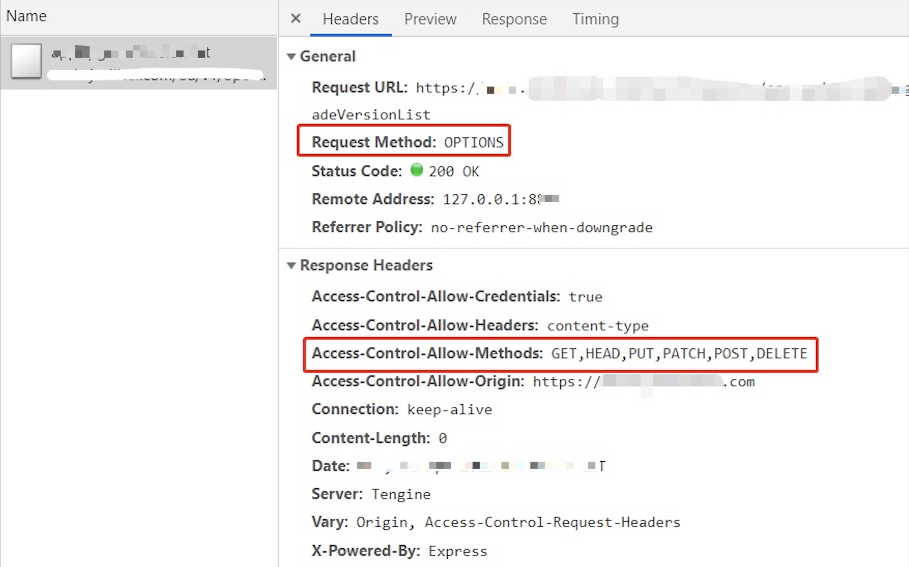

# 1.ajax fetch axios 的区别

## 1.1分析

三者根本没有可比性，不要被题目搞混了。要说出他们的本质。

## 1.2传统 ajax

AJAX （几个单词首字母，按规范应该大写） - Asynchronous JavaScript and XML（异步的 JavaScript 和 XML）。即使用 JS 进行异步请求，是 Web2.0 的技术基础，从 2005 年左右开始发起。所以，这里的 AJAX 就是一个称呼，一个缩写。

基于当时 JS 规范，异步请求主要使用 XMLHttpRequest 这个底层 API 。所以，有一道常考的面试题：请用 XMLHttpRequest 实现 ajax

```js
function ajax(url, successFn) {
    const xhr = new XMLHttpRequest()
    xhr.open("GET", url, false)
    xhr.onreadystatechange = function () {
        // 这里的函数异步执行，可参考之前 JS 基础中的异步模块
        if (xhr.readyState == 4) {
            if (xhr.status == 200) {
                successFn(xhr.responseText)
            }
        }
    }
    xhr.send(null)
}
```

## 1.3fetch

fetch 是一个原生 API ，它和 XMLHttpRequest 一个级别。

fetch 和 XMLHttpRequest 的区别

- 写法更加简洁
- 原生支持 promise

面试题：用 fetch 实现一个 ajax

```js
function ajax(url) {
    return fetch(url).then(res => res.json())
}
```

## 1.4axios

axios 是一个[第三方库](https://www.npmjs.com/package/axios)，随着 Vue 一起崛起。它和 jquery 一样（jquery 也有 ajax 功能）。

axios 内部可以用 XMLHttpRequest 或者 fetch 实现。

## 1.5答案

- ajax 是一种技术称呼，不是具体的 API 和库。
- fetch 是新的异步请求 API ，可代替 XMLHttpRequest。
- axios 是第三方库。

## 1.6划重点

- 注意库和API的区别：API是原生的函数，库是第三方工具，库需要api来实现。

- 实际项目要用库，尽量不要自己造轮子（除非有其他目的）。

## 1.7思考

库 和 框架 有什么区别？

# 2.节流和防抖

## 2.1题目

节流和防抖有何区别？分别用于什么场景？

## 2.2防抖

防抖，即防止抖动。抖动着就先不管它，等啥时候静止了，再做操作。

例如，一个搜索输入框，等输入停止之后，自动执行搜索。

```html
<p>debounce</p>
    搜索 <input id="input1">
    
    <script>
        function debounce(fn, delay = 200) {
            let timer = 0

            return function () {
                if (timer) clearTimeout(timer)

                timer = setTimeout(() => {
                    fn.apply(this, arguments) // 透传 this 和参数
                    timer = 0
                }, delay)
            }
        }

        const input1 = document.getElementById('input1')
        input1.addEventListener('keyup', debounce(() => {
            console.log('发起搜索', input1.value)
        }), 300)
    </script>
```

## 2.3节流

节流，即节省交互沟通。流，可理解为交流，不一定会产生网络流量。

例如，drag 的回调，上传进度的回调，都可以设置一个固定的频率，没必要那么频繁。

```html
 <div id="div1" draggable="true">可拖拽</div>

    <script>
        function throttle(fn, delay = 100) {
            let timer = 0

            return function () {
                if (timer) return

                timer = setTimeout(() => {
                    fn.apply(this, arguments)
                    timer = 0
                }, delay)
            }
        }

        const div1 = document.getElementById('div1')
        div1.addEventListener('drag', throttle((e) => {
            console.log('鼠标的位置', e.offsetX, e.offsetY)
        }))
    </script>
```

## 2.4答案

防抖和节流都用于处理频繁触发的操作，优化操作体验。

- 防抖:限制执行次数，多次密集的触发只执行一次。
- 节流：限制执行频率，有节奏的执行。
- 节流关注“过程”，防抖关注“结果”。

## 2.5划重点

- 抓住“触发频率”是否固定，即可抓住重点
- 实际项目推荐使用 lodash

# 3.px/% em/rem vw/vh 的区别

## 3.1题目

px % em rem vw/vh 的区别

## 3.2px

px基本单位，绝对单位（其他的都是相对单位）

## 3.3%

相对于父元素的宽度比例。

如根据 `position: absolute;` 居中显示时，需要设置 `left: 50%`

```css
.container {
    width: 200px;
    height: 200px;
    position: relative;
}
.box {
    width: 100px;
    height: 100px;
    position: absolute;
    left: 50%;
    top: 50%;
    margin-top: -50px;
    margin-left: -50px;
}
```

## 3.4em

相对于当前元素的 `font-size`。首行缩进可以使用 `text-indent: 2em`。

## 3.5rem

rem = root em

相对于根元素的 `font-size` 。可以根据媒体查询，设置根元素的 `font-size` ，实现移动端适配。

```css
@media only screen and (max-width: 374px) {
    /* iphone5 或者更小的尺寸，以 iphone5 的宽度（320px）比例设置 font-size */
    html {
        font-size: 86px;
    }
}
@media only screen and (min-width: 375px) and (max-width: 413px) {
    /* iphone6/7/8 和 iphone x */
    html {
        font-size: 100px;
    }
}
@media only screen and (min-width: 414px) {
    /* iphone6p 或者更大的尺寸，以 iphone6p 的宽度（414px）比例设置 font-size */
    html {
        font-size: 110px;
    }
}
```

## 3.6vw/vh

- vw 屏幕宽度的 1%
- vh 屏幕高度的 1%
- vmin 两者最小值
- vmax 两者最大值

# 4.箭头函数的缺点

## 4.1题目

什么时候不能使用箭头函数？

## 4.2箭头函数的缺点

1. 没有 arguments

```js
const fn1 = () => {
    console.log('this', arguments) // 报错，arguments is not defined
}
fn1(100, 200)
```

2. 无法通过 call apply bind 等改变 this。指向父作用域。

```js
const fn1 = () => {
    console.log('this', this) // window
}
fn1.call({ x: 100 })
```

3. 简写的函数会变得难以阅读

```js
const multiply = (a, b) => b === undefined ? b => a * b : a * b
```

## 4.3不适用箭头函数的场景

1. 对象方法

```js
const obj = {
    name: '双越',
    getName: () => {
        return this.name
    }
}
console.log( obj.getName() )
```

2. 扩展对象原型（包括构造函数的原型）

```js
const obj = {
    name: '双越'
}
obj.__proto__.getName = () => {
    return this.name
}
console.log( obj.getName() )
```

3. 构造函数

```js
const Foo = (name, age) => {
    this.name = name
    this.age = age
}
const f = new Foo('张三', 20) // 报错 Foo is not a constructor
```

4. 动态上下文中的回调函数

```js
const btn1 = document.getElementById('btn1')
btn1.addEventListener('click', () => {  
    // console.log(this === window)
    this.innerHTML = 'clicked'
})
```

5. Vue 生命周期和方法

```vue
{
    data() { return { name: '双越' } },
    methods: {
        getName: () => {
            // 报错 Cannot read properties of undefined (reading 'name')
            return this.name
        },
        // getName() {
        //     return this.name // 正常
        // }
    },
    mounted: () => {
        // 报错 Cannot read properties of undefined (reading 'name')
        console.log('msg', this.name)
    },
    // mounted() {
    //     console.log('msg', this.name) // 正常
    // }
}
```

6. 【注意】class 中使用箭头函数则**没问题**

```js
class Foo {
    constructor(name, age) {
        this.name = name
        this.age = age
    }
    getName = () => {
        return this.name
    }
}
const f = new Foo('张三', 20)
console.log('getName', f.getName())
```

所以，在 React 中可以使用箭头函数

```js
export default class HelloWorld extends React.Component {
    constructor(props) {
        super(props)
        this.state = {
            name: '双越'
        }
    }
    render() {
        return <p onClick={this.printName}>hello world</p>
    }
    printName = () => {
        console.log(this.state.name)
    }
}
```

## 4.4答案

箭头函数的缺点

- arguments 参数
- 无法改变 this

不适用的场景

- 对象方法
- 对象原型
- 构造函数
- 动态上下文
- Vue 生命周期和方法

## 4.5划重点

- Vue 组件是一个对象，而 React 组件是一个 class （如果不考虑 Composition API 和 Hooks）。

# 5.TCP 连接 三次握手 四次挥手

## 5.1题目

请描述 TCP 连接的 三次握手 和 四次挥手

## 5.2建立连接

客户端和服务端通过 HTTP 协议发送请求，并获取内容。

在发送请求之前，需要先建立连接，确定目标机器处于可接受请求的状态。就例如，你要请快递员（第三方的）去张三家取一个东西，你必须先打电话问问他在不在家。这就是建立连接的过程。

HTTP 协议是一个应用层的协议，它只规定了 req 和 res 的数据格式，如状态码、header、body 等。而建立网络连接需要更加底层的 TCP 协议。

## 5.3三次握手

三次握手，即建立一次 TCP 连接时，客户端和服务端总共需要发送 3 个包。

先举一个例子。还是你要派人去张三家取一个东西，现在你要发短信（不是打电话）“建立连接”，至少需要 3 个步骤，缺一不可。

- 你：在家吗？
- 张三：在家
- 你：好，这就过去（然后你指派人上门，张三准备迎接）

过程

- 客户端发包，服务端收到。服务端确认：客户端的发送能力是正常的。
- 服务端发包，客户端收到。客户端确认：服务端的接收能力是正常的。
- 客户端发包，服务端收到。服务端确认：客户端即将给我发送数据，我要准备接收。

建立连接完成，然后就开始发送数据，通讯。

## 5.4四次挥手

握手，是建立连接。挥手，就是告别，就是关闭连接。

还是之前的例子。取东西，不一定一次就取完，可能要来回很多次。而且，也不一定全部由你主动发起，过程中张三也可能会主动派人给你发送。即，你在 chrome 中看到的是一次 http 请求，其实背后可能需要好几次网络传输，只不过浏览器给合并起来了。

好了，取东西完毕了，你要发短信“关闭连接”，告诉张三可以关门了，需要 4 个步骤。【注意】这里你需要等着确认张三关门，才算是完全关闭连接，不能你说一声就不管了。跟日常生活不一样。

- 你：完事儿了
- 张三：好的 （此时可能还要继续给你发送，你也得继续接收。直到张三发送完）
- 张三：我发送完毕，准备关门了
- 你：好，关门吧 （然后你可以走了，张三可以关门了，连接结束）

过程

- 客户端发包，服务端接收。服务端确认：客户端已经请求结束
- 服务端发包，客户端接收。客户端确认：服务端已经收到，我等待它关闭
- 服务端发包：客户端接受。客户端确认：服务端已经发送完成，可以关闭
- 客户端发包，服务端接收。服务端确认：可以关闭了


# 6.for...in 和 for...of 的区别

## 6.1题目

for...in 和 for...of 的区别

## 6.2key 和 value

for...in 遍历 key , for...of 遍历 value

```js
const arr = [10, 20, 30]
for (let n of arr) {
    console.log(n)
}

const str = 'abc'
for (let s of str) {
    console.log(s)
}
```

```js
function fn() {
    for (let argument of arguments) {
        console.log(argument) // for...of 可以获取 value ，而 for...in 获取 key
    }
}
fn(10, 20, 30)

const pList = document.querySelectorAll('p')
for (let p of pList) {
    console.log(p) // for...of 可以获取 value ，而 for...in 获取 key
}
```

## 6.3遍历对象

for...in 可以遍历对象，for...of 不可以

## 6.4遍历 Map/Set

for...of 可以遍历 Map/Set ，for...in 不可以

```js
const set1 = new Set([10, 20, 30])
for (let n of set1) {
    console.log(n)
}

let map1 = new Map([
    ['x', 10], ['y', 20], ['z', 3]
])
for (let n of map1) {
    console.log(n)
}
```

## 6.5遍历 generator

for...of 可遍历 generator ，for...in 不可以

```js
function* foo(){
  yield 10
  yield 20
  yield 30
}
for (let o of foo()) {
  console.log(o)
}
```

## 6.6对象的可枚举属性

for...in 遍历一个对象的可枚举属性。如对象，数组，字符串、

使用 `Object.getOwnPropertyDescriptors(obj)` 可以获取对象的所有属性描述，看 ` enumerable: true` 来判断该属性是否可枚举。

## 6.7可迭代对象

for...of 遍历一个可迭代对象，如数组，字符串，Map，Set。其实就是迭代器模式，通过一个 `next` 方法返回下一个元素。

该对象要实现一个 `[Symbol.iterator]` 方法，其中返回一个 `next` 函数，用于返回下一个 value（不是 key）。可以执行 `arr[Symbol.iterator]()` 看一下。

JS 中内置迭代器的类型有 `String` `Array` `arguments` `NodeList` `Map` `Set` `generator` 等。

## 6.8答案

- for...in 遍历一个对象的可枚举属性，如对象、数组、字符串。针对属性，所以获得 key
- for...of 遍历一个可迭代对象，如数组、字符串、Map/Set 。针对一个迭代对象，所以获得 value

## 6.9划重点

“枚举” “迭代” 都是计算机语言的一些基础术语，目前搞不懂也没关系。但请一定记住 for...of 和 for...in 的不同表现。

## 6.10连环问：for await...of

用于遍历异步请求的可迭代对象。

```js
// 像定义一个创建 promise 的函数
function createTimeoutPromise(val) {
    return new Promise(resolve => {
        setTimeout(() => {
            resolve(val)
        }, 1000)
    })
}
```

如果你明确知道有几个 promise 对象，那直接处理即可

```js
(async function () {
    const p1 = createTimeoutPromise(10)
    const p2 = createTimeoutPromise(20)

    const v1 = await p1
    console.log(v1)
    const v2 = await p2
    console.log(v2)
})()
// 10 20
```

如果你有一个对象，里面有 N 个 promise 对象，你可以这样处理

```js
(async function () {
    const list = [
        createTimeoutPromise(10),
        createTimeoutPromise(20)
    ]

    // 第一，使用 Promise.all 执行
    Promise.all(list).then(res => console.log(res))

    // 第二，使用 for await ... of 遍历执行
    for await (let p of list) {
        console.log(p)
    }

    // 注意，如果用 for...of 只能遍历出各个 promise 对象，而不能触发 await 执行
})()
```

【注意】如果你想顺序执行，只能延迟创建 promise 对象，而不能及早创建。即，你创建了 promise 对象，它就立刻开始执行逻辑。

```js
(async function () {
    const v1 = await createTimeoutPromise(10)
    console.log(v1)
    const v2 = await createTimeoutPromise(20)
    console.log(v2)

    for (let n of [100, 200]) {
        const v = await createTimeoutPromise(n)
        console.log('v', v)
    }
})()
```

# 7.offsetHeight scrollHeight clientHeight 区别

## 题目

offsetHeight scrollHeight clientHeight 区别

## 盒子模型

- width height
- padding
- border
- margin
- **box-sizing**

## offsetHeight offsetWidth

包括：border + padding + content

## clientHeight clientWidth

包括：padding + content

## scrollHeight scrollWidth

包括：padding + 实际内容的尺寸(内容可滚动的所有长度)

## scrollTop scrollLeft

DOM 内部元素滚动的距离

## 答案

- offsetHeight - border + padding + content
- clientHeight - padding + content
- scrollHeight - padding + 实际内容的高度

---

代码参考 offset-height.html

# HTMLCollection 和 NodeList 的区别

## 题目

HTMLCollection 和 NodeList 的区别，Node 和 Element 的区别

## Node 和 Element

DOM 结构是一棵树，树的所有节点都是 `Node` ，包括：document，元素，文本，注释，fragment 等

`Element` 继承于 Node 。它是所有 html 元素的基类，如 `HTMLParagraphElement` `HTMLDivElement`

```js
class Node {}

// document
class Document extends Node {}
class DocumentFragment extends Node {}

// 文本和注释
class CharacterData extends Node {}
class Comment extends CharacterData {}
class Text extends CharacterData {}

// elem
class Element extends Node {}
class HTMLElement extends Element {}
class HTMLParagraphElement extends HTMLElement {}
class HTMLDivElement extends HTMLElement {}
// ... 其他 elem ...
```

## HTMLCollection 和 NodeList

HTMLCollection 是 Element 集合，它由获取 Element 的 API 返回

- `elem.children`
- `document.getElementsByTagName('p')`

NodeList 是 Node 集合，它由获取 Node 的 API 返回

- `document.querySelectorAll('p')`
- `elem.childNodes`

## 答案

- HTMLCollection 是 Element 集合，NodeList 是 Node 集合
- Node 是所有 DOM 节点的基类，Element 是 html 元素的基类

## 划重点

注意 Node 和 Element 在实际 API 中的区别，如 `children` 和 `childNodes` 获取的结果可能是不一样的（如果子节点有 Text 或 Comment）

## 扩展：类数组

HTMLCollection 和 NodeList 都不是数组，而是“类数组”。转换为数组：

```js
// HTMLCollection 和 NodeList 都不是数组，而是“类数组”
// 类数组转为真正的数组
const arr1 = Array.from(list)
const arr2 = Array.prototype.slice.call(list)
const arr3 = [...list]
```

# Vue computed 和 watch 区别

## 题目

Vue computed 和 watch 区别

## 两者设计用途不同

- computed 用于产出二次处理之后的数据，如对于一个列表进行 filter 处理
- watch 用于监听数据变化（如 v-model 时，数据可能被动改变，需要监听才能拿到）

## computed 有缓存

- computed 有缓存，data 不变则缓存不失效
- methods 无缓存，实时计算

## 答案

- computed 就已有数据产出新数据，有缓存
- watch 监听已有数据

---

代码参考 WatchAndComputed.vue

# Vue 组件通讯

## 题目

Vue 组件通讯有几种方式，尽量全面

## props / $emit

适用于父子组件。

- 父组件向子组件传递 props 和事件
- 子组件接收 props ，使用 `this.$emit` 调用事件

## 自定义事件

适用于兄弟组件，或者“距离”较远的组件。

常用 API

- 绑定事件 `event.on(key, fn)` 或 `event.once(key, fn)`
- 触发事件 `event.emit(key, data)`
- 解绑事件 `event.off(key, fn)`

Vue 版本的区别

- Vue 2.x 可以使用 Vue 实例作为自定义事件
- Vue 3.x 需要使用第三方的自定义事件，例如 https://www.npmjs.com/package/event-emitter

【注意】组件销毁时记得 `off` 事件，否则可能会造成内存泄漏

## $attrs

`$attrs` 存储是父组件中传递过来的，且未在 `props` 和 `emits` 中定义的属性和事件。相当于 `props` 和 `emits` 的一个补充。

继续向下级传递，可以使用 `v-bind="$attrs"`。这会在下级组件中渲染 DOM 属性，可以用 `inheritAttrs: false` 避免。

【注意】Vue3 中移除了 `$listeners` ，合并到了 `$attrs` 中。

## $parent

通过 `this.$parent` 可以获取父组件，并可以继续获取属性、调用方法等。

【注意】Vue3 中移除了 `$children` ，建议使用 `$refs`

## $refs

通过 `this.$refs.xxx` 可以获取某个子组件，前提是模板中要设置 `ref="xxx"`。

【注意】要在 `mounted` 中获取 `this.$refs` ，不能在 `created` 中获取。

## provide / inject

父子组件通讯方式非常多。如果是多层级的上下级组件通讯，可以使用 provide 和 inject 。在上级组件定一个 provide ，下级组件即可通过 inject 接收。

- 传递静态数据直接使用 `provide: { x: 10 }` 形式
- 传递组件数据需要使用 `provide() { return { x: this.xx } }` 形式，但做不到响应式
- 响应式需要借助 `computed` 来支持

## Vuex

Vuex 全局数据管理

## 答案

- 父子组件通讯
  - `props` `emits` `this.$emit`
  - `$attrs` （也可以通过 `v-bind="$attrs"` 向下级传递）
  - `$parent` `$refs`
- 多级组件上下级
  - `provide` `inject`
- 跨级、全局
  - 自定义事件
  - Vuex

# Vuex mutation action 区别

## 题目

Vuex mutation action 区别

## 答案

- mutation
  - 建议原子操作，每次只修改一个数据，不要贪多
  - 必须是同步代码，方便查看 devTools 中的状态变化
- action
  - 可包含多个 mutation
  - 可以是异步操作

# JS 严格模式和非严格模式

## 题目

JS 严格模式和非严格模式的区别

## 设计初衷

Javascript 设计之初，有很多不合理、不严谨、不安全之处，例如变量未定义即可使用 `n = 100`。严格模式用于规避这些问题。

而现在 ES 规范已经普及，从语法上已经规避了这些问题。

## 开启严格模式

代码（或一个函数）一开始插入一行 `'use strict'` 即可开启严格模式

```js
'use strict' // 全局开启

function fn() {
    'use strict' // 某个函数开启

}
```

一般情况下，开发环境用 ES 或者 Typescript ，打包出的 js 代码使用严格模式

## 严格模式的不同

严格模式的细则有很多，这里总结一些常用常见的

### 全局变量必须声明

```js
'use strict'
n = 10 // ReferenceError: n is not defined
```

### 禁止使用 `with`

```js
'use strict'
var obj = { x: 10 }
with (obj) {
    // Uncaught SyntaxError: Strict mode code may not include a with statement
    console.log(x)
}
```

### 创建 eval 作用域

正常模式下，JS 只有两种变量作用域：全局作用域 + 函数作用域。严格模式下，JS 增加了 eval 作用域。

**chrome 隐私模式下执行这段代码？？？**

```js
'use strict'
var x = 10
eval('var x = 20; console.log(x)')
console.log(x)
```

### 禁止 this 指向全局作用域

```js
'use strict'
function fn() {
    console.log('this', this) // undefined
}
fn()
```

### 函数参数不能重名

```js
'use strict'

// Uncaught SyntaxError: Duplicate parameter name not allowed in this context
function fn(x, x, y) {
    return
}
```

## 答案

- 全局变量必须声明
- 禁止使用 with
- 创建 eval 作用域
- 禁止 this 指向全局作用域
- 函数参数不能重名

# options 请求

## 题目

跨域为何需要 options 请求？

## 跨域

浏览器同源策略，默认限制跨域请求。跨域的解决方案

- jsonp
- CORS

```js
// CORS 配置允许跨域（服务端）
response.setHeader("Access-Control-Allow-Origin", "http://localhost:8011") // 或者 '*'
response.setHeader("Access-Control-Allow-Headers", "X-Requested-With")
response.setHeader("Access-Control-Allow-Methods", "PUT,POST,GET,DELETE,OPTIONS")
response.setHeader("Access-Control-Allow-Credentials", "true") // 允许跨域接收 cookie
```

## options 请求

使用 CORS 跨域请求时，经常会看到一个“多余”的 options 请求，之后才发送了实际的请求。



该请求就是为了检查服务端的 headers 信息，是否符合客户端的预期。所以它没有 body 的返回。

> 规范要求，对那些可能对服务器数据产生副作用的 HTTP 请求方法（特别是 GET 以外的 HTTP 请求，或者搭配某些 MIME 类型的 POST 请求），浏览器必须首先使用 OPTIONS 方法发起一个预检请求（preflight request），从而获知服务端是否允许该跨域请求。—— MDN

## 答案

options 请求就是对 CORS 跨域请求之间的一次预检查，检查成功再发起正式请求，是浏览器自行处理的。了解即可，实际开发中不用过于关注。