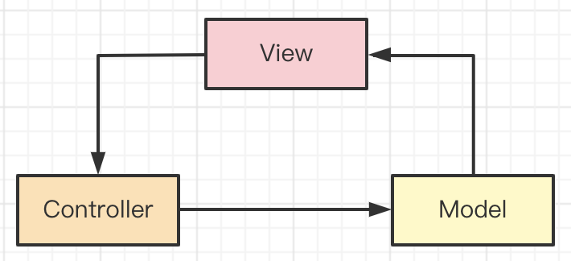

# 1.H5如何进行首屏优化

## 1.1前端通用的优化策略

压缩资源，使用 CDN ，http 缓存等。本节只讨论首屏，这些先不讲。

## 1.2路由懒加载

如果是 SPA ，优先保证首页加载。

## 1.3服务端渲染 SSR

传统的 SPA 方式过程繁多

- 下载 html ，解析，渲染
- 下载 js ，执行
- ajax 异步加载数据
- 重新渲染页面

而 SSR 则只有一步

- 下载 html ，接续，渲染

如果是纯 H5 页面，SSR 就是首屏优化的终极方案。

技术方案：

- 传统的服务端模板，如 ejs smarty jsp 等
- Nuxt.js ( Vue 同构 )
- Next.js ( React 同构 )

## 1.4App 预取

如果 H5 在 App webview 中展示，可以使用 App 预取资源

- 在列表页，App 预取数据（一般是标题、首页文本，不包括图片、视频）
- 进入详情页，H5 直接即可渲染 App 预取的数据
- 可能会造成“浪费”：预期了，但用户未进入该详情页 —— 不过没关系，现在流量便宜

例如，你在浏览朋友圈时，可以快速的打开某个公众号的文章。

这里可以联想到 `prefetch` ，不过它是预取 js css 等静态资源，并不是首屏的内容。
不要混淆。

## 1.5分页

根据显示设备的高度，设计尽量少的页面内容。即，首评内容尽量少，其他内容上滑时加载。

## 1.6图片 lazyLoad

先加载内容，再加载图片。注意，提前设置图片容器的尺寸，尽量重绘，不要重排。

## 1.7离线包 hybrid

提前将 html css js 等下载到 App 内。当在 App 内打开页面时，webview 使用 `file://` 协议加载本地的 html css js ，然后再 ajax 请求数据，再渲染。

可以结合 App 预取。

## 1.8答案

- SSR
- 预取
- 分页
- 图片 lazyLoad
- hybrid

## 1.9扩展

做完性能优化，还要进行统计、计算、评分，作为你的工作成果。

优化体验：如 骨架屏 loading

# 2.渲染 10w 条数据

## 2.1设计是否合理？

前端很少会有一次性渲染 10w 条数据的需求，而且如果直接渲染会非常卡顿。你可以反问面试官：这是什么应用场景。然后判断这个技术方案是否合理。

例如，就一个普通的新闻列表，后端一次性给出 10w 条数据是明显设计不合理的。应该分页给出。你能正常的反问、沟通、给出自己合理的建议，这本身就是加分项。

当然，面试官话语权更大，他可能说：对，不合理，但就非得这样，该怎么办？

## 2.2虚拟列表


基本原理

- 只渲染可视区域 DOM
- 其他隐藏区域不渲染，只用一个 `<div>` 撑开高度
- 监听容器滚动，随时创建和销毁 DOM


虚拟列表实现比较复杂，特别是在结合异步 ajax 加载。明白实现原理，实际项目可用第三方 lib

- [vue-virtual-scroll-list](https://www.npmjs.com/package/vue-virtual-scroll-list)
- [react-virtualized](https://www.npmjs.com/package/react-virtualized)

## 2.2答案

- 沟通需求和场景，给出自己合理的设计建议
- 虚拟列表

## 2.3扩展

有时候面试官会出这种刁钻的问题来故意“难为”候选人，把自己扮演成后端角色，看候选人是否好欺负。如果此时你顺从面试官的问题继续埋头苦思，那就错了。应该适当的追问、沟通、提出问题、给出建议，这是面试官想要看到的效果。

实际工作中，前端和后端、服务端的人合作，那面会遇到各种设计沟通的问题。看你是否有这种实际工作经验。

# 3.文字超出省略

## 3.1分析

如果你有实际工作经验，实际项目有各种角色参与。页面需要 UI 设计，开发完还需要 UI 评审。UI 设计师可能是这个世界上最“抠门”的人，他们都长有像素眼，哪怕差 1px 他们都不会放过你。所以，开发时要严格按照视觉稿，100% 还原视觉稿。

但如果你没有实际工作经验（或实习经验），仅仅是自学的项目，或者跟着课程的项目。没有 UI 设计师，程序员的审美是不可靠的，肯定想不到很多细节。

所以，考察一些 UI 关注的细节样式，将能从侧面判断你有没有实际工作经验。

## 3.2答案

单行文字：

```css
#box1 {
    border: 1px solid #ccc;
    width: 100px;
    white-space: nowrap; /* 不换行 */
    overflow: hidden;
    text-overflow: ellipsis; /* 超出省略 */
}
```

多行文字

```css
#box2 {
    border: 1px solid #ccc;
    width: 100px;
    overflow: hidden;
    display: -webkit-box; /* 将对象作为弹性伸缩盒子模型显示 */
    -webkit-box-orient: vertical; /* 设置子元素排列方式 */
    -webkit-line-clamp: 3; /* 显示几行，超出的省略 */
}
```

## 3.3扩展

UI 关注的问题还有很多，例如此前讲过的移动端响应式，Retina 屏 1px 像素问题。

再例如，网页中常用的字号，如果你有工作经验就知道，最常用的是 `12px` `14px` `16px` `20px` `24px` 等。你如果不了解，可以多去看看各种 UI 框架，例如 [antDesign 排版](https://ant.design/components/typography-cn/)。

# 4.前端常用的设计模式

## 4.1开放封闭原则

设计原则是设计模式的基础，开放封闭原则是最重要的：对扩展开发，对修改封闭。

## 4.2工厂模式

用一个工厂函数，创建一个实例，封装创建的过程。

```ts
class Foo { ... }

function factory(): Foo {
    // 封装创建过程，这其中可能有很多业务逻辑

    return new Foo(...arguments)
}
```

应用场景

- jQuery `$('div')` 创建一个 jQuery 实例
- React `createElement('div', {}, children)` 创建一个 vnode

## 4.3单例模式

提供全局唯一的对象，无论获取多少次。

```js
class SingleTon {
    private constructor() {}
    public static getInstance(): SingleTon {
        return new SingleTon()
    }
    fn1() {}
    fn2() {}
}

// const s1 = new SingleTon() // Error: constructor of 'singleton' is private

const s2 = SingleTon.getInstance()
s2.fn1()
s2.fn2()

const s3 = SingleTon.getInstance()
s2 === s3 // true
```

应用场景

- Vuex Redux 的 store ，全局唯一的
- 全局唯一的 dialog modal

PS：JS 是单线程语言。如果是 Java 等多线程语言，创建单例时还需要考虑线程锁死，否则两个线程同时创建，则可能出现两份 instance 。

## 4.4代理模式

使用者不能直接访问真实数据，而是通过一个代理层来访问。ES Proxy 本身就是代理模式，Vue3 基于它来实现响应式。

代码参考 proxy.html 

## 4.5观察者模式

即常说的绑定事件。一个主题，一个观察者，主题变化之后触发观察者执行。

```js
// 一个主题，一个观察者，主题变化之后触发观察者执行
btn.addEventListener('click', () => { ... })
```

## 4.6发布订阅模式

即常说的自定义事件，一个 `event` 对象，可以绑定事件，可以触发事件。

```js
// 绑定
event.on('event-key', () => {
    // 事件1
})
event.on('event-key', () => {
    // 事件2
})

// 触发执行
event.emit('event-key')
```

温故知新。在讲 JS 内存泄漏时提到，Vue React 组件销毁时，要记得解绑自定义事件。

```js
function fn1() { /* 事件1 */ }
function fn2() { /* 事件2 */ }

// mounted 时绑定
event.on('event-key', fn1)
event.on('event-key', fn2)

// beforeUnmount 时解绑
event.off('event-key', fn1)
event.off('event-key', fn2)
```

## 4.7装饰器模式

ES 和 TS 的 Decorator 语法就是装饰器模式。可以为 class 和 method 增加新的功能。以下代码可以在 [ts playground](https://www.typescriptlang.org/play) 中运行。

```js
// class 装饰器
function logDec(target) {
    target.flag = true
}

@logDec
class Log {
    // ...
}

console.log(Log.flag) // true
```

```js
// method 装饰器
// 每次 buy 都要发送统计日志，可以抽离到一个 decorator 中
function log(target, name, descriptor) {
    // console.log(descriptor.value) // buy 函数
    const oldValue = descriptor.value // 暂存 buy 函数

    // “装饰” buy 函数
    descriptor.value = function(param) {
        console.log(`Calling ${name} with`, param) // 打印日志
        return oldValue.call(this, param) // 执行原来的 buy 函数
    };

    return descriptor
}
class Seller {
    @log
    public buy(num) {
        console.log('do buy', num)
    }
}

const s = new Seller()
s.buy(100)
```

Angular nest.js 都已广泛使用装饰器。这种编程模式叫做**AOP 面向切面编程**：关注业务逻辑，抽离工具功能。

```js
import { Controller, Get, Post } from '@nestjs/common';

@Controller('cats')
export class CatsController {
  @Post()
  create(): string {
    return 'This action adds a new cat';
  }

  @Get()
  findAll(): string {
    return 'This action returns all cats';
  }
}
```

## 4.8答案

传统的经典设计模式有 23 个，作为面试题只说出几个前端常用的就可以。

- 工厂模式
- 单例模式
- 代理模式
- 观察者模式
- 发布订阅模式
- 装饰器模式

## 4.9连环问：观察者模式和发布订阅模式的区别？


观察者模式

- Subject 和 Observer 直接绑定，中间无媒介
- 如 `addEventListener` 绑定事件

发布订阅模式

- Publisher 和 Observer 相互不认识，中间有媒介
- 如 `eventBus` 自定义事件

## 4.10连环问：MVC 和 MVVM 有什么区别

MVC 原理

- View 传送指令到 Controller
- Controller 完成业务逻辑后，要求 Model 改变状态
- Model 将新的数据发送到 View，用户得到反馈



MVVM 直接对标 Vue 即可

- View 即 Vue template
- Model 即 Vue data
- VM 即 Vue 其他核心功能，负责 View 和 Model 通讯


# 5.Vue 优化

## 5.1前端通用的优化策略

压缩资源，拆包，使用 CDN ，http 缓存等。本节只讨论首屏，这些先不讲。

## 5.2v-if 和 v-show

区别

- `v-if` 组件销毁/重建
- `v-show` 组件隐藏（切换 CSS `display`）

场景

- 一般情况下使用 `v-if` 即可，普通组件的销毁、渲染不会造成性能问题
- 如果组件创建时需要大量计算，或者大量渲染（如复杂的编辑器、表单、地图等），可以考虑 `v-show`

## 5.3v-for 使用 key

`key` 可以优化内部的 diff 算法。注意，遍历数组时 `key` 不要使用 `index` 。

```html
<ul>
    <!-- 而且，key 不要用 index -->
    <li v-for="(id, name) in list" :key="id">{{name}}</li>
</ul>
```

## 5.4computed 缓存

`computed` 可以缓存计算结果，`data` 不变则缓存不失效。

```js
export default {
    data() {
        return {
            msgList: [ ... ] // 消息列表
        }
    },
    computed: {
        // 未读消息的数量
        unreadCount() {
            return this.msgList.filter(m => m.read === false).length
        }
    }
}
```

## 5.5keep-alive

`<keep-alive>` 可以缓存子组件，只创建一次。通过 `activated` 和 `deactivated` 生命周期监听是否显示状态。<br>
代码参考 components/KeepAlive/index.vue

场景

- 局部频繁切换的组件，如 tabs
- 不可乱用 `<keep-alive>` ，缓存太多会占用大量内存，而且出问题不好 debug

## 5.6异步组件

对于体积大的组件（如编辑器、表单、地图等）可以使用异步组件

- 拆包，需要时异步加载，不需要时不加载
- 减少 main 包的体积，页面首次加载更快

vue3 使用 `defineAsyncComponent` 加载异步组件，代码参考 components/AsyncComponent/index.vue

## 5.7路由懒加载

对于一些补偿访问的路由，或者组件提交比较大的路由，可以使用路由懒加载。

```js
const routes = [
  {
    path: '/',
    name: 'Home',
    component: Home
  },
  {
    path: '/about',
    name: 'About',
    // 路由懒加载
    component: () => import(/* webpackChunkName: "about" */ '../views/About.vue')
  }
]
```

## 5.8SSR

SSR 让网页访问速度更快，对 SEO 友好。

但 SSR 使用和调试成本高，不可乱用。例如，一个低代码项目（在线制作 H5 网页），toB 部分不可用 SSR ， toC 部分适合用 SSR 。

## 5.9答案

- v-if 和 v-show
- v-for 使用 key
- computed 缓存
- keep-alive
- 异步组件
- 路由懒加载
- SSR

## 5.10扩展

网上看到过一些“较真”的性能优化，对比普通组件和函数组件，JS 执行多消耗了几 ms 。

- 如果这些是为了探索、学习前端技术，非常推荐
- 但在实际项目中要慎用，不要为了优化而优化。肉眼不可见的 ms 级的优化，对项目没有任何实际价值

## 5.11连环问：Vue 遇到过哪些坑？？？

全局事件、自定义事件要在组件销毁时解除绑定

- 内存泄漏风险
- 全局事件（如 `window.resize`）不解除，则会继续监听，而且组件再次创建时会重复绑定

Vue2.x 中，无法监听 data 属性的新增和删除，以及数组的部分修改 —— Vue3 不会有这个问题

- 新增 data 属性，需要用 `Vue.set`
- 删除 data 属性，需要用 `Vue.delete`
- 修改数组某一元素，不能 `arr[index] = value` ，要使用 `arr.splice` API 方式

路由切换时，页面会 scroll 到顶部。例如，在一个新闻列表页下滑到一定位置，点击进入详情页，在返回列表页，此时会 scroll 到顶部，并重新渲染列表页。所有的 SPA 都会有这个问题，并不仅仅是 Vue 。

- 在列表页缓存数据和 `scrollTop`
- 返回列表页时（用 Vue-router [导航守卫](https://router.vuejs.org/zh/guide/advanced/navigation-guards.html)，判断 `from`），使用缓存数据渲染页面，然后 `scrollTo(scrollTop)`

# 6.React 优化

## 6.1前端通用的优化策略

压缩资源，拆包，使用 CDN ，http 缓存等。本节只讨论首屏，这些先不讲。

## 6.2循环使用 key

`key` 可以优化内部的 diff 算法。注意，遍历数组时 `key` 不要使用 `index` 。

```jsx
const todoItems = todos.map((todo) =>
  {/* key 不要用 index */}
  <li key={todo.id}>
    {todo.text}
  </li>
)
```

## 6.3修改 css 模拟 `v-show`

条件渲染时，可以通过设置 css 来处理显示和隐藏，不用非得销毁组件。模拟 Vue `v-show`

```jsx
{/* 模拟 v-show */}
{!flag && <MyComponent style={{display: 'none'}}/>}
{flag && <MyComponent/>}
```

或者

```jsx
{/* 模拟 v-show */}
<MyComponent style={{display: flag ? 'block' : 'none'}}/>
```

## 6.4使用 Fragment 减少层级

组件层级过多，如果每个组件都以 `<div>` 作为 root ，则 DOM 层级太多而难以调试。

```jsx
render() {
  return <>
      <p>hello</p>
      <p>world</p>
  </>
}
```

## 6.5JSX 中不要定义函数

JSX 是一个语法糖，它和 Vue template 一样，最终将变为 JS render 函数，用以生成 vnode 。所以，如果在 JSX 中定义函数，那么每次组件更新时都会初始化该函数，这是一个不必要的开销。可回顾之前的面试题： `for 和 forEach 哪个更快`

```jsx
{/* Bad */}
<button onClick={() => {...}}>点击</button>
```

更好的解决方案是提前定义函数，在 JSX 中只引用执行。

```jsx
// Good
class MyComponent extends React.Component {
    clickHandler = () => { /*  */ }
    render() {
        return <>
            <button onClick={this.clickHandler}>点击</button>
        </>
    }
}
```

注意

- 如果你的系统不够复杂，这个优化几乎看不出效果，因为 JS 执行非常快 —— 但是，面试说出来肯定是一个加分项～
- 如果你用的是函数组件，这个优化方案不适用。如下代码：

```jsx
function App() {
  // 函数组件，每次组件更新都会重新执行 App 函数，所以内部的 clickHandler 函数也会被重新创建，这跟在 JSX 中定义是一样的
  // 不过 React 提供了 useCallback 来缓存函数，下文讲

  function clickHandler() {
    // ...
  }

  return (
    <>
      <button onClick={clickHandler}>点击</button>
    </>
  )
}
```

## 6.6在构造函数 bind this

同理，如果在 JSX 中 bind this ，那每次组件更新时都要 bind 一次。在构造函数中 bind 更好。或者，直接使用箭头函数。

```jsx
class MyComponent extends React.Component {
    constructor() {
        // 要在构造函数中 bind this ，而不是在 JSX 中
        this.clickHandler1 = this.clickHandler1.bind(this)
    }
    clickHandler1() { /* 如果 JSX 中直接调用，则 this 不是当前组件。所以要 bind this */ }
    clickHander2 = () => { /* 使用箭头函数，不用 bind this */ }
    render() {
        return <>
            <button onClick={this.clickHandler1}>点击</button>
        </>
    }
}
```

PS：如果是函数组件，则不用 bind this

## 6.7使用 shouldComponentUpdate 控制组件渲染

React 默认情况下，只要父组件更新，其下所有子组件都会“无脑”更新。如果想要手动控制子组件的更新逻辑

- 可使用 `shouldComponentUpdate` 判断
- 或者组件直接继承 `React.PureComponent` ，相当于在 `shouldComponentUpdate` 进行 props 的**浅层**比较

但此时，必须使用**不可变数据**，例如不可用 `arr.push` 而要改用 `arr.concat`。考验工程师对 JS 的熟悉程度。代码参考 components/SimpleTodos/index.js 的 class 组件。

不可变数据也有相应的第三方库

- [immutable.js](https://www.npmjs.com/package/immutable)
- [immer](https://www.npmjs.com/package/immer) —— 更加推荐，学习成本低

PS：React 默认情况（子组件“无脑”更新）这本身并不是问题，在大部分情况下并不会影响性能。因为组件更新不一定会触发 DOM 渲染，可能就是 JS 执行，而 JS 执行速度很快。所以，性能优化要考虑实际情况，不要为了优化而优化。

## 6.8React.memo 缓存函数组件

如果是函数组件，没有用 `shouldComponentUpdate` 和 `React.PureComponent` 。React 提供了 `React.memo` 来缓存组件。代码参考 FunctionalTodoList.js

`React.memo` 也支持自行比较

```js
function MyComponent(props) {
}
function areEqual(prevProps, nextProps) {
    // 自行比较，像 shouldComponentUpdate
}
export default React.memo(MyComponent, areEqual);
```

## 6.9useMemo 缓存数据

在函数组件中，可以使用 `useMemo` 和 `useCallback` 缓存数据和函数。

```jsx
function App(props) {
    const [num1, setNum1] = useState(100)
    const [num2, setNum2] = useState(200)

    const sum = useMemo(() => num1 + num2, [num1, num2]) // 缓存数据，像 Vue computed

    // const fn1 = useCallback(() => {...}, [...]) // 缓存函数

    return <p>hello {props.info}</p>
}
```

PS: 普通的数据和函数，没必要缓存，不会影响性能的。一些初始化比较复杂的数据，可以缓存。

## 6.10异步组件

和 Vue 异步组件一样

```jsx
import React, { lazy, Suspense } from 'react'

// 记载异步组件
const OtherComponent = lazy(
  /* webpackChunkName: 'OtherComponent'*/
  () => import('./OtherComponent')
)

function MyComponent() {
  return (
    <div>
      <Suspense fallback={<div>Loading...</div>}> {/* 支持 loading 效果 */}
        <OtherComponent />
      </Suspense>
    </div>
  )
}
```

## 6.11路由懒加载

和 Vue-router 路由懒加载一样

```js
import React, { lazy, Suspense } from 'react';
import { BrowserRouter as Router, Route, Switch } from 'react-router-dom';

const Home = lazy(() => import('./Home')); 
const List = lazy(() => import(/* webpackChunkName: 'Home'*/ './List'));

const App = () => (
  <Router>
    <Suspense fallback={<div>Loading...</div>}>
      <Switch>
        <Route exact path="/" component={Home}/>
        <Route path="/list" component={List}/>
      </Switch>
    </Suspense>
  </Router>
);
```

## 6.12SSR

同 Vue SSR

## 6.13答案

- 循环使用 key
- 修改 css 模拟 `v-show`
- 使用 Fragment 减少层级
- JSX 中不要定义函数
- 在构造函数 bind this
- 使用 shouldComponentUpdate 控制组件渲染
- React.memo 缓存函数组件
- useMemo 缓存数据
- 异步组件
- 路由懒加载
- SSR

## 6.14面试连环问：React 遇到哪些坑？

JSX 中，自定义组件命名，开头字母要大写，html 标签开头字母小写

```jsx
{/* 原生 html 组件 */}
<input/>

{/* 自定义组件 */}
<Input/>
```

JSX 中 `for` 写成 `htmlFor` ， `class` 写成 `className`

```js
{/* for 改成 htmlFor ，class 要改为 className */}
<label htmlFor="input-name" className="xxx">
    姓名 <input id="input-name"/>
<label>
```

state 作为不可变数据，不可直接修改，使用纯函数

```js
// this.state.list.push({...}) // 错误，不符合 React 规范
this.setState({
    list: curList.concat({...}) // 使用**不可变数据**
})
```

JSX 中，属性要区分 JS 表达式和字符串

```js
<Demo position={1} flag={true}/>
<Demo position="1" flag="true"/>
```

state 是异步更新的，要在 callback 中拿到最新的 state 值

```js
const curNum = this.state.num
this.setState({
    num: curNum + 1
}, () => {
    console.log('newNum', this.state.num) // 正确
})
// console.log('newNum', this.state.num) // 错误
```

React Hooks 有很多限制，注意不到就会踩坑。例如，`useEffect` 内部不能修改 state

```js
function App() {
    const [count, setCount] = useState(0)

    useEffect(() => {
        const timer = setInterval(() => {
            setCount(count + 1) // 如果依赖是 [] ，这里 setCount 不会成功
        }, 1000)

        return () => clearTimeout(timer)
    }, [count]) // 只有依赖是 [count] 才可以，这样才会触发组件 update

    return <div>count: {count}</div>
}

export default App
```

再例如，`useEffect` 依赖项（即第二个参数）里有对象、数组，就会出现死循环。所以，依赖项里都要是值类型。<br>
因为 React Hooks 是通过 `Object.is` 进行依赖项的前后比较。如果是值类型，则不妨碍。
如果是引用类型，前后的值是不一样的（纯函数，每次新建值），就类似 `{x:100} !== {x:100}`

```js
useEffect(() => {
    // ...
}, [obj, arr])
```

## 6.15面试连环问：setState 是同步还是异步？

前端经典面试题。先作为思考题，后面会结合代码详细讲解。

# 7.如何统一监听 Vue 组件报错？

## 7.1分析

真实项目需要**闭环**，即考虑各个方面，除了基本的功能外，还要考虑性能优化、报错、统计等。
而个人项目、课程项目一般以实现功能为主，不会考虑这么全面。所以，没有实际工作经验的同学，不会了解如此全面。

## 7.2window.onerror

可以监听当前页面所有的 JS 报错，jQuery 时代经常用。注意，全局只绑定一次即可。不要放在多次渲染的组件中，这样容易绑定多次。

```js
window.onerror = function(msg, source, line, column, error) {
    console.log('window.onerror---------', msg, source, line, column, error)
}
// 注意，如果用 window.addEventListener('error', event => {}) 参数不一样！！！
```

## 7.3errorCaptured 生命周期

会监听所有**下级组件**的错误。可以返回 `false` 阻止向上传播，因为可能会有多个上级节点都监听错误。

```js
errorCaptured(error, instance, info) {
    console.log('errorCaptured--------', error, instance, info)
}
```

## 7.4errorHandler

全局的错误监听，所有组件的报错都会汇总到这里来。PS：如果 `errorCaptured` 返回 `false` 则**不会**到这里。

```js
const app = createApp(App)
app.config.errorHandler = (error, instance, info) => {
    console.log('errorHandler--------', error, instance, info)
}
```

请注意，`errorHandler` 会阻止错误走向 `window.onerror`。

PS：还有 `warnHandler`

## 7.5异步错误

组件内的异步错误 `errorHandler` 监听不到，还是需要 `window.onerror`

```js
mounted() {
    setTimeout(() => {
        throw new Error('setTimeout 报错')
    }, 1000)
},
```

## 7.6答案

方式

- `errorCaptured` 监听下级组件的错误，可返回 `false` 阻止向上传播
- `errorHandler` 监听 Vue 全局错误
- `window.onerror` 监听其他的 JS 错误，如异步

建议：结合使用

- 一些重要的、复杂的、有运行风险的组件，可使用 `errorCaptured` 重点监听
- 然后用 `errorHandler` `window.onerror` 候补全局监听，避免意外情况

## 7.7扩展

Promise 监听报错要使用 `window.onunhandledrejection` ，后面会有面试题讲解。

前端拿到错误监听之后，需要传递给服务端，进行错误收集和分析，然后修复 bug 。
后面会有一道面试题专门讲解。

# 8.React 错误监听

## 8.1分析

真实项目需要**闭环**，即考虑各个方面，除了基本的功能外，还要考虑性能优化、报错、统计等。
而个人项目、课程项目一般以实现功能为主，不会考虑这么全面。所以，没有实际工作经验的同学，不会了解如此全面。

## 8.2ErrorBoundary

React 16+ 引入。可以监听所有**下级**组件报错，同时降级展示 UI 。<br>
代码参考 ErrorBoundary.js 和 components/ErrorDemo

建议应用到最顶层，监听全局错误

```jsx
// index.js 入口文件
ReactDOM.render(
  <React.StrictMode>
    <ErrorBoundary>
      <App />
    </ErrorBoundary>
  </React.StrictMode>,
  document.getElementById('root')
);
```

函数组件中也可以使用

```js
function App(props) {
    return <ErrorBoundary>
        {props.children}
    </ErrorBoundary>
}
```

## 8.3dev 和 build

dev 环境下无法看到 ErrorBoundary 的报错 UI 效果。会显示的提示报错信息。<br>
`yarn build` 之后再运行，即可看到 UI 效果。

## 8.4事件报错

React 不需要 ErrorBoundary 来捕获事件处理器中的错误。与 `render` 方法和生命周期方法不同，事件处理器不会在渲染期间触发。

如果你需要在事件处理器内部捕获错误，使用普通的 `try-catch` 语句。也可以使用全局的 `window.onerror` 来监听。

## 8.5异步错误

ErrorBoundary 无法捕捉到异步报错，可使用 `window.onerror` 来监听。

```js
window.onerror = function(msg, source, line, column, error) {
    console.log('window.onerror---------', msg, source, line, column, error)
}
// 注意，如果用 window.addEventListener('error', event => {}) 参数不一样！！！
```

## 8.6答案

- ErrorBoundary 监听渲染时报错
- `try-catch` 和 `window.onerror` 捕获其他错误

## 8.7扩展

Promise 监听报错要使用 `window.onunhandledrejection` ，后面会有面试题讲解。

前端拿到错误监听之后，需要传递给服务端，进行错误收集和分析，然后修复 bug 。
后面会有一道面试题专门讲解。

# 9.排查性能问题

如果一个 h5 很慢，你该如何排查问题？

## 9.1分析

注意审题，看面试官问的是哪方面的慢。如果他没有说清楚，你可以继续追问一下。

- 加载速度慢。则考虑网页文件、数据请求的优化，即本文所讲
- 运行卡顿，体验不流畅。则考虑内存泄漏、节流防抖、重绘重排的方面，此前面试题已经讲过

## 9.2前端性能指标

能搜索到的性能指标非常多，也有很多非标准的指标。最常用的指标有如下几个：

### First Paint (FP)

从开始加载到浏览器**首次绘制像素**到屏幕上的时间，也就是页面在屏幕上首次发生视觉变化的时间。但此变化可能是简单的背景色更新或不引人注意的内容，它并不表示页面内容完整性，可能会报告没有任何可见的内容被绘制的时间。

### First Contentful Paint（FCP）

浏览器**首次绘制来自 DOM 的内容**的时间，内容必须是文本、图片（包含背景图）、非白色的 canvas 或 SVG，也包括带有正在加载中的 Web 字体的文本。

### First Meaningful Paint（FMP）

页面的**主要内容**绘制到屏幕上的时间。这是一个更好的衡量用户感知加载体验的指标，但无法统一衡量，因为每个页面的主要内容都不太一致。<br>
主流的分析工具都已弃用 FMP 而使用 LCP

### DomContentLoaded（DCL）

即 `DOMContentLoaded` 触发时间，DOM 全部解析并渲染完。

### Largest Contentful Paint（LCP） 

**可视区域中最大的内容元素**呈现到屏幕上的时间，用以估算页面的主要内容对用户可见时间。

### Load（L）

即 `window.onload` 触发时间，页面内容（包括图片）全部加载完成。

## 9.3性能分析工具 - Chrome devtools

PS：建议在 Chrome 隐身模式测试，避免其他缓存的干扰。

Performance 可以检测到上述的性能指标，并且有网页快照截图。


NetWork 可以看到各个资源的加载时间


## 9.4性能分析工具 - Lighthouse

[Lighthouse](https://www.npmjs.com/package/lighthouse) 是非常优秀的第三方性能评测工具，支持移动端和 PC 端。
它支持 Chrome 插件和 npm 安装，国内情况推荐使用后者。

```sh
# 安装
npm i lighthouse -g

# 检测一个网页，检测完毕之后会打开一个报告网页
lighthouse https://imooc.com/ --view --preset=desktop # 或者 mobile
```

测试完成之后，lighthouse 给出测试报告


并且会给出一些优化建议


## 9.5识别问题

网页慢，到底是加载慢，还是渲染慢？—— 分清楚很重要，因为前后端不同负责。

如下图是 github 的性能分析，很明显这是加载慢，渲染很快。


## 9.6解决方案

加载慢

- 优化服务端接口
- 使用 CDN
- 压缩文件
- 拆包，异步加载

渲染慢（可参考“首屏优化”）

- 根据业务功能，继续打点监控
- 如果是 SPA 异步加载资源，需要特别关注网络请求的时间

## 9.7持续跟进

分析、解决、测试，都是在你本地进行，网站其他用户的情况你看不到。
所以要增加性能统计，看全局，不只看自己。

JS 中有 Performance API 可供获取网页的各项性能数据，对于性能统计非常重要。
如 `performance.timing` 可以获取网页加载各个阶段的时间戳。

如果你的公司没有内部的统计服务（一般只有大厂有），没必要自研，成本太高了。可以使用第三方的统计服务，例如阿里云 ARMS 。

## 9.8答案

- 通过工具分析性能参数
- 识别问题：加载慢？渲染慢？
- 解决问题
- 增加性能统计，持续跟进、优化

# 10.项目难点

你工作经历中，印象比较深的项目难点，以及学到了什么？

## 10.1日常积累的习惯

大家在日常工作和学习中，如果遇到令人头秃的问题，解决完之后一定要记录下来，这是你宝贵的财富。<br>
如果你说自己没遇到过，那只能说明：你没有任何工作经验，甚至没有认真学习过。

下面给出几个示例，我做 wangEditor 富文本编辑器时的一些问题和积累

- 编辑器 embed 设计 https://juejin.cn/post/6939724738818211870
- 编辑器扩展 module 设计 https://juejin.cn/post/6968061014046670884#heading-18
- 编辑器拼音输入问题和 toHtml 的问题 https://juejin.cn/post/6987305803073978404#heading-33

## 10.2如果之前没积累

如果此前没有积累，又要开始面试了，请抓紧回顾一下近半年让你困惑的一个问题。做程序员总会有那么几个问题折腾好久才能解决，不难找的。

就抓住这一个问题（不要太多），认真复盘，详细写出一篇博客文章

- 光想、光看没用，写出来才能印象深刻
- 文章要有内容有深度，要耐心写，不要求快（找个周末，闷在家里，一天时间写出来）
- 文章不求别人看，只求自己积累

## 10.3复盘和成长

要通过问题，最终体现出自己的解决方案、复盘和成长。而不是只抛出问题

## 10.4答案

找到一个问题，按照下面的套路回答

- 描述问题：背景，现象，造成的影响
- 问题如何被解决：分析、解决
- 自己的成长：从中学到了什么，以后会怎么避免

PS：这不是知识点，没法统一传授，我的经验你拿不走，只能靠你自己总结。

## 10.5示例

PS：工作中有保密协议，所以只能说一些开源的，但也决定具有参考价值。

以编辑器 [toHtml](https://www.wangeditor.com/v5/guide/display.html) 的问题作为一个示例，找个功能比较好理解。

问题描述

- 新版编辑器只能输入 JSON 格式内容，无非输入 html
- 旧版编辑器却只能输入 html 格式
- 影响：旧版编辑器无法直接升级到新版编辑器

问题如何解决

- 文档写清楚，争取大家的理解
- 给出一些其他的升级[建议](https://github.com/wangeditor-team/wangEditor-v5/issues/233)
- 后续会增加 `editor.dangerouslyInsertHTML` API 尽量兼容 html 格式

自己的成长

- 要考虑一个产品完整的输入输出，而不只考虑编辑功能
- 要考虑旧版用户的升级成本
- 要参考其他竞品的设计，尽量符合用户习惯

# 11.处理沟通冲突

项目中有没有发生过沟通的冲突（和其他角色）？如何解决的

## 11.1分析

有项目有合作，有合作就有沟通，有沟通就有冲突，这很正常。哪怕你自己单独做一个项目，你也需要和你的老板、客户沟通。

面试官通过考察这个问题，就可以从侧面得知你是否有实际工作经验。
因为即便你是一个项目的“小兵”，不是负责人，你也会参与到一些沟通和冲突中，也能说出一些所见所闻。

当然，如果你之前是项目负责人，有过很多沟通和解决冲突的经验，并在面试中充分表现出来。
相信面试官会惊喜万分（前提是技术过关），因为“技术 + 项目管理”这种复合型人才非常难得。

## 11.2常见的冲突

- 需求变更：PM 或者老板提出了新的需求
- 时间延期：上游或者自己延期了
- 技术方案冲突：如感觉服务端给的接口格式不合理

## 11.3正视冲突

从个人心理上，不要看到冲突就心烦，要拥抱变化，正视冲突。冲突是项目的一部分，就像 bug 一样，心烦没用。

例如，PM 过来说要修改需求，你应该回答：**“可以呀，你组织个会议讨论一下吧，拉上各位领导，因为有可能会影响工期。”**

再例如，自己开发过程中发现可能会有延期，要及早的汇报给领导：**“我的工期有风险，因为 xxx 原因，不过我会尽量保证按期完成。”**<br>
千万不要不好意思，等延期了被领导发现了，这就不好了。

## 11.4解决冲突

合作引起的冲突，最终还是要通过沟通来解决。

一些不影响需求和工期的冲突，如技术方案问题，尽量私下沟通解决。实在解决不了再来领导开会。<br>
需求变更和时间延期一定要开会解决，会议要有各个角色决定权的领导去参与。

注意，无论是私下沟通还是开会，涉及到自己工作内容变动的，一定要有结论。
最常见的就是发邮件，一定要抄送给各位相关的负责人。这些事情要公开，有记录，不要自己偷偷的就改了。

## 11.5如何规避冲突

- 预估工期留有余地
- 定期汇报个人工作进度，提前识别风险

## 11.6答案

- 经常遇到哪些冲突
- 解决冲突
- 自己如何规避冲突

PS：最好再能准备一个案例或者故事，效果会非常好，因为人都喜欢听故事。