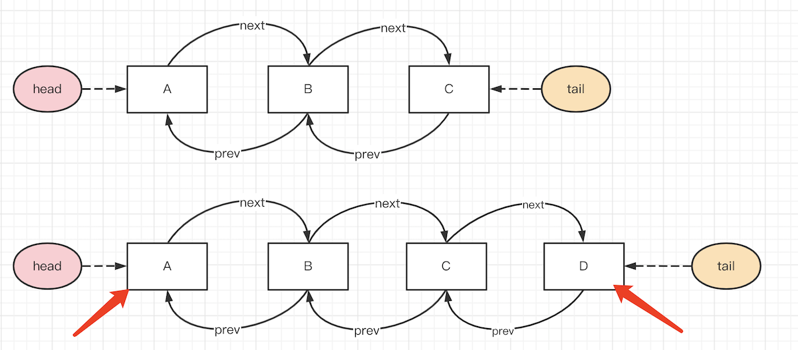
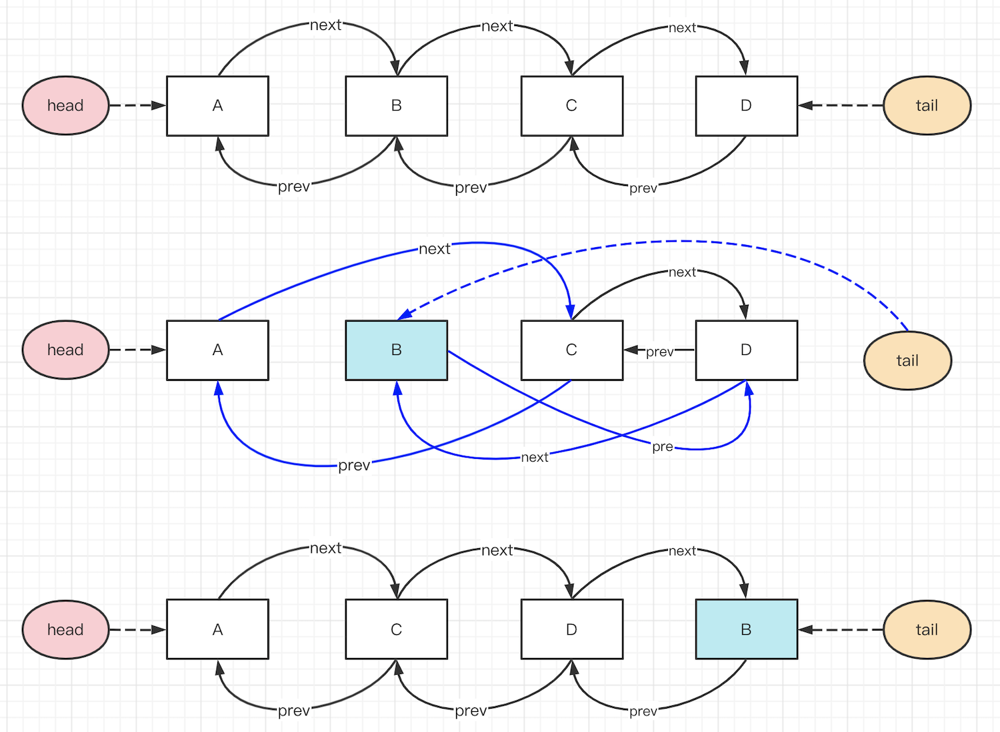

# Array flatten

## 题目

写一个函数，实现 Array flatten 扁平化，只减少一个嵌套层级<br>
例如输入 `[1, 2, [3, 4, [100, 200], 5], 6]` 返回 `[1, 2, 3, 4, [100, 200], 5, 6]`

## 解答

- 遍历数组
- 如果 item 是数字，则累加
- 如果 item 是数组，则 forEach 累加其元素

代码参考 array-flatten.ts

## 连环问：如果想要彻底扁平，忽略所有嵌套层级？

像 lodash [flattenDepth](https://www.lodashjs.com/docs/lodash.flattenDepth) ，例如输入 `[1, 2, [3, 4, [100, 200], 5], 6]` 返回 `[1, 2, 3, 4, 100, 200, 5, 6]`

最容易想到的解决方案就是**递归**，代码参考 array-flatten-deep.ts （注意单元测试，有全面的数据类型）

还有一种 hack 的方式 `toString` —— 但遇到引用类型的 item 就不行了。

```js
const nums = [1, 2, [3, 4, [100, 200], 5], 6]
nums.toString() // '1,2,3,4,100,200,5,6'

// 但万一数组元素是 {x: 100} 等引用类型，就不可以了
```

# 类型判断

## 题目

实现一个 `getType` 函数，传入一个变量，能准确的获取它的类型。
如 `number` `string` `function` `object` `array` `map` `regexp` 等。

## 类型判断

常规的类型判断一般用 `typeof` 和 `instanceof` ，但这俩也有一些缺点

- `typeof` 无法继续区分 `object` 类型
- `instanceof` 需要知道构造函数，即需要两个输入

## 枚举不是好方法

你可能觉得 `typeof` 和 `instanceof` 结合起来可以判断，枚举所有的类型。<br>
这并不是一个好方法，因为**手动枚举是不靠谱的**，不具备完整性。<br>
第一，你有可能忽略某些类型，如；第二，ES 有会继续增加新的类型，如 `Symbol` `BigInt`

```ts
function getType(x: any): string {
    if (typeof x === 'object') {
        if (Array.isArray(x)) return 'array'
        if (x instance of Map) return 'map'
        // 继续枚举...
    }
    return typeof x
}
```

## 使用 `Object.prototype.toString`

注意，必须用 `Object.prototype.toString` ，不可以直接用 `toString`。后者可能是子类重写的。

```js
[1, 2].toString() // '1,2' （ 这样使用的其实是 Array.prototype.toString ）
Object.prototype.toString.call([1, 2]) // '[object Array]'
```

代码参考 get-type.ts

# 手写 new

## 题目

new 一个对象内部发生了什么，手写代码表示

## class 是语法糖

ES6 使用 class 代替了 ES6 的构造函数

```js
class Foo {
    constructor(name) {
        this.name = name
        this.city = '北京'
    }
    getName() {
        return this.name
    }
}
const f = new Foo('双越')
```

其实 class 就是一个语法糖，它本质上和构造函数是一样的

```js
function Foo(name) {
    this.name = name
    this.city = '北京'
}
Foo.prototype.getName = function () { // 注意，这里不可以用箭头函数
    return this.name
}
const f = new Foo('双越')
```

## new 一个对象的过程

- 创建一个空对象 obj，继承构造函数的原型
- 执行构造函数（将 obj 作为 this）
- 返回 obj

## 实现 new

代码参考 new.ts

## 面试连环问：Object.create 和 {} 的区别

`Object.create` 可以指定原型，创建一个空对象。<br>
`{}` 就相当于 `Object.create(Object.prototype)` ，即根据 `Object` 原型的空对象。

PS：对 JS 原型和原型链还不了解的需要抓紧恶补。

# 遍历 DOM 树

## 题目

写一个函数遍历 DOM 树，分别用深度优先和广度优先

PS：注意回顾 “Node 和 Element 和区别”

## 深度优先 vs 广度优先


深度优先的结果 `<div> <p> "hello" <b> "world"  注释 <ul> <li> "a" <li> "b"`

广度优先的结果 `<div> <p>  注释 <ul> "hello" <b> <li> <li> "world" "a" "b"`

## 深度优先

一般通过递归实现，代码参考 dom-traverse.ts

## 广度优先

一般通过队列实现，代码参考 dom-traverse.ts

## 解答

- 深度优先，递归
- 广度优先，队列

## 连环问：深度优先可以不用递归吗？

深度优先遍历，可以使用栈代替递归，递归本质上就是栈。代码参考 dom-traverse.ts

递归和非递归哪个更好？

- 递归逻辑更加清晰，但容易出现 `stack overflow` 错误（可使用`尾递归`，编译器有优化）
- 非递归效率更高，但使用栈，逻辑稍微复杂一些

# 手写 LazyMan

## 题目

手写 LazyMan ，实现 `sleep` 和 `eat` 两个方法，支持链式调用。
代码示例：

```js
const me = new LazyMan('双越')
me.eat('苹果').eat('香蕉').sleep(5).eat('葡萄') // 打印结果如下：

// '双越 eat 苹果'
// '双越 eat 香蕉'
// （等待 5s）
// '双越 eat 葡萄'
```

## 设计 class 框架

```js
class LazyMan {
    private name: string
    constructor(name: string) {
        this.name = name
    }
    eat(x: string) {
        // 打印 eat 行为

        return this // 支持链式调用
    }
    sleep(seconds: number) {
        // 等待 10s 的处理逻辑

        return this // 支持链式调用
    }
}
```

## 处理 sleep 逻辑

初始化一个任务队列，执行 `eat` 和 `sleep` 是都往队列插入一个函数。依次执行队列的任务，遇到 `sleep` 就延迟触发 `next` 。


代码参考 lazy-man.ts

## 总结

- 链式调用
- 任务队列
- 延迟触发

# curry add

## 题目

写一个 `curry` 函数，可以把其他函数转为 curry 函数

```js
function add(a, b, c) { return a + b + c }
add(1, 2, 3) // 6

const curryAdd = curry(add)
curryAdd(1)(2)(3) // 6
```

## 解答

代码参考 curry.ts

## 总结

- 判断参数长度
- 中间态返回函数，最后返回执行结果
- 如用 this 慎用箭头函数

# 手写 instanceof

## 题目

instanceof 的原理是什么，请用代码来表示

## 原型链


## instanceof 原理

例如 `a instanceof b` 就是：顺着 `a` 的 `__proto__` 链向上找，能否找到 `b.prototype`

代码参考 instanceof.ts

## 总结

- 原型链
- 循环判断

# 手写函数 bind

## 题目

请手写实现函数 bind

## bind 应用

- 返回一个新的函数（旧函数不会更改）
- 绑定 `this` 和部分参数
- 箭头函数，无法改变 `this` ，只能改变参数

```js
function fn(a, b, c) {
    console.log(this, a, b, c)
}
const fn1 = fn.bind({x: 100})
fn1(10, 20, 30) // {x: 100} 10 20 30
const fn2 = fn.bind({x: 100}, 1, 2)
fn2(10, 20, 30) // {x: 100} 1 2 10 （注意第三个参数变成了 10）

fn(10, 20, 30) // window 10 20 30 （旧函数不变）
```

## 解答

代码参考 bind.ts

要点

- 返回新函数
- 拼接参数（bind 参数 + 执行参数）
- 重新绑定 `this`

## 连环问：手写函数 call 和 apply

`bind` 生成新函数，暂不执行。而 `call` `apply` 会直接立即执行函数

- 重新绑定 `this` （箭头函数不支持）
- 传入参数

```js
function fn(a, b, c) {
    console.log(this, a, b, c)
}
fn.call({x: 100}, 10, 20, 30)
fn.apply({x: 100}, [10, 20, 30])
```

代码参考 call-apply.ts

- 使用 `obj.fn` 执行，即可设置 `fn` 执行时的 `this`
- 考虑 `context` 各种情况
- 使用 `symbol` 类型扩展属性 

注意：有些同学用 `call` 来实现 `apply` （反之亦然），这样是不符合面试官期待的。

# 手写 EventBus

Bus 不是“车”，而是“总线”

## 题目

请手写 EventBus 自定义事件，实现 `no` `once` `emit` 和 `off`

## EventBus 功能

```js
const event = new EventBus()

function fn1(a, b) { console.log('fn1', a, b) }
function fn2(a, b) { console.log('fn2', a, b) }
function fn3(a, b) { console.log('fn3', a, b) }

event.on('key1', fn1)
event.on('key1', fn2)
event.once('key1', fn3)
event.on('xxxxxx', fn3)

event.emit('key1', 10, 20) // 触发 fn1 fn2 fn3

event.off('key1', fn1)

event.emit('key1', 100, 200) // 触发 fn2
```

## 实现

- `class` 结构
- 注意区分 `on` 和 `off`

代码参考 event-bus.ts

## 连环问：EventBus 里的数组可以换成 Set 吗？

数组和 Set 比较 （除了语法 API）

- 数组，有序结构，查找、中间插入、中间删除比较慢
- Set 不可排序的，插入和删除都很快

Set 初始化或者 `add` 时是一个有序结构，但它无法再次排序，没有 `index` 也没有 `sort` 等 API 

验证

- 生成一个大数组，验证 `push` `unshift` `includes` `splice`
- 生成一个大 Set ，验证 `add` `delete` `has`

答案：不可以，Set 是不可排序的，如再增加一些“权重”之类的需求，将不好实现。

## Map 和 Object

Object 是无序的

```js
const data1 = {'1':'aaa','2':'bbb','3':'ccc','测试':'000'}
Object.keys(data1) // ["1", "2", "3", "测试"]
const data2 = {'测试':'000','1':'aaa','3':'ccc','2':'bbb'};
Object.keys(data2); // ["1", "2", "3", "测试"]
```

Map 是有序的

```js
const m1 = new Map([
    ['1', 'aaa'],
    ['2', 'bbb'],
    ['3', 'ccc'],
    ['测试', '000']
])
m1.forEach((val, key) => { console.log(key, val) })
const m2 = new Map([
    ['测试', '000'],
    ['1', 'aaa'],
    ['3', 'ccc'],
    ['2', 'bbb']
])
m2.forEach((val, key) => { console.log(key, val) })
```

另外，**Map 虽然是有序的，但它的 `get` `set` `delete` 速度非常快**，和 Object 效率一样。它是被优化过的有序结构。

# 手写 LRU

## 题目

用 JS 实现一个 LRU 缓存

## LRU 使用

Least Recently Used 最近最少使用<br>
即淘汰掉最近最少使用的数据，只保留最近经常使用的资源。它是一个固定容量的缓存容器。

```js
const lruCache = new LRUCache(2); // 最大缓存长度 2
lruCache.set(1, 1); // 缓存是 {1=1}
lruCache.set(2, 2); // 缓存是 {1=1, 2=2}
lruCache.get(1);    // 返回 1
lruCache.set(3, 3); // 该操作会使得关键字 2 作废，缓存是 {1=1, 3=3}
lruCache.get(2);    // 返回 null
lruCache.set(4, 4); // 该操作会使得关键字 1 作废，缓存是 {4=4, 3=3}
lruCache.get(1);    // 返回 null
lruCache.get(3);    // 返回 3
lruCache.get(4);    // 返回 4
```

## 分析

- 哈希表，即 `{ k1: v1, k2: v2, ... }` 形式。可以 `O(1)` 事件复杂度存取 `key` `value`
- 有序。可以根据最近使用情况清理缓存

JS 内置的数据结构类型 `Object` `Array` `Set` `Map` ，恰好 `Map` 符合这两条要求

## Map 是有序的

Map 有序，Object 无序

## 实现

代码参考 LRU.ts

注意，`get` `set` 时都要把操作数据移动到 Map 最新的位置。

## 扩展

实际项目中可以使用第三方 lib

- https://www.npmjs.com/package/quick-lru
- https://www.npmjs.com/package/lru-cache
- https://www.npmjs.com/package/tiny-lru
- https://www.npmjs.com/package/mnemonist

## 连环问：不用 Map 如何实现 LRU cache ？

LRU cache 是很早就有的算法，而 Map 仅仅是这几年才加入的 ES 语法。

### 使用 Object 和 Array

根据上文的分析，两个条件

- 哈希表，可以用 `Object` 实现
- 有序，可以用 `Array` 实现

```js
// 执行 lru.set('a', 1) lru.set('b', 2) lru.set('c', 3) 后的数据

const obj1 = { value: 1, key: 'a' }
const obj2 = { value: 2, key: 'b' }
const obj3 = { value: 3, key: 'c' }

const data = [obj1, obj2, obj3]
const map = { 'a': obj1, 'b': obj2, 'c': obj3 }
```

模拟 `get` `set` 操作，会发现几个问题，都来自于数组

- 超出 cache 容量时，要移除最早的元素，数组 `shift` 效率低
- 每次 `get` `set` 时都要把当前元素移动到最新的位置，数组 `splice` 效率低

### Array 改为双向链表

数组有问题，就需要使用新的数据结构 **双向链表**

```ts
Interface INode {
    value: any
    next?: INode
    prev?: INode
}
```

双向链表可以快速移动元素。末尾新增元素 D 很简单，开头删除 A 元素也很简单。



要把中间的元素 B 移动到最后（如 LRU `set` `get` 时移动数据位置），只需要修改前后的指针即可，效率很高。



### 实现

代码参考 LRU2.ts

注意事项

- 数据结构如何定义，`data` 和链表分别存储什么
- 双向链表的操作（非常繁琐，写代码很容易出错，逻辑一定要清晰！！！）
- 链表 `node` 中要存储 `data.key` ，否则删除 `data` 需要遍历、效率低

# 深拷贝

## 题目

手写 JS 深拷贝

## 分析

这是一个很常见的问题，看似也很简单，但是如果考虑到“高质量代码”的要求，写起来还是挺麻烦的。<br>
别说写代码，就本节所有的情况你能否考虑全面，这都不一定。

## 错误答案1

使用 `JSON.stringify` 和 `JSON.parse`

- 无法转换函数
- 无法转换 `Map` `Set`
- 无法转换循环引用

PS：其实普通对象使用 JSON API 的运算速度很快，但功能不全

## 错误答案2

使用 `Object.assign` —— 这根本就不是深拷贝，是浅拷贝 ！！！

## 错误答案3

只考虑了普通的对象和数组

- 无法转换 `Map` `Set`
- 无法转换循环引用

## 正确答案

参考代码 clone-deep.ts

---

循环引用
Map Set 函数

# DOM 转 VDOM

注：文字小节

## 题目

讲以下 DOM 结构转换为 vnode 数据

```html
<div id="div1" style="border: 1px solid #ccc; padding: 10px;">
    <p>一行文字<a href="xxx.html" target="_blank">链接</a></p>
    
    <button click="clickHandler">点击</button>
</div>
```

## 答案

vdom 就是用 JS 对象的形式来表示 DOM 结构。vnode 即对应着 DOM 结构的一个 node 节点。

```js
const vnode = {
    tag: 'div', // <div>
    data: {
        id: 'div1',
        style: {
            'border': '1px solid #ccc',
            'padding': '10px'
        }
    },
    children: [
        {
            tag: 'p', // <p>
            data: {},
            children: [
                '一行文字',
                {
                    tag: 'a', // <a>
                    data: {
                        href: 'xxx.html',
                        target: '_blank'
                    },
                    children: ['链接']
                }
            ]
        },
        {
            tag: 'img', // 
            data: {
                className: 'image', // 注意，这里要用 className
                src: 'xxx.png',
                alt: '图片'
            }
        },
        {
            tag: 'button', // <button>
            data: {
                events: {
                    click: clickHandler
                }
            }
            children: ['点击']
        }
    ]
}
```

## 注意事项

- vdom 结构没有固定的标准，例如 `tag` 可以改为 `name` ，`data` 可以改为 `props` 。只要能合理使用 JS 数据表达 DOM 即可。
- `style` 和 `events` 要以对象的形式，更易读，更易扩展
- `class` 是 ES 内置关键字，要改为 `className` 。其他的还有如 `for` 改为 `htmlFor`