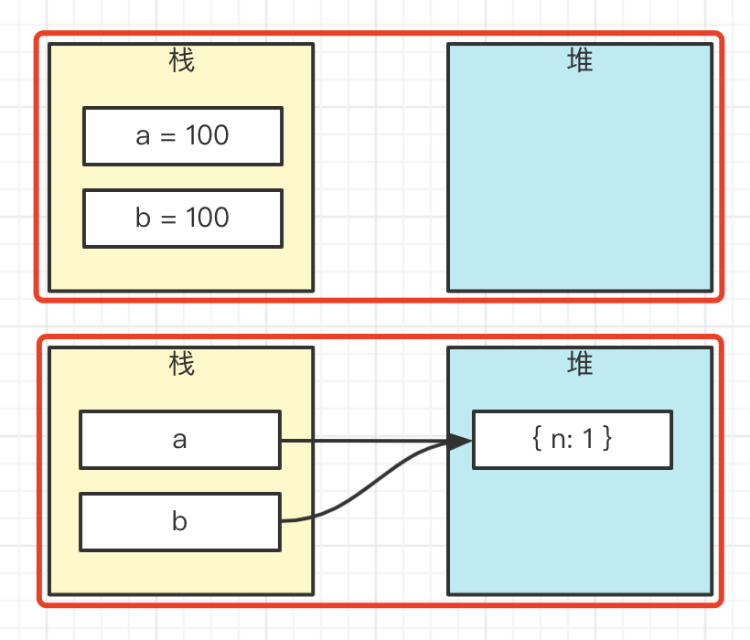
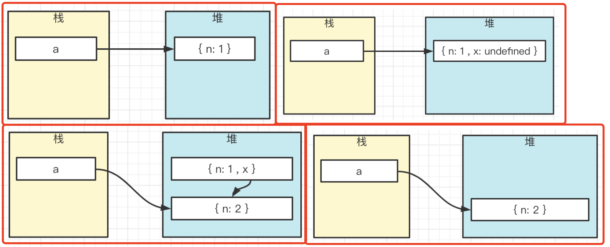

# 1.数组转树

## 1.1题目

定义一个 `convert` 函数，将以下数组转换为树结构。

```js
const arr = [
    { id: 1, name: '部门A', parentId: 0 }, // 0 代表顶级节点，无父节点
    { id: 2, name: '部门B', parentId: 1 },
    { id: 3, name: '部门C', parentId: 1 },
    { id: 4, name: '部门D', parentId: 2 },
    { id: 5, name: '部门E', parentId: 2 },
    { id: 6, name: '部门F', parentId: 3 },
]
```


## 1.2分析

定义树节点的数据结构

```ts
interface ITreeNode {
    id: number
    name: string
    children?: ITreeNode[]
}
```

遍历数组，针对每个元素

- 生成 tree node
- 找到 parentNode 并加入到它的 `children`

找 parentNode 时，需要根据 `id` 能**尽快**找到 tree node。需要一个 map ，这样时间复杂度是 `O(1)` 。否则就需要遍历查找，时间复杂度高。

## 1.3实现

```ts
interface IArrayItem {
    id: number
    name: string
    parentId: number
}

interface ITreeNode {
    id: number
    name: string
    children?: ITreeNode[]
}

function convert(arr: IArrayItem[]): ITreeNode | null {
    // 用于 id 和 treeNode 的映射
    const idToTreeNode: Map<number, ITreeNode> = new Map()

    let root = null

    arr.forEach(item => {
        const { id, name, parentId } = item

        // 定义 tree node 并加入 map
        const treeNode: ITreeNode = { id, name }
        idToTreeNode.set(id, treeNode)

        // 找到 parentNode 并加入到它的 children
        const parentNode = idToTreeNode.get(parentId)
        if (parentNode) {
            if (parentNode.children == null) parentNode.children = []
            parentNode.children.push(treeNode)
        }

        // 找到根节点
        if (parentId === 0) root = treeNode
    })

    return root
}

const arr = [
    { id: 1, name: '部门A', parentId: 0 }, // 0 代表顶级节点，无父节点
    { id: 2, name: '部门B', parentId: 1 },
    { id: 3, name: '部门C', parentId: 1 },
    { id: 4, name: '部门D', parentId: 2 },
    { id: 5, name: '部门E', parentId: 2 },
    { id: 6, name: '部门F', parentId: 3 },
]
const tree = convert(arr)
console.info(tree)
```

## 1.4扩展

- 数组：像是关系型数据库，如MySQL
- 树：像是文档型数据库，如Mongodb

# 2.树转数组

## 2.1题目

定义一个 `convert` 函数，将以下对象转换为数组

```js
const obj = {
    id: 1,
    name: '部门A',
    children: [
        {
            id: 2,
            name: '部门B',
            children: [
                { id: 4, name: '部门D' },
                { id: 5, name: '部门E' }
            ]
        },
        {
            id: 3,
            name: '部门C',
            children: [{ id: 6, name: '部门F' }]
        }
    ]
}
```

```js
[
    { id: 1, name: '部门A', parentId: 0 }, // 0 代表顶级节点，无父节点
    { id: 2, name: '部门B', parentId: 1 },
    { id: 3, name: '部门C', parentId: 1 },
    { id: 4, name: '部门D', parentId: 2 },
    { id: 5, name: '部门E', parentId: 2 },
    { id: 6, name: '部门F', parentId: 3 },
]
```

## 2.2分析

根据数组的顺序，需要**广度优先**遍历树

要快速获取 `parentId` 需要存储 `nodeToParent` map 结构。

## 2.3实现

- 遍历树节点（广度优先）
- 将树节点转为Array Item，push到数组
- 根据父子关系，找到Array Item的parentId

```ts
interface IArrayItem {
    id: number
    name: string
    parentId: number
}

interface ITreeNode {
    id: number
    name: string
    children?: ITreeNode[]
}

function convert1(root: ITreeNode): IArrayItem[] {
    // Map
    const nodeToParent: Map<ITreeNode, ITreeNode> = new Map()

    const arr: IArrayItem[] = []

    // 广度优先遍历，queue
    const queue: ITreeNode[] = []
    queue.unshift(root) // 根节点 入队

    while (queue.length > 0) {
        const curNode = queue.pop() // 出队
        if (curNode == null) break

        const { id, name, children = [] } = curNode

        // 创建数组 item 并 push
        const parentNode = nodeToParent.get(curNode)
        const parentId = parentNode?.id || 0
        const item = { id, name, parentId }
        arr.push(item)

        // 子节点入队
        children.forEach(child => {
            // 映射 parent
            nodeToParent.set(child, curNode)
            // 入队
            queue.unshift(child)
        })
    }

    return arr
}

const obj = {
    id: 1,
    name: '部门A',
    children: [
        {
            id: 2,
            name: '部门B',
            children: [
                { id: 4, name: '部门D' },
                { id: 5, name: '部门E' }
            ]
        },
        {
            id: 3,
            name: '部门C',
            children: [
                { id: 6, name: '部门F' }
            ]
        }
    ]
}
const arr1 = convert1(obj)
console.info(arr1)
```


# 3.map parseInt

## 3.1题目

`['1', '2', '3'].map(parseInt)` 输出什么？

## 3.2parseInt

`parseInt(string, radix)` 解析一个字符串并返回指定基数的**十进制**整数

- `string` 要解析的字符串
- `radix` 可选参数，数字基数（即进制），范围为 2-36

示例

```js
parseInt('11', 1) // NaN ，1 非法，不在 2-36 范围之内
parseInt('11', 2) // 3 = 1*2 + 1
parseInt('3', 2) // NaN ，2 进制中不存在 3
parseInt('11', 3) // 4 = 1*3 + 1
parseInt('11', 8) // 9 = 1*8 + 1
parseInt('9', 8) // NaN ，8 进制中不存在 9
parseInt('11', 10) // 11
parseInt('A', 16) // 10 ，超过 10 进制，个位数就是 1 2 3 4 5 6 7 8 9 A B C D ...
parseInt('F', 16) // 15
parseInt('G', 16) // NaN ，16 进制个位数最多是 F ，不存在 G
parseInt('1F', 16) // 31 = 1*16 + F
```

## 3.3radix == null 或者 radix === 0

- 如果 `string` 以 `0x` 开头，则按照 16 进制处理，例如 `parseInt('0x1F')` 等同于 `parseInt('1F', 16)`
- 如果 `string` 以 `0` 开头，则按照 8 进制处理 —— **ES5 之后就取消了，改为按 10 进制处理，但不是所有浏览器都这样，一定注意！！！**
- 其他情况，按 10 进制处理

## 3.4分析代码

题目代码可以拆解为

```js
const arr = ['1', '2', '3']
const res = arr.map((s, index) => {
    console.log(`s is ${s}, index is ${index}`)
    return parseInt(s, index)
})
console.log(res)
```

分析执行过程

```js
parseInt('1', 0) // 1 ，radix === 0 按 10 进制处理
parseInt('2', 1) // NaN ，radix === 1 非法（不在 2-36 之内）
parseInt('3', 2) // NaN ，2 进制中没有 3
```

## 3.5答案

```js
['1', '2', '3'].map(parseInt) // [1, NaN, NaN]
```

## 3.6划重点

- 要知道 `parseInt` 参数的定义
- 把代码拆解到最细粒度，再逐步分析

## 3.7扩展

为何 eslint 建议 `partInt` 要指定 `radix`（第二个参数）？因为 `parseInt('011')` 无法确定是 8 进制还是 10 进制，因此必须给出明确指示。

# 4.原型

## 4.1题目

以下代码，执行会输出什么？

```js
function Foo() {
    Foo.a = function() { console.log(1) }
    this.a = function() { console.log(2) }
}
Foo.prototype.a = function() { console.log(3) }
Foo.a = function() { console.log(4) }

Foo.a()
let obj = new Foo()//只有执行new时，才去关注函数内部的代码
obj.a()
Foo.a()
```

## 4.2分析

把自己想象成 JS 引擎，你不是在读代码，而是在执行代码 —— 定义的函数如果不执行，就不要去看它的内容 —— 这很重要！！！

按这个思路来“执行”代码

## 4.3原型


## 4.4答案

执行输出 `4 2 1`

## 4.5重点

- 原型基础知识
- 你不是在读代码，而是在模拟执行代码

# 5.promise

## 5.1题目

以下代码，执行会输出什么

```js
Promise.resolve().then(() => {
    console.log(0)
    return Promise.resolve(4)
}).then((res) => {
    console.log(res)
})

Promise.resolve().then(() => {
    console.log(1)
}).then(() => {
    console.log(2)
}).then(() => {
    console.log(3)
}).then(() => {
    console.log(5)
}).then(() =>{
    console.log(6)
})
```

## 5.2这道题很难

网上有很多文章介绍这道题，都没有给出清晰的答案。

被称为“令人失眠的”题目

## 5.3回顾

- 单线程和异步
- 事件循环Event Loop
- 宏任务 微任务

## 5.4then 交替执行

如果有多个 fulfilled 状态的 promise 实例，同时执行 then 链式调用，则then 会交替调用执行。这是编译器的优化，防止一个 promise 持续占据事件。

```js
Promise.resolve().then(() => {
    console.log(1)
}).then(() => {
    console.log(2)
}).then(() => {
    console.log(3)
}).then(() => {
    console.log(4)
})

Promise.resolve().then(() => {
    console.log(10)
}).then(() => {
    console.log(20)
}).then(() => {
    console.log(30)
}).then(() => {
    console.log(40)
})

Promise.resolve().then(() => {
    console.log(100)
}).then(() => {
    console.log(200)
}).then(() => {
    console.log(300)
}).then(() => {
    console.log(400)
})
输出：1 10 100 2 20 200 3 30 300 4 40 400 
```

## 5.5then 返回 promise 对象

当 then 返回 promise 对象时，可以认为是多出一个 promise 实例。

```js
Promise.resolve().then(() => {
    console.log(1)
    return Promise.resolve(100) // 相当于多处一个 promise 实例，如下注释的代码
}).then(res => {
    console.log(res)
}).then(() => {
    console.log(200)
}).then(() => {
    console.log(300)
}).then(() => {
    console.log(300)
})

Promise.resolve().then(() => {
    console.log(10)
}).then(() => {
    console.log(20)
}).then(() => {
    console.log(30)
}).then(() => {
    console.log(40)
})

// // 相当于新增一个 promise 实例 —— 但这个执行结果不一样，后面解释
// Promise.resolve(100).then(res => {
//     console.log(res)
// }).then(() => {
//     console.log(200)
// }).then(() => {
//     console.log(300)
// }).then(() => {
//     console.log(400)
// })
```

## 5.6“慢两拍”

then 返回 promise 实例和直接执行 `Promise.resolve()` 不一样，它需要等待两个过程

- promise 状态由 pending 变为 fulfilled
- then 函数挂载到 microTaskQueue

所以，它变现的会“慢两拍”。可以理解为

```js
Promise.resolve().then(() => {
    console.log(1)
})

Promise.resolve().then(() => {
    console.log(10)
}).then(() => {
    console.log(20)
}).then(() => {
    console.log(30)
}).then(() => {
    console.log(40)
})

Promise.resolve().then(() => {
    // 第一拍
    const p = Promise.resolve(100)
    Promise.resolve().then(() => {
        // 第二拍
        p.then(res => {
            console.log(res)
        }).then(() => {
            console.log(200)
        }).then(() => {
            console.log(300)
        }).then(() => {
            console.log(400)
        })
    })
})
```

## 5.7答案

题目代码输出的结果是 `1 2 3 4 5 6`

## 5.8重点

- 熟悉基础知识：事件循环 宏任务 微任务
- then 交替执行
- then 返回 promise 对象时“慢两拍”

PS：这里一直在微任务环境下，如果加入宏任务就不一样了。

# 6.setState

## 6.1题目

React 中以下代码会输出什么

```js
class Example extends React.Component {
    constructor() {
      super()
      this.state = { val: 0 }
    }
  
    componentDidMount() {
      // this.state.val 初始值是 0 

      this.setState({val: this.state.val + 1})
      console.log(this.state.val)
  
      this.setState({val: this.state.val + 1})
      console.log(this.state.val)
  
      setTimeout(() => {
        this.setState({val: this.state.val + 1})
        console.log(this.state.val)
  
        this.setState({val: this.state.val + 1})
        console.log(this.state.val)
      }, 0)
    }
  
    render() {
      return <p>{this.state.val}</p>
    }
}
```

## 6.2setState 默认异步更新

```js
componentDidMount() {
  this.setState({val: this.state.val + 1}, () => {
    // 回调函数可以拿到最新值
    console.log('callback', this.state.val)
  })
  console.log(this.state.val) // 拿不到最新值
}
```

## 6.3setState 默认会合并

多次执行，最后 render 结果还是 `1`

```js
componentDidMount() {
  this.setState({val: this.state.val + 1})
  this.setState({val: this.state.val + 1})
  this.setState({val: this.state.val + 1})
}
```

## 6.4setState 有时同步更新

根据 `setState` 的**触发时机是否受 React 控制**

如果触发时机在 React 所控制的范围之内，则**异步更新**

- 生命周期内触发
- React JSX 事件内触发

如果触发时机不在 React 所控制的范围之内，则**同步更新**

- setTimeout setInterval
- 自定义的 DOM 事件

```ts
// 手动 DOM 事件
document.getElementById('p1').addEventListener('click', () => {
    this.setState({val: this.state.val + 1})
    console.log('e----', this.state.val)
})
```

- Promise then
- ajax 网络请求回调

## 6.5setState 有时不会合并

第一，同步更新，不会合并

第二，传入函数，不会合并 （对象可以 `Object.assign`，函数无法合并）

```js
this.setState((prevState, props) => {
  return { val: prevState.val + 1 }
})
```

## 6.6答案

题目代码执行打印 `0 0 2 3`

## 6.7重点

`setState` 是 React 最重要的 API ，三点：

- 使用不可变数据
- 合并 vs 不合并
- 异步更新 vs 同步更新

## 6.8setState是微任务还是宏任务

- setState是同步执行，state都是同步更新
- 即，在微任务promise.then开始之前，state已经计算完了
- 同步，不是微任务或宏任务

# 7.对象赋值

## 7.1题目

以下代码，运行会输出什么

```js
let a = { n: 1 }
let b = a
a.x = a = { n: 2 }

console.log(a.x) 	
console.log(b.x)
```

## 7.2值类型 vs 引用类型

```js
let a = 100
let b = a

let a = { n: 1 }
let b = a
```



## 7.3连续赋值

连续赋值是倒序执行（从右往左执行）。PS：日常工作不可用连续赋值，可读性差

```js
let n1, n2
n1 = n2 = 100

// // 相当于
// n2 = 100
// n1 = n2
```

## 7.4`.` 优先级更高

```js
let a = {}
a.x = 100

// 可拆解为：
// 1. a.x = undefined // 初始化 a.x 属性
// 2. a.x = 100 // 为 x 属性赋值

```

再看下面的例子

```js
let a = { n: 1 }
a.x = a = { n: 2 }

// 可以拆解为（.的优先级更高，因此先执行）
// a.x = undefined
// let x = a.x // x 变量是假想的，实际执行时不会有
// x = a = { n: 2 }
```



## 答案

题目代码执行打印 `undefined` 和 `{ n: 2 }`

其实把 `a.x = a = { n: 2 }` 换成 `b.x = a = { n: 2 }` 更好理解

或者把连续赋值拆分为 `a.x = { n: 2 }; a = { n: 2 }` （优先级高的，先执行）

## 重点

- 值类型和引用类型，堆栈模型
- 连续赋值（`.` 优先级更高）

PS：日常工作不可用连续赋值，可读性差

# 8.对象属性赋值

## 8.1题目

执行以下代码，会输出什么

```js
// example1
let a = {}, b = '123', c = 123
a[b] = 'b'
a[c] = 'c'
console.log(a[b]) // c

// example 2
let a = {}, b = Symbol('123'), c = Symbol('123')
a[b] = 'b'
a[c] = 'c'
console.log(a[b]) // b

// example 3
let a = {}, b = { key:'123' }, c = { key:'456' }
a[b] = 'b' // '[object Object]'都是字符串
a[c] = 'c' // '[object Object]'
console.log(a[b]) // c
```

## 8.2对象的 key

- 对象的键名只能是字符串和 Symbol 类型
- 其他类型的键名会被转换成字符串类型
- 对象转字符串默认会调用 `toString` 方法

```js
const obj = {}
obj[0] = 100

const x = { s: 'abc' }
obj[x] = 200

const y = Symbol()
obj[y] = 300

const z = true
obj[z] = 400

Object.keys(obj) // ['0', '[object Object]', 'true']
```

有些类数组的结构是 `{ 0: x, 1: y, 2: z, length: 3 }` ，如 `document.getElementsByTagName('div')`。实际上它的 key 是 `['0', '1', '2', 'length']`

## 答案

题目代码执行分别打印 `'c' 'b' 'c'`

## 扩展：Map 和 WeakMap

- Map 可以用任何类型值作为 `key`
- WeakMap 只能使用引用类型作为 `key` ，不能是值类型

# 9.函数参数

## 9.1题目

运行以下代码，会输出什么

```js
function changeArg(x) { x = 200 }

let num = 100
changeArg(num)
console.log('changeArg num', num)

let obj = { name: '双越' }
changeArg(obj)
console.log('changeArg obj', obj)

function changeArgProp(x) {
    x.name = '张三'
}
changeArgProp(obj)
console.log('changeArgProp obj', obj)
```

## 9.2分析

调用函数，传递参数 —— **赋值**传递

```js
function fn(x, y) {
    // 继续操作 x y
}
const num = 100
const obj = { name: '双越' }
fn(num, obj)
```

以上代码相当于

```js
const num = 100
const obj = { name: '双越' }

let x = num
let y = obj
// 继续操作 x y
```

## 9.3解题

执行题目代码分别输出 `100  {name: '双越'}  {name: '张三'}`

## 9.4扩展

eslint 规则建议：函数参数当作一个 `const` 常量，不要修改函数参数 —— 这样代码更易读

# 10.解决问题的常见思路

## 举例

例如“数组转树”和“树转数组”两个问题，题目直接给出了示例，就很好理解。
如果你遇到一些搞不懂逻辑的问题，可以举几个例子。对比输入和输出，即可找出变化的规律。

另外，对于面试官出的问题，如果没有示例，你可以举几个示例让面试官确认，这样可以保证自己理解正确。

## 画图

遇到比较抽象的问题，拿纸币画图，把抽象变为形象，更容易找出突破口。
课程很多算法问题我们都是通过画图解决的。

## 拆解

例如 `['1', '2', '3'].map(parseInt)` ，把代码拆解到最细的力度，就很容易定位问题。

```js
const arr = ['1', '2', '3']
const res = arr.map((s, index) => {
    // console.log(`s is ${s}, index is ${index}`)
    return parseInt(s, index)
})
console.log(res)
```

## 识破本质

不要被问题看似复杂的表象所迷惑，要尝试去找出问题的本质，找出问题的考点。
例如下面对象属性赋值的问题，考点就是对象 key 的数据类型。

```js
let a = {}, b = '123', c = 123
a[b] = 'b'
a[c] = 'c'
console.log(a[b])
```