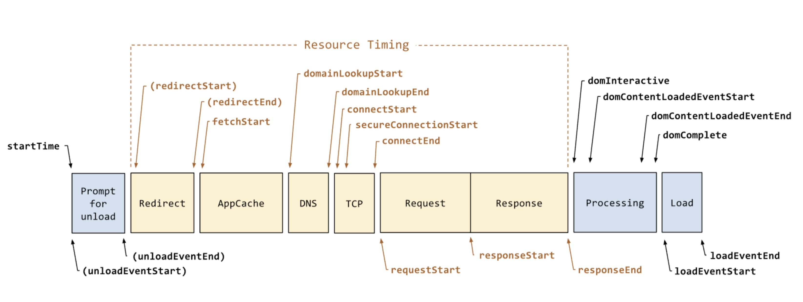
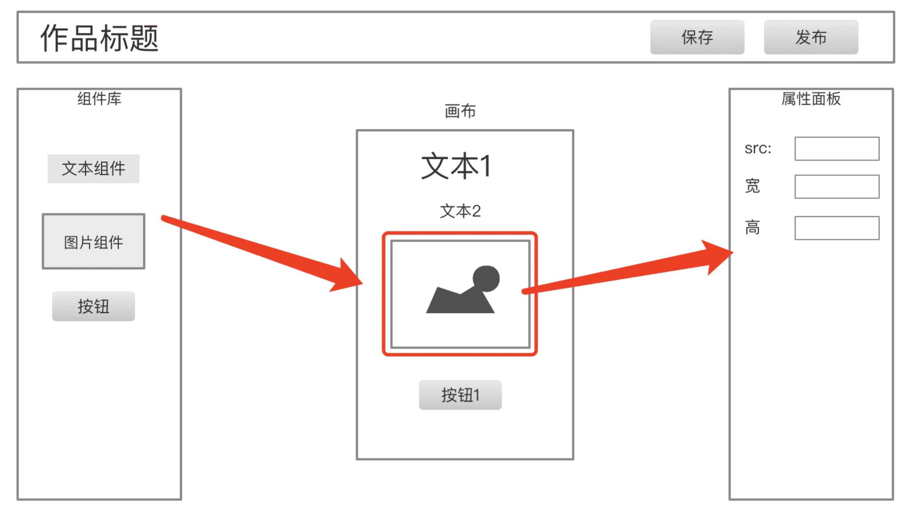

# 1.项目负责人的职责

注：文字小节

## 题目

作为项目前端技术负责人，主要的职责是什么？

## 目标

项目前端技术负责人，将负责和项目前端开发相关的所有事情，不仅仅是前端范围内的，也不仅仅是开发的事宜。

目标：保证项目按时、按质量的交付上线，以及上线之后的安全稳定运行。

## 职责

### 把控需求

新项目开始、或者新功能模块开始时要参与需求评审，认真审阅需求的详细内容，给出评审意见，提出问题。自己已经同意的需求要能保证按时、按质量的完成。

评审需求需要你能深入理解项目的业务，不仅仅是自己负责的功能，还有上下游全局的串联。所以，一入职的新人无论技术能力多好，都无法立刻作为项目技术负责人，他还需要一段时间的业务积累和熟练。PS：除非他在其他公司已经是这个方面的业务专家。

需求评审之后，还可能有 UI 设计图的评审，也要参与，提出自己的意见和问题。保证评审通过的 UI 设计图都能保质保量的开发出来。

需求和 UI 设计图评审完之后，还要给出开发的排期。此时要全面考虑，不仅仅要考虑开发时间，还有内部测试、单元测试的时间，以及考虑一些延期的风险，多加几天的缓冲期。

最后，在项目进行过程中，老板或者 PM 有可能中途插入新需求。此时要积极沟通，重新评估，还要争取延长项目开发周期。需求增加了，肯定周期也要延长一些。

### 技术方案设计

> 需求指导设计，设计指导开发。

需求和 UI 设计图确定之后，要先进行技术方案设计，写设计文档，评审，通过之后再开发。技术方案设计应该包含核心数据结构的设计，核心流程的设计，核心功能模块的组织和实现。评审时看看这些有没有不合理、隐患、或者和别人开发重复了。

技术方案设计还要包括和其他对接方的，如和服务端、客户端的接口格式。也要叫他们一起参与评审，待他们同意之后再开发。

### 开发

作为技术负责人，不应该把自己的主要精力放在代码开发上，但也不能完全不写代码。
应该去写一些通用能力，核心功能，底层逻辑的代码。其他比较简单的业务代码，可以交给项目成员来完成。

### 监督代码质量

技术负责人，可能会带领好多人一起编写代码，但他要把控整个项目的代码质量。例如：

- 制定代码规范
- 定期组织代码审核
- CI 时使用自动化单元测试

### 跟踪进度

每天都组织 10 分钟站会，收集当前的进度、风险和问题。如有延期风险，要及时汇报。

不仅仅要关心前端开发的进度，还要关心上下游。例如上游的 UI 设计图延期，将会导致前端开发时间不够，进而导致测试时间不够，甚至整个项目延期。

### 稳定安全的运行

上线之后，要能实时把控项目运行状态，是否稳定、安全的运行。万一遇到问题，要第一时间报警。

所以，项目中要增加各种统计和监控功能，例如流量统计、性能统计、错误监控，还有及时报警的机制。

## 总结

- 把控需求
- 技术方案设计
- 开发
- 监督代码质量
- 跟踪进度
- 稳定安全的运行

# 2.前端统计 sdk

## 2.1题目

要让你设计一个前端统计 SDK ，你会如何设计？

## 2.2分析

前端统计的范围

- 访问量 PV
- 自定义事件（如统计一个按钮被点击了多少次）
- 性能
- 错误

统计数据的流程 （只做前端 SDK ，但是要了解全局）

- 前端发送统计数据给服务端
- 服务端接受，并处理统计数据
- 查看统计结果

## 2.3代码结构

SDK 要用于多个不同的产品，所以初始化要传入 `productId`

```js
class MyStatistic {
    private productId: number

    constructor(productId: number = 0) {
        if (productId <= 0) {
            throw new Error('productId is invalid')
        }
        this.productId = productId // 产品 id （SDK 会被用于多个产品）

        this.initPerformance() // 性能统计
        this.initError() // 监听错误
    }
    private send(url: string, paramObj: object = {}) {
        // TODO 发送统计数据
    }
    private initPerformance() {
        // TODO 性能统计
    }
    private initError() {
        // TODO 监听全局错误（有些错误需要主动传递过来，如 Vue React try-catch 的）
    }
    pv() {
        // TODO 访问量 PV 统计
    }
    event(key: string, value: string) {
        // TODO 自定义事件
    }
    error(key: string, info: object = {}) {
        // TODO 错误统计
    }
}
```

用户使用

```js
const myStatistic = new MyStatistic('abc')
```

## 2.4发送数据

发送统计数据，用 `` —— 浏览器兼容性好，没有跨域限制

```js
private send(url: string, paramObj: object = {}) {
    // 追加 productId
    paramObj.productId = this.productId

    // params 参数拼接为字符串
    const paramArr = []
    for (let key in paramObj) {
        const value = paramObj[key]
        paramArr.push(`${key}=${value}`)
    }
		// 用发送：1.可跨域；2.兼容性非常好
    const img = document.createElement('img')
    img.src = `${url}?${paramArr.join('&')}`// 通过get发送出去
}
```

如果再精细一点的优化，`send` 中可以使用 `requestIdleCallback` （兼容使用 `setTimeout`）

## 2.5自定义事件统计

```js
event(key: string, value: string) {
    const url = 'xxx' // 接受自定义事件的 API
    this.send(url, { key, value }) // 发送
}
```

用户使用

```js
// 如需要统计“同意” “不同意” “取消” 三个按钮的点击量，即可使用自定义事件统计
$agreeBtn.click(() => {
    // ...业务逻辑...
    myStatistic.event('some-button', 'agree') // 其他不同的按钮，传递不同的 value (如 'refuse' 'cancel')
})
```

## 2.6访问量 PV

PV 可以通过自定义事件的方式。但是为了避免用户重复发送，需要加一个判断

```js
// 定义一个全局的 Set ，记录已经发送 pv 的 url
const PV_URL_SET = new Set()
```

```js
pv() {
    const href = location.href
    if (PV_URL_SET.has(href)) return// 不重复发送pv

    this.event('pv', '') // 发送 pv

    PV_URL_SET.add(href)
}
```

用户使用

```js
myStatistic.pv()
```

【注意】PV 统计需要让用户自己发送吗，能不能在 DOMContentLoaded 时自动发送？—— 最好让用户发送，因为 SPA 中切换路由也可能发送 PV

## 2.7性能统计

通过 `console.table( performance.timing )` 可以看到网页的各个性能



```js
private initPerformance() {
    const url = 'yyy' // 接受性能统计的 API
    this.send(url, performance.timing) // 全部传给服务端，让服务端去计算结果 —— 统计尽量要最原始数据，不要加工处理
}
```

PS：想要得到全面的性能数据，要在网页加载完成之后（ DOMContentLoaded 或 onload ）去初始化 `myStatistic`

## 2.8错误统计

监听全局操作

```js
private initError() {
    // 全局操作
    window.addEventListener('error', event => {
        const { error, lineno, colno } = event
        this.error(error, { lineno, colno })
    })
    // Promise 未 catch 的报错 （ 参考 unhandledrejection.html ）
    window.addEventListener("unhandledrejection", event => {
        this.error(event.reason)
    })
}
```

被开发这主动收集的错误，需要调用 API 来统计

```js
error(error: Error, info: object = {}) {
    // error 结构 { message, stack }
    // info 是附加信息

    const url = 'zzz' // 接受错误统计的 API
    this.send(url, Object.assign(error, info))
}
```

用户使用

```js
// try catch
try {
    100()
} catch (e) {
    myStatistic.error(e)
}

// Vue 错误监听
app.config.errorHandler = (error, instance, info) => {
    myStatistic.error(error, { info })
}

// React 错误监听
componentDidCatch(error, errorInfo) {
    myStatistic.error(error, { info: errorInfo })
}
```

## 2.9总结

- 自定义事件（包括 PV）
- 性能统计
- 报错统计

PS：以上是一个统计 SDK 的基本估计，可以应对面试，实际工作中还可能需要进一步完善很多细节。

## 2.10sourcemap 有什么作用？该如何配置

遇到 JS 报错的问题，就离不开 sourcemap

### 背景

- JS 上线之前要合并、混淆和压缩。例如 jquery 的线上代码 https://www.bootcdn.cn/jquery/
- 压缩之后，一旦线上有报错，通过行、列根本找不到源代码的位置，不好定位错误
- sourcemap 就是用于解决这个问题。可以看 jquery 的 sourcemap 文件 https://www.jsdelivr.com/package/npm/jquery?path=dist

### 示例

一个网页中引用了 CDN jquery.min.js ，通过 chrome Sources 即可看到之前源码的样子。寻找 sourcemap 有两种方式：1. 同目录下的同名文件；2. js 文件最后一样指定（如 wangEditor js）


### 配置

sourcemap 是在打包、压缩 js 时生成，通过 webpack 的打包工具即可配置。（可以在 `js-code` 代码环境中测试）。webpack 通过 `devtool` 来配置 sourcemap ，有多种选择 https://webpack.docschina.org/configuration/devtool/#devtool

- 不用 `devtool` - 正常打包，不会生成 sourcemap 文件
- `eval` - 所有代码都放在 `eval(...)` 中执行，不生成 sourcemap 文件
- `source-map` - 生成单独的 sourcemap 文件，并在 js 文件最后指定
- `eval-source-map` - 代码都放在 `eval(...)` 中执行，sourcemap 内嵌到 js 代码中，不生成独立的文件
- `inline-source-map` - sourcemap 以 base64 格式插入到 js 末尾，不生成单独的文件
- `cheap-source-map` - sourcemap 只包含行信息，没有列信息（文件体积更小，生成更快）
- `eval-cheap-source-map` - 同上，但是所有代码都放在 `eval(...)` 中执行

推荐

- 开发和测试 `eval` `eval-source-map` `eval-cheap-source-map` —— 追求效率
- 生产环境 `source-map` 或者不产出 sourcemap —— 看个人需求

### 注意

公司实际项目的 sourcemap 可用于内部反查 bug ，但不要泄漏。否则等于源码泄漏了。开源项目的 sourcemap 文件也是开源的。

只需要了解 sourcemap 的作用和配置即可，原理不用掌握。

- 安装npm包来反解sourcemap文件

# 3.SPA MPA

## 3.1题目

何时用 SPA 何时用 MPA ？

## 3.2分析

- SPA - Single-page Application 单页面应用，只有一个 html 文件，用前端路由切换功能
- MPA - Multi-page Application 多页面应用，每个页面是单独的 html 文件

现在基于 React Vue 开发时，大部分产出的都是 SPA ，很少会产出 MPA 。但并不是所有的场景都适用于 SPA ，项目设计时要确定好，否则后面不好改。

## 3.3SPA 适用于一个综合应用

特点

- 功能较多，一个界面展示不完
- 以操作为主，不是以展示为主

举例

- 大型的后台管理系统（阿里云的管理后台）
- 知识库（语雀、腾讯文档）
- 功能较复杂的 WebApp（外卖）

## 3.4MPA 适用于孤立的页面

特点

- 功能较少，一个页面展示得开
- 以展示为主，而非操作

举例

- 分享页（微信公众号文章）
- 新闻 App 里的落地页（有可能是用 H5 + hybrid 开发的）

## 3.5Webpack 打包

```js
const path = require('path');
const HtmlWebpackPlugin = require('html-webpack-plugin');
const { CleanWebpackPlugin } = require('clean-webpack-plugin');

module.exports = {
  mode: 'production',
  // 多入口
  entry: {
    home: './src/home/index.js',
    product: './src/product/index.js',
    about: './src/about/index.js'
  },
  output: {
    filename: 'js/[name].[contentHash].js', // name 即 entry 的 key
    path: path.resolve(__dirname, './dist')
  },
  plugins: [
    new CleanWebpackPlugin(),

    // 三个页面
    new HtmlWebpackPlugin({
      title: '首页',
      template: './template/index.html',
      filename: 'home.html',
      chunks: ['home']
    }),
    new HtmlWebpackPlugin({
      title: '产品',
      template: './template/product.html',
      filename: 'product.html',
      chunks: ['product']
    }),
    new HtmlWebpackPlugin({
      title: '关于',
      template: './template/about.html',
      filename: 'about.html',
      chunks: ['about']
    })
  ]
}
```

## 3.6扩展：技术是一回事，怎么做是另外的事儿

讲一个故事，说明这个问题，请大家注意。

我之前的一个同事，他技术很好。
我就问他一个问题：你觉得在项目发布之前，最需要做的是什么？他回复是：1. 扩展性还不太好，得增强一下；2. 解决当前的 bug 。

然后我继续追问：1. 你觉得扩展性不好用，是扩展什么功能不好用，举个例子来说明？2. 目前记录的这些 bug ，那几个是高优的？然后他没有回答出来。

技术人员有这个想法很正常，我之前也是。我刚毕业那 2 年，对自己维护的一个系统提出了很多升级意见，都是自己从书上、竞品参考的。但领导问：这些如何实际应用到我们的项目？我就回答不上来了。

- 用产品的角度去做，不要以技术角度去思考

# 4.H5 编辑器

低代码，现在流行

## 4.1题目



这是一个 H5 编辑器，用 vue + vuex 来实现，几个问题：

- 在点“保存”按钮的时候，往服务端传递的**数据结构**是什么样子的？
- 如何保证画布和属性面板是同步更新的？
- 如果在扩展一个“图层”面板，数据结构该怎么设计？

## 4.2大家的答案

第一个问题，大家的答案往往都是这样的：

```js
{
    components: {
        'text1': {
            type: 'text',
            value: '文本1',
            color: 'red',
            fontSize: '16px'
        },
        'text2': {
            type: 'text',
            value: '文本2',
            color: 'red',
            fontSize: '16px'
        },
        'img1': {
            type: 'image',
            src: 'xxx.png',
            width: '100px'
        }
    }
}
```

第二个问题，大家觉得数据存到 vuex 中，就可以同步更新了 —— 这没错，但具体如何做到呢？很多同学想不出来，或者到这里就懵了。

第三个问题，很多同学觉得应该在 vuex store 中新增一个属性

```js
{
    layer: [
        {
            id: 'text1', // 对应到 components 的 key
            name: '文本1'
        },
        {
            id: 'text2',
            name: '文本2'
        }
    ]
}
```

基于以上回答，总结一下：

- node 结构，不是规范的 vnode 形式
- 组件应该用数组，而不是对象。数组是有序结构
- 都知道存储到 vuex 中即可同步数据，但问题是如何用 vuex 表示当前选中的组件
- 图层，应该是一个 computed 计算出来的索引，而不是一个单独的数据

## 正确的设计思路

vuex store

```js
{
    // 作品
    work: {
        title: '作品标题',
        setting: { /* 一些可能的配置项，用不到就先预留 */ },
        props: { /* 页面 body 的一些设置，如背景色 */ },
        components: [
            // components 要用数组，有序结构

            // 单个 node 要符合常见的 vnode 格式
            {
                id: 'xxx', // 每个组件都有 id ，不重复
                name: '文本1',
                tag: 'text',
                attrs: { fontSize: '20px' },
                children: [
                    '文本1' // 文本内容，有时候放在 children ，有时候放在 attrs 或者 props ，没有标准，看实际情况来确定
                ]
            },
            {
                id: 'yyy',
                name: '图片1',
                tag: 'image',
                attrs: { src: 'xxx.png', width: '100px' },
                children: null
            },
        ]
    },

    // 画布当前选中的组件，记录 id 即可
    activeComponentId: 'xxx'
}
```

图层设计：vuex getter

```js
const getters={
    layers() => {
        store.work.components.map(c => {
            return {
                id: c.id,
                name: c.name
            }
        })
    }
}
```

总之，基本思路就是：

- 每个组件尽量符合 vnode 规范
- 用数组来组织数据，有序
- 尽量使用引用关系，不要冗余

## 扩展

项目技术方案设计时，数据结构的设计是非常重要的。

不要纠细节，看主要设计

要参考现有标准，而非自造标准 —— 这需要自己有基础知识，有识别能力

---

联想到富文本编辑器的数据结构设计：text 摊平，而不是嵌套。

# 5.何时使用 SSR

注：文字小节

## 题目

何时使用 SSR ，何时不用？

## 分析

SSR - Server-side render 服务端渲染

SSR 历史悠久，之前的 ASP JSP PHP 就是 SSR 。

之前面试过一个候选人，问他：SSR 有何优点？他回答：SSR 好！ —— 这是完全没有技术思维的回复。<br>
那即便你能回答出 SSR 的优势，我再继续问：SSR 有什么劣势？再继续问：SSR 适用于哪些场景？

借此说明：技术要有合适的应用场景才会有价值。

## SSR 的优势

服务端直出 html

- 性能好
- 对 SEO 优化

## SSR 的劣势

前后端同构，开发成本高（学习、调试、运维等）

## 是否需要 SSR

是否能利用 SSR 的优势

- 你的项目是否需要 SEO ？—— 管理后台就不需要
- 你的项目是否在意极致的性能优化，或者会否有可能处于弱网环境（网络好，速度不会太慢的）—— 管理后台就不需要

如果急需要 SSR 的优势和价值，那就去承担 SSR 的成本。如果不需要这些优势，那 SSR 就成了一个累赘。

## SSR 的应用场景

C 端，以阅读为主的单页面，如新闻页，运营宣传广告页面，官网等。1. 需要快；2. 需要 SEO

# 6.权限管理

## 6.1题目

如何设计一个基础的 用户-角色-权限 模型？例如，一个博客管理后台，可以添加很多用户，分配不同的角色，不同角色具有不同权限

- 普通用户：查看博客，审核通过博客，下架博客
- 管理员：修改博客，删除博客 + 普通用户的权限
- 超级管理员：添加用户，删除用户，绑定用户和角色 + 管理员的权限

## 6.2分析

很多公司招聘前端工程师来开发、维护后台管理系统，toB 的系统。角色权限管理是最基本的模块。要想成为项目技术负责人，必须要熟知这部分内容的设计。

## 6.3RBAC 模型

RBAC - Role-based access control 基于角色的访问控制。它可以满足我们绝大部分管理系统的管理权限控制。

- 三个模型
  - 用户
  - 角色
  - 权限
- 两个关系（以角色为“轴”）
  - 角色 - 用户
  - 角色 - 权限


## 举例


## 功能

用户管理

- 增删改查
- 绑定角色

角色管理

- 增删改查
- 绑定权限

权限管理

- 增删改查

## 答案

RBAC 模型

- 数据结构
- 功能

## 扩展

我刚毕业时，开发一个企业项目管理系统，里面会加很多大家临时想出来的功能。后来我考了 PMP ，才发现很多事情都是已经有了既定解决方案的，不需要自己创新。

# 7.hybrid 更新机制

## 7.1题目

请设计一个 hybrid 包的更新流程

## 7.2hybrid 运作流程


小提示：hybrid html 中 ajax 请求的 url 不能省略协议名称（如 `//xxx.com/api/getInfo`），否则会默认以 `file` 协议请求。必须明确协议名称 `http` 或者 `https`。

## 7.3上传新版本的 hybrid 包

hybrid 包是需要实时更新的，就跟 H5 网上上线一样。更新之后，App 要下载、使用最新版本的 hybrid 包。


何时触发检查、下载最新版本呢？有两种选择

- App 启动时检查、下载
- 实时检查、下载（如每隔 5min）

## 7.4延迟使用

以上两种时机，都会遇到一个问题：如果检查到最新版本，立刻下载使用，可能会影响的性能。
为了避免这个影响，可以考虑“延迟使用”。

- 检测到新版本，先后台下载，目前先使用旧版本
- 待现在完成，再替换为新版本使用

## 答案

- hybrid 基本概念，和基本流程
- 最新包的延迟使用

# 8.H5 抽奖页

## 8.1题目


你作为前端负责人，来开发一个 h5 页，某个抽奖功能的运营活动，如上图。假定 PM 和后端 RD 都是实习生，技术和业务都不熟练。

你要从 0 开发这个页面，你会要求 server 端给你哪些接口和能力？

## 多数人的答案

所有人都能想到，需要一个**抽奖接口**。否则，他就不是一个合格的程序员了。

很少一部分人能想到，需要一个**用户信息接口**，否则都不知道奖品给谁，总得登录一下。或者直接输入手机号抽奖也行，但需求没说这里有手机号。

还有，假如刚刚抽了奖，再重新进入界面，是否要禁用抽奖？是否要限制每个人抽奖一次？—— 这些需求没说，但这些很重要，这些可都需要后端支持。

## 答案

我预期的答案当然是比较全面的，但是很遗憾，我曾经面试过这么多人，没有一个人能答全。

- 获取用户信息（同时判断是否登录）
- 如果登录，判断该用户是否已经抽奖，以判断他是否还能继续抽奖
- 抽奖接口
  - 可能还需要调用登录接口
  - 当然也可以直接输入手机号抽奖，需明确需求
- 埋点统计
  - pv
  - 自定义事件
- 微信分享

由此可见，一个看似简单的功能，其背后并不一定简单。


## 扩展

这个面试题不是考察知识点和技术能力的，完全就是在考察你对一个业务的理解能力。

由此你就可以看出，程序员对于需求和业务理解能力有多么重要！直接会影响到你的 API 接口设计，进而影响到你的开发。

有些时候，PM 和 RD 比较靠谱，他们能考虑清楚整个流程，你也就顺利的完成了，这很幸运。

但大部分情况下，你都会遇到一些不靠谱的人，或者太忙没空理你的人。这个时候就要靠你去承担起来，而你有没有这种能力呢？

在你抱怨别人不靠谱，抱怨需求频繁改动的时候，你有没有从自己的身上找一找原因。

如果你是老板，你如何看待这件事？你是否希望你的员工都深入了解业务？

能联想到的还有很多很多……

# 9.技术选型

## 题目

如何做技术选型？

## 选什么

制定项目技术方案，技术选型是非常重要的一个环节。

- 前端框架：（vue react nuxt next或者node）
- 语言：JS vs TS

## 误区

> 技术没有好坏之分，要看是否适合自己和团队成员

不要用自己的意识形态来评价技术的好坏，例如

- React 就是比 Vue 好，用 Vue 的都是 JS 小白
- Svelte 是新出的框架，我们要提前拥抱未来
- Vue3 发布了，我们赶紧用，体验新技术
- TS 比 JS 好，大家都说好

以上这些想法都是不对的，不能因此而做技术选型。我很清晰的记得，去年有一个同事，在没有评审的情况下，私自用 Svelte 搭建了一个项目，结果被领导强烈拒绝(因为是刚出的新框架，公司人员都不会，万一你离职，谁来接手)。

这就好比很多人说：xxx 车就是好，这儿好，那儿好 —— 结果，看看大街上，没几个人买。

## 技术选型的依据

第一，选择社区已经成熟的，用户已经足够多的 —— 经受了大量用户的验证，出了问题也好找人讨论

- Vue React TS 都具备这个条件，而 Angular 至少在国内没有
- Vue3 Svelte 等新发布的，等等再用

第二，选择你公司已经有技术沉淀的，甚至已经有了很多第三方的可用组件，节省开发成本

第三，要考虑团队成员的学习成本，不要只考虑自己 —— 什么，你想带领大家一起学习？省省吧，用不着你去拯救别人

第四，考虑它的价值，能否抵消它的成本。例如

- 你们做的是一个大型系统，用 TS 确实能减少很多 bug ，那就用 —— 你要考虑 TS 的学习成本，以及维护成本（规避各种 `any`）
- 你们做的是一个小型系统，用 TS 提升也不太大，那就别用

总之，不要为了技术而技术，也不要只考虑自己而是全局考虑。要达到这个境界，你就需要去学习各种框架和技术，而不是只会某一个框架。

## 答案

- 考虑社区成熟度
- 考虑公司的技术积累
- 考虑团队成员的学习成本
- 考虑它的价值是否真的被利用

# 10.图片懒加载

## 题目

设计一个 H5 页面的图片懒加载功能

## 要点

第一，`` 要使用 `data-src`（或其他属性）记录 src 。还有，loading.gif 要自定义，要配合实际图片的尺寸。

```html

```

第二，可以使用 `Element.getBoundingClientRect()` 来判断当前元素的位置


第三，页面滚动实时计算，注意**节流**

## 实现

- 定义
- 页面滚动，图片露出时，将data-src赋值给src
- 滚动要节流

```html
<!DOCTYPE html>
<html lang="en">
<head>
    <meta charset="UTF-8">
    <meta http-equiv="X-UA-Compatible" content="IE=edge">
    <meta name="viewport" content="width=device-width, initial-scale=1.0">
    <title>img lazy load</title>
    <style>
        .item-container {
            border-top: 1px solid #ccc;
            margin-bottom: 30px;
        }
        .item-container img {
            width: 100%;
            border: 1px solid #eee;
            border-radius: 10px;
            overflow: hidden;
        }
    </style>
</head>
<body>
    <h1>img lazy load</h1>

    <div class="item-container">
        <p>新闻标题</p>
        
    </div>

    <div class="item-container">
        <p>新闻标题</p>
        
    </div>

    <div class="item-container">
        <p>新闻标题</p>
        
    </div>

    <div class="item-container">
        <p>新闻标题</p>
        
    </div>

    <div class="item-container">
        <p>新闻标题</p>
        
    </div>

    <div class="item-container">
        <p>新闻标题</p>
        
    </div>

    <script src="https://cdn.bootcdn.net/ajax/libs/lodash.js/4.17.21/lodash.min.js"></script>
    <script>
        function mapImagesAndTryLoad() {
            const images = document.querySelectorAll('img[data-src]')
            if (images.length === 0) return

            images.forEach(img => {
                const rect = img.getBoundingClientRect()
                if (rect.top < window.innerHeight) {
                    // 漏出来
                    // console.info('loading img', img.dataset.src)
                    img.src = img.dataset.src
                    img.removeAttribute('data-src') // 移除 data-src 属性，为了下次执行时减少计算成本
                }
            })
        }

        window.addEventListener('scroll', _.throttle(() => {
            mapImagesAndTryLoad()
        }, 100))
				// 初始化默认执行一次，以显示可视区域的图片
        mapImagesAndTryLoad()
    </script>
</body>
</html>
```


# 11.B 端 - C 端

注：文字小节

## 题目

B 端和 C 端有和区别

## 名词解释

- B 端，即 toB - to Business 面向商业、生产者
- C 端，即 toC - to Customer 面向消费者、终端用户

## B 端

B 端一般是对内的管理系统。<br>
大厂会自研很多内部管理平台、运营平台，供自己人使用。还有一些公司是专门为企业提供内部管理系统的，如 OA CMS ERP 财务软件等。

管理系统一般用于专业的业务领域，所以功能都非常复杂。这就需要复杂的组件设计，拆分和抽离，要深入熟悉业务才能更好的制作技术方案。
所以，B 端系统一般都是业务驱动的，业务运营人员的话语权更重。

但它的流量不会太大，一般后台一个服务器、一个数据库即可满足。而且用户环境比较单一，网络情况好，不用考虑极致的性能优化、浏览器兼容性等。

## C 端

C 端一般是对外的落地页，就是我们日常消费的各种新闻、小视频页面。<br>
这代表着这个公司对外的核心业务，也是公司最核心的产品，一般都会自研、不会购买或者外包。

C 端系统一般都是民用级别的，不会有什么复杂专业的功能。<br>
但它的流量一般很大，后台可能需要很多服务器集群，需要各种 CDN 和缓存。而且，它的用户群体很不固定，手机、浏览器、网络等都不确定，需要全面的性能优化和统计、监控。<br>
所以，C 端一般是技术驱动的，技术人员话语权很重。

大型互联网公司内部的企业文化，技术人员话语权大，也是因为他们 C 端产品比较多，而且 C 端是核心产品。

## SaaS

SaaS - Software as a service 软件即服务，它集合了 B 端和 C 端。

例如常见的腾讯文档、在线画图软件、在线 PS 等。他们既有 B 端的复杂功能，又有 C 端面向终端用户的特点。SaaS 的研发成本是非常高的。

## 前端工程师更多服务于 B 端

C 端产品，即我们日常使用的产品，其实数量并不多，而且需求变化也不会太快。所以并不需要大量的人来维护。像百度的搜索页面，2-3 个前端团队即可以维护。<br>
但是我还是推荐大家有机会一定要去做一下 C 端产品，体验一下大流量、大用户的情况下，暴露出来的各种问题，以及解决方案。

而 B 端产品，业务非常多，业务天天变，新的需求每天都会产生。也因为复杂度高，bug 就一直断不了。所以，B 端会需要更多的前端人员来开发和维护。

我本人很有幸，既做过 C 端又做过 B 端，所以了解比较多。