## 1. TCP 和 UDP 的区别？

1. TCP 是面向连接的，UDP 是无连接的（即发送数据前不需要先建立链接）。
2. TCP 提供可靠的服务。也就是说，通过TCP 连接传送的数据，无差错，不丢失，不重复，且按序到达;UDP 尽最大努力交付，即不保证可靠交付。并且因为tcp 可靠，面向连接，不会丢失数据因此适合大数据量的交换。
3. TCP 是面向字节流，UDP面向报文。
4. TCP 只能是1对1的，UDP支持1对1,1对多。
5. TCP 的首部较大为20字节，而UDP只有8字节。

## 2.  TCP 三次握手

### 2.1 三次握手过程

对应到 TCP 的三次握手，也是需要确认双方的两样能力: `发送的能力`和`接收的能力`。于是便会有下面的三次握手的过程:

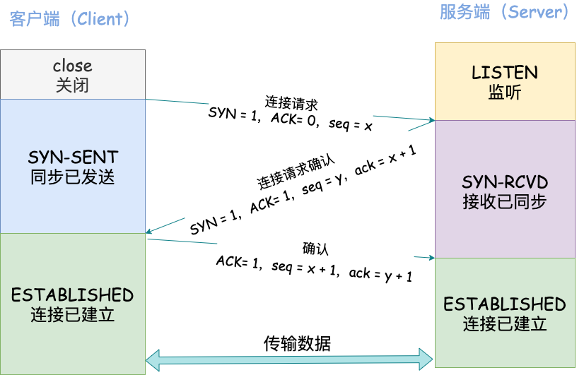

`第一次握手`：客户端发送网络包，服务端收到了。这样服务端就能得出结论：客户端的发送能力、服务端的接收能力是正常的。

`第二次握手`：服务端发包，客户端收到了。这样客户端就能得出结论：服务端的接收、发送能力，客户端的接收、发送能力是正常的。 从客户端的视角来看，我接到了服务端发送过来的响应数据包，说明服务端接收到了我在第一次握手时发送的网络包，并且成功发送了响应数据包，这就说明，服务端的接收、发送能力正常。而另一方面，我收到了服务端的响应数据包，说明我第一次发送的网络包成功到达服务端，这样，我自己的发送和接收能力也是正常的。

`第三次握手`：客户端发包，服务端收到了。这样服务端就能得出结论：客户端的接收、发送能力，服务端的发送、接收能力是正常的。 **第一、二次握手后，服务端并不知道客户端的接收能力以及自己的发送能力是否正常**。而在第三次握手时，服务端收到了客户端对第二次握手作的回应。从服务端的角度，我在第二次握手时的响应数据发送出去了，客户端接收到了。所以，我的发送能力是正常的。而客户端的接收能力也是正常的。

经历了上面的三次握手过程，客户端和服务端都确认了自己的接收、发送能力是正常的。之后就可以正常通信了。

> #### 扩展：状态解读
>
> - CLOSED:  client处于关闭状态
> - LISTEN:  server处于监听状态，等待client连接
> - SYN-RCVD:  表示server接受到了SYN报文，当收到client的ACK报文后，它会进入到ESTABLISHED状态
> - SYN-SENT:  表示client已发送SYN报文，等待server的第2次握手
> - ESTABLISHED:  表示连接已经建立

### 2.2 为什么不是两次？

根本原因: 无法确认客户端的接收能力和服务端的发送能力。

为了实现可靠传输，发送方和接收方始终需要同步( SYNchronize )序列号。需要注意的是，序列号并不是从 0 开始的，而是由发送方随机选择的初始序列号 ( Initial Sequence Number, ISN )开始。由于 TCP 是一个双向通信协议，通信双方都有能力发送信息，并接收响应。因此，通信双方都需要随机产生一个初始的序列号，并且把这个起始值告诉对方。
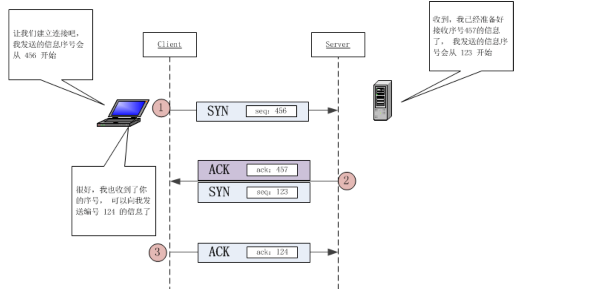

> ack 的作用是向对方表示，我期待收到的下一个序号。如果你向对方回复了 ack = 31, 代表着你已经收到了序号截止到30的数据，期待的下一个数据起点是 31 。
>
> TCP 协议规定SYN报文虽然不携带数据，但是也要消耗1个序列号，所以前两次握手客户端和服务端都需要向对方回复 x+1 或 y+1 。

分析如下:

我们假设client发出的第一个连接请求报文段并没有丢失，而是在某个网络结点长时间的滞留了，以致延误到连接释放以后的某个时间才到达server。

本来这是一个早已失效的报文段。但server收到此失效的连接请求报文段后，就误认为是client再次发出的一个新的连接请求。于是就向client发出确认报文段，同意建立连接。

假设不采用“三次握手”，那么只要server发出确认，新的连接就建立了。由于现在client并没有发出建立连接的请求，因此不会理睬server的确认，也不会向server发送数据。但server却以为新的运输连接已经建立，并一直等待client发来数据。这样，server的很多资源就白白浪费掉了。

### 2.3 为什么不是四次？

三次握手的目的是确认双方`发送`和`接收`的能力，那四次握手可以嘛？

当然可以，100 次都可以。但为了解决问题，三次就足够了，再多用处就不大了。

### 2.4 三次握手过程中可以携带数据么？

第三次握手的时候，可以携带。前两次握手不能携带数据。

如果前两次握手能够携带数据，那么一旦有人想攻击服务器，那么他只需要在第一次握手中的 SYN 报文中放大量数据，那么服务器势必会消耗更多的**时间**和**内存空间**去处理这些数据，增大了服务器被攻击的风险。

第三次握手的时候，客户端已经处于`ESTABLISHED`状态，并且已经能够确认服务器的接收、发送能力正常，这个时候相对安全了，可以携带数据。

### 2.5 同时打开会怎样？

如果双方同时发 `SYN`报文，状态变化会是怎样的呢？

这是一个可能会发生的情况。

状态变迁如下:


在发送方给接收方发`SYN`报文的同时，接收方也给发送方发`SYN`报文，两个人刚上了!

发完`SYN`，两者的状态都变为`SYN-SENT`。

在各自收到对方的`SYN`后，两者状态都变为`SYN-REVD`。

接着会回复对应的`ACK + SYN`，这个报文在对方接收之后，两者状态一起变为`ESTABLISHED`。

这就是同时打开情况下的状态变迁。

## 3.  TCP 四次挥手

### 3.1 四次挥手过程

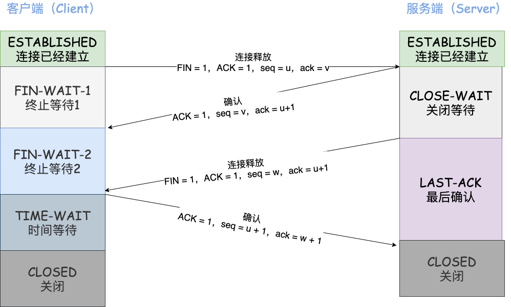

刚开始双方处于`ESTABLISHED`状态。

客户端要断开了，向服务器发送 `FIN` 报文，在 TCP 报文中的位置如下图:

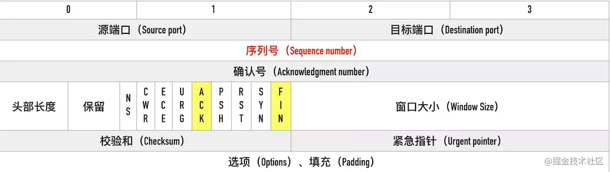

**第一次挥手**：客户端发送一个 FIN 报文（请求连接终止：FIN = 1），报文中会指定一个序列号 seq = u。并**停止再发送数据，主动关闭 TCP 连接**。此时客户端处于 `FIN_WAIT1` 状态，等待服务端的确认。

**第二次挥手**：服务端收到 FIN 之后，会发送 ACK 报文，且把客户端的序号值 +1 作为 ACK 报文的序列号值，表明已经收到客户端的报文了，此时服务端处于 `CLOSE_WAIT` 状态。

**此时的 TCP 处于半关闭状态，客户端到服务端的连接释放**。客户端收到服务端的确认后，进入`FIN_WAIT2`（终止等待 2）状态，等待服务端发出的连接释放报文段。

**第三次挥手**：如果服务端也想断开连接了（没有要向客户端发出的数据），和客户端的第一次挥手一样，发送 FIN 报文，且指定一个序列号。此时服务端处于 `LAST_ACK` 的状态，等待客户端的确认。

**第四次挥手**：客户端收到 FIN 之后，一样发送一个 ACK 报文作为应答（ack = w+1），且把服务端的序列值 +1 作为自己 ACK 报文的序号值（seq=u+1），此时客户端处于 **`TIME_WAIT` （时间等待）状态**。

注意 ！！！这个时候由服务端到客户端的 TCP 连接并未释放掉，**需要经过时间等待计时器设置的时间 2MSL（一个报文的来回时间） 后才会进入 `CLOSED` 状态**（这样做的目的是确保服务端收到自己的 ACK 报文。如果服务端在规定时间内没有收到客户端发来的 ACK 报文的话，服务端会重新发送 FIN 报文给客户端，客户端再次收到 FIN 报文之后，就知道之前的 ACK 报文丢失了，然后再次发送 ACK 报文给服务端）。服务端收到 ACK 报文之后，就关闭连接了，处于 `CLOSED` 状态。

### 3.2 等待2MSL的意义

`MSL` 指的是报文在网络中最大生存时间。

1. 保证服务端的连接能够正确关闭
   客户端是发出了第四次握手的报文后进入的TIME_WAIT。如果第四次握手中，客户端发给服务器的ACK报文丢失了，服务器就会超时重发 FIN报文给客户端，客户端要保证极端情况下也能接受到服务器的超时重发FIN报文，然后给服务器重传第四次握手报文，确保服务器能正常关闭。

2. 防止收到历史数据，从而导致数据错乱的问题。
   客户端发送完最后一个确认报文后，在这个2MSL时间中，就可以使本连接持续的时间内所产生的所有报文段都从网络中消失。这样新的连接中不会出现旧连接的历史数据。

### 3.3 为什么是四次挥手而不是三次？

因为服务端在接收到`FIN`, 往往不会立即返回`FIN`, 必须等到服务端所有的报文都发送完毕了，才能发`FIN`。因此先发一个`ACK`表示已经收到客户端的`FIN`，延迟一段时间才发`FIN`。这就造成了四次挥手。

如果是三次挥手会有什么问题？

等于说服务端将`ACK`和`FIN`的发送合并为一次挥手，这个时候长时间的延迟可能会导致客户端误以为`FIN`没有到达客户端，从而让客户端不断的重发`FIN`。

### 3.4 同时关闭会怎样？

如果客户端和服务端同时发送 FIN ，状态会如何变化？如图所示:

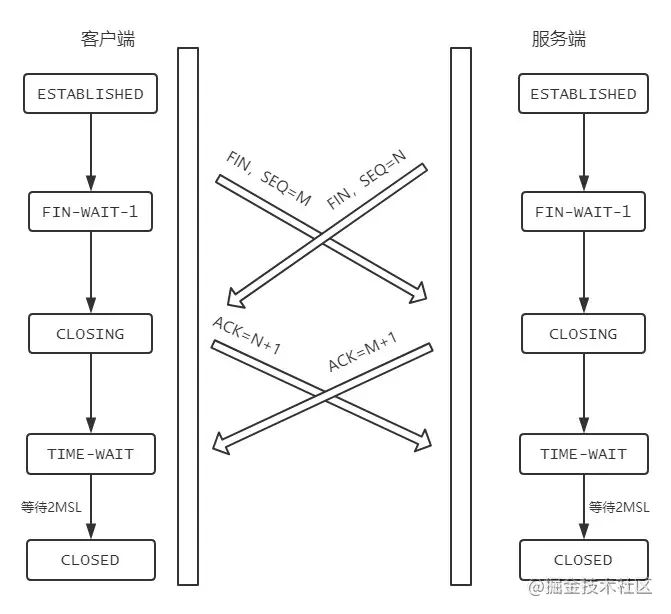

### 3.5 为什么建立连接是三次握手，关闭连接确是四次挥手呢？

建立连接的时候，服务器在LISTEN状态下，收到建立连接请求的SYN报文后，把ACK和SYN放在一个报文里发送给客户端。

而关闭连接时，服务器收到客户端的FIN报文时，仅仅表示客户端不再发送数据了但是还能接收数据，而服务端也未必将全部数据都发送给客户端了，所以服务端可以立即关闭，也可以发送一些数据给客户端后，再发送FIN报文给客户端来表示同意现在关闭连接，因此，服务端ACK和FIN一般都会分开发送，从而导致多了一次。

## 4. 半连接队列和 SYN Flood 攻击的关系

三次握手前，服务端的状态从`CLOSED`变为`LISTEN`, 同时在内部创建了两个队列：**半连接队列**和**全连接队列**，即**SYN队列**和**ACCEPT队列**。

### 4.1 半连接队列

服务器第一次收到客户端的 `SYN` 之后，就会处于 `SYN_RCVD` 状态，此时双方还没有完全建立连接。服务器会把这种状态下请求连接放在一个队列里，我们把这种队列称之为半连接队列。

### 4.2 全连接队列

当客户端返回`ACK`, 服务端接收后，三次握手完成。这个时候连接等待被具体的应用取走，在被取走之前，它会被推入另外一个 TCP 维护的队列，也就是**全连接队列(Accept Queue)**。

### 4.3 SYN Flood 攻击原理

SYN Flood 属于典型的 DoS/DDoS 攻击。其攻击的原理很简单，就是用客户端在短时间内伪造大量不存在的 IP 地址，并向服务端疯狂发送`SYN`。对于服务端而言，会产生两个危险的后果:

1. 占满半连接队列，无法处理正常请求:处理大量的`SYN`包并返回对应`ACK`, 势必有大量连接处于`SYN_RCVD`状态，从而占满整个**半连接队列**，无法处理正常的请求。
2. 耗尽服务端的资源：由于是不存在的 IP，服务端长时间收不到客户端的`ACK`，会导致服务端不断重发数据，直到耗尽服务端的资源。

### 4.4 如何应对 SYN Flood 攻击？

1. 增加半连接队列的容量。
2. 减少 SYN + ACK 重试次数，避免大量的超时重发。
3. 利用 SYN Cookie 技术，在服务端接收到`SYN`后不立即分配连接资源，而是根据这个`SYN`计算出一个Cookie，连同第二次握手回复给客户端，在客户端回复`ACK`的时候带上这个`Cookie`值，服务端验证 Cookie 合法之后才分配连接资源。

## 5.  TCP 报文头部的字段

报文头部结构如下(单位为字节):

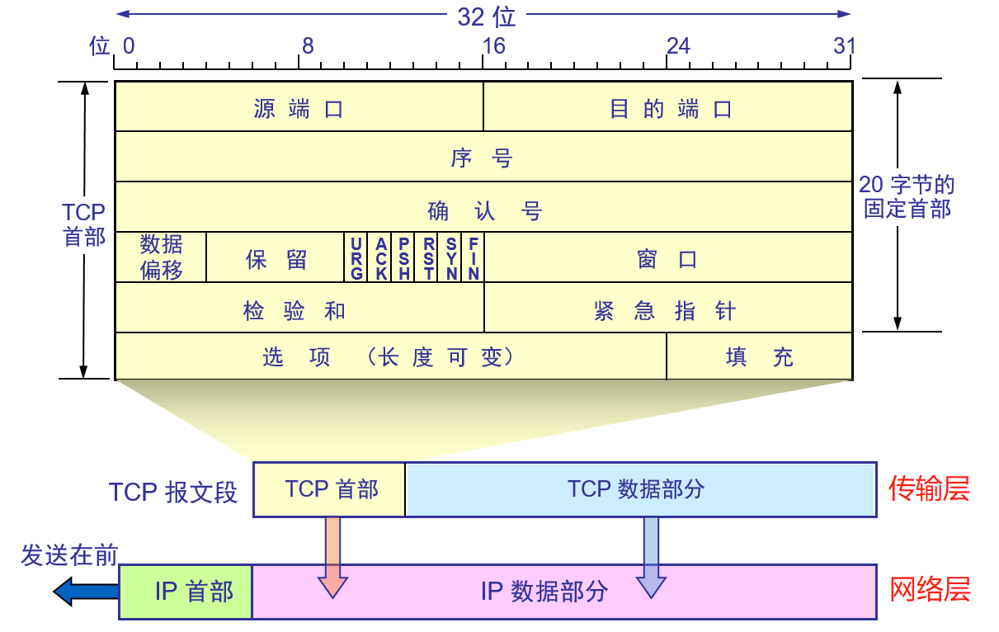

1. 源端口、目标端口

各占 2 字节（16位）.

2. 序列号

指的是本报文段第一个字节的序列号。

序列号在 TCP 通信的过程中有两个作用:

- 在 SYN 报文中交换彼此的初始序列号。

- 保证数据包按正确的顺序组装。

3. 确认号

即`ACK(Acknowledgment number)`。用来告知对方下一个期望接收的序列号，**小于ACK**的所有字节已经全部收到。

4. **数据偏移**（即首部长度）——占 4 位
5. **保留**字段——占 6 位，保留为今后使用，但目前应置为 0。

6. 标记位

常见的标记位有`SYN`,`ACK`,`FIN`,`RST`,`PSH`。

- `SYN`：同步序列编号（*Syn*chronize Sequence Numbers）。

- `ACK`:(*Ack*nowledge character）即是确认字符，在数据通信中，接收站发给发送站的一种传输类控制字符。表示发来的数据已确认接收无误。

- `FIN`： 即 Finish，表示发送方准备断开连接。

- `RST`：即 Reset，用来强制断开连接。

- `PSH`： 即 Push, 告知对方这些数据包收到后应该马上交给上层的应用，不能缓存。

7. 窗口大小

占用两个字节，也就是 16 位，但实际上是不够用的。因此 TCP 引入了窗口缩放的选项，作为窗口缩放的比例因子，这个比例因子的范围在 0 ~ 14，比例因子可以将窗口的值扩大为原来的 2 ^ n 次方。

8. 校验和

占用两个字节，防止传输过程中数据包有损坏，如果遇到校验和有差错的报文，TCP 直接丢弃之，等待重传。

9. **紧急指针**字段 —— 占 16 位，指出在本报文段中紧急数据共有多少个字节（紧急数据放在本报文段数据的最前面）。
10. 选项-长度可变。最长：40字节。当没有使用时，TCP首部长度固定：20字节。

## 6. TCP 快速打开的原理(TFO)

### 6.1 TFO 流程

1. 首轮三次握手

- 客户端发送`SYN`给服务端，服务端接收到。

- 现在服务端不是立刻回复 SYN + ACK，而是通过计算得到一个`SYN Cookie`, 将这个`Cookie`放到 TCP 报文的 `Fast Open`选项中，然后才给客户端返回。

- 客户端拿到这个 Cookie 的值缓存下来。后面正常完成三次握手。

首轮三次握手就是这样的流程。而后面的三次握手就不一样啦！

2. 后面的三次握手

在后面的三次握手中，客户端会将之前缓存的 `Cookie`、`SYN` 和`HTTP请求`(是的，你没看错)发送给服务端，服务端验证了 Cookie 的合法性，如果不合法直接丢弃；如果是合法的，那么就正常返回`SYN + ACK`。

重点来了，现在服务端能向客户端发 HTTP 响应了！这是最显著的改变，三次握手还没建立，仅仅验证了 Cookie 的合法性，就可以返回 HTTP 响应了。

当然，客户端的`ACK`还得正常传过来，不然怎么叫三次握手嘛。

流程如下:

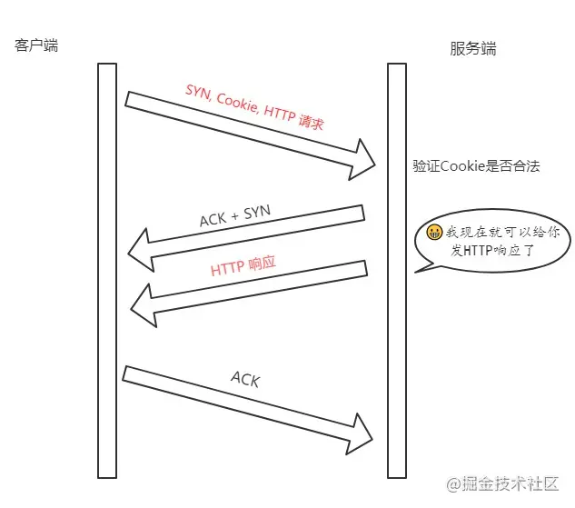

> 注意: 客户端最后握手的 ACK 不一定要等到服务端的 HTTP 响应到达才发送，两个过程没有任何关系。

### 6.2 TFO 的优势

TFO 的优势并不在与首轮三次握手，而在于后面的握手，在拿到客户端的 Cookie 并验证通过以后，可以直接返回 HTTP 响应，充分利用了**1 个RTT**(Round-Trip Time，往返时延)的时间**提前进行数据传输**，积累起来还是一个比较大的优势。

## 7. TCP 报文中时间戳的作用？

`timestamp`是 TCP 报文首部的一个可选项，一共占 10 个字节，格式如下:

```
kind(1 字节) + length(1 字节) + info(8 个字节)
```

其中 kind = 8， length = 10， info 有两部分构成: **timestamp**和**timestamp echo**，各占 4 个字节。

那么这些字段都是干嘛的呢？它们用来解决那些问题？

接下来我们就来一一梳理，TCP 的时间戳主要解决两大问题:

- 计算往返时延 RTT(Round-Trip Time)
- 防止序列号的回绕问题

### 7.1 计算往返时延 RTT

在没有时间戳的时候，计算 RTT 会遇到的问题如下图所示:

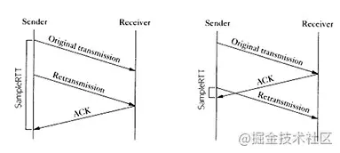

如果以第一次发包为开始时间的话，就会出现左图的问题，RTT 明显偏大，开始时间应该采用第二次的；

如果以第二次发包为开始时间的话，就会导致右图的问题，RTT 明显偏小，开始时间应该采用第一次发包的。

实际上无论开始时间以第一次发包还是第二次发包为准，都是不准确的。

那这个时候引入时间戳就很好的解决了这个问题。

比如现在 a 向 b 发送一个报文 s1，b 向 a 回复一个含 ACK 的报文 s2 那么：

- **step 1:** a 向 b 发送的时候，`timestamp` 中存放的内容就是 a 主机发送时的内核时刻 `ta1`。
- **step 2:** b 向 a 回复 s2 报文的时候，`timestamp` 中存放的是 b 主机的时刻 `tb`, `timestamp echo`字段为从 s1 报文中解析出来的 ta1。
- **step 3:** a 收到 b 的 s2 报文之后，此时 a 主机的内核时刻是 ta2, 而在 s2 报文中的 timestamp echo 选项中可以得到 `ta1`, 也就是 s2 对应的报文最初的发送时刻。然后直接采用 ta2 - ta1 就得到了 RTT 的值。

### 7.2 防止序列号回绕问题

现在我们来模拟一下这个问题。

序列号的范围其实是在0 ~ 2 ^ 32 - 1, 为了方便演示，我们缩小一下这个区间，假设范围是 0 ~ 4，那么到达 4 的时候会回到 0。

| 第几次发包 | 发送字节 | 对应序列号 | 状态                    |
| ---------- | -------- | ---------- | ----------------------- |
| 1          | 0 ~ 1    | 0 ~ 1      | 成功接收                |
| 2          | 1 ~ 2    | 1 ~ 2      | 滞留在网络中            |
| 3          | 2 ~ 3    | 2 ~ 3      | 成功接收                |
| 4          | 3 ~ 4    | 3 ~ 4      | 成功接收                |
| 5          | 4 ~ 5    | 0 ~ 1      | 成功接收，序列号从0开始 |
| 6          | 5 ~ 6    | 1 ~ 2      | ？？？                  |

假设在第 6 次的时候，之前还滞留在网路中的包回来了，那么就有两个序列号为`1 ~ 2`的数据包了，怎么区分谁是谁呢？这个时候就产生了序列号回绕的问题。

那么用 timestamp 就能很好地解决这个问题，因为每次发包的时候都是将发包机器当时的内核时间记录在报文中，那么两次发包序列号即使相同，时间戳也不可能相同，这样就能够区分开两个数据包了。

## 8. TCP 的超时重传时间是如何计算的？

TCP 具有超时重传机制，即间隔一段时间没有等到数据包的回复时，重传这个数据包。

这个重传间隔也叫做**超时重传时间**(Retransmission TimeOut, 简称RTO)，它的计算跟上一节提到的 RTT 密切相关。这里我们将介绍两种主要的方法，一个是经典方法，一个是标准方法。

### 8.1 经典方法

经典方法引入了一个新的概念——SRTT(Smoothed round trip time，即平滑往返时间)，没产生一次新的 RTT. 就根据一定的算法对 SRTT 进行更新，具体而言，计算方式如下(SRTT 初始值为0):

```js
SRTT =  (α * SRTT) + ((1 - α) * RTT)
```

其中，α 是**平滑因子**，建议值是`0.8`，范围是`0.8 ~ 0.9`。

拿到 SRTT，我们就可以计算 RTO 的值了:

```js
RTO = min(ubound, max(lbound, β * SRTT))
```

β 是加权因子，一般为`1.3 ~ 2.0`， **lbound** 是下界，**ubound** 是上界。

其实这个算法过程还是很简单的，但是也存在一定的局限，就是在 RTT 稳定的地方表现还可以，而在 RTT 变化较大的地方就不行了，因为平滑因子 α 的范围是`0.8 ~ 0.9`, RTT 对于 RTO 的影响太小。

### 8.2 标准方法

为了解决经典方法对于 RTT 变化不敏感的问题，后面又引出了标准方法，也叫`Jacobson / Karels 算法`。

一共有三步。

**第一步**: 计算`SRTT`，公式如下:

```js
SRTT = (1 - α) * SRTT + α * RTT
```

注意这个时候的 `α`跟经典方法中的`α`取值不一样了，建议值是`1/8`，也就是`0.125`。

**第二步**: 计算`RTTVAR`(round-trip time variation)这个中间变量。

```js
RTTVAR = (1 - β) * RTTVAR + β * (|RTT - SRTT|)
```

β 建议值为 0.25。这个值是这个算法中出彩的地方，也就是说，它记录了最新的 RTT 与当前 SRTT 之间的差值，给我们在后续感知到 RTT 的变化提供了抓手。

**第三步**: 计算最终的`RTO`:

```js
RTO = µ * SRTT + ∂ * RTTVAR 
```

`µ`建议值取`1`, `∂`建议值取`4`。

这个公式在 SRTT 的基础上加上了最新 RTT 与它的偏移，从而很好的感知了 RTT 的变化，这种算法下，RTO 与 RTT 变化的差值关系更加密切。

## 9. TCP 的流量控制？

对于发送端和接收端而言，TCP 需要把发送的数据放到**发送缓存区**, 将接收的数据放到**接收缓存区**。

而流量控制索要做的事情，就是在通过接收缓存区的大小，控制发送端的发送。如果对方的接收缓存区满了，就不能再继续发送了。

要具体理解流量控制，首先需要了解`滑动窗口`的概念。

### 9.1 TCP 滑动窗口

TCP 滑动窗口分为两种: **发送窗口**和**接收窗口**。

#### 发送窗口

发送端的滑动窗口结构如下:

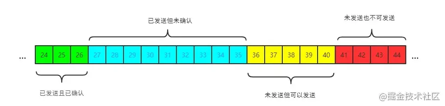

其中包含四大部分:

- 已发送且已确认
- 已发送但未确认
- 未发送但可以发送
- 未发送也不可以发送

其中有一些重要的概念，我标注在图中:

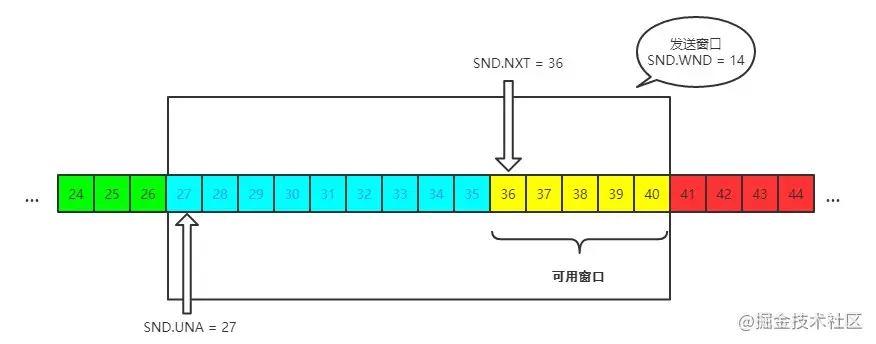

发送窗口就是图中被框住的范围。SND 即`send`, WND 即`window`, UNA 即`unacknowledged`, 表示未被确认，NXT 即`next`, 表示下一个发送的位置。

#### 接收窗口

接收端的窗口结构如下:

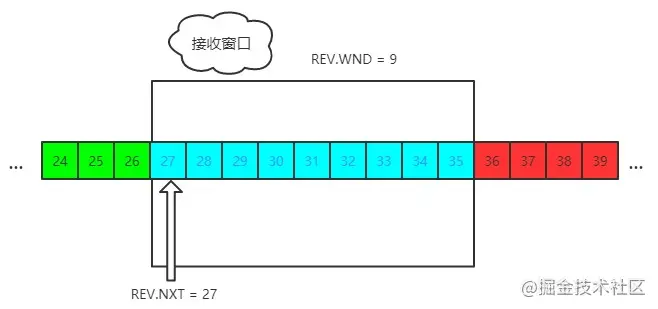

REV 即 `receive`，NXT 表示下一个接收的位置，WND 表示接收窗口大小。

### 9.2 流量控制过程

这里我们不用太复杂的例子，以一个最简单的来回来模拟一下流量控制的过程，方便大家理解。

首先双方三次握手，初始化各自的窗口大小，均为 200 个字节。

假如当前发送端给接收端发送 100 个字节，那么此时对于发送端而言，SND.NXT 当然要右移 100 个字节，也就是说当前的`可用窗口`减少了 100 个字节，这很好理解。

现在这 100 个到达了接收端，被放到接收端的缓冲队列中。不过此时由于大量负载的原因，接收端处理不了这么多字节，只能处理 40 个字节，剩下的 `60` 个字节被留在了缓冲队列中。

注意了，此时接收端的情况是处理能力不够用啦，你发送端给我少发点，所以此时接收端的接收窗口应该缩小，具体来说，缩小 60 个字节，由 200 个字节变成了 140 字节，因为缓冲队列还有 60 个字节没被应用拿走。

因此，接收端会在 ACK 的报文首部带上缩小后的滑动窗口 140 字节，发送端对应地调整发送窗口的大小为 140 个字节。

此时对于发送端而言，已经发送且确认的部分增加 40 字节，也就是 SND.UNA 右移 40 个字节，同时**发送窗口**缩小为 140 个字节。

这也就是**流量控制**的过程。尽管回合再多，整个控制的过程和原理是一样的。

## 10. TCP 的拥塞控制？

上一节所说的**流量控制**发生在发送端跟接收端之间，并没有考虑到整个网络环境的影响，如果说当前网络特别差，特别容易丢包，那么发送端就应该注意一些了。而这，也正是`拥塞控制`需要处理的问题。

对于拥塞控制来说，TCP 每条连接都需要维护两个核心状态:

- 拥塞窗口（Congestion Window，cwnd）
- 慢启动阈值（Slow Start Threshold，ssthresh）

涉及到的算法有这几个:

- 慢启动
- 拥塞避免
- 快速重传和快速恢复

接下来，我们就来一一拆解这些状态和算法。首先，从拥塞窗口说起。

### 10.1 拥塞窗口

拥塞窗口（Congestion Window，cwnd）是指目前自己还能传输的数据量大小。

那么之前介绍了接收窗口的概念，两者有什么区别呢？

- 接收窗口(rwnd)是`接收端`给的限制
- 拥塞窗口(cwnd)是`发送端`的限制

限制谁呢？

限制的是`发送窗口`的大小。

有了这两个窗口，如何来计算`发送窗口`？

```
发送窗口大小 = min(rwnd, cwnd)
```

取两者的较小值。而拥塞控制，就是来控制`cwnd`的变化。

### 10.2 慢启动

刚开始进入传输数据的时候，你是不知道现在的网路到底是稳定还是拥堵的，如果做的太激进，发包太急，那么疯狂丢包，造成雪崩式的网络灾难。

因此，拥塞控制首先就是要采用一种保守的算法来慢慢地适应整个网路，这种算法叫`慢启动`。运作过程如下:

- 首先，三次握手，双方宣告自己的接收窗口大小
- 双方初始化自己的**拥塞窗口**(cwnd)大小
- 在开始传输的一段时间，发送端每收到一个 ACK，拥塞窗口大小加 1，也就是说，每经过一个 RTT，cwnd 翻倍。如果说初始窗口为 10，那么第一轮 10 个报文传完且发送端收到 ACK 后，cwnd 变为 20，第二轮变为 40，第三轮变为 80，依次类推。

难道就这么无止境地翻倍下去？当然不可能。它的阈值叫做**慢启动阈值**，当 cwnd 到达这个阈值之后，好比踩了下刹车，别涨了那么快了，老铁，先 hold 住！

在到达阈值后，如何来控制 cwnd 的大小呢？

这就是拥塞避免做的事情了。

### 10.3 拥塞避免

原来每收到一个 ACK，cwnd 加1，现在到达阈值了，cwnd 只能加这么一点: **1 / cwnd**。那你仔细算算，一轮 RTT 下来，收到 cwnd 个 ACK, 那最后拥塞窗口的大小 cwnd 总共才增加 1。

也就是说，以前一个 RTT 下来，`cwnd`翻倍，现在`cwnd`只是增加 1 而已。

当然，**慢启动**和**拥塞避免**是一起作用的，是一体的。

### 10.4 快速重传和快速恢复

#### 快速重传

在 TCP 传输的过程中，如果发生了丢包，即接收端发现数据段不是按序到达的时候，接收端的处理是重复发送之前的 ACK。

比如第 5 个包丢了，即使第 6、7 个包到达的接收端，接收端也一律返回第 4 个包的 ACK。当发送端收到 3 个重复的 ACK 时，意识到丢包了，于是马上进行重传，不用等到一个 RTO 的时间到了才重传。

这就是**快速重传**，它解决的是**是否需要重传**的问题。

#### 选择性重传

那你可能会问了，既然要重传，那么只重传第 5 个包还是第5、6、7 个包都重传呢？

当然第 6、7 个都已经到达了，TCP 的设计者也不傻，已经传过去干嘛还要传？干脆记录一下哪些包到了，哪些没到，针对性地重传。

在收到发送端的报文后，接收端回复一个 ACK 报文，那么在这个报文首部的可选项中，就可以加上`SACK`这个属性，通过`left edge`和`right edge`告知发送端已经收到了哪些区间的数据报。因此，即使第 5 个包丢包了，当收到第 6、7 个包之后，接收端依然会告诉发送端，这两个包到了。剩下第 5 个包没到，就重传这个包。这个过程也叫做**选择性重传(SACK，Selective Acknowledgment)**，它解决的是**如何重传**的问题。

#### 快速恢复

当然，发送端收到三次重复 ACK 之后，发现丢包，觉得现在的网络已经有些拥塞了，自己会进入**快速恢复**阶段。

在这个阶段，发送端如下改变：

- 拥塞阈值降低为 cwnd 的一半
- cwnd 的大小变为拥塞阈值
- cwnd 线性增加

以上就是 TCP 拥塞控制的经典算法: **慢启动**、**拥塞避免**、**快速重传和快速恢复**。

## 11.  Nagle 算法和延迟确认？

### 11.1 Nagle 算法

试想一个场景，发送端不停地给接收端发很小的包，一次只发 1 个字节，那么发 1 千个字节需要发 1000 次。这种频繁的发送是存在问题的，不光是传输的时延消耗，发送和确认本身也是需要耗时的，频繁的发送接收带来了巨大的时延。

而避免小包的频繁发送，这就是 Nagle 算法要做的事情。

具体来说，Nagle 算法的规则如下:

- 当第一次发送数据时不用等待，就算是 1byte 的小包也立即发送
- 后面发送满足下面条件之一就可以发了:
  - 数据包大小达到最大段大小(Max Segment Size, 即 MSS)
  - 之前所有包的 ACK 都已接收到

### 11.2 延迟确认

试想这样一个场景，当我收到了发送端的一个包，然后在极短的时间内又接收到了第二个包，那我是一个个地回复，还是稍微等一下，把两个包的 ACK 合并后一起回复呢？

**延迟确认**(delayed ack)所做的事情，就是后者，稍稍延迟，然后合并 ACK，最后才回复给发送端。TCP 要求这个延迟的时延必须小于500ms，一般操作系统实现都不会超过200ms。

不过需要主要的是，有一些场景是不能延迟确认的，收到了就要马上回复:

- 接收到了大于一个 frame 的报文，且需要调整窗口大小
- TCP 处于 quickack 模式（通过`tcp_in_quickack_mode`设置）
- 发现了乱序包

### 11.3 两者一起使用会怎样？

前者意味着延迟发，后者意味着延迟接收，会造成更大的延迟，产生性能问题。

## 12. TCP 的 keep-alive？

大家都听说过 http 的`keep-alive`, 不过 TCP 层面也是有`keep-alive`机制，而且跟应用层不太一样。

试想一个场景，当有一方因为网络故障或者宕机导致连接失效，由于 TCP 并不是一个轮询的协议，在下一个数据包到达之前，对端对连接失效的情况是一无所知的。

这个时候就出现了 keep-alive, 它的作用就是探测对端的连接有没有失效。

在 Linux 下，可以这样查看相关的配置:

```
sudo sysctl -a | grep keepalive

// 每隔 7200 s 检测一次
net.ipv4.tcp_keepalive_time = 7200
// 一次最多重传 9 个包
net.ipv4.tcp_keepalive_probes = 9
// 每个包的间隔重传间隔 75 s
net.ipv4.tcp_keepalive_intvl = 75
```

不过，现状是大部分的应用并没有默认开启 TCP 的`keep-alive`选项，为什么？

站在应用的角度:

- 7200s 也就是两个小时检测一次，时间太长
- 时间再短一些，也难以体现其设计的初衷, 即检测长时间的死连接

因此是一个比较尴尬的设计。

