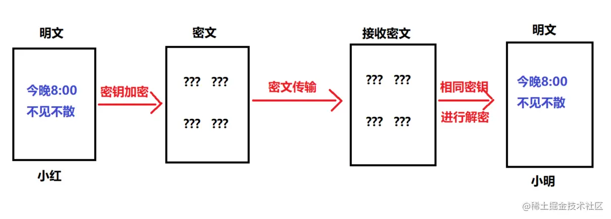
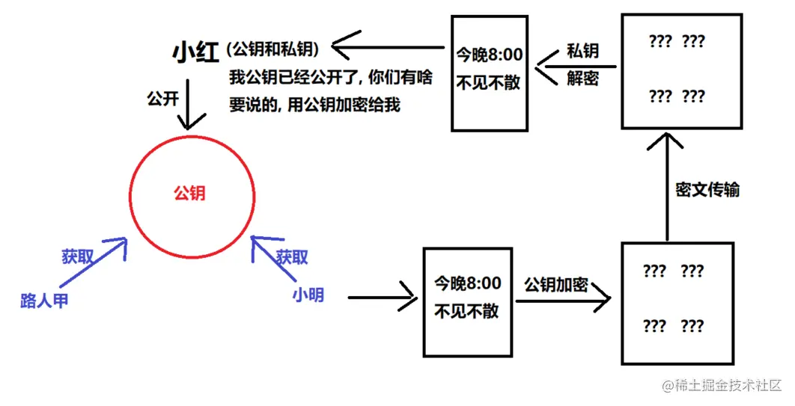
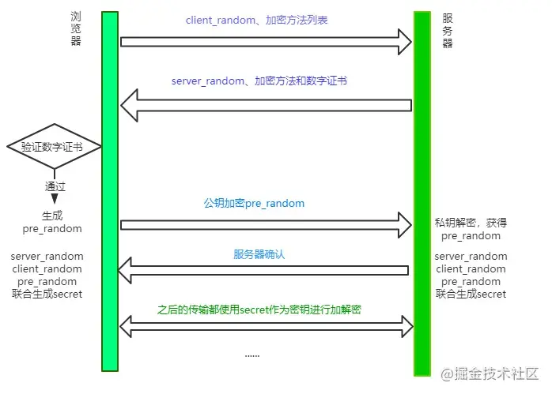

# 一、HTTP

## 1. GET和POST请求的区别

Post 和 Get 是 HTTP 请求的两种方法，其区别如下：

1. **应用场景：** (GET 请求是一个**幂等**的请求)一般 Get 请求用于对服务器资源不会产生影响的场景，比如说请求一个网页的资源。(而 Post 不是一个**幂等**的请求)一般用于对服务器资源会产生影响的情景，比如注册用户这一类的操作。（**幂等是指一个请求方法执行多次和仅执行一次的效果完全相同**）

2. **是否缓存：** 因为两者应用场景不同，浏览器一般会对 Get 请求缓存，但很少对 Post 请求缓存。

3. **传参方式不同：** Get 通过查询字符串传参，Post 通过请求体传参。

4. **安全性：** Get 请求可以将请求的参数放入 url 中向服务器发送，这样的做法相对于 Post 请求来说是不太安全的，因为请求的 url 会被保留在历史记录中。

5. **请求长度：** 浏览器由于对 url 长度的限制，所以会影响 get 请求发送数据时的长度。这个限制是浏览器规定的，并不是 RFC 规定的。

6. **参数类型：** get参数只允许ASCII字符，post 的参数传递支持更多的数据类型(如文件、图片)。

## 2. POST和PUT请求的区别

PUT请求是向服务器端发送数据，从而修改数据的内容，但是不会增加数据的种类等，也就是说无论进行多少次PUT操作，其结果并没有不同。（可以理解为时**更新数据**）

POST请求是向服务器端发送数据，该请求会改变数据的种类等资源，它会创建新的内容。（可以理解为是**创建数据**）

> 为什么post请求会发送两次请求?

1. 第一次请求为`options`预检请求，状态码为:204。

- 作用：
  - 作用1: 询问服务器是否支持修改的请求头，如果服务器支持，则在第二次中发送真正的请求
  - 作用2: 检测服务器是否为同源请求,是否支持跨域

- 2.第二次为真正的`post`请求。

## 3. 常见的HTTP请求头和响应头

> HTTP Request Header

- Accept:浏览器能够处理的内容类型
- Accept-Charset:浏览器能够显示的字符集
- Accept-Encoding：浏览器能够处理的压缩编码
- Accept-Language：浏览器当前设置的语言
- Connection：浏览器与服务器之间连接的类型
- Cookie：当前页面设置的任何Cookie
- Host：发出请求的页面所在的域
- Referer：发出请求的页面的URL
- User-Agent：浏览器的用户代理字符串

> HTTP Responses Header

- Date：表示消息发送的时间，时间的描述格式由rfc822定义
- server:服务器名称
- Connection：浏览器与服务器之间连接的类型
- Cache-Control：控制HTTP缓存
- content-type:表示后面的文档属于什么MIME类型

> Content-Type

**常见的 Content-Type 属性值有以下四种：**

（1）`application/x-www-form-urlencoded`：浏览器的原生 form 表单，如果不设置 enctype 属性，那么最终就会以 application/x-www-form-urlencoded 方式提交数据。该种方式提交的数据放在 body 里面，数据按照 key1=val1&key2=val2 的方式进行编码，key 和 val 都进行了 URL转码。

（2）`multipart/form-data`：该种方式也是一个常见的 POST 提交方式，通常表单上传文件时使用该种方式。

（3）`application/json`：服务器消息主体是序列化后的 JSON 字符串。

（4）`text/xml`：该种方式主要用来提交 XML 格式的数据。

## 4. HTTP状态码304是多好还是少好

**为什么会有304**

服务器为了提高网站访问速度，对之前访问的部分页面指定缓存机制，当客户端在此对这些页面进行请求，服务器会根据缓存内容判断页面与之前是否相同，若相同便直接返回304，此时客户端调用缓存内容，不必进行二次下载。

状态码304不应该认为是一种错误，而是对客户端**有缓存情况下**服务端的一种响应。

搜索引擎蜘蛛会更加青睐内容源更新频繁的网站。通过特定时间内对网站抓取返回的状态码来调节对该网站的抓取频次。若网站在一定时间内一直处于304的状态，那么蜘蛛可能会降低对网站的抓取次数。相反，若网站变化的频率非常之快，每次抓取都能获取新内容，那么日积月累，的回访率也会提高。

**产生较多304状态码的原因：**

- 页面更新周期长或不更新
- 纯静态页面或强制生成静态html

**304状态码出现过多会造成以下问题：**

- 网站快照停止；
- 收录减少；
- 权重下降。

## 5. 常见的HTTP请求方法

1. `GET`: 向服务器获取数据；

2. `POST`：发送数据给服务器，通常会造成服务器资源的新增修改；

3. `PUT`：用于全量修改目标资源(看接口，也可以用于添加)；

4. `PATCH`：用于对资源进行部分修改

5. `DELETE`：用于删除指定的资源；

6. `HEAD`：获取报文首部，与GET相比，不返回报文主体部分；使用场景是比如下载一个大文件前，先获取其大小再决定是否要下载，以此可以节约宽带资源

7. `OPTIONS`：(浏览器自动执行)、询问支持的请求方法，用来跨域请求、预检请求、判断目标是否安全；

8. `CONNECT`：要求在与代理服务器通信时建立**管道**，使用**管道**进行TCP通信；(把服务器作为跳板，让服务器代替用户去访问其他网页，之后把数据原原本本的返回给用户)

9. `TRACE`: 该方法会让服务器原样返回任意客户端请求的信息内容，主要⽤于测试或诊断。

## 6. 说说Ajax组成部分

Ajax(阿贾克斯)：全称 `Asynchronous Javascript And XML(异步的js与xml)`

- 说人话： **用js发送异步的网络请求**
- A : Asynchronous 异步
- J：Javascript
- A ：And
- X : XML 与 XMLHttpRequest
  - XML ： 解决跨平台数据传输。
    - 在JSON没有出来以前, 网络传输主要以XML格式数据为主。 后来JSON问世，逐渐取代XML。 但是由于ajax技术出来的比json早，因此xml这个称呼一直保留至今

## 7. 请介绍一下XMLHTTPRequest对象

**Ajax的核心是XMLHTTPRequest**。它是一种支持异步请求的技术。 XMLHTTPRequest使您可以使用JavaScript向服务器提出请求并处理响应，而不阻塞用户。可以在页面加载以后进行页面的局部更新

### 7.1 使用方法

**1.实例化ajax对象**

**2. open()** ：创建HTTP请求 第一个参数是指定提交方式(post、get) 第二个参数是指定要提交的地址是哪 第三个参数是指定是异步还是同步(true表示异步，false表示同步) 第四和第五参数在HTTP认证的时候会用到。是可选的

**3.设置请求头**

**setRequestHeader**(Stringheader,Stringvalue) **（使用post方式才会使用到，get方法并不需要调用该方法）**

**4.发送请求**

**send(content)** ：发送请求给服务器 如果是get方式，并不需要填写参数，或填写null 如果是post方式，把要提交的参数写上去

**5. 注册回调函数**

```javascript
 /* 1.ajax： 在页面不刷新的情况下向服务器请求数据 */
			//(1).实例化ajax对象
      let xhr = new XMLHttpRequest()
      //(2).设置请求方法和地址
      xhr.open("post", "http://www.liulongbin.top:3009/api/login")
      //(3).设置请求头（post请求才需要设置）
      xhr.setRequestHeader("Content-type", "application/x-www-form-urlencoded")
      //(4).发送请求 ： 参数格式  'key=value'
      xhr.send("username=admin&password=123456")
      //(5).注册回调函数
      // xhr.onload = function() {};
      xhr.onreadystatechange = function() {
        //onreadystatechange会触发多次，一般需要判断xhr.readState == 4 才获取响应数据
        if (xhr.readyState == 4) {
          console.log(xhr.responseText)
        }
      }
```

### 7.2 onreadstatechange事件

```javascript
*/ 1. onload事件 ：  接收服务器响应的数（一次请求，只会执行一次）
  */      2. onreadystatechang事件 : 作用与onload事件一致（一次请求，会执行多次）
  */          面试点： XMLHttpRequest对象的状态码 （xhr.readyState）
   */             0: 请求未建立  (创建了xhr对象，但是还没调用open)
   */             1: 服务器连接已建立 
   */             2. 请求已接收  (send之后,服务器已经接收了请求)
   */             3. 请求处理中 
   */             4. 请求已完成，且响应已就绪 （ 4状态码等同于onload事件 ）
        

      //(1).实例化ajax对象
      let xhr = new XMLHttpRequest()
      console.log(xhr.readyState) //0
      //(2).设置请求方法和地址
      xhr.open("post", "http://www.liulongbin.top:3009/api/login")
        console.log(xhr.readyState) //1
      //(3).设置请求头（post请求才需要设置）
      xhr.setRequestHeader("Content-type", "application/x-www-form-urlencoded")
      console.log(xhr.readyState) //1
      //(4).发送请求 ： 参数格式  'key=value'
      xhr.send("username=admin&password=123456")
        console.log(xhr.readyState) //1
      //(5).注册回调函数
      //a. onload 是新式浏览器才支持的
      //b. 如果要兼容更早的浏览器，可以使用 onreadystatechange
      //c. onreadystatechange触发时机 ： xhr.readState状态变化
      // xhr.onload = function() {};

      xhr.onreadystatechange = function() {
        console.log(xhr.readyState) //2,3,4
        //onreadystatechange会触发多次，一般需要判断xhr.readState == 4 才获取响应数据
        if (xhr.readyState == 4) {
          console.log(xhr.responseText)
        }
      }
```

### 7.3 如何上传文件（上传图片）

1. 给file表单注册onchange事件：当用户选择图片之后执行。
2. 获取用户选择的图片：this.files[0]
3. 创建FormData对象：只有FormData才可以上传文件。
4. 将图片添加到FormData对象中：fd.append('参数名', this.files[0])
5. 发送ajax请求：文件上传请求方法一定是post, 且请求参数为 FormData对象

```javascript
//1. file类型表单自带一个选择文件点击按钮，当用户选择文件之后就会触发onchange事件
      document.querySelector("#iptFile").onchange = function() {
        //this : file表单
        //(1)获取用户选择的文件
        let file = this.files[0]
        // 非空判断，如果内容为undefined，给出提示
        if (file == undefined) {
          return alert("请选择上传文件！")
        }
        //(2)创建FormData对象， 只有FormData对象才可以上传文件
        let fd = new FormData()
        //(3)添加文件
        fd.append("avatar", file)
        //(4)发送ajax请求, 参数为 FormData对象
        axios({
          method: "POST",
          url: "http://www.liulongbin.top:3009/api/upload/avatar",
          data: fd
        }).then(({ data: res }) => {
          console.log(res)
          if (res.code != 200) {
            return alert(res.message)
          }
          // 成功后提示，修改图片路径
          alert("恭喜您，上传头像成功！")
          document.querySelector("img").src = `http://www.liulongbin.top:3009${res.url}`
        })
      }
```

### 7.4 如何自定义上传文件按钮

1. 隐藏file表单
2. 给自定义按钮添加一个点击事件
3. 点击按钮的时候，触发 file表单的点击

```javascript
    document.querySelector('#btnChoose').onclick = function(){
        /* 
        dom对象.onclick()  :  只能触发你自己注册的onclick事件，没注册触发不了
        dom对象.click() : 模拟鼠标点击。 触发注册的onclick事件 + 默认点击事件
        */
        document.querySelector('#iptFile').click()
    }
```

### 7.5 ajax请求如何取消

**1. 原生xhr取消请求**

```ini
var xhr = new XMLHttpRequest();
xhr.abort();
```

**2.axios取消请求**

**1.使用 CancelToken.source 工厂方法创建 cancel token**

```php
const CancelToken = axios.CancelToken;
const source = CancelToken.source();
axios.get('/user/123', {
    cancelToken: source.token
}).catch(function(thrown) {
    if (axios.isCancel(thrown)) {
        console.log('Request canceled', thrown.message);
    } else {
    // 处理错误
    }
});

axios.post('/user/123', {
    name: '小明'
}, {
    cancelToken: source.token
})

// 取消请求（message 参数是可选的）
source.cancel('canceled by the user.');
```

**2.传递一个 executor 函数到 CancelToken 的构造函数来创建 cancel token**

```ini
const CancelToken = axios.CancelToken;
let cancel;

axios.get('/user/12345', {
  cancelToken: new CancelToken(function executor(c) {
    // executor 函数接收一个 cancel 函数作为参数
    cancel = c;
  })
});

// cancel the request
cancel();
```

### 7.6 取消ajax请求有什么意义

**取消ajax请求的意义**

1. 已发出的请求可能仍然会到达后端
2. 取消后续的回调处理，避免多余的回调处理，以及特殊情况，先发出的后返回，导致回调中的数据错误覆盖。
3. 取消loading效果，以及该请求的其他交互效果，特别是在单页应用中，A页面跳转到B页面之后，A页面的请求应该取消，否则回调中的一些处理可能影响B页面
4. 超时处理，错误处理等都省去了，节约资源。

## 8. OPTIONS请求方法及使用场景

OPTIONS 是除了GET和POST之外的其中一种 HTTP请求方法。(浏览器自动执行)

OPTIONS 请求方法的**主要用途**有两个：

- 获取服务器支持的所有HTTP请求方法；
- 用来检查访问权限。例如：在进行 CORS 跨域资源共享时，对于复杂请求，就是使用 OPTIONS 方法发送**嗅探**请求，以判断是否有对指定资源的访问权限。

## 9. HTTP1.0 和 HTTP1.1 的区别

1. **连接方面**：http1.0 默认使用非持久连接，而 http1.1 默认使用持久连接。http1.1 通过使用持久连接来使多个 http 请求复用同一个 TCP 连接，以此来避免使用非持久连接时每次需要建立连接的时延。

2. **资源请求方面**：在 http1.0 中，存在一些浪费带宽的现象，例如客户端只是需要某个对象的一部分，而服务器却将整个对象送过来了，并且不支持断点续传功能，http1.1 则在请求头引入了 range 头域，它允许只请求资源的某个部分，即返回码是 206（Partial Content），这样就方便了开发者自由的选择以便于充分利用带宽和连接。

3. **缓存方面**：在 http1.0 中主要使用 header 里的 If-Modified-Since、Expires 来做为缓存判断的标准。http1.1 则引入了更多的缓存控制策略，例如 Etag、If-Unmodified-Since、If-Match、If-None-Match 等更多可供选择的缓存头来控制缓存策略。

4. **http1.1** 中**新增了 host 字段**，用来指定服务器的域名。http1.0 中认为每台服务器都绑定一个唯一的 IP 地址，因此，请求消息中的 URL 并没有传递主机名（hostname）。但随着虚拟主机技术的发展，在一台物理服务器上可以存在多个虚拟主机，并且它们共享一个IP地址。因此有了 host 字段，这样就可以将请求发往到同一台服务器上的不同网站。

5. http1.1 相对于 http1.0 还新增了很多**请求方法**，如 PUT、HEAD、OPTIONS 等。

## 10. HTTP1.1 和 HTTP2.0 的区别

1. **二进制协议**：HTTP/2 是一个二进制协议。在 HTTP/1.1 版中，报文的头信息必须是文本（ASCII 编码），数据体可以是文本，也可以是二进制。HTTP/2 则是一个彻底的二进制协议，头信息和数据体都是二进制，并且统称为"帧"，可以分为头信息帧和数据帧。 帧的概念是它实现多路复用的基础。

2. **多路复用：** HTTP/2 实现了多路复用。HTTP/2 仍然复用 TCP 连接，但是在一个连接里，客户端和服务器都可以同时发送多个请求或回应，而且不用按照顺序一一发送，这样就避免了"队头堵塞"的问题。

3. **数据流：** HTTP/2 使用了数据流的概念，因为 HTTP/2 的数据包是不按顺序发送的，同一个连接里面连续的数据包，可能属于不同的请求。因此，必须要对数据包做标记，指出它属于哪个请求。HTTP/2 将每个请求或回应的所有数据包，称为一个数据流。每个数据流都有一个独一无二的编号。数据包发送时，都必须标记数据流 ID ，用来区分它属于哪个数据流。

4. **头信息压缩：** HTTP/2 实现了头信息压缩，由于 HTTP 1.1 协议不带状态，每次请求都必须附上所有信息。所以，请求的很多字段都是重复的，比如 Cookie 和 User Agent ，一模一样的内容，每次请求都必须附带，这会浪费很多带宽，也影响速度。HTTP/2 对这一点做了优化，引入了头信息压缩机制。一方面，头信息使用 gzip 或 compress 压缩后再发送；另一方面，客户端和服务器同时维护一张头信息表，所有字段都会存入这个表，生成一个索引号，以后就不发送同样字段了，只发送索引号，这样就能提高速度了。

5. **服务器推送：** HTTP/2 允许服务器未经请求，主动向客户端发送资源，这叫做服务器推送。使用服务器推送提前给客户端推送必要的资源，这样就可以相对减少一些延迟时间。这里需要注意的是 http2 下服务器主动推送的是静态资源，和 WebSocket 以及使用 SSE 等方式向客户端发送即时数据的推送是不同的。

## 11. **什么是队头堵塞**

### 11.1 产生原因

队头阻塞是由 HTTP 基本的“请求 - 应答”模型所导致的。HTTP 规定报文必须是“一发一收”，这就形成了一个先进先出的“串行”队列。队列里的请求是没有优先级的，只有入队的先后顺序，排在最前面的请求会被最优先处理。如果队首的请求因为处理的太慢耽误了时间，那么队列里后面的所有请求也不得不跟着一起等待，结果就是其他的请求承担了不应有的时间成本，造成了队头堵塞的现象。

### 11.2 队头阻塞的解决方案：

（1）并发连接：对于一个域名允许分配多个长连接，那么相当于增加了任务队列，不至于一个队伍的任务阻塞其它所有任务。 

（2）域名分片：将域名分出很多二级域名，它们都指向同样的一台服务器，能够并发的长连接数变多，解决了队头阻塞的问题。

## 12. HTTP和HTTPS协议的区别

1. 费用问题：HTTPS协议需要CA证书，费用较高；而HTTP协议不需要；

2. 安全问题：HTTP协议是超文本传输协议，信息是明文传输的，HTTPS则是具有安全性的SSL加密传输协议；

3. 端口不同：使用不同的连接方式，端口也不同，HTTP协议端口是80，HTTPS协议端口是443；

4. HTTP协议连接很简单，是无状态的；HTTPS协议是有SSL和HTTP协议构建的可进行加密传输、身份认证的网络协议，比HTTP更加安全。

## 13. GET方法URL长度限制的原因

实际上HTTP协议规范并没有对get方法请求的url长度进行限制，这个限制是特定的**浏览器**及**服务器**对它的限制。 IE对URL长度的限制是**2083**字节(2K+35)。由于IE浏览器对URL长度的允许值是**最小的**，所以开发过程中，只要URL不超过2083字节，那么在所有浏览器中工作都不会有问题。

```sql
GET的长度值 = URL（2083）- （你的Domain+Path）-2（2是get请求中?=两个字符的长度）
```

下面看一下主流浏览器对get方法中url的长度限制范围：

- Microsoft Internet Explorer (Browser)：IE浏览器对URL的最大限制为**2083**个字符，如果超过这个数字，提交按钮没有任何反应。
- Firefox (Browser)：对于Firefox浏览器URL的长度限制为 **65,536** 个字符。
- Safari (Browser)：URL最大长度限制为 **80,000** 个字符。
- Opera (Browser)：URL最大长度限制为 **190,000** 个字符。
- Google (chrome)：URL最大长度限制为 **8182** 个字符。

主流的服务器对get方法中url的长度限制范围：

- Apache (Server)：能接受最大url长度为**8192**个字符。
- Microsoft Internet Information Server(IIS)：能接受最大url的长度为**16384**个字符。

根据上面的数据，可以知道，get方法中的URL长度最长不超过2083个字符，这样所有的浏览器和服务器都可能正常工作。

## 14. 一个页面从输入 URL 到页面加载显示完成，这个过程中都发生了什么？

1. 解析URL

**首先会对 URL 进行解析，分析所需要使用的传输协议和请求的资源的路径**。如果输入的 URL 中的协议或者主机名不合法，将会把地址栏中输入的内容传递给搜索引擎。如果没有问题，浏览器会检查 URL 中是否出现了非法字符，如果存在非法字符，则对非法字符进行转义后再进行下一过程。

2. 缓存判断

**浏览器会判断所请求的资源是否在缓存里**，如果请求的资源在缓存里并且没有失效，那么就直接使用，否则向服务器发起新的请求。

3. DNS解析

 下一步首先需要获取的是输入的 URL 中的域名的 IP 地址。首先会**判断本地是否有该域名的 IP 地址的缓存**，如果有则使用，**如果没有则向本地 DNS 服务器发起请求**。**本地 DNS 服务器也会先检查是否存在缓存**，如果**没有就会先向根域名服务器发起请求**，获得负责的顶级域名服务器的地址后，**再向顶级域名服务器请求**，然后获得负责的权威域名服务器的地址后，**再向权威域名服务器发起请求**，**最终获得域名的 IP 地址后，本地 DNS 服务器再将这个 IP 地址返回给请求的用户**。用户向本地 DNS 服务器发起请求属于递归请求，本地 DNS 服务器向各级域名服务器发起请求属于迭代请求。

4. **获取MAC地址（选说）** 当浏览器得到 IP 地址后，**数据传输还需要知道目的主机 MAC 地址**，因为应用层下发数据给传输层，TCP 协议会指定源端口号和目的端口号，然后下发给网络层。网络层会将本机地址作为源地址，获取的 IP 地址作为目的地址。然后将下发给数据链路层，数据链路层的发送需要加入通信双方的 MAC 地址，本机的 MAC 地址作为源 MAC 地址，目的 MAC 地址需要分情况处理。通过将 IP 地址与本机的子网掩码相与，可以判断是否与请求主机在同一个子网里，如果在同一个子网里，可以使用 APR 协议获取到目的主机的 MAC 地址，如果不在一个子网里，那么请求应该转发给网关，由它代为转发，此时同样可以通过 ARP 协议来获取网关的 MAC 地址，此时目的主机的 MAC 地址应该为网关的地址。

5. TCP三次握手

**确认客户端与服务器的接收与发送能力**。下面是 TCP 建立连接的三次握手的过程，首先客户端向服务器发送一个 SYN 连接请求报文段和一个随机序号，服务端接收到请求后向服务器端发送一个 SYN ACK报文段，确认连接请求，并且也向客户端发送一个随机序号。客户端接收服务器的确认应答后，进入连接建立的状态，同时向服务器也发送一个ACK 确认报文段，服务器端接收到确认后，也进入连接建立状态，此时双方的连接就建立起来了。

6. **HTTPS握手（选说）：** **如果使用的是 HTTPS 协议，在通信前还存在 TLS 的一个四次握手的过程**。首先由客户端向服务器端发送使用的协议的版本号、一个随机数和可以使用的加密方法。服务器端收到后，确认加密的方法，也向客户端发送一个随机数和自己的数字证书。客户端收到后，首先检查数字证书是否有效，如果有效，则再生成一个随机数，并使用证书中的公钥对随机数加密，然后发送给服务器端，并且还会提供一个前面所有内容的 hash 值供服务器端检验。服务器端接收后，使用自己的私钥对数据解密，同时向客户端发送一个前面所有内容的 hash 值供客户端检验。这个时候双方都有了三个随机数，按照之前所约定的加密方法，使用这三个随机数生成一把秘钥，以后双方通信前，就使用这个秘钥对数据进行加密后再传输。

7. 发送HTTP请求

**服务器处理请求,返回HTTP报文**(响应)(文件)

8. 页面渲染

浏览器首先会根据 html 文件(响应) **建 DOM 树**，根据解析到的 css 文件构**建 CSSOM 树**，如果遇到 script 标签，则判端是否含有 defer 或者 async 属性，要不然 script 的加载和执行会造成页面的渲染的阻塞。**当 DOM 树和 CSSOM 树建立好后，根据它们来构建渲染树**。渲染树构建好后，会根据渲染树来进行布局。布局完成后，最后使用浏览器的 UI 接口对页面进行绘制。这个时候整个页面就显示出来了。

9. TCP四次挥手

 **最后一步是 TCP 断开连接的四次挥手过程**。若客户端认为数据发送完成，则它需要向服务端发送连接释放请求。服务端收到连接释放请求后，会告诉应用层要释放 TCP 链接。然后会发送 ACK 包，并进入 CLOSE_WAIT 状态，此时表明客户端到服务端的连接已经释放，不再接收客户端发的数据了。但是因为 TCP 连接是双向的，所以服务端仍旧可以发送数据给客户端。服务端如果此时还有没发完的数据会继续发送，完毕后会向客户端发送连接释放请求，然后服务端便进入 LAST-ACK 状态。客户端收到释放请求后，向服务端发送确认应答，此时客户端进入 TIME-WAIT 状态。该状态会持续 2MSL（最大段生存期，指报文段在网络中生存的时间，超时会被抛弃） 时间，若该时间段内没有服务端的重发请求的话，就进入 CLOSED 状态。当服务端收到确认应答后，也便进入 CLOSED 状态。

## 15. 页面有多张图片，HTTP是怎样的加载表现？

在`HTTP 1`下，浏览器对一个域名下最大TCP连接数为6，所以会请求多次。可以用**多域名部署**解决。这样可以提高同时请求的数目，加快页面图片的获取速度。

在`HTTP 2`下，可以一瞬间加载出来很多资源，因为，HTTP2支持多路复用，可以在一个TCP连接中发送多个HTTP请求。

## 16. HTTP2的头部压缩算法是怎样的？

HTTP2的头部压缩是HPACK算法。在客户端和服务器两端建立“字典”，用索引号表示重复的字符串，采用哈夫曼编码来压缩整数和字符串，可以达到50%~90%的高压缩率。

具体来说:

- 在客户端和服务器端使用“首部表”来跟踪和存储之前发送的键值对，对于相同的数据，不再通过每次请求和响应发送；
- 首部表在HTTP/2的连接存续期内始终存在，由客户端和服务器共同渐进地更新；
- 每个新的首部键值对要么被追加到当前表的末尾，要么替换表中之前的值。

## 17. HTTP请求报文的是什么样的？

请求报⽂有4部分组成:

- 请求⾏
- 请求头部
- 空⾏
- 请求体

**其中：**

（1）请求⾏包括：请求⽅法字段、URL字段、HTTP协议版本字段。它们⽤空格分隔。例如，GET /index.html HTTP/1.1。

（2）请求头部:请求头部由关键字/值对组成，每⾏⼀对，关键字和值⽤英⽂冒号“:”分隔

- User-Agent：产⽣请求的浏览器类型。
- Accept：客户端可识别的内容类型列表。
- Host：请求的主机名，允许多个域名同处⼀个IP地址，即虚拟主机。

（3）请求体: post put等请求携带的数据

## 18. HTTP响应报文的是什么样的？

响应报⽂有4部分组成:

- 响应⾏：由网络协议版本，状态码和状态码的原因短语组成，例如 HTTP/1.1 200 OK
- 响应头：响应部⾸组成
- 空⾏
- 响应体：服务器响应的数据

## 19. HTTP协议的优点和缺点

HTTP 是超文本传输协议，它定义了客户端和服务器之间交换报文的格式和方式，默认使用 80 端口。它使用 TCP 作为传输层协议，保证了数据传输的可靠性。

HTTP协议具有以下**优点**：

1. 支持客户端/服务器模式。

2. **简单快速**：客户向服务器请求服务时，只需传送请求方法和路径。由于 HTTP 协议简单，使得 HTTP 服务器的程序规模小，因而通信速度很快。

3. **无连接**：无连接就是限制每次连接只处理一个请求。服务器处理完客户的请求，并收到客户的应答后，即断开连接，采用这种方式可以节省传输时间。

4. **无状态**：HTTP 协议是无状态协议，这里的状态是指通信过程的上下文信息。可以轻松实现集群化，扩展性能。

5. **灵活**：HTTP 允许传输任意类型的数据对象。正在传输的类型由 Content-Type 加以标记。

HTTP协议具有以下**缺点**：

1. **无状态：** HTTP 是一个无状态的协议，HTTP 服务器不会保存关于客户的任何信息。

2. **明文传输：** 协议中的报文使用的是文本形式，这就直接暴露给外界，不安全。

- **不安全**

（1）通信使用明文（不加密），内容可能会被窃听； （2）不验证通信方的身份，因此有可能遭遇伪装； （3）无法证明报文的完整性，所以有可能已遭篡改；

## 20. 说一下HTTP 3.0

HTTP3.0，也称作HTTP over QUIC。HTTP3.0的核心是QUIC(读音quick)协议，由Google在 2015年提出的SPDY v3演化而来的新协议，传统的HTTP协议是基于传输层TCP的协议，而QUIC是基于传输层UDP上的协议，可以定义成:HTTP3.0基于UDP的安全可靠的HTTP2.0协议。

## 21. HTTP的两种连接模式

HTTP 协议是基于 TCP/IP，并且使用了**请求-应答**的通信模式。

**HTTP协议有两种连接模式，一种是持续连接，一种非持续连接**。 （1）非持续连接指的是服务器必须为每一个请求的对象建立和维护一个全新的连接。 （2）持续连接下，TCP 连接默认不关闭，可以被多个请求复用。采用持续连接的好处是可以避免每次建立 TCP 连接三次握手时所花费的时间。

## 22. URL有哪些组成部分

以下面的URL为例www.aspxfans.com:8080/news/index?ID=246188#name

从上面的URL可以看出，一个完整的URL包括以下几部分：

1. **协议部分**：该URL的协议部分为“http：”，这代表网页使用的是HTTP协议。在Internet中可以使用多种协议，如HTTP，FTP等等本例中使用的是HTTP协议。在"HTTP"后面的“//”为分隔符；

2. **域名部分**：该URL的域名部分为www.aspxfans.com。一个URL中，也可以使用IP地址作为域名使用

3. **端口部分**：跟在域名后面的是端口，域名和端口之间使用“:”作为分隔符。端口不是一个URL必须的部分，如果省略端口部分，将采用默认端口（HTTP协议默认端口是80，HTTPS协议默认端口是443）；

4. **虚拟目录部分**：从域名后的第一个“/”开始到最后一个“/”为止，是虚拟目录部分。虚拟目录也不是一个URL必须的部分。本例中的虚拟目录是“/news/”；

5. **文件名部分**：从域名后的最后一个“/”开始到“？”为止，是文件名部分，如果没有“?”,则是从域名后的最后一个“/”开始到“#”为止，是文件部分，如果没有“？”和“#”，那么从域名后的最后一个“/”开始到结束，都是文件名部分。本例中的文件名是“index.asp”。文件名部分也不是一个URL必须的部分，如果省略该部分，则使用默认的文件名；

6. **锚部分**：从“#”开始到最后，都是锚部分。本例中的锚部分是“name”。锚部分也不是一个URL必须的部分；

7. **参数部分**：从“？”开始到“#”为止之间的部分为参数部分，又称搜索部分、查询部分。本例中的参数部分为“boardID=5&ID=24618&page=1”。参数可以允许有多个参数，参数与参数之间用“&”作为分隔符。

## 23. 与缓存相关的HTTP请求头有哪些

1. 强缓存：

- Expires
- Cache-Control

2. 协商缓存：

- Etag、If-None-Match
- Last-Modified、If-Modified-Since

## 24. 强缓存和协商缓存

**1.强缓存：** 不会向服务器发送请求，直接从缓存中读取资源。在chrome控制台的Network选项中可以看到该请求返回200的状态码，并且size显示from disk cache或from memory cache两种（灰色表示缓存）。

**2.协商缓存：** 向服务器发送请求，服务器会根据这个请求的request header的一些参数来判断是否命中协商缓存，如果命中，则返回304状态码并带上新的response header通知浏览器从缓存中读取资源；

> 共同点：都是从客户端缓存中读取资源； 区别是强缓存不会发请求，协商缓存会发请求。

## 25. HTTP的keep-alive有什么作用？

**http1.0默认关闭，需要手动开启。http1.1后默认开启**。

**作用：** 使客户端到服务器端的链接持续有效(**长连接**)，当出现对服务器的后续请求时，keep-Alive功能避免了建立或者重新建立链接。

**使用方法：** 在请求头中加上Connection：keep-alive。

**优点：**

- 较少的CPU和内存的占用(因为要打开的连接数变少了，复用了连接)
- 减少了后续请求的延迟(无需再进行握手)

**缺点：** 本来可以释放的资源仍旧被占用。有的请求已经结束了，但是还一直连接着。

**解决方法：** 服务器设置过期时间和请求次数，超过这个时间或者次数就断掉连接。

## 26. OSI的七层模型是什么？

ISO于1978年开发的一套标准架构ISO模型，被引用来说明数据通信协议的结构和功能。

OSI在功能上可以划分为两组：

网络群组：物理层、数据链路层、网络层

使用者群组：传输层、会话层、表示层、应用层

| `OSI`七层网络模型 | `TCP/IP`四层概念模型 | 对应网络协议                                                 |
| ----------------- | -------------------- | ------------------------------------------------------------ |
| 7：应用层         | 应用层               | `HTTP`、`RTSP` `TFTP（简单文本传输协议）、`FTP`、` NFS`（数域筛法，数据加密）、`WAIS`（广域信息查询系统） |
| 6：表示层         | 应用层               | `Telnet`（internet远程登陆服务的标准协议）、`Rlogin`、`SNMP`（网络管理协议）、Gopher |
| 5：会话层         | 应用层               | `SMTP`（简单邮件传输协议）、`DNS`（域名系统）                |
| 4：传输层         | 传输层               | `TCP`（传输控制协议）、`UDP`（用户数据报协议））             |
| 3：网络层         | 网际层               | `ARP`（地域解析协议）、`RARP`、`AKP`、`UUCP`（Unix to Unix copy） |
| 2：数据链路层     | 数据链路层           | `FDDI`（光纤分布式数据接口）、`Ethernet、Arpanet、PDN`（公用数据网）、`SLIP`（串行线路网际协议）`PPP`（点对点协议，通过拨号或专线方建立点对点连接发送数据） |
| 1：物理层         | 物理层               | `SMTP`（简单邮件传输协议）、`DNS`（域名系统）                |

其中高层（7、6、5、4层）定义了应用程序的功能，下面三层（3、2、1层）主要面向通过网络的端到端的数据流。

## 27. http 状态码 204 301 302 304 400 401 403 404 含义

- http 状态码 204 （无内容） 服务器成功处理了请求，但没有返回任何内容
- http 状态码 301 （永久移动） 请求的网页已永久移动到新位置。 服务器返回此响应（对 GET 或 HEAD 请求的响应）时，会自动将请求者转到新位置。
- http 状态码 302 （临时移动） 服务器目前从不同位置的网页响应请求，但请求者应继续使用原有位置来进行以后的请求。
- http 状态码 304 （未修改） 自从上次请求后，请求的网页未修改过。 服务器返回此响应时，不会返回网页内容。
- http 状态码 400 （错误请求） 服务器不理解请求的语法（一般为参数错误）。
- http 状态码 401 （未授权） 请求要求身份验证。 对于需要登录的网页，服务器可能返回此响应。
- http 状态码 403 （禁止） 服务器拒绝请求。（一般为客户端的用户权限不够）
- http 状态码 404 （未找到） 服务器找不到请求的网页。

## 28. http2.0 做了哪些改进 3.0 呢

**http2.0 特性如下**

- 二进制分帧传输
- 多路复用
- 头部压缩
- 服务器推送

**Http3.0** 相对于 Http2.0 是一种脱胎换骨的改变！

http 协议是应用层协议，都是建立在传输层之上的。我们也都知道传输层上面不只有 TCP 协议，还有另外一个强大的协议 **UDP 协议**，2.0 和 1.0 都是基于 TCP 的，因此都会有 TCP 带来的硬伤以及局限性。而 Http3.0 则是建立在 UDP 的基础上。所以其与 Http2.0 之间有质的不同。

**http3.0 特性如下**

- 连接迁移
- 无队头阻塞
- 自定义的拥塞控制
- 前向安全和前向纠错

## 29. HTTP 请求的方式，HEAD 方式

head：类似于get 请求，只不过返回的响应中没有具体的内容，用户获取报头 options：允许客户端查看服务器的性能，比如说服务器支持的请求方式等等。

## 30. 一个图片url 访问后直接下载怎样实现？

**参考回答：** 请求的返回头里面，用于浏览器解析的重要参数就是OSS 的API 文档里面的返回http 头，决定用户下载行为的参数。

```js
下载的情况下：
1. x-oss-object-type:
Normal
2. x-oss-request-id:
598D5ED34F29D01FE2925F41
3. x-oss-storage-class:
Standard
```

## 31. fetch 发送2 次请求的原因

fetch 发送post 请求的时候，总是发送2 次，第一次状态码是204，第二次才成功？原因很简单，因为你用fetch 的post 请求的时候，导致fetch 第一次发送了一个Options请求，询问服务器是否支持修改的请求头，如果服务器支持，则在第二次中发送真正的请求。

# 二、HTTPS

## 1. 什么是HTTPS协议？

`超文本传输安全协议`（Hypertext Transfer Protocol Secure，简称：HTTPS）是一种通过计算机网络进行安全通信的传输协议。**HTTPS经由HTTP进行通信，利用SSL/TLS来加密数据包。** HTTPS的主要目的是提供对网站服务器的身份认证，保护交换数据的隐私与完整性。  HTTP协议采用**明文传输**信息，存在**信息窃听**、**信息篡改**和**信息劫持**的风险，而协议TLS/SSL具有**身份验证**、**信息加密**和**完整性校验**的功能，可以避免此类问题发生。

安全层的主要职责就是**对发起的HTTP请求的数据进行加密操作** 和 **对接收到的HTTP的内容进行解密操作**。

## 2. TLS/SSL的工作原理

**TLS**全称**安全传输层协议**（Transport Layer Security）及其前身**安全套接层**（Secure Sockets Layer，缩写作**SSL**） 是介于TCP和HTTP之间的一层安全协议，不影响原有的TCP协议和HTTP协议，所以使用HTTPS基本上不需要对HTTP页面进行太多的改造。

TLS/SSL的功能实现主要依赖三类基本算法：**散列函数hash**、**对称加密**、**非对称加密**。这三类算法的作用如下：

- 散列算法用来验证信息的完整性
- 对称加密算法采用协商的秘钥对数据加密
- 非对称加密实现身份认证和秘钥协商


## 3. 对称加密、非对称加密是什么，有什么区别？

对称加密和非对称加密是安全传输层里的加密算法。

### 3.1 对称加密

- 对称加密的特点是文件加密和解密使用相同的密钥，即加密密钥也可以用作解密密钥，

  这种方法在密码学中叫做对称加密算法，对称加密算法使用起来简单快捷，密钥较短，且破译困难

  **通信的双⽅都使⽤同⼀个秘钥进⾏加密, 解密。** ⽐如，两个人事先约定的暗号，就属于对称加密。



**优点:**

计算量小、加密速度快、加密效率高。

**缺点:**

**在数据传送前，发送方和接收方必须商定好秘钥，然后双方保存好秘钥。**

**如果一方的秘钥被泄露，那么加密信息也就不安全了**

最不安全的地方, 就在于第一开始, 互相约定密钥的时候!!! 传递密钥!

使用场景：本地数据加密、https 通信、网络传输等

### 3.2 非对称加密

通信的双方使用不同的秘钥进行加密解密，即秘钥对（私钥 + 公钥）。

特征: 私钥可以解密公钥加密的内容, 公钥可以解密私钥加密的内容



非对称加密的特点是：

- 优点：非对称加密与对称加密相比其安全性更好
- **缺点：加密和解密花费时间长、速度慢，只适合对少量数据进行加密。**

使用场景：https 会话前期、CA 数字证书、信息加密、登录认证等

## 4. 数字证书是什么？

使用一种 Hash 算法来对公钥和其他信息进行加密，生成一个信息摘要，然后让有公信力的认证中心（简称 CA ）用它的私钥对消息摘要加密，形成签名。最后将原始的信息和签名合在一起，称为**数字证书**。当接收方收到数字证书的时候，先根据原始信息使用同样的 Hash 算法生成一个摘要，然后使用公证处的公钥来对数字证书中的摘要进行解密，最后将解密的摘要和生成的摘要进行对比，就能发现得到的信息是否被更改了。

### 4.2 数字证书的作用

现在的方法也不一定是安全的，因为没有办法确定得到的公钥就一定是安全的公钥。可能存在一个中间人，截取了对方发给我们的公钥，然后将他自己的公钥发送给我们，当我们使用他的公钥加密后发送的信息，就可以被他用自己的私钥解密。然后他伪装成我们以同样的方法向对方发送信息，这样我们的信息就被窃取了，然而自己还不知道。为了解决这样的问题，可以使用**数字证书**。

### 4.3 数字签名是什么？

数字签名就是先用CA自带的Hash算法来计算出证书内容的一个摘要，然后使用CA私钥进行加密，组成数字签名。

当别人把他的数字证书发过来时，接收方用同样的算法再次生成摘要，用CA公钥解密后得到CA生成的摘要，两者进行对比后，就能确定中间是否被人篡改。这样就能最大程度的保证通信的安全了。

## 5. HTTPS通信（握手）过程

HTTPS的通信过程如下：

1. 客户端向服务器发起请求，请求中包含使用的协议版本号、生成的一个随机数、以及客户端支持的加密方法。
2. 服务器端接收到请求后，确认双方使用的加密方法、并给出服务器的证书、以及一个服务器生成的随机数。
3. 客户端确认服务器证书有效后，生成一个新的随机数，并使用数字证书中的公钥，加密这个随机数，然后发给服务器。并且还会提供一个前面所有内容的 hash 的值，用来供服务器检验。
4. 服务器使用自己的私钥，来解密客户端发送过来的随机数。并提供前面所有内容的 hash 值来供客户端检验。
5. 客户端和服务器端根据约定的加密方法使用前面的三个随机数，生成对话秘钥，以后的对话过程都使用这个秘钥来加密信息。

## 6. HTTPS的优缺点

HTTPS的**优点**如下：

- 使用HTTPS协议可以认证用户和服务器，确保数据发送到正确的客户端和服务器；
- 使用HTTPS协议可以进行加密传输、身份认证，通信更加安全，防止数据在传输过程中被窃取、修改，确保数据安全性；
- HTTPS是现行架构下最安全的解决方案，虽然不是绝对的安全，但是大幅增加了中间人攻击的成本；

HTTPS的**缺点**如下：

- HTTPS需要做服务器和客户端双方的加密个解密处理，耗费更多服务器资源，过程复杂；
- HTTPS协议握手阶段比较费时，增加页面的加载时间；
- SSL证书是收费的，功能越强大的证书费用越高；
- HTTPS连接服务器端资源占用高很多，支持访客稍多的网站需要投入更大的成本；
- SSL证书需要绑定IP，不能再同一个IP上绑定多个域名。

## 7. **HTTPS**是如何保证安全的？

结合**对称加密**和**非对称加密**两种加密⽅式，将对称加密的密钥使⽤⾮对称加密的公钥进⾏加密，然后发送出去，接收⽅使⽤私钥进⾏解密得到对称加密的密钥，然后双⽅可以使⽤对称加密来进⾏沟通。

这个时候还需要⼀个安全的**第三⽅颁发证书**（CA），证明身份的身份，防⽌被中间⼈攻击。

为了防止中间人篡改证书，需要用到**数字签名**这个技术

*数字签名就是⽤CA⾃带的HASH算法对证书的内容进⾏HASH得到⼀个摘要，再⽤CA的私钥加密，最终组成数字签名。当别⼈把他的证书发过来的时候,我再⽤同样的Hash算法,再次⽣成消息摘要，然后*

*⽤CA的公钥对数字签名解密,得到CA创建的消息摘要,两者⼀⽐,就知道中间有没有被⼈篡改了。这个时候就能最⼤程度保证通信的安全了。*

## 8.HTTP状态码分别代表什么意思？

| **类别** | **原因**                        | **描述**                   |
| -------- | ------------------------------- | -------------------------- |
| 1xx      | Informational(信息性状态码)     | 接受的请求正在处理         |
| 2xx      | Success(成功状态码)             | 请求正常处理完毕           |
| 3xx      | Redirection(重定向状态码)       | 需要进行附加操作一完成请求 |
| 4xx      | Client Error (客户端错误状态码) | 服务器无法处理请求         |
| 5xx      | Server Error(服务器错误状态码)  | 服务器处理请求出错         |

**（1）2XX 成功**

- 200 OK，表示从客户端发来的请求在服务器端被正确处理
- 201 Created 请求已经被实现，而且有一个新的资源已经依据请求的需要而建立。通常是在POST请求，或者是某些PUT请求之后创建了内容，进行的返回的响应。
- 202 Accepted 请求服务器已接受，但是尚未处理，不保证完成请求。适合异步任务或者说需要处理时间比较长的请求，避免HTTP链接一直占用。
- 204 No content，表示请求成功，但响应报文不含实体的主体部分
- 205 Reset Content，表示请求成功，但响应报文不含实体的主体部分，但是与 204 响应不同在于要求请求方重置内容
- 206 Partial Content，进行的是范围请求，表示服务器已经成功处理了部分GET请求，响应头中会包含获取的内容范围(常用于分段下载)

**（2）3XX 重定向**

- 301 moved permanently，永久性重定向，表示资源已被分配了新的 URL
- 302 found，临时性重定向，表示资源临时被分配了新的 URL，支持搜索引擎优化
- 303 see other，表示资源存在着另一个 URL，应使用 GET 方法获取资源
- 304 not modified，自从上次请求后，请求的网页内容未修改过。服务器返回此响应时，不会返回网页内容。(**协商缓存**)
- 307 temporary redirect，临时重定向，和302含义类似，但是期望客户端保持请求方法不变向新的地址发出请求

**（3）4XX 客户端错误**

- 400 bad request，请求报文存在语法错误(传参格式不正确)
- 401 unauthorized，表示发送的请求需要有通过 HTTP 认证的认证信息(没有权限)
- 403 forbidden，表示对请求资源的访问被服务器拒绝
- 404 not found，表示在服务器上没有找到请求的资源
- 408 Request Timeout 客户端请求超时
- 409 Confict 请求的资源可能引起冲突

**（4）5XX 服务器错误**

- 500 internal sever error，表示服务器端在执行请求时发生了错误
- 501 Not Implemented，表示服务器不支持当前请求所需要的某个功能
- 503 service unavailable，表明服务器暂时处于超负载或正在停机维护，无法处理请求

## 9. 同样是重定向，**307**，**303**，**302**的区别？

**302**是http1.0的协议状态码，在http1.1版本的时候为了细化302状态码⼜出来了两个303和307。

**303**明确表示客户端应当采⽤get⽅法获取资源，他会把POST请求变为GET请求进⾏重定向。

**307**会遵照浏览器标准，不会从post变为get。

## 10. DNS 协议是什么

**概念**： DNS 是**域名系统** (Domain Name System) 的缩写，提供的是一种主机名到 IP 地址的转换服务，就是我们常说的域名系统。它是一个由分层的 DNS 服务器组成的分布式数据库，是定义了主机如何查询这个分布式数据库的方式的应用层协议。能够使人更方便的访问互联网，而不用去记住能够被机器直接读取的IP数串。

**作用**： 将域名解析为IP地址，客户端向DNS服务器（DNS服务器有自己的IP地址）发送域名查询请求，DNS服务器告知客户机Web服务器的 IP 地址。

## 11. DNS完整的查询过程

DNS服务器解析域名的过程：

1. 首先会在**浏览器的缓存**中查找对应的IP地址，如果查找到直接返回，若找不到继续下一步

2. 将请求发送给**本地DNS服务器**，在本地域名服务器缓存中查询，如果查找到，就直接将查找结果返回，若找不到继续下一步

3. 本地DNS服务器向**根域名服务器**发送请求，根域名服务器会返回一个所查询域的顶级域名服务器地址

4. 本地DNS服务器向**顶级域名服务器**发送请求，接受请求的服务器查询自己的缓存，如果有记录，就返回查询结果，如果没有就返回相关的下一级的权威域名服务器的地址

5. 本地DNS服务器向**权威域名服务器**发送请求，域名服务器返回对应的结果

6. 本地DNS服务器将返回结果保存在缓存中，便于下次使用

7. 本地DNS服务器将返回结果返回给浏览器

## 12. 简述一下TCP的三次握手

**第一次握手：** 客户端向服务端发送连接请求报文段。该报文段中包含自身的数据通讯初始序号。请求发送后，客户端便进入 SYN-SENT 状态。

**第二次握手：** 服务端收到连接请求报文段后，如果同意连接，则会发送一个应答，该应答中也会包含自身的数据通讯初始序号，发送完成后便进入 SYN-RECEIVED 状态。

**第三次握手：** 当客户端收到连接同意的应答后，还要向服务端发送一个确认报文。客户端发完这个报文段后便进入 ESTABLISHED 状态，服务端收到这个应答后也进入 ESTABLISHED 状态，此时连接建立成功。

## 13. **TCP什么要三次握手呢？两次不行吗？**

- 为了确认双方的接收能力和发送能力都正常
- 如果是用两次握手，则会出现下面这种情况：

如客户端发出连接请求，但因连接请求报文丢失而未收到确认，于是客户端再重传一次连接请求。后来收到了确认，建立了连接。数据传输完毕后，就释放了连接，客户端共发出了两个连接请求报文段，其中第一个丢失，第二个到达了服务端，但是第一个丢失的报文段只是在某些网络结点长时间滞留了，延误到连接释放以后的某个时间才到达服务端，此时服务端误认为客户端又发出一次新的连接请求，于是就向客户端发出确认报文段，同意建立连接，不采用三次握手，只要服务端发出确认，就建立新的连接了，此时客户端忽略服务端发来的确认，也不发送数据，则服务端一致等待客户端发送数据，浪费资源。

## 14. 简述一下TCP的四次挥手

**第一次挥手：** 若客户端认为数据发送完成，则它需要向服务端发送连接释放请求。

**第二次挥手**：服务端收到连接释放请求后，会告诉应用层要释放 TCP 链接。然后会发送 ACK 包，并进入 CLOSE_WAIT 状态，此时表明客户端到服务端的连接已经释放，不再接收客户端发的数据了。但是因为 TCP 连接是双向的，所以服务端仍旧可以发送数据给客户端。

**第三次挥手**：服务端如果此时还有没发完的数据会继续发送，完毕后会向客户端发送连接释放请求，然后服务端便进入 LAST-ACK 状态。

**第四次挥手：** 客户端收到释放请求后，向服务端发送确认应答，此时客户端进入 TIME-WAIT 状态。该状态会持续 2MSL（最大段生存期，指报文段在网络中生存的时间，超时会被抛弃） 时间，若该时间段内没有服务端的重发请求的话，就进入 CLOSED 状态。当服务端收到确认应答后，也便进入 CLOSED 状态。

## 15. TCP**为什么需要四次挥手呢？**

因为当服务端收到客户端的SYN连接请求报文后，可以直接发送SYN+ACK报文。其中ACK报文是用来应答的，SYN报文是用来同步的。但是关闭连接时，当服务端收到FIN报文时，很可能并不会立即关闭SOCKET，所以只能先回复一个ACK报文，告诉客户端，“你发的FIN报文我收到了”。只有等到我服务端所有的报文都发送完了，我才能发送FIN报文，因此不能一起发送，故需要四次挥手。

## 16. TCP粘包是怎么回事，如何处理?

默认情况下, TCP 连接会启⽤**延迟传送算法** (Nagle 算法), 在数据发送之前缓存他们. 如果短时间有多个数据发送, 会缓冲到⼀起作⼀次发送 (缓冲⼤⼩⻅ socket.bufferSize ), 这样可以减少 IO 消耗提⾼性能.

如果是传输⽂件的话, 那么根本不⽤处理粘包的问题, 来⼀个包拼⼀个包就好了。但是如果是多条消息, 或者是别的⽤途的数据那么就需要处理粘包.

⽽对于处理粘包的问题, 常⻅的解决⽅案有:

**多次发送之前间隔⼀个等待时间**：只需要等上⼀段时间再进⾏下⼀次 send 就好, 适⽤于交互频率特别低的场景. 缺点也很明显, 对于⽐较频繁的场景⽽⾔传输效率实在太低，不过⼏乎不⽤做什么处理.

**关闭 Nagle 算法**：关闭 Nagle 算法, 在 Node.js 中你可以通过 socket.setNoDelay() ⽅法来关闭 Nagle 算法, 让每⼀次 send 都不缓冲直接发送。该⽅法⽐较适⽤于每次发送的数据都⽐较⼤ (但不是⽂件那么⼤), 并且频率不是特别⾼的场景。如果是每次发送的数据量⽐较⼩, 并且频率特别⾼的, 关闭 Nagle 纯属⾃废武功。另外, 该⽅法不适⽤于⽹络较差的情况, 因为 Nagle 算法是在服务端进⾏的包合并情况, 但是如果短时间内客户端的⽹络情况不好, 或者应⽤层由于某些原因不能及时将 TCP 的数据 recv, 就会造成多个包在客户端缓冲从⽽粘包的情况。 (如果是在稳定的机房内部通信那么这个概率是⽐较⼩可以选择忽略的)

**进⾏封包/拆包：** 封包/拆包是⽬前业内常⻅的解决⽅案了。即给每个数据包在发送之前, 于其前/后放⼀些有特征的数据, 然后收到数据的时 候根据特征数据分割出来各个数据包。

## 17. token是什么？

1. token也可以称做**令牌**，一般由 `uid+time+sign(签名)+[固定参数]` 组成

   ```makefile
   uid: 用户唯一身份标识
   time: 当前时间的时间戳
   sign: 签名, 使用 hash/encrypt 压缩成定长的十六进制字符串，以防止第三方恶意拼接
   固定参数(可选): 将一些常用的固定参数加入到 token 中是为了避免重复查库
   ```

2. token在客户端一般存放于localStorage，cookie，或sessionStorage中。在服务器一般存于数据库中

3. token 的认证流程

   ```css
   用户登录，成功后服务器返回Token给客户端。
   客户端收到数据后保存在客户端
   客户端再次访问服务器，将token放入headers中 或者每次的请求 参数中
   服务器端采用filter过滤器校验。校验成功则返回请求数据，校验失败则返回错误码
   ```

4. token可以抵抗csrf，cookie+session不行

5. session时有状态的，一般存于服务器内存或硬盘中，当服务器采用分布式或集群时，session就会面对负载均衡问题。负载均衡多服务器的情况，不好确认当前用户是否登录，因为多服务器不共享session

6. 客户端登陆传递信息给服务端，服务端收到后把用户信息加密（token）传给客户端，客户端将token存放于localStroage等容器中。客户端每次访问都传递token，服务端解密token，就知道这个用户是谁了。通过cpu加解密，服务端就不需要存储session占用存储空间，就很好的解决负载均衡多服务器的问题了。这个方法叫做JWT(Json Web Token)

## 18. token是怎么加密的

1. 需要一个secret（随机数）
2. 后端利用secret和加密算法(如：HMAC-SHA256)对payload(如账号密码)生成一个字符串(token)，返回前端
3. 前端每次request在header中带上token
4. 后端用同样的算法解密

## 19. cookie和token都放在header中，为什么会劫持cookie，不会劫持token

- **cookie**: 登陆后后端生成一个sessionid放在cookie中返回给客户端, 并且服务端一直记录着这个 sessionid, 客户端以后每次请求都会带上这个sessionid, 服务端通过这个sessionid来验证身份之类的操作。所以别人拿到了cookie就相当于拿到了sessionid ,就可以完全替代你。同时浏览器会自动携带cookie
- token: 同样是登录后服务端返回一个token，客户端保存起来，在以后http请求里手动的加入到请求头里，服务端根据token 进行身份的校验。浏览器不会自动携带token，所以不会劫持 token。

## 20. token过期后，页面如何实现无感刷新?

**什么是无感刷新**

后台返回的token是有时效性的，时间到了，你在交互后台的时候，后台会判断你的token是否过期（安全需要），如果过期了就会逼迫你重新登陆！

**token无感刷新其本质是为了优化用户体验,当token过期时不需要用户跳回登录页重新登录,而是当token失效时,进行拦截,发送刷新token的ajax,获取最新的token进行覆盖,让用户感受不到token已经过期**

**实现无感刷新**

1、后端返回过期时间，前端判断token过期时间,去调用刷新token接口。

缺点：需要后端额外提供一个Token过期时间的字段；使用了本地时间判断，若本地时间篡改，特别是本地时间比服务器时间慢时，拦截会失败。

2、写个定时器，定时刷新Token接口。缺点：浪费资源,消耗性能,不建议采用。

3、在响应拦截器中拦截，判断Token 返回过期后，调用刷新token接口。

## 21. 介绍下304过程

- a. 浏览器请求资源时首先命中资源的Expires 和 Cache-Control，Expires 受限于本地时间，如果修改了本地时间，可能会造成缓存失效，可以通过Cache-control: max-age指定最大生命周期，状态仍然返回200，但不会请求数据，在浏览器中能明显看到from cache字样。
- b. 强缓存失效，进入协商缓存阶段，首先验证ETagETag可以保证每一个资源是唯一的，资源变化都会导致ETag变化。服务器根据客户端上送的If-None-Match值来判断是否命中缓存。
- c. 协商缓存Last-Modify/If-Modify-Since阶段，客户端第一次请求资源时，服务服返回的header中会加上Last-Modify，Last-modify是一个时间标识该资源的最后修改时间。再次请求该资源时，request的请求头中会包含If-Modify-Since，该值为缓存之前返回的Last-Modify。服务器收到If-Modify-Since后，根据资源的最后修改时间判断是否命中缓存

## 22.HTTPS为什么让数据传输更安全？

谈到`HTTPS`, 就不得不谈到与之相对的`HTTP`。`HTTP`的特性是明文传输，因此在传输的每一个环节，数据都有可能被第三方窃取或者篡改，具体来说，HTTP 数据经过 TCP 层，然后经过`WIFI路由器`、`运营商`和`目标服务器`，这些环节中都可能被中间人拿到数据并进行篡改，也就是我们常说的**中间人攻击**。

为了防范这样一类攻击，我们不得已要引入新的加密方案，即 HTTPS。

`HTTPS`并不是一个新的协议, 而是一个加强版的`HTTP`。其原理是在`HTTP`和`TCP`之间建立了一个中间层，当`HTTP`和`TCP`通信时并不是像以前那样直接通信，直接经过了一个中间层进行加密，将加密后的数据包传给`TCP`, 响应的，`TCP`必须将数据包解密，才能传给上面的`HTTP`。这个中间层也叫`安全层`。`安全层`的核心就是对数据`加解密`。

接下来我们就来剖析一下`HTTPS`的加解密是如何实现的。

### 对称加密和非对称加密

#### 概念

首先需要理解`对称加密`和`非对称加密`的概念，然后讨论两者应用后的效果如何。

`对称加密`是最简单的方式，指的是`加密`和`解密`用的是**同样的密钥**。

而对于`非对称加密`，如果有 A、 B 两把密钥，如果用 A 加密过的数据包只能用 B 解密，反之，如果用 B 加密过的数据包只能用 A 解密。

#### 加解密过程

接着我们来谈谈`浏览器`和`服务器`进行协商加解密的过程。

首先，浏览器会给服务器发送一个随机数`client_random`和一个加密的方法列表。

服务器接收后给浏览器返回另一个随机数`server_random`和加密方法。

现在，两者拥有三样相同的凭证: `client_random`、`server_random`和加密方法。

接着用这个加密方法将两个随机数混合起来生成密钥，这个密钥就是浏览器和服务端通信的`暗号`。

#### 各自应用的效果

如果用`对称加密`的方式，那么第三方可以在中间获取到`client_random`、`server_random`和加密方法，由于这个加密方法同时可以解密，所以中间人可以成功对暗号进行解密，拿到数据，很容易就将这种加密方式破解了。

既然`对称加密`这么不堪一击，我们就来试一试`非对称`加密。在这种加密方式中，服务器手里有两把钥匙，一把是`公钥`，也就是说每个人都能拿到，是公开的，另一把是`私钥`，这把私钥只有服务器自己知道。

好，现在开始传输。

浏览器把`client_random`和加密方法列表传过来，服务器接收到，把`server_random`、`加密方法`和`公钥`传给浏览器。

现在两者拥有相同的`client_random`、`server_random`和加密方法。然后浏览器用公钥将`client_random`和`server_random`加密，生成与服务器通信的`暗号`。

这时候由于是**非对称加密**，公钥加密过的数据只能用`私钥`解密，因此中间人就算拿到浏览器传来的数据，由于他没有私钥，照样无法解密，保证了数据的安全性。

这难道一定就安全吗？聪明的小伙伴早就发现了端倪。回到`非对称加密`的定义，公钥加密的数据可以用私钥解密，那私钥加密的数据也可以用公钥解密呀！

服务器的数据只能用私钥进行加密(因为如果它用公钥那么浏览器也没法解密啦)，中间人一旦拿到公钥，那么就可以对服务端传来的数据进行解密了，就这样又被破解了。而且，只是采用非对称加密，对于服务器性能的消耗也是相当巨大的，因此我们暂且不采用这种方案。

### 对称加密和非对称加密的结合

可以发现，对称加密和非对称加密，单独应用任何一个，都会存在安全隐患。那我们能不能把两者结合，进一步保证安全呢？

其实是可以的，演示一下整个流程：

1. 浏览器向服务器发送`client_random`和加密方法列表。
2. 服务器接收到，返回`server_random`、加密方法以及公钥。
3. 浏览器接收，接着生成另一个随机数`pre_random`, 并且用公钥加密，传给服务器。(敲黑板！重点操作！)
4. 服务器用私钥解密这个被加密后的`pre_random`。

现在浏览器和服务器有三样相同的凭证:`client_random`、`server_random`和`pre_random`。然后两者用相同的加密方法混合这三个随机数，生成最终的`密钥`。

然后浏览器和服务器尽管用一样的密钥进行通信，即使用`对称加密`。

这个最终的密钥是很难被中间人拿到的，为什么呢? 因为中间人没有私钥，从而**拿不到pre_random**，也就无法生成最终的密钥了。

回头比较一下和单纯的使用**非对称加密**, 这种方式做了什么改进呢？本质上是**防止了私钥加密的数据外传**。单独使用**非对称加密**，最大的漏洞在于服务器传数据给浏览器只能用`私钥`加密，这是危险产生的根源。利用`对称和非对称`加密结合的方式，就防止了这一点，从而保证了安全。

### 添加数字证书

尽管通过两者加密方式的结合，能够很好地实现加密传输，但实际上还是存在一些问题。黑客如果采用 DNS 劫持，将目标地址替换成黑客服务器的地址，然后黑客自己造一份公钥和私钥，照样能进行数据传输。而对于浏览器用户而言，他是不知道自己正在访问一个危险的服务器的。

事实上`HTTPS`在上述`结合对称和非对称加密`的基础上，又添加了`数字证书认证`的步骤。其目的就是让服务器证明自己的身份。

#### 传输过程

为了获取这个证书，服务器运营者需要向第三方认证机构获取授权，这个第三方机构也叫`CA`(`Certificate Authority`), 认证通过后 CA 会给服务器颁发**数字证书**。

这个数字证书有两个作用:

1. 服务器向浏览器证明自己的身份。
2. 把公钥传给浏览器。

这个验证的过程发生在什么时候呢？

当服务器传送`server_random`、加密方法的时候，顺便会带上`数字证书`(包含了`公钥`), 接着浏览器接收之后就会开始验证数字证书。如果验证通过，那么后面的过程照常进行，否则拒绝执行。

现在我们来梳理一下`HTTPS`最终的加解密过程:



#### 认证过程

浏览器拿到数字证书后，如何来对证书进行认证呢？

首先，会读取证书中的明文内容。CA 进行数字证书的签名时会保存一个 Hash 函数，来这个函数来计算明文内容得到`信息A`，然后用公钥解密明文内容得到`信息B`，两份信息做比对，一致则表示认证合法。

当然有时候对于浏览器而言，它不知道哪些 CA 是值得信任的，因此会继续查找 CA 的上级 CA，以同样的信息比对方式验证上级 CA 的合法性。一般根级的 CA 会内置在操作系统当中，当然如果向上找没有找到根级的 CA，那么将被视为不合法。

### 总结

HTTPS并不是一个新的协议, 它在`HTTP`和`TCP`的传输中建立了一个安全层，利用`对称加密`和`非对称加密`结合数字证书认证的方式，让传输过程的安全性大大提高。

# 三、WebSocket

## 1.5WebSocket 的实现和应用

**什么是WebSocket?**：

WebSocket 是HTML5 中的协议，支持持久连续，http 协议不支持持久性连接。Http1.0 和HTTP1.1 都不支持持久性的链接，HTTP1.1 中的keep-alive，将多个http 请求合并为 1 个。

**WebSocket 是什么样的协议，具体有什么优点？**

HTTP 的生命周期通过Request 来界定，也就是Request 一个Response，那么在Http1.0 协议中，这次Http 请求就结束了。在Http1.1 中进行了改进，是的有一个connection： Keep-alive，也就是说，在一个Http 连接中，可以发送多个Request，接收多个Response。 但是必须记住，在Http 中一个Request 只能对应有一个Response，而且这个Response 是被动的，不能主动发起。

WebSocket 是基于Http 协议的，或者说借用了Http 协议来完成一部分握手，在握手阶段 与Http 是相同的。我们来看一个websocket 握手协议的实现，基本是2 个属性，upgrade， connection。

基本请求如下：

```js
Host: server.example.com
Upgrade: websocket
Connection: Upgrade
Sec-WebSocket-Key: x3JJHMbDL1EzLkh9GBhXDw==
Sec-WebSocket-Protocol: chat, superchat
Sec-WebSocket-Version: 13
Origin: http://example.com
//多了下面2 个属性：
1.Upgrade:webSocket
2.Connection:Upgrade
//告诉服务器发送的是websocket
Sec-WebSocket-Key: x3JJHMbDL1EzLkh9GBhXDw==
Sec-WebSocket-Protocol: chat, superchat
Sec-WebSocket-Version: 13
```

## 

