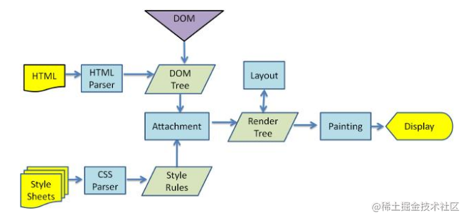

# 一、浏览器缓存

## 1. 为什么需要浏览器缓存？

对于浏览器的缓存，主要针对的是前端的静态资源，在发起请求之后，拉取相应的静态资源，并保存在本地。如果服务器的静态资源没有更新，那么在下次请求的时候，就直接从本地读取即可，如果服务器的静态资源已经更新，那么我们再次请求的时候，就到服务器拉取新的资源，并保存在本地。这样就大大的减少了请求的次数，提高了网站的性能。这就要用到浏览器的缓存策略了。

所谓的**浏览器缓存**指的是浏览器将用户请求过的静态资源，存储到电脑本地磁盘中，当浏览器再次访问时，就可以直接从本地加载，不需要再去服务端请求了。

使用浏览器缓存，有以下优点：

1. 减少了服务器的负担，提高了网站的性能。

2. 加快了客户端网页的加载速度。

3. 减少了多余网络数据传输。

## 2. 浏览器的缓存读取规则

浏览器的缓存按照缓存位置可以分为：

1. Service Worker
2. Memory Cache
3. Disk Cache
4. Push Cache

浏览器读取缓存时，按照上面优先级顺序依次查找缓存，如果以上都没有命中缓存，则会发起请求。

### 2.1 Service Worker

Service workers 是运行在浏览器主线程外的独立线程。与浏览器其他的缓存机制不同，它让开发者能够更自由的控制要缓存哪些文件，以及如何匹配缓存和读取缓存。

Service workers中的缓存是“长期存储”，关闭tab或关闭浏览器都不会被清除。只有手动调用 cache.delete(resource) 或者容量超过限制，才会被全部清除。

如果 Service Worker 中没有命中缓存，需要调用 fetch 函数获取数据，然后会根据后续的缓存优先级查找是否命中缓存。此处需要注意一点，不管后来命中了Memory Cache，Disk Cache， 还是从网络请求中获取的数据，浏览器都会标记为 `from ServiceWorker` 。

### 2.2 Memory Cache

Memory cache 指内存中的缓存。几乎所有的请求资源都可以缓存入 memory cache，我们通过预加载器（Preloader），预加载指令（<link rel=preload>）等获取的数据都是缓存到Memory cache中。当一个页面有两个相同的请求，实际上也只会请求一次，避免了浪费。

由于在内存中读取数据要比硬盘快，所以memory cache相对于Dist Cache读取更高效。

Memory Cache 是“短期存储”，正常情况下，当浏览器的Tab关闭后，当前Tab的 Memory Cache 便会被清除，特殊情况下，如果一个页面缓存内容特别多，占用了很多的内存，也可能在关闭Tab前，就清除了缓存。

需要注意：Memory Cache会忽视`max-age=0, no-cache`等http 头配置。但是如果设置头部字段设置了 `Cache-Control: no-store`，这样 Memory cache 就不会存储相关资源了。

### 2.3 Dist Cache

Dist Cache 指硬盘上的缓存。是一个持久化的缓存。Dist Cache允许相同的资源在跨会话、跨站点的情况下使用。Disk cache 会严格根据 HTTP 头信息中的各类字段来判定哪些资源可以缓存，哪些资源不可以缓存，以及哪些资源已经过期，哪些还可用。

命中Dist Cache缓存后，浏览器会从硬盘中读取对应的资源。我们所熟知的强缓存，协商缓存，都属于Dist Cahce。

相比于Service Worker，Dist Cache的缓存可以逐条删除，当浏览器需要空间去缓存新的数据或更重要的数据时会自动清除旧的缓存数据。

### 2.4 Push Cache

Push Cache是HTTP/2推送的资源存储的地方，如果HTTP/2会话关闭了，储存在其中的资源会自动清除。从不同的会话发起的请求不会命中Push Cache中的资源。

所有未被使用的资源在Push Cache会储存一段时间，如果有一个请求命中了Push Cache中的资源，这个资源就会从Push Cache中移除。

## 3. 什么是强缓存和协商缓存？

强缓存指客户端发起请求后，会先访问缓存中是否存在，如果存在，就返回对应资源。 

协商缓存是指需要向服务器发起请求，由服务器来决定是否使用缓存资源。

### 3.1 强缓存

浏览器中的缓存作用分为两种情况，一种是需要发送`HTTP`请求，一种是不需要发送。

首先是检查强缓存，这个阶段`不需要`发送HTTP请求。

如何来检查呢？通过相应的字段来进行，但是说起这个字段就有点门道了。

在`HTTP/1.0`和`HTTP/1.1`当中，这个字段是不一样的。在早期，也就是`HTTP/1.0`时期，使用的是**Expires**，而`HTTP/1.1`使用的是**Cache-Control**。让我们首先来看看Expires。

#### Expires

`Expires`即过期时间，存在于服务端返回的响应头中，告诉浏览器在这个过期时间之前可以直接从缓存里面获取数据，无需再次请求。比如下面这样:

```js
Expires: Wed, 22 Nov 2019 08:41:00 GMT
```

表示资源在`2019年11月22号8点41分`过期，过期了就得向服务端发请求。

这个方式看上去没什么问题，合情合理，但其实潜藏了一个坑，那就是**服务器的时间和浏览器的时间可能并不一致**，那服务器返回的这个过期时间可能就是不准确的。因此这种方式很快在后来的HTTP1.1版本中被抛弃了。

#### Cache-Control

在HTTP1.1中，采用了一个非常关键的字段：`Cache-Control`。这个字段也是存在于

它和`Expires`本质的不同在于它并没有采用`具体的过期时间点`这个方式，而是采用过期时长来控制缓存，对应的字段是**max-age**。比如这个例子:

```js
Cache-Control:max-age=3600
```

代表这个响应返回后在 3600 秒，也就是一个小时之内可以直接使用缓存。

如果你觉得它只有`max-age`一个属性的话，那就大错特错了。

它其实可以组合非常多的指令，完成更多场景的缓存判断, 将一些关键的属性列举如下: **public**: 客户端和代理服务器都可以缓存。因为一个请求可能要经过不同的`代理服务器`最后才到达目标服务器，那么结果就是不仅仅浏览器可以缓存数据，中间的任何代理节点都可以进行缓存。

**private**： 这种情况就是只有浏览器能缓存了，中间的代理服务器不能缓存。

**no-cache**: 跳过当前的强缓存，发送HTTP请求，即直接进入`协商缓存阶段`。

**no-store**：非常粗暴，不进行任何形式的缓存。

**s-maxage**：这和`max-age`长得比较像，但是区别在于s-maxage是针对代理服务器的缓存时间。

值得注意的是，当**Expires**和**Cache-Control**同时存在的时候，**Cache-Control**会优先考虑。

当然，还存在一种情况，当资源缓存时间超时了，也就是`强缓存`失效了，接下来怎么办？没错，这样就进入到第二级屏障——**协商缓存**了。

### 3.2 协商缓存

强缓存失效之后，浏览器在请求头中携带相应的`缓存tag`来向服务器发请求，由服务器根据这个tag，来决定是否使用缓存，这就是**协商缓存**。

具体来说，这样的缓存tag分为两种: **Last-Modified** 和 **ETag**。这两者各有优劣，并不存在谁对谁有`绝对的优势`，跟上面强缓存的两个 tag 不一样。

#### Last-Modified

即最后修改时间。在浏览器第一次给服务器发送请求后，服务器会在响应头中加上这个字段。

浏览器接收到后，如果再次请求，会在请求头中携带`If-Modified-Since`字段，这个字段的值也就是服务器传来的最后修改时间。

服务器拿到请求头中的`If-Modified-Since`的字段后，其实会和这个服务器中`该资源的最后修改时间`对比:

- 如果请求头中的这个值小于最后修改时间，说明是时候更新了。返回新的资源，跟常规的HTTP请求响应的流程一样。
- 否则返回304，告诉浏览器直接用缓存。

#### ETag

`ETag` 是服务器根据当前文件的内容，给文件生成的唯一标识，只要里面的内容有改动，这个值就会变。服务器通过`响应头`把这个值给浏览器。

浏览器接收到`ETag`的值，会在下次请求时，将这个值作为**If-None-Match**这个字段的内容，并放到请求头中，然后发给服务器。

服务器接收到**If-None-Match**后，会跟服务器上该资源的**ETag**进行比对:

- 如果两者不一样，说明要更新了。返回新的资源，跟常规的HTTP请求响应的流程一样。
- 否则返回304，告诉浏览器直接用缓存。

#### 两者对比

1. 在`精准度`上，`ETag`优于`Last-Modified`。优于 ETag 是按照内容给资源上标识，因此能准确感知资源的变化。而 Last-Modified 就不一样了，它在一些特殊的情况并不能准确感知资源变化，主要有两种情况:

- 编辑了资源文件，但是文件内容并没有更改，这样也会造成缓存失效。
- Last-Modified 能够感知的单位时间是秒，如果文件在 1 秒内改变了多次，那么这时候的 Last-Modified 并没有体现出修改了。

2. 在性能上，`Last-Modified`优于`ETag`，也很简单理解，`Last-Modified`仅仅只是记录一个时间点，而 `Etag`需要根据文件的具体内容生成哈希值。

另外，如果两种方式都支持的话，服务器会优先考虑`ETag`。

## 4. 描述下协商缓存的具体过程？

协商缓存通过以下字段控制：

```bash
If-Modified-since: Last-Modifed
If-None-Match: Etag
```

> `If-Modified-since: Last-Modifed`

浏览器初次请求时，服务端返回`Last-Modified`（最后修改时间）字段，浏览器再次发起请求时，请求头通过字段`If-Modified-Since`携带服务端返回的`Last-Modified`字段的值发给服务端，服务端拿到`If-Modified-Since`的值后，与服务器上资源最后的修改时间进行对比，相等则返回304，不同则说明资源已经更新。

> `If-None-Match: Etag`

浏览器初次发起请求，服务端返回`Etag`（根据当前文件内容生成的唯一标识码）字段，浏览器再次发起请求时，会在请求头通过`If-None-Match`携带服务器返回的`Etag`的值，服务器拿到`If-None-Match`的值和服务器中资源当前的`Etag`值对比，相同则返回304，证明缓存有效，否则说明服务器资源已更新。

> `Last-Modifed` 和 `Etag` 有什么区别

1. `Last-Modified`只能精确到秒，在秒级改变的情况下是无法更新的，如果文件在1秒内改变了多次，可能会导致客户端得到的资源不是最新的。
2. 关于`Etag`，每次客户端发出请求，服务端都会根据资源重新生成一个`Etag`，影响性能。
3. 两者同时存在时，服务器的Etag的优先级大于Last Modified。

## 5. 点击刷新按钮或者按 F5、按 Ctrl+F5 （强制刷新）、地址栏回车有什么区别？

- **点击刷新按钮或者按 F5：** 浏览器直接对本地的缓存文件过期，但是会带上If-Modifed-Since，If-None-Match，这就意味着服务器会对文件检查新鲜度，返回结果可能是 304，也有可能是 200。
- **用户按 Ctrl+F5（强制刷新）：** 浏览器不仅会对本地文件过期，而且不会带上 If-Modifed-Since，If-None-Match，相当于之前从来没有请求过，返回结果是 200。
- **地址栏回车**： 浏览器发起请求，按照正常流程，本地检查是否过期，然后服务器检查新鲜度，最后返回内容。

# 二、浏览器渲染

## 1. 请简述浏览器的渲染过程？



浏览器渲染过程如下：

1. 首先解析html生成DOM树，解析CSS生成CSSOM树
2. 将DOM树和CSSOM树结合生成渲染树(Render Tree)

3. 布局（layout）：根据生成的渲染树，计算它们在设备视口(viewport)内的确切位置和大小。

4. 绘制（paint）： 将渲染树的每个节点都转换为屏幕上的实际像素。

5. display 将像素发送给GPU，展示在页面上。

## 2. 什么是回流（Reflow）和重绘（Repaint）？

**重排（reflow）/回流**：页面布局或者几何属性发生改变，需要重新计算每个节点在设备视图上的具体位置及大小的过程，称为回流。

**重绘**：节点样式或几何信息发生改变但不会影响到布局，但需要转化重新将渲染树的节点转换为屏幕上的实际像素。这个过程称为重绘。

## 3. 哪些操作会触发回流和重绘？

只要页面的布局或几何信息发生变化会影响到布局的，就会触发回流。例如下面情况会触发回流：

1. 元素的位置、尺寸发生变化
2. 添加/删除可见的dom元素
3. 浏览器窗口大小发生变化

**注意：** 回流一定会触发重绘，而重绘不一定会回流。
节点样式或几何信息改变发生改变但不会影响到布局的，只会发生重绘，如visibility, color、background-color等改变。

## 4. 如何减少回流和重绘？

由于回流和重绘会带来很大的性能开销，开发中我们要尽量避免或减少回流和重绘的次数。

1. 避免频繁操作DOM，可以通过创建documentFragment，完成所有所有DOM操作后，最后再把它添加到文档中。
2. 避免频繁操作样式，最好一次性重写style属性，或者将样式列表定义为class并一次性更改class属性。
3. 对具有复杂动画的元素使用绝对定位，使其脱离文档流，否则会引起父元素及后续元素频繁回流。
4. 避免频繁读取会引发回流/重绘的属性，如果确实需要多次使用，就用一个变量缓存起来。

5. 开启css3硬件加速 使用css3硬件加速，会把需要渲染的元素放到特定的复合层中渲染，可以让transform、opacity、filters这些动画不会引起回流重绘。

## 5. 浏览器渲染过程中遇到 JS 文件如何处理？

JavaScript 的加载、解析与执行会阻塞文档的解析，也就是说，在构建 DOM 时，HTML 解析器若遇到了 JavaScript，那么它会暂停文档的解析，将控制权移交给 JavaScript 引擎，等 JavaScript 引擎运行完毕，浏览器再从中断的地方恢复继续解析文档。

也就是说，如果想要首屏渲染的越快，就越不应该在首屏就加载 JS 文件，这也是都建议将 script 标签放在 body 标签底部的原因。当然在当下，并不是说 script 标签必须放在底部，因为你可以给 script 标签添加 `defer` 或者 `async` 属性。

## 6. 什么是文档的预解析？

Webkit 和 Firefox 都做了这个优化，当执行 JavaScript 脚本时，另一个线程解析剩下的文档，并加载后面需要通过网络加载的资源。这种方式可以使资源并行加载从而使整体速度更快。需要注意的是，预解析并不改变 DOM 树，它将这个工作留给主解析过程，自己只解析外部资源的引用，比如外部脚本、样式表及图片。

## 7. CSS 如何阻塞文档解析？

理论上，既然样式表不改变 DOM 树，也就没有必要停下文档的解析等待它们。然而，存在一个问题，JavaScript 脚本执行时可能在文档的解析过程中请求样式信息，如果样式还没有加载和解析，脚本将得到错误的值，显然这将会导致很多问题。

所以**如果浏览器尚未完成 CSSOM 的下载和构建，而我们却想在此时运行脚本，那么浏览器将延迟 JavaScript 脚本执行和文档的解析，直至其完成 CSSOM 的下载和构建。** 也就是说，在这种情况下，浏览器会先下载和构建 CSSOM，然后再执行 JavaScript，最后再继续文档的解析。

# 三、浏览器安全

## 1. 有哪些可能引起前端安全的问题?

- **跨站脚本** (Cross-Site Scripting, XSS): ⼀种代码注⼊⽅式, 为了与 CSS 区分所以被称作 XSS。早期常⻅于⽹络论坛, 起因是⽹站没有对⽤户的输⼊进⾏严格的限制, 使得攻击者可以将脚本上传到帖⼦让其他⼈浏览到有恶意脚本的⻚⾯, 其注⼊⽅式很简单包括但不限于 JavaScript / CSS / Flash 等；
- **iframe的滥⽤**: iframe中的内容是由第三⽅来提供的，默认情况下他们不受控制，他们可以在iframe中运⾏JavaScirpt脚本、Flash插件、弹出对话框等等，这可能会破坏前端⽤户体验；
- **跨站点请求伪造**（Cross-Site Request Forgeries，CSRF）: 指攻击者通过设置好的陷阱，强制对已完成认证的⽤户进⾏⾮预期的个⼈信息或设定信息等某些状态更新，属于被动攻击
- **恶意第三⽅库**: ⽆论是后端服务器应⽤还是前端应⽤开发，绝⼤多数时候都是在借助开发框架和各种类库进⾏快速开发，⼀旦第三⽅库被植⼊恶意代码很容易引起安全问题。

## 2. 网络劫持有哪几种，如何防范？

⽹络劫持分为两种:

（1）**DNS劫持**: (输⼊京东被强制跳转到淘宝这就属于dns劫持)

- DNS强制解析: 通过修改运营商的本地DNS记录，来引导⽤户流量到缓存服务器
- 302跳转的⽅式: 通过监控⽹络出⼝的流量，分析判断哪些内容是可以进⾏劫持处理的,再对劫持的内存发起302跳转的回复，引导⽤户获取内容

（2）**HTTP劫持**: (访问⾕歌但是⼀直有贪玩蓝⽉的⼴告),由于http明⽂传输,运营商会修改你的http响应内容(即加⼴告)

DNS劫持由于涉嫌违法，已经被监管起来，现在很少会有DNS劫持，⽽http劫持依然⾮常盛⾏，最有效的办法就是全站HTTPS，将HTTP加密，这使得运营商⽆法获取明⽂，就⽆法劫持你的响应内容。


## 3. 前端安全了解吗，说一下 XSS 和 CSRF，以及怎么规避

### 3.1 **XSS**：`跨域脚本攻击`

XSS 攻击指的是跨站脚本攻击，是一种代码注入攻击。攻击者通过在网站注入恶意脚本，使之在用户的浏览器上运行，从而盗取用户的信息如 cookie 等。

XSS 的本质是因为网站没有对恶意代码进行过滤，与正常的代码混合在一起了，浏览器没有办法分辨哪些脚本是可信的，从而导致了恶意代码的执行。

攻击者可以通过这种攻击方式可以进行以下操作：

- 获取页面的数据，如DOM、cookie、localStorage；
- DOS攻击，发送合理请求，占用服务器资源，从而使用户无法访问服务器；
- 破坏页面结构；
- 流量劫持（将链接指向某网站）；

**防御方法**

可以从浏览器的执行来进行预防，一种是使用纯前端的方式，不用服务器端拼接后返回（不使用服务端渲染）。另一种是对需要插入到 HTML 中的代码做好充分的转义。对于 DOM 型的攻击，主要是前端脚本的不可靠而造成的，对于数据获取渲染和字符串拼接的时候应该对可能出现的恶意代码情况进行判断。

### 3.2 **CSRF**：`跨站请求伪造`

CSRF 攻击指的是**跨站请求伪造攻击**，攻击者诱导用户进入一个第三方网站，然后该网站向被攻击网站发送跨站请求。如果用户在被攻击网站中保存了登录状态，那么攻击者就可以利用这个登录状态，绕过后台的用户验证，冒充用户向服务器执行一些操作。

CSRF 攻击的**本质是利用 cookie 会在同源请求中携带发送给服务器的特点，以此来实现用户的冒充。**

**CSRF 攻击可以使用以下方法来防护：**

- **进行同源检测**，服务器根据 http 请求头中 origin 或者 referer 信息来判断请求是否为允许访问的站点，从而对请求进行过滤。
- **使用 CSRF Token 进行验证**，服务器向用户返回一个随机数 Token ，当网站再次发起请求时，在请求参数中加入服务器端返回的 token ，然后服务器对这个 token 进行验证。
- **对 Cookie 进行双重验证**，服务器在用户访问网站页面时，向请求域名注入一个Cookie，内容为随机字符串，然后当用户再次向服务器发送请求的时候，从 cookie 中取出这个字符串，添加到 URL 参数中，然后服务器通过对 cookie 中的数据和参数中的数据进行比较，来进行验证。
- **在设置 cookie 属性的时候设置 Samesite ，限制 cookie 不能作为被第三方使用**，从而可以避免被攻击者利用。Samesite 一共有两种模式，一种是严格模式，在严格模式下 cookie 在任何情况下都不可能作为第三方 Cookie 使用，在宽松模式下，cookie 可以被请求是 GET 请求，且会发生页面跳转的请求所使用。

### 3.3 什么是中间人攻击？

中间⼈ (Man-in-the-middle attack, MITM) 是指攻击者与通讯的两端分别创建独⽴的联系, 并交换其所收到的数据, 使通讯的两端认为他们正在通过⼀个私密的连接与对⽅直接对话, 但事实上整个会话都被攻击者完全控制。在中间⼈攻击中，攻击者可以拦截通讯双⽅的通话并插⼊新的内容。

攻击过程如下:

- 客户端发送请求到服务端，请求被中间⼈截获
- 服务器向客户端发送公钥
- 中间⼈截获公钥，保留在⾃⼰⼿上。然后⾃⼰⽣成⼀个**伪造的**公钥，发给客户端
- 客户端收到伪造的公钥后，⽣成加密hash值发给服务器
- 中间⼈获得加密hash值，⽤⾃⼰的私钥解密获得真秘钥,同时⽣成假的加密hash值，发给服务器
- 服务器⽤私钥解密获得假密钥,然后加密数据传输给客户端

## 第7篇: 能不能说一说XSS攻击？

###  7.1什么是 XSS 攻击？

`XSS` 全称是 `Cross Site Scripting`(即`跨站脚本`)，为了和 CSS 区分，故叫它`XSS`。XSS 攻击是指浏览器中执行恶意脚本(无论是跨域还是同域)，从而拿到用户的信息并进行操作。

这些操作一般可以完成下面这些事情:

1. 窃取`Cookie`。
2. 监听用户行为，比如输入账号密码后直接发送到黑客服务器。
3. 修改 DOM 伪造登录表单。
4. 在页面中生成浮窗广告。

通常情况，XSS 攻击的实现有三种方式——**存储型**、**反射型**和**文档型**。原理都比较简单，先来一一介绍一下。

#### 存储型

`存储型`，顾名思义就是将恶意脚本存储了起来，确实，存储型的 XSS 将脚本存储到了服务端的数据库，然后在客户端执行这些脚本，从而达到攻击的效果。

常见的场景是留言评论区提交一段脚本代码，如果前后端没有做好转义的工作，那评论内容存到了数据库，在页面渲染过程中`直接执行`, 相当于执行一段未知逻辑的 JS 代码，是非常恐怖的。这就是存储型的 XSS 攻击。

#### 反射型

`反射型XSS`指的是恶意脚本作为**网络请求的一部分**。

比如我输入:

```js
http://sanyuan.com?q=<script>alert("你完蛋了")</script>
```

这杨，在服务器端会拿到`q`参数,然后将内容返回给浏览器端，浏览器将这些内容作为HTML的一部分解析，发现是一个脚本，直接执行，这样就被攻击了。

之所以叫它`反射型`, 是因为恶意脚本是通过作为网络请求的参数，经过服务器，然后再反射到HTML文档中，执行解析。和`存储型`不一样的是，服务器并不会存储这些恶意脚本。

#### 文档型

文档型的 XSS 攻击并不会经过服务端，而是作为中间人的角色，在数据传输过程劫持到网络数据包，然后**修改里面的 html 文档**！

这样的劫持方式包括`WIFI路由器劫持`或者`本地恶意软件`等。

### 7.2防范措施

明白了三种`XSS`攻击的原理，我们能发现一个共同点: 都是让恶意脚本直接能在浏览器中执行。

那么要防范它，就是要避免这些脚本代码的执行。

为了完成这一点，必须做到**一个信念，两个利用**。

#### 一个信念

千万不要相信任何用户的输入！

无论是在前端和服务端，都要对用户的输入进行**转码**或者**过滤**。

如:

```js
<script>alert('你完蛋了')</script>
```

转码后变为:

```js
&lt;script&gt;alert(&#39;你完蛋了&#39;)&lt;/script&gt;
```

这样的代码在 html 解析的过程中是无法执行的。

当然也可以利用关键词过滤的方式，将 script 标签给删除。那么现在的内容什么也没有了。

#### 利用 CSP

CSP，即浏览器中的内容安全策略，它的核心思想就是服务器决定浏览器加载哪些资源，具体来说可以完成以下功能:

1. 限制其他域下的资源加载。
2. 禁止向其它域提交数据。
3. 提供上报机制，能帮助我们及时发现 XSS 攻击。

#### 利用 HttpOnly

很多 XSS 攻击脚本都是用来窃取Cookie, 而设置 Cookie 的 HttpOnly 属性后，JavaScript 便无法读取 Cookie 的值。这样也能很好的防范 XSS 攻击。

### 7.3总结

`XSS` 攻击是指浏览器中执行恶意脚本, 然后拿到用户的信息进行操作。主要分为`存储型`、`反射型`和`文档型`。防范的措施包括:

- 一个信念: 不要相信用户的输入，对输入内容转码或者过滤，让其不可执行。
- 两个利用: 利用 CSP，利用 Cookie 的 HttpOnly 属性。

## 第8篇: 能不能说一说CSRF攻击？

### 什么是CSRF攻击？

CSRF(Cross-site request forgery), 即跨站请求伪造，指的是黑客诱导用户点击链接，打开黑客的网站，然后黑客利用用户**目前的登录状态**发起跨站请求。

举个例子, 你在某个论坛点击了黑客精心挑选的小姐姐图片，你点击后，进入了一个新的页面。

那么恭喜你，被攻击了:）

你可能会比较好奇，怎么突然就被攻击了呢？接下来我们就来拆解一下当你点击了链接之后，黑客在背后做了哪些事情。

可能会做三样事情。列举如下：

#### 1. 自动发 GET 请求

黑客网页里面可能有一段这样的代码:

```js

```

进入页面后自动发送 get 请求，值得注意的是，这个请求会自动带上关于 xxx.com 的 cookie 信息(这里是假定你已经在 xxx.com 中登录过)。

假如服务器端没有相应的验证机制，它可能认为发请求的是一个正常的用户，因为携带了相应的 cookie，然后进行相应的各种操作，可以是转账汇款以及其他的恶意操作。

#### 2. 自动发 POST 请求

黑客可能自己填了一个表单，写了一段自动提交的脚本。

```html
<form id='hacker-form' action="https://xxx.com/info" method="POST">
  <input type="hidden" name="user" value="hhh" />
  <input type="hidden" name="count" value="100" />
</form>
<script>document.getElementById('hacker-form').submit();</script>
```

同样也会携带相应的用户 cookie 信息，让服务器误以为是一个正常的用户在操作，让各种恶意的操作变为可能。

#### 3. 诱导点击发送 GET 请求

在黑客的网站上，可能会放上一个链接，驱使你来点击:

```html
<a href="https://xxx/info?user=hhh&count=100" taget="_blank">点击进入修仙世界</a>
```

点击后，自动发送 get 请求，接下来和`自动发 GET 请求`部分同理。

这就是`CSRF`攻击的原理。和`XSS`攻击对比，CSRF 攻击并不需要将恶意代码注入用户当前页面的`html`文档中，而是跳转到新的页面，利用服务器的**验证漏洞**和**用户之前的登录状态**来模拟用户进行操作。

### 防范措施

#### 1. 利用Cookie的SameSite属性

`CSRF攻击`中重要的一环就是自动发送目标站点下的 `Cookie`,然后就是这一份 Cookie 模拟了用户的身份。因此在`Cookie`上面下文章是防范的不二之选。

恰好，在 Cookie 当中有一个关键的字段，可以对请求中 Cookie 的携带作一些限制，这个字段就是`SameSite`。

`SameSite`可以设置为三个值，`Strict`、`Lax`和`None`。

**a.** 在`Strict`模式下，浏览器完全禁止第三方请求携带Cookie。比如请求`sanyuan.com`网站只能在`sanyuan.com`域名当中请求才能携带 Cookie，在其他网站请求都不能。

**b.** 在`Lax`模式，就宽松一点了，但是只能在 `get 方法提交表单`况或者`a 标签发送 get 请求`的情况下可以携带 Cookie，其他情况均不能。

**c.** 在`None`模式下，也就是默认模式，请求会自动携带上 Cookie。

#### 2. 验证来源站点

这就需要要用到请求头中的两个字段: **Origin**和**Referer**。

其中，**Origin**只包含域名信息，而**Referer**包含了`具体`的 URL 路径。

当然，这两者都是可以伪造的，通过 Ajax 中自定义请求头即可，安全性略差。

#### 3. CSRF Token

`Django`作为 Python 的一门后端框架，如果是用它开发过的同学就知道，在它的模板(template)中, 开发表单时，经常会附上这样一行代码:

```js

```

这就是`CSRF Token`的典型应用。那它的原理是怎样的呢？

首先，浏览器向服务器发送请求时，服务器生成一个字符串，将其植入到返回的页面中。

然后浏览器如果要发送请求，就必须带上这个字符串，然后服务器来验证是否合法，如果不合法则不予响应。这个字符串也就是`CSRF Token`，通常第三方站点无法拿到这个 token, 因此也就是被服务器给拒绝。

### 总结

CSRF(Cross-site request forgery), 即跨站请求伪造，指的是黑客诱导用户点击链接，打开黑客的网站，然后黑客利用用户目前的登录状态发起跨站请求。

`CSRF`攻击一般会有三种方式:

- 自动 GET 请求
- 自动 POST 请求
- 诱导点击发送 GET 请求。

防范措施: `利用 Cookie 的 SameSite 属性`、`验证来源站点`和`CSRF Token`。

# 四、浏览器网络

## 1. 进程与线程的概念

从本质上说，进程和线程都是 CPU 工作时间片的一个描述：

- 进程描述了 CPU 在运行指令及加载和保存上下文所需的时间，放在应用上来说就代表了一个程序。
- 线程是进程中的更小单位，描述了执行一段指令所需的时间。

**进程是资源分配的最小单位，线程是CPU调度的最小单位。**

## 2. 进程和线程的区别

- 进程可以看做独立应用，线程不能。
- **资源**：进程是cpu资源分配的最小单位（是能拥有资源和独立运行的最小单位）；线程是cpu调度的最小单位（线程是建立在进程的基础上的一次程序运行单位，一个进程中可以有多个线程）。
- **通信方面**：线程间可以通过直接共享同一进程中的资源，而进程通信需要借助进程间通信。
- **调度**：进程切换比线程切换的开销要大。线程是CPU调度的基本单位，线程的切换不会引起进程切换，但某个进程中的线程切换到另一个进程中的线程时，会引起进程切换。
- **系统开销**：由于创建或撤销进程时，系统都要为之分配或回收资源，如内存、I/O 等，其开销远大于创建或撤销线程时的开销。同理，在进行进程切换时，涉及当前执行进程 CPU 环境还有各种各样状态的保存及新调度进程状态的设置，而线程切换时只需保存和设置少量寄存器内容，开销较小。

## 3. 什么是同源策略，什么是跨域

**同源策略：protocol（协议）、domain（域名）、port（端口）三者必须一致。**

**同源政策主要限制了三个方面：**

- 当前域下的 js 脚本不能够访问其他域下的 cookie、localStorage 和 indexDB。
- 当前域下的 js 脚本不能够操作访问操作其他域下的 DOM。
- 当前域下 ajax 无法发送跨域请求。

同源政策的目的主要是为了保证用户的信息安全，它只是对 js 脚本的一种限制，并不是对浏览器的限制，对于一般的 img、或者script 脚本请求都不会有跨域的限制，这是因为这些操作都不会通过响应结果来进行可能出现安全问题的操作。

**什么是跨域**

指的是浏览器不能执行其他网站的脚本，它是由浏览器的同源策略造成的,是浏览器对 javascript 施加的安全限制，防止他人恶意攻击网站

**跨域问题其实就是浏览器的同源策略造成的。**

## 4. 如何解决跨越问题

### 4.1 CORS

CORS需要浏览器和服务器同时支持，整个CORS过程都是浏览器完成的，无需用户参与。因此实现**CORS的关键就是服务器，只要服务器实现了CORS请求**，就可以跨源通信了。

### 4.2 JSONP

**jsonp**的原理就是利用`<script>`标签没有跨域限制，通过`<script>`标签src属性，发送带有callback参数的GET请求，服务端将接口返回数据拼凑到callback函数中，返回给浏览器，浏览器解析执行，从而前端拿到callback函数返回的数据。

**优点**

- 实现简单
- 兼容性好, 可用于解决主流浏览器的跨域数据访问的问题。

**缺点**

- 只支持 GET 请求 
- 存在被 XSS 攻击的可能, 缺乏安全性保证
- 需要服务端配合改造

### 4.3 postMessage

postMessage是HTML5 XMLHttpRequest Level 2中的API，且是为数不多可以跨域操作的window属性之一，它可用于解决以下方面的问题：

- 页面和其打开的新窗口的数据传递
- 多窗口之间消息传递
- 页面与嵌套的iframe消息传递
- 上面三个场景的跨域数据传递

用法：postMessage(data,origin)方法接受两个参数：

- **data**： html5规范支持任意基本类型或可复制的对象，但部分浏览器只支持字符串，所以传参时最好用JSON.stringify()序列化。
- **origin**： 协议+主机+端口号，也可以设置为"*"，表示可以传递给任意窗口，如果要指定和当前窗口同源的话设置为"/"。

### 4.4 Node中间件代理(proxy正向代理)

实现原理：**同源策略是浏览器需要遵循的标准，而如果是服务器向服务器请求就无需遵循同源策略。** 代理服务器，需要做以下几个步骤：

- 接受客户端请求 。
- 将请求 转发给服务器。
- 拿到服务器 响应 数据。

### 4.5 nginx反向代理

实现原理类似于Node中间件代理，需要你搭建一个中转nginx服务器，用于转发请求。

使用nginx反向代理实现跨域，是最简单的跨域方式。只需要修改nginx的配置即可解决跨域问题，支持所有浏览器，支持session，不需要修改任何代码，并且不会影响服务器性能。

实现思路：通过nginx配置一个代理服务器（域名与domain1相同，端口不同）做跳板机，反向代理访问domain2接口，并且可以顺便修改cookie中domain信息，方便当前域cookie写入，实现跨域登录。

## 5. 正向代理和反向代理的区别

- **正向代理：**

客户端想获得一个服务器的数据，但是因为种种原因无法直接获取。于是客户端设置了一个代理服务器，并且指定目标服务器，之后代理服务器向目标服务器转交请求并将获得的内容发送给客户端。这样本质上起到了对真实服务器隐藏真实客户端的目的。实现正向代理需要修改客户端，比如修改浏览器配置。

- **反向代理：**

服务器为了能够将工作负载分不到多个服务器来提高网站性能 (负载均衡)等目的，当其受到请求后，会首先根据转发规则来确定请求应该被转发到哪个服务器上，然后将请求转发到对应的真实服务器上。这样本质上起到了对客户端隐藏真实服务器的作用。 一般使用反向代理后，需要通过修改 DNS 让域名解析到代理服务器 IP，这时浏览器无法察觉到真正服务器的存在，当然也就不需要修改配置了。

## 6. 前端如何实现即时通讯？websocket

严格意义上: HTTP协议只能做到客户端请求服务器, 服务器做出响应, 做不到让服务器主动给客户端推送消息!

**那么如果服务器数据更新了, 想要即时通知到客户端怎么办呢 ? (即时通信需求)**

即时通信需求: 服务器数据一有更新, 希望推送给到浏览器

提问的回答重心:

1. 即时通信有哪些方案?
2. 为什么使用了其中某一个方案! websocket

基于Web的前端，存在以下几种可实现即时通讯的方式：

- 短轮询 (历史方案)

  开个定时器, 每隔一段时间发请求 (实时性不强，影响性能)

- Comet - ajax长轮询(历史方案)

  发送一个请求, 服务器只要数据不更新, 就一直阻塞 (服务器压力过大)

- SSE

  (利用了http协议, 流数据的传输, 并不是严格意义的双向通信, 无法复用连接)

- WebSocket (主流)

  性能和效率都高!

## 7. 说一下websocket

**websocket是一种网络通信协议**，是HTML5开始提供的一种在单个TCP连接上进行全双工通信的协议，这个对比着HTTP协议来说，HTTP协议是一种无状态的、无连接的、单向的应用层协议，通信请求只能由客户端发起，服务端对请求做出应答处理。

**HTTP协议无法实现服务器主动向客户端发起消息**，websocket连接允许客户端和服务器之间进行全双工通信，以便任一方都可以通过建立的连接将数据推送到另一端。websocket只需要建立一次连接，就可以一直保持连接状态。

## 8. 什么是轮询

**轮询：隔一段时间进行一次查询或者询问**

轮询分为长轮询和短轮询，长轮询是基于短轮询的一个优化结果。

**短轮询：**

通过客户端定期轮询来询问服务端是否有新的信息产生，如果有则返回，没有就不响应， 缺点：也是显而易见，轮询间隔大了则信息不够实时，轮询间隔过小又会消耗过多的流量，增加服务器的负担。

**长轮询：**

是需要服务端进行更改来进行支持，客户端向服务端发送请求时，如果此时服务端没有新的信息产生，并不立刻返回，而是`Hold`住一段时间等有新的信息或者超时再返回，客户端收到服务器的应答后继续轮询。可以看到长轮询比短轮询可以减少大量无用的请求，并且客户端接收取新消息也会实时不少。减少`http`请求对性能的优化是很有利的，所以他是短轮询上的一个优化 缺点：终归来讲还是一个`http`请求，只是进行了变化而已，而且如果客户端不请求，服务端有数据的话，也会一直累积在那，不能实现实时的双向通信

此时的`webSocket`也就**应需而生**了

## 9. 前端怎么做SEO优化

**什么是SEO**

SEO(Search Engine Optimization)，即搜索引擎优化。SEO是随着搜索引擎的出现而来的，两者是相互促进，互利共生的关系。SEO的存在就是为了提升网页在搜索引擎自然搜索结果中的收录数量以及排序位置而做的优化行为。而优化的目的就是为了提升网站在搜索引擎中的权重，增加对搜索引擎的友好度，使得用户在访问网站时能排在前面。

**为什么要做SEO**

提高网站的权重，增强搜索引擎友好度，以达到提高排名，增加流量，改善（潜在）用户体验，促进销售的作用。

**前端怎么做SEO优化**

1. 网站结构布局优化: 尽量简单
   - 控制首页链接数量
   - 网页层级不要太深
   - 控制页面大小, 减少HTTP请求, 提高网站的加载速度
   - 尽量使用语义化标签
   - 利用浏览器缓存

## 10. 请简述JSONP的原理

`jsonp`实现跨域，主要是通过`script`标签，因为`script`标签对请求资源没有跨域限制。

前后端约定一个字段名，比如`callback`，用来传递回调函数名，后端处理得到数据后，拼出“将数据传递给该函数并执行该函数”的js语句，将其返回给浏览器，浏览器解析执行，从而使得前端可以使用对应的callback函数，拿到数据。


因为`jsonp`是利用`script`标签来实现，所以`jsonp`只能支持`GET`请求，这是它的一个局限。

```js
let script = document.createElement('script');
script.src = 'http://www.yushihu.com?callback=myCallback';
document.body.appendChild(script);
function myCallback(data) {
  console.log(data)
}
```

## 11. 请简述一下CORS的原理

`CORS`（跨域资源共享），实现的基本思想是通过自定义的`HTTP`头部让浏览器与服务器之间进行沟通，从而决定请求或响应应该是成功，还是失败。

对于开发者来说，`CORS`通信与正常的的`ajsx`没有差别，代码也完全一样。只要浏览器发现`ajax`请求跨源，就会自动在头部添加一些附加的头信息，用户也不会感知。
所以`CORS`通信实现的关键是服务器，只要服务器支持了`CORS`接口，就能够进行跨域请求。

CORS请求有两类：

只要满足以下两个条件，浏览器就会认为是简单请求，否则就会认为是非简单请求。

1. 请求方法是`GET`、`HEAD`、`POST`中的一个。
2. HTTP的头信息不超出以下几种字段，Accept、Accept-Language、Content-Language、Last-Event-ID、Content-Type：只能是三个值中的一个application/x-www-form-urlencoded、multipart/form-data、text/plain。

> 1. 简单请求

对于简单请求，浏览器会在头信息之中，增加一个`Origin`字段，`Origin`字段用来说明，本次请求来自哪个源，服务端会通过这个字段来判断是否允许这次请求。
如果该源在服务端允许的范围内，服务端会在响应的头部信息中增加以下字段：

1. Access-Control-Allow-Origin 必须字段，表示服务器接受的域名
2. Access-Control-Allow-Credentials 可选字段，表示是否允许发送Cookie
3. Access-Control-Expose-Headers 可选字段，表示CORS请求增加了的字段。

> 在CORS请求中，通过XMLHttpRequest对象的getResponseHeader()只能拿到6个字段（Cache-Control、Content-Language、Content-Type、Expires、Last-Modified、Pragma），想获取其他字段就必须在Access-Control-Expose-Headers里面指定。

如果该源不在浏览器的允许范围内，浏览器会正常响应请求，但不会增加上述字段，浏览器通过判断头信息中没有Access-Control-Allow-Origin字段，就知道请求出错了，并抛出错误信息。

> 2. 非简单请求

对于非简单请求，浏览器会在正式发起请求前，发送一个“预检”请求，向服务器询问当前域名是否在许可的名单之中以及可以使用哪些头部信息，如果得到服务器的肯定答复，则会发出正式的请求，否则会报错。
"预检"请求的请求方法是OPTIONS，会携带字段：

1. Origin 发起请求的源
2. Access-Control-Request-Method 发起请求使用的Method
3. Access-Control-Request-Headers 逗号分隔，指定请求会额外发送的头信息字段。

服务器收到"预检"请求以后，会检查Origin、Access-Control-Request-Method和Access-Control-Request-Headers字段，如果通过则在响应的头信息中会增加以下字段：

1. Access-Control-Allow-Origin 与简单请求该字段一致
2. Access-Control-Allow-Methods 必须字段，表示服务器支持的所有跨域请求的方法
3. Access-Control-Allow-Headers 表示服务器支持的所有头部字段， 如果浏览器请求包括Access-Control-Request-Headers字段，则Access-Control-Allow-Headers字段是必需的。
4. Access-Control-Allow-Credentials 与简单请求该字段一致
5. Access-Control-Max-Age 可选，表示本次预检请求的有效期

预检请求通过，后续的CORS通信就和简单请求一致了。如果预检请求，服务端做出的回应是不允许，此时服务端也会正常响应，只是响应头信息中不会携带和CORS有关的头部字段，浏览器据此判断请求失败，抛出错误信息。

## 12. 如何实现浏览器内多个标签页之间的通信?

实现多个标签页之间的通信，本质上都是通过中介者模式来实现的。因为标签页之间没有办法直接通信，因此我们可以找一个中介者，让标签页和中介者进行通信，然后让这个中介者来进行消息的转发。通信方法如下：

- **使用 websocket 协议**，因为 websocket 协议可以实现服务器推送，所以服务器就可以用来当做这个中介者。标签页通过向服务器发送数据，然后由服务器向其他标签页推送转发。
- **使用 ShareWorker 的方式**，shareWorker 会在页面存在的生命周期内创建一个唯一的线程，并且开启多个页面也只会使用同一个线程。这个时候共享线程就可以充当中介者的角色。标签页间通过共享一个线程，然后通过这个共享的线程来实现数据的交换。
- **使用 localStorage 的方式**，我们可以在一个标签页对 localStorage 的变化事件进行监听，然后当另一个标签页修改数据的时候，我们就可以通过这个监听事件来获取到数据。这个时候 localStorage 对象就是充当的中介者的角色。
- **使用 postMessage 方法**，如果我们能够获得对应标签页的引用，就可以使用postMessage 方法，进行通信。

# 五、浏览器存储

## 1. 浏览器本地存储的方式

浏览器的本地存储主要分为`Cookie`、`WebStorage`和`IndexedDB`, 其中`WebStorage`又可以分为`localStorage`和`sessionStorage`。接下来我们就来一一分析这些本地存储方案。

### Cookie

Cookie是最早被提出来的本地存储方式，在此之前，服务端是无法判断网络中的两个请求是否是同一用户发起的，为解决这个问题，Cookie就出现了。**Cookie的大小只有4kb**，它是一种纯文本文件，**每次发起HTTP请求都会携带Cookie。**

**Cookie的特性：**

- Cookie一旦创建成功，名称就无法修改
- Cookie是无法跨域名的，也就是说a域名和b域名下的cookie是无法共享的，这也是由Cookie的隐私安全性决定的，这样就能够阻止非法获取其他网站的Cookie
- 每个域名下Cookie的数量不能超过20个，每个Cookie的大小不能超过4kb
- 有安全问题，如果Cookie被拦截了，那就可获得session的所有信息，即使加密也于事无补，无需知道cookie的意义，只要转发cookie就能达到目的
- Cookie在请求一个新的页面的时候都会被发送过去

**如果需要域名之间跨域共享Cookie，有两种方法：**

1. 使用Nginx反向代理
2. 在一个站点登陆之后，往其他网站写Cookie。服务端的Session存储到一个节点，Cookie存储sessionId

### LocalStorage

LocalStorage是HTML5新引入的特性，由于有的时候我们存储的信息较大，Cookie就不能满足我们的需求，这时候LocalStorage就派上用场了。

**LocalStorage的优点：**

- 在大小方面，LocalStorage的大小一般为5MB，可以储存更多的信息
- LocalStorage是持久储存，并不会随着页面的关闭而消失，除非主动清理，不然会永久存在
- 仅储存在本地，不像Cookie那样每次HTTP请求都会被携带

**LocalStorage的缺点：**

- 存在浏览器兼容问题，IE8以下版本的浏览器不支持
- 如果浏览器设置为隐私模式，那我们将无法读取到LocalStorage
- LocalStorage受到同源策略的限制，即端口、协议、主机地址有任何一个不相同，都不会访问

### SessionStorage

SessionStorage和LocalStorage都是在HTML5才提出来的存储方案，SessionStorage 主要用于临时保存同一窗口(或标签页)的数据，刷新页面时不会删除，关闭窗口或标签页之后将会删除这些数据。

**SessionStorage与LocalStorage对比：**

- SessionStorage和LocalStorage都在**本地进行数据存储**；
- SessionStorage也有同源策略的限制，但是SessionStorage有一条更加严格的限制，SessionStorage**只有在同一浏览器的同一窗口下才能够共享**；
- LocalStorage和SessionStorage**都不能被爬虫爬取**；

### IndexedDB

`IndexedDB`是运行在浏览器中的`非关系型数据库`, 本质上是数据库，绝不是和刚才WebStorage的 5M 一个量级，理论上这个容量是没有上限的。

关于它的使用，本文侧重原理，而且 MDN 上的教程文档已经非常详尽，这里就不做赘述了，感兴趣可以看一下[使用文档](https://link.juejin.cn?target=https%3A%2F%2Fdeveloper.mozilla.org%2Fzh-CN%2Fdocs%2FWeb%2FAPI%2FIndexedDB_API%2FUsing_IndexedDB)。

接着我们来分析一下`IndexedDB`的一些重要特性，除了拥有数据库本身的特性，比如`支持事务`，`存储二进制数据`，还有这样一些特性需要格外注意：

1. 键值对存储。内部采用`对象仓库`存放数据，在这个对象仓库中数据采用**键值对**的方式来存储。
2. 异步操作。数据库的读写属于 I/O 操作, 浏览器中对异步 I/O 提供了支持。
3. 受同源策略限制，即无法访问跨域的数据库。

## 2. cookie localStorage sessionStorage 有什么区别

1. **生命周期**

   `cookie` 保存在内存中，随浏览器关闭失效，如果设置过期时间，在到期时间后失效

   `localStorage` 理论上永久有效，除非主动删除

   `sessionStorage` 仅在当前会话下有效，关闭页面或浏览器后会被清除

2. **存储容量**

   `cookie`：一个域下的`cookie`存储容量4k左右，超出将清除之前的设置。且有些浏览器会对一个域下的cookie个数做限制。
   `localStorage`：每个源下的大小限制5MB左右，不同浏览器不同
   `sessionStorage` ：不容浏览器不同，有些浏览器不会限制，有些会限制5MB左右

3. **是否与服务端交互**

   `cookie `和 `storage `都会保存在客户端，其中`cookie`会参与和服务端的交互，每次请求都会携带，而`storage`不会参与和服务端的交互。

4. **API易用性**

   `cookie`可以通过`document`获取全部`cookie`，获取的`cookie`是字符串格式的，操作起来比较麻烦，需要自己封装方法，或使用第三方库js-cookie等完成。

   `storage`提供了比较完善友好的API，`setItem`，`getItem`，`clear`，`removeItem`等

5. **浏览器兼容性**
   `cookie`没有兼容性问题，`storage`在IE8+浏览器可以正常使用
