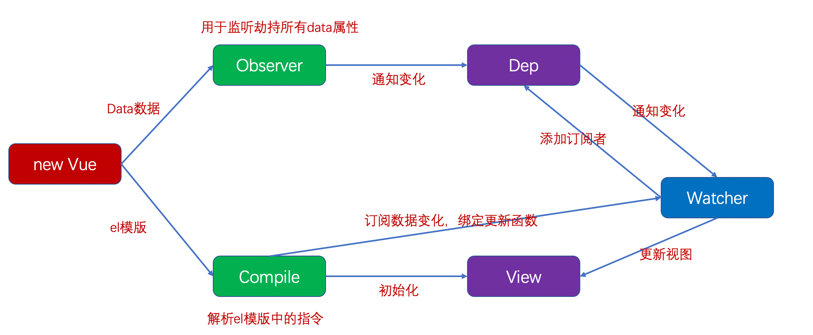

## 1. 那你能讲一讲MVVM吗？

MVVM是`Model-View-ViewModel`缩写，也就是把`MVC`中的`Controller`演变成`ViewModel`。`Model`层代表数据模型，`View`代表UI组件，`ViewModel`是View和Model层的桥梁，数据会绑定到viewModel层并自动将数据渲染到页面中，视图变化的时候会通知viewModel层更新数据。

## 2. Vue2.x响应式数据原理



图解：

```js
new vue({
	el:'#app',
	data:{}
})
observer:观察者。使用Object.defineProperty监听get 和set
```

1. vue内部是如何监听数据的改变

使用 Object.defineProperty 监听对象属性的改变

2. 当数据发生变化时，vue是如何知道要通知哪些人，界面发生刷新

使用发布订阅者模式

```js
let obj = {
    name: ''
}
// 1.监听数据的变化
Object.keys(obj).forEach(key => {
    let value = obj[key]
		// 重新定义对象属性实现监听
    Object.defineProperty(obj, key, {
        get() {
            // 监听哪些用到值
            return value
        },
        set(newvalue) {
            // 监听key的变化
            value = newvalue
          // 通知订阅者更新
            dep.notify()
        }
    })
})

// 2.发布者
class Dep {
    constructor() {
        // 保存订阅者
        this.subs = []
    }
    // 添加订阅者
    addsub(watcher) {
        this.subs.push(watcher)
    }
  // 通知订阅者更新
    notify(){
      // 找到所有订阅者，调用自己的更新函数
        this.subs.forEach(item=>{
            item.update()
        })
    }

}

// 3.订阅者
class watcher {
    constructor(name) {
        this.name = name
    }
    // 更新值
    update() {
			// this.name 发生了更新
    }
}
const dep = new Dep()

const w1 = new watcher('张三')
dep.addsub(w1)

const w2 = new watcher('李四')
dep.addsub(w2)

const w3 = new watcher('王五')
dep.addsub(w3)

dep.notify()
```

## 3. Vue3.x响应式数据原理吗？

Vue3.x改用`Proxy`替代`Object.defineProperty`。因为`Proxy`可以直接监听对象和数组的变化。

```js
import { mutableHandlers } from "./baseHandlers"; // 代理相关逻辑
import { isObject } from "./util"; // 工具方法

export function reactive(target) {
  // 根据不同参数创建不同响应式对象
  return createReactiveObject(target, mutableHandlers);
}
function createReactiveObject(target, baseHandler) {
  if (!isObject(target)) {
    return target;
  }
  const observed = new Proxy(target, baseHandler);
  return observed;
}

const get = createGetter();
const set = createSetter();

function createGetter() {
  return function get(target, key, receiver) {
    // 对获取的值进行放射
    const res = Reflect.get(target, key, receiver);
    console.log("属性获取", key);
    if (isObject(res)) {
      // 如果获取的值是对象类型，则返回当前对象的代理对象
      return reactive(res);
    }
    return res;
  };
}
function createSetter() {
  return function set(target, key, value, receiver) {
    const oldValue = target[key];
    const hadKey = hasOwn(target, key);
    const result = Reflect.set(target, key, value, receiver);
    if (!hadKey) {
      console.log("属性新增", key, value);
    } else if (hasChanged(value, oldValue)) {
      console.log("属性值被修改", key, value);
    }
    return result;
  };
}
export const mutableHandlers = {
  get, // 当获取属性时调用此方法
  set, // 当修改属性时调用此方法
};
```

> Proxy只会代理对象的第一层，那么Vue3又是怎样处理这个问题的呢？

判断当前`Reflect.get`的返回值是否为Object，如果是则再通过`reactive`方法做代理， 这样就实现了深度观测。

> 监测数组的时候可能触发多次`get/set`，那么如何防止触发多次呢？

我们可以判断key是否为当前被代理对象target自身属性，也可以判断旧值与新值是否相等，只有满足以上两个条件之一时，才有可能执行trigger。

## 4. vue2.x中如何监测数组变化

使用了函数劫持的方式，重写了数组的方法，Vue将data中的数组进行了原型链重写，指向了自己定义的数组原型方法。这样当调用数组api时，可以通知依赖更新。如果数组中包含着引用类型，会对数组中的引用类型再次递归遍历进行监控。这样就实现了监测数组变化。

## 5. nextTick知道吗，实现原理是什么？

在下次 DOM 更新循环结束之后执行延迟回调。nextTick主要使用了宏任务和微任务。根据执行环境分别尝试采用

- Promise
- MutationObserver
- setImmediate
- 如果以上都不行则采用setTimeout

定义了一个异步方法，多次调用`nextTick`会将方法存入队列中，通过这个异步方法清空当前队列。

相关代码如下：

```js
let callbacks = [];
let pending = false;
function flushCallbacks() {
  pending = false; //把标志还原为false
  // 依次执行回调
  for (let i = 0; i < callbacks.length; i++) {
    callbacks[i]();
  }
}
let timerFunc; //定义异步方法  采用优雅降级
if (typeof Promise !== "undefined") {
  // 如果支持promise
  const p = Promise.resolve();
  timerFunc = () => {
    p.then(flushCallbacks);
  };
} else if (typeof MutationObserver !== "undefined") {
  // MutationObserver 主要是监听dom变化 也是一个异步方法
  let counter = 1;
  const observer = new MutationObserver(flushCallbacks);
  const textNode = document.createTextNode(String(counter));
  observer.observe(textNode, {
    characterData: true,
  });
  timerFunc = () => {
    counter = (counter + 1) % 2;
    textNode.data = String(counter);
  };
} else if (typeof setImmediate !== "undefined") {
  // 如果前面都不支持 判断setImmediate
  timerFunc = () => {
    setImmediate(flushCallbacks);
  };
} else {
  // 最后降级采用setTimeout
  timerFunc = () => {
    setTimeout(flushCallbacks, 0);
  };
}

export function nextTick(cb) {
  // 除了渲染watcher  还有用户自己手动调用的nextTick 一起被收集到数组
  callbacks.push(cb);
  if (!pending) {
    // 如果多次调用nextTick  只会执行一次异步 等异步队列清空之后再把标志变为false
    pending = true;
    timerFunc();
  }
}
```

## 6. Vue的生命周期

`beforeCreate`是new Vue()之后触发的第一个钩子，在当前阶段data、methods、computed以及watch上的数据和方法都不能被访问。

`created`在实例创建完成后发生，当前阶段已经完成了数据观测，也就是可以使用数据，更改数据，在这里更改数据不会触发updated函数。可以做一些初始数据的获取，在当前阶段无法与Dom进行交互，如果非要想，可以通过`vm.$nextTick`来访问Dom。

`beforeMount`发生在挂载之前，在这之前template模板已导入渲染函数编译。而当前阶段虚拟Dom已经创建完成，即将开始渲染。在此时也可以对数据进行更改，不会触发updated。

`mounted`在挂载完成后发生，在当前阶段，真实的Dom挂载完毕，数据完成双向绑定，可以访问到Dom节点，使用`$refs`属性对Dom进行操作。

`beforeUpdate`发生在更新之前，也就是响应式数据发生更新，虚拟dom重新渲染之前被触发，你可以在当前阶段进行更改数据，不会造成重渲染。

`updated`发生在更新完成之后，当前阶段组件Dom已完成更新。要注意的是避免在此期间更改数据，因为这可能会导致无限循环的更新。

`beforeDestroy`发生在实例销毁之前，在当前阶段实例完全可以被使用，我们可以在这时进行善后收尾工作，比如清除计时器。

`destroyed`发生在实例销毁之后，这个时候只剩下了dom空壳。组件已被拆解，数据绑定被卸除，监听被移出，子实例也统统被销毁。

## 7. 接口请求一般放在哪个生命周期中？

可以在钩子函数 created、beforeMount、mounted 中进行异步请求，因为在这三个钩子函数中，data 已经创建，可以将服务端端返回的数据进行赋值。

如果异步请求不需要依赖 Dom 推荐在 created 钩子函数中调用异步请求，因为在 created 钩子函数中调用异步请求有以下优点：

- 能更快获取到服务端数据，减少页面  loading 时间；
- ssr 不支持 beforeMount 、mounted 钩子函数，所以放在 created 中有助于一致性；

## 8. Computed 和 Watch 区别

`Computed`本质是一个具备缓存的watcher，依赖的属性发生变化就会更新视图。 适用于计算比较消耗性能的计算场景。当表达式过于复杂时，在模板中放入过多逻辑会让模板难以维护，可以将复杂的逻辑放入计算属性中处理。

`Watch`没有缓存性，更多的是观察的作用，可以监听某些数据执行回调。当我们需要深度监听对象中的属性时，可以打开`deep：true`选项，这样便会对对象中的每一项进行监听。这样会带来性能问题，优化的话可以使用`字符串形式`监听，如果没有写到组件中，不要忘记使用`unWatch手动注销`哦。

## 9. v-if 和 v-show 的区别

v-if 在编译过程中会被转化成三元表达式,条件不满足时不渲染此节点。

v-show 会被编译成指令，条件不满足时控制样式将对应节点隐藏 （display:none）

使用场景：

v-if 适用于在运行时很少改变条件，不需要频繁切换条件的场景。

v-show 适用于需要非常频繁切换条件的场景。

## 10. 为什么 data 是一个函数

组件中的 data 写成一个函数，数据以函数返回值形式定义，这样每复用一次组件，就会返回一份新的 data，类似于给每个组件实例创建一个私有的数据空间，让各个组件实例维护各自的数据。而单纯的写成对象形式，就使得所有组件实例共用了一份 data，就会造成一个变了全都会变的结果。

## 11. v-model的原理

v-model 只是语法糖而已。

v-model 在内部为不同的输入元素使用不同的 property 并抛出不同的事件：

- text 和 textarea 元素使用 value property 和 input 事件；
- checkbox 和 radio 使用 checked property 和 change 事件；
- select 字段将 value 作为 prop 并将 change 作为事件。

在普通标签上

```javascript
    <input v-model="sth" />  //这一行等于下一行
    <input v-bind:value="sth" v-on:input="sth = $event.target.value" />
```

在组件上

```html
<currency-input v-model="price"></currentcy-input>
<!--上行代码是下行的语法糖
 <currency-input :value="price" @input="price = arguments[0]"></currency-input>
-->

<!-- 子组件定义 -->
Vue.component('currency-input', {
 template: `
  <span>
   <input
    ref="input"
    :value="value"
    @input="$emit('input', $event.target.value)"
   >
  </span>
 `,
 props: ['value'],
})
```

## 12. Vue事件绑定原理说一下

原生事件绑定是通过 addEventListener 绑定给真实元素的，组件事件绑定是通过 Vue 自定义的$on 实现的。如果要在组件上使用原生事件，需要加`.native` 修饰符，这样就相当于在父组件中把子组件当做普通 html 标签，然后加上原生事件。

`$on`、`$emit` 是基于发布订阅模式的，维护一个事件中心，on 的时候将事件按名称存在事件中心里，称之为订阅者，然后 emit 将对应的事件进行发布，去执行事件中心里的对应的监听器。

## 13. Vue模版编译原理知道吗，能简单说一下吗？

简单说，Vue的编译过程就是将`template`转化为`render`函数的过程。会经历以下阶段：

- 生成AST树
- 优化
- codegen

首先解析模版，生成`AST语法树`(一种用JavaScript对象的形式来描述整个模板)。 使用大量的正则表达式对模板进行解析，遇到标签、文本的时候都会执行对应的钩子进行相关处理。

Vue的数据是响应式的，但其实模板中并不是所有的数据都是响应式的。有一些数据首次渲染后就不会再变化，对应的DOM也不会变化。那么优化过程就是深度遍历AST树，按照相关条件对树节点进行标记。这些被标记的节点(静态节点)我们就可以`跳过对它们的比对`，对运行时的模板起到很大的优化作用。

编译的最后一步是`将优化后的AST树转换为可执行的代码`。

## 14. Vue2.x和Vue3.x渲染器的diff算法分别说一下

简单来说，diff算法有以下过程

- 同级比较，再比较子节点
- 先判断一方有子节点一方没有子节点的情况(如果新的children没有子节点，将旧的子节点移除)
- 比较都有子节点的情况(核心diff)
- 递归比较子节点

正常Diff两个树的时间复杂度是`O(n^3)`，但实际情况下我们很少会进行`跨层级的移动DOM`，所以Vue将Diff进行了优化，从`O(n^3) -> O(n)`，只有当新旧children都为多个子节点时才需要用核心的Diff算法进行同层级比较。

Vue2的核心Diff算法采用了`双端比较`的算法，同时从新旧children的两端开始进行比较，借助key值找到可复用的节点，再进行相关操作。相比React的Diff算法，同样情况下可以减少移动节点次数，减少不必要的性能损耗，更加的优雅。

Vue3.x借鉴了 [ivi](https://github.com/localvoid/ivi)算法和 [inferno](https://github.com/infernojs/inferno)算法

在创建VNode时就确定其类型，以及在`mount/patch`的过程中采用`位运算`来判断一个VNode的类型，在这个基础之上再配合核心的Diff算法，使得性能上较Vue2.x有了提升。(实际的实现可以结合Vue3.x源码看。)

该算法中还运用了`动态规划`的思想求解最长递归子序列。

## 15. 再说一下虚拟Dom以及key属性的作用

由于在浏览器中操作DOM是很昂贵的。频繁的操作DOM，会产生一定的性能问题。这就是虚拟Dom的`产生原因`。

Vue2的Virtual DOM借鉴了开源库`snabbdom`的实现。

`Virtual DOM本质就是用一个原生的JS对象去描述一个DOM节点。是对真实DOM的一层抽象。`(也就是源码中的VNode类，它定义在src/core/vdom/vnode.js中。)

VirtualDOM映射到真实DOM要经历VNode的create、diff、patch等阶段。

> **key的作用是尽可能的复用 DOM 元素**

新旧 children 中的节点只有顺序是不同的时候，最佳的操作应该是通过移动元素的位置来达到更新的目的。

需要在新旧 children 的节点中保存映射关系，以便能够在旧 children 的节点中找到可复用的节点。key也就是children中节点的唯一标识。

## 16. keep-alive了解吗

`keep-alive`可以实现组件缓存，当组件切换时不会对当前组件进行卸载。

常用的两个属性`include/exclude`，允许组件有条件的进行缓存。

两个生命周期`activated/deactivated`，用来得知当前组件是否处于活跃状态。

keep-alive的中还运用了`LRU(Least Recently Used)`算法。

## 17. Vue中组件生命周期调用顺序说一下

组件的调用顺序都是`先父后子`,渲染完成的顺序是`先子后父`。

组件的销毁操作是`先父后子`，销毁完成的顺序是`先子后父`。

### 加载渲染过程

```js
父beforeCreate->父created->父beforeMount->子beforeCreate->子created->子beforeMount- >子mounted->父mounted
```

### 子组件更新过程

```js
父beforeUpdate->子beforeUpdate->子updated->父updated
```

### 父组件更新过程

```js
父 beforeUpdate -> 父 updated
```

### 销毁过程

```js
父beforeDestroy->子beforeDestroy->子destroyed->父destroyed
```

## 18. Vue2.x组件通信有哪些方式？

1. `props` 和`$emit`： 父组件向子组件传递数据是通过 prop 传递的，子组件传递数据给父组件是通过$emit 触发事件来做到的。

2. `$parent`,`$children` ：获取当前组件的父组件和当前组件的子组件。

3. `$attrs` 和`$listeners`： A->B->C。Vue 2.4 开始提供了`$attrs` 和`$listeners` 来解决这个问题。

4. 父组件中通过 provide 来提供变量，然后在子组件中通过 inject 来注入变量。

5. $refs 获取组件实例。

6. envetBus 兄弟组件数据传递 这种情况下可以使用事件总线的方式。

7. vuex 状态管理。

## 19. SSR了解吗？

SSR也就是服务端渲染，`也就是将Vue在客户端把标签渲染成HTML的工作放在服务端完成，然后再把html直接返回给客户端`。

SSR有着更好的SEO、并且首屏加载速度更快等优点。不过它也有一些缺点，比如我们的开发条件会受到限制，服务器端渲染只支持`beforeCreate`和`created`两个钩子，当我们需要一些外部扩展库时需要特殊处理，服务端渲染应用程序也需要处于Node.js的运行环境。还有就是服务器会有更大的负载需求。

## 20. 你都做过哪些Vue的性能优化？

### 编码阶段

1. 尽量减少data中的数据：data中的数据都会增加getter和setter，会收集对应的watcher

2. v-if和v-for不能连用
3. SPA 页面采用keep-alive缓存组件
4. 在更多的情况下，使用v-if替代v-show
5. key保证唯一
6. 防抖、节流
7. 第三方插件的按需引入。

8. 大数据列表和表格性能优化-虚拟列表/虚拟表格。

9. 图片懒加载

10. 路由懒加载。

### SEO优化

- 预渲染
- 服务端渲染SSR

### 打包优化

- 压缩代码
- Tree Shaking/Scope Hoisting
- 使用cdn加载第三方模块
- 多线程打包happypack
- splitChunks抽离公共文件
- sourceMap优化

### 用户体验

- 骨架屏
- PWA

还可以使用缓存(客户端缓存、服务端缓存)优化、服务端开启gzip压缩等。

## 21. hash路由和history路由实现原理说一下

`location.hash`的值实际就是URL中`#`后面的东西。

history实际采用了HTML5中提供的API来实现，主要有`history.pushState()`和`history.replaceState()`。

## 22. 怎样理解 Vue 的单向数据流

数据总是从父组件传到子组件，子组件没有权利修改父组件传过来的数据，只能请求父组件对原始数据进行修改。这样会防止从子组件意外改变父级组件的状态，从而导致你的应用的数据流向难以理解。

如果实在要改变父组件的 prop 值，可以再在data 里面定义一个变量，并用 prop 的值初始化它， 之后用`$emit` 通知父组件去修改。

## 23. Vue 如何检测数组变化

数组考虑性能原因没有用 defineProperty 对数组的每一项进行拦截，而是选择对 7 种数组（push,shift,pop,splice,unshift,sort,reverse）方法进行重写(AOP 切片思想)

所以在 Vue 中修改数组的索引和长度是无法监控到的。需要通过以上 7 种变异方法修改数组才会触发数组对应的 watcher 进行更新

相关代码如下

```javascript
// src/obserber/array.js
// 先保留数组原型
const arrayProto = Array.prototype;
// 然后将arrayMethods继承自数组原型
// 这里是面向切片编程思想（AOP）--不破坏封装的前提下，动态的扩展功能
export const arrayMethods = Object.create(arrayProto);
let methodsToPatch = [
  "push",
  "pop",
  "shift",
  "unshift",
  "splice",
  "reverse",
  "sort",
];
methodsToPatch.forEach((method) => {
  arrayMethods[method] = function (...args) {
    //   这里保留原型方法的执行结果
    const result = arrayProto[method].apply(this, args);
    // 这句话是关键
    // this代表的就是数据本身 比如数据是{a:[1,2,3]} 那么我们使用a.push(4)  this就是a  ob就是a.__ob__ 这个属性就是上段代码增加的 代表的是该数据已经被响应式观察过了指向Observer实例
    const ob = this.__ob__;

    // 这里的标志就是代表数组有新增操作
    let inserted;
    switch (method) {
      case "push":
      case "unshift":
        inserted = args;
        break;
      case "splice":
        inserted = args.slice(2);
      default:
        break;
    }
    // 如果有新增的元素 inserted是一个数组 调用Observer实例的observeArray对数组每一项进行观测
    if (inserted) ob.observeArray(inserted);
    // 之后咱们还可以在这里检测到数组改变了之后从而触发视图更新的操作--后续源码会揭晓
    return result;
  };
});
```

## 24. v-for 为什么要加 key

如果不使用 key，Vue 会使用一种最大限度减少动态元素并且尽可能的尝试就地修改/复用相同类型元素的算法。key 是为 Vue 中 vnode 的唯一标记，通过这个 key，我们的 diff 操作可以更准确、更快速

**更准确**：因为带 key 就不是就地复用了，在 sameNode 函数 a.key === b.key 对比中可以避免就地复用的情况。所以会更加准确。

**更快速**：利用 key 的唯一性生成 map 对象来获取对应节点，比遍历方式更快

相关代码如下

```javascript
// 判断两个vnode的标签和key是否相同 如果相同 就可以认为是同一节点就地复用
function isSameVnode(oldVnode, newVnode) {
  return oldVnode.tag === newVnode.tag && oldVnode.key === newVnode.key;
}

// 根据key来创建老的儿子的index映射表  类似 {'a':0,'b':1} 代表key为'a'的节点在第一个位置 key为'b'的节点在第二个位置
function makeIndexByKey(children) {
  let map = {};
  children.forEach((item, index) => {
    map[item.key] = index;
  });
  return map;
}
// 生成的映射表
let map = makeIndexByKey(oldCh);
```

## 25. vue-router 路由钩子函数是什么 执行顺序是什么

钩子函数种类有:全局守卫、路由守卫、组件守卫。

**完整的导航解析流程:**

1. 导航被触发。
2. 在失活的组件里调用 beforeRouteLeave 守卫。
3. 调用全局的 beforeEach 守卫。
4. 在重用的组件里调用 beforeRouteUpdate 守卫 (2.2+)。
5. 在路由配置里调用 beforeEnter。
6. 解析异步路由组件。
7. 在被激活的组件里调用 beforeRouteEnter。
8. 调用全局的 beforeResolve 守卫 (2.5+)。
9. 导航被确认。
10. 调用全局的 afterEach 钩子。
11. 触发 DOM 更新。
12. 调用 beforeRouteEnter 守卫中传给 next 的回调函数，创建好的组件实例会作为回调函数的参数传入。

## 26. vue-router 动态路由是什么 有什么问题

我们经常需要把某种模式匹配到的所有路由，全都映射到同个组件。例如，我们有一个 User 组件，对于所有 ID 各不相同的用户，都要使用这个组件来渲染。那么，我们可以在 vue-router 的路由路径中使用“动态路径参数”(dynamic segment) 来达到这个效果：

```javascript
const User = {
  template: "<div>User</div>",
};

const router = new VueRouter({
  routes: [
    // 动态路径参数 以冒号开头
    { path: "/user/:id", component: User },
  ],
});
```

> 问题:vue-router 组件复用导致路由参数失效怎么办？

解决方法：

1.通过 watch 监听路由参数再发请求

```javascript
watch: { //通过watch来监听路由变化

 "$route": function(){
 this.getData(this.$route.params.xxx);
 }
}
```

2.用 :key 来阻止“复用”

```html
<router-view :key="$route.fullPath" />
```

## 27. Vuex 页面刷新数据丢失怎么解决

需要做 vuex 数据持久化：一般使用本地存储的方案来保存数据。可以自己设计存储方案，也可以使用第三方插件。

推荐使用 vuex-persist 插件，它就是为 Vuex 持久化存储而生的一个插件。不需要你手动存取 storage ，而是直接将状态保存至 cookie 或者 localStorage 中。

## 28. Vuex 为什么要分模块并且加命名空间

**模块**:由于使用单一状态树，应用的所有状态会集中到一个比较大的对象。当应用变得非常复杂时，store 对象就有可能变得相当臃肿。为了解决以上问题，Vuex 允许我们将 store 分割成模块（module）。每个模块拥有自己的 state、mutation、action、getter、甚至是嵌套子模块。

**命名空间**：默认情况下，模块内部的 action、mutation 和 getter 是注册在全局命名空间的——这样使得多个模块能够对同一 mutation 或 action 作出响应。如果希望你的模块具有更高的封装度和复用性，你可以通过添加 namespaced: true 的方式使其成为带命名空间的模块。当模块被注册后，它的所有 getter、action 及 mutation 都会自动根据模块注册的路径调整命名。

## 29. Vue.mixin 的使用场景和原理

在日常的开发中，我们经常会遇到在不同的组件中经常会需要用到一些相同或者相似的代码，这些代码的功能相对独立，可以通过 Vue 的 mixin 功能抽离公共的业务逻辑，原理类似“对象的继承”，当组件初始化时会调用 mergeOptions 方法进行合并，采用策略模式针对不同的属性进行合并。当组件和混入对象含有同名选项时，这些选项将以恰当的方式进行“合并”。

相关代码如下：

```javascript
export default function initMixin(Vue){
  Vue.mixin = function (mixin) {
    //   合并对象
      this.options=mergeOptions(this.options,mixin)
  };
}
};

// src/util/index.js
// 定义生命周期
export const LIFECYCLE_HOOKS = [
  "beforeCreate",
  "created",
  "beforeMount",
  "mounted",
  "beforeUpdate",
  "updated",
  "beforeDestroy",
  "destroyed",
];

// 合并策略
const strats = {};
// mixin核心方法
export function mergeOptions(parent, child) {
  const options = {};
  // 遍历父亲
  for (let k in parent) {
    mergeFiled(k);
  }
  // 父亲没有 儿子有
  for (let k in child) {
    if (!parent.hasOwnProperty(k)) {
      mergeFiled(k);
    }
  }

  //真正合并字段方法
  function mergeFiled(k) {
    if (strats[k]) {
      options[k] = strats[k](parent[k], child[k]);
    } else {
      // 默认策略
      options[k] = child[k] ? child[k] : parent[k];
    }
  }
  return options;
}
```

## 30. keep-alive 使用场景和原理

keep-alive 是 Vue 内置的一个组件，可以实现组件缓存，当组件切换时不会对当前组件进行卸载。

- 常用的两个属性 include/exclude，允许组件有条件的进行缓存。
- 两个生命周期 activated/deactivated，用来得知当前组件是否处于活跃状态。
- keep-alive 的中还运用了 LRU(最近最少使用) 算法，选择最近最久未使用的组件予以淘汰。

相关代码如下

```javascript
export default {
  name: "keep-alive",
  abstract: true, //抽象组件

  props: {
    include: patternTypes, //要缓存的组件
    exclude: patternTypes, //要排除的组件
    max: [String, Number], //最大缓存数
  },

  created() {
    this.cache = Object.create(null); //缓存对象  {a:vNode,b:vNode}
    this.keys = []; //缓存组件的key集合 [a,b]
  },

  destroyed() {
    for (const key in this.cache) {
      pruneCacheEntry(this.cache, key, this.keys);
    }
  },

  mounted() {
    //动态监听include  exclude
    this.$watch("include", (val) => {
      pruneCache(this, (name) => matches(val, name));
    });
    this.$watch("exclude", (val) => {
      pruneCache(this, (name) => !matches(val, name));
    });
  },

  render() {
    const slot = this.$slots.default; //获取包裹的插槽默认值
    const vnode: VNode = getFirstComponentChild(slot); //获取第一个子组件
    const componentOptions: ?VNodeComponentOptions =
      vnode && vnode.componentOptions;
    if (componentOptions) {
      // check pattern
      const name: ?string = getComponentName(componentOptions);
      const { include, exclude } = this;
      // 不走缓存
      if (
        // not included  不包含
        (include && (!name || !matches(include, name))) ||
        // excluded  排除里面
        (exclude && name && matches(exclude, name))
      ) {
        //返回虚拟节点
        return vnode;
      }

      const { cache, keys } = this;
      const key: ?string =
        vnode.key == null
          ? // same constructor may get registered as different local components
            // so cid alone is not enough (#3269)
            componentOptions.Ctor.cid +
            (componentOptions.tag ? `::${componentOptions.tag}` : "")
          : vnode.key;
      if (cache[key]) {
        //通过key 找到缓存 获取实例
        vnode.componentInstance = cache[key].componentInstance;
        // make current key freshest
        remove(keys, key); //通过LRU算法把数组里面的key删掉
        keys.push(key); //把它放在数组末尾
      } else {
        cache[key] = vnode; //没找到就换存下来
        keys.push(key); //把它放在数组末尾
        // prune oldest entry  //如果超过最大值就把数组第0项删掉
        if (this.max && keys.length > parseInt(this.max)) {
          pruneCacheEntry(cache, keys[0], keys, this._vnode);
        }
      }

      vnode.data.keepAlive = true; //标记虚拟节点已经被缓存
    }
    // 返回虚拟节点
    return vnode || (slot && slot[0]);
  },
};
```

## 31. Vue.set 方法原理

了解 Vue 响应式原理的同学都知道在两种情况下修改数据 Vue 是不会触发视图更新的

1. 在实例创建之后添加新的属性到实例上（给响应式对象新增属性）

2. 直接更改数组下标来修改数组的值

Vue.set 或者说是$set 原理如下

因为响应式数据 我们给对象和数组本身都增加了__ob__属性，代表的是 Observer 实例。当给对象新增不存在的属性 首先会把新的属性进行响应式跟踪 然后会触发对象__ob__的 dep 收集到的 watcher 去更新，当修改数组索引时我们调用数组本身的 splice 方法去更新数组

相关代码如下

```typescript
export function set(target: Array | Object, key: any, val: any): any {
  // 如果是数组 调用我们重写的splice方法 (这样可以更新视图)
  if (Array.isArray(target) && isValidArrayIndex(key)) {
    target.length = Math.max(target.length, key);
    target.splice(key, 1, val);
    return val;
  }
  // 如果是对象本身的属性，则直接添加即可
  if (key in target && !(key in Object.prototype)) {
    target[key] = val;
    return val;
  }
  const ob = (target: any).__ob__;

  // 如果不是响应式的也不需要将其定义成响应式属性
  if (!ob) {
    target[key] = val;
    return val;
  }
  // 将属性定义成响应式的
  defineReactive(ob.value, key, val);
  // 通知视图更新
  ob.dep.notify();
  return val;
}
```

## 32. Vue.extend 作用和原理

官方解释：Vue.extend 使用基础 Vue 构造器，创建一个“子类”。参数是一个包含组件选项的对象。

其实就是一个子类构造器 是 Vue 组件的核心 api 实现思路就是使用原型继承的方法返回了 Vue 的子类 并且利用 mergeOptions 把传入组件的 options 和父类的 options 进行了合并

相关代码如下

```javascript
export default function initExtend(Vue) {
  let cid = 0; //组件的唯一标识
  // 创建子类继承Vue父类 便于属性扩展
  Vue.extend = function (extendOptions) {
    // 创建子类的构造函数 并且调用初始化方法
    const Sub = function VueComponent(options) {
      this._init(options); //调用Vue初始化方法
    };
    Sub.cid = cid++;
    Sub.prototype = Object.create(this.prototype); // 子类原型指向父类
    Sub.prototype.constructor = Sub; //constructor指向自己
    Sub.options = mergeOptions(this.options, extendOptions); //合并自己的options和父类的options
    return Sub;
  };
}
```

## 33. 写过自定义指令吗 原理是什么

指令本质上是装饰器，是 vue 对 HTML 元素的扩展，给 HTML 元素增加自定义功能。vue 编译 DOM 时，会找到指令对象，执行指令的相关方法。

自定义指令有五个生命周期（也叫钩子函数），分别是 bind、inserted、update、componentUpdated、unbind

```
1. bind：只调用一次，指令第一次绑定到元素时调用。在这里可以进行一次性的初始化设置。

2. inserted：被绑定元素插入父节点时调用 (仅保证父节点存在，但不一定已被插入文档中)。

3. update：被绑定于元素所在的模板更新时调用，而无论绑定值是否变化。通过比较更新前后的绑定值，可以忽略不必要的模板更新。

4. componentUpdated：被绑定元素所在模板完成一次更新周期时调用。

5. unbind：只调用一次，指令与元素解绑时调用。
```

**原理**

1.在生成 ast 语法树时，遇到指令会给当前元素添加 directives 属性

2.通过 genDirectives 生成指令代码

3.在 patch 前将指令的钩子提取到 cbs 中,在 patch 过程中调用对应的钩子

4.当执行指令对应钩子函数时，调用对应指令定义的方法

## 34. Vue 修饰符有哪些

**事件修饰符**

- .stop 阻止事件继续传播
- .prevent 阻止标签默认行为
- .capture 使用事件捕获模式,即元素自身触发的事件先在此处处理，然后才交由内部元素进行处理
- .self 只当在 event.target 是当前元素自身时触发处理函数
- .once 事件将只会触发一次
- .passive 告诉浏览器你不想阻止事件的默认行为

**v-model 的修饰符**

- .lazy 通过这个修饰符，转变为在 change 事件再同步
- .number 自动将用户的输入值转化为数值类型
- .trim 自动过滤用户输入的首尾空格

**键盘事件的修饰符**

- .enter
- .tab
- .delete (捕获“删除”和“退格”键)
- .esc
- .space
- .up
- .down
- .left
- .right

**系统修饰键**

- .ctrl
- .alt
- .shift
- .meta

**鼠标按钮修饰符**

- .left
- .right
- .middle

## 35. Vue 模板编译原理

Vue 的编译过程就是将 template 转化为 render 函数的过程 分为以下三步

```
第一步是将 模板字符串 转换成 element ASTs（解析器）
第二步是对 AST 进行静态节点标记，主要用来做虚拟DOM的渲染优化（优化器）
第三步是 使用 element ASTs 生成 render 函数代码字符串（代码生成器）
```

相关代码如下

```javascript
export function compileToFunctions(template) {
  // 我们需要把html字符串变成render函数
  // 1.把html代码转成ast语法树  ast用来描述代码本身形成树结构 不仅可以描述html 也能描述css以及js语法
  // 很多库都运用到了ast 比如 webpack babel eslint等等
  let ast = parse(template);
  // 2.优化静态节点
  // 这个有兴趣的可以去看源码  不影响核心功能就不实现了
  //   if (options.optimize !== false) {
  //     optimize(ast, options);
  //   }

  // 3.通过ast 重新生成代码
  // 我们最后生成的代码需要和render函数一样
  // 类似_c('div',{id:"app"},_c('div',undefined,_v("hello"+_s(name)),_c('span',undefined,_v("world"))))
  // _c代表创建元素 _v代表创建文本 _s代表文Json.stringify--把对象解析成文本
  let code = generate(ast);
  //   使用with语法改变作用域为this  之后调用render函数可以使用call改变this 方便code里面的变量取值
  let renderFn = new Function(`with(this){return ${code}}`);
  return renderFn;
}
```

## 36. 生命周期钩子是如何实现的

Vue 的生命周期钩子核心实现是利用发布订阅模式先把用户传入的的生命周期钩子订阅好（内部采用数组的方式存储）然后在创建组件实例的过程中会一次执行对应的钩子方法（发布）

相关代码如下

```javascript
export function callHook(vm, hook) {
  // 依次执行生命周期对应的方法
  const handlers = vm.$options[hook];
  if (handlers) {
    for (let i = 0; i < handlers.length; i++) {
      handlers[i].call(vm); //生命周期里面的this指向当前实例
    }
  }
}

// 调用的时候
Vue.prototype._init = function (options) {
  const vm = this;
  vm.$options = mergeOptions(vm.constructor.options, options);
  callHook(vm, "beforeCreate"); //初始化数据之前
  // 初始化状态
  initState(vm);
  callHook(vm, "created"); //初始化数据之后
  if (vm.$options.el) {
    vm.$mount(vm.$options.el);
  }
};
```

## 37. 函数式组件使用场景和原理

函数式组件与普通组件的区别

```
1.函数式组件需要在声明组件是指定 functional:true
2.不需要实例化，所以没有this,this通过render函数的第二个参数context来代替
3.没有生命周期钩子函数，不能使用计算属性，watch
4.不能通过$emit 对外暴露事件，调用事件只能通过context.listeners.click的方式调用外部传入的事件
5.因为函数式组件是没有实例化的，所以在外部通过ref去引用组件时，实际引用的是HTMLElement
6.函数式组件的props可以不用显示声明，所以没有在props里面声明的属性都会被自动隐式解析为prop,而普通组件所有未声明的属性都解析到$attrs里面，并自动挂载到组件根元素上面(可以通过inheritAttrs属性禁止)
```

优点 1.由于函数式组件不需要实例化，无状态，没有生命周期，所以渲染性能要好于普通组件 2.函数式组件结构比较简单，代码结构更清晰

使用场景：

一个简单的展示组件，作为容器组件使用 比如 router-view 就是一个函数式组件

“高阶组件”——用于接收一个组件作为参数，返回一个被包装过的组件

相关代码如下

```javascript
if (isTrue(Ctor.options.functional)) {
  // 带有functional的属性的就是函数式组件
  return createFunctionalComponent(Ctor, propsData, data, context, children);
}
const listeners = data.on;
data.on = data.nativeOn;
installComponentHooks(data); // 安装组件相关钩子 （函数式组件没有调用此方法，从而性能高于普通组件）
```

## 38. 能说下 vue-router 中常用的路由模式实现原理吗

**hash 模式**

1. location.hash 的值实际就是 URL 中#后面的东西 它的特点在于：hash 虽然出现 URL 中，但不会被包含在 HTTP 请求中，对后端完全没有影响，因此改变 hash 不会重新加载页面。
2. 可以为 hash 的改变添加监听事件

```javascript
window.addEventListener("hashchange", funcRef, false);
```

每一次改变 hash（window.location.hash），都会在浏览器的访问历史中增加一个记录利用 hash 的以上特点，就可以来实现前端路由“更新视图但不重新请求页面”的功能了

> 特点：兼容性好但是不美观

**history 模式**

利用了 HTML5 History Interface 中新增的 pushState() 和 replaceState() 方法。

这两个方法应用于浏览器的历史记录站，在当前已有的 back、forward、go 的基础之上，它们提供了对历史记录进行修改的功能。这两个方法有个共同的特点：当调用他们修改浏览器历史记录栈后，虽然当前 URL 改变了，但浏览器不会刷新页面，这就为单页应用前端路由“更新视图但不重新请求页面”提供了基础。
